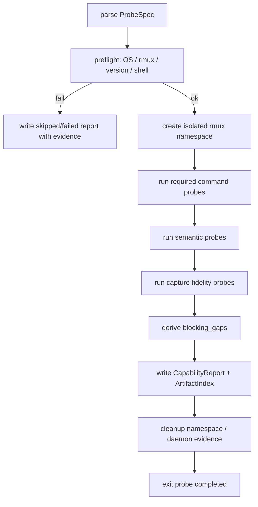

# rmux-capability-gate feature design

## 0. 术语约定

| 术语 | 定义 | 防冲突结论 |
|---|---|---|
| capability report | `rmux-capability-gate` 在 Windows 真机上产出的 YAML/JSON 事实报告，记录 Rmux command/semantic 支持状态、evidence artifact 和 blocking gaps。 | roadmap 第 4.2 节已有 `MuxCapabilityReport`，本 feature 沿用该名词，不把示例值当实测结论。 |
| blocking gap | `required=true` 且 `unsupported`，或 `partial` / `workaround` 但没有结构化且已接受 workaround evidence 的能力缺口。 | 与 roadmap 的 `blocking_gaps` 一致；仅用于阻止后续实现，不自动决定路线废弃。 |
| probe completed | 探针完成一次事实采集并落盘 report/artifacts，不等于 Rmux 路线获批。 | 与 `route approved` 明确区分；后续实现不能直接依赖本 item。 |
| route approved | 后续 `rmux-route-approval` 基于 capability report 和 owner 决策落盘的路线批准。 | 本 feature 不产出该状态，也不修改 roadmap 后续 item。 |
| evidence artifact | 每个 command/semantic probe 的原始或归一化输出、stderr、exit code、timing、环境摘要和已脱敏证据文件。 | 参考 `scripts/probe_codex_pane_status.py` 的 artifacts/run 目录风格，但新建独立 Rmux probe，不扩写该 932 行脚本。 |
| capture format fidelity | `capture-pane` 输出在尾部空白、CSI/OSC/非 CSI 转义、wrapping、宽字符、last-N 截断等维度与当前 pane capture consumer 和 provider pane parser 预期兼容。 | roadmap 已指出 `capture_last_n_lines` 粒度不够；本 feature 必须单列格式保真语义证据，并明确哪些维度由 parser 归一化、哪些必须靠 Rmux 与 tmux 输出平价证明。 |

术语 grep 结果：`.codestable` / `docs` / `scripts` / `lib` / `test` 中已有 `MuxCapabilityReport`、`capability report`、`probe completed`、`capture_format_fidelity_for_provider_completion`，均来自本 roadmap 或旧 psmux 计划；没有发现会冲突的其他定义。

## 1. 决策与约束

### 需求摘要

本 feature 要做的是：为 Rmux 原生 Windows 路线建立一个可重复执行的黑盒 capability gate，产出结构化 capability report、evidence artifacts 和 blocking gap 判定。它服务于 roadmap 第一个最小闭环：先证明 Rmux 是否具备 CCB 依赖的 tmux-family 命令与语义，再决定是否进入后续 route approval。

成功标准：

- Windows 真机上可以运行 probe，并为 command set 与 semantic set 生成 report。
- report 能区分 `supported` / `partial` / `unsupported` / `workaround`，并为每项附 evidence 路径；`partial` / `workaround` 必须使用结构化 `workaround` 字段，不允许只靠 `notes` 表达。
- `blocking_gaps` 可由 report 规则机械推导：required unsupported，或 `partial` / `workaround` 但 `workaround.accepted != true` 的能力必须进入 gap list。
- capture 格式保真有独立 evidence，不被粗粒度 `capture_last_n_lines` 掩盖；fixture 单测与 Windows 真机 Rmux 输出证据不可互相替代。
- Rmux daemon 行为只作为 evidence 采集，不在本 feature 定义 daemon ownership；preflight 必须记录 probe 前 daemon 预状态。

明确不做：

- 不接入 `RmuxBackend`，不修改 `lib/terminal_runtime/backend_selection.py`，不新增 `runtime.mux.backend` / `CCB_MUX_BACKEND`。
- 不把 `rmux` 伪装成 `tmux` 接入主链路；probe 可调用 Rmux CLI，但主链路保持 tmux-only。
- 不批准 Rmux 路线；`route approved` 只能由后续 `rmux-route-approval` item 产生。
- 不重写 provider completion parser；只用 fixture/evidence 证明 capture 输出不会让现有解析预期静默漂移。
- 不解决 Windows shell/log builder、Job Object、provider session payload 或 Rmux daemon ownership；只采集相关事实。

### 复杂度档位

本 feature 走“项目内部工具”默认组合，但有三处偏离：

- 健壮性 = L3（偏离默认 L2）：probe 面向第三方二进制和 Windows 真机环境，失败路径必须结构化记录，不能靠异常堆栈当报告。
- 可测试性 = verified（偏离默认 testable）：blocking gap、report schema、redaction、capture fidelity 比较必须有单元测试；Windows 真机 probe 是手工/集成 evidence。
- 安全性 = validated（偏离默认 trusted）：artifacts 可能包含 token、路径、provider 输出或环境片段，必须 redaction，且不记录完整环境变量。

### 关键决策

1. 独立 probe 脚本，而不是扩写现有 Codex pane probe。
   - 现状：`scripts/probe_codex_pane_status.py` 已承担 Codex pane 状态采样、事件、metrics 和 tmux 操作，文件约 932 行。
   - 决策：新增 Rmux capability probe 入口，复用证据风格，不复用脚本职责。
   - 原因：KISS/SRP；Rmux capability 是 mux 黑盒验证，不是 provider pane status 解析。

2. command probe 与 semantic probe 分离。
   - command probe 验证 Rmux CLI 命令是否存在、参数是否接受、输出是否可解析。
   - semantic probe 验证 CCB 依赖的行为是否成立，例如 namespace 隔离、pane id 稳定、layout/reflow roundtrip、capture fidelity。
   - 原因：命令存在不等于语义满足，尤其是 ConPTY capture、layout 和 daemon 生命周期。

3. report 是后续 feature 的只读事实输入。
   - `rmux-backend-core` 之后必须消费 capability report，但本 feature 不创建运行时接口。
   - report 示例值不能作为 Rmux v0.8.0 的默认判断；真实状态只来自 Windows probe。

4. daemon 只采 evidence，不定 ownership。
   - 本 feature 记录 Rmux daemon 可发现性、启动副作用、崩溃/清理观察和共享/项目边界线索。
   - daemon discovery/start/health 的 ownership 由后续 `rmux-daemon-ownership-boundary` 设计。

### Top 3 风险与缓解

1. **假阳性支持**：命令返回 0 但 CCB 语义不成立。
   - 缓解：每个 required command 至少有一个语义场景覆盖；layout/reflow 命令映射到当前代码触点。

2. **capture 解析漂移被漏掉**：`capture-pane` 能输出文本，但尾部空白、CSI/OSC/非 CSI 转义、wrapping、宽字符或 last-N 行截断改变 provider completion 判断。
   - 缓解：单列 `capture_format_fidelity_for_provider_completion`，用 golden fixtures 比较归一化输出与原始字节/格式差异，并用 Windows 真机 artifacts 证明 Rmux 真实输出；fixture 只证明 parser-facing contract，不证明 Rmux 会产出同样输入。

3. **Windows 环境证据不可复现**：probe 在某台机器成功但缺少版本、路径、daemon 预状态/副作用和 artifacts。
   - 缓解：preflight 记录 Rmux 版本、Windows 版本、shell、PATH 命中位置、run id、daemon 预状态、artifact index；所有 evidence 路径写入 report。

### 非显然依赖与关键假设

- 需要原生 Windows 真机或 Windows runner；WSL 不能替代 ConPTY / named pipe / Rmux daemon 行为。
- Rmux CLI 已安装且可由 `rmux` 或用户传入路径定位；版本下限由 probe 记录，不在 design 假设通过。
- probe 可以创建隔离 namespace/session，并在结束时清理；清理失败必须作为 evidence，而不是吞掉。
- 当前 provider completion parser 的 fixture 入口在 implement 阶段由代码事实确定；design 只锁定比较维度。

## 2. 名词与编排

### 2.1 名词层

#### 现状

- `TerminalBackendSelection`（`lib/terminal_runtime/backend_selection.py`）当前只有 `selected == 'tmux'` 分支；本 feature 不改该入口。
- `TmuxBackend`（`lib/terminal_runtime/tmux_backend.py`）通过 `_tmux_base()` / `_tmux_run()` 调 tmux CLI；`tmux_base()` 固定 `tmux` executable，默认 `-f /dev/null` 但可由 `CCB_TMUX_CONFIG` 覆盖。
- send 语义依赖 `load-buffer` / `paste-buffer` / `delete-buffer` / `send-keys`（`lib/terminal_runtime/tmux_send.py`）。
- logging 语义依赖 `pipe-pane`，当前命令使用 Unix-only `tee -a`（`lib/terminal_runtime/tmux_logs.py`）。
- layout/reflow/reload 触点包括：
  - `materialize_topology.py`：`resize-pane`、`split-pane`、`respawn-pane`、user options/title。
  - `agent_window_reflow.py`：`select-layout`、`swap-pane`、`list-panes` 和 pane geometry/user options。
  - `move_patch_agents.py`：`move-pane`。
  - `remove_patch_agents.py`：`select-layout -E`。
- 现有 probe 风格来自 `scripts/probe_codex_pane_status.py`：preflight、run dir、artifacts、JSON/JSONL、redaction、summary、metrics；测试通过 import script 直接测函数（`test/test_codex_pane_status_probe.py`）。

#### 变化

新增名词，不改主链路名词：

- `ProbeSpec`：一次 probe 的配置输入，包括 `rmux_bin`、`work_root`、`namespace_id`、超时、keep/cleanup 策略、report 输出路径。
- `CapabilityReport`：roadmap 第 4.2 节 `MuxCapabilityReport` 的落地 schema，包含 `backend_impl`、`version`、`platform`、`probe_status`、`commands`、`semantics`、`blocking_gaps`、`artifact_index`。
- `CommandProbeResult`：单条 Rmux command 的执行事实，包含 `required`、`status`、`evidence`、`returncode`、`stdout/stderr digest`、`workaround`、`degrade_impact`、`consequence`、`notes`。
- `SemanticProbeResult`：跨命令行为验证结果，包含场景名、required、status、evidence、workaround、degrade_impact、consequence、notes。
- `WorkaroundEvidence`：`null` 或 `{id, description, evidence, accepted}`。`partial` / `workaround` 必须显式写该字段；`notes` 不参与 blocking gap 推导。
- `degrade_impact`：`core-lifecycle | core-io | parser-fidelity | degradable-ui | diagnostic | unknown`。它不替代 blocking gap 推导，只给 route approval 判断“缺这个能力的用户可见后果和是否可优雅降级”。
- `consequence`：当该 command/semantic unsupported/partial/workaround 时的用户可见后果，例如“无法创建 namespace”、“UI copy-mode 快捷键不可用但核心 ask 不受影响”、“diagnostics 缺少客户端列表”。
- `ArtifactIndex`：report 到 artifacts 的索引，必须只含相对路径，记录 artifact kind、来源 probe、redaction 状态和 size/hash；每个 `commands.*.evidence` / `semantics.*.evidence` 必须能在 index 中找到。
- `BlockingGap`：可机械推导的缺口记录，包含 `kind=command|semantic`、`name`、`reason`、`required`、`status`、`evidence`、`degrade_impact`、`consequence`。

接口示例：

```yaml
# 来源：roadmap 4.2 MuxCapabilityReport，本 feature 落地为真实 probe 输出
backend_impl: rmux
version: "0.8.0"
platform: windows
generated_at: "2026-07-06T00:00:00Z"
probe_status: completed   # completed | skipped | failed
preflight:
  daemon_pre_state:
    detected: true
    scope: user
    evidence: artifacts/preflight/daemon-pre-state.json
commands:
  capture-pane:
    required: true
    status: supported
    evidence: artifacts/commands/capture-pane.json
    workaround: null
    degrade_impact: parser-fidelity
    consequence: "capture output feeds pane status parsing and ccb ask completion evidence"
semantics:
  capture_format_fidelity_for_provider_completion:
    required: true
    status: partial
    evidence: artifacts/semantics/capture-format-fidelity.json
    workaround:
      id: csi-policy-normalization
      description: "Rmux capture includes CSI sequences that current parser path can normalize without status drift"
      evidence: artifacts/semantics/capture-format-fidelity.json
      accepted: false
    degrade_impact: parser-fidelity
    consequence: "provider pane status may be misclassified if Rmux capture differs from tmux parser-facing text"
    notes: "CSI policy differs; workaround required before route approval"
artifact_index:
  - path: artifacts/commands/capture-pane.json
    kind: command
    probe: capture-pane
    name: capture-pane
    redacted: true
    size_bytes: 1024
  - path: artifacts/semantics/capture-format-fidelity.json
    kind: semantic
    probe: capture-format-fidelity
    name: capture_format_fidelity_for_provider_completion
    redacted: true
    size_bytes: 2048
blocking_gaps:
  - kind: semantic
    name: capture_format_fidelity_for_provider_completion
    reason: required partial without accepted workaround
    evidence: artifacts/semantics/capture-format-fidelity.json
    degrade_impact: parser-fidelity
    consequence: "ccb ask completion/status detection can silently drift"
```

command catalog 必须覆盖 roadmap 第 4.2 节列出的 CCB 相关命令：`start-server`、`new-session`、`attach-session`、`has-session`、`kill-session`、`kill-server`、`list-windows`、`new-window`、`rename-window`、`select-window`、`kill-window`、`move-pane`、`resize-pane`、`select-layout`、`swap-pane`、`split-window`、`list-panes`、`display-message`、`set-option`、`set-window-option`、`set-hook`、`bind-key`、`send-keys`、`load-buffer`、`paste-buffer`、`delete-buffer`、`capture-pane`、`pipe-pane`、`respawn-pane`、`list-clients`、`refresh-client`。其中 `bind-key` 按 roadmap 示例 `required=false` 处理，但仍要 probe。

semantic catalog 必须覆盖：session survival、namespace isolation、attach/reattach、window policy、layout/reflow、pane id stability、user options/title、capture last N lines、capture format fidelity、buffer paste、Ctrl-C/Ctrl-D、pane death、kill session cleanup、daemon crash/cleanup evidence、provider/process distinction workaround evidence。

status / workaround invariant：

- `status=supported`：原生命令或语义满足 required behavior，`workaround` 必须为 `null`。
- `status=unsupported`：能力不存在或无法验证，required 项必须进入 `blocking_gaps`。
- `status=partial`：原生命令存在但语义不完整，必须写 `workaround`；只有 `workaround.accepted=true` 才能避免 blocking gap。
- `status=workaround`：原生能力不满足，但替代路径通过 probe 证明可用，必须写 `workaround.accepted=true`；否则进入 blocking gap。
- blocking gap 推导只读取 `required`、`status`、`workaround.accepted` 和 `evidence`，不读取 `notes`。
- 每个 command/semantic 都必须写 `degrade_impact` 和 `consequence`；route approval 使用它们判断缺口严重度，probe 不基于它们批准路线。

capture fidelity 的最小 parser-facing contract：

- 必须用 golden fixture 调用现有 `provider_pane_status.codex_pane.normalize_screen()` + `parse_codex_pane_status()`，证明 Codex completion/status 判定不因 parser-facing text 漂移。
- 必须用 golden fixture 调用现有 `provider_pane_status.claude_pane.normalize_screen()` + `parse_claude_pane_status()`，至少覆盖 active/tool/terminal summary 不被 parser-facing text 漂移破坏。
- Codex/Claude 是当前 `provider_pane_status` 下全部现存 pane-status parser；本 gate 覆盖全部现存 pane-status parser。没有 pane-status parser 的 provider 不在本 feature 的 parser-facing 范围内。
- 必须记录两类 parser 入口证据：
  - consumer-strip 路径：`tmux_panes_runtime/queries_runtime/service.py` 当前 `get_pane_content()` 对 `capture-pane` stdout 先走 terminal runtime `strip_ansi` 后返回文本，再进入 parser-facing 比较。
  - direct-stdout 路径：`ccbd/project_view/service.py` 当前 `pane_text_hint()` 直接取 `capture-pane` stdout 后交给 Codex/Claude parser。
- Codex/Claude parser 的 `normalize_screen()` 内部又走一次 CSI-only `strip_ansi`。probe evidence 要区分 raw bytes、decoded text、consumer-facing text、direct-stdout parser-facing text，并确认两处 CSI stripping 行为一致或记录差异。
- 归一化责任分层必须写入 probe evidence：
  - 尾部空白：Codex/Claude `normalize_screen()` 每行 `rstrip()`，parser 层可吸收行尾空白差异。
  - CSI ANSI：当前 `strip_ansi` 只剥离 CSI 序列，terminal runtime consumer 与 parser 层都可能处理。
  - OSC / 非 CSI 转义：当前 `strip_ansi` 不剥离，不能假设 parser 能吸收；必须作为失败样例或真实 Rmux artifact 风险记录。
  - wrapping：当前 parser 不重建逻辑行，必须靠 Rmux 与 tmux capture 物理行结构平价证明。
  - 宽字符：当前 parser 不校正列宽，必须靠 Rmux 与 tmux capture 宽字符行结构平价证明。
  - last-N 截断：当前 parser 只看 capture 后的 recent tail，必须证明 Rmux `-S -N` 语义与 tmux 对 parser-facing tail 的影响等价。
- fixture 单测至少一组失败样例必须落在当前 normalize 兜不住的维度：wrapping、宽字符、OSC / 非 CSI 转义三者之一，不能只用 CSI ANSI 失败样例。
- 合成 golden fixture 只能证明 parser-facing contract；Windows 真机 CMD-003 artifacts 才能证明 Rmux 真实 capture 输出是否落入这些输入形态。二者不可互替。

##### Interface 设计检查

- Module：Capability Gate，新增独立 probe/report module；现状无 Rmux probe。
- Interface：CLI 输入为 probe args；输出为 `CapabilityReport` + artifacts。caller 只依赖 report schema、status 语义、blocking gap 规则，不依赖内部命令编排。
- Seam：seam 位于实现前事实闸门。后续 route approval、backend core 和 diagnostics 读取 report，不调用 probe 内部函数。
- Depth / locality：probe 隐藏 Rmux CLI、Windows shell、daemon 副作用和 evidence 采集细节；缺口判断集中在 report 生成处，不散落到后续 feature。
- Dependency strategy：true external。Rmux 是第三方本地二进制/daemon，必须黑盒验证。
- Adapter：无 runtime adapter；单元测试可用 fake command runner，但这不是生产 adapter。
- Test surface：report schema、blocking gap 推导、redaction、artifact index、capture fixture comparison 可单测；真实 Rmux 行为由 Windows probe evidence 验证。

### 2.2 编排层

#### 主流程图



#### 现状

当前没有 Rmux capability probe。旧 psmux 文档要求 capability report 后才能实现，但没有落地脚本。现有 `probe_codex_pane_status.py` 是 provider pane 状态 probe，流程为 preflight → tmux session/pane → sample capture/log → metrics/report → cleanup；它的证据组织方式可参考，但目标和语义不同。

#### 变化

新增 probe 编排：

1. **preflight**：确认平台是原生 Windows；定位 Rmux executable；记录 `rmux --version`、Windows 版本、shell、work root、run id；失败时仍写 report，状态为 probe 未完成并给出原因。
2. **isolated namespace**：用唯一 namespace/session/window 名称运行，避免污染用户现有 Rmux session；所有创建动作写 evidence。
3. **command probes**：按 command catalog 执行最小命令和必要参数组合，记录 returncode、stdout/stderr 摘要、输出文件、status。
4. **semantic probes**：组合多个 command 验证 CCB 行为，如 terminal close keeps session、layout projection、pane id stability、user option/title roundtrip、buffer paste、Ctrl-C/Ctrl-D。
5. **capture fidelity probes**：构造 golden pane 输出，覆盖尾部空白、CSI/OSC/非 CSI 转义、wrapping、宽字符、last-N 截断；比较 raw bytes、decoded text、consumer-facing text、parser-facing text，并穿过 Codex/Claude pane parser。
6. **gap generation**：根据 `required/status/workaround.accepted/evidence` 生成 blocking gaps，并把 `degrade_impact` / `consequence` 复制到 gap；不让 route approval 逻辑混入 probe。
7. **artifact/report 输出**：写 `probe_status`、`artifact_index` 和相对 evidence 路径；每个 evidence 必须能从 index 反查。
8. **cleanup**：清理 session/namespace；如果 Rmux daemon 是 shared service，不强杀 daemon，只记录 daemon health/cleanup evidence。清理失败进入 report notes。

#### 流程级约束

- 错误语义：单项 probe 失败不应中断整个 probe；除非 preflight 或 namespace 创建失败。单项失败写 `unsupported` 或 `partial` 并附 evidence。
- 幂等性：同一 work root 下每次使用独立 run dir；namespace 名称含 run id；cleanup 只作用于本次创建的 session/window/pane。
- 并发：允许多个 run dir 并存；namespace id 必须避免冲突。
- 可观测点：每条 command/semantic 都有 artifact、`degrade_impact` 和 `consequence`；summary 中列出 version、platform、duration、probe_status、daemon pre-state、blocking gap count。
- redaction：stdout/stderr、环境摘要、pane capture、raw logs 写盘前必须 redaction；不记录完整环境变量。
- route 分离：report 必须显示 `probe_status=completed|skipped|failed`，但不得写 `route_approved=true`。

### 2.3 挂载点清单

本 feature 不引入 runtime 挂载点，不改变用户日常 `ccb` 行为。真实挂入点仅限 probe/report 入口：

- `scripts` probe CLI：新增 Rmux capability probe 命令入口；删除后用户无法运行本 gate。
- `test` 单元测试入口：新增 probe schema/gap/redaction/capture fixture 测试；删除后 gate 失去自动校验。
- roadmap drafts/report 产物约定：`.codestable/roadmap/windows-rmux-native-backend/drafts/` 下保存 capability report/evidence；删除后 route approval 没有事实输入。

明确不列为挂载点：内部 helper、report dataclass、fake runner、artifact writer、实现中可能新增的 fixtures 文件。这些是实现细节，删除单个 helper 不等于 feature 在系统视角消失。

### 2.4 推进策略

1. **schema 骨架**：定义 probe 输入、report 输出、status、blocking gap 推导的最小结构。
   - 退出信号：无 Rmux 环境时也能用 fake result 生成合法 report fixture。
2. **命令 probe 编排**：建立 command catalog 和逐项执行/记录机制。
   - 退出信号：单元测试证明 command status、required flag、evidence 路径和失败分类可预测。
3. **语义 probe 编排**：把 session/window/layout/send/capture/logging 语义拆成可独立记录的 scenario。
   - 退出信号：fake runner 能覆盖 supported/partial/unsupported/workaround 四类 semantic。
4. **capture fidelity 比较**：加入 golden 输出构造、格式比较维度、归一化责任分层和 parser-facing 验证。
   - 退出信号：测试覆盖尾部空白、CSI/OSC/非 CSI 转义、wrapping、宽字符、last-N 截断至少一组失败和一组通过；失败样例至少一个落在 wrapping、宽字符、OSC / 非 CSI 转义，并穿过 Codex/Claude pane parser。
5. **artifact/report 输出**：接通 CLI 参数、run dir、redaction、artifact index 和 report 写盘。
   - 退出信号：每个 evidence 路径都能从 `artifact_index` 反查，且 artifact 只含相对路径和已脱敏内容。
6. **Windows 真机 runbook 与 cleanup evidence**：接通 Windows probe 命令、隔离 namespace、daemon 预状态、cleanup evidence 和 daemon 行为记录。
   - 退出信号：在 Windows 真机上能生成 capability report 和 artifacts，且 preflight 记录 daemon 预状态；无 Windows evidence 时不能进入 route approval。
7. **验证与回归**：补齐 YAML 校验、probe 单测、既有 probe 回归和 Windows evidence 归档说明。
   - 退出信号：必跑命令通过；若 Windows 真机不可用，design/QA 明确阻塞 route approval 而不是伪造通过。

### 2.5 结构健康度与微重构

##### 评估

- 文件级 - `scripts/probe_codex_pane_status.py`：约 932 行，职责是 Codex pane status probe。虽然证据风格可参考，但本 feature 不应继续扩写该文件，否则会混合 provider 状态解析与 mux capability gate。
- 文件级 - `lib/terminal_runtime/backend_selection.py`、`tmux_send.py`、`tmux_logs.py`、project namespace runtime 文件：本 feature 只读这些代码事实，不修改主链路。
- 目录级 - `scripts/`：当前约 13 个文件，本次预计新增 1 个 probe 脚本；未达到需要重组目录的阈值。
- 目录级 - `test/`：当前测试文件很多，但仓库既有模式是根目录下 `test_*.py`，本次新增 1 个 focused probe test；重组测试目录会扩大范围。
- compound convention：`.codestable/compound` 无“目录/命名/归属”相关沉淀命中。

##### 结论：不做微重构

原因：本 feature 可以通过新增独立 probe 脚本和测试完成，不需要移动现有文件；对 `scripts/` 和 `test/` 做目录重组会超出 capability gate，且无法用“只搬不改行为”低风险证明必要性。

##### 超出范围的观察

- `scripts/probe_codex_pane_status.py` 已偏长，后续若继续增加 provider/mux 探针，应走 `cs-refactor` 或建立 `scripts/probes/` 目录约定；本 feature 不阻塞。

## 3. 验收契约

### 3.1 关键场景清单

| ID | 输入 / 触发 | 期望可观察结果 | 证据类型 |
|---|---|---|---|
| AC-001 | 在无 Rmux 或非 Windows 环境运行 schema/gap 单测 | 不执行真实 Rmux；report/gap/redaction/capture 比较逻辑可由 fake runner 验证 | pytest |
| AC-002 | Windows 真机运行 probe preflight | report 记录 platform、Rmux executable、version、shell、run id；失败时给出可行动原因 | command transcript / report |
| AC-003 | command catalog probe | report 覆盖 roadmap 第 4.2 节 command set，尤其 `resize-pane`、`select-layout`、`swap-pane`、`move-pane`、`load-buffer`、`paste-buffer`、`pipe-pane` | capability report / artifacts |
| AC-004 | semantic probe | report 覆盖 session survival、namespace isolation、attach/reattach、layout/reflow、pane id、user options/title、buffer paste、Ctrl-C/Ctrl-D、pane death、cleanup | capability report / artifacts |
| AC-005 | capture fidelity probe | evidence 比较尾部空白、CSI/OSC/非 CSI 转义、wrapping、宽字符、last-N 截断，并穿过 consumer-strip 与 direct-stdout 两类 Codex/Claude parser 入口；fixture 至少一个失败样例落在 normalize 兜不住的维度；fixture 与真实 Rmux artifacts 不可互替 | fixture test / artifacts |
| AC-006 | required unsupported，或 `partial` / `workaround` 但 `workaround.accepted != true` | `blocking_gaps` 中出现对应 gap，gap 带 `degrade_impact` / `consequence`，probe 退出仍是事实采集完成 | pytest / report |
| AC-007 | artifact 写盘 | 每个 report evidence 路径存在、相对 run dir 可解析、能在 `artifact_index` 反查、敏感 token 被 redaction | pytest / diff review |
| AC-008 | daemon pre-state 与 cleanup | preflight 记录 probe 前 daemon 预状态；本次创建的 Rmux session/window/pane 被清理；daemon 行为只记录 evidence，不强行定义 ownership | command transcript / report |

### 3.2 明确不做的反向核对项

- 代码 diff 不应新增 `RmuxBackend` production implementation。
- `lib/terminal_runtime/backend_selection.py` 不应新增 `rmux` 选择分支。
- 不应新增或启用 `runtime.mux.backend` / `CCB_MUX_BACKEND` 运行时配置。
- report 不应包含 `route_approved=true` 或等价字段。
- provider completion parser 源码不应因本 feature 被重写；只允许新增/使用 fixture 和比较证据。
- 主链路不应把 `rmux` executable 当作 `tmux` executable 的透明替换。

### 3.3 Acceptance Coverage Matrix

| Scenario | Covered By Step | Evidence Type | Command / Action | Core? |
|---|---|---|---|---|
| AC-001 fake runner 单测可验证 schema/gap | S1, S2, S3 | pytest | `python -m pytest -q test/test_rmux_capability_probe.py` | yes |
| AC-002 preflight 记录 Windows/Rmux 环境 | S6 | command / report | `python scripts/probe_rmux_capability.py --work-root .codestable/roadmap/windows-rmux-native-backend/drafts/rmux-capability-gate` | yes |
| AC-003 command catalog 全覆盖 | S2, S5, S6 | report / artifacts | 查看 capability report `commands` 和 artifacts | yes |
| AC-004 semantic catalog 全覆盖 | S3, S5, S6 | report / artifacts | 查看 capability report `semantics` 和 artifacts | yes |
| AC-005 capture fidelity 不被粗粒度覆盖 | S4, S6 | pytest / artifacts | fixture test + Windows probe artifacts，二者不可互替 | yes |
| AC-006 blocking gap 可机械推导且有 degrade 语境 | S1, S2, S3, S7 | pytest / report | 单测 + report `blocking_gaps` / `degrade_impact` / `consequence` | yes |
| AC-007 artifact redaction、相对路径和 index 反查 | S5, S7 | pytest / diff review | redaction 单测 + artifact index review | yes |
| AC-008 daemon pre-state 与 cleanup evidence | S6 | command transcript / report | Windows probe preflight + cleanup section | no |

### 3.4 DoD Contract

| ID | 要求 | 证据 | 阻塞级别 |
|---|---|---|---|
| DOD-DESIGN-001 | design/checklist/review 完整，且 roadmap 4.2 契约未被绕开 | design review | blocking |
| DOD-IMPL-001 | checklist steps 全部完成，report schema、gap 规则、degrade 语境、redaction、capture fidelity 比较均有测试 | checklist / pytest | blocking |
| DOD-IMPL-002 | Windows 真机 probe 产出 capability report 和 artifacts；若缺 Windows evidence，不能进入 route approval | command transcript / report | blocking |
| DOD-REVIEW-001 | code review passed 且无 unresolved blocking | review report | blocking |
| DOD-QA-001 | QA 覆盖单测、YAML 校验、Windows probe evidence 和反向范围核对 | QA report | blocking |
| DOD-ACCEPT-001 | acceptance 确认 roadmap item 可进入 `done`，但不批准后续路线 | acceptance report | blocking |

Validation Commands:

| ID | 命令 | 目的 | 核心性 | 失败处理 |
|---|---|---|---|---|
| CMD-001 | `python ".codestable/tools/validate-yaml.py" --file ".codestable/features/2026-07-06-rmux-capability-gate/rmux-capability-gate-checklist.yaml" --yaml-only` | checklist YAML 合法性 | core | fix-or-block |
| CMD-002 | `python -m pytest -q test/test_rmux_capability_probe.py` | probe schema/gap/redaction/capture fixture 单测 | core | fix-or-block |
| CMD-003 | `python "scripts/probe_rmux_capability.py" --work-root ".codestable/roadmap/windows-rmux-native-backend/drafts/rmux-capability-gate"` | Windows 真机 capability report；命令失败或缺 report/artifacts 必须阻塞，report 内 gaps 只记录事实并交给 route approval | core | fix-or-block |
| CMD-004 | `python -m pytest -q test/test_codex_pane_status_probe.py` | 确认新增 probe 没破坏既有 probe 相关测试 | supporting | fix-or-block |

Required Artifacts：feature design review、checklist、probe 单测输出、Windows 真机 capability report、artifact_index、artifacts 目录、daemon pre-state evidence、命令 transcript、QA/acceptance 报告。

### 3.5 自我批判结论

- 可证伪性：所有核心场景均落到 report 字段、artifact 文件或 pytest 命令；避免“能跑”“兼容”这类弱标准。
- 步骤原子性：schema、command、semantic、capture fidelity、Windows runbook、验证分开；每步能独立失败和定位。
- 最弱依赖：Windows 真机是最大外部依赖，已写成 DOD-IMPL-002；没有该证据时不能进入 route approval。
- 证据完整性：capture fidelity、degrade impact/consequence、daemon pre-state 和 cleanup evidence 单列，避免被 supported 示例值锚定。
- 清洁度规则：不允许临时 TODO/FIXME、未 redaction 原始 token、注释掉代码、死 import、默认跑真实 Windows probe 的单测。

## 4. 与项目级架构文档的关系

本 feature 产生的是事实输入，不直接改变 runtime architecture。acceptance 阶段需要根据 probe 结果判断是否回写：

- 如果 required gaps 为 none 且 workaround 可接受：后续 `rmux-route-approval` 应把“Rmux capability gate 通过事实采集”作为输入，必要时通过 ADR 记录 Rmux 继续路线。
- 如果出现 blocking gaps：应在 roadmap draft 或 ADR 中记录阻塞原因，防止后续 feature 绕过 gate。
- 如果 capture fidelity 或 daemon evidence 暴露长期约束：后续 route approval / daemon ownership / send-capture design 应提炼到 architecture 或 compound，而不是只链接本 design。

本 feature 不更新 `docs/ccbd-windows-psmux-plan.md` 的 superseded 状态；该动作应在 route approval 后由 docs/domain 流程处理。
