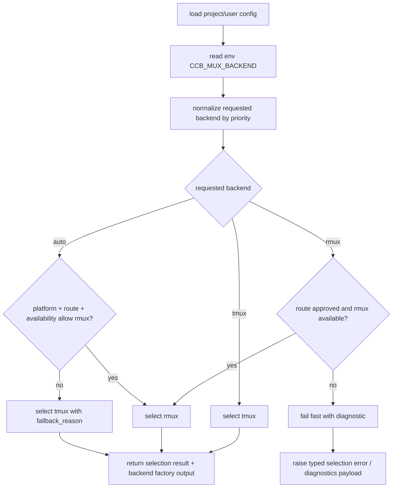

# backend-resolver-opt-in-contract feature design

## 0. 术语约定

| 术语 | 定义 | 防冲突结论 |
|---|---|---|
| mux backend | CCB terminal runtime 使用的 tmux-family 多路复用实现，当前只有 tmux，后续可接 Rmux。 | 不等同 ccbd control-plane transport；本 feature 不处理 AF_UNIX/TCP RPC。 |
| requested backend | 用户或环境声明的 `tmux`、`rmux`、`auto`。 | 只表示请求，不保证最终可用。 |
| effective backend | resolver 通过平台、可用性、route approval 和 fallback 规则后实际选择的 backend。 | 下游启动、diagnostics、doctor 读取这个结果。 |
| route approved | `rmux-route-approval` 落盘的 canonical approval ref 通过。 | 不从 `probe_status=completed` 推断。 |
| selection result | 结构化选择结果，包含 source、requested/effective、fallback、failure reason、diagnostics。 | 替代裸字符串 `tmux` / `rmux` 在调用链中传播。 |

术语 grep 结果：生产代码现有 `backend_selection.py` 只有 `selected == 'tmux'` 分支；未发现 `runtime.mux.backend` 或 `CCB_MUX_BACKEND` 现有实现。

## 1. 决策与约束

### 需求摘要

本 feature 定义 Rmux 后续接入前的 backend resolver 契约：用户如何 opt-in，平台默认如何保持 tmux，`auto` 何时允许选 Rmux，显式选择失败时如何 fail-fast，以及 ping / doctor / diagnostics 如何展示选择原因。它只建立 selection contract、配置 schema、diagnostics payload 和 tmux 保持不变的测试基线，不实现 Rmux backend 本体。

成功标准：

- `runtime.mux.backend = "tmux" | "rmux" | "auto"` 被 project / user config 解析，env `CCB_MUX_BACKEND` 可作为低优先级临时输入。
- resolver 返回与 roadmap §4.0 同构的 successful `MuxBackendSelection`，包含 `backend_impl`、requested/effective/source/fallback/diagnostic 字段；失败路径使用 typed selection error 或独立 diagnostics payload，不把 success schema 做成 nullable。
- Linux/macOS/WSL 默认仍是 tmux；Windows 在 route approval 缺失时不得自动启用 Rmux。
- 显式请求 `rmux` 但 Rmux 不可用、route 未批准或 required capability gap 未满足时 fail fast，不静默 fallback 到 tmux。
- `auto` 可以 fallback，但必须记录 `fallback_used=true` 和可读原因，doctor / ping 能展示。
- `get_backend_for_session()` 继续兼容旧 tmux session 字段；backend-neutral session payload 的迁移留给 `provider-runtime-backend-session-contract`。

明确不做：

- 不新增 `RmuxBackend`、Rmux CLI adapter、transport adapter、provider session 迁移。
- 不启动或运行 Rmux probe；只读取 route approval / capability summary 的稳定 ref。
- 不改变现有 tmux 默认行为，不让 Linux/macOS/WSL 自动选 Rmux。
- 不把 ccbd control-plane transport 的 `socket_path` 改成 TCP endpoint；该 delta 属于 transport track。
- 不提前修改 packaging/docs，把 Rmux 宣称为 supported。

### 复杂度档位

- 健壮性：L3。显式 `rmux` 的失败必须 fail-fast，`auto` fallback 必须可诊断。
- 可测试性：verified。resolver matrix、config parsing、diagnostics rendering 必须有单元测试。
- 安全性：inherited。仅读取本地配置与 `.codestable` approval ref，不复制 capability artifact payload。

### 方案深度 pre-pass

候选：

- 在 `TerminalBackendSelection.get_backend()` 里直接加 `elif selected == 'rmux'`。
- 新增 backend-neutral resolver result，把配置、env、platform、route approval、capability gate 和 fallback 全部收敛到一个 selection policy。

选择第二种。原因是 roadmap 要求 diagnostics 能解释 source、fallback 与 fail-fast；直接加分支会让调用方继续拿裸 backend，无法稳定区分 requested/effective，也会让 doctor 和 startup 分别重算选择原因。转正条件：后续 `mux-backend-contract` 可把 factory 接口替换为正式 `MuxBackend` protocol，但 selection result 字段必须保持可兼容读取。

### Top 3 风险与缓解

1. **fallback 掩盖 route approval 失败**：显式 `rmux` 永远 fail-fast；只有 `auto` 能 fallback，且必须记录 `fallback_reason`。
2. **配置 schema 与 v2/v3 workflow runtime 混淆**：新增 top-level `runtime.mux.backend`，与 v3 的 `workflow.runtime` 分离；validator 对未知字段继续 fail-closed。
3. **session 恢复被提前迁移导致 provider 漂移**：本 feature 只让 `get_backend_for_session()` 继续兼容旧 tmux 字段；backend-neutral session payload 留给后续 item。

### 非显然依赖与关键假设

- 依赖 `rmux-route-approval` 提供可验证 approval ref；若缺失，显式 `rmux` 报错，`auto` fallback。
- 假设 Rmux availability check 可抽象为 dependency 函数或 provider registry 查询，本 feature 不实现 Rmux 操作命令。
- 假设 project config 和 user config 都经 `load_project_config()` 汇入 `ProjectConfig`，可在该对象上新增 `runtime_mux` 字段。

## 2. 名词与编排

### 2.1 名词层

#### 现状

- `lib/terminal_runtime/backend_selection.py` 的 `TerminalBackendSelection.get_backend()` 只在 `selected == 'tmux'` 时构造 tmux backend；其他值返回 `None`。
- `lib/terminal_runtime/api.py` 用 `_backend_cache` 缓存裸 backend，`get_backend_for_session()` 只传 tmux factory。
- `lib/agents/config_loader_runtime/common.py` 的 `ALLOWED_TOP_LEVEL_KEYS` 没有 `runtime`；v3 validator 只允许 `version/workflow/ui/tool_windows/maintenance`。
- `ProjectConfig` 没有 mux runtime 字段；doctor / ping 当前暴露大量 socket/tmux 字段，但没有 backend selection payload。

#### 变化

新增 project runtime mux 配置：

```yaml
runtime:
  mux:
    backend: tmux | rmux | auto
```

新增结构化 selection result：

```python
class MuxBackendSelection(TypedDict):
    backend_family: Literal["tmux-family"]
    backend_impl: Literal["tmux", "rmux"]
    requested_backend: Literal["tmux", "rmux", "auto"]
    effective_backend: Literal["tmux", "rmux"]
    source: Literal["cli", "project_config", "user_config", "env", "platform_default", "auto_probe"]
    fallback_used: bool
    fallback_reason: str | None
    route_approval_ref: str | None
    capability_report_ref: str | None
    diagnostic: str
```

失败路径不返回半空 success object；使用 typed `MuxBackendSelectionError`，并提供 `to_diagnostics()`：

```python
class MuxBackendSelectionFailure(TypedDict):
    backend_family: Literal["tmux-family"]
    requested_backend: Literal["rmux", "auto"]
    source: Literal["cli", "project_config", "user_config", "env", "platform_default", "auto_probe"]
    failure_reason: Literal["route-not-approved", "rmux-unavailable", "capability-gap", "invalid-request"]
    route_approval_ref: str | None
    capability_report_ref: str | None
    diagnostic: str
```

新增解析对象：

```python
@dataclass(frozen=True)
class RuntimeMuxConfig:
    backend: Literal["tmux", "rmux", "auto"] = "tmux"
```

ProjectConfig 增加 `runtime_mux: RuntimeMuxConfig`，`to_record()` 输出 `runtime: {"mux": ...}`。v2/v3 config validator 都允许 top-level `runtime`，但 `runtime` 下只允许 `mux.backend`，未知字段 fail-closed。

### 2.2 编排层



流程级约束：

- 优先级：显式 CLI override（若调用方传入）> project config > user config > env `CCB_MUX_BACKEND` > platform default。env 是临时 override，但不能压过已落盘 project/user config。
- 平台默认：本 roadmap 落地前全部为 `tmux`；Windows 上只有 `auto` 且 route approved + Rmux available + required capability satisfied 才能选 Rmux。
- 错误语义：显式 `rmux` 不满足前置时抛 typed error 或返回 failure diagnostics，不返回 nullable `MuxBackendSelection`；`auto` 可 fallback 到 tmux 但必须写 `fallback_used=true`。
- 幂等性：相同 config/env/platform/route evidence 输入产生相同 selection result；不在 resolver 内写 `.codestable`。
- 可观测点：startup summary、foreground attach error、ping/doctor、diagnostic bundle 至少展示 requested/effective/source/fallback/failure/route ref；旧 tmux attach 字段继续保留。

### 2.3 挂载点清单

- `lib/terminal_runtime/backend_selection.py` / `api_selection.py`：删除后 opt-in resolver contract 消失。
- `lib/agents/config_loader_runtime/*` 与 `lib/agents/models_runtime/config_runtime/project.py`：删除后 `runtime.mux.backend` 不能从 config 恢复。
- `lib/cli/services/doctor.py`、`lib/cli/services/ping.py`、`lib/cli/render_runtime/ops_views_doctor.py`：删除后用户看不到 backend selection diagnostics。
- `test/test_terminal_backend_selection.py` 与 config validator / doctor tests：删除后无法证明 tmux 默认和 fail-fast/fallback 语义。

### 2.4 推进策略

1. **config schema 与模型**：新增 `RuntimeMuxConfig`，v2/v3 validator 接受 `runtime.mux.backend` 且拒绝未知 runtime 字段。
2. **selection result 与 resolver policy**：让 `TerminalBackendSelection` 或相邻新模块返回 selection result，区分 requested/effective/source/fallback/failure。
3. **route approval / capability gate 输入**：用可注入 reader 判断 route approved 与 capability summary，不直接读示例或运行 probe。
4. **API、startup 与 foreground attach 接入**：`terminal_runtime.api` 保持 tmux 默认，调用方可读取 selection diagnostics；显式 rmux 失败为 typed error；foreground attach 在 tmux-only payload 缺失或 backend 选择失败时带 selection summary 报错。
5. **diagnostics surface**：startup summary、foreground attach error、ping/doctor/diagnostic bundle 展示 selection result；旧 tmux 字段保留。
6. **regression matrix**：覆盖 tmux 默认、env override、project/user config、explicit rmux fail-fast、auto fallback、approved route opt-in。

### 2.5 结构健康度与微重构

- 文件级：`backend_selection.py` 当前职责小，适合扩展 selection dataclass / error，但若 policy 分支超过单屏，应新增 `backend_resolver.py` 承载策略，`backend_selection.py` 只做兼容 facade。
- 配置解析：v2/v3 validator 已分开，避免在一个函数里塞双版本分支；新增 runtime parser 可复用同一 helper。
- 目录级：`terminal_runtime/` 已有 `api_selection.py` 作为薄包装，新增 resolver module 符合现有边界；不需要目录重组。

结论：不做预置微重构；实现时若 resolver policy 超过单屏，允许新增 `terminal_runtime/backend_resolver.py`，但不改变行为语义。

## 3. 验收契约

### 3.1 关键场景清单

| ID | 输入 / 触发 | 期望可观察结果 | 证据类型 |
|---|---|---|---|
| AC-001 | 无配置、无 env | effective backend 为 tmux，fallback_used=false | unit test |
| AC-002 | project config `runtime.mux.backend=rmux` 且 route approval 缺失 | typed selection error，diagnostic 指向缺 approval | unit test |
| AC-003 | env `CCB_MUX_BACKEND=auto` 且 route 未批准或 Rmux unavailable | effective backend 为 tmux，fallback_used=true，fallback_reason 可读 | unit test |
| AC-004 | route approved 且 Rmux available，requested=rmux | selection result 为 rmux，不实例化 tmux backend | unit test |
| AC-005 | v2/v3 config 含未知 `runtime` 字段 | config validation fail-closed，错误路径指向 runtime | config test |
| AC-006 | doctor/ping 运行 | 输出包含 backend selection requested/effective/backend_impl/source/fallback/failure 摘要，旧 tmux socket 字段仍存在 | CLI render test |
| AC-007 | get_backend_for_session 读取旧 tmux session payload | 继续返回 tmux backend，兼容 `tmux_socket_name/path` | unit test |
| AC-008 | foreground attach 遇到 backend selection 失败或 tmux attach payload 缺失 | error / startup summary 包含 selection diagnostics，不只报 tmux session missing | unit test / CLI render test |

### 3.2 明确不做的反向核对项

- 不应新增 production `RmuxBackend`。
- 不应修改 provider session writer 的 canonical payload。
- 不应删除 `namespace_tmux_*`、`tmux_socket_*` 兼容字段。
- 不应在 route approval 缺失时让 Windows 默认走 Rmux。
- 不应运行 Rmux probe 或依赖 drafts 示例 report。

### 3.3 Acceptance Coverage Matrix

| Scenario | Covered By Step | Evidence Type | Command / Action | Core? |
|---|---|---|---|---|
| AC-001 tmux 默认 | S2, S6 | unit test | `pytest test/test_terminal_backend_selection.py` | yes |
| AC-002 explicit rmux fail-fast | S2, S3, S6 | unit test | resolver matrix | yes |
| AC-003 auto fallback 可诊断 | S2, S6 | unit test | resolver matrix | yes |
| AC-004 approved route 选择 rmux | S2, S3, S6 | unit test | injected route/capability reader | yes |
| AC-005 runtime config fail-closed | S1, S6 | config test | config validator tests | yes |
| AC-006 doctor/ping 展示 | S5, S6 | CLI render test | doctor/ping render assertions | yes |
| AC-007 old session 兼容 | S4, S6 | unit test | get_backend_for_session tests | yes |
| AC-008 foreground attach diagnostics | S4, S5, S6 | unit/render test | foreground attach failure assertions | yes |

### 3.4 DoD Contract

| ID | 要求 | 证据 | 阻塞级别 |
|---|---|---|---|
| DOD-DESIGN-001 | design/checklist/review 完整，且遵守 roadmap §4.0 契约 | design review | blocking |
| DOD-IMPL-001 | `runtime.mux.backend` 在 v2/v3 config 中可解析且未知 runtime 字段 fail-closed | config tests | blocking |
| DOD-IMPL-002 | successful selection result 覆盖 backend_impl、requested/effective/source/fallback/route ref；failure 走 typed diagnostics | unit tests / diff review | blocking |
| DOD-IMPL-003 | explicit rmux failure 不 fallback；auto fallback 必须可诊断 | unit tests | blocking |
| DOD-IMPL-004 | tmux 默认与旧 session 字段兼容 | regression tests | blocking |
| DOD-ACCEPT-001 | startup/foreground attach、doctor/ping/diagnostic bundle 能从仓库事实展示 selection result 或 failure diagnostics | CLI output tests | important |

Validation Commands:

| ID | 命令 | 目的 | 核心性 | 失败处理 |
|---|---|---|---|---|
| CMD-001 | `python ".codestable/tools/validate-yaml.py" --file ".codestable/features/2026-07-19-backend-resolver-opt-in-contract/backend-resolver-opt-in-contract-checklist.yaml" --yaml-only` | checklist YAML 合法性 | core | fix-or-block |
| CMD-002 | `python ".codestable/tools/validate-yaml.py" --file ".codestable/roadmap/windows-rmux-native-backend/windows-rmux-native-backend-items.yaml"` | roadmap items 回写合法性 | core | fix-or-block |
| CMD-003 | `python -m pytest -q test/test_terminal_backend_selection.py` | resolver matrix 与旧 session 兼容 | core | fix-or-block |
| CMD-004 | `python -m pytest -q test/test_config_loader.py test/test_v2_phase2_entrypoint.py -k "config or doctor or ping or start or foreground"` | config、startup/foreground attach、diagnostics 回归抽样 | core | fix-or-block |

Required Artifacts：design、checklist、design-review、config parser/model diff、resolver unit tests、doctor/ping diagnostics tests、items.yaml 回写。

### 3.5 自我批判结论

- 可证伪性：每个核心场景都有 selection result、typed error、config validation 或 CLI output 可核对。
- 步骤原子性：config、resolver、route evidence、API/startup、diagnostics、tests 分离。
- 最弱依赖：route approval ref 尚未真实 approved；实现通过 injected reader 和 fail-fast/fallback 测试先锁语义。
- 证据完整性：不需要浏览器/截图；CLI diagnostics 用 render assertions。
- 清洁度规则：不新增临时 TODO、调试输出、注释掉代码、死 import；不复制 capability artifact payload。

## 4. 与项目级架构文档的关系

- 本 feature 消费 roadmap §4.0 Backend resolver / opt-in 契约，不修改该契约含义。
- `provider-runtime-backend-session-contract` 后续负责 provider session payload backend-neutral 迁移；本 feature 只保持旧 tmux session 兼容。
- `mux-backend-contract` 后续负责正式 `MuxBackend` protocol；本 feature 的 selection result 是该 protocol 前的策略层输入。
- 如果 implementation 发现 `runtime.mux.backend` 与 v3 `workflow.runtime` 在用户文档上高度混淆，必须回 `cs-epic` planning/update，不得私自改字段名绕开 roadmap。
