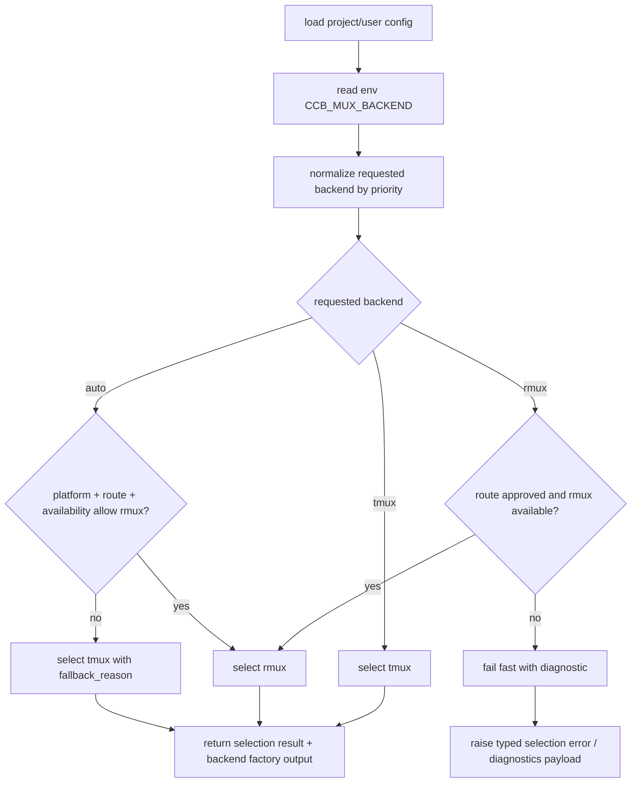

# CodeStable Implementation Review Packet

- root: `E:/GitHub开源项目/TachiKuma/claude_code_bridge`
- unit: `.codestable/features/2026-07-19-backend-resolver-opt-in-contract`
- stage: `implementation`

## Reviewer Mission

Review the implementation as an independent Task agent. Verify the code directly from the packet instead of trusting the implementer summary.

## Stage Focus

scope drift, hidden behavior changes, missing tests, maintainability, edge cases, security, and production safety

## Reviewer Output Contract

- Lead with findings, ordered by severity.
- Include severity (`P0`/`P1`/`P2`/`P3`) and confidence for each finding.
- Reference concrete files, code, docs, or validation evidence when possible.
- If there are no blocking findings, say so explicitly and list residual risks or test gaps.

## Unit Documents
### `.codestable/features/2026-07-19-backend-resolver-opt-in-contract/backend-resolver-opt-in-contract-checklist.yaml`

```
feature: 2026-07-19-backend-resolver-opt-in-contract
created: 2026-07-19

steps:
  - action: "config schema 与模型：新增 runtime.mux.backend，v2/v3 validator 接受 tmux/rmux/auto 并拒绝未知 runtime 字段"
    exit_signal: "ProjectConfig 可恢复 runtime_mux，to_record 输出 runtime.mux；非法 backend 或未知 runtime 字段会 fail-closed"
    status: done
  - action: "selection result 与 resolver policy：定义与 roadmap §4.0 同构的 success schema（含 backend_impl、requested/effective/source/fallback/route ref）和独立 failure diagnostics，并替换裸字符串选择"
    exit_signal: "resolver matrix 能证明 tmux 默认、project/user/env 优先级、explicit rmux fail-fast、auto fallback 和 approved rmux 选择"
    status: done
  - action: "route approval / capability gate 输入：加入可注入 reader，判断 rmux route approved、capability satisfied、rmux available"
    exit_signal: "resolver 不读取 drafts 示例、不运行 probe，缺 approval 时 explicit rmux 报错、auto fallback"
    status: done
  - action: "API 与 startup 接入：terminal_runtime.api 保持 tmux 默认并暴露 selection diagnostics，旧 get_backend_for_session 兼容 tmux session 字段，foreground attach 错误包含 selection summary"
    exit_signal: "旧 tmux session payload 仍能恢复 backend，调用方可读取 selection result，foreground attach 不只报 tmux session missing"
    status: done
  - action: "diagnostics surface：startup summary、foreground attach error、ping、doctor、diagnostic bundle 展示 backend selection 摘要且保留旧 tmux 字段"
    exit_signal: "CLI render tests 能看到 backend_impl、requested/effective/source/fallback/failure，旧 tmux socket 输出不消失"
    status: done
  - action: "regression matrix：补 resolver、config、diagnostics 与旧 session 兼容测试"
    exit_signal: "CMD-003 与 CMD-004 覆盖核心场景并通过"
    status: done

checks:
  - item: "无配置、无 env 时 effective backend 必须为 tmux，fallback_used=false"
    source: 验收契约 AC-001
    status: pending
  - item: "project config runtime.mux.backend=rmux 且 route approval 缺失时必须 typed selection error，不得 fallback"
    source: 验收契约 AC-002
    status: pending
  - item: "env CCB_MUX_BACKEND=auto 且 route 未批准或 Rmux unavailable 时必须 fallback 到 tmux 并记录 fallback_reason"
    source: 验收契约 AC-003
    status: pending
  - item: "优先级必须是 CLI > project config > user config > env CCB_MUX_BACKEND > platform default，env 不得压过已落盘配置"
    source: roadmap §4.0
    status: pending
  - item: "route approved 且 Rmux available 时 requested=rmux 必须选择 rmux 且不实例化 tmux backend"
    source: 验收契约 AC-004
    status: pending
  - item: "successful selection result 必须包含 backend_impl 且 effective_backend 非空；失败路径使用 typed diagnostics，不返回 nullable success schema"
    source: roadmap §4.0
    status: pending
  - item: "v2/v3 config runtime.mux.backend 解析一致；未知 runtime 字段 fail-closed"
    source: 验收契约 AC-005
    status: pending
  - item: "startup/foreground attach、doctor/ping 输出 backend selection diagnostics，同时保留旧 tmux socket 字段"
    source: 验收契约 AC-006
    status: pending
  - item: "foreground attach 在 selection 失败或 tmux attach payload 缺失时必须包含 selection summary"
    source: 验收契约 AC-008
    status: pending
  - item: "get_backend_for_session 继续兼容 tmux_socket_name/path 与 pane_id/tmux_session"
    source: 验收契约 AC-007
    status: pending
  - item: "本 feature 不新增 RmuxBackend、不修改 provider session canonical payload、不运行 Rmux probe"
    source: 明确不做
    status: pending
  - item: "显式 rmux 缺 route approval 或 required capability gap 时 fail-fast；auto fallback 不掩盖原因"
    source: roadmap §4.0
    status: pending

dod:
  commands:
    - id: CMD-001
      command: "python \"C:/Users/Administrator/.codex/plugins/cache/codestable/codestable/1.0.4/skills/cs-onboard/tools/validate-yaml.py\" --file \".codestable/features/2026-07-19-backend-resolver-opt-in-contract/backend-resolver-opt-in-contract-checklist.yaml\" --yaml-only"
      core: true
      failure_handling: fix-or-block
    - id: CMD-002
      command: "python \"C:/Users/Administrator/.codex/plugins/cache/codestable/codestable/1.0.4/skills/cs-onboard/tools/validate-yaml.py\" --file \".codestable/roadmap/windows-rmux-native-backend/windows-rmux-native-backend-items.yaml\""
      core: true
      failure_handling: fix-or-block
    - id: CMD-003
      command: "python -m pytest -q test/test_terminal_runtime_backend_selection.py"
      core: true
      failure_handling: fix-or-block
    - id: CMD-004
      command: "python -m pytest -q test/test_v2_config_loader.py test/test_v3_config_loader.py test/test_v2_start_foreground.py test/test_backend_selection_diagnostics.py -k \"runtime_mux or foreground or backend_selection\""
      core: true
      failure_handling: fix-or-block
  evidence_required:
    - resolver_unit_tests
    - config_validator_tests
    - diagnostics_render_tests
    - old_session_compat_tests
    - items_yaml_diff
  cleanliness:
    debug_output: forbidden
    temporary_todo: forbidden
    commented_code: forbidden
    dead_imports: forbidden
    capability_artifact_payload_copy: forbidden
```

### `.codestable/features/2026-07-19-backend-resolver-opt-in-contract/backend-resolver-opt-in-contract-design-review.md`

```
---
doc_type: feature-design-review
feature: 2026-07-19-backend-resolver-opt-in-contract
status: passed
review_state: passed
review_reason: ""
reviewer_id: ""
reviewed: 2026-07-19
round: 2
---

# backend-resolver-opt-in-contract feature design 审查报告

## 1. Scope And Inputs

- Design: `.codestable/features/2026-07-19-backend-resolver-opt-in-contract/backend-resolver-opt-in-contract-design.md`
- Checklist: `.codestable/features/2026-07-19-backend-resolver-opt-in-contract/backend-resolver-opt-in-contract-checklist.yaml`
- Intent / brainstorm: none
- Roadmap: `.codestable/roadmap/windows-rmux-native-backend/windows-rmux-native-backend-roadmap.md`、`.codestable/roadmap/windows-rmux-native-backend/windows-rmux-native-backend-items.yaml`
- Related docs: `.codestable/roadmap/windows-rmux-native-backend/windows-rmux-native-backend-roadmap-review.md`、`.codestable/features/2026-07-19-rmux-route-approval/rmux-route-approval-design.md`、`.codestable/features/2026-07-19-rmux-route-approval/rmux-route-approval-design-review.md`
- Code facts checked: `lib/terminal_runtime/backend_selection.py`、`lib/terminal_runtime/api_selection.py`、`lib/terminal_runtime/api.py`、`lib/agents/config_loader_runtime/common.py`、`lib/agents/config_loader_runtime/parsing_runtime/validation.py`、`lib/agents/config_loader_runtime/parsing_runtime/workflow_v3.py`、`lib/agents/models_runtime/config_runtime/project.py`、`lib/cli/services/doctor.py`、`lib/cli/services/ping.py`、`lib/cli/services/start_foreground.py`

### Independent Review

- Status: completed
- Detection: independent-agent
- Provider / agent: subagent `019f7aff-ed19-7190-a6e9-b15f923077e5`、subagent `019f7b08-6962-7ca1-9af0-1eb5a15819fc`
- Raw output: round 1 判定 2 blocking、1 important；主 agent 修订优先级、selection schema、startup/foreground diagnostics 后，round 2 复核无 blocking，剩 1 important 和 1 nit；主 agent通过 focused closure 收紧验证命令并修正文案。
- Merge policy: 主 agent 已逐条本地核验 reviewer findings，并将可证实问题修入 design/checklist。
- Gate effect: independent review completed and merge verified；focused closure 不改变核心契约，仅补验证命令和措辞。

## 2. Design Summary

- Goal: 定义 mux backend opt-in、selection result、fail-fast/fallback 和 diagnostics 契约。
- Key contracts: success `MuxBackendSelection` 与 roadmap §4.0 同构，包含 `backend_impl` 且 `effective_backend` 非空；failure 使用 typed diagnostics；优先级为 CLI > project > user > env > platform。
- Steps: 6 步，覆盖 config schema、resolver policy、route/capability reader、API/startup/foreground、diagnostics、regression matrix。
- Checks: 12 项，覆盖 tmux 默认、explicit rmux fail-fast、auto fallback、priority、schema、config fail-closed、diagnostics、旧 session 兼容和不越界。
- Baseline / validation: checklist YAML、items YAML、resolver unit tests、config/doctor/ping/start/foreground pytest selector。

## 3. Findings

### blocking

none

### important

none

### nit

none

### suggestion

none

### learning

- `CCB_MUX_BACKEND` 只能作为低优先级临时输入；若压过 project/user config，会违反 roadmap §4.0。
- selection failure 不应污染 success schema；下游需要稳定读取 `backend_impl` 和非空 `effective_backend`。
- foreground attach 是用户最先感知 backend 选择失败的路径，诊断验收不能只覆盖 doctor/ping。

### praise

- design 没有越界实现 `RmuxBackend`、provider session payload 或 ccbd control-plane transport。
- v2/v3 config validator 都被纳入验收，避免 `runtime.mux.backend` 只在单一路径可用。

## 4. User Review Focus

- 用户需要重点拍板：是否接受 `runtime.mux.backend` 作为持久配置字段，以及 env 低于 project/user config 的优先级。
- implement 需要重点遵守：explicit `rmux` fail-fast；`auto` fallback 必须带 reason；failure 不返回 nullable success object。
- code review / QA / acceptance 需要重点复核：startup/foreground attach、doctor/ping/diagnostic bundle 都能展示 selection diagnostics；旧 tmux socket/session 字段仍兼容。

## 5. Evidence Confidence Ledger

| Check | Verdict | Evidence Class | Basis | Follow-up |
|---|---|---|---|---|
| Acceptance Coverage Matrix | pass | E | design §3.3 覆盖 AC-001 到 AC-008，并映射 S1 到 S6 | none |
| DoD Contract | pass | E | design §3.4 定义 config、resolver、fail-fast/fallback、tmux regression、diagnostics DoD | none |
| Steps and checks traceability | pass | E | checklist steps/checks 可追溯到 design §2.4、§3.1、§3.3、§3.4 | none |
| Roadmap contract compliance | pass | E/C | priority 和 `MuxBackendSelection` schema 已对齐 roadmap §4.0 | none |
| Module interface design | pass | E/C | resolver policy 与 backend factory/API facade 分离，failure diagnostics 独立于 success schema | none |
| Validation and artifacts | pass | E | CMD-003 覆盖 resolver，CMD-004 覆盖 config/doctor/ping/start/foreground | none |

Summary: E=6, C=2, H=0, H-only core checks=none。

## 6. Residual Risk

- route approval ref 尚未真实 approved；implementation 必须通过 injected reader 锁语义，不能直接读 drafts、运行 probe 或从 `probe_status=completed` 推断 approval。
- Rmux availability check 的实际实现留给后续 backend / packaging 路线；本 feature 只定义 selection policy 和诊断形状。

## 7. Verdict

- Status: passed
- Next: 交回 `cs-epic` child design batch；本 feature design 保持 `draft`，等待所有子 feature design-review passed 后统一 owner 确认。

## 8. Focused Closure

- Closed findings: FDR-001、FDR-002、FDR-003、FDR-004、FDR-005
- Attributed delta: `.codestable/features/2026-07-19-backend-resolver-opt-in-contract/backend-resolver-opt-in-contract-design.md` 与 `.codestable/features/2026-07-19-backend-resolver-opt-in-contract/backend-resolver-opt-in-contract-checklist.yaml`
- Verification: round 2 independent reviewer `019f7b08-6962-7ca1-9af0-1eb5a15819fc` 确认 round 1 blocking 均已实质关闭；后续 important 通过 CMD-004 selector 收紧关闭；checklist 与 roadmap items YAML 校验通过。
- Classification: 最后一轮 closure 只调整验证命令与文案，不改变行为、公开契约、架构边界、验收语义或范围；无需启动第三轮完整复审。
```

### `.codestable/features/2026-07-19-backend-resolver-opt-in-contract/backend-resolver-opt-in-contract-design.md`

```
---
doc_type: feature-design
feature: 2026-07-19-backend-resolver-opt-in-contract
requirement:
roadmap: windows-rmux-native-backend
roadmap_item: backend-resolver-opt-in-contract
status: approved
execution_lane: goal
summary: 定义 mux backend opt-in、selection result、fail-fast 与 diagnostics 契约
tags: [windows, rmux, backend-resolver, config, diagnostics, epic-child]
---

# backend-resolver-opt-in-contract feature design

## 0. 术语约定

| 术语 | 定义 | 防冲突结论 |
|---|---|---|
| mux backend | CCB terminal runtime 使用的 tmux-family 多路复用实现，当前只有 tmux，后续可接 Rmux。 | 不等同 ccbd control-plane transport；本 feature 不处理 AF_UNIX/TCP RPC。 |
| requested backend | 用户或环境声明的 `tmux`、`rmux`、`auto`。 | 只表示请求，不保证最终可用。 |
| effective backend | resolver 通过平台、可用性、route approval 和 fallback 规则后实际选择的 backend。 | 下游启动、diagnostics、doctor 读取这个结果。 |
| route approved | `rmux-route-approval` 落盘的 canonical approval ref 通过。 | 不从 `probe_status=completed` 推断。 |
| selection result | 结构化选择结果，包含 source、requested/effective、fallback、failure reason、diagnostics。 | 替代裸字符串 `tmux` / `rmux` 在调用链中传播。 |

术语 grep 结果：生产代码现有 `backend_selection.py` 只有 `selected == 'tmux'` 分支；未发现 `runtime.mux.backend` 或 `CCB_MUX_BACKEND` 现有实现。

## 1. 决策与约束

### 需求摘要

本 feature 定义 Rmux 后续接入前的 backend resolver 契约：用户如何 opt-in，平台默认如何保持 tmux，`auto` 何时允许选 Rmux，显式选择失败时如何 fail-fast，以及 ping / doctor / diagnostics 如何展示选择原因。它只建立 selection contract、配置 schema、diagnostics payload 和 tmux 保持不变的测试基线，不实现 Rmux backend 本体。

成功标准：

- `runtime.mux.backend = "tmux" | "rmux" | "auto"` 被 project / user config 解析，env `CCB_MUX_BACKEND` 可作为低优先级临时输入。
- resolver 返回与 roadmap §4.0 同构的 successful `MuxBackendSelection`，包含 `backend_impl`、requested/effective/source/fallback/diagnostic 字段；失败路径使用 typed selection error 或独立 diagnostics payload，不把 success schema 做成 nullable。
- Linux/macOS/WSL 默认仍是 tmux；Windows 在 route approval 缺失时不得自动启用 Rmux。
- 显式请求 `rmux` 但 Rmux 不可用、route 未批准或 required capability gap 未满足时 fail fast，不静默 fallback 到 tmux。
- `auto` 可以 fallback，但必须记录 `fallback_used=true` 和可读原因，doctor / ping 能展示。
- `get_backend_for_session()` 继续兼容旧 tmux session 字段；backend-neutral session payload 的迁移留给 `provider-runtime-backend-session-contract`。

明确不做：

- 不新增 `RmuxBackend`、Rmux CLI adapter、transport adapter、provider session 迁移。
- 不启动或运行 Rmux probe；只读取 route approval / capability summary 的稳定 ref。
- 不改变现有 tmux 默认行为，不让 Linux/macOS/WSL 自动选 Rmux。
- 不把 ccbd control-plane transport 的 `socket_path` 改成 TCP endpoint；该 delta 属于 transport track。
- 不提前修改 packaging/docs，把 Rmux 宣称为 supported。

### 复杂度档位

- 健壮性：L3。显式 `rmux` 的失败必须 fail-fast，`auto` fallback 必须可诊断。
- 可测试性：verified。resolver matrix、config parsing、diagnostics rendering 必须有单元测试。
- 安全性：inherited。仅读取本地配置与 `.codestable` approval ref，不复制 capability artifact payload。

### 方案深度 pre-pass

候选：

- 在 `TerminalBackendSelection.get_backend()` 里直接加 `elif selected == 'rmux'`。
- 新增 backend-neutral resolver result，把配置、env、platform、route approval、capability gate 和 fallback 全部收敛到一个 selection policy。

选择第二种。原因是 roadmap 要求 diagnostics 能解释 source、fallback 与 fail-fast；直接加分支会让调用方继续拿裸 backend，无法稳定区分 requested/effective，也会让 doctor 和 startup 分别重算选择原因。转正条件：后续 `mux-backend-contract` 可把 factory 接口替换为正式 `MuxBackend` protocol，但 selection result 字段必须保持可兼容读取。

### Top 3 风险与缓解

1. **fallback 掩盖 route approval 失败**：显式 `rmux` 永远 fail-fast；只有 `auto` 能 fallback，且必须记录 `fallback_reason`。
2. **配置 schema 与 v2/v3 workflow runtime 混淆**：新增 top-level `runtime.mux.backend`，与 v3 的 `workflow.runtime` 分离；validator 对未知字段继续 fail-closed。
3. **session 恢复被提前迁移导致 provider 漂移**：本 feature 只让 `get_backend_for_session()` 继续兼容旧 tmux 字段；backend-neutral session payload 留给后续 item。

### 非显然依赖与关键假设

- 依赖 `rmux-route-approval` 提供可验证 approval ref；若缺失，显式 `rmux` 报错，`auto` fallback。
- 假设 Rmux availability check 可抽象为 dependency 函数或 provider registry 查询，本 feature 不实现 Rmux 操作命令。
- 假设 project config 和 user config 都经 `load_project_config()` 汇入 `ProjectConfig`，可在该对象上新增 `runtime_mux` 字段。

## 2. 名词与编排

### 2.1 名词层

#### 现状

- `lib/terminal_runtime/backend_selection.py` 的 `TerminalBackendSelection.get_backend()` 只在 `selected == 'tmux'` 时构造 tmux backend；其他值返回 `None`。
- `lib/terminal_runtime/api.py` 用 `_backend_cache` 缓存裸 backend，`get_backend_for_session()` 只传 tmux factory。
- `lib/agents/config_loader_runtime/common.py` 的 `ALLOWED_TOP_LEVEL_KEYS` 没有 `runtime`；v3 validator 只允许 `version/workflow/ui/tool_windows/maintenance`。
- `ProjectConfig` 没有 mux runtime 字段；doctor / ping 当前暴露大量 socket/tmux 字段，但没有 backend selection payload。

#### 变化

新增 project runtime mux 配置：

```yaml
runtime:
  mux:
    backend: tmux | rmux | auto
```

新增结构化 selection result：

```python
class MuxBackendSelection(TypedDict):
    backend_family: Literal["tmux-family"]
    backend_impl: Literal["tmux", "rmux"]
    requested_backend: Literal["tmux", "rmux", "auto"]
    effective_backend: Literal["tmux", "rmux"]
    source: Literal["cli", "project_config", "user_config", "env", "platform_default", "auto_probe"]
    fallback_used: bool
    fallback_reason: str | None
    route_approval_ref: str | None
    capability_report_ref: str | None
    diagnostic: str
```

失败路径不返回半空 success object；使用 typed `MuxBackendSelectionError`，并提供 `to_diagnostics()`：

```python
class MuxBackendSelectionFailure(TypedDict):
    backend_family: Literal["tmux-family"]
    requested_backend: Literal["rmux", "auto"]
    source: Literal["cli", "project_config", "user_config", "env", "platform_default", "auto_probe"]
    failure_reason: Literal["route-not-approved", "rmux-unavailable", "capability-gap", "invalid-request"]
    route_approval_ref: str | None
    capability_report_ref: str | None
    diagnostic: str
```

新增解析对象：

```python
@dataclass(frozen=True)
class RuntimeMuxConfig:
    backend: Literal["tmux", "rmux", "auto"] = "tmux"
```

ProjectConfig 增加 `runtime_mux: RuntimeMuxConfig`，`to_record()` 输出 `runtime: {"mux": ...}`。v2/v3 config validator 都允许 top-level `runtime`，但 `runtime` 下只允许 `mux.backend`，未知字段 fail-closed。

### 2.2 编排层



流程级约束：

- 优先级：显式 CLI override（若调用方传入）> project config > user config > env `CCB_MUX_BACKEND` > platform default。env 是临时 override，但不能压过已落盘 project/user config。
- 平台默认：本 roadmap 落地前全部为 `tmux`；Windows 上只有 `auto` 且 route approved + Rmux available + required capability satisfied 才能选 Rmux。
- 错误语义：显式 `rmux` 不满足前置时抛 typed error 或返回 failure diagnostics，不返回 nullable `MuxBackendSelection`；`auto` 可 fallback 到 tmux 但必须写 `fallback_used=true`。
- 幂等性：相同 config/env/platform/route evidence 输入产生相同 selection result；不在 resolver 内写 `.codestable`。
- 可观测点：startup summary、foreground attach error、ping/doctor、diagnostic bundle 至少展示 requested/effective/source/fallback/failure/route ref；旧 tmux attach 字段继续保留。

### 2.3 挂载点清单

- `lib/terminal_runtime/backend_selection.py` / `api_selection.py`：删除后 opt-in resolver contract 消失。
- `lib/agents/config_loader_runtime/*` 与 `lib/agents/models_runtime/config_runtime/project.py`：删除后 `runtime.mux.backend` 不能从 config 恢复。
- `lib/cli/services/doctor.py`、`lib/cli/services/ping.py`、`lib/cli/render_runtime/ops_views_doctor.py`：删除后用户看不到 backend selection diagnostics。
- `test/test_terminal_backend_selection.py` 与 config validator / doctor tests：删除后无法证明 tmux 默认和 fail-fast/fallback 语义。

### 2.4 推进策略

1. **config schema 与模型**：新增 `RuntimeMuxConfig`，v2/v3 validator 接受 `runtime.mux.backend` 且拒绝未知 runtime 字段。
2. **selection result 与 resolver policy**：让 `TerminalBackendSelection` 或相邻新模块返回 selection result，区分 requested/effective/source/fallback/failure。
3. **route approval / capability gate 输入**：用可注入 reader 判断 route approved 与 capability summary，不直接读示例或运行 probe。
4. **API、startup 与 foreground attach 接入**：`terminal_runtime.api` 保持 tmux 默认，调用方可读取 selection diagnostics；显式 rmux 失败为 typed error；foreground attach 在 tmux-only payload 缺失或 backend 选择失败时带 selection summary 报错。
5. **diagnostics surface**：startup summary、foreground attach error、ping/doctor/diagnostic bundle 展示 selection result；旧 tmux 字段保留。
6. **regression matrix**：覆盖 tmux 默认、env override、project/user config、explicit rmux fail-fast、auto fallback、approved route opt-in。

### 2.5 结构健康度与微重构

- 文件级：`backend_selection.py` 当前职责小，适合扩展 selection dataclass / error，但若 policy 分支超过单屏，应新增 `backend_resolver.py` 承载策略，`backend_selection.py` 只做兼容 facade。
- 配置解析：v2/v3 validator 已分开，避免在一个函数里塞双版本分支；新增 runtime parser 可复用同一 helper。
- 目录级：`terminal_runtime/` 已有 `api_selection.py` 作为薄包装，新增 resolver module 符合现有边界；不需要目录重组。

结论：不做预置微重构；实现时若 resolver policy 超过单屏，允许新增 `terminal_runtime/backend_resolver.py`，但不改变行为语义。

## 3. 验收契约

### 3.1 关键场景清单

| ID | 输入 / 触发 | 期望可观察结果 | 证据类型 |
|---|---|---|---|
| AC-001 | 无配置、无 env | effective backend 为 tmux，fallback_used=false | unit test |
| AC-002 | project config `runtime.mux.backend=rmux` 且 route approval 缺失 | typed selection error，diagnostic 指向缺 approval | unit test |
| AC-003 | env `CCB_MUX_BACKEND=auto` 且 route 未批准或 Rmux unavailable | effective backend 为 tmux，fallback_used=true，fallback_reason 可读 | unit test |
| AC-004 | route approved 且 Rmux available，requested=rmux | selection result 为 rmux，不实例化 tmux backend | unit test |
| AC-005 | v2/v3 config 含未知 `runtime` 字段 | config validation fail-closed，错误路径指向 runtime | config test |
| AC-006 | doctor/ping 运行 | 输出包含 backend selection requested/effective/backend_impl/source/fallback/failure 摘要，旧 tmux socket 字段仍存在 | CLI render test |
| AC-007 | get_backend_for_session 读取旧 tmux session payload | 继续返回 tmux backend，兼容 `tmux_socket_name/path` | unit test |
| AC-008 | foreground attach 遇到 backend selection 失败或 tmux attach payload 缺失 | error / startup summary 包含 selection diagnostics，不只报 tmux session missing | unit test / CLI render test |

### 3.2 明确不做的反向核对项

- 不应新增 production `RmuxBackend`。
- 不应修改 provider session writer 的 canonical payload。
- 不应删除 `namespace_tmux_*`、`tmux_socket_*` 兼容字段。
- 不应在 route approval 缺失时让 Windows 默认走 Rmux。
- 不应运行 Rmux probe 或依赖 drafts 示例 report。

### 3.3 Acceptance Coverage Matrix

| Scenario | Covered By Step | Evidence Type | Command / Action | Core? |
|---|---|---|---|---|
| AC-001 tmux 默认 | S2, S6 | unit test | `pytest test/test_terminal_backend_selection.py` | yes |
| AC-002 explicit rmux fail-fast | S2, S3, S6 | unit test | resolver matrix | yes |
| AC-003 auto fallback 可诊断 | S2, S6 | unit test | resolver matrix | yes |
| AC-004 approved route 选择 rmux | S2, S3, S6 | unit test | injected route/capability reader | yes |
| AC-005 runtime config fail-closed | S1, S6 | config test | config validator tests | yes |
| AC-006 doctor/ping 展示 | S5, S6 | CLI render test | doctor/ping render assertions | yes |
| AC-007 old session 兼容 | S4, S6 | unit test | get_backend_for_session tests | yes |
| AC-008 foreground attach diagnostics | S4, S5, S6 | unit/render test | foreground attach failure assertions | yes |

### 3.4 DoD Contract

| ID | 要求 | 证据 | 阻塞级别 |
|---|---|---|---|
| DOD-DESIGN-001 | design/checklist/review 完整，且遵守 roadmap §4.0 契约 | design review | blocking |
| DOD-IMPL-001 | `runtime.mux.backend` 在 v2/v3 config 中可解析且未知 runtime 字段 fail-closed | config tests | blocking |
| DOD-IMPL-002 | successful selection result 覆盖 backend_impl、requested/effective/source/fallback/route ref；failure 走 typed diagnostics | unit tests / diff review | blocking |
| DOD-IMPL-003 | explicit rmux failure 不 fallback；auto fallback 必须可诊断 | unit tests | blocking |
| DOD-IMPL-004 | tmux 默认与旧 session 字段兼容 | regression tests | blocking |
| DOD-ACCEPT-001 | startup/foreground attach、doctor/ping/diagnostic bundle 能从仓库事实展示 selection result 或 failure diagnostics | CLI output tests | important |

Validation Commands:

| ID | 命令 | 目的 | 核心性 | 失败处理 |
|---|---|---|---|---|
| CMD-001 | `python ".codestable/tools/validate-yaml.py" --file ".codestable/features/2026-07-19-backend-resolver-opt-in-contract/backend-resolver-opt-in-contract-checklist.yaml" --yaml-only` | checklist YAML 合法性 | core | fix-or-block |
| CMD-002 | `python ".codestable/tools/validate-yaml.py" --file ".codestable/roadmap/windows-rmux-native-backend/windows-rmux-native-backend-items.yaml"` | roadmap items 回写合法性 | core | fix-or-block |
| CMD-003 | `python -m pytest -q test/test_terminal_backend_selection.py` | resolver matrix 与旧 session 兼容 | core | fix-or-block |
| CMD-004 | `python -m pytest -q test/test_config_loader.py test/test_v2_phase2_entrypoint.py -k "config or doctor or ping or start or foreground"` | config、startup/foreground attach、diagnostics 回归抽样 | core | fix-or-block |

Required Artifacts: design、checklist、design-review、config parser/model diff、resolver unit tests、doctor/ping diagnostics tests、items.yaml 回写。

### 3.5 自我批判结论

- 可证伪性：每个核心场景都有 selection result、typed error、config validation 或 CLI output 可核对。
- 步骤原子性：config、resolver、route evidence、API/startup、diagnostics、tests 分离。
- 最弱依赖：route approval ref 尚未真实 approved；实现通过 injected reader 和 fail-fast/fallback 测试先锁语义。
- 证据完整性：不需要浏览器/截图；CLI diagnostics 用 render assertions。
- 清洁度规则：不新增临时 TODO、调试输出、注释掉代码、死 import；不复制 capability artifact payload。

## 4. 与项目级架构文档的关系

- 本 feature 消费 roadmap §4.0 Backend resolver / opt-in 契约，不修改该契约含义。
- `provider-runtime-backend-session-contract` 后续负责 provider session payload backend-neutral 迁移；本 feature 只保持旧 tmux session 兼容。
- `mux-backend-contract` 后续负责正式 `MuxBackend` protocol；本 feature 的 selection result 是该 protocol 前的策略层输入。
- 如果 implementation 发现 `runtime.mux.backend` 与 v3 `workflow.runtime` 在用户文档上高度混淆，必须回 `cs-epic` planning/update，不得私自改字段名绕开 roadmap。
```

### `.codestable/features/2026-07-19-backend-resolver-opt-in-contract/backend-resolver-opt-in-contract-evidence-pack.md`

```
---
doc_type: feature-evidence-pack
feature: 2026-07-19-backend-resolver-opt-in-contract
status: generated
---

# 2026-07-19-backend-resolver-opt-in-contract evidence pack

## 1. Scope

- Design: `.codestable/features/2026-07-19-backend-resolver-opt-in-contract/backend-resolver-opt-in-contract-design.md`
- Checklist: `.codestable/features/2026-07-19-backend-resolver-opt-in-contract/backend-resolver-opt-in-contract-checklist.yaml`

## 2. DoD Results

```json
{
  "gate_id": "dod-runner",
  "stage": "implementation.before_review",
  "status": "passed",
  "blocking": [],
  "warnings": [],
  "evidence": [
    {
      "command": "python \"C:/Users/Administrator/.codex/plugins/cache/codestable/codestable/1.0.4/skills/cs-onboard/tools/validate-yaml.py\" --file \".codestable/features/2026-07-19-backend-resolver-opt-in-contract/backend-resolver-opt-in-contract-checklist.yaml\" --yaml-only",
      "exit_code": 0,
      "stdout": "Validated 1 file(s): 1 passed, 0 failed.\n\n  ✓ .codestable\\features\\2026-07-19-backend-resolver-opt-in-contract\\backend-resolver-opt-in-contract-checklist.yaml\n\nAll files valid.\n",
      "stderr": "",
      "id": "CMD-001",
      "core": true,
      "failure_handling": "fix-or-block"
    },
    {
      "command": "python \"C:/Users/Administrator/.codex/plugins/cache/codestable/codestable/1.0.4/skills/cs-onboard/tools/validate-yaml.py\" --file \".codestable/roadmap/windows-rmux-native-backend/windows-rmux-native-backend-items.yaml\"",
      "exit_code": 0,
      "stdout": "Validated 1 file(s): 1 passed, 0 failed.\n\n  ✓ .codestable\\roadmap\\windows-rmux-native-backend\\windows-rmux-native-backend-items.yaml\n\nAll files valid.\n",
      "stderr": "",
      "id": "CMD-002",
      "core": true,
      "failure_handling": "fix-or-block"
    },
    {
      "command": "python -m pytest -q test/test_terminal_runtime_backend_selection.py",
      "exit_code": 0,
      "stdout": "...................                                                      [100%]\n19 passed in 0.75s\n",
      "stderr": "",
      "id": "CMD-003",
      "core": true,
      "failure_handling": "fix-or-block"
    },
    {
      "command": "python -m pytest -q test/test_v2_config_loader.py test/test_v3_config_loader.py test/test_v2_start_foreground.py test/test_backend_selection_diagnostics.py -k \"runtime_mux or foreground or backend_selection\"",
      "exit_code": 0,
      "stdout": "......................                                                   [100%]\n22 passed, 168 deselected in 2.84s\n",
      "stderr": "",
      "id": "CMD-004",
      "core": true,
      "failure_handling": "fix-or-block"
    }
  ],
  "providers": {},
  "feature": "2026-07-19-backend-resolver-opt-in-contract",
  "inputs": {
    "checklist": ".codestable/features/2026-07-19-backend-resolver-opt-in-contract/backend-resolver-opt-in-contract-checklist.yaml"
  },
  "input_digests": {
    "checklist": "8e2acb10259d3ac82562863a458b2c1209dd426fa03e12047e34f68da9bd623d"
  }
}
```

## 3. Validation Commands

Extracted from checklist `dod.commands`; see DoD Results for command status.

## 4. Scope And Cleanliness

Design bytes: 13820
Checklist bytes: 4774

## 5. Residual Risks

- none

## 6. Provider Signals

```json
{
  "archguard": {
    "status": "skipped",
    "reason": "archguard collection disabled",
    "warnings": []
  },
  "meta_cc": {
    "status": "skipped",
    "reason": "meta-cc collection disabled",
    "warnings": []
  }
}
```

## 7. Gate Results

```json
{
  "gate_id": "scope-gate",
  "stage": "implementation.before_review",
  "status": "passed",
  "blocking": [],
  "warnings": [],
  "evidence": [
    {
      "changed_files": [
        ".codestable/features/2026-07-19-backend-resolver-opt-in-contract/backend-resolver-opt-in-contract-checklist.yaml",
        ".codestable/features/2026-07-19-backend-resolver-opt-in-contract/backend-resolver-opt-in-contract-design.md",
        ".codestable/roadmap/windows-rmux-native-backend/goal-state.yaml",
        "lib/agents/config_loader_runtime/common.py",
        "lib/agents/config_loader_runtime/dynamic_agent_overlays.py",
        "lib/agents/config_loader_runtime/io_runtime/documents.py",
        "lib/agents/config_loader_runtime/loop_overlays.py",
        "lib/agents/config_loader_runtime/parsing_runtime/validation.py",
        "lib/agents/config_loader_runtime/parsing_runtime/workflow_v3.py",
        "lib/agents/models.py",
        "lib/agents/models_runtime/__init__.py",
        "lib/agents/models_runtime/config.py",
        "lib/agents/models_runtime/config_runtime/__init__.py",
        "lib/agents/models_runtime/config_runtime/project.py",
        "lib/cli/render_runtime/ops_views_doctor.py",
        "lib/cli/services/doctor.py",
        "lib/cli/services/ping.py",
        "lib/cli/services/start_foreground.py",
        "lib/terminal_runtime/api.py",
        "lib/terminal_runtime/api_selection.py",
        "lib/terminal_runtime/backend_selection.py",
        "test/test_terminal_runtime_backend_selection.py",
        "test/test_v2_config_loader.py",
        "test/test_v3_config_loader.py",
        ".codestable/features/2026-07-19-backend-resolver-opt-in-contract/backend-resolver-opt-in-contract-dod-contract-results.json",
        ".codestable/features/2026-07-19-backend-resolver-opt-in-contract/backend-resolver-opt-in-contract-evidence-pack.md",
        "lib/agents/config_loader_runtime/parsing_runtime/runtime_mux.py",
        "lib/cli/services/backend_selection_diagnostics.py",
        "lib/terminal_runtime/backend_resolver.py",
        "test/test_backend_selection_diagnostics.py"
      ],
      "ignored_machine_artifacts": [
        ".codestable/features/2026-07-19-backend-resolver-opt-in-contract/backend-resolver-opt-in-contract-evidence-pack-results.json",
        ".codestable/features/2026-07-19-backend-resolver-opt-in-contract/backend-resolver-opt-in-contract-scope-gate-results.json"
      ],
      "allowed_prefixes": [
        ".codestable/features/2026-07-19-backend-resolver-opt-in-contract",
        "lib",
        "test",
        ".codestable/roadmap/windows-rmux-native-backend"
      ]
    }
  ],
  "providers": {},
  "feature": "2026-07-19-backend-resolver-opt-in-contract",
  "inputs": {
    "feature_dir": ".codestable/features/2026-07-19-backend-resolver-opt-in-contract"
  },
  "input_digests": {}
}
```
```

## Git Diff Stat

```
### unstaged
...backend-resolver-opt-in-contract-checklist.yaml |  20 +-
 .../backend-resolver-opt-in-contract-design.md     |   2 +-
 .codestable/reference/agent-conventions.md         |  30 +--
 .../windows-rmux-native-backend/goal-state.yaml    |  13 +-
 lib/agents/config_loader_runtime/common.py         |   1 +
 .../dynamic_agent_overlays.py                      |   1 +
 .../config_loader_runtime/io_runtime/documents.py  |   4 +-
 lib/agents/config_loader_runtime/loop_overlays.py  |   1 +
 .../parsing_runtime/validation.py                  |   5 +
 .../parsing_runtime/workflow_v3.py                 |   5 +-
 lib/agents/models.py                               |   2 +
 lib/agents/models_runtime/__init__.py              |   2 +
 lib/agents/models_runtime/config.py                |   2 +
 .../models_runtime/config_runtime/__init__.py      |   3 +-
 .../models_runtime/config_runtime/project.py       |  27 +-
 lib/cli/render_runtime/ops_views_doctor.py         |   9 +
 lib/cli/services/doctor.py                         |   2 +
 lib/cli/services/ping.py                           |   3 +
 lib/cli/services/start_foreground.py               |  64 ++++-
 lib/terminal_runtime/api.py                        |  24 +-
 lib/terminal_runtime/api_selection.py              |  39 +++
 lib/terminal_runtime/backend_selection.py          |  61 ++++-
 test/test_terminal_runtime_backend_selection.py    | 276 +++++++++++++++++++++
 test/test_v2_config_loader.py                      |  78 ++++++
 test/test_v3_config_loader.py                      |  50 ++++
 25 files changed, 677 insertions(+), 47 deletions(-)

### staged
No staged diff.
```

## Focused Diff

### Unstaged

```diff
diff --git a/.codestable/features/2026-07-19-backend-resolver-opt-in-contract/backend-resolver-opt-in-contract-checklist.yaml b/.codestable/features/2026-07-19-backend-resolver-opt-in-contract/backend-resolver-opt-in-contract-checklist.yaml
index a3d7fa5b..16874ae8 100644
--- a/.codestable/features/2026-07-19-backend-resolver-opt-in-contract/backend-resolver-opt-in-contract-checklist.yaml
+++ b/.codestable/features/2026-07-19-backend-resolver-opt-in-contract/backend-resolver-opt-in-contract-checklist.yaml
@@ -4,22 +4,22 @@ created: 2026-07-19
 steps:
   - action: "config schema 与模型：新增 runtime.mux.backend，v2/v3 validator 接受 tmux/rmux/auto 并拒绝未知 runtime 字段"
     exit_signal: "ProjectConfig 可恢复 runtime_mux，to_record 输出 runtime.mux；非法 backend 或未知 runtime 字段会 fail-closed"
-    status: pending
+    status: done
   - action: "selection result 与 resolver policy：定义与 roadmap §4.0 同构的 success schema（含 backend_impl、requested/effective/source/fallback/route ref）和独立 failure diagnostics，并替换裸字符串选择"
     exit_signal: "resolver matrix 能证明 tmux 默认、project/user/env 优先级、explicit rmux fail-fast、auto fallback 和 approved rmux 选择"
-    status: pending
+    status: done
   - action: "route approval / capability gate 输入：加入可注入 reader，判断 rmux route approved、capability satisfied、rmux available"
     exit_signal: "resolver 不读取 drafts 示例、不运行 probe，缺 approval 时 explicit rmux 报错、auto fallback"
-    status: pending
+    status: done
   - action: "API 与 startup 接入：terminal_runtime.api 保持 tmux 默认并暴露 selection diagnostics，旧 get_backend_for_session 兼容 tmux session 字段，foreground attach 错误包含 selection summary"
     exit_signal: "旧 tmux session payload 仍能恢复 backend，调用方可读取 selection result，foreground attach 不只报 tmux session missing"
-    status: pending
+    status: done
   - action: "diagnostics surface：startup summary、foreground attach error、ping、doctor、diagnostic bundle 展示 backend selection 摘要且保留旧 tmux 字段"
     exit_signal: "CLI render tests 能看到 backend_impl、requested/effective/source/fallback/failure，旧 tmux socket 输出不消失"
-    status: pending
+    status: done
   - action: "regression matrix：补 resolver、config、diagnostics 与旧 session 兼容测试"
     exit_signal: "CMD-003 与 CMD-004 覆盖核心场景并通过"
-    status: pending
+    status: done
 
 checks:
   - item: "无配置、无 env 时 effective backend 必须为 tmux，fallback_used=false"
@@ -62,19 +62,19 @@ checks:
 dod:
   commands:
     - id: CMD-001
-      command: "python \".codestable/tools/validate-yaml.py\" --file \".codestable/features/2026-07-19-backend-resolver-opt-in-contract/backend-resolver-opt-in-contract-checklist.yaml\" --yaml-only"
+      command: "python \"C:/Users/Administrator/.codex/plugins/cache/codestable/codestable/1.0.4/skills/cs-onboard/tools/validate-yaml.py\" --file \".codestable/features/2026-07-19-backend-resolver-opt-in-contract/backend-resolver-opt-in-contract-checklist.yaml\" --yaml-only"
       core: true
       failure_handling: fix-or-block
     - id: CMD-002
-      command: "python \".codestable/tools/validate-yaml.py\" --file \".codestable/roadmap/windows-rmux-native-backend/windows-rmux-native-backend-items.yaml\""
+      command: "python \"C:/Users/Administrator/.codex/plugins/cache/codestable/codestable/1.0.4/skills/cs-onboard/tools/validate-yaml.py\" --file \".codestable/roadmap/windows-rmux-native-backend/windows-rmux-native-backend-items.yaml\""
       core: true
       failure_handling: fix-or-block
     - id: CMD-003
-      command: "python -m pytest -q test/test_terminal_backend_selection.py"
+      command: "python -m pytest -q test/test_terminal_runtime_backend_selection.py"
       core: true
       failure_handling: fix-or-block
     - id: CMD-004
-      command: "python -m pytest -q test/test_config_loader.py test/test_v2_phase2_entrypoint.py -k \"config or doctor or ping or start or foreground\""
+      command: "python -m pytest -q test/test_v2_config_loader.py test/test_v3_config_loader.py test/test_v2_start_foreground.py test/test_backend_selection_diagnostics.py -k \"runtime_mux or foreground or backend_selection\""
       core: true
       failure_handling: fix-or-block
   evidence_required:
diff --git a/.codestable/features/2026-07-19-backend-resolver-opt-in-contract/backend-resolver-opt-in-contract-design.md b/.codestable/features/2026-07-19-backend-resolver-opt-in-contract/backend-resolver-opt-in-contract-design.md
index 08bfcfe2..448ef16e 100644
--- a/.codestable/features/2026-07-19-backend-resolver-opt-in-contract/backend-resolver-opt-in-contract-design.md
+++ b/.codestable/features/2026-07-19-backend-resolver-opt-in-contract/backend-resolver-opt-in-contract-design.md
@@ -242,7 +242,7 @@ Validation Commands:
 | CMD-003 | `python -m pytest -q test/test_terminal_backend_selection.py` | resolver matrix 与旧 session 兼容 | core | fix-or-block |
 | CMD-004 | `python -m pytest -q test/test_config_loader.py test/test_v2_phase2_entrypoint.py -k "config or doctor or ping or start or foreground"` | config、startup/foreground attach、diagnostics 回归抽样 | core | fix-or-block |
 
-Required Artifacts：design、checklist、design-review、config parser/model diff、resolver unit tests、doctor/ping diagnostics tests、items.yaml 回写。
+Required Artifacts: design、checklist、design-review、config parser/model diff、resolver unit tests、doctor/ping diagnostics tests、items.yaml 回写。
 
 ### 3.5 自我批判结论
 
diff --git a/.codestable/reference/agent-conventions.md b/.codestable/reference/agent-conventions.md
index 10d0cdad..5d482681 100644
--- a/.codestable/reference/agent-conventions.md
+++ b/.codestable/reference/agent-conventions.md
@@ -51,20 +51,13 @@ selectTaskAgent r e
 reviewGate :: AgentSelection -> AgentRun -> Maybe OwnerApproval -> AgentDecision
 reviewGate _ (Finished findings) _ = MergeVerified findings
 reviewGate _ (Active ref) _ = Await ref
-reviewGate selection (Failed reason) (Just ApproveLocalOnly)
-  | explicitPinBlocksLocal selection = Blocked (ExplicitConfigRunFailed reason)
-  | otherwise                        = LocalReview
+reviewGate _ (Failed _) (Just ApproveLocalOnly) = LocalReview
 reviewGate _ (Failed reason) _ = Blocked reason
 reviewGate (SelectionBlocked reason) NotStarted _ = Blocked reason
 reviewGate (SelectionNeedsOwnerApproval _) NotStarted (Just ApproveLocalOnly) = LocalReview
 reviewGate (SelectionNeedsOwnerApproval reason) NotStarted _ = NeedOwnerApproval reason
 reviewGate (Start agent config) NotStarted _ = Launch agent config
 
-explicitPinBlocksLocal :: AgentSelection -> Bool
-explicitPinBlocksLocal (Start _ config) = isExplicit config
-explicitPinBlocksLocal (SelectionBlocked ExplicitConfigUnavailable) = True
-explicitPinBlocksLocal _ = False
-
 toReviewLane :: AgentDecision -> Either Reason ReviewLane
 toReviewLane (MergeVerified _) = Right IndependentLane
 toReviewLane LocalReview = Right OwnerApprovedLocalLane
@@ -89,9 +82,8 @@ review 优先选择与主 agent provider 或 model family 不同的 `Heterogeneo
 可证明时才这样标记，未知配置仍算 `Independent`。异构候选不可用不阻塞独立 review，继续使用
 隔离的同类 reviewer。prompt 不带主 agent 结论；findings 经本地事实核验后才写 verdict。
 
-`SelectionBlocked ExplicitConfigUnavailable` 表示 owner 显式 pin 的配置当前不可满足；已按显式
-配置启动但运行失败时同样由 `explicitPinBlocksLocal` 保留这个约束。`ApproveLocalOnly` 不覆盖
-上述配置事实，owner 需要先修改或清除显式配置再重新选择；共享 gate 的直接消费者也不得绕过。
+`SelectionBlocked ExplicitConfigUnavailable` 表示 owner 显式 pin 的配置当前不可满足；
+`ApproveLocalOnly` 不覆盖这个配置事实，owner 需要先修改或清除显式配置再重新选择。
 
 每轮 review 都调用同一 `selectTaskAgent` / `reviewGate`。批量、赶时间、已自查或自评低风险
 都不构成 `ApproveLocalOnly`；降级前按 `approval-conventions.md` 取得 owner 明确授权。
@@ -121,7 +113,12 @@ reviewer，不批准 design；它只按 goal 包协议执行 implementation / re
 acceptance，并把证据写回仓库。
 
 Goal driver 需要可写、可观察，并且能在自身执行环境内再次启动独立 reviewer。宿主 adapter
-只要满足这些行为事实即可参与选择。
+只要满足这些行为事实即可参与选择。可观察必须包含用户能直接打开或查看的 observation handle
+（例如窗口 / 面板 / URL / transcript ref）；只有内部 tool 返回的 id 或 nickname 不算可见。
+`canSpawnReviewer` 必须证明 driver 自身执行上下文里能再启动独立 reviewer，而不是只证明主线程能
+spawn agent。当前 Codex `multi_agent_v1.spawn_agent` 只有内部 agent id，或只在主线程可用而未证明
+driver 内也可用时，不满足 `visibleHostDriver && canSpawnReviewer`，必须打印 `/goal` 让用户粘贴到
+新的可见会话执行。
 
 ```haskell
 data DriverDecision = StartHostDriver | PrintGoal Command | DriverBlocked Reason
@@ -139,9 +136,12 @@ selectGoalDriver s e
 driver 在 implementation / review / QA / acceptance 普通 checkpoint 被截停。除 `/goal`
 指令本身外，只能附加查看方式、agent id 写回要求和 complete / handoff 标记说明。
 
-派发成功后立即把 driver 形态与标识写回对应 `goal-state.yaml`（`driver_kind:
-host-agent`、`driver_id`）。重入时先读 goal-state：状态为 running 且该 driver 仍可见时，
-汇报进度和查看方式，不重复派发；driver 已不可见时，以仓库事实修正 state，再续跑或重派。
+派发成功后立即把 driver 形态、标识、可观察句柄、最近一次观察结果和嵌套 reviewer 能力写回对应
+`goal-state.yaml`（`driver_kind: host-agent`、`driver_id`、`driver_observation`、
+`driver_last_observed_at`、`driver_last_status`、`driver_observation_error`、
+`driver_reviewer_capability: confirmed`）。重入时先读 goal-state：状态为 running 且该 driver 仍可见时，
+汇报进度和查看方式，不重复派发；driver 已不可见时，以仓库事实修正 state，再续跑或重派；
+`driver_last_status=completed` 但仓库未写 complete/handoff 时，视为 writeback gap 并 handoff。
 driver 完成或 handoff 且结果已被主流程消费后，按 Task Agent 生命周期关闭。
 
 ## Task Agent 实现选择
diff --git a/.codestable/roadmap/windows-rmux-native-backend/goal-state.yaml b/.codestable/roadmap/windows-rmux-native-backend/goal-state.yaml
index d7afd943..e98a7b11 100644
--- a/.codestable/roadmap/windows-rmux-native-backend/goal-state.yaml
+++ b/.codestable/roadmap/windows-rmux-native-backend/goal-state.yaml
@@ -7,11 +7,14 @@ resume_decision: "Owner requested cs-goal recovery on 2026-07-21: resume from In
 resume_note: "Handoff resolved 2026-07-20 (approval-report.md Decision History): owner split out-of-scope Windows import/locking/atomic compat into a separate feature (pending-split/windows-runtime-import-lock-compat) and separately accepted the mobile_gateway.terminal -> import fcntl collection gap as CMD-005 documented baseline. QA for ccbd-control-plane-transport-seam is runnable; record CMD-005 as documented baseline and real Unix AF_UNIX as compatibility residual, then continue to ccbd-windows-tcp-loopback-transport."
 baseline_ref: eb273de8e1c1839451f3ff6cc583672187bd75d9
 driver_kind: host-agent
-driver_id: 019f877b-bfcf-7d60-ae5e-31df56f2f621
-driver_observation: "multi_agent_v1.wait_agent:019f877b-bfcf-7d60-ae5e-31df56f2f621"
+driver_id: 019f887d-78cb-7f02-84f2-6c4355db7988
+driver_observation: "multi_agent_v1.wait_agent:019f887d-78cb-7f02-84f2-6c4355db7988"
+driver_last_observed_at: "2026-07-22T14:22:43.3998021+08:00"
+driver_last_status: running
+driver_observation_error: ""
 driver_reviewer_capability: confirmed
-previous_driver_id: 019f85a0-5c91-7f92-a5d0-3daaa94a6e31
-previous_driver_resolution: "not_found via multi_agent_v1.wait_agent on 2026-07-21; reset for redispatch after code review passed"
+previous_driver_id: 019f877b-bfcf-7d60-ae5e-31df56f2f621
+previous_driver_resolution: "not_found via multi_agent_v1.close_agent on 2026-07-22; reset for redispatch at backend-resolver-opt-in-contract"
 execution_confirmation_id: goal-execution-2026-07-20-windows-rmux-native-backend
 acceptance_authorization: approved
 acceptance_authorization_ref: approval-report.md#goal-acceptance
@@ -81,7 +84,7 @@ features:
     review: .codestable/features/2026-07-19-backend-resolver-opt-in-contract/backend-resolver-opt-in-contract-review.md
     qa: .codestable/features/2026-07-19-backend-resolver-opt-in-contract/backend-resolver-opt-in-contract-qa.md
     acceptance: .codestable/features/2026-07-19-backend-resolver-opt-in-contract/backend-resolver-opt-in-contract-acceptance.md
-    status: pending
+    status: implementing
   - slug: mux-backend-contract
     roadmap_item: mux-backend-contract
     feature_dir: .codestable/features/2026-07-19-mux-backend-contract
diff --git a/lib/agents/config_loader_runtime/common.py b/lib/agents/config_loader_runtime/common.py
index 3f45050c..a57c8923 100644
--- a/lib/agents/config_loader_runtime/common.py
+++ b/lib/agents/config_loader_runtime/common.py
@@ -26,6 +26,7 @@ ALLOWED_TOP_LEVEL_KEYS = {
     'entry_window',
     'maintenance',
     'loop',
+    'runtime',
 }
 ALLOWED_PROVIDER_PROFILE_KEYS = {
     'mode',
diff --git a/lib/agents/config_loader_runtime/dynamic_agent_overlays.py b/lib/agents/config_loader_runtime/dynamic_agent_overlays.py
index e58b2682..dca9e715 100644
--- a/lib/agents/config_loader_runtime/dynamic_agent_overlays.py
+++ b/lib/agents/config_loader_runtime/dynamic_agent_overlays.py
@@ -425,6 +425,7 @@ def _copy_config(
         maintenance_heartbeat=config.maintenance_heartbeat,
         loop_capacity=config.loop_capacity,
         workflow=config.workflow,
+        runtime_mux=config.runtime_mux,
     )
 
 
diff --git a/lib/agents/config_loader_runtime/io_runtime/documents.py b/lib/agents/config_loader_runtime/io_runtime/documents.py
index 82582d7c..af12e5ed 100644
--- a/lib/agents/config_loader_runtime/io_runtime/documents.py
+++ b/lib/agents/config_loader_runtime/io_runtime/documents.py
@@ -19,7 +19,7 @@ from ..defaults import build_default_project_config
 from ..parsing import validate_project_config
 from ..paths import project_config_path, user_default_config_path
 
-_ALLOWED_HYBRID_TOP_LEVEL_KEYS = {'agents', 'maintenance', 'loop'}
+_ALLOWED_HYBRID_TOP_LEVEL_KEYS = {'agents', 'maintenance', 'loop', 'runtime'}
 _HYBRID_HEADER_OWNED_AGENT_KEYS = {'provider', 'workspace_mode'}
 
 
@@ -278,6 +278,8 @@ def _merge_hybrid_overlay(
         merged['maintenance'] = overlay_document['maintenance']
     if 'loop' in overlay_document:
         merged['loop'] = overlay_document['loop']
+    if 'runtime' in overlay_document:
+        merged['runtime'] = overlay_document['runtime']
     return merged
 
 
diff --git a/lib/agents/config_loader_runtime/loop_overlays.py b/lib/agents/config_loader_runtime/loop_overlays.py
index 7c028255..7cecefe6 100644
--- a/lib/agents/config_loader_runtime/loop_overlays.py
+++ b/lib/agents/config_loader_runtime/loop_overlays.py
@@ -324,6 +324,7 @@ def _copy_config(
         maintenance_heartbeat=config.maintenance_heartbeat,
         loop_capacity=config.loop_capacity,
         workflow=config.workflow,
+        runtime_mux=config.runtime_mux,
     )
 
 
diff --git a/lib/agents/config_loader_runtime/parsing_runtime/validation.py b/lib/agents/config_loader_runtime/parsing_runtime/validation.py
index 8b405d81..e0255a3b 100644
--- a/lib/agents/config_loader_runtime/parsing_runtime/validation.py
+++ b/lib/agents/config_loader_runtime/parsing_runtime/validation.py
@@ -24,6 +24,7 @@ from ..common import (
 from .agent_specs import parse_agents
 from .expectations import expect_bool, expect_mapping, expect_string, expect_string_list
 from .loop_capacity import parse_loop_capacity
+from .runtime_mux import parse_runtime_mux
 from .topology import agents_from_topology_windows, parse_sidebar, parse_sidebar_view, parse_tool_windows, parse_topology_windows
 
 _MAINTENANCE_TOP_LEVEL_KEYS = {'heartbeat'}
@@ -88,6 +89,7 @@ def validate_project_config(
     sidebar_view = parse_sidebar_view(document.get('ui'))
     maintenance_heartbeat = _parse_maintenance_heartbeat(document)
     loop_capacity = parse_loop_capacity(document.get('loop'), project_root=resolved_project_root)
+    runtime_mux = parse_runtime_mux(document.get('runtime'))
     entry_window = _parse_entry_window(document)
     _validate_legacy_and_windows_fields(document, windows=windows, tool_windows=tool_windows)
     return _build_project_config(
@@ -102,6 +104,7 @@ def validate_project_config(
         sidebar_view=sidebar_view,
         maintenance_heartbeat=maintenance_heartbeat,
         loop_capacity=loop_capacity,
+        runtime_mux=runtime_mux,
         source_path=source_path,
     )
 
@@ -251,6 +254,7 @@ def _build_project_config(
     sidebar_view,
     maintenance_heartbeat: MaintenanceHeartbeatConfig,
     loop_capacity,
+    runtime_mux,
     source_path: Path | None,
 ) -> ProjectConfig:
     try:
@@ -267,6 +271,7 @@ def _build_project_config(
             sidebar_view=sidebar_view,
             maintenance_heartbeat=maintenance_heartbeat,
             loop_capacity=loop_capacity,
+            runtime_mux=runtime_mux,
             source_path=str(source_path) if source_path else None,
             windows_explicit=windows is not None,
         )
diff --git a/lib/agents/config_loader_runtime/parsing_runtime/workflow_v3.py b/lib/agents/config_loader_runtime/parsing_runtime/workflow_v3.py
index 6428eebd..1e3be694 100644
--- a/lib/agents/config_loader_runtime/parsing_runtime/workflow_v3.py
+++ b/lib/agents/config_loader_runtime/parsing_runtime/workflow_v3.py
@@ -33,10 +33,11 @@ from rolepacks.manifest import RoleManifestError, role_manifest_from_mapping
 from ..common import StructuredConfigValidationError
 from .expectations import expect_mapping
 from .provider_profiles import parse_provider_profile
+from .runtime_mux import parse_v3_runtime_mux
 from .topology import parse_sidebar, parse_sidebar_view, parse_tool_windows
 
 
-_TOP_LEVEL_KEYS = frozenset({'version', 'workflow', 'ui', 'tool_windows', 'maintenance'})
+_TOP_LEVEL_KEYS = frozenset({'version', 'workflow', 'ui', 'tool_windows', 'maintenance', 'runtime'})
 _FORBIDDEN_STATIC_KEYS = frozenset({'windows', 'agents', 'default_agents', 'layout', 'cmd_enabled', 'loop'})
 _WORKFLOW_KEYS = frozenset(
     {'mode', 'profile', 'entry_role', 'defaults', 'provider_defaults', 'runtime', 'resident', 'dynamic'}
@@ -132,6 +133,7 @@ def validate_v3_project_config(
     defaults = _parse_defaults(workflow_raw.get('defaults'))
     provider_defaults = _parse_provider_defaults(workflow_raw.get('provider_defaults'))
     runtime = _parse_runtime(workflow_raw.get('runtime'))
+    runtime_mux = parse_v3_runtime_mux(document.get('runtime'))
     resident_raw = _mapping(workflow_raw.get('resident'), path='workflow.resident')
     dynamic_raw = _mapping(workflow_raw.get('dynamic'), path='workflow.dynamic')
     _validate_role_table_names(resident_raw, kind='resident')
@@ -214,6 +216,7 @@ def validate_v3_project_config(
             maintenance_heartbeat=maintenance_heartbeat,
             loop_capacity=loop_capacity,
             workflow=workflow,
+            runtime_mux=runtime_mux,
             source_path=str(source_path) if source_path else None,
             windows_explicit=True,
         )
diff --git a/lib/agents/models.py b/lib/agents/models.py
index 4eb1a842..d127dc6a 100644
--- a/lib/agents/models.py
+++ b/lib/agents/models.py
@@ -23,6 +23,7 @@ from .models_runtime import (
     PaneGrowthWindowPlan,
     ProjectLayoutPlan,
     ProjectConfig,
+    RuntimeMuxConfig,
     ProviderProfileSpec,
     QueuePolicy,
     RestoreMode,
@@ -78,6 +79,7 @@ __all__ = [
     'PaneGrowthWindowPlan',
     'ProjectLayoutPlan',
     'ProjectConfig',
+    'RuntimeMuxConfig',
     'ProviderProfileSpec',
     'QueuePolicy',
     'RESERVED_AGENT_NAMES',
diff --git a/lib/agents/models_runtime/__init__.py b/lib/agents/models_runtime/__init__.py
index ccae012c..b489a914 100644
--- a/lib/agents/models_runtime/__init__.py
+++ b/lib/agents/models_runtime/__init__.py
@@ -9,6 +9,7 @@ from .config import (
     LoopRoleProfileSpec,
     MaintenanceHeartbeatConfig,
     ProjectConfig,
+    RuntimeMuxConfig,
     WorkflowConfig,
     WorkflowRoleSpec,
     WorkflowRuntimePolicy,
@@ -82,6 +83,7 @@ __all__ = [
     'PermissionMode',
     'PaneGrowthWindowPlan',
     'ProjectConfig',
+    'RuntimeMuxConfig',
     'WorkflowConfig',
     'WorkflowRoleSpec',
     'WorkflowRuntimePolicy',
diff --git a/lib/agents/models_runtime/config.py b/lib/agents/models_runtime/config.py
index 61df6da9..fbd4904c 100644
--- a/lib/agents/models_runtime/config.py
+++ b/lib/agents/models_runtime/config.py
@@ -7,6 +7,7 @@ from .config_runtime import (
     LoopRoleProfileSpec,
     MaintenanceHeartbeatConfig,
     ProjectConfig,
+    RuntimeMuxConfig,
     CONFIG_SCHEMA_V2,
     CONFIG_SCHEMA_V3,
     WorkflowConfig,
@@ -22,6 +23,7 @@ __all__ = [
     'LoopRoleProfileSpec',
     'MaintenanceHeartbeatConfig',
     'ProjectConfig',
+    'RuntimeMuxConfig',
     'CONFIG_SCHEMA_V2',
     'CONFIG_SCHEMA_V3',
     'WorkflowConfig',
diff --git a/lib/agents/models_runtime/config_runtime/__init__.py b/lib/agents/models_runtime/config_runtime/__init__.py
index 581fa4f2..4df61c70 100644
--- a/lib/agents/models_runtime/config_runtime/__init__.py
+++ b/lib/agents/models_runtime/config_runtime/__init__.py
@@ -3,7 +3,7 @@ from __future__ import annotations
 from .api import AgentApiSpec
 from .loop_capacity import LoopCapacityConfig, LoopRoleProfileSpec
 from .maintenance import MaintenanceHeartbeatConfig
-from .project import ProjectConfig
+from .project import ProjectConfig, RuntimeMuxConfig
 from .spec import AgentSpec
 from .workflow import (
     CONFIG_SCHEMA_V2,
@@ -20,6 +20,7 @@ __all__ = [
     'LoopRoleProfileSpec',
     'MaintenanceHeartbeatConfig',
     'ProjectConfig',
+    'RuntimeMuxConfig',
     'CONFIG_SCHEMA_V2',
     'CONFIG_SCHEMA_V3',
     'WorkflowConfig',
diff --git a/lib/agents/models_runtime/config_runtime/project.py b/lib/agents/models_runtime/config_runtime/project.py
index 37c0c691..52e81680 100644
--- a/lib/agents/models_runtime/config_runtime/project.py
+++ b/lib/agents/models_runtime/config_runtime/project.py
@@ -25,6 +25,24 @@ from .topology import (
 from .validation import normalize_agent_specs, normalize_default_agents, resolve_layout_spec
 
 
+MUX_BACKEND_VALUES = {'tmux', 'rmux', 'auto'}
+
+
+@dataclass(frozen=True)
+class RuntimeMuxConfig:
+    backend: str = 'tmux'
+    explicit_backend: bool = False
+
+    def __post_init__(self) -> None:
+        backend = str(self.backend or '').strip().lower()
+        if backend not in MUX_BACKEND_VALUES:
+            raise AgentValidationError('runtime.mux.backend must be tmux, rmux, or auto')
+        object.__setattr__(self, 'backend', backend)
+
+    def to_record(self) -> dict[str, str]:
+        return {'backend': self.backend}
+
+
 @dataclass(frozen=True)
 class ProjectConfig:
     version: int
@@ -42,6 +60,7 @@ class ProjectConfig:
     maintenance_heartbeat: MaintenanceHeartbeatConfig | None = None
     loop_capacity: LoopCapacityConfig | None = None
     workflow: WorkflowConfig | None = None
+    runtime_mux: RuntimeMuxConfig | None = None
 
     def __post_init__(self) -> None:
         if self.version not in {CONFIG_SCHEMA_V2, CONFIG_SCHEMA_V3}:
@@ -71,6 +90,7 @@ class ProjectConfig:
         sidebar_view = self.sidebar_view if self.sidebar_view is not None else default_sidebar_view_spec()
         maintenance_heartbeat = self.maintenance_heartbeat or MaintenanceHeartbeatConfig()
         loop_capacity = self.loop_capacity or LoopCapacityConfig()
+        runtime_mux = self.runtime_mux or RuntimeMuxConfig()
         windows = normalize_windows(
             self.windows,
             layout_spec=rendered_layout,
@@ -98,6 +118,7 @@ class ProjectConfig:
         object.__setattr__(self, 'windows_explicit', explicit_windows)
         object.__setattr__(self, 'maintenance_heartbeat', maintenance_heartbeat)
         object.__setattr__(self, 'loop_capacity', loop_capacity)
+        object.__setattr__(self, 'runtime_mux', runtime_mux)
         object.__setattr__(self, 'topology_signature_payload', signature_payload)
         object.__setattr__(self, 'topology_signature', topology_signature(signature_payload))
 
@@ -134,9 +155,13 @@ class ProjectConfig:
             'topology_signature': self.topology_signature,
             'source_path': self.source_path,
         }
+        if self.runtime_mux.explicit_backend:
+            payload['runtime'] = {
+                'mux': self.runtime_mux.to_record(),
+            }
         if self.workflow is not None:
             payload['workflow'] = self.workflow.to_record()
         return payload
 
 
-__all__ = ['ProjectConfig']
+__all__ = ['ProjectConfig', 'RuntimeMuxConfig']
diff --git a/lib/cli/render_runtime/ops_views_doctor.py b/lib/cli/render_runtime/ops_views_doctor.py
index e7dca8db..ef43a793 100644
--- a/lib/cli/render_runtime/ops_views_doctor.py
+++ b/lib/cli/render_runtime/ops_views_doctor.py
@@ -10,6 +10,7 @@ def render_doctor(payload: Mapping[str, object]) -> tuple[str, ...]:
     entrypoint = payload.get('entrypoint') or {}
     runtime = payload.get('runtime') or {}
     requirements = payload.get('requirements') or {}
+    backend_selection = payload.get('backend_selection') or {}
     ccbd = payload['ccbd']
     lines = [
         f'project: {payload["project"]}',
@@ -73,6 +74,14 @@ def render_doctor(payload: Mapping[str, object]) -> tuple[str, ...]:
         f'ccbd_tmux_socket_root_kind: {ccbd.get("tmux_socket_root_kind")}',
         f'ccbd_tmux_socket_fallback_reason: {ccbd.get("tmux_socket_fallback_reason")}',
         f'ccbd_tmux_socket_filesystem_hint: {ccbd.get("tmux_socket_filesystem_hint")}',
+        f'backend_selection_backend_impl: {backend_selection.get("backend_impl")}',
+        f'backend_selection_requested: {backend_selection.get("requested_backend")}',
+        f'backend_selection_effective: {backend_selection.get("effective_backend")}',
+        f'backend_selection_source: {backend_selection.get("source")}',
+        f'backend_selection_fallback_used: {backend_selection.get("fallback_used")}',
+        f'backend_selection_fallback_reason: {backend_selection.get("fallback_reason")}',
+        f'backend_selection_failure_reason: {backend_selection.get("failure_reason")}',
+        f'backend_selection_diagnostic: {backend_selection.get("diagnostic")}',
         f'ccbd_health: {ccbd["health"]}',
         f'ccbd_generation: {ccbd["generation"]}',
         f'ccbd_last_heartbeat_at: {ccbd["last_heartbeat_at"]}',
diff --git a/lib/cli/services/doctor.py b/lib/cli/services/doctor.py
index e4ced901..d9bcb526 100644
--- a/lib/cli/services/doctor.py
+++ b/lib/cli/services/doctor.py
@@ -8,6 +8,7 @@ from provider_execution.registry import build_default_execution_registry
 from .daemon import ping_local_state
 from .daemon_runtime.policy import CONTROL_PLANE_RPC_TIMEOUT_S
 from .config_validate import validate_config_context
+from .backend_selection_diagnostics import backend_selection_summary
 from .doctor_runtime import (
     agent_summaries,
     ccbd_summary,
@@ -51,6 +52,7 @@ def doctor_summary(context) -> dict:
         ),
         'requirements': requirements_summary(),
         'config': config_validation.to_record(),
+        'backend_selection': backend_selection_summary(context),
         'ccbd': ccbd_summary(local=local, stores=stores, errors=errors, remote=remote_ccbd),
         'agents': agents,
     }
diff --git a/lib/cli/services/ping.py b/lib/cli/services/ping.py
index 9f8c3e53..b81f9282 100644
--- a/lib/cli/services/ping.py
+++ b/lib/cli/services/ping.py
@@ -5,6 +5,7 @@ from cli.context import CliContext
 from cli.models import ParsedPingCommand
 
 from .daemon import connect_mounted_daemon, ping_local_state
+from .backend_selection_diagnostics import backend_selection_summary
 
 
 def ping_target(context: CliContext, command: ParsedPingCommand) -> dict:
@@ -12,6 +13,7 @@ def ping_target(context: CliContext, command: ParsedPingCommand) -> dict:
     target = command.target
     if local.mount_state == 'unmounted':
         if target == 'ccbd':
+            backend_selection = backend_selection_summary(context)
             return {
                 'project_id': local.project_id,
                 'mount_state': local.mount_state,
@@ -57,6 +59,7 @@ def ping_target(context: CliContext, command: ParsedPingCommand) -> dict:
                 'service_graph_created_at': None,
                 'service_graph_retained_count': None,
                 'service_graph_retained_count_scope': None,
+                'backend_selection': backend_selection,
             }
         return {
             'project_id': local.project_id,
diff --git a/lib/cli/services/start_foreground.py b/lib/cli/services/start_foreground.py
index c78f383d..0fbdd7f2 100644
--- a/lib/cli/services/start_foreground.py
+++ b/lib/cli/services/start_foreground.py
@@ -202,27 +202,81 @@ def _attach_target_ready(payload: dict[str, object], *, env: dict[str, str]) ->
         ipc_kind = str(payload.get('namespace_ipc_kind') or 'named_pipe').strip()
         ui_attachable = bool(payload.get('namespace_ui_attachable'))
         if not namespace_id or not session_name or not ui_attachable:
-            return False, 'project namespace is not attachable after successful `ccb` start'
+            return False, _attach_error_with_selection(
+                'project namespace is not attachable after successful `ccb` start',
+                payload,
+            )
         if ipc_kind != 'named_pipe':
-            return False, f'rmux project namespace uses unsupported ipc_kind={ipc_kind!r}'
+            return False, _attach_error_with_selection(
+                f'rmux project namespace uses unsupported ipc_kind={ipc_kind!r}',
+                payload,
+            )
         return True, ''
     tmux_socket_path = str(payload.get('namespace_tmux_socket_path') or '').strip()
     tmux_session_name = str(payload.get('namespace_tmux_session_name') or '').strip()
     workspace_window_name = str(payload.get('namespace_workspace_window_name') or '').strip()
     ui_attachable = bool(payload.get('namespace_ui_attachable'))
     if not tmux_socket_path or not tmux_session_name or not ui_attachable:
-        return False, 'project namespace is not attachable after successful `ccb` start'
+        return False, _attach_error_with_selection(
+            'project namespace is not attachable after successful `ccb` start',
+            payload,
+        )
     if not _tmux_has_session(tmux_socket_path, tmux_session_name, env=env):
-        return False, 'project namespace session is missing after successful `ccb` start'
+        return False, _attach_error_with_selection(
+            'project namespace session is missing after successful `ccb` start',
+            payload,
+        )
     if workspace_window_name and not _tmux_select_window(
         tmux_socket_path,
         f'{tmux_session_name}:{workspace_window_name}',
         env=env,
     ):
-        return False, 'project namespace workspace window is missing after successful `ccb` start'
+        return False, _attach_error_with_selection(
+            'project namespace workspace window is missing after successful `ccb` start',
+            payload,
+        )
     return True, ''
 
 
+def _attach_error_with_selection(message: str, payload: dict[str, object]) -> str:
+    summary = _selection_summary_from_payload(payload)
+    return f'{message}; {summary}' if summary else message
+
+
+def _selection_summary_from_payload(payload: dict[str, object]) -> str:
+    selection = payload.get('backend_selection')
+    if isinstance(selection, dict):
+        requested = selection.get('requested_backend')
+        effective = selection.get('effective_backend') or selection.get('backend_impl')
+        source = selection.get('source')
+        fallback = selection.get('fallback_used')
+        failure = selection.get('failure_reason')
+        diagnostic = selection.get('diagnostic')
+    else:
+        requested = payload.get('backend_selection_requested')
+        effective = payload.get('backend_selection_effective')
+        source = payload.get('backend_selection_source')
+        fallback = payload.get('backend_selection_fallback_used')
+        failure = payload.get('backend_selection_failure_reason')
+        diagnostic = payload.get('backend_selection_diagnostic')
+    if all(value is None for value in (requested, effective, source, fallback, failure, diagnostic)):
+        return ''
+    parts = []
+    if requested is not None:
+        parts.append(f'backend_requested={requested}')
+    if effective is not None:
+        parts.append(f'backend_effective={effective}')
+    if source is not None:
+        parts.append(f'backend_source={source}')
+    if fallback is not None:
+        parts.append(f'backend_fallback={fallback}')
+    if failure is not None:
+        parts.append(f'backend_failure={failure}')
+    if diagnostic is not None:
+        parts.append(f'backend_diagnostic={diagnostic}')
+    return 'selection: ' + ' '.join(parts)
+
+
 def _client_for_attach_attempt(client, *, timeout_s: float):
     with_timeout = getattr(client, 'with_timeout', None)
     if callable(with_timeout):
diff --git a/lib/terminal_runtime/api.py b/lib/terminal_runtime/api.py
index e3346601..4a9a462c 100644
--- a/lib/terminal_runtime/api.py
+++ b/lib/terminal_runtime/api.py
@@ -5,6 +5,7 @@ import shutil
 from typing import Optional
 
 from terminal_runtime.backend_types import TerminalBackend
+from terminal_runtime.backend_resolver import MuxBackendSelectionError
 from terminal_runtime.detect import current_tty as _current_tty_impl
 from terminal_runtime.detect import detect_terminal as _detect_terminal_impl
 from terminal_runtime.detect import inside_tmux as _inside_tmux_impl
@@ -29,6 +30,7 @@ from terminal_runtime.tmux_backend import TmuxBackend
 from .api_selection import (
     create_layout as _create_layout,
     resolve_backend as _resolve_backend,
+    resolve_backend_selection as _resolve_backend_selection,
     resolve_backend_for_session as _resolve_backend_for_session,
     resolve_pane_id_from_session as _resolve_pane_id_from_session,
 )
@@ -121,7 +123,7 @@ def detect_terminal() -> Optional[str]:
 
 def get_backend(terminal_type: Optional[str] = None) -> Optional[TerminalBackend]:
     global _backend_cache
-    selected_type = terminal_type or os.environ.get("CCB_TERMINAL_BACKEND") or os.environ.get("CCB_MUX_BACKEND")
+    selected_type = terminal_type or os.environ.get("CCB_TERMINAL_BACKEND")
     _backend_cache = _resolve_backend(
         cached_backend=_backend_cache,
         terminal_type=selected_type,
@@ -133,6 +135,25 @@ def get_backend(terminal_type: Optional[str] = None) -> Optional[TerminalBackend
     return _backend_cache
 
 
+def get_backend_selection_diagnostics(
+    *,
+    terminal_type: Optional[str] = None,
+    project_config_backend: str | None = None,
+    user_config_backend: str | None = None,
+) -> dict[str, object]:
+    selected_type = terminal_type or os.environ.get("CCB_TERMINAL_BACKEND")
+    try:
+        return _resolve_backend_selection(
+            terminal_type=selected_type,
+            detect_terminal_fn=detect_terminal,
+            project_config_backend=project_config_backend,
+            user_config_backend=user_config_backend,
+            env=os.environ,
+        )
+    except MuxBackendSelectionError as exc:
+        return exc.to_diagnostics()
+
+
 def get_backend_for_session(session_data: dict) -> Optional[TerminalBackend]:
     return _resolve_backend_for_session(
         session_data=session_data,
@@ -180,6 +201,7 @@ __all__ = [
     "create_auto_layout",
     "detect_terminal",
     "get_backend",
+    "get_backend_selection_diagnostics",
     "get_backend_for_session",
     "get_pane_id_from_session",
     "get_shell_type",
diff --git a/lib/terminal_runtime/api_selection.py b/lib/terminal_runtime/api_selection.py
index caf70124..29c53399 100644
--- a/lib/terminal_runtime/api_selection.py
+++ b/lib/terminal_runtime/api_selection.py
@@ -11,16 +11,55 @@ def resolve_backend(
     tmux_backend_factory,
     psmux_backend_factory=None,
     rmux_backend_factory=None,
+    project_config_backend=None,
+    user_config_backend=None,
+    env=None,
+    platform=None,
+    route_approval_reader=None,
+    rmux_availability_reader=None,
+    capability_reader=None,
 ):
     return TerminalBackendSelection(
         detect_terminal_fn=detect_terminal_fn,
         tmux_backend_factory=tmux_backend_factory,
         psmux_backend_factory=psmux_backend_factory,
         rmux_backend_factory=rmux_backend_factory,
+        project_config_backend=project_config_backend,
+        user_config_backend=user_config_backend,
+        env=env,
+        platform=platform,
+        route_approval_reader=route_approval_reader,
+        rmux_availability_reader=rmux_availability_reader,
+        capability_reader=capability_reader,
         cached_backend=cached_backend,
     ).get_backend(terminal_type)
 
 
+def resolve_backend_selection(
+    *,
+    terminal_type,
+    detect_terminal_fn,
+    project_config_backend=None,
+    user_config_backend=None,
+    env=None,
+    platform=None,
+    route_approval_reader=None,
+    rmux_availability_reader=None,
+    capability_reader=None,
+):
+    return TerminalBackendSelection(
+        detect_terminal_fn=detect_terminal_fn,
+        tmux_backend_factory=lambda: object(),
+        project_config_backend=project_config_backend,
+        user_config_backend=user_config_backend,
+        env=env,
+        platform=platform,
+        route_approval_reader=route_approval_reader,
+        rmux_availability_reader=rmux_availability_reader,
+        capability_reader=capability_reader,
+    ).select_backend(terminal_type)
+
+
 def resolve_backend_for_session(
     *,
     session_data: dict,
diff --git a/lib/terminal_runtime/backend_selection.py b/lib/terminal_runtime/backend_selection.py
index 98a518d9..72abafec 100644
--- a/lib/terminal_runtime/backend_selection.py
+++ b/lib/terminal_runtime/backend_selection.py
@@ -3,8 +3,14 @@ from __future__ import annotations
 import os
 import time
 from dataclasses import dataclass
-from typing import Callable
+from typing import Callable, Mapping
 
+from terminal_runtime.backend_resolver import (
+    RmuxAvailability,
+    RmuxCapabilityStatus,
+    RmuxRouteApproval,
+    resolve_mux_backend,
+)
 from terminal_runtime.layouts import LayoutResult, create_tmux_auto_layout
 
 
@@ -14,22 +20,52 @@ class TerminalBackendSelection:
     tmux_backend_factory: Callable[[], object]
     psmux_backend_factory: Callable[[], object] | None = None
     rmux_backend_factory: Callable[[], object] | None = None
+    project_config_backend: str | None = None
+    user_config_backend: str | None = None
+    env: Mapping[str, str] | None = None
+    platform: str | None = None
+    route_approval_reader: Callable[[], RmuxRouteApproval] | None = None
+    rmux_availability_reader: Callable[[], RmuxAvailability] | None = None
+    capability_reader: Callable[[], RmuxCapabilityStatus] | None = None
     cached_backend: object | None = None
+    cached_selection: dict[str, object] | None = None
 
     def get_backend(self, terminal_type: str | None = None) -> object | None:
         if self.cached_backend is not None:
             return self.cached_backend
-        selected = _normalize_backend_name(terminal_type or self.detect_terminal_fn())
-        if selected == 'tmux':
+        selected = self.select_backend(terminal_type)
+        if selected['effective_backend'] == 'tmux':
             self.cached_backend = self.tmux_backend_factory()
-        elif selected == 'psmux' and self.psmux_backend_factory is not None:
-            self.cached_backend = self.psmux_backend_factory()
-        elif selected == 'rmux':
+        elif selected['effective_backend'] == 'rmux':
             factory = self.rmux_backend_factory or self.psmux_backend_factory
             if factory is not None:
                 self.cached_backend = factory()
         return self.cached_backend
 
+    def select_backend(self, terminal_type: str | None = None) -> dict[str, object]:
+        if self.cached_selection is not None:
+            return dict(self.cached_selection)
+        detected_terminal = terminal_type
+        if (
+            detected_terminal is None
+            and self.project_config_backend is None
+            and self.user_config_backend is None
+            and not _has_mux_env_override(self.env)
+        ):
+            detected_terminal = self.detect_terminal_fn()
+        selected = resolve_mux_backend(
+            cli_backend=_normalize_legacy_backend_name(detected_terminal),
+            project_config_backend=self.project_config_backend,
+            user_config_backend=self.user_config_backend,
+            env=self.env,
+            platform=self.platform,
+            route_approval_reader=self.route_approval_reader,
+            rmux_availability_reader=self.rmux_availability_reader,
+            capability_reader=self.capability_reader,
+        )
+        self.cached_selection = dict(selected)
+        return dict(self.cached_selection)
+
     def get_backend_for_session(self, session_data: dict) -> object:
         socket_name = str(session_data.get('tmux_socket_name') or '').strip() or None
         socket_path = str(session_data.get('tmux_socket_path') or '').strip() or None
@@ -114,3 +150,16 @@ class TerminalLayoutService:
 def _normalize_backend_name(value: object | None) -> str | None:
     text = str(value or '').strip().lower()
     return text or None
+
+
+def _normalize_legacy_backend_name(value: object | None) -> str | None:
+    text = _normalize_backend_name(value)
+    if text == 'psmux':
+        return 'rmux'
+    return text
+
+
+def _has_mux_env_override(env: Mapping[str, str] | None) -> bool:
+    env_mapping = os.environ if env is None else env
+    text = str(env_mapping.get('CCB_MUX_BACKEND') or '').strip()
+    return bool(text)
diff --git a/test/test_terminal_runtime_backend_selection.py b/test/test_terminal_runtime_backend_selection.py
index 8cc94fe4..fba990ea 100644
--- a/test/test_terminal_runtime_backend_selection.py
+++ b/test/test_terminal_runtime_backend_selection.py
@@ -1,6 +1,19 @@
 from __future__ import annotations
 
+from pathlib import Path
+
 import terminal_runtime.backend_selection as backend_selection_module
+import pytest
+
+from terminal_runtime.backend_resolver import (
+    MuxBackendSelectionError,
+    RmuxAvailability,
+    RmuxCapabilityStatus,
+    RmuxRouteApproval,
+    default_route_approval_reader,
+    resolve_mux_backend,
+)
+from terminal_runtime.api import get_backend_selection_diagnostics
 from terminal_runtime.backend_selection import TerminalBackendSelection, TerminalLayoutService
 
 
@@ -128,6 +141,9 @@ def test_backend_selection_can_cache_explicit_psmux_backend() -> None:
         detect_terminal_fn=lambda: 'tmux',
         tmux_backend_factory=lambda: _FakeBackend('tmux'),
         psmux_backend_factory=lambda: calls.append('psmux') or _FakeBackend('psmux'),
+        route_approval_reader=lambda: RmuxRouteApproval(True, 'approval-report.md#rmux-route'),
+        rmux_availability_reader=lambda: RmuxAvailability(True),
+        capability_reader=lambda: RmuxCapabilityStatus(True, None),
     )
 
     first = selection.get_backend('psmux')
@@ -139,6 +155,24 @@ def test_backend_selection_can_cache_explicit_psmux_backend() -> None:
     assert calls == ['psmux']
 
 
+def test_backend_selection_normalizes_explicit_psmux_to_rmux_when_rmux_exists() -> None:
+    calls: list[str] = []
+    selection = TerminalBackendSelection(
+        detect_terminal_fn=lambda: 'tmux',
+        tmux_backend_factory=lambda: calls.append('tmux') or _FakeBackend('tmux'),
+        psmux_backend_factory=lambda: calls.append('psmux') or _FakeBackend('psmux'),
+        rmux_backend_factory=lambda: calls.append('rmux') or _FakeBackend('rmux'),
+        route_approval_reader=lambda: RmuxRouteApproval(True, 'approval-report.md#rmux-route'),
+        rmux_availability_reader=lambda: RmuxAvailability(True),
+        capability_reader=lambda: RmuxCapabilityStatus(True, None),
+    )
+
+    backend = selection.get_backend('psmux')
+
+    assert backend.name == 'rmux'
+    assert calls == ['rmux']
+
+
 def test_backend_selection_can_cache_explicit_rmux_backend() -> None:
     calls: list[str] = []
     selection = TerminalBackendSelection(
@@ -146,6 +180,9 @@ def test_backend_selection_can_cache_explicit_rmux_backend() -> None:
         tmux_backend_factory=lambda: _FakeBackend('tmux'),
         psmux_backend_factory=lambda: _FakeBackend('psmux'),
         rmux_backend_factory=lambda: calls.append('rmux') or _FakeBackend('rmux'),
+        route_approval_reader=lambda: RmuxRouteApproval(True, 'approval-report.md#rmux-route'),
+        rmux_availability_reader=lambda: RmuxAvailability(True),
+        capability_reader=lambda: RmuxCapabilityStatus(True, 'capability.yaml'),
     )
 
     first = selection.get_backend('rmux')
@@ -157,6 +194,245 @@ def test_backend_selection_can_cache_explicit_rmux_backend() -> None:
     assert calls == ['rmux']
 
 
+def test_mux_backend_default_selects_tmux_without_fallback() -> None:
+    selection = TerminalBackendSelection(
+        detect_terminal_fn=lambda: None,
+        tmux_backend_factory=lambda: _FakeBackend('tmux'),
+        env={},
+    )
+
+    result = selection.select_backend()
+
+    assert result['backend_impl'] == 'tmux'
+    assert result['requested_backend'] == 'tmux'
+    assert result['effective_backend'] == 'tmux'
+    assert result['source'] == 'platform_default'
+    assert result['fallback_used'] is False
+
+
+def test_mux_backend_select_backend_returns_cached_copy() -> None:
+    selection = TerminalBackendSelection(
+        detect_terminal_fn=lambda: None,
+        tmux_backend_factory=lambda: _FakeBackend('tmux'),
+        env={},
+    )
+
+    first = selection.select_backend()
+    first['effective_backend'] = 'rmux'
+    second = selection.select_backend()
+
+    assert second['effective_backend'] == 'tmux'
+
+
+def test_mux_backend_project_config_beats_user_config_and_env() -> None:
+    selection = TerminalBackendSelection(
+        detect_terminal_fn=lambda: None,
+        tmux_backend_factory=lambda: _FakeBackend('tmux'),
+        project_config_backend='tmux',
+        user_config_backend='rmux',
+        env={'CCB_MUX_BACKEND': 'auto'},
+    )
+
+    result = selection.select_backend()
+
+    assert result['requested_backend'] == 'tmux'
+    assert result['source'] == 'project_config'
+
+
+def test_mux_backend_env_beats_detected_tmux_terminal() -> None:
+    selection = TerminalBackendSelection(
+        detect_terminal_fn=lambda: 'tmux',
+        tmux_backend_factory=lambda: _FakeBackend('tmux'),
+        env={'CCB_MUX_BACKEND': 'auto'},
+        platform='win32',
+        route_approval_reader=lambda: RmuxRouteApproval(False, None),
+        rmux_availability_reader=lambda: RmuxAvailability(True),
+        capability_reader=lambda: RmuxCapabilityStatus(True, None),
+    )
+
+    result = selection.select_backend()
+
+    assert result['requested_backend'] == 'auto'
+    assert result['source'] == 'env'
+    assert result['effective_backend'] == 'tmux'
+    assert result['fallback_used'] is True
+
+
+def test_mux_backend_empty_env_does_not_read_ambient_env(monkeypatch) -> None:
+    monkeypatch.setenv('CCB_MUX_BACKEND', 'auto')
+    selection = TerminalBackendSelection(
+        detect_terminal_fn=lambda: None,
+        tmux_backend_factory=lambda: _FakeBackend('tmux'),
+        env={},
+    )
+
+    result = selection.select_backend()
+
+    assert result['requested_backend'] == 'tmux'
+    assert result['source'] == 'platform_default'
+
+
+def test_mux_backend_invalid_env_reports_env_source() -> None:
+    selection = TerminalBackendSelection(
+        detect_terminal_fn=lambda: None,
+        tmux_backend_factory=lambda: _FakeBackend('tmux'),
+        env={'CCB_MUX_BACKEND': 'bad'},
+    )
+
+    with pytest.raises(MuxBackendSelectionError) as exc_info:
+        selection.select_backend()
+
+    assert exc_info.value.to_diagnostics()['source'] == 'env'
+
+
+def test_mux_backend_availability_uses_injected_env(monkeypatch) -> None:
+    monkeypatch.setenv('CCB_RMUX_BIN', 'definitely-not-rmux-from-ambient')
+
+    with pytest.raises(MuxBackendSelectionError) as exc_info:
+        resolve_mux_backend(
+            cli_backend='rmux',
+            env={'CCB_RMUX_BIN': 'also-not-present'},
+            route_approval_reader=lambda: RmuxRouteApproval(True, 'approval-report.md#rmux-route'),
+        )
+
+    assert exc_info.value.to_diagnostics()['failure_reason'] == 'rmux-unavailable'
+
+
+def test_default_route_approval_reader_finds_repo_root_from_subdirectory(tmp_path, monkeypatch) -> None:
+    report = (
+        tmp_path
+        / '.codestable'
+        / 'features'
+        / '2026-07-19-rmux-route-approval'
+        / 'approval-report.md'
+    )
+    report.parent.mkdir(parents=True)
+    report.write_text('rmux-route: approved\n', encoding='utf-8')
+    subdir = tmp_path / 'nested' / 'work'
+    subdir.mkdir(parents=True)
+    monkeypatch.chdir(subdir)
+
+    approval = default_route_approval_reader()
+
+    assert approval.approved is True
+    assert approval.ref == '.codestable/features/2026-07-19-rmux-route-approval/approval-report.md#rmux-route'
+
+
+def test_mux_backend_default_capability_reader_consumes_route_summary(
+    tmp_path: Path,
+    monkeypatch,
+) -> None:
+    approval = (
+        tmp_path
+        / '.codestable'
+        / 'features'
+        / '2026-07-19-rmux-route-approval'
+        / 'approval-report.md'
+    )
+    approval.parent.mkdir(parents=True)
+    approval.write_text('approvals:\n  rmux-route: approved\n', encoding='utf-8')
+    summary = approval.parent / 'rmux-route-decision-summary.yaml'
+    summary.write_text(
+        """decision_id: rmux-route
+status: approved
+capability_report: .codestable/roadmap/windows-rmux-native-backend/drafts/rmux-capability-gate/capability-report.json
+report_facts:
+  blocking_gaps_count: 0
+parent_handoff:
+  route_approved: true
+""",
+        encoding='utf-8',
+    )
+    nested = tmp_path / 'nested' / 'work'
+    nested.mkdir(parents=True)
+    monkeypatch.chdir(nested)
+    selection = TerminalBackendSelection(
+        detect_terminal_fn=lambda: None,
+        tmux_backend_factory=lambda: _FakeBackend('tmux'),
+        rmux_backend_factory=lambda: _FakeBackend('rmux'),
+        rmux_availability_reader=lambda: RmuxAvailability(True),
+    )
+
+    backend = selection.get_backend('rmux')
+    result = selection.select_backend()
+
+    assert backend.name == 'rmux'
+    assert result['capability_report_ref'] == (
+        '.codestable/roadmap/windows-rmux-native-backend/drafts/'
+        'rmux-capability-gate/capability-report.json'
+    )
+
+
+def test_backend_selection_diagnostics_returns_failure_instead_of_raising(monkeypatch) -> None:
+    monkeypatch.delenv('CCB_TERMINAL_BACKEND', raising=False)
+    monkeypatch.setenv('CCB_MUX_BACKEND', 'bad')
+
+    diagnostics = get_backend_selection_diagnostics()
+
+    assert diagnostics['failure_reason'] == 'invalid-request'
+    assert diagnostics['source'] == 'env'
+
+
+def test_mux_backend_explicit_rmux_fails_fast_without_route_approval() -> None:
+    selection = TerminalBackendSelection(
+        detect_terminal_fn=lambda: None,
+        tmux_backend_factory=lambda: _FakeBackend('tmux'),
+        rmux_backend_factory=lambda: _FakeBackend('rmux'),
+        route_approval_reader=lambda: RmuxRouteApproval(False, None),
+        rmux_availability_reader=lambda: RmuxAvailability(True),
+        capability_reader=lambda: RmuxCapabilityStatus(True, None),
+    )
+
+    with pytest.raises(MuxBackendSelectionError) as exc_info:
+        selection.get_backend('rmux')
+
+    diagnostics = exc_info.value.to_diagnostics()
+    assert diagnostics['failure_reason'] == 'route-not-approved'
+    assert diagnostics['requested_backend'] == 'rmux'
+
+
+def test_mux_backend_auto_fallback_records_reason() -> None:
+    selection = TerminalBackendSelection(
+        detect_terminal_fn=lambda: None,
+        tmux_backend_factory=lambda: _FakeBackend('tmux'),
+        env={'CCB_MUX_BACKEND': 'auto'},
+        platform='win32',
+        route_approval_reader=lambda: RmuxRouteApproval(False, None),
+        rmux_availability_reader=lambda: RmuxAvailability(True),
+        capability_reader=lambda: RmuxCapabilityStatus(True, None),
+    )
+
+    backend = selection.get_backend()
+    result = selection.select_backend()
+
+    assert backend.name == 'tmux'
+    assert result['requested_backend'] == 'auto'
+    assert result['effective_backend'] == 'tmux'
+    assert result['source'] == 'env'
+    assert result['fallback_used'] is True
+    assert 'approval' in str(result['fallback_reason'])
+
+
+def test_mux_backend_approved_rmux_uses_rmux_factory_only() -> None:
+    calls: list[str] = []
+    selection = TerminalBackendSelection(
+        detect_terminal_fn=lambda: None,
+        tmux_backend_factory=lambda: calls.append('tmux') or _FakeBackend('tmux'),
+        rmux_backend_factory=lambda: calls.append('rmux') or _FakeBackend('rmux'),
+        route_approval_reader=lambda: RmuxRouteApproval(True, 'approval-report.md#rmux-route'),
+        rmux_availability_reader=lambda: RmuxAvailability(True),
+        capability_reader=lambda: RmuxCapabilityStatus(True, 'capability.yaml'),
+    )
+
+    backend = selection.get_backend('rmux')
+    result = selection.select_backend()
+
+    assert backend.name == 'rmux'
+    assert result['backend_impl'] == 'rmux'
+    assert result['route_approval_ref'] == 'approval-report.md#rmux-route'
+    assert calls == ['rmux']
+
+
 def test_terminal_layout_service_delegates_to_runtime_layout() -> None:
     backend = _FakeBackend('tmux')
     captured: dict[str, object] = {}
diff --git a/test/test_v2_config_loader.py b/test/test_v2_config_loader.py
index cfb511a1..5b77ffdb 100644
--- a/test/test_v2_config_loader.py
+++ b/test/test_v2_config_loader.py
@@ -93,6 +93,84 @@ dispatch_disabled = true
     assert 'dispatch_disabled = true' in rendered
 
 
+def test_load_project_config_supports_runtime_mux_backend(tmp_path: Path) -> None:
+    project_root = tmp_path / 'repo-runtime-mux'
+    config_path = project_root / '.ccb' / 'ccb.config'
+    _write(
+        config_path,
+        """version = 2
+default_agents = ["agent1"]
+layout = "agent1:codex"
+
+[runtime.mux]
+backend = "auto"
+
+[agents.agent1]
+provider = "codex"
+target = "."
+workspace_mode = "inplace"
+restore = "auto"
+permission = "manual"
+""",
+    )
+
+    result = load_project_config(project_root)
+
+    assert result.config.runtime_mux.backend == 'auto'
+    assert result.config.to_record()['runtime']['mux']['backend'] == 'auto'
+
+
+def test_load_project_config_does_not_serialize_implicit_runtime_mux(tmp_path: Path) -> None:
+    project_root = tmp_path / 'repo-runtime-mux-implicit'
+    config_path = project_root / '.ccb' / 'ccb.config'
+    _write(
+        config_path,
+        """version = 2
+default_agents = ["agent1"]
+layout = "agent1:codex"
+
+[agents.agent1]
+provider = "codex"
+target = "."
+workspace_mode = "inplace"
+restore = "auto"
+permission = "manual"
+""",
+    )
+
+    result = load_project_config(project_root)
+
+    assert result.config.runtime_mux.backend == 'tmux'
+    assert result.config.runtime_mux.explicit_backend is False
+    assert 'runtime' not in result.config.to_record()
+
+
+def test_load_project_config_rejects_unknown_runtime_mux_field(tmp_path: Path) -> None:
+    project_root = tmp_path / 'repo-runtime-mux-invalid'
+    config_path = project_root / '.ccb' / 'ccb.config'
+    _write(
+        config_path,
+        """version = 2
+default_agents = ["agent1"]
+layout = "agent1:codex"
+
+[runtime.mux]
+backend = "tmux"
+probe = true
+
+[agents.agent1]
+provider = "codex"
+target = "."
+workspace_mode = "inplace"
+restore = "auto"
+permission = "manual"
+""",
+    )
+
+    with pytest.raises(ConfigValidationError, match='runtime\\.mux contains unknown fields: probe'):
+        load_project_config(project_root)
+
+
 def test_load_project_config_resolves_role_store_from_account_home_inside_provider_home(
     tmp_path: Path,
     monkeypatch: pytest.MonkeyPatch,
diff --git a/test/test_v3_config_loader.py b/test/test_v3_config_loader.py
index b8bf30d2..97828c2f 100644
--- a/test/test_v3_config_loader.py
+++ b/test/test_v3_config_loader.py
@@ -128,6 +128,56 @@ max_instances = 1
 '''
 
 
+def test_v3_load_project_config_supports_top_level_runtime_mux(
+    tmp_path: Path,
+    monkeypatch: pytest.MonkeyPatch,
+) -> None:
+    _install_roles(tmp_path, monkeypatch)
+    project_root = tmp_path / 'repo-v3-runtime-mux'
+    config_path = project_root / '.ccb' / 'ccb.config'
+    text = _valid_v3_text() + '\n[runtime.mux]\nbackend = "rmux"\n'
+    _write(config_path, text)
+
+    result = load_project_config(project_root)
+
+    assert result.config.runtime_mux.backend == 'rmux'
+    assert result.config.to_record()['runtime']['mux']['backend'] == 'rmux'
+
+
+def test_v3_load_project_config_rejects_unknown_top_level_runtime_field(
+    tmp_path: Path,
+    monkeypatch: pytest.MonkeyPatch,
+) -> None:
+    _install_roles(tmp_path, monkeypatch)
+    project_root = tmp_path / 'repo-v3-runtime-mux-invalid'
+    config_path = project_root / '.ccb' / 'ccb.config'
+    text = _valid_v3_text() + '\n[runtime]\nunknown = true\n'
+    _write(config_path, text)
+
+    with pytest.raises(StructuredConfigValidationError) as exc_info:
+        load_project_config(project_root)
+
+    assert exc_info.value.code == 'v3_runtime_invalid'
+    assert exc_info.value.path == 'runtime'
+
+
+def test_v3_load_project_config_rejects_invalid_runtime_mux_backend_path(
+    tmp_path: Path,
+    monkeypatch: pytest.MonkeyPatch,
+) -> None:
+    _install_roles(tmp_path, monkeypatch)
+    project_root = tmp_path / 'repo-v3-runtime-mux-bad-backend'
+    config_path = project_root / '.ccb' / 'ccb.config'
+    text = _valid_v3_text() + '\n[runtime.mux]\nbackend = "screen"\n'
+    _write(config_path, text)
+
+    with pytest.raises(StructuredConfigValidationError) as exc_info:
+        load_project_config(project_root)
+
+    assert exc_info.value.code == 'v3_runtime_invalid'
+    assert exc_info.value.path == 'runtime.mux.backend'
+
+
 def _replace_defaults_with_false(text: str) -> str:
     start = text.index('[workflow.defaults]')
     end = text.index('[workflow.runtime]')
```

### Staged

```diff
No staged diff.
```

### Untracked Files

#### `.codestable/features/2026-07-19-backend-resolver-opt-in-contract/backend-resolver-opt-in-contract-dod-contract-results.json`

```
{
  "gate_id": "dod-contract-gate",
  "stage": "implementation.before_review",
  "status": "passed",
  "blocking": [],
  "warnings": [],
  "evidence": [
    {
      "design": ".codestable\\features\\2026-07-19-backend-resolver-opt-in-contract\\backend-resolver-opt-in-contract-design.md",
      "checked_block": "DoD Contract",
      "structure_checks": {
        "validation command id": [
          "CMD-"
        ],
        "command core marker": [
          "core",
          "核心性"
        ],
        "failure handling marker": [
          "failure_handling",
          "失败处理"
        ]
      },
      "strength": "minimal DoD Contract section check"
    }
  ],
  "providers": {},
  "feature": "2026-07-19-backend-resolver-opt-in-contract",
  "inputs": {
    "design": ".codestable/features/2026-07-19-backend-resolver-opt-in-contract/backend-resolver-opt-in-contract-design.md"
  },
  "input_digests": {
    "design": "7cbd4c39cf526cb050659f988bf2136236c9a2b030f52b98c5052d7e6f51d934"
  }
}
```

#### `.codestable/features/2026-07-19-backend-resolver-opt-in-contract/backend-resolver-opt-in-contract-dod-results.json`

```
{
  "gate_id": "dod-runner",
  "stage": "implementation.before_review",
  "status": "passed",
  "blocking": [],
  "warnings": [],
  "evidence": [
    {
      "command": "python \"C:/Users/Administrator/.codex/plugins/cache/codestable/codestable/1.0.4/skills/cs-onboard/tools/validate-yaml.py\" --file \".codestable/features/2026-07-19-backend-resolver-opt-in-contract/backend-resolver-opt-in-contract-checklist.yaml\" --yaml-only",
      "exit_code": 0,
      "stdout": "Validated 1 file(s): 1 passed, 0 failed.\n\n  ✓ .codestable\\features\\2026-07-19-backend-resolver-opt-in-contract\\backend-resolver-opt-in-contract-checklist.yaml\n\nAll files valid.\n",
      "stderr": "",
      "id": "CMD-001",
      "core": true,
      "failure_handling": "fix-or-block"
    },
    {
      "command": "python \"C:/Users/Administrator/.codex/plugins/cache/codestable/codestable/1.0.4/skills/cs-onboard/tools/validate-yaml.py\" --file \".codestable/roadmap/windows-rmux-native-backend/windows-rmux-native-backend-items.yaml\"",
      "exit_code": 0,
      "stdout": "Validated 1 file(s): 1 passed, 0 failed.\n\n  ✓ .codestable\\roadmap\\windows-rmux-native-backend\\windows-rmux-native-backend-items.yaml\n\nAll files valid.\n",
      "stderr": "",
      "id": "CMD-002",
      "core": true,
      "failure_handling": "fix-or-block"
    },
    {
      "command": "python -m pytest -q test/test_terminal_runtime_backend_selection.py",
      "exit_code": 0,
      "stdout": "...................                                                      [100%]\n19 passed in 0.75s\n",
      "stderr": "",
      "id": "CMD-003",
      "core": true,
      "failure_handling": "fix-or-block"
    },
    {
      "command": "python -m pytest -q test/test_v2_config_loader.py test/test_v3_config_loader.py test/test_v2_start_foreground.py test/test_backend_selection_diagnostics.py -k \"runtime_mux or foreground or backend_selection\"",
      "exit_code": 0,
      "stdout": "......................                                                   [100%]\n22 passed, 168 deselected in 2.84s\n",
      "stderr": "",
      "id": "CMD-004",
      "core": true,
      "failure_handling": "fix-or-block"
    }
  ],
  "providers": {},
  "feature": "2026-07-19-backend-resolver-opt-in-contract",
  "inputs": {
    "checklist": ".codestable/features/2026-07-19-backend-resolver-opt-in-contract/backend-resolver-opt-in-contract-checklist.yaml"
  },
  "input_digests": {
    "checklist": "8e2acb10259d3ac82562863a458b2c1209dd426fa03e12047e34f68da9bd623d"
  }
}
```

#### `.codestable/features/2026-07-19-backend-resolver-opt-in-contract/backend-resolver-opt-in-contract-evidence-pack-results.json`

```
{
  "gate_id": "evidence-pack",
  "stage": "implementation.before_review",
  "status": "passed",
  "blocking": [],
  "warnings": [],
  "evidence": [
    {
      "out": ".codestable\\features\\2026-07-19-backend-resolver-opt-in-contract\\backend-resolver-opt-in-contract-evidence-pack.md",
      "providers": {
        "archguard": {
          "status": "skipped",
          "reason": "archguard collection disabled",
          "warnings": []
        },
        "meta_cc": {
          "status": "skipped",
          "reason": "meta-cc collection disabled",
          "warnings": []
        }
      }
    }
  ],
  "providers": {},
  "feature": "2026-07-19-backend-resolver-opt-in-contract",
  "inputs": {
    "design": ".codestable/features/2026-07-19-backend-resolver-opt-in-contract/backend-resolver-opt-in-contract-design.md",
    "checklist": ".codestable/features/2026-07-19-backend-resolver-opt-in-contract/backend-resolver-opt-in-contract-checklist.yaml",
    "out": ".codestable/features/2026-07-19-backend-resolver-opt-in-contract/backend-resolver-opt-in-contract-evidence-pack.md",
    "dod_results": ".codestable/features/2026-07-19-backend-resolver-opt-in-contract/backend-resolver-opt-in-contract-dod-results.json",
    "gate_results": ".codestable/features/2026-07-19-backend-resolver-opt-in-contract/backend-resolver-opt-in-contract-scope-gate-results.json"
  },
  "input_digests": {
    "design": "7cbd4c39cf526cb050659f988bf2136236c9a2b030f52b98c5052d7e6f51d934",
    "checklist": "8e2acb10259d3ac82562863a458b2c1209dd426fa03e12047e34f68da9bd623d",
    "dod_results": "a7f553f54c1165de225bb78efb79b7e0fcded607f9cddafa6a38b334e4b70268",
    "gate_results": "715014733501e493ab67e5b179cc50549e259504c6d643b1b8f0be1400c4fd2c",
    "out": "6413b223c6b33fdc55c44e382349705bcfab1f25b20c06f855667882134a2dfc"
  }
}
```

#### `.codestable/features/2026-07-19-backend-resolver-opt-in-contract/backend-resolver-opt-in-contract-evidence-pack.md`

```
---
doc_type: feature-evidence-pack
feature: 2026-07-19-backend-resolver-opt-in-contract
status: generated
---

# 2026-07-19-backend-resolver-opt-in-contract evidence pack

## 1. Scope

- Design: `.codestable/features/2026-07-19-backend-resolver-opt-in-contract/backend-resolver-opt-in-contract-design.md`
- Checklist: `.codestable/features/2026-07-19-backend-resolver-opt-in-contract/backend-resolver-opt-in-contract-checklist.yaml`

## 2. DoD Results

```json
{
  "gate_id": "dod-runner",
  "stage": "implementation.before_review",
  "status": "passed",
  "blocking": [],
  "warnings": [],
  "evidence": [
    {
      "command": "python \"C:/Users/Administrator/.codex/plugins/cache/codestable/codestable/1.0.4/skills/cs-onboard/tools/validate-yaml.py\" --file \".codestable/features/2026-07-19-backend-resolver-opt-in-contract/backend-resolver-opt-in-contract-checklist.yaml\" --yaml-only",
      "exit_code": 0,
      "stdout": "Validated 1 file(s): 1 passed, 0 failed.\n\n  ✓ .codestable\\features\\2026-07-19-backend-resolver-opt-in-contract\\backend-resolver-opt-in-contract-checklist.yaml\n\nAll files valid.\n",
      "stderr": "",
      "id": "CMD-001",
      "core": true,
      "failure_handling": "fix-or-block"
    },
    {
      "command": "python \"C:/Users/Administrator/.codex/plugins/cache/codestable/codestable/1.0.4/skills/cs-onboard/tools/validate-yaml.py\" --file \".codestable/roadmap/windows-rmux-native-backend/windows-rmux-native-backend-items.yaml\"",
      "exit_code": 0,
      "stdout": "Validated 1 file(s): 1 passed, 0 failed.\n\n  ✓ .codestable\\roadmap\\windows-rmux-native-backend\\windows-rmux-native-backend-items.yaml\n\nAll files valid.\n",
      "stderr": "",
      "id": "CMD-002",
      "core": true,
      "failure_handling": "fix-or-block"
    },
    {
      "command": "python -m pytest -q test/test_terminal_runtime_backend_selection.py",
      "exit_code": 0,
      "stdout": "...................                                                      [100%]\n19 passed in 0.75s\n",
      "stderr": "",
      "id": "CMD-003",
      "core": true,
      "failure_handling": "fix-or-block"
    },
    {
      "command": "python -m pytest -q test/test_v2_config_loader.py test/test_v3_config_loader.py test/test_v2_start_foreground.py test/test_backend_selection_diagnostics.py -k \"runtime_mux or foreground or backend_selection\"",
      "exit_code": 0,
      "stdout": "......................                                                   [100%]\n22 passed, 168 deselected in 2.84s\n",
      "stderr": "",
      "id": "CMD-004",
      "core": true,
      "failure_handling": "fix-or-block"
    }
  ],
  "providers": {},
  "feature": "2026-07-19-backend-resolver-opt-in-contract",
  "inputs": {
    "checklist": ".codestable/features/2026-07-19-backend-resolver-opt-in-contract/backend-resolver-opt-in-contract-checklist.yaml"
  },
  "input_digests": {
    "checklist": "8e2acb10259d3ac82562863a458b2c1209dd426fa03e12047e34f68da9bd623d"
  }
}
```

## 3. Validation Commands

Extracted from checklist `dod.commands`; see DoD Results for command status.

## 4. Scope And Cleanliness

Design bytes: 13820
Checklist bytes: 4774

## 5. Residual Risks

- none

## 6. Provider Signals

```json
{
  "archguard": {
    "status": "skipped",
    "reason": "archguard collection disabled",
    "warnings": []
  },
  "meta_cc": {
    "status": "skipped",
    "reason": "meta-cc collection disabled",
    "warnings": []
  }
}
```

## 7. Gate Results

```json
{
  "gate_id": "scope-gate",
  "stage": "implementation.before_review",
  "status": "passed",
  "blocking": [],
  "warnings": [],
  "evidence": [
    {
      "changed_files": [
        ".codestable/features/2026-07-19-backend-resolver-opt-in-contract/backend-resolver-opt-in-contract-checklist.yaml",
        ".codestable/features/2026-07-19-backend-resolver-opt-in-contract/backend-resolver-opt-in-contract-design.md",
        ".codestable/roadmap/windows-rmux-native-backend/goal-state.yaml",
        "lib/agents/config_loader_runtime/common.py",
        "lib/agents/config_loader_runtime/dynamic_agent_overlays.py",
        "lib/agents/config_loader_runtime/io_runtime/documents.py",
        "lib/agents/config_loader_runtime/loop_overlays.py",
        "lib/agents/config_loader_runtime/parsing_runtime/validation.py",
        "lib/agents/config_loader_runtime/parsing_runtime/workflow_v3.py",
        "lib/agents/models.py",
        "lib/agents/models_runtime/__init__.py",
        "lib/agents/models_runtime/config.py",
        "lib/agents/models_runtime/config_runtime/__init__.py",
        "lib/agents/models_runtime/config_runtime/project.py",
        "lib/cli/render_runtime/ops_views_doctor.py",
        "lib/cli/services/doctor.py",
        "lib/cli/services/ping.py",
        "lib/cli/services/start_foreground.py",
        "lib/terminal_runtime/api.py",
        "lib/terminal_runtime/api_selection.py",
        "lib/terminal_runtime/backend_selection.py",
        "test/test_terminal_runtime_backend_selection.py",
        "test/test_v2_config_loader.py",
        "test/test_v3_config_loader.py",
        ".codestable/features/2026-07-19-backend-resolver-opt-in-contract/backend-resolver-opt-in-contract-dod-contract-results.json",
        ".codestable/features/2026-07-19-backend-resolver-opt-in-contract/backend-resolver-opt-in-contract-evidence-pack.md",
        "lib/agents/config_loader_runtime/parsing_runtime/runtime_mux.py",
        "lib/cli/services/backend_selection_diagnostics.py",
        "lib/terminal_runtime/backend_resolver.py",
        "test/test_backend_selection_diagnostics.py"
      ],
      "ignored_machine_artifacts": [
        ".codestable/features/2026-07-19-backend-resolver-opt-in-contract/backend-resolver-opt-in-contract-evidence-pack-results.json",
        ".codestable/features/2026-07-19-backend-resolver-opt-in-contract/backend-resolver-opt-in-contract-scope-gate-results.json"
      ],
      "allowed_prefixes": [
        ".codestable/features/2026-07-19-backend-resolver-opt-in-contract",
        "lib",
        "test",
        ".codestable/roadmap/windows-rmux-native-backend"
      ]
    }
  ],
  "providers": {},
  "feature": "2026-07-19-backend-resolver-opt-in-contract",
  "inputs": {
    "feature_dir": ".codestable/features/2026-07-19-backend-resolver-opt-in-contract"
  },
  "input_digests": {}
}
```
```

#### `.codestable/features/2026-07-19-backend-resolver-opt-in-contract/backend-resolver-opt-in-contract-scope-gate-results.json`

```
{
  "gate_id": "scope-gate",
  "stage": "implementation.before_review",
  "status": "passed",
  "blocking": [],
  "warnings": [],
  "evidence": [
    {
      "changed_files": [
        ".codestable/features/2026-07-19-backend-resolver-opt-in-contract/backend-resolver-opt-in-contract-checklist.yaml",
        ".codestable/features/2026-07-19-backend-resolver-opt-in-contract/backend-resolver-opt-in-contract-design.md",
        ".codestable/roadmap/windows-rmux-native-backend/goal-state.yaml",
        "lib/agents/config_loader_runtime/common.py",
        "lib/agents/config_loader_runtime/dynamic_agent_overlays.py",
        "lib/agents/config_loader_runtime/io_runtime/documents.py",
        "lib/agents/config_loader_runtime/loop_overlays.py",
        "lib/agents/config_loader_runtime/parsing_runtime/validation.py",
        "lib/agents/config_loader_runtime/parsing_runtime/workflow_v3.py",
        "lib/agents/models.py",
        "lib/agents/models_runtime/__init__.py",
        "lib/agents/models_runtime/config.py",
        "lib/agents/models_runtime/config_runtime/__init__.py",
        "lib/agents/models_runtime/config_runtime/project.py",
        "lib/cli/render_runtime/ops_views_doctor.py",
        "lib/cli/services/doctor.py",
        "lib/cli/services/ping.py",
        "lib/cli/services/start_foreground.py",
        "lib/terminal_runtime/api.py",
        "lib/terminal_runtime/api_selection.py",
        "lib/terminal_runtime/backend_selection.py",
        "test/test_terminal_runtime_backend_selection.py",
        "test/test_v2_config_loader.py",
        "test/test_v3_config_loader.py",
        ".codestable/features/2026-07-19-backend-resolver-opt-in-contract/backend-resolver-opt-in-contract-dod-contract-results.json",
        ".codestable/features/2026-07-19-backend-resolver-opt-in-contract/backend-resolver-opt-in-contract-evidence-pack.md",
        "lib/agents/config_loader_runtime/parsing_runtime/runtime_mux.py",
        "lib/cli/services/backend_selection_diagnostics.py",
        "lib/terminal_runtime/backend_resolver.py",
        "test/test_backend_selection_diagnostics.py"
      ],
      "ignored_machine_artifacts": [
        ".codestable/features/2026-07-19-backend-resolver-opt-in-contract/backend-resolver-opt-in-contract-evidence-pack-results.json",
        ".codestable/features/2026-07-19-backend-resolver-opt-in-contract/backend-resolver-opt-in-contract-scope-gate-results.json"
      ],
      "allowed_prefixes": [
        ".codestable/features/2026-07-19-backend-resolver-opt-in-contract",
        "lib",
        "test",
        ".codestable/roadmap/windows-rmux-native-backend"
      ]
    }
  ],
  "providers": {},
  "feature": "2026-07-19-backend-resolver-opt-in-contract",
  "inputs": {
    "feature_dir": ".codestable/features/2026-07-19-backend-resolver-opt-in-contract"
  },
  "input_digests": {}
}
```

#### `lib/agents/config_loader_runtime/parsing_runtime/runtime_mux.py`

```
from __future__ import annotations

from typing import Any

from agents.models import RuntimeMuxConfig

from ..common import ConfigValidationError, StructuredConfigValidationError
from .expectations import expect_mapping

_RUNTIME_TOP_LEVEL_KEYS = {'mux'}
_RUNTIME_MUX_KEYS = {'backend'}
_MUX_BACKENDS = {'tmux', 'rmux', 'auto'}


def parse_runtime_mux(value: object) -> RuntimeMuxConfig:
    if value is None:
        return RuntimeMuxConfig()
    runtime = expect_mapping(value, field_name='runtime')
    unknown_runtime = sorted(set(runtime) - _RUNTIME_TOP_LEVEL_KEYS)
    if unknown_runtime:
        raise ConfigValidationError(
            f'runtime contains unknown fields: {", ".join(unknown_runtime)}'
        )
    mux = expect_mapping(runtime.get('mux', {}), field_name='runtime.mux')
    unknown_mux = sorted(set(mux) - _RUNTIME_MUX_KEYS)
    if unknown_mux:
        raise ConfigValidationError(
            f'runtime.mux contains unknown fields: {", ".join(unknown_mux)}'
        )
    if 'backend' not in mux:
        return RuntimeMuxConfig()
    return RuntimeMuxConfig(backend=_parse_backend(mux['backend']), explicit_backend=True)


def parse_v3_runtime_mux(value: object) -> RuntimeMuxConfig:
    try:
        return parse_runtime_mux(value)
    except ConfigValidationError as exc:
        message = str(exc)
        path = 'runtime'
        if message.startswith('runtime.mux.backend'):
            path = 'runtime.mux.backend'
        elif message.startswith('runtime.mux'):
            path = 'runtime.mux'
        raise StructuredConfigValidationError(
            code='v3_runtime_invalid',
            path=path,
            message=message,
        ) from exc


def _parse_backend(value: Any) -> str:
    if not isinstance(value, str):
        raise ConfigValidationError('runtime.mux.backend must be tmux, rmux, or auto')
    backend = value.strip().lower()
    if backend not in _MUX_BACKENDS:
        raise ConfigValidationError('runtime.mux.backend must be tmux, rmux, or auto')
    return backend


__all__ = ['parse_runtime_mux', 'parse_v3_runtime_mux']
```

#### `lib/cli/services/backend_selection_diagnostics.py`

```
from __future__ import annotations

from agents.config_loader import CONFIG_SOURCE_PROJECT, CONFIG_SOURCE_USER, load_project_config
from terminal_runtime.backend_resolver import selection_diagnostics


def backend_selection_summary(context) -> dict[str, object]:
    try:
        loaded = load_project_config(context.project.project_root)
    except Exception as exc:
        return {
            'backend_family': 'tmux-family',
            'requested_backend': None,
            'source': None,
            'failure_reason': 'config-invalid',
            'route_approval_ref': None,
            'capability_report_ref': None,
            'diagnostic': f'backend selection config load failed: {exc}',
        }
    project_backend = None
    user_backend = None
    backend = loaded.config.runtime_mux.backend if loaded.config.runtime_mux.explicit_backend else None
    if loaded.source_kind == CONFIG_SOURCE_PROJECT:
        project_backend = backend
    elif loaded.source_kind == CONFIG_SOURCE_USER:
        user_backend = backend
    return dict(
        selection_diagnostics(
            project_config_backend=project_backend,
            user_config_backend=user_backend,
        )
    )


__all__ = ['backend_selection_summary']
```

#### `lib/terminal_runtime/backend_resolver.py`

```
from __future__ import annotations

import os
import re
import sys
from dataclasses import dataclass
from pathlib import Path
from typing import Callable, Literal, Mapping, TypedDict

MuxBackendName = Literal['tmux', 'rmux', 'auto']
MuxEffectiveBackend = Literal['tmux', 'rmux']
MuxBackendSource = Literal['cli', 'project_config', 'user_config', 'env', 'platform_default']
MuxFailureReason = Literal['route-not-approved', 'rmux-unavailable', 'capability-gap', 'invalid-request']


class MuxBackendSelection(TypedDict):
    backend_family: Literal['tmux-family']
    backend_impl: MuxEffectiveBackend
    requested_backend: MuxBackendName
    effective_backend: MuxEffectiveBackend
    source: MuxBackendSource
    fallback_used: bool
    fallback_reason: str | None
    route_approval_ref: str | None
    capability_report_ref: str | None
    diagnostic: str


class MuxBackendSelectionFailure(TypedDict):
    backend_family: Literal['tmux-family']
    requested_backend: str
    source: MuxBackendSource
    failure_reason: MuxFailureReason
    route_approval_ref: str | None
    capability_report_ref: str | None
    diagnostic: str


@dataclass(frozen=True)
class RmuxRouteApproval:
    approved: bool = False
    ref: str | None = None


@dataclass(frozen=True)
class RmuxCapabilityStatus:
    satisfied: bool = True
    ref: str | None = None


@dataclass(frozen=True)
class RmuxAvailability:
    available: bool = False


class MuxBackendSelectionError(RuntimeError):
    def __init__(self, failure: MuxBackendSelectionFailure) -> None:
        self.failure = failure
        super().__init__(failure['diagnostic'])

    def to_diagnostics(self) -> MuxBackendSelectionFailure:
        return dict(self.failure)  # type: ignore[return-value]


def resolve_mux_backend(
    *,
    cli_backend: object | None = None,
    project_config_backend: object | None = None,
    user_config_backend: object | None = None,
    env: Mapping[str, str] | None = None,
    platform: str | None = None,
    route_approval_reader: Callable[[], RmuxRouteApproval] | None = None,
    rmux_availability_reader: Callable[[], RmuxAvailability] | None = None,
    capability_reader: Callable[[], RmuxCapabilityStatus] | None = None,
) -> MuxBackendSelection:
    env_mapping = os.environ if env is None else env
    requested, source = _requested_backend(
        cli_backend=cli_backend,
        project_config_backend=project_config_backend,
        user_config_backend=user_config_backend,
        env=env_mapping,
    )
    if requested == 'tmux':
        return _selection(
            requested=requested,
            effective='tmux',
            source=source,
            fallback_used=False,
            fallback_reason=None,
            route=RmuxRouteApproval(),
            capability=RmuxCapabilityStatus(),
            diagnostic='mux backend selected: tmux',
        )

    route = (route_approval_reader or default_route_approval_reader)()
    availability = (
        rmux_availability_reader()
        if rmux_availability_reader is not None
        else default_rmux_availability_reader(env_mapping)
    )
    capability = (capability_reader or default_rmux_capability_reader)()

    if requested == 'rmux':
        failure = _first_rmux_blocker(
            requested=requested,
            source=source,
            route=route,
            availability=availability,
            capability=capability,
        )
        if failure is not None:
            raise MuxBackendSelectionError(failure)
        return _selection(
            requested=requested,
            effective='rmux',
            source=source,
            fallback_used=False,
            fallback_reason=None,
            route=route,
            capability=capability,
            diagnostic='mux backend selected: rmux',
        )

    if _platform_allows_rmux_auto(platform) and route.approved and availability.available and capability.satisfied:
        return _selection(
            requested=requested,
            effective='rmux',
            source=source,
            fallback_used=False,
            fallback_reason=None,
            route=route,
            capability=capability,
            diagnostic='mux backend auto selected rmux',
        )
    reason = _fallback_reason(
        platform=platform,
        route=route,
        availability=availability,
        capability=capability,
    )
    return _selection(
        requested=requested,
        effective='tmux',
        source=source,
        fallback_used=True,
        fallback_reason=reason,
        route=route,
        capability=capability,
        diagnostic=f'mux backend auto fallback to tmux: {reason}',
    )


def selection_diagnostics(
    **kwargs,
) -> MuxBackendSelection | MuxBackendSelectionFailure:
    try:
        return resolve_mux_backend(**kwargs)
    except MuxBackendSelectionError as exc:
        return exc.to_diagnostics()


def default_route_approval_reader() -> RmuxRouteApproval:
    base = _repo_root_from_cwd()
    report = (
        base
        / '.codestable'
        / 'features'
        / '2026-07-19-rmux-route-approval'
        / 'approval-report.md'
    )
    try:
        text = report.read_text(encoding='utf-8')
    except OSError:
        return RmuxRouteApproval(False, None)
    approved = 'rmux-route: approved' in text
    ref = '.codestable/features/2026-07-19-rmux-route-approval/approval-report.md#rmux-route' if approved else None
    return RmuxRouteApproval(approved, ref)


def default_rmux_availability_reader(env: Mapping[str, str] | None = None) -> RmuxAvailability:
    env_mapping = os.environ if env is None else env
    executable = str(env_mapping.get('CCB_RMUX_BIN') or 'rmux').strip() or 'rmux'
    from shutil import which

    return RmuxAvailability(which(executable) is not None)


def _repo_root_from_cwd() -> Path:
    current = Path.cwd()
    for path in (current, *current.parents):
        if (path / '.codestable').exists() or (path / '.git').exists():
            return path
    return current


def default_rmux_capability_reader() -> RmuxCapabilityStatus:
    base = _repo_root_from_cwd()
    summary = (
        base
        / '.codestable'
        / 'features'
        / '2026-07-19-rmux-route-approval'
        / 'rmux-route-decision-summary.yaml'
    )
    try:
        text = summary.read_text(encoding='utf-8')
    except OSError:
        return RmuxCapabilityStatus(False, None)
    if not _summary_marks_rmux_capable(text):
        return RmuxCapabilityStatus(False, None)
    return RmuxCapabilityStatus(True, _summary_capability_report_ref(text))


def _summary_marks_rmux_capable(text: str) -> bool:
    return bool(
        re.search(r'route_approved:\s*true', text)
        and re.search(r'blocking_gaps_count:\s*0', text)
    )


def _summary_capability_report_ref(text: str) -> str | None:
    match = re.search(r'^capability_report:\s*(.+?)\s*$', text, re.MULTILINE)
    if match is None:
        return None
    return match.group(1).strip().strip('"')


def _requested_backend(
    *,
    cli_backend: object | None,
    project_config_backend: object | None,
    user_config_backend: object | None,
    env: Mapping[str, str] | None,
) -> tuple[MuxBackendName, MuxBackendSource]:
    env_mapping = os.environ if env is None else env
    candidates: tuple[tuple[object | None, MuxBackendSource], ...] = (
        (cli_backend, 'cli'),
        (project_config_backend, 'project_config'),
        (user_config_backend, 'user_config'),
        (env_mapping.get('CCB_MUX_BACKEND'), 'env'),
    )
    for raw, source in candidates:
        value = _normalize_backend(raw, source=source)
        if value is not None:
            return value, source
    return 'tmux', 'platform_default'


def _normalize_backend(value: object | None, *, source: MuxBackendSource) -> MuxBackendName | None:
    text = str(value or '').strip().lower()
    if not text:
        return None
    if text not in {'tmux', 'rmux', 'auto'}:
        raise MuxBackendSelectionError(
            _failure(
                requested=text,
                source=source,
                reason='invalid-request',
                route=RmuxRouteApproval(),
                capability=RmuxCapabilityStatus(),
                diagnostic=f'invalid mux backend request: {text}',
            )
        )
    return text  # type: ignore[return-value]


def _first_rmux_blocker(
    *,
    requested: MuxBackendName,
    source: MuxBackendSource,
    route: RmuxRouteApproval,
    availability: RmuxAvailability,
    capability: RmuxCapabilityStatus,
) -> MuxBackendSelectionFailure | None:
    if not route.approved:
        return _failure(
            requested=requested,
            source=source,
            reason='route-not-approved',
            route=route,
            capability=capability,
            diagnostic='rmux backend requested but route approval is missing',
        )
    if not availability.available:
        return _failure(
            requested=requested,
            source=source,
            reason='rmux-unavailable',
            route=route,
            capability=capability,
            diagnostic='rmux backend requested but rmux executable is unavailable',
        )
    if not capability.satisfied:
        return _failure(
            requested=requested,
            source=source,
            reason='capability-gap',
            route=route,
            capability=capability,
            diagnostic='rmux backend requested but required capability is missing',
        )
    return None


def _fallback_reason(
    *,
    platform: str | None,
    route: RmuxRouteApproval,
    availability: RmuxAvailability,
    capability: RmuxCapabilityStatus,
) -> str:
    if not _platform_allows_rmux_auto(platform):
        return 'platform default keeps tmux'
    if not route.approved:
        return 'rmux route approval is missing'
    if not availability.available:
        return 'rmux executable is unavailable'
    if not capability.satisfied:
        return 'required rmux capability is missing'
    return 'rmux auto prerequisites are incomplete'


def _platform_allows_rmux_auto(platform: str | None) -> bool:
    value = (platform or sys.platform or '').strip().lower()
    return value.startswith('win')


def _selection(
    *,
    requested: MuxBackendName,
    effective: MuxEffectiveBackend,
    source: MuxBackendSource,
    fallback_used: bool,
    fallback_reason: str | None,
    route: RmuxRouteApproval,
    capability: RmuxCapabilityStatus,
    diagnostic: str,
) -> MuxBackendSelection:
    return {
        'backend_family': 'tmux-family',
        'backend_impl': effective,
        'requested_backend': requested,
        'effective_backend': effective,
        'source': source,
        'fallback_used': fallback_used,
        'fallback_reason': fallback_reason,
        'route_approval_ref': route.ref,
        'capability_report_ref': capability.ref,
        'diagnostic': diagnostic,
    }


def _failure(
    *,
    requested: str,
    source: MuxBackendSource,
    reason: MuxFailureReason,
    route: RmuxRouteApproval,
    capability: RmuxCapabilityStatus,
    diagnostic: str,
) -> MuxBackendSelectionFailure:
    return {
        'backend_family': 'tmux-family',
        'requested_backend': requested,
        'source': source,
        'failure_reason': reason,
        'route_approval_ref': route.ref,
        'capability_report_ref': capability.ref,
        'diagnostic': diagnostic,
    }


__all__ = [
    'MuxBackendSelection',
    'MuxBackendSelectionError',
    'MuxBackendSelectionFailure',
    'RmuxAvailability',
    'RmuxCapabilityStatus',
    'RmuxRouteApproval',
    'resolve_mux_backend',
    'selection_diagnostics',
]
```

#### `test/test_backend_selection_diagnostics.py`

```
from __future__ import annotations

from pathlib import Path
from types import SimpleNamespace

from cli.services.backend_selection_diagnostics import backend_selection_summary
from cli.render_runtime.ops_views_doctor import render_doctor
from cli.services import start_foreground as start_foreground_service


def _write(path: Path, text: str) -> None:
    path.parent.mkdir(parents=True, exist_ok=True)
    path.write_text(text, encoding='utf-8')


def test_render_doctor_includes_backend_selection_summary() -> None:
    ccbd = {
        'state': 'unmounted',
        'health': 'unmounted',
        'generation': 0,
        'last_heartbeat_at': None,
        'pid_alive': False,
        'socket_connectable': False,
        'heartbeat_fresh': False,
        'takeover_allowed': True,
        'reason': 'not mounted',
        'active_execution_count': 0,
        'recoverable_execution_count': 0,
        'nonrecoverable_execution_count': 0,
        'pending_items_count': 0,
        'terminal_pending_count': 0,
        'recoverable_execution_providers': [],
        'nonrecoverable_execution_providers': [],
    }
    lines = render_doctor(
        {
            'project': '/repo',
            'project_id': 'repo-id',
            'installation': {},
            'entrypoint': {},
            'runtime': {},
            'requirements': {},
            'config': {},
            'backend_selection': {
                'backend_impl': 'tmux',
                'requested_backend': 'auto',
                'effective_backend': 'tmux',
                'source': 'env',
                'fallback_used': True,
                'fallback_reason': 'rmux route approval is missing',
                'diagnostic': 'mux backend auto fallback to tmux',
            },
            'ccbd': ccbd,
            'agents': [],
        }
    )

    assert 'backend_selection_backend_impl: tmux' in lines
    assert 'backend_selection_requested: auto' in lines
    assert 'backend_selection_effective: tmux' in lines
    assert 'backend_selection_fallback_used: True' in lines
    assert 'ccbd_tmux_socket_path: None' in lines


def test_backend_selection_summary_returns_failure_for_invalid_config(tmp_path: Path) -> None:
    project_root = tmp_path / 'repo-invalid-config'
    _write(project_root / '.ccb' / 'ccb.config', 'version = 2\nunknown = true\n')
    context = SimpleNamespace(project=SimpleNamespace(project_root=project_root))

    summary = backend_selection_summary(context)

    assert summary['failure_reason'] == 'config-invalid'
    assert 'config load failed' in str(summary['diagnostic'])


def test_backend_selection_summary_does_not_treat_default_tmux_as_explicit(
    tmp_path: Path,
    monkeypatch,
) -> None:
    project_root = tmp_path / 'repo-default-mux'
    _write(project_root / '.ccb' / 'ccb.config', 'demo:codex\n')
    monkeypatch.setenv('CCB_MUX_BACKEND', 'auto')
    context = SimpleNamespace(project=SimpleNamespace(project_root=project_root))

    summary = backend_selection_summary(context)

    assert summary['requested_backend'] == 'auto'
    assert summary['source'] == 'env'


def test_backend_selection_summary_uses_explicit_runtime_mux_over_env(
    tmp_path: Path,
    monkeypatch,
) -> None:
    project_root = tmp_path / 'repo-explicit-mux'
    _write(
        project_root / '.ccb' / 'ccb.config',
        """version = 2
default_agents = ["demo"]
layout = "demo:codex"

[runtime.mux]
backend = "tmux"

[agents.demo]
provider = "codex"
target = "."
workspace_mode = "inplace"
restore = "auto"
permission = "manual"
""",
    )
    monkeypatch.setenv('CCB_MUX_BACKEND', 'auto')
    context = SimpleNamespace(project=SimpleNamespace(project_root=project_root))

    summary = backend_selection_summary(context)

    assert summary['requested_backend'] == 'tmux'
    assert summary['source'] == 'project_config'


def test_foreground_attach_error_includes_selection_summary_for_missing_tmux_payload() -> None:
    ready, error = start_foreground_service._attach_target_ready(
        {
            'namespace_backend_impl': 'tmux',
            'namespace_ui_attachable': True,
            'backend_selection': {
                'requested_backend': 'rmux',
                'effective_backend': None,
                'source': 'project_config',
                'fallback_used': False,
                'failure_reason': 'route-not-approved',
                'diagnostic': 'rmux backend requested but route approval is missing',
            },
        },
        env={},
    )

    assert ready is False
    assert 'backend_requested=rmux' in error
    assert 'backend_failure=route-not-approved' in error


def test_foreground_attach_error_omits_selection_summary_for_legacy_payload() -> None:
    ready, error = start_foreground_service._attach_target_ready(
        {
            'namespace_backend_impl': 'tmux',
            'namespace_ui_attachable': True,
        },
        env={},
    )

    assert ready is False
    assert 'selection:' not in error
```


## Validation Commands And Results
- CMD-001 validate-yaml checklist: passed
- CMD-002 validate-yaml items: passed
- CMD-003 test_terminal_runtime_backend_selection: 19 passed
- CMD-004 config/start/diagnostics subset: 22 passed, 168 deselected

## Reviewer Risk Prompts
- Check database and migration safety.
- Check concurrency and race conditions.
- Check idempotency and rerun behavior.
- Check crash-resume persistence.
- Check provider cost and production writes.
- Check deterministic LLM boundary for IDs, paths, enums, and foreign keys.
