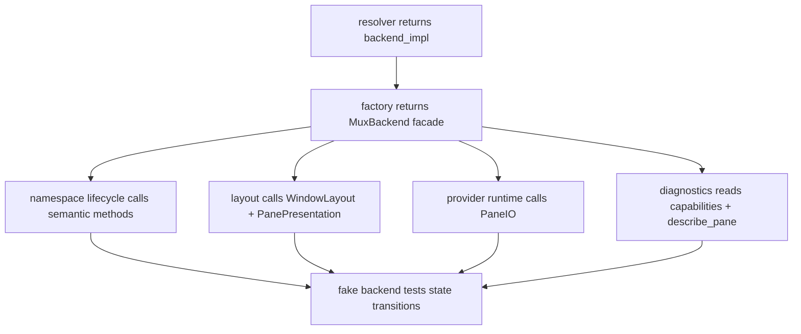

# mux-backend-contract feature design

## 0. 术语约定

| 术语 | 定义 | 防冲突结论 |
|---|---|---|
| MuxBackend | tmux-family backend 的组合 facade，面向 CCB 的 namespace/window/pane/io/presentation/diagnostics 语义。 | 不做一个胖 `Protocol`；由小协议组合。 |
| capability-specific protocol | 按能力拆开的接口：namespace lifecycle、window layout、pane io、pane presentation、diagnostics。 | 替代当前调用方直接摸 `_tmux_run`。 |
| backend ref | backend-neutral 的 namespace / pane 引用，包含 `backend_impl` 和 backend-local id。 | 不要求 Rmux pane id 伪装成 tmux `%N`。 |
| fake backend | 单元测试用 backend 替身，按测试声明实现所需协议。 | 不是 mock tmux CLI 字符串。 |
| command error | backend 操作失败的结构化错误，包含 category、backend_impl、operation、detail、command、ipc_ref、evidence。 | 取代散落的 tmux stderr 字符串解析，同时保留排障证据。 |

术语 grep 结果：生产代码已有 `TerminalBackend` 抽象，但只覆盖 `send_text/is_alive/kill_pane/activate/create_pane`；`TmuxLayoutBackend` 仍包含 `_tmux_run`，多处 runtime 直接调用 tmux private runner。

## 1. 决策与约束

### 需求摘要

本 feature 建立 backend-neutral mux 契约和测试替身，使后续 tmux adapter 与 Rmux backend 可以共享上层调用语义。它必须先定义引用类型、能力协议、错误分类、capability contract、fake backend 和迁移边界，避免后续 Rmux implementation 继续暴露 CLI 拼接、tmux socket、pane id 格式和 `_tmux_run`。

成功标准：

- 定义 `MuxNamespaceRef`、`MuxPaneRef`、`MuxCapabilities`、`MuxCommandError` 等 stable data contract。
- 将 `MuxBackend` 设计为组合 facade，小协议覆盖 namespace lifecycle、window layout、pane io、pane presentation、diagnostics。
- 建立 fake backend 测试替身，能支持 layout、provider runtime、namespace lifecycle 的单元测试。
- 列出当前 `_tmux_run` / tmux-specific 泄漏点，并给出迁移 gate：新增调用不得直接依赖 `_tmux_run`。
- 保持当前 `TmuxBackend` 行为不变；实际适配由后续 `tmux-backend-contract-adapter` 完成。

明确不做：

- 不实现 `RmuxBackend`，不调用 Rmux CLI/SDK。
- 不迁移 provider session payload；该工作属于 `provider-runtime-backend-session-contract`。
- 不改 foreground attach 的 backend-specific UI 实现；本 feature 只定义 attach capability contract。
- 不修改 ccbd control-plane transport。
- 不重写现有 tmux layout / namespace materialization 逻辑；只定义 seam 和 fake backend 验证入口。

### 复杂度档位

- 健壮性：L3。错误分类必须足以区分 transient-unavailable、unsupported、not-found、permission、command-failed。
- 可测试性：verified。fake backend 必须让调用方通过 interface 观察行为，而非断言 tmux argv。
- 安全性：inherited。只定义本地 runtime contract，不引入外部网络或敏感 artifact 复制。

### 方案深度 pre-pass

候选：

- 扩大现有 `TerminalBackend`，一次性把所有 tmux 方法塞进去。
- 新增 capability-specific protocols，并用一个 `MuxBackend` facade 组合暴露。

选择第二种。原因是 roadmap 已明确不做胖接口；不同调用方只依赖自己需要的能力，fake backend 也不应实现无关方法。转正条件：如果实现阶段发现多数调用方总是需要同一能力集合，可以保留 facade 便利入口，但协议仍按能力拆分。

### Top 3 风险与缓解

1. **接口变成 tmux argv pass-through**：协议方法必须表达 CCB 语义，例如 `ensure_window`、`capture_pane`、`set_pane_identity`，不得暴露 `_tmux_run(args)` 为公共能力。
2. **fake backend 太薄导致测试仍 mock tmux 字符串**：fake backend 以 namespace/window/pane 状态机记录行为，测试断言状态和事件。
3. **迁移面过大拖入实现**：本 feature 只定义 contract 与替身；实际 Tmux adapter 迁移和 Rmux backend 留给后续 item。

### 非显然依赖与关键假设

- 依赖 `backend-resolver-opt-in-contract` 提供 `backend_impl` 与 selection result，供 backend factory 选择实现。
- 假设现有 `TmuxBackend` 可作为 adapter 底座，不需要本 feature 改变其行为。
- 假设 Rmux required gaps 已由 route approval 守门；本 feature 只要求 `capabilities()` 暴露 gaps，不判定路线。

## 2. 名词与编排

### 2.1 名词层

#### 现状

- `lib/terminal_runtime/backend_types.py` 的 `TerminalBackend` 只覆盖基础 pane 操作。
- `lib/terminal_runtime/layouts_models.py` 的 `TmuxLayoutBackend` 仍要求 `_tmux_run`，说明 layout 还没有真正 backend-neutral。
- `lib/ccbd/services/project_namespace_runtime/backend.py` 直接通过 `_tmux_run_ready()` 执行 `new-session/list-windows/select-window/kill-server` 等 tmux argv。
- `lib/cli/services/runtime_launch_runtime/tmux_panes.py` 直接调用 `_tmux_run` 设置 tmux option、list panes 和 respawn。
- `TmuxBackend` 已按 mixin 拆出 pane query/mutation/control/logs，适合作为 adapter 输入。

#### 变化

新增 contract 模块候选：`lib/terminal_runtime/mux_backend_contract.py`。

核心引用类型：

```python
class MuxNamespaceRef(TypedDict):
    backend_family: Literal["tmux-family"]
    backend_impl: Literal["tmux", "rmux"]
    namespace_id: str
    session_name: str
    ipc_kind: Literal["unix_socket", "named_pipe", "socket_name"]
    ipc_ref: str

class MuxPaneRef(TypedDict):
    backend_impl: Literal["tmux", "rmux"]
    pane_id: str
    session_name: str
    window_name: str | None

class MuxCapabilities(TypedDict):
    backend_impl: Literal["tmux", "rmux"]
    command_status: dict[str, Literal["supported", "partial", "unsupported", "workaround"]]
    semantic_status: dict[str, Literal["supported", "partial", "unsupported", "workaround"]]
    blocking_gaps: list[str]
```

能力协议：

```python
class NamespaceLifecycle(Protocol):
    def prepare_server(self, *, timeout_s: float | None = None) -> None: ...
    def ensure_server_policy(self, namespace: MuxNamespaceRef | None = None, *, timeout_s: float | None = None) -> None: ...
    def create_session(self, *, session_name: str, project_root: str, window_name: str | None = None, terminal_size: tuple[int, int] | None = None) -> MuxNamespaceRef: ...
    def attach_namespace(self, namespace: MuxNamespaceRef, *, window_name: str | None = None) -> int: ...
    def destroy_namespace(self, namespace: MuxNamespaceRef) -> None: ...
    def namespace_exists(self, namespace: MuxNamespaceRef, *, timeout_s: float | None = None) -> bool: ...
    def session_alive(self, namespace: MuxNamespaceRef, *, timeout_s: float | None = None) -> bool: ...
    def session_root_pane(self, namespace: MuxNamespaceRef, *, timeout_s: float | None = None) -> MuxPaneRef: ...
    def kill_server(self, namespace: MuxNamespaceRef | None = None) -> bool: ...

class WindowLayout(Protocol):
    def list_windows(self, namespace: MuxNamespaceRef) -> tuple[dict[str, object], ...]: ...
    def ensure_window(self, namespace: MuxNamespaceRef, *, window_name: str, project_root: str, select: bool = False) -> dict[str, object]: ...
    def kill_window(self, namespace: MuxNamespaceRef, *, target: str) -> None: ...
    def list_panes(self, namespace: MuxNamespaceRef, *, window_name: str | None = None) -> tuple[MuxPaneRef, ...]: ...
    def window_root_pane(self, namespace: MuxNamespaceRef, *, window_name: str, timeout_s: float | None = None) -> MuxPaneRef: ...
    def select_window(self, namespace: MuxNamespaceRef, *, target: str) -> None: ...
    def split_pane(self, parent: MuxPaneRef, *, direction: Literal["right", "bottom"], percent: int, cmd: str | None = None, cwd: str | None = None) -> MuxPaneRef: ...
    def reflow_window(self, namespace: MuxNamespaceRef, *, window_name: str, layout: str, expected_panes: tuple[MuxPaneRef, ...] = ()) -> None: ...
    def select_layout(self, namespace: MuxNamespaceRef, *, window_name: str, layout: str) -> None: ...
    def move_pane(self, pane: MuxPaneRef, *, target: str) -> None: ...
    def swap_pane(self, source: MuxPaneRef, *, target: MuxPaneRef) -> None: ...

class PaneIO(Protocol):
    def send_text(self, pane: MuxPaneRef, text: str) -> None: ...
    def send_key(self, pane: MuxPaneRef, key: str) -> bool: ...
    def capture_pane(self, pane: MuxPaneRef, *, lines: int = 20) -> str | None: ...
    def respawn_pane(self, pane: MuxPaneRef, *, cmd: str, cwd: str | None = None, remain_on_exit: bool = True) -> None: ...
    def kill_pane(self, pane: MuxPaneRef) -> None: ...

class PanePresentation(Protocol):
    def set_pane_identity(self, pane: MuxPaneRef, *, title: str, user_options: dict[str, str], border_style: str | None = None, active_border_style: str | None = None) -> None: ...

class PaneLogging(Protocol):
    def ensure_pane_log(self, pane: MuxPaneRef) -> str | None: ...
    def pane_log_path(self, pane: MuxPaneRef) -> str | None: ...

class DiagnosticsCapability(Protocol):
    def capabilities(self) -> MuxCapabilities: ...
    def describe_pane(self, pane: MuxPaneRef, *, user_options: tuple[str, ...] = ()) -> dict[str, str] | None: ...
```

错误契约：

```python
class MuxCommandError(Exception):
    category: Literal["transient-unavailable", "unsupported", "not-found", "permission", "command-failed"]
    backend_impl: Literal["tmux", "rmux"]
    operation: str
    detail: str
    ipc_ref: str | None
    command: list[str] | None
    evidence: dict[str, object]
```

Tmux adapter 映射要求：现有 `TmuxCommandError.tmux_args` / `command` / `socket_path` / `detail` 必须进入 `MuxCommandError.evidence`；`command` 保留完整 argv 或为 `None`。保留 command evidence 不等于把 `_tmux_run` 暴露为 public protocol。

### 2.2 编排层



流程级约束：

- 错误语义：backend-specific stderr / exit code 先归一为 `MuxCommandError.category`，同时保留 `command` / `ipc_ref` / `detail` / `evidence` 供 diagnostics；调用层不得解析 tmux/Rmux 原始错误文本。
- 顺序：本 feature 先加 contract 与 fake backend；后续 adapter feature 再把 tmux 调用迁移到这些协议。
- 兼容性：`TmuxBackend` 现有 public methods 不删除；新 contract 通过 adapter/facade 包装接入。
- 可观测点：fake backend 记录 operations/event log；diagnostics capability 暴露 capabilities 和 pane describe 结果。
- 扩展点：新增 backend 只实现所需小协议；不要求 fake / Rmux 实现未使用能力。

### 2.3 挂载点清单

- `lib/terminal_runtime/mux_backend_contract.py`：删除后 backend-neutral contract 消失。
- `lib/terminal_runtime/fake_mux_backend.py` 或测试内 fake module：删除后调用方无法通过 contract 做单元验证。
- `lib/terminal_runtime/backend_types.py` / `layouts_models.py`：删除或不迁移后旧 `TerminalBackend` / `TmuxLayoutBackend` 仍会维持 tmux-specific seam。
- contract tests：删除后无法证明协议不泄漏 `_tmux_run` 和 fake backend 行为。

### 2.4 推进策略

1. **contract datatypes**：定义 namespace/pane/capability/error 类型，字段包含 `backend_impl` 和 backend-local refs。
2. **capability protocols**：按 namespace/window/pane io/presentation/diagnostics 拆小协议，并提供组合 facade 类型。
3. **fake backend**：实现状态机式 fake，支持 session/window/pane create、attach/destroy/exists、window root/list/reflow/move/swap/layout、split、send/capture/kill、identity、logging、capabilities、failure injection；`reflow_window()` 是 reflow 的 canonical seam，`select_layout()` 仅表示 adapter 可用的低阶 layout primitive。
4. **compatibility facade**：让现有 `TmuxBackend` 可被类型检查视为 adapter 底座；不删除旧方法。
5. **leakage inventory**：列出 `_tmux_run` 和 tmux argv 调用点，至少覆盖 `terminal_runtime/layouts_models.py`、`terminal_runtime/layouts_root.py`、`ccbd/services/project_namespace_runtime/backend.py`、`agent_window_reflow.py`、`move_patch_agents.py`、`remove_patch_agents.py`、`cli/services/runtime_launch_runtime/tmux_panes.py`、`cli/services/start_foreground.py`、pane log helpers，作为后续 `tmux-backend-contract-adapter` 的迁移输入。
6. **tests**：补 contract/fake backend tests，验证调用方能通过协议观察行为，不断言 tmux argv。

### 2.5 结构健康度与微重构

- 文件级：`backend_types.py` 很小，但现有 `TerminalBackend` 语义过窄；直接扩大它会破坏接口隔离，建议新增 contract module。
- 文件级：`layouts_models.py` 暴露 `_tmux_run`，后续迁移时应替换为 `WindowLayout` / `PanePresentation`，本 feature 只记录 leak，不直接改 layout 算法。
- 目录级：`terminal_runtime/` 已按 tmux_backend_* 拆分，新增 contract/fake backend 不需要目录重组。

结论：不做行为微重构；新增 contract/fake 文件，后续 adapter feature 再迁移调用点。

## 3. 验收契约

### 3.1 关键场景清单

| ID | 输入 / 触发 | 期望可观察结果 | 证据类型 |
|---|---|---|---|
| AC-001 | 导入 mux contract | namespace/pane/capabilities/error/protocol 类型可用且不依赖 tmux module | unit test / type smoke |
| AC-002 | fake backend 创建/attach/destroy namespace、window、pane | 可通过 backend-neutral refs 观察状态，不出现 tmux `%N` 假设 | unit test |
| AC-003 | fake backend send/capture/identity/logging/reflow/move/swap | event log 与 pane/window state 可断言，不需要 tmux argv mock | unit test |
| AC-004 | backend operation failure | 抛出 `MuxCommandError` 且 category、command/evidence 可断言 | unit test |
| AC-005 | 现有 tmux backend 导入与基础 tests | 旧 tmux 默认行为不变 | regression test |
| AC-006 | `_tmux_run` 泄漏 inventory | 后续 adapter item 有明确迁移输入，新增 contract 不把 `_tmux_run` 作为 public protocol | diff review |

### 3.2 明确不做的反向核对项

- 不应新增 `RmuxBackend` 或 Rmux adapter。
- 不应删除 `TerminalBackend` / `TmuxBackend` 现有 public methods。
- 不应把 `_tmux_run(args)` 放进新的 public `MuxBackend` protocol。
- 不应改 provider session payload 或 ccbd transport endpoint schema。
- 不应把 fake backend 写成 tmux argv recorder。

### 3.3 Acceptance Coverage Matrix

| Scenario | Covered By Step | Evidence Type | Command / Action | Core? |
|---|---|---|---|---|
| AC-001 contract import | S1, S2 | unit/type smoke | pytest contract import | yes |
| AC-002 fake lifecycle | S3 | unit test | fake backend state tests | yes |
| AC-003 fake IO/presentation | S3 | unit test | fake send/capture/identity tests | yes |
| AC-004 structured errors | S1, S3 | unit test | failure injection tests include command/evidence | yes |
| AC-005 tmux regression | S4, S6 | regression test | existing terminal backend tests | yes |
| AC-006 leakage inventory | S5 | diff review | inventory section / test guard | yes |

### 3.4 DoD Contract

| ID | 要求 | 证据 | 阻塞级别 |
|---|---|---|---|
| DOD-DESIGN-001 | design/checklist/review 完整，且遵守 roadmap §4.1 | design review | blocking |
| DOD-IMPL-001 | 新 contract module 不依赖 tmux implementation module | unit/type smoke | blocking |
| DOD-IMPL-002 | protocols 按能力拆分，未形成胖接口 | diff review / tests | blocking |
| DOD-IMPL-003 | fake backend 支持 namespace/window/pane/io/presentation/logging state/event 断言和 failure injection | unit tests | blocking |
| DOD-IMPL-004 | `MuxCapabilities` 对齐 command_status、semantic_status、blocking_gaps | diff review / tests | blocking |
| DOD-IMPL-005 | `_tmux_run` 不进入新的 public protocol，command/evidence 只作为 diagnostics 保存 | diff review | blocking |
| DOD-IMPL-006 | 旧 tmux tests 继续通过 | regression tests | blocking |

Validation Commands:

| ID | 命令 | 目的 | 核心性 | 失败处理 |
|---|---|---|---|---|
| CMD-001 | `python ".codestable/tools/validate-yaml.py" --file ".codestable/features/2026-07-19-mux-backend-contract/mux-backend-contract-checklist.yaml" --yaml-only` | checklist YAML 合法性 | core | fix-or-block |
| CMD-002 | `python ".codestable/tools/validate-yaml.py" --file ".codestable/roadmap/windows-rmux-native-backend/windows-rmux-native-backend-items.yaml"` | roadmap items 回写合法性 | core | fix-or-block |
| CMD-003 | `python -m pytest -q test/test_mux_backend_contract.py` | contract/fake backend 行为 | core | fix-or-block |
| CMD-004 | `python -m pytest -q test/test_terminal_backend_selection.py test/test_agent_window_reflow.py test/test_v2_phase2_entrypoint.py -k "tmux or layout or runtime"` | tmux/layout/runtime 抽样回归 | core | fix-or-block |

Required Artifacts：design、checklist、design-review、contract module、fake backend、leakage inventory、contract tests、items.yaml 回写。

### 3.5 自我批判结论

- 可证伪性：核心场景都能用 unit/diff review 判定，不依赖真实 tmux 或 Rmux。
- 步骤原子性：contract、protocol、fake、compat facade、inventory、tests 分离。
- 最弱依赖：如果 contract 把 `_tmux_run` 纳入 public protocol，后续 Rmux 会被迫模拟 tmux argv；已列 blocking 反向检查。
- 证据完整性：fake backend tests 是主证据，tmux 回归抽样证明旧行为未漂移。
- 清洁度规则：不新增临时 TODO、调试输出、注释掉代码、死 import；不复制 capability artifact payload。

## 4. 与项目级架构文档的关系

- 本 feature 消费 roadmap §4.1 `MuxBackend` 组合能力契约，落实“组合能力集合而非胖 Protocol”。
- `tmux-backend-contract-adapter` 后续负责把现有 `TmuxBackend` 和调用点迁移到 contract。
- `rmux-backend-core` 后续实现 Rmux backend 时必须消费本 contract 和 route approval/capability report。
- 若 implementation 发现某个上层调用必须继续依赖 tmux argv，需要回 `cs-epic` 更新 roadmap 或拆专门 adapter item，不得把 `_tmux_run` 偷塞进 contract。
