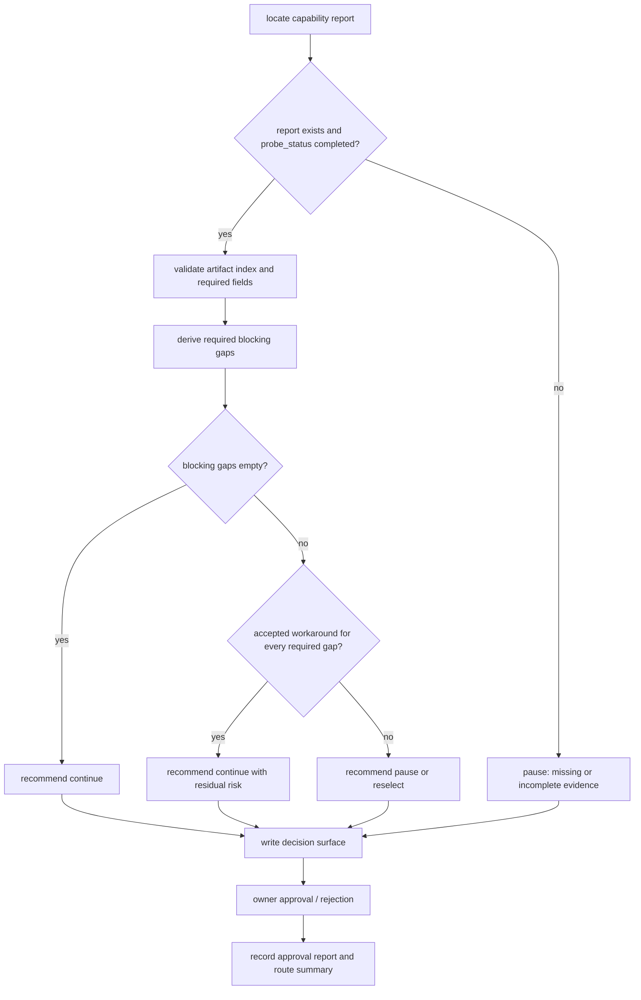

# rmux-route-approval feature design

## 0. 术语约定

| 术语 | 定义 | 防冲突结论 |
|---|---|---|
| capability report | `rmux-capability-gate` 产出的结构化事实报告，包含 `probe_status`、`commands`、`semantics`、`blocking_gaps`、`artifact_index`。 | 沿用 `rmux-capability-gate` design，不重新定义 report schema。 |
| route decision | owner 对 Rmux 路线的明确结论：继续、暂停或重新选型。 | 本 feature 只记录决策，不把实现状态伪装成路线事实。 |
| route approved | route decision 为继续，且 capability report 无 required blocking gap，或 required partial/workaround 已被 owner 明确接受。 | 后续 Rmux implementation item 只能依赖此状态，不直接依赖 `probe_status=completed`。 |
| route paused | report 缺失、Windows evidence 缺失、probe 未完成、或 owner 选择暂停。 | 暂停不是失败实现，不启动后续 Rmux backend feature。 |
| reselect required | required gaps 无可接受 workaround，或 owner 判断 Rmux 不适合当前路线。 | 回到 roadmap planning/update 或另开选型，不在本 feature 内替换成 WezTerm/psmux。 |

术语 grep 结果：已有 `route approval` / `route approved` 均来自 roadmap 与 `rmux-capability-gate`，没有发现生产代码里同名运行时概念。

## 1. 决策与约束

### 需求摘要

本 feature 要把 `rmux-capability-gate` 的事实输出转成可恢复、可审计的路线决策。它必须让 owner 能基于 Windows 真机 evidence、blocking gaps、workaround 接受状态、degrade impact 和 consequence 明确选择：继续 Rmux、暂停等待补证据、或重新选型。

成功标准：

- 能定位并验证 capability report 及 artifacts：没有 Windows 真机 evidence 或 `probe_status != completed` 时必须阻塞路线批准。
- 能机械判定 required blocking gaps：`unsupported`、或 `partial/workaround` 但 `workaround.accepted != true` 的 required capability 不得被静默忽略。
- 能生成 owner 可读的 route decision surface，包含 options、recommendation、tradeoffs、evidence、consequence、next action。
- owner 批准后有 canonical approval ref，可供后续 `backend-resolver-opt-in-contract` 等 implementation item 读取。
- route approval 后触发知识回写候选：Rmux 取代旧 psmux、capability gate 结果、TCP loopback transport 决策分别进入 ADR / domain / docs-neat 候选。

明确不做：

- 不运行 Rmux probe；缺 report 时返回阻塞，回 `rmux-capability-gate`。
- 不修改 `backend_selection.py`，不新增 `runtime.mux.backend` / `CCB_MUX_BACKEND`。
- 不实现 `RmuxBackend`、transport seam、TCP adapter 或 provider session 迁移。
- 不把 `probe_status=completed` 自动解释为 `route approved`。
- 不把 RMR-001 / RMR-002 忘到后续：后续相关 feature design 必须显式消费共享 pid liveness 和 startup/diagnostics contract delta。

### 复杂度档位

本 feature 是决策 gate，走 Goal lane（Epic 子 Feature 批量上下文）。复杂度偏离点：

- 健壮性：L3。缺 report、artifact 缺失、schema 不完整、blocking gaps 未解释都必须 fail-closed。
- 可测试性：verified。route decision 的分类逻辑、approval report 结构、blocking gap 汇总必须有单元或脚本级验证。
- 安全性：validated。approval surface 不得复制敏感 artifact payload，只引用已脱敏 evidence 路径和摘要。

### 方案深度 pre-pass

候选：

- 完整运行时审批系统：新增 production command / API 来读取 report 并写 decision。
- CodeStable 决策 gate：在 feature 实现中用脚本/文档验证 capability report，写 `.codestable` approval report 和 route decision 摘要。

选择 CodeStable 决策 gate。原因不是“更简单”，而是 route approval 是 roadmap 内部治理决策，不是用户运行时能力；生产代码在后续 backend resolver item 才需要读取稳定决策状态。转正条件：如果后续要让 `ccb doctor` 或 runtime resolver 直接消费 route approval，需要在 `backend-resolver-opt-in-contract` 中定义 production-readable decision source。

### Top 3 风险与缓解

1. **把缺证据误判为批准**：缺 Windows report 或 artifacts 时必须 blocking，不允许 owner 在不知道事实的情况下获得默认 approved。
2. **把 partial/workaround 语义说散**：route decision 必须逐项列出 required gaps、workaround.accepted、degrade impact 和 consequence。
3. **决策不可恢复**：必须写 canonical `approval-report.md` 和 route decision summary；后续 item 读取 approval ref，而不是靠聊天历史。

### 非显然依赖与关键假设

- 依赖 `rmux-capability-gate` 真正完成并产出 Windows capability report；当前只允许起草 design，不允许 implementation。
- 假设 capability report 路径在 `.codestable/roadmap/windows-rmux-native-backend/drafts/rmux-capability-gate/` 或 feature acceptance 明确记录的位置。
- 假设 owner 可在三种互斥选项中做决策：continue / pause / reselect。

## 2. 名词与编排

### 2.1 名词层

#### 现状

- Roadmap §4.2 已定义 `MuxCapabilityReport` 示例和 `blocking_gaps`。
- `rmux-capability-gate` design 明确 report 只产出 facts，不写 `route_approved=true`。
- Roadmap §4.0 要求显式选择 `rmux` 但未通过 route approval 时 fail fast。
- `.codestable/reference/approval-conventions.md` 定义 canonical approval report 与 named approval ref。

#### 变化

新增 route decision 产物，不新增 production schema：

```yaml
decision_id: rmux-route
status: approved | paused | reselect-required
capability_report: ".codestable/roadmap/windows-rmux-native-backend/drafts/rmux-capability-gate/<report>.yaml"
blocking_gaps:
  - kind: command | semantic
    name: capture_format_fidelity_for_provider_completion
    required: true
    status: partial
    workaround_accepted: false
    degrade_impact: parser-fidelity
    consequence: "provider pane status may drift"
owner_decision_ref: ".codestable/features/2026-07-19-rmux-route-approval/approval-report.md#rmux-route"
next_route: continue | pause | reselect
parent_handoff:
  route_approved: true | false
  downstream_unlocked: true | false
  next_action: "continue downstream implementation | return to rmux-capability-gate | return to roadmap planning/update"
downstream_constraints:
  - target_item: ccbd-windows-process-liveness
    constraint: "覆盖共享 pid liveness helper：ccbd.system.process_exists + cli.kill_runtime.processes.is_pid_alive"
  - target_item: ccbd-control-plane-transport-seam | ccbd-windows-tcp-loopback-transport
    constraint: "transport endpoint/schema 变更必须同步 startup/diagnostics contract delta"
```

canonical approval report 使用 feature unit：

- `approval-report.md#rmux-route`：owner 是否批准继续 Rmux route。
- `approval-report.md#rmux-workaround-risk`：仅当存在 required partial/workaround gap 时写入，表示 owner 是否接受该风险；没有此类 gap 时在 route summary 中记录 `not-applicable`，不写 runtime-consumed approval。
- `approval_groups.route-approval`：一次 owner answer 原子覆盖本次实际需要的 named decisions；无 workaround 风险时只覆盖 `rmux-route`。

capability report authority：

1. 优先读取 `rmux-capability-gate` acceptance 记录的 canonical report ref。
2. 若 acceptance 尚未记录 canonical ref，只允许使用 owner 在 route decision surface 中明确选择的 report ref。
3. drafts 目录只能作为发现候选：恰好存在一个 `probe_status=completed`、含 Windows 真机 evidence、且 `artifact_index` 可反查的 report 时才可自动选用。
4. 多个候选、缺 Windows evidence、artifact index 不可反查、或候选看起来是示例 / stale run 时，route status 必须为 `paused`，并要求人工指定 report ref。

### 2.2 编排层



流程级约束：

- 错误语义：report 缺失、schema 不完整、artifact 不可反查、Windows evidence 缺失时，route status 只能是 `paused`。
- 幂等性：重复执行应覆盖同一 feature unit 的 pending/approved decision，不创建多个互相竞争的 route authority。
- 顺序：implementation 前重新读取已选定的 canonical capability report ref；不得按“最新文件”猜测，不得使用 design 阶段的示例数据。
- 可观测点：decision surface 必须列 report path、probe version、Windows evidence、blocking gaps、owner option、approval refs。

### 2.3 挂载点清单

- `.codestable/features/2026-07-19-rmux-route-approval/approval-report.md`：删除后 route approval 不可恢复。
- `.codestable/features/2026-07-19-rmux-route-approval/rmux-route-approval-acceptance.md`：删除后 route decision 的验收证据消失。
- `.codestable/roadmap/windows-rmux-native-backend/windows-rmux-native-backend-items.yaml` 中 `rmux-route-approval` 状态：删除或回退后，下游 Rmux implementation item 不应进入 implementation admission。

### 2.4 推进策略

1. **report discovery 与 schema gate**：定位 capability report，校验 `probe_status`、`commands`、`semantics`、`blocking_gaps`、`artifact_index`。
2. **gap summary 与 consequence table**：汇总 required gaps、workaround 接受状态、degrade impact、用户可见后果。
3. **route decision surface**：生成 pending approval report，提供 continue / pause / reselect 三个互斥选项和 recommendation。
4. **owner decision persistence**：记录 approval group 与 named decisions，写 route summary。
5. **acceptance 回写**：若 approved，acceptance 将 roadmap item 标为 `done` 且 `parent_handoff.downstream_unlocked=true`；若 paused，route summary 记录 `decision_status=paused`、`parent_handoff.next_action=return to rmux-capability-gate`，roadmap item 保持 `in-progress` 并阻塞依赖 Rmux route 的实现项；若 reselect，route summary 记录 `decision_status=reselect-required`、`parent_handoff.next_action=return to roadmap planning/update`，roadmap item 保持 `in-progress` 并由 parent epic 进入规划更新 / handoff，不把“决策已做”误当作“路线已批准”。

### 2.5 结构健康度与微重构

- 文件级：本 feature 不改 production 代码；只新增 `.codestable/features/...` 决策产物，不需要微重构。
- 目录级：`.codestable/features/` 已有 feature spec 平铺约定，本 feature 沿用。
- compound convention：未发现 route approval 专用沉淀；若 route 通过，acceptance 后可触发 `cs-domain` / `cs-docs-neat`，不在 design 阶段提前写 ADR。

结论：不做微重构。

## 3. 验收契约

### 3.1 关键场景清单

| ID | 输入 / 触发 | 期望可观察结果 | 证据类型 |
|---|---|---|---|
| AC-001 | capability report 缺失或 `probe_status != completed` | route decision 为 `paused`，不写 approved route | diff review / acceptance |
| AC-002 | report 有 required unsupported gap | decision surface 列出 gap、evidence、consequence，默认推荐 pause/reselect | report review |
| AC-003 | report 有 partial/workaround 且 `accepted != true` | 需要 owner 明确接受风险，否则不批准继续 | approval report |
| AC-004 | report 无 blocking gaps 或 owner 接受全部 required workaround | `approval-report.md#rmux-route` 可被标为 approved，route summary 指向 continue | approval report / acceptance |
| AC-005 | route approved | 后续 `backend-resolver-opt-in-contract` 可读取 approval ref；`rmux-route-approval` item 可在 acceptance 标 done | items.yaml diff |
| AC-006 | route paused / reselect | route summary 写明 `parent_handoff`，下游 Rmux implementation item 不进入 implementation admission，next action 明确回 probe 或 planning | acceptance report |

### 3.2 明确不做的反向核对项

- 不应修改 `lib/terminal_runtime/backend_selection.py`。
- 不应新增 production `RmuxBackend` 或 transport adapter。
- 不应把 capability report 示例值当作真实 Windows evidence。
- 不应在缺 Windows evidence 时写 `rmux-route: approved`。
- 不应通过路线批准自动授权 git commit / push / release。

### 3.3 Acceptance Coverage Matrix

| Scenario | Covered By Step | Evidence Type | Command / Action | Core? |
|---|---|---|---|---|
| AC-001 缺 report 暂停 | S1, S3 | diff review | 缺失 / 非唯一 / 非 canonical report 的 dry classification | yes |
| AC-002 unsupported gap 暴露 | S2, S3 | report review | 检查 decision surface gap table | yes |
| AC-003 workaround 风险需 owner 接受 | S2, S3, S4 | approval report | `approval-report.md#rmux-workaround-risk` | yes |
| AC-004 approved route 可恢复 | S4 | approval report | `approval-report.md#rmux-route` | yes |
| AC-005 approved 后 item done | S5 | items.yaml diff | acceptance 回写 `rmux-route-approval: done` | yes |
| AC-006 paused/reselect 不解锁实现 | S5 | acceptance report | route summary records parent_handoff | yes |

### 3.4 DoD Contract

| ID | 要求 | 证据 | 阻塞级别 |
|---|---|---|---|
| DOD-DESIGN-001 | design/checklist/review 完整，且遵守 roadmap route approval 契约 | design review | blocking |
| DOD-IMPL-001 | implementation 读取唯一 canonical capability report ref，不使用“最新文件”猜测或示例数据 | review / acceptance | blocking |
| DOD-IMPL-002 | decision surface 覆盖 report path、Windows evidence、blocking gaps、workaround、degrade impact、consequence | approval report | blocking |
| DOD-ACCEPT-001 | route decision 与 owner approval ref 可恢复 | acceptance report | blocking |
| DOD-ACCEPT-002 | acceptance 按 approved / paused / reselect 正确处理 roadmap item、parent_handoff 与 next action | items.yaml / acceptance | blocking |

Validation Commands:

| ID | 命令 | 目的 | 核心性 | 失败处理 |
|---|---|---|---|---|
| CMD-001 | `python ".codestable/tools/validate-yaml.py" --file ".codestable/features/2026-07-19-rmux-route-approval/rmux-route-approval-checklist.yaml" --yaml-only` | checklist YAML 合法性 | core | fix-or-block |
| CMD-002 | `python ".codestable/tools/validate-yaml.py" --file ".codestable/roadmap/windows-rmux-native-backend/windows-rmux-native-backend-items.yaml"` | roadmap items 回写合法性 | core | fix-or-block |
| CMD-003 | 人工核对 capability report 与 artifacts | 确认 route decision 不是基于缺失或示例 evidence | core | fix-or-block |

Required Artifacts：design、checklist、design-review、approval-report、route decision summary、acceptance report、items.yaml 回写。

### 3.5 自我批判结论

- 可证伪性：每个场景都有 route status、approval ref、items.yaml 或 acceptance 证据。
- 步骤原子性：report gate、gap summary、approval surface、decision persistence、acceptance 回写分离。
- 最弱依赖：Windows capability report 是最大外部依赖，已设为 implementation 前置阻塞。
- 证据完整性：不复制 artifact payload，只引用 report/artifact index 和摘要，降低泄露风险。
- 清洁度规则：不新增临时 TODO、调试输出、注释掉代码、死 import；`.codestable` 文档状态必须机读字段一致。

## 4. 与项目级架构文档的关系

- route approved 后应触发 `cs-domain` 候选 ADR：Rmux 作为旧 psmux 方向的当前候选实现。
- TCP loopback transport 的 ADR 不由本 feature 直接写；`ccbd-windows-tcp-loopback-transport` 落地后处理。
- 旧 `docs/ccbd-windows-psmux-plan.md` 的 superseded / updated 标记留给 docs-neat 或 domain 流程，不能在缺 route decision 时提前改。
