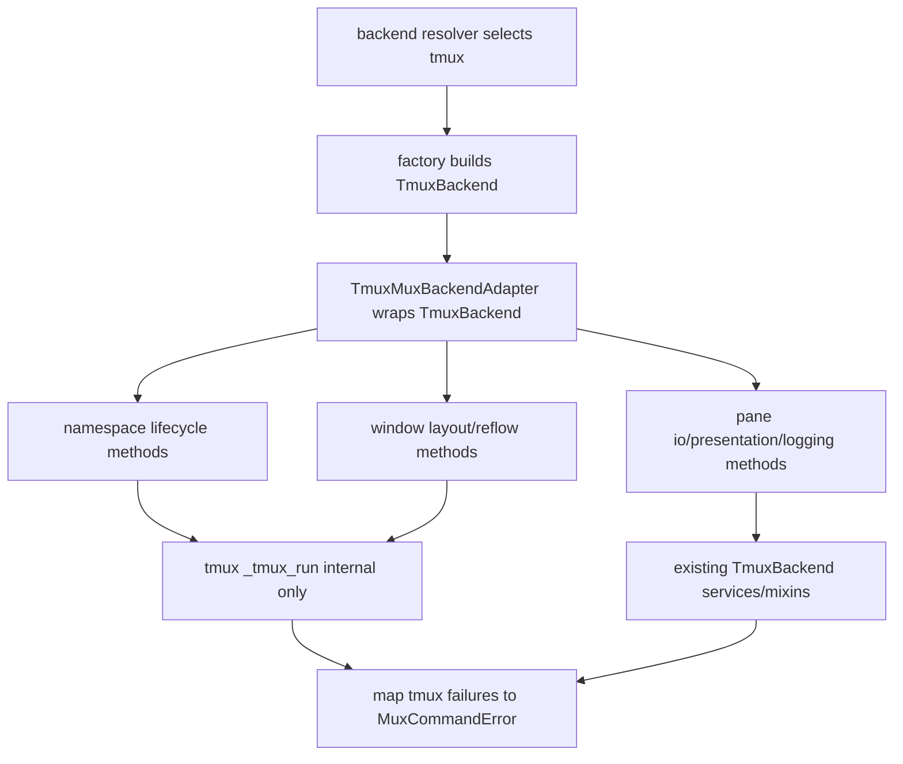

# tmux-backend-contract-adapter feature design

## 0. 术语约定

| 术语 | 定义 | 防冲突结论 |
|---|---|---|
| TmuxBackend | 现有 tmux implementation，组合 logs、pane query/mutation、control mixin，并暴露 `_tmux_run` 作为底层命令 runner。 | 本 feature 不删除现有 public methods；新增 mux contract 适配层必须保持旧 API 可用。 |
| Tmux adapter | 将 `TmuxBackend` 的 tmux CLI 行为映射到 `MuxBackend` 小协议的生产 adapter。 | 不把 `_tmux_run(args)` 暴露为 `MuxBackend` public method；`_tmux_run` 只留在 adapter 内部。 |
| backend-neutral ref | 上一项 `mux-backend-contract` 定义的 `MuxNamespaceRef` / `MuxPaneRef`，包含 `backend_impl` 和 backend-local id。 | tmux adapter 允许 pane id 仍为 `%N`，但调用层依赖 `MuxPaneRef`，不要求 Rmux 复刻 `%N`。 |
| error mapping | 将 `TmuxCommandError`、`TmuxTransientServerUnavailable`、`subprocess` 失败和 tmux returncode 归一为 `MuxCommandError`。 | category 是调用层判断依据；原始 command、stderr/stdout/socket path 只作为 diagnostics evidence。 |
| legacy compatibility | `send_text/is_alive/kill_pane/activate/create_pane`、`split_pane`、pane title/options/style/logs 等现有方法继续按旧签名工作。 | 兼容不是新增 public tmux runner；新增调用应走 mux contract。 |

术语 grep 结果：`TerminalBackend` 只覆盖基础 pane 操作；`layouts_models.py` 的 `TmuxLayoutBackend` 仍声明 `_tmux_run`；`ccbd/services/project_namespace_runtime/backend.py`、`runtime_launch_runtime/tmux_panes.py`、`agent_window_reflow.py`、`move_patch_agents.py`、`remove_patch_agents.py` 等仍直接调用 `_tmux_run` 或 tmux argv。

## 1. 决策与约束

### 需求摘要

本 feature 在 `mux-backend-contract` 已定义的类型和小协议基础上，把现有 `TmuxBackend` 适配为 tmux implementation 的 `MuxBackend`，让 Linux、macOS、WSL 当前 tmux lifecycle、layout、provider runtime 和 diagnostics 行为不漂移，同时给后续 RmuxBackend 提供可对照的 adapter 形态。

成功标准：

- `TmuxBackend` 或 `TmuxMuxBackendAdapter` 能通过 `MuxBackend` 小协议完成 namespace lifecycle、window layout、pane io、presentation/logging、diagnostics。
- `backend_impl` 固定为 `tmux`，namespace ref 正确保留稳定 `namespace_id`、socket name/path、session name 和 ipc evidence。
- 现有 `TmuxCommandError` / transient / missing-session / absent-server / permission / unsupported / subprocess exception 语义被映射为 `MuxCommandError.category`，且保留 command/socket/detail/stdout/stderr/original_exception_type evidence。
- 旧 `TmuxBackend` public methods 与现有 tmux 平台路径保持兼容；旧测试可继续使用旧方法，新增测试优先通过 mux contract 断言行为。
- 至少迁移一批直接依赖 `_tmux_run` 的调用方到 adapter-facing seam，并为剩余泄漏点留下可核对 inventory。

明确不做：

- 不实现 `RmuxBackend`，不调用 Rmux CLI/SDK。
- 不迁移 provider session payload、`namespace_tmux_*` 兼容字段或 runtime health schema；这些属于后续 `provider-runtime-backend-session-contract` 和 `windows-namespace-ipc-schema`。
- 不修改 ccbd 控制面 transport、AF_UNIX/TCP loopback、accelerator guard 或 Windows process liveness。
- 不改 shell/log builder 的 Windows 语义；`sh -lc`、`tee`、PowerShell/cmd 差异留给 `windows-shell-log-builder`。
- 不把旧 `_tmux_run` fake tests 一次性全部改完；本 feature 只迁移与 adapter 契约直接相关的代表路径，并冻结新增调用不得扩大泄漏面。

### 复杂度档位

- 健壮性：L3。adapter 是后续 Rmux 对照基线，错误分类和 evidence 必须可诊断。
- 兼容性：L3。Linux、macOS、WSL tmux 路径行为不得漂移；旧 public methods 保留。
- 可测试性：verified。新增 contract tests 断言 mux refs、event/evidence、error category；抽样回归覆盖 namespace、layout、runtime launch。
- 安全性：inherited。本 feature 只操作本地 tmux runtime，不新增网络、权限或敏感数据流。

### 方案深度 pre-pass

候选：

1. 让 `TmuxBackend` 直接继承/实现所有 `MuxBackend` 小协议。
2. 新增 `TmuxMuxBackendAdapter` 包装 `TmuxBackend`，在 adapter 内部完成 ref、error、capability、argv 到语义方法的映射。

选择第二种作为主路径，允许 `TmuxBackend` 保留已有 public methods。原因是 adapter 的职责是“翻译”，而 `TmuxBackend` 当前还承担底层命令执行、pane 服务、日志管理；直接把全部新协议塞进它会增加类职责并扩大回归面。转正条件：若实现发现大多数方法只是无状态委托，可在不破坏旧 API 的前提下让 `TmuxBackend` 暴露少量 facade convenience，但小协议和 error mapping 仍归 adapter 边界。

### Top 3 风险与缓解

1. **tmux 行为漂移**：adapter 先做 contract-facing wrapper，不删除旧 methods；每步配套旧 tmux 抽样回归。
2. **error mapping 丢诊断细节**：`MuxCommandError` 必须保留 `TmuxCommandError.tmux_args`、`command`、`socket_path`、`detail`、returncode/stdout/stderr evidence。
3. **迁移面过大导致实现不可收敛**：本 feature 只迁移代表性 seam：terminal layout root、ccbd namespace backend、runtime launch detached pane/server policy、agent window reflow；`start_foreground.py`、provider-specific launcher/session runtime、`project_clear.py`、`materialize_topology.py` 等其他 `_tmux_run` 泄漏列入 inventory 和后续 feature 输入。

### 非显然依赖与关键假设

- 依赖 `mux-backend-contract` 已完成并提供 contract module、fake backend 和 `MuxCommandError` shape；implementation admission 必须机械确认该 roadmap item 为 `done`，且 contract module、fake backend、`MuxCommandError` 可导入。当前 epic child batch 只允许起草 design，不授权实现。
- 假设现有 `TmuxBackend` mixin/service 边界足够支撑 adapter，不需要先重写 tmux send/capture/log internals。
- 假设 `backend-resolver-opt-in-contract` 的 selection result 可向 factory 提供 `backend_impl=tmux` 和 socket/session 输入。
- 假设 `TmuxBackend._socket_path` / `_socket_name` 是 adapter 可用的 diagnostics evidence；若实现阶段发现缺 public accessor，可新增只读 property，不改语义。

### 基线风险与必跑验证

本仓库测试量大，部分平台黑盒测试依赖 tmux 或真实 provider。实现前先跑 focused baseline；若预检红灯，必须记录是既有环境问题还是本 feature 引入。

核心命令见 checklist `dod.commands`，至少包括 YAML 校验、contract/adapter unit tests、namespace/layout/runtime launch 抽样回归，以及通用非 provider-blackbox 回归的可执行子集。

## 2. 名词与编排

### 2.1 名词层

#### 现状

- `lib/terminal_runtime/tmux_backend.py` 的 `TmuxBackend` 通过 `_tmux_base()` 生成 `tmux` 命令前缀，通过 `_tmux_run()` 执行 subprocess，并记录 startup operation counters。
- `lib/terminal_runtime/tmux_backend_panes.py`、`tmux_backend_control.py`、`tmux_backend_logs.py` 已把 pane query/mutation/control/logs 拆成 mixin，但方法仍以裸 `pane_id: str` 为主。
- `lib/terminal_runtime/tmux_readiness.py` 定义 `TmuxCommandError`、`TmuxTransientServerUnavailable` 和 absent/missing/transient 文本识别函数。
- `lib/terminal_runtime/layouts_models.py` 的 `TmuxLayoutBackend` 仍要求 `_tmux_run`；`layouts_root.py` 通过 `new-session/list-panes` 创建 detached root pane。
- `lib/ccbd/services/project_namespace_runtime/backend.py` 自己维护 `_tmux_run_ready/_tmux_run_checked`，负责 start-server、server policy、session/window/pane 操作与错误包装。
- `lib/cli/services/runtime_launch_runtime/tmux_panes.py` 直接拼 tmux server policy、detached session、pane dimensions 和 kill fallback。

#### 变化

新增生产 adapter 候选：`lib/terminal_runtime/tmux_mux_backend.py`。

核心名词：

```python
class TmuxMuxBackendAdapter:
    backend_impl = "tmux"

    def __init__(self, tmux_backend: TmuxBackend) -> None: ...
    def namespace_ref(self, *, session_name: str, namespace_id: str | None = None) -> MuxNamespaceRef: ...
    def pane_ref(self, pane_id: str, *, session_name: str, window_name: str | None = None) -> MuxPaneRef: ...
    def capabilities(self) -> MuxCapabilities: ...
```

`namespace_ref()` 映射规则：

- `namespace_id` 优先使用调用方传入的 project namespace id；缺省时使用 `session_name`，不得随机生成。
- `session_name` 原样写入 `MuxNamespaceRef.session_name`，空值为错误。
- `TmuxBackend._socket_path` 非空时：`ipc_kind="unix_socket"`，`ipc_ref=<expanded socket_path>`。
- `_socket_path` 为空且 `_socket_name` 非空时：`ipc_kind="socket_name"`，`ipc_ref=<socket_name>`。
- 两者都为空时：`ipc_kind="socket_name"`，`ipc_ref="<default>"`，表示 tmux default server；diagnostics evidence 仍记录 socket path/name 均为空。
- `MuxPaneRef` 必须携带同一 `namespace_id` 或可反查的 namespace/session context；pane id 只在同一 `backend_impl=tmux` 与 namespace 内有意义。

接口示例：

```python
# 来源：lib/ccbd/services/project_namespace_runtime/backend.py create_session / session_root_pane
namespace = adapter.create_session(
    session_name="ccb-demo",
    project_root="D:/repo",
    window_name="main",
    terminal_size=(160, 48),
)
root = adapter.session_root_pane(namespace)
# namespace["backend_impl"] == "tmux"
# root["backend_impl"] == "tmux"
```

错误映射示例：

```python
# 来源：lib/terminal_runtime/tmux_readiness.py TmuxCommandError
try:
    adapter.select_window(namespace, target="missing")
except MuxCommandError as exc:
    assert exc.backend_impl == "tmux"
    assert exc.category in {"not-found", "transient-unavailable", "command-failed"}
    assert exc.command is None or exc.command[0] == "tmux"
    assert exc.evidence["tmux_detail"]
```

Interface 设计检查：

- Module / interface：`terminal_runtime` 暴露 tmux adapter；ccbd/CLI/layout/provider runtime 依赖 `MuxBackend` 小协议，不依赖 tmux argv。
- Scope boundary：本 feature 的直接调用方迁移只覆盖 layout root、ccbd namespace backend、runtime launch detached pane/server policy、agent window reflow；foreground attach、provider-specific launcher/session runtime、project clear、materialize topology 作为 inventory-only 泄漏点进入后续迁移，不在本 feature 实现。
- Seam placement：`_tmux_run`、tmux flags、stderr parsing 只在 adapter 与现有 tmux internals 内；调用层只见 namespace/window/pane/io/presentation 语义。
- Depth / locality：adapter 是 deep seam，因为它封装 socket/session/pane id、server policy、layout command、error diagnostics；调用层不复制 tmux 细节。
- Dependency category：local-substitutable。测试可用 fake mux backend 或 fake tmux backend 注入 adapter。
- Adapter 结论：需要真实 adapter，而不是 alias `TmuxBackend = MuxBackend`；后续 RmuxBackend 才能按同一语义替换。

### 2.2 编排层



#### 现状

当前拓扑是“调用方直接拼 tmux argv → backend._tmux_run → subprocess/tmux stderr”。多个调用方各自处理 retry、returncode、missing session、server readiness 和 best-effort policy，导致后续 Rmux 必须模拟 tmux 命令或在调用层继续分叉。

#### 变化

本 feature 把拓扑改为“调用方调用 `MuxBackend` 语义方法 → tmux adapter 内部选择现有 `TmuxBackend` mixin/service 或 `_tmux_run` → 统一错误映射”。迁移分两层：

1. adapter completeness：先让 adapter 覆盖 `mux-backend-contract` 定义的 tmux 所需能力。
2. representative caller migration：优先迁移 `layouts_root.py`、`ccbd/services/project_namespace_runtime/backend.py`、`runtime_launch_runtime/tmux_panes.py`、`agent_window_reflow.py` 这些 namespace/layout/runtime launch 核心路径；`start_foreground.py`、provider-specific `_tmux_run`、`project_clear.py`、`materialize_topology.py`、move/remove patch agents、pane log helpers 只做 inventory，不阻塞本 feature。

流程级约束：

- 错误语义：`TmuxTransientServerUnavailable` → `transient-unavailable`；missing session/window/pane 文本 → `not-found`；permission/ACL 类 stderr → `permission`；unsupported command marker 或 capability gap → `unsupported`；其余非零 returncode → `command-failed`；`subprocess.TimeoutExpired` 保留 `original_exception_type` 并归类为 `transient-unavailable` 或 `command-failed`（按是否证明 server transient）；`subprocess.CalledProcessError` / `FileNotFoundError` 不得裸抛，必须进入 `MuxCommandError` evidence。
- 幂等性：`ensure_server_policy`、`prepare_server`、`ensure_window` 保持可重复调用；best-effort optional policy 失败不升级为 fatal，必需 namespace/session 创建失败才抛 `MuxCommandError`。
- 顺序：`create_session` 必须先创建 session，再应用 server/window policy，再解析 root pane；不得因 adapter 迁移改变现有生命周期顺序。
- 可观测点：adapter tests 断言 `MuxNamespaceRef`、`MuxPaneRef`、`MuxCommandError.evidence`、capabilities；回归 tests 断言旧 fake tmux call 顺序未漂移或等价。
- 扩展点：新增调用方不得直接新增 `_tmux_run` 依赖；确实必须触碰 tmux primitive 时先在 adapter 增语义方法或记录后续 contract gap。

### 2.3 挂载点清单

- `lib/terminal_runtime/tmux_mux_backend.py`：新增 tmux adapter；删除后 `TmuxBackend` 无法作为 `MuxBackend` 使用。
- `lib/terminal_runtime/api.py` / `api_selection.py` 的 backend factory 出口：修改为可返回或包装 tmux adapter；删除后 resolver 无法交付 backend-neutral implementation。
- `lib/ccbd/services/project_namespace_runtime/backend.py` 的 namespace backend 入口：迁移为消费 mux namespace/window/pane 能力；删除后 ccbd namespace 仍写死 tmux argv。
- `lib/cli/services/runtime_launch_runtime/tmux_panes.py` / layout runtime 入口：迁移代表性 detached pane/server policy 路径；删除后 provider runtime launch 仍绕过 adapter。
- adapter contract tests：删除后无法证明 tmux adapter 保持旧行为且不泄漏 `_tmux_run` 到 public contract。

### 2.4 推进策略

0. **implementation admission gate**：确认 `mux-backend-contract` item 已 `done`，contract module、fake backend、`MuxCommandError`、capability protocols 可导入；未满足则阻塞实现。
   退出信号：admission check 有 yes/no 证据，不通过时不进入 adapter 实现。
1. **adapter shell**：实现 `TmuxMuxBackendAdapter` 与 ref/capability helpers，`backend_impl=tmux`、稳定 `namespace_id`、ipc evidence 和 old backend 包装可导入。
   退出信号：contract import 与 adapter construction 单测通过，socket path/name/default 映射均可断言。
2. **error mapping**：集中实现 `TmuxCommandError` / transient / returncode 到 `MuxCommandError` 的映射，保留 command/socket/detail/stdout/stderr evidence。
   退出信号：failure injection tests 覆盖 transient、not-found、permission、unsupported、command-failed、TimeoutExpired、CalledProcessError、FileNotFoundError，category 与 evidence 可断言。
3. **namespace lifecycle adapter methods**：用现有 tmux readiness helpers 和 `_tmux_run` 实现 prepare/server policy/create/exists/attach/root/destroy。
   退出信号：fake tmux runner tests 证明命令顺序与旧 namespace lifecycle 等价，namespace_id/ipc_ref 稳定。
4. **window layout adapter methods**：实现 list/select/ensure/kill/reflow/move/swap，`reflow_window()` 是调用层 canonical seam。
   退出信号：layout/reflow tests 通过，调用层不直接拼 `select-layout`/`swap-pane`。
5. **pane/io/presentation/logging adapter methods**：复用 `TmuxBackend` mixin/service 提供 send/capture/respawn/kill/title/user option/style/log methods，并转换 `MuxPaneRef`。
   退出信号：pane ref 到旧 pane_id 的适配测试通过，旧 public methods 仍可直接调用。
6. **representative caller migration**：迁移 layout root、ccbd namespace backend、runtime launch detached pane/server policy、agent window reflow 到 mux-facing seam；foreground attach、provider-specific launcher/session runtime、project clear、materialize topology 等剩余泄漏点更新 inventory。
   退出信号：新增代码路径不直接新增 `_tmux_run` 调用，旧抽样测试仍通过，inventory 点名未迁移项。
7. **regression and guard tests**：补 adapter contract tests、namespace/layout/runtime launch 抽样回归，以及 `_tmux_run` public leakage guard。
   退出信号：CMD-003、CMD-004、CMD-005 通过或记录既有基线红灯。

### 2.5 结构健康度与微重构

##### 评估

- 文件级 — `lib/terminal_runtime/tmux_backend.py`：约 101 行，职责是 backend 初始化、tmux base、subprocess runner、startup counters；本 feature 不应继续把全部 mux 语义塞入该类。
- 文件级 — `lib/ccbd/services/project_namespace_runtime/backend.py`：文件较长且已包含 readiness、namespace/session/window/pane helper、error wrapping；本 feature 只迁移入口到 adapter seam，不做职责重划。
- 文件级 — `lib/cli/services/runtime_launch_runtime/tmux_panes.py`：约 260 行，混合 detached server policy、pane allocation、dimensions、kill fallback；当前迁移代表性 seam，不做 shell/log builder 分拆。
- 文件级 — `lib/terminal_runtime/layouts_models.py` / `layouts_root.py`：文件较小，但 `TmuxLayoutBackend` 暴露 `_tmux_run` 是接口污染，适合用 mux layout 协议替换。
- 目录级 — `lib/terminal_runtime/`：已有约 30 个同层文件，命名以 `tmux_*`、`layouts_*`、`backend_*` 分组；本 feature 预计新增 1 个 adapter 文件和少量 tests，不触发目录重组。
- compound 检索：`.codestable/compound/` 未命中与 backend adapter 目录归属直接相关的稳定 convention。

##### 结论：不做行为微重构

理由：需要处理的问题是接口语义迁移，不是“只搬不改行为”的文件移动。把 `backend.py` 或 `tmux_panes.py` 拆文件会涉及调用关系和错误语义，超出本 feature 的安全微重构边界。

##### 超出范围的观察

- `lib/ccbd/services/project_namespace_runtime/backend.py` 的职责仍偏重，后续可在 mux adapter 稳定后走 `cs-refactor` 把 namespace lifecycle、window layout、readiness/error helper 拆开。
- `lib/cli/services/runtime_launch_runtime/tmux_panes.py` 同时含 Unix shell clipboard policy 和 pane allocation；Windows shell/log builder feature 应单独处理平台命令构造。

## 3. 验收契约

### 3.1 关键场景清单

| ID | 输入 / 触发 | 期望可观察结果 | 证据类型 |
|---|---|---|---|
| AC-001 | 构造 tmux adapter | 返回 `backend_impl=tmux`，capabilities shape 对齐 `MuxCapabilities`，socket path/name/default 映射稳定 | unit test |
| AC-002 | create/exists/root/destroy namespace | 返回 `MuxNamespaceRef` / `MuxPaneRef`，namespace_id、session_name 与 ipc evidence 保留，tmux 命令顺序与旧路径等价 | unit test / regression |
| AC-003 | window list/select/ensure/reflow/move/swap | 调用层通过 `WindowLayout` 语义执行，不直接拼 `_tmux_run`；`reflow_window()` 是 canonical seam | unit test / diff review |
| AC-004 | pane send/capture/respawn/kill/title/options/style/logging | adapter 正确转换 `MuxPaneRef` 到旧 pane_id，旧 `TmuxBackend` public methods 仍可用 | unit test / regression |
| AC-005 | tmux command failure / missing target / transient server / permission / unsupported / subprocess exception | 抛 `MuxCommandError`，category、backend_impl、operation、command、ipc_ref、detail、original_exception_type、evidence 可断言 | unit test |
| AC-006 | Linux/macOS/WSL 当前 tmux default path | 现有 namespace、layout、runtime launch 抽样回归通过，startup counters 不被 adapter 绕过 | pytest |
| AC-007 | `_tmux_run` 泄漏 guard | 新 public mux protocol 不含 `_tmux_run`，新增调用方不再直接扩大 `_tmux_run` 使用面，剩余泄漏 inventory 点名 foreground attach、provider-specific runtime、project clear、materialize topology 等未迁移项 | diff review / guard test |
| AC-008 | implementation admission | `mux-backend-contract` item 为 `done` 且 contract module/fake backend/`MuxCommandError` 可导入，否则实现阻塞 | command / diff review |

### 3.2 明确不做的反向核对项

- 不应新增 `RmuxBackend`、`rmux_*` production module 或 Rmux CLI/SDK 调用。
- 不应删除或重命名 `TmuxBackend` 现有 public methods。
- 不应修改 provider session payload 的 `namespace_tmux_*` / `tmux_*` 兼容字段。
- 不应修改 ccbd control-plane transport 或 accelerator AF_UNIX guard。
- 不应新增 `sh -lc`、PowerShell/cmd、tee/log builder 的平台分支。
- 不应把 `_tmux_run(args)` 添加到 public `MuxBackend` protocol。

### 3.3 Acceptance Coverage Matrix

| Scenario | Covered By Step | Evidence Type | Command / Action | Core? |
|---|---|---|---|---|
| AC-001 adapter construction/capabilities | S1 | unit test | `python -m pytest -q test/test_tmux_mux_backend_adapter.py` | yes |
| AC-002 namespace lifecycle | S3 | unit/regression | adapter namespace tests + `test/test_ccbd_start_runtime_layout.py` focused run | yes |
| AC-003 window layout/reflow | S4, S6 | unit/diff review | adapter layout tests + `test/test_agent_window_reflow.py` | yes |
| AC-004 pane io/presentation/logging | S5 | unit/regression | adapter pane tests + terminal runtime tests | yes |
| AC-005 error mapping | S2 | unit test | failure injection tests | yes |
| AC-006 tmux path unchanged | S6, S7 | pytest | focused tmux/layout/runtime launch selectors | yes |
| AC-007 leakage guard | S6, S7 | diff review/guard | grep inventory + contract guard test | yes |
| AC-008 implementation admission | S0 | command/diff review | items.yaml + import smoke | yes |

### 3.4 DoD Contract

| ID | 要求 | 证据 | 阻塞级别 |
|---|---|---|---|
| DOD-DESIGN-001 | design/checklist/review 完整，并遵守 roadmap §4.1 与上一项 contract | design review | blocking |
| DOD-IMPL-001 | tmux adapter 暴露 `backend_impl=tmux`、namespace/pane refs、capabilities | unit tests | blocking |
| DOD-IMPL-002 | `TmuxCommandError` / transient / returncode 映射为 `MuxCommandError` 且 evidence 不丢 | unit tests | blocking |
| DOD-IMPL-003 | 旧 `TmuxBackend` public methods 保持兼容 | regression tests / diff review | blocking |
| DOD-IMPL-004 | 代表性调用方迁移到 mux-facing seam，新增代码不扩大 `_tmux_run` 泄漏 | diff review / guard test | blocking |
| DOD-IMPL-005 | namespace/layout/runtime launch 抽样回归证明 Linux/macOS/WSL tmux 路径不漂移 | pytest | blocking |
| DOD-IMPL-006 | implementation admission 已确认 `mux-backend-contract` item done 且 contract/fake/error 类型可导入 | command / diff review | blocking |
| DOD-REVIEW-001 | code review passed 且无 unresolved blocking | review report | blocking |
| DOD-QA-001 | QA 覆盖 adapter contract、错误映射、tmux 回归和泄漏 guard | QA report | blocking |
| DOD-ACCEPT-001 | acceptance 回写 roadmap item，并记录剩余 `_tmux_run` inventory | acceptance report | blocking |

Validation Commands:

| ID | 命令 | 目的 | 核心性 | 失败处理 |
|---|---|---|---|---|
| CMD-001 | `python ".codestable/tools/validate-yaml.py" --file ".codestable/features/2026-07-19-tmux-backend-contract-adapter/tmux-backend-contract-adapter-checklist.yaml" --yaml-only` | checklist YAML 合法性 | core | fix-or-block |
| CMD-002 | `python ".codestable/tools/validate-yaml.py" --file ".codestable/roadmap/windows-rmux-native-backend/windows-rmux-native-backend-items.yaml"` | roadmap items 回写合法性 | core | fix-or-block |
| CMD-003 | `python -m pytest -q test/test_tmux_mux_backend_adapter.py` | tmux adapter contract、ref、error mapping、capabilities | core | fix-or-block |
| CMD-004 | `python -m pytest -q test/test_agent_window_reflow.py test/test_cli_runtime_launch_tmux_panes.py test/test_ccbd_project_clear.py` | layout/reflow/runtime launch 抽样回归；project clear 作为 inventory-only 未迁移路径的不漂移守卫 | core | fix-or-block |
| CMD-005 | `python -m pytest -q test/test_v2_runtime_launch.py test/test_ccbd_start_runtime_layout.py -k "tmux or layout or namespace"` | provider runtime launch 与 namespace layout 抽样回归 | core | document-baseline |
| CMD-006 | `python -c "from terminal_runtime.mux_backend_contract import MuxCommandError; from terminal_runtime.fake_mux_backend import FakeMuxBackend"` | 前置 contract/fake backend 可导入 | core | fix-or-block |

Required Artifacts：design、checklist、design-review、tmux adapter module、adapter tests、updated leakage inventory、focused regression output、items.yaml 回写。

### 3.5 自我批判结论

- 可证伪性：每个核心场景都有 unit、pytest 或 diff review 证据；没有“行为正常”式弱标准。
- 步骤原子性：adapter shell、error mapping、namespace/window、pane/io、caller migration、regression guard 分离。
- 最弱依赖：若上一项 contract 尚未实现完成，本 feature implementation 必须阻塞；design 已把 dependency admission 写清。
- 证据完整性：错误映射和 tmux 行为不漂移都有专门命令；剩余泄漏不靠口头说明，要求 inventory。
- 交付物可核验性：acceptance 能从新增 adapter module、tests、diff、inventory 和 roadmap item 状态反查承诺。
- 清洁度规则：不新增临时 TODO/FIXME、调试输出、注释掉代码、死 import；不复制 capability artifact payload；不新增未使用平台分支。

## 4. 与项目级架构文档的关系

- 本 feature 消费 roadmap §4.1 和 `mux-backend-contract` 的小协议、refs、capabilities、`MuxCommandError` 契约。
- 本 feature 把现有 tmux 路线变成后续 RmuxBackend 的对照 adapter；若发现 contract 不足以表达 tmux 现有语义，必须回到 `mux-backend-contract` 或 epic planning 修订，而不是在调用层保留 tmux-only 特权。
- 本 feature 不产生新的系统级用户术语；但若 implementation 最终确认 adapter pattern 是长期 backend 接入规则，acceptance 可提示用 `cs-domain` 或 `cs-keep` 沉淀“backend adapter 不暴露 command runner”的约束。
