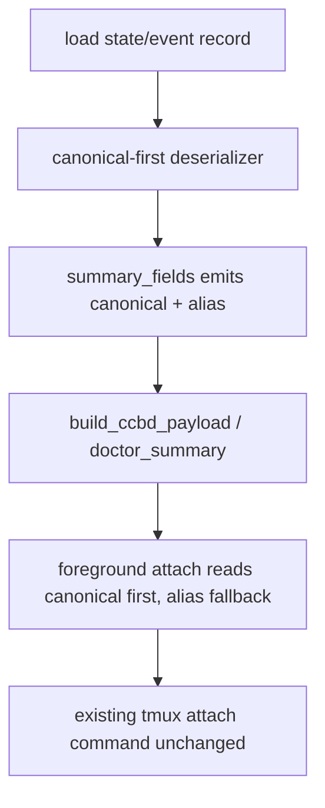

# windows-namespace-ipc-schema feature design

## 0. 术语约定

| 术语 | 定义 | 防冲突结论 |
|---|---|---|
| namespace schema | ccbd runtime authority、ping payload、doctor payload 和前台 attach 输入所共享的 namespace 记录形状。 | 本 feature 只改 schema 与兼容策略，不改 attach 行为。 |
| canonical namespace fields | 新的 mux-neutral 字段：`namespace_id`、`namespace_backend_family`、`namespace_backend_impl`、`namespace_ipc_kind`、`namespace_ipc_ref`、`namespace_session_name`。 | `namespace_backend_impl`、`namespace_ipc_kind`、`namespace_ipc_ref`、`namespace_session_name` 对齐 roadmap §4.3；`namespace_id` / `namespace_backend_family` 是从 state 事实派生出的 `MuxNamespaceRef` 投影字段。 |
| legacy tmux alias | 现有 `namespace_tmux_socket_path`、`namespace_tmux_session_name`，以及 state/event record 内的旧 `tmux_socket_path`、`tmux_session_name`。 | 迁移期必须保留。plain `tmux_*` 只属于 state/event record，不进入顶层 ping/doctor payload，避免覆盖 ccbd 自身的 `tmux_socket_path`。 |
| runtime authority | `ProjectNamespaceState` / `ProjectNamespaceEvent` / ping payload / doctor payload 的 ccbd 持久事实源。 | ccbd 仍是 authority；namespace 记录不是 Rmux authority。 |
| attach input | `start_foreground.py` 从 ccbd ping payload 读取的 namespace 字段。 | 本 feature 只让它能读 canonical+alias，不改 attach 语义。 |

术语 grep 结果：`ProjectNamespaceState` 仍以 `tmux_socket_path` / `tmux_session_name` 为硬字段；`doctor_summary()`、`build_ccbd_payload()`、`attach_started_project_namespace()` 和 `ProjectNamespacePaneRecord` 都仍直接读写旧 tmux 命名。

## 1. 决策与约束

### 需求摘要

本 feature 为 ccbd 的 namespace 状态、事件、ping/doctor payload 和 foreground attach 输入引入 mux-neutral canonical schema，同时保留旧 `namespace_tmux_*` / `tmux_*` 字段作为兼容别名。目标是让后续 Windows named pipe / Rmux namespace / diagnostics 能在不破坏现有 tmux 行为的前提下消费同一份 schema。

成功标准：

- `ProjectNamespaceState` 和 `ProjectNamespaceEvent` 能表达 canonical namespace fields，并可从旧 tmux 记录无损恢复。
- canonical payload 可机械投影为 `MuxNamespaceRef`：`backend_family`、`backend_impl`、`namespace_id`、`session_name`、`ipc_kind`、`ipc_ref` 都有确定来源。
- `ping('ccbd')` 和 `doctor_summary()` 输出 canonical 字段，同时继续输出旧 alias。
- 顶层 `ping('ccbd')` / doctor payload 中既有的 `tmux_socket_path` 仍表示 ccbd tmux socket placement，不能被 namespace alias 覆盖。
- `attach_started_project_namespace()` 能优先读取 canonical payload 字段，缺失时回退旧 alias，且 attach 行为本身不变。
- existing tests / current tmux path 不回退；旧 `namespace_tmux_*` 字段在迁移期继续可用。
- schema 变更可从文件记录、ping payload、doctor render 和 foreground attach 输入四个入口核对。

明确不做：

- 不实现 `RmuxBackend`，不启动 Rmux daemon。
- 不把 foreground attach 从 `tmux attach-session` 切到 `MuxBackend.attach_namespace()`；那是后续 `ccbd-rmux-namespace-lifecycle`。
- 不引入 Windows named pipe 真连接或 ACL 处理；这里只定义 schema，不定义 transport。
- 不修改 job object/process liveness；那是另一个 boundary。
- 不删除旧字段、旧 summary key 或旧 test fixture。

### 复杂度档位

- 兼容性：L3。必须同时支持旧记录和新字段，且诊断输出不漂移。
- 可测试性：verified。字段投影、反序列化和 payload 输出都能通过 pytest 直接验证。
- 健壮性：L2。只改 schema，不引入新的进程/网络行为。
- 安全性：inherited。只处理本地持久化与 payload 形状。

### 方案深度 pre-pass

候选：

1. 仅在 ping/doctor payload 上新增 canonical 字段，state 存储仍保持旧字段。
2. state / event / ping / doctor 全链路引入 canonical 字段，并保留旧 alias 兼容。

选择第二种。原因是如果只改 payload 不改 state store，ccbd 的 authority 仍会把 tmux 作为唯一命名，后续 named pipe / Rmux schema 仍然没有可持久化入口。转正条件：实现可证明旧 state 读入后会生成 canonical payload，而新 state 写出后旧消费者仍能读 alias。

### Top 3 风险与缓解

1. **字段兼容断层**：旧 state 或旧 payload 读不到新字段。缓解：from_record / payload reader 采用 canonical-first、alias-fallback。
2. **语义漂移**：canonical 字段只是换名，不表达 ipc kind/ref。缓解：明确 `namespace_ipc_kind` 与 `namespace_ipc_ref` 的规则，并在 tests 固化。
3. **payload key 覆盖**：plain `tmux_socket_path` 已在 ccbd payload 顶层表示 ccbd tmux socket placement。缓解：build/doctor 层在展开 namespace summary 前过滤 reserved keys；plain `tmux_*` alias 只保留在 state/event record，ping/doctor 顶层 namespace alias 只使用 `namespace_tmux_*`。
4. **前台 attach 误改为新行为**：schema 变更牵连 attach 流程。缓解：本 feature 只改读取字段和输出 payload，不改 attach 命令；canonical attach 输入只在 `namespace_backend_impl="tmux"` 时作为 tmux attach 输入。

### 非显然依赖与关键假设

- 依赖 `mux-backend-contract` 已通过；本 feature 只消费其 namespace/ipc 语义，不定义 backend runner。
- 假设 ccbd runtime authority 的 serializer/deserializer 允许新增字段而不破坏旧文件读取。
- 假设 `build_ccbd_payload()` 和 `doctor_summary()` 可接受扩展 dict，不需要先拆新模块。
- 假设 foreground attach 后续会消费 canonical fields 作为输入来源，但 attach 行为本 feature 不变。

### 基线风险与验证入口

当前最容易回退的是 state store 兼容和 doctor/ping payload 的字段顺序。验证入口以现有 pytest 为主，并补 YAML 校验。

## 2. 名词与编排

### 2.1 名词层

#### 现状

- `lib/ccbd/services/project_namespace_state_runtime/models.py` 的 `ProjectNamespaceState` 只持有 `tmux_socket_path` / `tmux_session_name`，并在 `to_record()` / `from_record()` / `summary_fields()` 中直接以 tmux 命名读写。
- `ProjectNamespaceEvent` 也只记录 `tmux_socket_path` / `tmux_session_name`。
- `lib/ccbd/handlers/ping_runtime/payloads.py` 的 `build_ccbd_payload()` 直接输出 `namespace_tmux_socket_path` / `namespace_tmux_session_name`。
- `lib/ccbd/handlers/ping_runtime/summaries.py` 和 `lib/cli/render_runtime/ops_views_doctor.py` 直接消费这些旧字段。
- `lib/cli/services/start_foreground.py` 从 ping payload 读取 `namespace_tmux_socket_path` / `namespace_tmux_session_name` 作为 attach 输入。

#### 变化

新增 canonical schema 概念：

```python
class NamespaceIpcRef(TypedDict):
    namespace_id: str
    namespace_backend_family: Literal["tmux-family"]
    namespace_backend_impl: Literal["tmux", "rmux"]
    namespace_session_name: str
    namespace_ipc_kind: Literal["unix_socket", "named_pipe", "socket_name"]
    namespace_ipc_ref: str
```

`ProjectNamespaceState` / `ProjectNamespaceEvent` / ping payload / doctor payload 变更为“canonical + alias 双轨”：

- canonical：`namespace_id`, `namespace_backend_family`, `namespace_backend_impl`, `namespace_session_name`, `namespace_ipc_kind`, `namespace_ipc_ref`
- ping/doctor 顶层 alias：`namespace_tmux_socket_path`, `namespace_tmux_session_name`
- state/event record alias：`tmux_socket_path`, `tmux_session_name`

映射规则：

- `namespace_id` 固定等于 ccbd `project_id`（项目路径哈希身份）；旧记录缺失时直接从 record/payload 的 `project_id` 取值，不走 session-derived 变体。
- `namespace_id` 不加 `ccb-` 前缀，也不跟 `namespace_session_name` 共享格式规则；它只作为后续 `MuxNamespaceRef` 的稳定 namespace identity。
- `namespace_backend_family` 固定为 `"tmux-family"`，用于投影到 `MuxNamespaceRef.backend_family`。
- 旧 tmux 路径：`namespace_backend_impl="tmux"`。
- `namespace_session_name` 优先读取 canonical 字段，旧记录回退 `tmux_session_name`，旧 payload 回退 `namespace_tmux_session_name`。
- `tmux_socket_path` 非空时：`namespace_ipc_kind="unix_socket"`，`namespace_ipc_ref` 为归一化后的 socket path。
- `tmux_socket_path` 为空但 `tmux_session_name` 非空时：`namespace_ipc_kind="socket_name"`，`namespace_ipc_ref` 为 session name 或 default server 标识。
- named pipe 入口预留 `namespace_ipc_kind="named_pipe"`，但本 feature 不实现 pipe 连接。
- legacy alias 继续写出旧字段，不能仅靠 canonical 字段让旧读者失效。
- `ProjectNamespaceState.to_record()` / `ProjectNamespaceEvent.to_record()` 可以继续写出 plain `tmux_socket_path` / `tmux_session_name` 作为持久兼容字段；`summary_fields()` 可以保留它们，但 `build_ccbd_payload()` 和 doctor payload 在展开 `namespace_summary` / `namespace_event_summary` 之前必须过滤 reserved keys，禁止 plain `tmux_socket_path` / `tmux_session_name` 进入顶层或覆盖 ccbd 自身的 `tmux_socket_path`。
- 顶层 `build_ccbd_payload()` 已有 `tmux_socket_path`，其语义保持为 ccbd tmux socket placement；namespace socket 只能通过 `namespace_ipc_ref` / `namespace_tmux_socket_path` 暴露。
- `MuxNamespaceRef` 投影关系固定为：`backend_family=namespace_backend_family`、`backend_impl=namespace_backend_impl`、`namespace_id=namespace_id`、`session_name=namespace_session_name`、`ipc_kind=namespace_ipc_kind`、`ipc_ref=namespace_ipc_ref`。
- no-clobber 断言必须使用不同 sentinel：ccbd 顶层 `tmux_socket_path`、namespace state/plain alias、`namespace_tmux_socket_path` 三者不能同值，否则测试无效。

接口示例：

```python
# 来源：lib/ccbd/services/project_namespace_state_runtime/models.py ProjectNamespaceState.summary_fields
summary = state.summary_fields()
assert summary['namespace_id'] == state.project_id
assert summary['namespace_backend_family'] == 'tmux-family'
assert summary['namespace_backend_impl'] == 'tmux'
assert summary['namespace_tmux_socket_path'] == summary['namespace_ipc_ref']
assert 'tmux_socket_path' not in summary

# 来源：lib/cli/services/start_foreground.py attach_started_project_namespace
payload = client.ping('ccbd')
backend_impl = payload.get('namespace_backend_impl') or 'tmux'
session_name = payload.get('namespace_session_name') or payload.get('namespace_tmux_session_name')
ipc_ref = payload.get('namespace_ipc_ref') or payload.get('namespace_tmux_socket_path')
assert payload['tmux_socket_path'] != payload.get('namespace_tmux_socket_path')
assert payload['tmux_socket_path'] != ipc_ref
```

Interface 设计检查：

- Module / interface：ccbd runtime store 和 diagnostics payload 是 schema 的唯一消费者；schema 变更集中在 state/event/ping/doctor/foreground attach 输入。
- Seam placement：兼容层在 serializer / deserializer / payload builder / renderer / attach input，不散落在业务逻辑。
- Depth / locality：这是持久 schema seam，必须一次性定义 canonical 和 alias，避免 later consumer 各自补字段。
- Dependency strategy：local-substitutable；可用旧 state fixture 与新 state fixture 双向验证。
- Adapter：无新的生产 adapter；通过 serializer / payload 映射实现。

### 2.2 编排层



#### 现状

当前 schema 的单一事实源是 tmux 命名：state/event/ping/doctor/foreground attach 输入都直接写 `tmux_socket_path` / `tmux_session_name`，旧字段和真实 transport 强耦合。

#### 变化

本 feature 引入 canonical schema 之后：

1. state/event 读写变成 canonical-first，但仍保存 record-level legacy alias。
2. ping/doctor payload 输出 canonical 和 `namespace_tmux_*` legacy alias；plain `tmux_*` namespace alias 不进入顶层 payload。
3. foreground attach 输入在 `namespace_backend_impl="tmux"` 时优先 canonical，再回退 legacy；attach 命令维持当前 tmux 行为。

流程级约束：

- 兼容性：旧记录必须可读，新记录必须可被旧消费者通过 alias 读到。
- 幂等性：state/event 的序列化多次保存不得因为 alias 写出改变语义。
- 顺序：先定义 canonical，再投影 alias；不得反过来让 alias 成为唯一源。
- 可观测点：doctor/ping payload 同时暴露 canonical 和 alias，便于迁移期比对。
- 冲突保护：`namespace_summary` / `namespace_event_summary` 展开到 `build_ccbd_payload()` 或 doctor ccbd summary 前必须过滤 reserved key；不得覆盖 ccbd 顶层 `tmux_socket_path` / `tmux_*` placement 字段。
- 扩展点：后续 `windows-job-object-runtime-evidence` / `ccbd-rmux-namespace-lifecycle` 只需扩展 canonical payload，不再新增 tmux 命名。

### 2.3 挂载点清单

- `lib/ccbd/services/project_namespace_state_runtime/models.py`：删除后 namespace schema 无法持久化。
- `lib/ccbd/handlers/ping_runtime/payloads.py`：删除后 ping payload 无法输出 canonical/alias 双轨。
- `lib/ccbd/handlers/ping_runtime/summaries.py` / `lib/cli/render_runtime/ops_views_doctor.py`：删除后 doctor 无法展示 canonical namespace fields。
- `lib/cli/services/start_foreground.py`：删除后 foreground attach 输入无法兼容 canonical payload。
- `lib/ccbd/services/project_namespace_pane.py`：删除后 socket matching / namespace pane 检查仍停留在旧字段语义。

### 2.4 推进策略

1. **schema contract**：定义 canonical namespace fields、`MuxNamespaceRef` 投影和 alias 关系，明确 `namespace_ipc_kind` / `namespace_ipc_ref` 规则。
   退出信号：checklist 和 design 都能列出 canonical/alias 键、`namespace_id == project_id`、`namespace_backend_family` 固定值和 plain `tmux_*` payload 禁入规则。
2. **state/event roundtrip**：让 `ProjectNamespaceState` / `ProjectNamespaceEvent` 读写 canonical + alias，旧记录能恢复新字段，新记录继续保留旧字段。
   退出信号：旧 fixture 与新 fixture roundtrip tests 通过。
3. **ping/doctor payload**：`build_ccbd_payload()`、`doctor_summary()`、doctor renderer 输出 canonical 和 alias。
   退出信号：payload/render tests 可断言两套字段同时存在，并用不同 sentinel 证明 reserved key 不覆盖。
4. **foreground attach input compatibility**：`attach_started_project_namespace()` 先读 canonical，再回退 legacy，attach 行为不改。
   退出信号：attach tests 仍通过，且 canonical payload fixture 也可驱动同一路径。
5. **compatibility regression**：补齐旧字段 / 新字段 / 混合字段的回归，确保 `ccbd` / `doctor` / `start` / `foreground` 不漂移。
   退出信号：所有 schema regression tests 通过。

### 2.5 结构健康度与微重构

##### 评估

- 文件级 — `lib/ccbd/services/project_namespace_state_runtime/models.py`：当前职责集中在 namespace record schema，扩展 canonical fields 合理，不需要拆文件。
- 文件级 — `lib/ccbd/handlers/ping_runtime/payloads.py`：payload builder 已承担多个 summary 组合，本 feature 只是扩展字段，不需要结构微重构。
- 文件级 — `lib/cli/services/start_foreground.py`：文件较长，但本 feature 只改输入解析，不做 attach 行为重构。
- 目录级 — `lib/ccbd/services/project_namespace_state_runtime/`：已有 state/event/store 分层，新增字段不需要目录重组。

##### 结论：不做行为微重构

原因：这是 schema 演进，不是只搬不改行为的目录整理。拆分 state/payload/foreground 逻辑会引入额外风险，不在本 feature 范围内。

## 3. 验收契约

### 3.1 关键场景清单

| ID | 输入 / 触发 | 期望可观察结果 | 证据类型 |
|---|---|---|---|
| AC-001 | 读取旧 `ProjectNamespaceState` / `ProjectNamespaceEvent` 记录 | 能恢复 canonical namespace fields，同时保留旧 alias | unit test |
| AC-002 | 保存新 namespace state/event | `to_record()` / `summary_fields()` 同时写出 canonical 和适用层级的 legacy keys，且 plain alias 不进入 ping/doctor 顶层 | unit test |
| AC-003 | `ping('ccbd')` | payload 同时包含 canonical namespace fields 与旧 `namespace_tmux_*` alias，且顶层 `tmux_socket_path` 不被 namespace alias 覆盖 | unit test |
| AC-004 | `doctor_summary()` / doctor render | canonical 和 alias 都能在 payload / render 中看到，且 doctor 继续展示 ccbd tmux placement 与 namespace socket 两条不同语义 | unit test |
| AC-005 | `attach_started_project_namespace()` 接收 canonical payload | attach 路径不变，canonical 字段优先、alias 回退生效 | unit test / regression |
| AC-006 | 旧 fixture + 新 fixture 混合运行 | 现有 tmux path 不回退，`namespace_tmux_*` 仍可用 | regression |
| AC-007 | 从 state summary / ping payload 构造 backend-neutral namespace ref | 能投影出 `backend_family`、`backend_impl`、`namespace_id`、`session_name`、`ipc_kind`、`ipc_ref`，且 `namespace_id == project_id` | contract test |

### 3.2 明确不做的反向核对项

- 不应把 `tmux attach-session` 改成 `MuxBackend.attach_namespace()`。
- 不应删除 `namespace_tmux_socket_path` / `namespace_tmux_session_name` 兼容字段。
- 不应把 plain `tmux_socket_path` / `tmux_session_name` 作为 namespace alias 展开到顶层 ping/doctor payload。
- 不应引入 named pipe 真连接、ACL、job object 或 process liveness 逻辑。
- 不应让 `ProjectNamespaceState` 只剩 canonical 字段而不保留 alias。
- 不应改变 `ccbd` 作为 authority 的事实。

### 3.3 Acceptance Coverage Matrix

| Scenario | Covered By Step | Evidence Type | Command / Action | Core? |
|---|---|---|---|---|
| AC-001 old record roundtrip | S2, S5 | unit test | state/event fixture tests | yes |
| AC-002 new record alias projection | S2 | unit test | save/load summary_fields tests | yes |
| AC-003 ping payload dual schema + no clobber | S3, S5 | unit test | ping payload tests | yes |
| AC-004 doctor payload/render dual schema + no clobber | S3, S5 | unit test | doctor summary/render tests | yes |
| AC-005 foreground attach compatibility | S4 | regression | start_foreground tests | yes |
| AC-006 mixed fixture compatibility | S5 | regression | ccbd socket / cleanup / render tests | yes |
| AC-007 MuxNamespaceRef projection | S1, S2, S3 | contract test | namespace ref projection tests | yes |

### 3.4 DoD Contract

| ID | 要求 | 证据 | 阻塞级别 |
|---|---|---|---|
| DOD-DESIGN-001 | design/checklist/review 完整，且遵守 roadmap §4.3 namespace schema contract | design review | blocking |
| DOD-IMPL-001 | canonical namespace fields 与 legacy alias 同时可读可写 | unit tests | blocking |
| DOD-IMPL-002 | ping/doctor payload 同时展示 canonical 与 `namespace_tmux_*` legacy keys，且不覆盖 ccbd 顶层 `tmux_socket_path` | unit tests | blocking |
| DOD-IMPL-003 | foreground attach 先读 canonical 再回退 alias，行为不变 | regression tests | blocking |
| DOD-IMPL-004 | 旧 state/event fixtures 继续可恢复，现有 tmux 测试不回退 | regression tests | blocking |
| DOD-IMPL-005 | canonical payload 可投影为完整 `MuxNamespaceRef`，`namespace_id == project_id` 且 `namespace_backend_family` 来源可测 | contract tests | blocking |
| DOD-REVIEW-001 | code review passed 且无 unresolved blocking | review report | blocking |
| DOD-QA-001 | QA 覆盖 state、ping、doctor、foreground attach 和旧 fixture 兼容 | QA report | blocking |
| DOD-ACCEPT-001 | acceptance 回写 roadmap item 且记录兼容策略 | acceptance report | blocking |

Validation Commands:

| ID | 命令 | 目的 | 核心性 | 失败处理 |
|---|---|---|---|---|
| CMD-001 | `python ".codestable/tools/validate-yaml.py" --file ".codestable/features/2026-07-19-windows-namespace-ipc-schema/windows-namespace-ipc-schema-checklist.yaml" --yaml-only` | checklist YAML 合法性 | core | fix-or-block |
| CMD-002 | `python ".codestable/tools/validate-yaml.py" --file ".codestable/roadmap/windows-rmux-native-backend/windows-rmux-native-backend-items.yaml"` | roadmap items 回写合法性 | core | fix-or-block |
| CMD-003 | `python -m pytest -q test/test_v2_project_namespace_state.py` | state/event roundtrip、alias projection、`MuxNamespaceRef` projection 和 plain alias payload 禁入 | core | fix-or-block |
| CMD-004 | `python -m pytest -q test/test_v2_ccbd_socket.py test/test_v2_start_foreground.py test/test_v2_tmux_cleanup_history.py -k "namespace or ping or doctor or attach"` | ping/doctor/foreground attach 兼容回归，覆盖 canonical-first、alias-fallback、顶层 `tmux_socket_path` 不被覆盖；no-clobber fixture 必须使用不同 sentinel 值 | core | fix-or-block |
| CMD-005 | `python -m pytest -q test/test_v2_cli_render.py test/test_ccbd_project_view.py -k "namespace_tmux or namespace_ or tmux_socket_path"` | doctor render / project view / mixed fixture / no-clobber 回归；no-clobber fixture 必须使用不同 sentinel 值 | supporting | document-baseline |

Required Artifacts：design、checklist、design-review、state/schema tests、namespace ref projection tests、ping/doctor no-clobber tests、foreground compatibility tests、items.yaml 回写。

### 3.5 自我批判结论

- 可证伪性：核心场景都可以通过字段断言和回归测试验证。
- 步骤原子性：schema、state roundtrip、payload、foreground input、regression 五步彼此独立。
- 最弱依赖：旧记录兼容最容易漏，已经在 AC-001/002/006 和 CMD-003/004/005 中覆盖。
- 证据完整性：payload / render / attach 输入都有明确证据类型，不依赖口头说明。
- 交付物可核验性：acceptance 能从 state file、ping payload、doctor output、test diff 核验。
- 清洁度规则：不新增临时 TODO/FIXME、调试输出、注释掉代码、死 import；不提前引入 named pipe 实现细节。

## 4. 与项目级架构文档的关系

- 本 feature 消费 roadmap §4.3 namespace schema contract，落地 canonical namespace fields 和 legacy alias 迁移策略。
- 本 feature 为后续 `windows-job-object-runtime-evidence`、`ccbd-rmux-namespace-lifecycle` 和 Windows diagnostics bundle 提供 mux-neutral namespace 事实入口。
- 本 feature 不改安装、transport 或 provider session contract；这些留给各自后续 feature。
