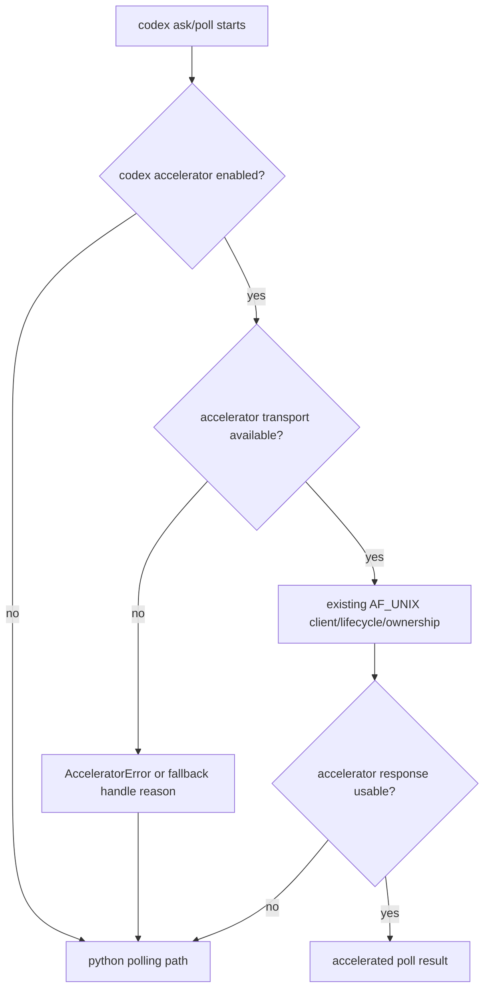

# accelerator-transport-windows-guard feature design

## 0. 术语约定

| 术语 | 定义 | 防冲突结论 |
|---|---|---|
| runtime accelerator | `lib/runtime_accelerator` 的 codex polling sidecar，协议是 `{"method","params"}` 到 `{"ok","result"}`。 | 与 ccbd 控制面 RPC transport 是两套 socket / 协议，不复用 `RpcTransport` seam。 |
| unsupported accelerator transport | 当前平台不具备 accelerator 依赖的 AF_UNIX 能力。 | 本 feature 将其归一为 clean fallback，不把 Windows 当作 accelerator 启动失败或 owner mismatch。 |
| clean fallback | accelerator 默认仍可开启，但在不可用平台不启动、不抢占、不连接，返回可诊断 error，并让 codex polling 走 Python reader。 | 失败必须是 `AcceleratorError` 或 `RuntimeAcceleratorHandle.error`，不能裸抛 `AttributeError`。 |
| no-AF_UNIX simulation | 单测中 monkeypatch 删除/屏蔽 `socket.AF_UNIX` 或模拟平台不可用。 | 用于在非 Windows CI 上覆盖 Windows 行为，不要求真实 Windows runner 才能证明回归。 |

`unsupported_platform:windows_no_af_unix` 是面向当前生产目标 native Windows 的稳定 reason；非 Windows CI 的 monkeypatch 只是覆盖同一 fallback 分支，不代表该平台本身要被标记为 Windows。

仓库事实：

- `lib/runtime_accelerator/client.py::call()` 直接访问 `socket.AF_UNIX`，该属性访问发生在 `except OSError` 覆盖范围内但 AttributeError 不是 OSError；`call_or_fallback()` 只捕获 `AcceleratorError`。
- `lib/provider_backends/codex/execution_runtime/accelerator.py::poll_with_accelerator()` 在 `codex_accelerator_enabled()` 为真时调用 `accelerator_client.call()`，只捕获 `AcceleratorError`；默认 codex ask/poll 路径会因此被裸 `AttributeError` 打断。
- `lib/runtime_accelerator/lifecycle.py::maybe_start_runtime_accelerator()` 默认启用时会计算 socket、reclaim owner、启动 sidecar，并把 `RuntimeAcceleratorHandle.error` 投影到 ccbd startup actions。
- `lib/runtime_accelerator/ownership.py::_socket_is_connectable()` 也直接访问 `socket.AF_UNIX`；`reclaim_runtime_accelerator()`、`recover_corrupt_runtime_accelerator_owner()`、`runtime_accelerator_socket_is_connectable()` 会间接使用它。
- roadmap 明确本 item 的深度选择是“Windows transport”或“guard+clean fallback”；本轮 milestone 的目标是 `ccb ask` 不崩，不要求 accelerator sidecar 在 Windows 可用。

## 1. 决策与约束

### 需求摘要

本 feature 修复 runtime accelerator 在 native Windows 无 `socket.AF_UNIX` 时的默认路径崩溃：codex accelerator caller、sidecar lifecycle 和 ownership socket probing 都必须把平台不可用归一为可诊断 fallback。Unix 平台已有 accelerator 行为、协议和 owner reclaim 语义保持不变。

成功标准：

- native Windows / no-AF_UNIX 环境下，`poll_with_accelerator()` 返回 `None`，随后 `poll_submission()` 可走现有 Python reader fallback，不抛 `AttributeError`。
- `call()` 在 transport 不可用时抛 `AcceleratorError("unsupported_platform:windows_no_af_unix")` 或同等稳定前缀；`call_or_fallback()` 调用 fallback。
- `maybe_start_runtime_accelerator()` 在 unsupported platform 不调用 `reclaim_runtime_accelerator()`、不 `Popen()`、不创建/删除 socket 文件，返回带 fallback reason 的 `RuntimeAcceleratorHandle`。
- ownership 的 connectability / corrupt owner recovery 在 unsupported platform 不抛 `AttributeError`，且不把“无法 probe AF_UNIX”误判为 active socket。
- Unix / AF_UNIX 可用平台现有 client、lifecycle、ownership、polling tests 不漂移。

明确不做：

- 不实现 Windows accelerator transport，不新增 TCP/named-pipe accelerator sidecar。
- 不复用或修改 ccbd 控制面 `RpcTransport` seam。
- 不改变 `codex_accelerator_enabled()` 默认值，不把 accelerator 在 Windows 全局禁用为配置策略。
- 不修改 Rmux backend、ccbd 控制面 transport、process liveness、provider completion parser 或 packaging/docs。
- 不删除 owner manifest，不抢占 legacy pids，除非当前平台支持 accelerator transport 并能验证 socket 语义。

### 方案深度决策

采用 **guard + clean fallback**，不做 Windows accelerator transport。

理由：

- 当前用户目标是 Windows full-chain `ccb ask` 不因 accelerator caller 崩溃；accelerator 是性能优化，不是 ask 正确性的 authority。
- accelerator 协议、server binary、owner identity 当前都围绕 AF_UNIX socket 与 Unix `/proc` / `ps` / `lsof` 证据建模。要做 Windows transport 必须同步定义 server listen、client handshake、owner identity、stale cleanup、binary packaging 和安全边界，已经超出本 child。
- ccbd 控制面 transport 已有独立 TCP loopback seam track；把 runtime accelerator 也硬塞进该 seam 会混淆两个协议和生命周期。
- clean fallback 可用少量 guard 保护默认路径，并保留后续单独设计 Windows accelerator transport 的空间。

### 关键契约

1. **单一 availability helper**

```python
def accelerator_transport_available() -> bool: ...

def accelerator_unsupported_reason() -> str:
    return "unsupported_platform:windows_no_af_unix"
```

候选落点为 `lib/runtime_accelerator/platform.py` 或 `lib/runtime_accelerator/config.py` 内的窄 helper。实现阶段可按模块边界微调，但 `client`、`lifecycle`、`ownership` 不能各自散落 `hasattr(socket, "AF_UNIX")` 和不同 reason。

2. **client fallback 语义**

- `call()` 在创建 socket 前先检查 availability；不可用时抛 `AcceleratorError(unsupported_reason)`。
- `call_or_fallback()` 不需要扩 catch-all；它通过捕获 `AcceleratorError` 触发 fallback。
- `poll_with_accelerator()` 继续只捕获 `AcceleratorError`；不扩大为吞掉所有异常，避免掩盖真实 parser/logic bug。

3. **lifecycle 语义**

- `maybe_start_runtime_accelerator()` 先尊重 `codex_accelerator_enabled()`；禁用时仍返回 `enabled=False`。
- 启用但 transport unsupported 时返回 `RuntimeAcceleratorHandle(enabled=True, socket_path=<resolved or None>, process=None, error=unsupported_reason, project_root=...)`。
- 该路径必须发生在 binary lookup、owner reclaim、socket mkdir、`subprocess.Popen()` 之前。
- ccbd startup actions 可继续投影为 `runtime_accelerator_fallback:unsupported_platform:windows_no_af_unix`。

4. **ownership 语义**

- `_socket_is_connectable()` 在 unsupported platform 返回 `False`，不抛。
- `runtime_accelerator_socket_is_connectable()` 同步返回 `False`。
- `reclaim_runtime_accelerator()` 在 unsupported platform 必须在 owner / legacy pid reclaim 前返回空 reclaim 结果或等价 clean no-op：不调用 `terminate_pid_tree()`、不删除 owner manifest、不中断用户进程、不声明 active socket。
- `recover_corrupt_runtime_accelerator_owner(force=True)` 在 unsupported platform 不得因为无法 AF_UNIX probe 删除 owner/socket evidence；若需要处理 corrupt owner，返回 blocked/warning 或等价 fail-closed 结果，等待后续 Windows accelerator transport 设计定义安全 reclaim。

### Top 3 风险与缓解

1. **风险：为修 AttributeError 扩大 catch-all，吞掉真实 accelerator bug。**  
   缓解：只把 unsupported transport 转换为 `AcceleratorError`，不改变 `poll_with_accelerator()` 的异常边界。
2. **风险：Windows lifecycle 仍执行 reclaim/start，误删 socket/owner evidence 或启动不可用 binary。**  
   缓解：availability guard 放在 binary lookup、reclaim、mkdir、Popen 前；测试断言这些 hook 未调用。
3. **风险：Unix 行为被平台 guard 改坏。**  
   缓解：保留现有 AF_UNIX tests，并新增 guard 单测只覆盖 no-AF_UNIX 分支；不改协议、response parsing 和 owner identity。

### 非显然依赖与关键假设

- 依赖现有 Python reader fallback 能在 accelerator 返回 `None` 后继续 poll；本 feature 只保证不阻断 fallback。
- 假设 no-AF_UNIX 平台上 runtime accelerator 可被视为性能优化不可用，而不是必须启动的业务依赖。
- 假设后续如果要支持 Windows accelerator transport，会另起 feature 定义安全、owner identity 和 server listen 协议。

## 2. 名词与编排

### 2.1 名词层

#### 现状

- `AcceleratorError` 是 client 对外失败类型；call site 以它作为 fallback 边界。
- `RuntimeAcceleratorHandle` 已有 `enabled`、`socket_path`、`process`、`error`、`project_root`、`reclaimed_pids` 字段，足以表达“配置启用但运行时不可用”。
- ownership 以 owner manifest、process identity、legacy argv 和 socket connectability 判断 reclaim/recovery；connectability 当前假设 AF_UNIX 存在。

#### 变化

新增/收敛的名词：

```text
AcceleratorTransportAvailability
  available: bool
  reason: "unsupported_platform:windows_no_af_unix" | ""

Unsupported accelerator fallback handle
  enabled=True
  process=None
  error="unsupported_platform:windows_no_af_unix"
```

Interface 设计检查：

- Module：availability helper 属于 runtime accelerator 模块内部，不暴露为 ccbd 或 mux 的公共契约。
- Interface：client/lifecycle/ownership 只消费同一个 helper/reason。
- Seam：这是能力 guard，不是新 transport seam；后续 Windows transport 可替换 helper 实现，但本 feature 不定义 adapter。
- Depth / locality：medium；触碰三个 runtime accelerator 文件和 codex polling tests，但不改 provider parser 或 ccbd transport。
- Dependency strategy：local-substitutable；no-AF_UNIX 用 monkeypatch 模拟，Unix 行为用既有 AF_UNIX tests 回归。

### 2.2 编排层



流程级约束：

- availability check 必须在 `socket.AF_UNIX` 属性访问前执行。
- unsupported platform 是 deterministic fallback，不依赖用户配置、不触发 socket path cleanup。
- lifecycle 不应把 unsupported platform 记录为 `missing_binary`、`startup_timeout` 或 owner identity failure。
- ownership socket probe 的 unsupported fallback 只影响 connectability；process identity fail-closed 语义保持。
- logging/diagnostics 只记录 reason 前缀，不包含用户路径之外的 secret；本 feature 不新增敏感信息。

### 2.3 挂载点清单

- `lib/runtime_accelerator/client.py`：client call 前置 guard 和 fallback reason。
- `lib/runtime_accelerator/lifecycle.py`：startup 前置 guard，返回 fallback handle。
- `lib/runtime_accelerator/ownership.py`：socket connectability guard。
- `lib/runtime_accelerator/platform.py` 或等价模块：单一 availability helper。
- `lib/provider_backends/codex/execution_runtime/accelerator.py`：不改异常边界；通过 tests 证明只捕获 `AcceleratorError` 已足够。
- tests：client/lifecycle/ownership/codex polling no-AF_UNIX 回归。

### 2.4 推进策略

1. **availability helper**：新增单一 helper 和稳定 reason，并让 runtime accelerator 内部使用。  
   退出信号：no-AF_UNIX 模拟下 helper 返回不可用；AF_UNIX 可用下不改变现有路径。
2. **client guard**：`call()` 在创建 socket 前把 unsupported transport 转成 `AcceleratorError`，`call_or_fallback()` 触发 fallback。  
   退出信号：单测证明 `call()` 不抛 `AttributeError`，`call_or_fallback()` 返回 fallback 值。
3. **codex polling fallback**：默认 accelerator enabled 且 socket path 存在时，unsupported transport 让 `poll_with_accelerator()` 返回 `None`。  
   退出信号：`poll_submission()` 可继续走 Python reader fallback，不调用 accelerator socket。
4. **lifecycle guard**：`maybe_start_runtime_accelerator()` 在 unsupported transport 下返回 fallback handle，不 reclaim、不 Popen。  
   退出信号：测试记录 unsupported check 早于 `accelerator_binary()`、`reclaim_runtime_accelerator()`、`socket_path.parent.mkdir()`、`subprocess.Popen()`；startup actions 含 stable fallback reason。
5. **ownership direct-call guard**：`runtime_accelerator_socket_is_connectable()`、`reclaim_runtime_accelerator()` 和 corrupt owner recovery 在 unsupported transport 下 clean fallback。  
   退出信号：direct ownership tests 不抛 AttributeError、不调用 `terminate_pid_tree()`、不删除 owner/socket evidence、不误报 active socket。
6. **Windows baseline and Unix regression**：修正或隔离当前 Windows 上与本 feature 无关但会阻断 core 命令的 baseline-red，并保留 AF_UNIX 行为。  
   退出信号：`test_default_socket_path_uses_project_ccb_for_short_paths` 在 Windows 的 path expectation 已平台中立或记录为非 feature failure；既有 accelerator tests 通过。
7. **scope guard**：禁止本 feature 修改 ccbd transport/Rmux/process liveness/provider parser/packaging/docs。  
   退出信号：scope guard 无越界改动。

### 2.5 结构健康度与微重构

##### 评估

- 文件级：`client.py` 很小，新增 guard 不应引入新类或 catch-all。
- 文件级：`lifecycle.py` 已承担 startup orchestration，availability check 属于启动前置条件，可放在早期分支。
- 文件级：`ownership.py` 较长且包含 Unix process/socket identity 细节；不应在其中散落平台判断，避免继续变胖。
- 目录级：`lib/runtime_accelerator/` 已有 config/client/lifecycle/ownership 分层，适合新增一个极窄 `platform.py` 或等价 helper 文件。

##### 结论：新增窄 helper，不做行为等价大重构

本 feature 只新增 availability helper 并在三个入口消费，不拆分 ownership 大文件，不重组目录。ownership 的 `/proc` / `ps` / `lsof` 跨平台建模属于后续 Windows accelerator transport 或 process identity 专项，不阻塞本 guard。

## 3. 验收契约

### 3.1 关键场景清单

| ID | 输入 / 触发 | 期望可观察结果 | 证据类型 |
|---|---|---|---|
| AC-001 | `socket.AF_UNIX` 缺失时调用 `runtime_accelerator.client.call()` | 抛 `AcceleratorError`，reason 为 `unsupported_platform:windows_no_af_unix`，不抛 `AttributeError` | unit |
| AC-002 | `call_or_fallback()` 在 no-AF_UNIX 环境调用 | 返回 fallback 值 | unit |
| AC-003 | codex accelerator 默认 enabled 且 no-AF_UNIX | `poll_with_accelerator()` 返回 `None`，不阻断 Python polling | unit |
| AC-004 | `poll_submission()` 在 no-AF_UNIX 环境下有可读 session | 走普通 reader fallback，不因 accelerator caller 崩溃 | unit |
| AC-005 | `maybe_start_runtime_accelerator()` 在 no-AF_UNIX 环境且 env 默认 enabled | 返回 `enabled=True/process=None/error=unsupported_platform:windows_no_af_unix`，不 reclaim、不 Popen | unit |
| AC-006 | ccbd startup actions 消费 unsupported handle | 输出 `runtime_accelerator_fallback:unsupported_platform:windows_no_af_unix` | unit |
| AC-007 | `runtime_accelerator_socket_is_connectable()` 在 no-AF_UNIX 环境 | 返回 `False`，不抛 `AttributeError` | unit |
| AC-008 | 直接调用 `reclaim_runtime_accelerator()` 且平台 no-AF_UNIX | 不调用 `terminate_pid_tree()`，不删除 owner manifest/socket evidence，返回空 reclaim 或 clean no-op | unit |
| AC-009 | `recover_corrupt_runtime_accelerator_owner(force=True)` 且平台 no-AF_UNIX | 不因无法 probe AF_UNIX 删除 corrupt owner/socket evidence；返回 blocked/warning 或等价 fail-closed | unit |
| AC-010 | Windows 本机运行 core accelerator pytest | 已知 `Path("/repo")` baseline-red 被平台中立修正或归因为既有测试问题后再判断本 feature | regression |
| AC-011 | Unix / AF_UNIX 可用平台现有 accelerator client/lifecycle/ownership tests | 既有行为不变 | regression |
| AC-012 | scope guard | 不修改 ccbd transport、Rmux backend、process liveness、provider parser、packaging/docs | guard/review |

### 3.2 明确不做的反向核对项

- 不应新增 Windows accelerator TCP/named-pipe server/client。
- 不应扩大 `poll_with_accelerator()` 为 catch-all。
- 不应在 unsupported platform 下启动 sidecar、reclaim owner、删除 socket 或杀 legacy pid。
- 不应只把 `_socket_is_connectable()` guard 成 `False` 就宣称 ownership 完成；direct reclaim/recovery 也必须有 no-op/fail-closed 覆盖。
- 不应修改 ccbd 控制面 transport seam 或 Rmux mux backend。
- 不应改变 Unix AF_UNIX accelerator 协议与 response parsing。

### 3.3 Acceptance Coverage Matrix

| Scenario | Covered By Step | Evidence Type | Command / Action | Core? |
|---|---|---|---|---|
| AC-001 client error type | S1,S2 | unit | `test_runtime_accelerator_client.py` no-AF_UNIX test | yes |
| AC-002 call_or_fallback | S2 | unit | `test_runtime_accelerator_client.py` fallback test | yes |
| AC-003 poll_with_accelerator fallback | S3 | unit | `test_codex_runtime_accelerator_polling.py` no-AF_UNIX test | yes |
| AC-004 poll_submission Python fallback | S3 | unit | `test_codex_runtime_accelerator_polling.py` reader fallback test | yes |
| AC-005 lifecycle guard | S4 | unit | `test_runtime_accelerator_lifecycle.py` unsupported platform test | yes |
| AC-006 startup action projection | S4 | unit | lifecycle startup actions test | yes |
| AC-007 ownership connectability | S5 | unit | `test_runtime_accelerator_ownership.py` no-AF_UNIX test | yes |
| AC-008 direct reclaim no-op | S5 | unit | `test_runtime_accelerator_ownership.py` no-AF_UNIX reclaim test | yes |
| AC-009 corrupt recovery fail-closed | S5 | unit | `test_runtime_accelerator_ownership.py` no-AF_UNIX corrupt recovery test | yes |
| AC-010 Windows baseline | S6 | regression | platform-neutral path expectation or baseline note | yes |
| AC-011 Unix regression | S6 | regression | existing accelerator test files | yes |
| AC-012 scope guard | S7 | guard | `git diff --name-only` / review | yes |

### 3.4 DoD Contract

| ID | 要求 | 证据 | 阻塞级别 |
|---|---|---|---|
| DOD-DESIGN-001 | design/checklist/review 完整，且对齐 roadmap item `accelerator-transport-windows-guard` | design review | blocking |
| DOD-IMPL-001 | runtime accelerator availability helper 单一 owner，reason 稳定 | unit/diff review | blocking |
| DOD-IMPL-002 | client no-AF_UNIX 转 `AcceleratorError`，fallback 生效 | unit | blocking |
| DOD-IMPL-003 | codex poll path no-AF_UNIX 返回普通 polling fallback | unit | blocking |
| DOD-IMPL-004 | lifecycle unsupported platform 不 reclaim、不 Popen，并投影 startup action | unit | blocking |
| DOD-IMPL-005 | ownership connectability no-AF_UNIX 返回 false，direct reclaim 不杀进程/不删 evidence，corrupt recovery fail-closed | unit | blocking |
| DOD-IMPL-006 | Windows baseline-red 已修正或归因；Unix accelerator 行为和 tests 不漂移 | regression | blocking |
| DOD-IMPL-007 | scope guard 无 ccbd transport/Rmux/process liveness/provider parser 越界 | diff review | blocking |
| DOD-REVIEW-001 | code review passed 且无 unresolved blocking | review report | blocking |
| DOD-QA-001 | QA 覆盖 no-AF_UNIX 模拟和 Unix regression | QA report | blocking |
| DOD-ACCEPT-001 | acceptance 回写 roadmap item，并明确 Windows accelerator transport 仍未实现 | acceptance report | blocking |

Validation Commands:

| ID | 命令 | 目的 | 核心性 | 失败处理 |
|---|---|---|---|---|
| CMD-001 | `python ".codestable/tools/validate-yaml.py" --file ".codestable/features/2026-07-20-accelerator-transport-windows-guard/accelerator-transport-windows-guard-checklist.yaml" --yaml-only` | checklist YAML 合法性 | core | fix-or-block |
| CMD-002 | `python ".codestable/tools/validate-yaml.py" --file ".codestable/roadmap/windows-rmux-native-backend/windows-rmux-native-backend-items.yaml"` | roadmap items 回写合法性 | core | fix-or-block |
| CMD-003 | `python -m pytest -q test/test_runtime_accelerator_client.py test/test_runtime_accelerator_lifecycle.py test/test_runtime_accelerator_ownership.py test/test_codex_runtime_accelerator_polling.py` | no-AF_UNIX guard + 既有 accelerator regression；当前 Windows baseline 已知 `Path("/repo")` expectation 会红，implementation 必须先平台中立修正或记录为既有红灯再归因 | core | fix-or-block |
| CMD-004 | `python -m pytest -q test/test_codex_runtime_accelerator_polling.py -k "accelerator"` | codex ask/poll fallback 聚焦回归 | core | fix-or-block |
| CMD-005 | `git diff --name-only -- lib/runtime_accelerator lib/provider_backends/codex/execution_runtime test` | scope guard：只允许 runtime accelerator / codex polling tests 相关改动 | core | inspect-output |
| CMD-006 | `rg -n "socket\\.AF_UNIX" lib/runtime_accelerator test/test_runtime_accelerator_*.py test/test_codex_runtime_accelerator_polling.py` | 确认 AF_UNIX 访问集中在 helper/Unix-only tests 或 guard 后 | non-core | inspect-output |

Required Artifacts：design、checklist、design-review、availability helper、client/lifecycle/ownership guard diff、codex polling fallback tests、lifecycle startup action test、ownership connectability/direct reclaim/corrupt recovery tests、Windows baseline-red fix or note、Unix regression output、scope guard diff、acceptance report、items.yaml 回写。

### 3.5 自我批判结论

- 可证伪性：每条场景都以异常类型、handle 字段、返回值或 diff scope 判定。
- 步骤原子性：helper、client、polling、lifecycle、ownership、regression 分开，失败可定位。
- 最弱依赖：no-AF_UNIX 模拟如果只删属性可能与真实 Windows 有差异；因此验收要求同时覆盖 `os.name=="nt"` 或 helper 层 monkeypatch，并由 full-chain smoke 真机兜底。
- 证据完整性：ask/poll 崩溃风险由 `poll_with_accelerator()` 与 `poll_submission()` 两层测试覆盖。
- 交付物可核验性：acceptance 可从 runtime accelerator diff、测试输出、startup action 和 items.yaml 反查。
- 清洁度规则：不新增临时 TODO/FIXME、调试输出、注释掉代码、死 import；不新增 catch-all 异常吞噬。

## 4. 与项目级架构文档的关系

- 本 feature 实现 roadmap item 19，是 native Windows full-chain smoke 的独立 blocker 之一。
- 本 feature 不替代 `ccbd-control-plane-transport-seam` / `ccbd-windows-tcp-loopback-transport`；runtime accelerator 使用独立协议，不共用 ccbd seam。
- 本 feature 不使 Windows accelerator sidecar 受支持，只保证 accelerator 不可用时 `ccb ask` 能走普通 polling。
