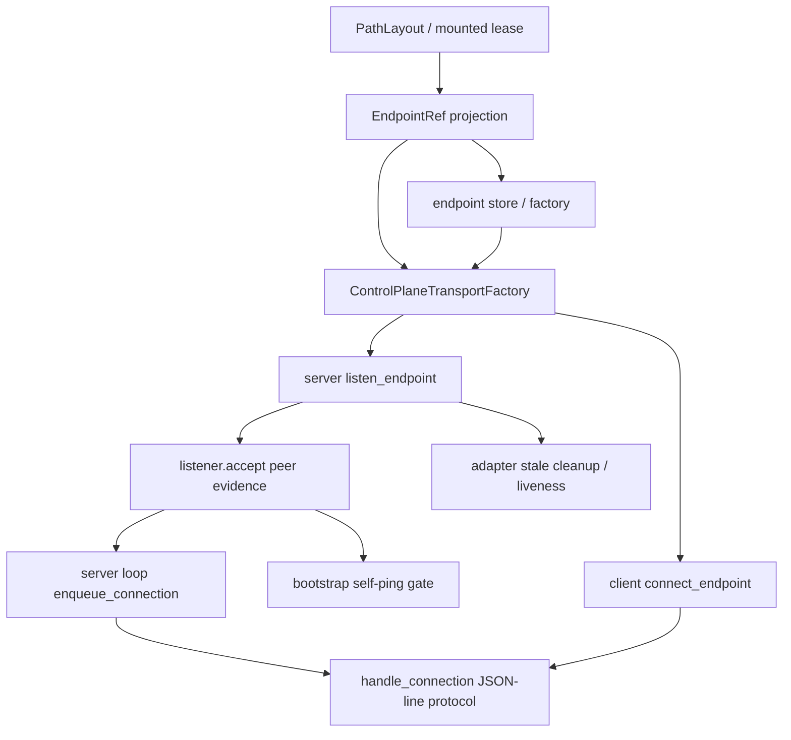

# ccbd-control-plane-transport-seam feature design

## 0. 术语约定

| 术语 | 定义 | 防冲突结论 |
|---|---|---|
| control-plane transport | `ccb` / keeper / sidebar 等客户端连接 `ccbd` RPC server 的传输层。 | 只承载 JSON-line RPC bytes，不是 tmux/Rmux mux transport。 |
| transport seam | 将 connect、listen、accept、bootstrap probe、same-user evidence、liveness、stale cleanup、endpoint discovery 抽象成可替换边界。 | 本 feature 只建 seam + Unix adapter + fake transport，不实现 Windows TCP loopback adapter。 |
| endpoint descriptor | 可持久化的 ccbd 控制面端点描述。 | 不能只用 `socket_path: str` 表达所有平台；但旧 `socket_path` 兼容投影必须保留。 |
| same-user evidence | 服务端判断客户端请求来自同一用户/同一 project authority 的证据。 | Unix 继续使用现有 peer path / path identity 语义；Windows token handshake 留给后续 item。 |
| frame protocol | `RpcRequest` / `RpcResponse` JSON-line 编解码。 | 本 feature 不改帧协议、不改 handler dispatch、不改业务 op。 |

代码事实：

- `lib/ccbd/socket_client_runtime/transport.py::connect_socket()` 直接创建 `socket.AF_UNIX` 并连接 path；无 Windows transport seam。
- `lib/ccbd/socket_server_runtime/lifecycle.py::listen_server()` 直接 bind/listen AF_UNIX，stale cleanup 依赖 `stat.S_ISSOCK` 与 inode identity。
- `lib/ccbd/socket_server_runtime/bootstrap_probe.py::bootstrap_readiness_probe()` 直接创建 AF_UNIX client、bind probe client path、通过 peer path 区分 bootstrap self-ping 和外部连接。
- `lib/ccbd/socket_server_runtime/protocol.py::handle_connection()` 已只处理 bytes 上的 JSON-line request/response，可保持 transport-neutral。
- `lib/ccbd/socket_server_runtime/loop.py` 通过 `accept()` 与 worker queue 处理 connection，核心 loop 可消费 transport listener 的 connection object。
- `lib/ccbd/system.py::unix_socket_connectable()` 是 Unix-only liveness helper；`process_exists()` 的 Windows 语义由独立 `ccbd-windows-process-liveness` item 覆盖，不在本 feature 修改。

## 1. 决策与约束

### 需求摘要

本 feature 为 ccbd 控制面 RPC 建立 transport seam，使现有 Unix AF_UNIX 行为在 adapter 内保持不变，同时为后续 Windows TCP loopback adapter 留出稳定接口。目标是先让 connect/listen/accept/bootstrap/stale/liveness/endpoint 描述都通过同一抽象进入，而不是继续把 AF_UNIX 细节散落在 client/server/bootstrap。

成功标准：

- 新增 `ccbd/control_plane_transport/` 或等价模块，定义 endpoint、client connector、server listener、connection、same-user evidence、stale cleanup 和 liveness 抽象。
- Unix adapter 复用当前 AF_UNIX path、inode、peer path 行为；Linux/macOS 现有 tests / smoke 行为不漂移。
- fake transport 可驱动 server lifecycle、bootstrap probe 和 client request tests，不需要真实 socket。
- `RpcRequest` / `RpcResponse` JSON-line 编码、`handle_connection()` 和业务 handlers 不变化。
- mounted lease / diagnostics 继续写旧 `socket_path` 兼容字段，同时新增 endpoint descriptor projection。
- Windows TCP loopback adapter 不在本 feature 实现；后续 item 只能通过本 seam 接入。

明确不做：

- 不实现 Windows TCP loopback、same-user token handshake、token ACL 或 named pipe adapter。
- 不改 ccbd RPC op、handler dispatch、JSON-line frame、request/response schema。
- 不改 RmuxBackend、project namespace mux lifecycle、provider runtime 或 accelerator transport。
- 不修 `process_exists()` Windows 语义；该项属于 `ccbd-windows-process-liveness`。
- 不改变 mounted lease authority；transport endpoint 只是 ccbd 控制面 evidence。

### 复杂度档位

- 行为兼容 = L3。Unix AF_UNIX 行为必须不漂移，尤其是 stale socket cleanup、bootstrap self-ping gate 和 mounted publish 前校验。
- 架构边界 = deep。transport 与 frame/handler 分离后，Windows adapter 才能独立实现。
- 可测试性 = verified。Unix adapter、fake transport、client/server lifecycle、bootstrap probe 和 stale cleanup 都有 tests。
- 安全性 = high。same-user / stale cleanup 是 control-plane authority 的边界，不能用“连接成功”替代身份判断。

### 关键决策

1. transport seam 采用端口式接口，不把 socket object 直接作为 public contract：

```python
class CcbdEndpoint(TypedDict):
    kind: Literal["unix_socket", "tcp_loopback"]
    address: str
    display: str
    legacy_socket_path: str | None
    auth_ref: str | None

class ControlPlaneConnection(Protocol):
    def settimeout(self, value: float | None) -> None: ...
    def sendall(self, payload: bytes) -> None: ...
    def recv(self, size: int) -> bytes: ...
    def close(self) -> None: ...
    def __enter__(self) -> "ControlPlaneConnection": ...
    def __exit__(self, exc_type, exc, tb) -> None: ...

class ControlPlaneListener(Protocol):
    endpoint: CcbdEndpoint
    def settimeout(self, value: float | None) -> None: ...
    def accept(self) -> tuple[ControlPlaneConnection, dict[str, object]]: ...
    def close(self) -> None: ...
```

2. `send_request()`、`recv_response_line()`、`decode_response()` 继续保持 bytes/frame helper；只把 connector 换成 `connect_endpoint(endpoint, timeout_s)`。
3. `listen_server()` 改为通过 `transport_factory.listen(endpoint)` 创建 listener；server `_server` 保存 listener，loop 只调用 `accept()`。
4. bootstrap probe 改为 transport-neutral primitive：adapter 提供 `create_bootstrap_probe()` 和 `pump_bootstrap_until_response()` 或等价接口，封装 readiness/select/poll 机制；Unix adapter 内部仍可用 probe client path 与 `select.select()`，fake transport 不需要真实 socket。
5. stale cleanup 属于 adapter：Unix adapter 保留 `stat.S_ISSOCK`、connectable proof、inode identity；Windows adapter 后续实现 token endpoint cleanup，不复用 inode 概念。
6. endpoint discovery/store 归属 transport boundary：`endpoint.py` 负责 descriptor/projection，`factory.py` 或 store adapter 负责读取 `.ccb/ccbd` endpoint descriptor 并从 legacy `socket_path` fallback 构造 Unix endpoint；CLI 不散落平台判断。

### Top 3 风险与缓解

1. **风险：seam 太浅，Windows adapter 仍要改 handler/loop。**  
   缓解：fake transport 必须跑通 lifecycle + bootstrap + request handler tests，证明 loop/protocol 不知道具体 transport。
2. **风险：same-user / stale cleanup 被抽象掉后降级为弱校验。**  
   缓解：接口显式携带 peer evidence、endpoint identity、stale cleanup result；Unix tests 锁定现有拒绝替换 live socket 行为。
3. **风险：旧 `socket_path` 调用面太多，迁移破坏现有 CLI/diagnostics。**  
   缓解：endpoint descriptor canonical-first，旧 `socket_path` 兼容投影保留；client factory 支持从 Path 构造 Unix endpoint。

### 非显然依赖与关键假设

- 后续 `ccbd-windows-tcp-loopback-transport` 必须消费本 seam，不直接在 CLI / server loop 中分叉 Windows。
- `ccbd-windows-process-liveness` 是正交 item；本 feature 的 liveness 只覆盖 endpoint connectability，不修 pid alive。
- 当前 `handle_connection()` 依赖 `settimeout/sendall/recv`，worker loop 通过 `with conn:` 关闭连接；connection protocol 必须显式覆盖这些最小真实契约。
- 假设 mounted lease / diagnostics 可以先新增 endpoint descriptor，并保留旧 `socket_path` 字段满足现有 tests。

## 2. 名词与编排

### 2.1 名词层

#### 现状

- client：`connect_socket(socket_path)` 只接受 path，直接连接 AF_UNIX。
- server lifecycle：`listen_server()` 直接 bind path，维护 `_bound_socket_stat`，shutdown 时按 inode unlink。
- bootstrap：self-ping 用 probe client path 与 accepted peer path 做匹配；外部连接延迟入队。
- loop/protocol：server loop 接受 connection 后交给 worker；protocol 只读写 JSON-line bytes，是可保留的 transport-neutral 层。
- mounted evidence：大量调用面仍传 `socket_path`，diagnostics 也以 preferred/effective socket path 展示。

#### 变化

新增 transport package：

```text
lib/ccbd/control_plane_transport/
├── __init__.py
├── endpoint.py
├── factory.py
├── frames.py
├── interface.py
├── unix.py
└── fake.py
```

核心类型：

```python
class EndpointRef(TypedDict):
    kind: Literal["unix_socket", "tcp_loopback"]
    address: str
    legacy_socket_path: str | None
    auth_ref: str | None

class PeerEvidence(TypedDict):
    kind: Literal["unix_peer_path", "tcp_token", "fake"]
    same_user: bool
    detail: str

class StaleCleanupResult(TypedDict):
    action: Literal["none", "removed", "blocked-live", "blocked-unsafe"]
    reason: str | None

class BootstrapProbe(Protocol):
    nonce: str
    def send_ping(self) -> None: ...
    def pump_until_response(
        self,
        *,
        server: object,
        deadline: float,
        max_response_bytes: int,
        max_deferred_connections: int,
    ) -> dict[str, object]: ...
    def close(self) -> None: ...
```

Interface 设计检查：

- Module：`ccbd/control_plane_transport` 是 ccbd 控制面唯一 transport 边界。
- Interface：caller 必须知道 endpoint kind、connect/listen、connection 最小方法、peer evidence、stale cleanup result；不需要知道 AF_UNIX socket/inode。
- Seam：client connect、server listen/accept、bootstrap probe/readiness pump、connectability、stale cleanup、endpoint projection/store 都穿过 adapter。
- Depth / locality：deep seam，隔离平台 transport 与 authority 证据，不改 JSON-line frame / handler。
- Dependency strategy：local-substitutable；fake transport 覆盖 lifecycle，不依赖真实 AF_UNIX。

### 2.2 编排层



流程级约束：

- endpoint projection：Unix 仍从 `ccbd_socket_path` 生成 `EndpointRef(kind="unix_socket")`，并保留 legacy `socket_path`。
- server start：adapter 先做 stale cleanup，再 listen，再返回 listener identity；失败必须关闭 listener 并清理本次绑定。
- bootstrap：adapter 提供 self-probe / readiness pump primitive；normal request worker、bootstrap-only gate、nonce 校验、deferred external connection、deferred overflow close 语义保持。
- client：公开 client 可接受旧 path 或 endpoint descriptor；旧 path 自动投影为 Unix endpoint；descriptor/store 读取只在 transport factory/store adapter 内。
- diagnostics：ping / doctor / lease payload 同时展示 endpoint kind/address 和 legacy socket path。
- shutdown：adapter 负责按绑定 identity 清理本次 endpoint；不得删除非本次绑定或不安全路径。

### 2.3 挂载点清单

- `lib/ccbd/control_plane_transport/endpoint.py`：endpoint descriptor、legacy socket path projection。
- `lib/ccbd/control_plane_transport/factory.py`：从 PathLayout、endpoint descriptor 或 legacy socket path 构造 transport factory / endpoint；读取 `.ccb/ccbd` endpoint store 的唯一入口。
- `lib/ccbd/control_plane_transport/interface.py`：connector/listener/connection/peer evidence protocol。
- `lib/ccbd/control_plane_transport/unix.py`：现有 AF_UNIX connect/listen/stale/bootstrap 行为迁入 adapter。
- `lib/ccbd/control_plane_transport/fake.py`：fake transport 测试替身。
- `lib/ccbd/socket_client_runtime/transport.py`：保留 frame helpers，connect 改委托 seam。
- `lib/ccbd/socket_server_runtime/lifecycle.py`：server listen/shutdown 改委托 listener adapter。
- `lib/ccbd/socket_server_runtime/bootstrap_probe.py`：self-ping 改用 adapter probe/evidence。
- `lib/ccbd/socket_server_runtime/loop.py`：只依赖 listener.accept/connection protocol，不依赖 socket-specific API。
- mounted lease / diagnostics payload：新增 endpoint descriptor，同时保留 `socket_path` 兼容字段。

### 2.4 推进策略

1. **endpoint contract**：定义 `EndpointRef`、legacy socket path projection 和 endpoint diagnostics。  
   退出信号：Path 和 descriptor 都能投影为 Unix endpoint，legacy `socket_path` 保持可读。
2. **transport interface + frames split**：定义 connection/listener/factory protocol，并确认 JSON-line frame helper 不依赖 socket。  
   退出信号：frame tests 仍通过，`send_request/recv_response_line/decode_response` 可消费 fake connection；fake connection 覆盖 `settimeout`、context-manager close 语义。
3. **Unix adapter extraction**：把 AF_UNIX connect/listen/stale cleanup/bound identity 迁入 Unix adapter。  
   退出信号：现有 ccbd socket client/server/bootstrap tests 在 Unix path 下不漂移。
4. **bootstrap probe seam**：把 probe client path、readiness/select/poll、peer evidence matcher、deferred connection logic 收敛到 adapter-facing接口。  
   退出信号：fake transport 不依赖真实 socket 也覆盖 self-ping、nonce mismatch、external deferred enqueue、deferred overflow close。
5. **fake transport tests**：用 fake listener/connection/probe 跑通 server lifecycle、client request、bootstrap gate。  
   退出信号：不创建真实 AF_UNIX socket 也能验证 handler dispatch、request timeout、context-manager close 不变。
6. **lease/diagnostics projection**：mounted lease / ping / doctor payload 新增 endpoint descriptor，保留 `socket_path`。  
   退出信号：existing socket_path assertions 继续通过，新 tests 断言 endpoint kind/address。
7. **guard and regression**：禁止新增裸 `socket.AF_UNIX` 到 control-plane 调用层，允许只在 Unix adapter/tests 内出现。  
   退出信号：focused grep guard + ccbd client/server/start tests 通过。

### 2.5 结构健康度与微重构

##### 评估

- 文件级 — `socket_client_runtime/transport.py`：当前混合 connect 和 frame helpers；拆出 transport seam 后 frames 可保持小而稳定。
- 文件级 — `socket_server_runtime/lifecycle.py`：当前同时负责 Unix stale cleanup、bind/listen、unlink；这些是 adapter 职责，适合迁移。
- 文件级 — `socket_server_runtime/bootstrap_probe.py`：peer path 匹配是 Unix-specific，应通过 adapter evidence 表达。
- 文件级 — `socket_server_runtime/protocol.py`：已是纯 JSON-line dispatch，不应重构。
- 目录级 — `ccbd/socket_*_runtime` 已按 client/server 分散；新增 `ccbd/control_plane_transport` 能避免 Windows 分支塞进现有生命周期文件。

##### 结论：做边界抽取，不做业务重构

抽 transport seam 是本 feature 本体；不修改 RPC op、handlers、dispatcher、project namespace 或 keeper policy。任何 handler 行为变化都应视为越界。

## 3. 验收契约

### 3.1 关键场景清单

| ID | 输入 / 触发 | 期望可观察结果 | 证据类型 |
|---|---|---|---|
| AC-001 | 旧 `socket_path` client connect | 自动投影为 Unix endpoint，现有 ping/start/reload client 行为不漂移 | regression |
| AC-002 | Unix server listen + stale cleanup | live socket 不被替换，stale socket 安全删除，本次绑定 shutdown 才 unlink | unit/regression |
| AC-003 | bootstrap readiness probe | self-ping nonce、bootstrap-only gate、deferred external connection、deferred overflow close 行为保持 | unit/regression |
| AC-004 | fake transport lifecycle | 不创建真实 AF_UNIX socket 也能跑通 listen/connect/accept/handler | unit test |
| AC-005 | frame protocol | `RpcRequest` / `RpcResponse` JSON-line 编解码与 handler dispatch 不变 | unit/regression |
| AC-006 | endpoint discovery / diagnostics | endpoint store/factory 可从 descriptor 或 legacy `socket_path` 构造 endpoint；mounted lease / ping / doctor payload 含 endpoint kind/address，旧 `socket_path` 仍存在 | unit/regression |
| AC-007 | Windows readiness | control-plane 调用层无新增裸 `socket.AF_UNIX`；Windows adapter 留给后续 item | grep guard |
| AC-008 | scope guard | 不改 pid liveness、Windows TCP token、mux backend、provider runtime、RPC handlers | diff guard |

### 3.2 明确不做的反向核对项

- 不应实现 Windows TCP loopback adapter、token handshake 或 ACL。
- 不应修改 `RpcRequest` / `RpcResponse` schema 或 JSON-line frame。
- 不应修改 handler dispatch、业务 op 或 ccbd project namespace lifecycle。
- 不应修 `process_exists()` 或 keeper pid liveness。
- 不应把 endpoint descriptor 当作 mux namespace / Rmux daemon evidence。
- 不应在 Unix adapter 之外新增裸 `socket.AF_UNIX`。

### 3.3 Acceptance Coverage Matrix

| Scenario | Covered By Step | Evidence Type | Command / Action | Core? |
|---|---|---|---|---|
| AC-001 legacy client path | S1-S3 | regression | `test/test_ccbd_client.py` / existing ccbd client tests | yes |
| AC-002 Unix stale cleanup | S3 | unit/regression | `test/test_ccbd_control_plane_transport_unix.py` | yes |
| AC-003 bootstrap probe | S4 | unit/regression | `test/test_ccbd_bootstrap_probe.py` | yes |
| AC-004 fake transport lifecycle | S5 | unit test | `test/test_ccbd_control_plane_transport_fake.py` | yes |
| AC-005 frame protocol | S2 | unit/regression | socket transport frame tests | yes |
| AC-006 endpoint diagnostics | S6 | unit/regression | ping/doctor/start service tests | yes |
| AC-007 AF_UNIX guard | S7 | grep guard | `test/test_ccbd_control_plane_transport_import_guard.py` | yes |
| AC-008 scope guard | S7 | diff guard | review + import guard | yes |

### 3.4 DoD Contract

| ID | 要求 | 证据 | 阻塞级别 |
|---|---|---|---|
| DOD-DESIGN-001 | design/checklist/review 完整，且对齐 roadmap item `ccbd-control-plane-transport-seam` | design review | blocking |
| DOD-IMPL-001 | endpoint descriptor canonical-first，旧 `socket_path` 兼容投影保留 | tests | blocking |
| DOD-IMPL-002 | Unix adapter 保持 AF_UNIX connect/listen/stale/bootstrap 行为不漂移 | unit/regression | blocking |
| DOD-IMPL-003 | fake transport 可验证 lifecycle/handler，不依赖真实 socket | unit tests | blocking |
| DOD-IMPL-003a | connection protocol 覆盖 `settimeout` 与 context-manager close 语义 | unit tests | blocking |
| DOD-IMPL-004 | JSON-line frame 与 handler dispatch 不变 | regression | blocking |
| DOD-IMPL-005 | diagnostics/lease 含 endpoint descriptor 且旧 socket_path 字段可用 | regression | blocking |
| DOD-IMPL-006 | Unix adapter 外无裸 `socket.AF_UNIX` 新增，未实现 Windows TCP adapter | guard | blocking |
| DOD-REVIEW-001 | code review passed 且无 unresolved blocking | review report | blocking |
| DOD-QA-001 | QA 覆盖 endpoint、Unix adapter、bootstrap、fake transport、diagnostics、guard | QA report | blocking |
| DOD-ACCEPT-001 | acceptance 回写 roadmap item，并记录 Windows adapter 必须消费本 seam | acceptance report | blocking |

Validation Commands:

| ID | 命令 | 目的 | 核心性 | 失败处理 |
|---|---|---|---|---|
| CMD-001 | `python ".codestable/tools/validate-yaml.py" --file ".codestable/features/2026-07-20-ccbd-control-plane-transport-seam/ccbd-control-plane-transport-seam-checklist.yaml" --yaml-only` | checklist YAML 合法性 | core | fix-or-block |
| CMD-002 | `python ".codestable/tools/validate-yaml.py" --file ".codestable/roadmap/windows-rmux-native-backend/windows-rmux-native-backend-items.yaml"` | roadmap items 回写合法性 | core | fix-or-block |
| CMD-003 | `python -m pytest -q test/test_ccbd_control_plane_transport_unix.py test/test_ccbd_control_plane_transport_fake.py` | endpoint / Unix adapter / fake transport tests | core | fix-or-block |
| CMD-004 | `python -m pytest -q test/test_ccbd_bootstrap_probe.py test/test_ccbd_socket_server.py test/test_ccbd_socket_client.py` | bootstrap / server / client regression | core | fix-or-block |
| CMD-005 | `python -m pytest -q test/test_v2_start_service.py test/test_v2_phase2_entrypoint.py -k "ccbd or socket or endpoint or ping"` | start/ping/lease diagnostics 抽样 | core | document-baseline |
| CMD-006 | `python -m pytest -q test/test_ccbd_control_plane_transport_import_guard.py` | AF_UNIX / scope guard | core | fix-or-block |

Required Artifacts：design、checklist、design-review、endpoint descriptor、transport interface、Unix adapter、fake transport、bootstrap probe seam tests、client/server regression、diagnostics projection tests、import guard、items.yaml 回写。

### 3.5 自我批判结论

- 可证伪性：fake transport 能证明 handler/frame 与真实 socket 解耦；Unix adapter tests 锁定现行为。
- 步骤原子性：endpoint、interface/frame、Unix adapter、bootstrap、fake、diagnostics、guard 七步分离。
- 最弱依赖：bootstrap peer evidence 最容易抽浅；必须保留 self-ping gate、nonce 和 deferred connection 语义。
- 证据完整性：connect、listen、stale cleanup、bootstrap、diagnostics 和 guard 都有验证入口。
- 交付物可核验性：acceptance 可从 new transport package、tests、diagnostics payload 和 guard 输出反查。
- 清洁度规则：不新增临时 TODO/FIXME、调试输出、注释掉代码、死 import；不把 Windows TODO 分支写入调用层。

## 4. 与项目级架构文档的关系

- 本 feature 实现 roadmap §4.9 的第一阶段：抽 ccbd 控制面 transport seam，Unix adapter 保持现行为。
- 后续 `ccbd-windows-tcp-loopback-transport` 必须接入本 seam，实现 TCP loopback + same-user token handshake。
- 本 feature 与 Rmux mux backend 正交：它只让 `ccb↔ccbd` 控制面可跨平台，不创建 Rmux namespace。
- 本 feature 不覆盖 `ccbd-windows-process-liveness`；pid 存活判定仍由独立 item 处理。
