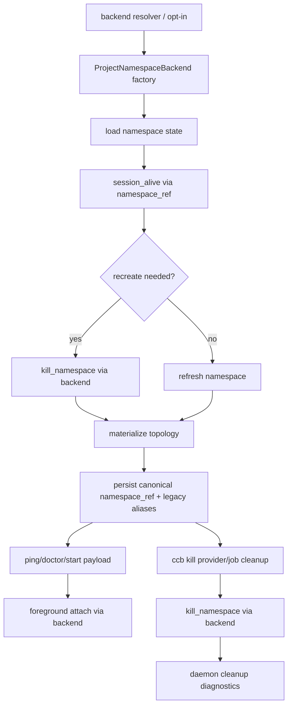

# ccbd-rmux-namespace-lifecycle feature design

## 0. 术语约定

| 术语 | 定义 | 防冲突结论 |
|---|---|---|
| project namespace lifecycle | `ccbd` 为一个项目创建、刷新、重建、attach 和销毁 mux namespace 的 higher-level policy。 | 本 feature 接入 RmuxBackend 到 namespace lifecycle，不实现 supervision/recovery。 |
| ProjectNamespaceBackend | roadmap §4.6 定义的 namespace policy interface，封装 prepare / ensure window / session alive / kill namespace。 | 调用层不得继续直接拼 tmux/rmux CLI；primitive pane IO 和 foreground attach 能力归属 MuxBackend / NamespaceLifecycle 或前序已批准 attach adapter。 |
| namespace_ref | backend-neutral namespace authority，包含 backend family/impl、namespace id、session name、ipc kind/ref。 | 旧 `tmux_socket_path` / `tmux_session_name` 只作兼容别名。 |
| foreground attach | `ccb` 启动后把当前 terminal attach 到项目 UI 的动作。 | Rmux 路径必须调用 backend attach capability，不得由 `start_foreground.py` 直接执行 `tmux attach-session`。 |
| layout projection | 把 CCB topology materialize 到 mux windows/panes 并写回 namespace state / ping payload 的过程。 | 只能通过 namespace/backend-neutral evidence 表达，不能把 Rmux pane id 伪装成 tmux `%N`。 |
| kill namespace | `ccb kill` / remote stop 中销毁项目 mux namespace 的动作。 | 只销毁项目 namespace/session；Rmux shared daemon cleanup policy 来自前序 daemon ownership boundary。 |

代码事实：

- `ProjectNamespaceController` 当前默认 `TmuxBackend`，`build_backend(backend_factory, socket_path=...)` 只传 tmux socket path。
- `NamespaceEnsureContext` 与 state record 当前保存 `desired_socket_path`、`tmux_socket_path`、`tmux_session_name`。
- `project_namespace_runtime/backend.py` 包含大量 tmux-only helper：`_tmux_run_ready`、`kill_server`、`session_alive`、window create/list/select 等。
- `cli/services/start_foreground.py` 读取 `namespace_tmux_socket_path` / `namespace_tmux_session_name`，直接执行 `tmux attach-session`、`has-session`、`select-window`。
- `cli/services/kill.py` 通过 `ProjectNamespaceController.destroy()` 和 tmux cleanup history 清理 namespace；`destroy.py` 最终调用 tmux `kill-server`。
- `project_view/service.py` 通过 `ccbd.project_focus.tmux.backend_for_namespace()` 采集 tmux focus/snapshot/capture；`handlers/project_clear.py`、`handlers/project_restart.py` 仍直接构造 `TmuxBackend(socket_path=namespace.tmux_socket_path)`。
- `start_flow_runtime/service_tmux.py`、`start_runtime/binding_runtime/*`、`runtime_launch_runtime/tmux_runtime.py`、health assessment、slot replacement、layout_status / doctor / ping 仍大量读取 `tmux_socket_path` 或 `same_tmux_socket_path`。
- 前序 design 已建立 `MuxBackend` / `ProjectNamespaceBackend` 契约、backend resolver/opt-in、backend-neutral provider session payload、Windows shell/log builder、Job Object evidence、Rmux daemon ownership、Rmux core/send/capture/logging、ccbd Windows TCP control-plane transport。

## 1. 决策与约束

### 需求摘要

本 feature 把已设计的 RmuxBackend 接入 `ccb` / `ccbd` project namespace lifecycle，使 native Windows 下可以通过 opt-in Rmux 后端创建项目 namespace、materialize layout、attach 到 UI，并通过 `ccb kill` 清理项目 namespace。它是本 roadmap 第一条真正用户可见闭环，但仍不是最终 full-chain smoke。

成功标准：

- `ProjectNamespaceController` 通过 backend resolver / factory 选择 `ProjectNamespaceBackend`，tmux 路径保持现有行为，Rmux 路径不散落调用层 `if windows`。
- namespace state / ping / doctor payload 写 canonical `namespace_ref`、`namespace_backend_impl`、`namespace_ipc_kind`、`namespace_ipc_ref`、`namespace_session_name`，并保留旧 `namespace_tmux_*` 兼容别名。
- ensure / recreate / reflow / layout projection 通过 ProjectNamespaceBackend / MuxBackend capability 操作 namespace、window、pane，不直接拼 `tmux` 或 `rmux` 命令。
- foreground attach 在 Rmux 路径调用 MuxBackend / NamespaceLifecycle 的 attach capability，或前序 contract 已批准的 attach adapter；不得在本 feature 私自扩张 `ProjectNamespaceBackend` 接口。
- `ccb kill` 保持现有 phase 语义：remote stop；local prepare 收集 provider/job/process evidence 并更新 registry；backend `kill_namespace()`；Rmux daemon cleanup / leave-running diagnostics；final PID cleanup / orphan cleanup / report。
- start flow、runtime binding、project view、health assessment、project_clear/restart、layout/doctor/ping 的 namespace 读取改为 backend-neutral projection；tmux-specific path 只在 tmux adapter 或 legacy compatibility branch 内使用。
- native Windows 可通过 fake/Rmux-backed tests 证明 start→attach→kill 的 namespace lifecycle；full `ask` 与 accelerator/process liveness 汇入后续 smoke item。

明确不做：

- 不实现 RmuxBackend core/send/capture/logging；本 feature 只消费前序 backend 能力。
- 不实现 supervision/recovery、pane/provider/daemon crash 恢复；由 `rmux-supervision-recovery` 处理。
- 不修 `ccbd-windows-process-liveness` 或 runtime accelerator AF_UNIX guard。
- 不改变 provider completion parser，不重新定义 provider launch/session payload。
- 不把 Rmux 设为 Windows 默认；仍尊重 backend resolver / opt-in / route approval。
- 不实现 packaging/docs contract，也不声称完成最终 `ccbd-windows-full-chain-smoke`。

### 复杂度档位

- 行为兼容 = L3。tmux path 必须不漂移；Rmux path 引入新 backend-neutral namespace lifecycle。
- 架构风险 = high。调用面广，必须防止 `tmux_socket_path` 与 direct tmux CLI 继续成为 authority。
- 可测试性 = verified。fake ProjectNamespaceBackend 可覆盖 ensure/reflow/kill；fake MuxBackend / attach adapter 覆盖 foreground attach；Windows/Rmux integration 作为 focused evidence。
- 外部依赖 = backend capability。依赖前序 Rmux core、send/capture/logging、daemon ownership、Windows shell/log builder 和 ccbd TCP control-plane transport。

### 关键决策

1. Namespace state canonical-first：

```python
class ProjectNamespaceRef(TypedDict):
    backend_family: Literal["tmux-family"]
    backend_impl: Literal["tmux", "rmux"]
    namespace_id: str
    session_name: str
    ipc_kind: Literal["unix_socket", "named_pipe", "socket_name", "rmux_daemon"]
    ipc_ref: str
```

State / payload 写 canonical fields：

- `namespace_ref`
- `namespace_backend_impl`
- `namespace_ipc_kind`
- `namespace_ipc_ref`
- `namespace_session_name`

Legacy aliases：

- tmux 路径继续写 `namespace_tmux_socket_path` / `tmux_socket_path` / `tmux_session_name`。
- Rmux 路径的 legacy tmux socket path 为 null，不写 rmux daemon/named pipe placeholder；旧调用面不得用该字段推断 Rmux authority。

2. Backend construction：
   - `ProjectNamespaceController` 接收 backend resolver result 或 backend factory provider，而不是硬编码 `TmuxBackend`。
   - `build_backend()` 从 `namespace_ref` / selection result 构造 ProjectNamespaceBackend；`socket_path` 只作为 Unix/tmux legacy adapter 输入。
   - Fake backend 必须能模拟 session alive、missing namespace、layout recreate、attach success/failure、kill success/failure。
3. Namespace lifecycle：
   - `ensure_project_namespace()` 的流程保持：load state → session liveness → recreate if needed → materialize topology → persist state。
   - 具体 prepare server、ensure window、split/layout、identity marker、root pane discovery 通过 backend-neutral interface 完成。
   - Rmux pane/window id 原样记录为 backend-local id，不转成 tmux `%N`。
4. Foreground attach：
   - `_wait_for_attach_target()` 读取 canonical payload 判断 attachable；tmux legacy payload 仅兼容旧路径。
   - attach 执行交给 MuxBackend / NamespaceLifecycle `attach_namespace(namespace_ref, window_name=...)` 或前序已批准的 CLI attach adapter。
   - 如果 implementation 发现需要把 attach 放入 `ProjectNamespaceBackend`，必须先回 `mux-backend-contract` / `ProjectNamespaceBackend` contract 修订并复审，不得在本 feature 私自扩接口。
   - Rmux 路径的 attached verification 使用 backend attach evidence，不调用 `tmux list-clients`。
5. Kill ordering：
   - remote stop 先尝试让 ccbd 自行停止业务。
   - local prepare 在 namespace destroy 前收集 provider/job/process evidence、写 shutdown intent / registry 状态；这不是实际 PID termination。
   - namespace destroy 调 backend `kill_namespace()`；随后记录 Rmux daemon cleanup / leave-running diagnostics。
   - final 阶段继续执行 PID termination、tmux/Rmux orphan cleanup 替代、kill report merge；不得因为引入 Rmux namespace 而跳过现有 finalize 清理。
   - Rmux daemon 是 backend evidence，不是 project authority；shared daemon 默认 leave-running，只记录 diagnostics，除非前序 ownership policy 明确本项目拥有本 generation daemon。
6. Cross-cutting readers：
   - project view、health assessment、slot replacement、project_clear/restart、layout status、doctor、ping 读取 canonical namespace fields。
   - Rmux path 缺少 tmux socket alias 时不得被误判为 namespace unavailable；需要 tmux-only probe 的视图应标注 `unsupported-for-backend` 或走 backend capability。

### Top 3 风险与缓解

1. **风险：tmux 兼容字段继续被当成 authority，Rmux 路径绕过 canonical namespace_ref。**  
   缓解：state/payload canonical-first；Rmux legacy socket path 为 null；guard tests 禁止 Rmux 路径从 `tmux_socket_path` 连接/attach/kill。
2. **风险：foreground attach 仍直接拼 tmux 命令，导致 Windows/Rmux 起了 namespace 但 UI 进不去。**  
   缓解：attach adapter 由 backend 提供；tests 覆盖 Rmux payload 时不调用 `_tmux_cmd` / `tmux_base`。
3. **风险：`ccb kill` 清理不完整，误杀 shared Rmux daemon 或漏掉 provider/job evidence。**  
   缓解：kill ordering 明确 provider/job evidence 先于 namespace；daemon cleanup 只消费 ownership evidence，默认 leave-running 并写 diagnostics。

### 非显然依赖与关键假设

- 依赖 `mux-backend-contract` 和 `tmux-backend-contract-adapter` 已提供 ProjectNamespaceBackend seam / fake backend。
- 依赖 `windows-namespace-ipc-schema` 已允许 state/ping payload 承载 backend-neutral namespace fields。
- 依赖 `provider-runtime-backend-session-contract` 已让 provider runtime 不再只读 tmux session authority。
- 依赖 `rmux-backend-core` 与 `rmux-send-capture-logging` 已提供 namespace/window/pane、send/capture/logging 能力。
- 依赖 `ccbd-windows-tcp-loopback-transport` 已让 native Windows `ccb↔ccbd` 控制面可建连。
- `ccbd-windows-process-liveness` 与 `accelerator-transport-windows-guard` 是 full-chain smoke blocker，但不是本 feature 的实现内容。

## 2. 名词与编排

### 2.1 名词层

#### 现状

- `ProjectNamespaceController` 默认 `TmuxBackend`，注入点是 `backend_factory`，但实际 helper 仍假设 tmux socket。
- `NamespaceEnsureContext` 用 `desired_socket_path` 表示 namespace authority，state/event/summary 写 `tmux_socket_path`。
- `backend.py` 既是 project namespace policy，又直接调用 `_tmux_run` primitive；这是 Rmux 接入必须拆开的核心边界。
- foreground attach 通过 `tmux` CLI 验证 session/client/window；没有 backend-neutral attach path。
- kill path 的 namespace destroy 调 `kill_server()`，并有 tmux cleanup history / orphan cleanup；没有 Rmux namespace cleanup evidence。

#### 变化

新增或改造候选模块：

```text
lib/ccbd/services/project_namespace_runtime/backend_factory.py
lib/ccbd/services/project_namespace_runtime/backend_contract.py
lib/ccbd/services/project_namespace_runtime/namespace_ref.py
lib/ccbd/services/project_namespace_runtime/attach.py
lib/ccbd/services/project_namespace_runtime/kill_namespace.py
lib/cli/services/start_foreground_backend.py
```

Interface 设计检查：

- Module：`project_namespace_runtime` 消费 ProjectNamespaceBackend；backend implementation 留在 `terminal_runtime`。
- Interface：caller 需要 namespace_ref、attach result、kill result、layout/window/pane evidence，不需要知道 `tmux` / `rmux` 命令。
- Seam：ensure/reflow/kill 通过 ProjectNamespaceBackend；foreground attach 通过 MuxBackend / NamespaceLifecycle attach capability 或前序批准 attach adapter；不在 CLI/ccbd 业务层分叉平台。
- Depth / locality：deep seam。namespace policy 保留在 ccbd，backend primitive 差异保留在 adapter。
- Dependency strategy：local-substitutable；fake backend 驱动 lifecycle tests，tmux adapter 锁定现有回归。

### 2.2 编排层



流程级约束：

- selection：显式 Rmux / approved auto 才进入 Rmux backend；tmux 是非 Windows / legacy 默认。
- ensure：namespace state 中 backend_impl 与 selection 冲突时必须 recreate 或 fail-fast，不静默复用错误 backend。
- layout：window/pane materialization 必须记录 backend-local IDs 与 managed_by/namespace_epoch marker；Rmux id 不转写为 tmux `%N`。
- attach：attach target readiness 先看 ccbd ping canonical namespace payload，再用 backend attach；tmux legacy attach path 只在 backend_impl=tmux 时使用。
- kill：provider/job/process evidence cleanup 先于 namespace kill；namespace kill 后写 destroy event / kill report；shared Rmux daemon 不作为 project-owned 资源默认杀掉。
- diagnostics：ping/doctor/kill report 同时展示 canonical namespace_ref 与 legacy aliases；旧字段缺失不能导致 Rmux path 判 unavailable。

### 2.3 挂载点清单

- `lib/ccbd/services/project_namespace_runtime/controller.py`：注入 backend resolver / ProjectNamespaceBackend factory。
- `lib/ccbd/services/project_namespace_runtime/ensure_context.py`：`desired_socket_path` 迁移为 namespace_ref / backend selection，旧 socket path 兼容投影保留。
- `lib/ccbd/services/project_namespace_runtime/backend.py`：tmux-only policy 拆为 ProjectNamespaceBackend adapter；调用层不再直接 `_tmux_run`。
- `lib/ccbd/services/project_namespace_runtime/ensure.py`、`ensure_state.py`、`materialize_topology.py`、`reflow.py`：使用 namespace_ref 和 backend-local pane/window evidence。
- `lib/ccbd/services/project_namespace_runtime/models.py`、`records.py`、state store：保存 canonical namespace fields 与 legacy aliases。
- `lib/ccbd/services/project_namespace_state_runtime/models.py`：ping payload / last event payload 的 backend-neutral projection。
- `lib/cli/services/start_foreground.py`：foreground attach 改为 backend-neutral attach adapter；tmux helper 只留在 tmux adapter。
- `lib/cli/services/kill.py`、`cli/services/kill_runtime/*`、`cli/services/tmux_project_cleanup*`：namespace kill 与 orphan cleanup 按 backend_impl 分派。
- `lib/ccbd/project_view/service.py`、`lib/ccbd/project_focus/*`：project view focus/snapshot/capture 走 backend capability；tmux-only view 不阻塞 Rmux namespace。
- `lib/ccbd/start_flow_runtime/service_tmux.py`、`lib/ccbd/start_runtime/binding_runtime/*`、`lib/cli/services/runtime_launch_runtime/tmux_runtime.py`：start/runtime binding 使用 backend-neutral namespace/session evidence，旧 tmux binding 兼容保留。
- `lib/ccbd/services/health_assessment/tmux_runtime/namespace.py`、`lib/ccbd/services/project_namespace_runtime/slot_replacement.py`：health / replacement 判断使用 namespace_ref 与 backend-local pane evidence。
- `lib/ccbd/handlers/project_clear.py`、`lib/ccbd/handlers/project_restart.py`、`lib/cli/services/layout_status.py`、`lib/cli/services/doctor_runtime/ccbd.py`、`lib/cli/services/ping.py`：清理、重启、布局状态和诊断输出改读 canonical namespace fields。
- ping / doctor / project view / startup report：展示 backend-neutral namespace payload。
- tests：fake backend lifecycle、tmux regression、Rmux Windows lifecycle smoke、foreground attach no-tmux guard、kill cleanup ordering guard。

### 2.4 推进策略

1. **namespace_ref state bridge**：在 ProjectNamespace state/event/summary/ping payload 中写 canonical namespace_ref，并保留旧 tmux aliases。  
   退出信号：tmux 现有 payload 不漂移；Rmux payload 中 legacy socket path 为 null，canonical fields 完整。
2. **ProjectNamespaceBackend factory**：让 controller/ensure_context 从 resolver result 构造 backend policy adapter。  
   退出信号：fake backend 可被注入；tmux adapter 行为与旧 `TmuxBackend(socket_path=...)` 等价。
3. **ensure/reflow/layout projection backend-neutralization**：把 create session/window/split/root pane/identity marker 迁到 ProjectNamespaceBackend / capability-specific protocols。  
   退出信号：fake backend 证明 ensure、layout recreate、reflow 不调用 tmux primitive；tmux regression 通过。
4. **foreground attach adapter**：`start_foreground.py` 读取 canonical payload 并调用 MuxBackend / NamespaceLifecycle attach capability 或前序批准 attach adapter，tmux legacy path 只保留在 tmux adapter。  
   退出信号：Rmux payload attach test 不调用 `tmux_base`；tmux attach tests 不漂移。
5. **kill namespace adapter**：CLI kill phase 明确 remote stop → local prepare evidence/registry → backend kill_namespace → daemon diagnostics → final PID/orphan/report cleanup。  
   退出信号：kill ordering tests 证明 evidence/registry prepare 先于 namespace kill、actual PID cleanup 仍在 finalize 阶段执行；shared daemon 不被误杀。
6. **cross-cutting namespace readers**：project view、start_flow/runtime binding、health assessment、slot replacement、project_clear/restart、layout/doctor/ping 改读 canonical namespace projection。  
   退出信号：Rmux namespace 缺 legacy tmux socket 时不被误判 unavailable；tmux-only probes 只在 tmux adapter 内运行。
7. **diagnostics and compatibility**：ping/doctor/project view/startup/kill report 展示 canonical namespace_ref 和 legacy aliases。  
   退出信号：snapshot tests 证明 tmux old fields 保留，Rmux canonical fields 可读。
8. **Windows/Rmux lifecycle smoke**：在可用 Rmux / fake Rmux 环境跑 start→attach→kill focused smoke。  
   退出信号：native Windows 或 marked integration transcript 证明 namespace created、attached、killed；full ask 留给后续 smoke item。
9. **scope guard**：禁止本 feature 修改 provider parser、accelerator、process liveness、supervision/recovery 或 direct rmux CLI in ccbd/cli layers。  
   退出信号：diff/import guard + focused code review 通过。

### 2.5 结构健康度与微重构

##### 评估

- 文件级 — `project_namespace_runtime/backend.py`：职责过宽，既定义 namespace policy 又直接操作 tmux primitive；本 feature 应拆 adapter boundary。
- 文件级 — `ensure_context.py` / `records.py` / `models.py`：`tmux_socket_path` 作为 authority，需要 canonical-first 迁移并保留兼容别名。
- 文件级 — `start_foreground.py`：直接拼 tmux attach 和 list-clients，是 Rmux 用户可见闭环的主要 blocker。
- 文件级 — `destroy.py` / kill runtime：`kill_server` 与 tmux cleanup history 需要按 backend_impl 分派，避免误杀或漏杀。
- 目录级 — `ccbd/services/project_namespace_runtime/` 是 namespace policy owner；`terminal_runtime/` 是 backend primitive owner，二者边界应通过 ProjectNamespaceBackend 明确。

##### 结论：做边界收束，不做 supervision 重构

本 feature 需要把 namespace lifecycle 从 tmux-only helper 收束到 ProjectNamespaceBackend，但不做 pane/provider crash supervision、不改 provider completion、不改 accelerator/process liveness。任何跨出 start/attach/kill/lifecycle 的恢复语义都应留给后续 item。

## 3. 验收契约

### 3.1 关键场景清单

| ID | 输入 / 触发 | 期望可观察结果 | 证据类型 |
|---|---|---|---|
| AC-001 | tmux backend existing start | namespace state/ping/doctor 旧字段不漂移，新增 canonical namespace_ref | regression |
| AC-002 | Rmux opt-in ensure namespace | ProjectNamespaceBackend 创建 namespace/window/pane，state 写 backend_impl=rmux | unit/integration |
| AC-003 | Rmux layout projection | topology materialize/reflow 记录 backend-local window/pane evidence，不伪装 tmux pane id | unit/fake backend |
| AC-004 | Rmux foreground attach | `ccb` attach 通过 MuxBackend / NamespaceLifecycle attach capability 或前序批准 attach adapter，不调用 `tmux attach-session` | unit/integration |
| AC-005 | backend selection mismatch | existing namespace backend_impl 与 current selection 冲突时 recreate 或 fail-fast | unit test |
| AC-006 | `ccb kill` Rmux namespace | remote stop、local prepare evidence/registry、kill_namespace、daemon diagnostics、final PID/orphan/report cleanup 顺序可诊断 | unit/integration |
| AC-007 | cross-cutting namespace readers | project view、start_flow/runtime binding、health assessment、slot replacement、project_clear/restart 不因 Rmux legacy socket path 为 null 误判 unavailable | unit/snapshot |
| AC-008 | diagnostics compatibility | ping/doctor/project view/startup/kill report 有 canonical namespace fields，旧 tmux aliases 兼容 | snapshot |
| AC-009 | scope guard | 不改 provider parser、accelerator、process liveness、supervision/recovery，不在 ccbd/cli 直接拼 rmux CLI | guard/review |

### 3.2 明确不做的反向核对项

- 不应在 `start_foreground.py` Rmux 路径调用 `tmux_base`、`tmux attach-session`、`list-clients`。
- 不应把 Rmux pane/window id 改写成 tmux `%N` 或从 `tmux_socket_path` 推导 Rmux authority。
- 不应把 Rmux daemon 当作 project authority 或默认 `kill daemon`。
- 不应修改 provider completion parser、accelerator transport、process liveness 或 supervision/recovery。
- 不应改变 tmux 默认路径、route approval / opt-in 语义。

### 3.3 Acceptance Coverage Matrix

| Scenario | Covered By Step | Evidence Type | Command / Action | Core? |
|---|---|---|---|---|
| AC-001 tmux regression | S1,S2,S6 | regression/snapshot | existing ccbd namespace/start tests | yes |
| AC-002 Rmux ensure | S2,S3,S7 | unit/integration | fake/Rmux ProjectNamespaceBackend lifecycle tests | yes |
| AC-003 layout projection | S3 | unit/fake | topology materialize/reflow fake backend tests | yes |
| AC-004 foreground attach | S4 | unit/integration | start_foreground backend attach tests | yes |
| AC-005 selection mismatch | S1,S2 | unit | namespace state selection mismatch tests | yes |
| AC-006 kill namespace | S5 | unit/integration | kill phase ordering, finalize cleanup, daemon policy tests | yes |
| AC-007 cross-cutting readers | S6 | unit/snapshot | project view / start_flow / health / slot replacement tests | yes |
| AC-008 diagnostics | S7 | snapshot | ping/doctor/project view/startup/kill snapshots | yes |
| AC-009 scope guard | S9 | guard | import/diff grep guard | yes |

### 3.4 DoD Contract

| ID | 要求 | 证据 | 阻塞级别 |
|---|---|---|---|
| DOD-DESIGN-001 | design/checklist/review 完整，且对齐 roadmap item `ccbd-rmux-namespace-lifecycle` | design review | blocking |
| DOD-IMPL-001 | namespace state canonical-first，tmux legacy aliases 保留，Rmux legacy socket path 为 null | tests/snapshot | blocking |
| DOD-IMPL-002 | ProjectNamespaceController 通过 resolver/factory 消费 ProjectNamespaceBackend | unit tests | blocking |
| DOD-IMPL-003 | ensure/reflow/layout projection 不直接调用 tmux/rmux primitive，使用 backend interface | unit/guard | blocking |
| DOD-IMPL-004 | foreground attach Rmux 路径调用 MuxBackend / NamespaceLifecycle attach 或前序批准 adapter，不私自扩 ProjectNamespaceBackend，不调用 tmux CLI | unit/integration | blocking |
| DOD-IMPL-005 | kill phase ordering：remote stop → local prepare evidence/registry → kill namespace → daemon diagnostics → final PID/orphan/report cleanup | tests | blocking |
| DOD-IMPL-006 | project view、start_flow/runtime binding、health assessment、slot replacement、project_clear/restart 使用 canonical namespace projection | tests/snapshot | blocking |
| DOD-IMPL-007 | diagnostics/ping/doctor/startup/kill report 展示 canonical namespace_ref 与兼容 aliases | snapshot | blocking |
| DOD-IMPL-008 | 不改 provider parser、accelerator、process liveness、supervision/recovery | guard | blocking |
| DOD-REVIEW-001 | code review passed 且无 unresolved blocking | review report | blocking |
| DOD-QA-001 | QA 覆盖 tmux regression、fake backend lifecycle、Rmux attach/kill、diagnostics、guard | QA report | blocking |
| DOD-ACCEPT-001 | acceptance 回写 roadmap item，并明确 full-chain smoke 仍依赖 accelerator/process liveness | acceptance report | blocking |

Validation Commands:

| ID | 命令 | 目的 | 核心性 | 失败处理 |
|---|---|---|---|---|
| CMD-001 | `python ".codestable/tools/validate-yaml.py" --file ".codestable/features/2026-07-20-ccbd-rmux-namespace-lifecycle/ccbd-rmux-namespace-lifecycle-checklist.yaml" --yaml-only` | checklist YAML 合法性 | core | fix-or-block |
| CMD-002 | `python ".codestable/tools/validate-yaml.py" --file ".codestable/roadmap/windows-rmux-native-backend/windows-rmux-native-backend-items.yaml"` | roadmap items 回写合法性 | core | fix-or-block |
| CMD-003 | `python -m pytest -q test/test_ccbd_project_namespace_backend.py test/test_ccbd_project_namespace_runtime.py` | ProjectNamespaceBackend / ensure lifecycle（新增或扩展测试） | core | fix-or-block |
| CMD-004 | `python -m pytest -q test/test_ccb_start_foreground.py test/test_ccbd_project_namespace_attach.py` | foreground attach backend-neutral path（新增或扩展测试） | core | fix-or-block |
| CMD-005 | `python -m pytest -q test/test_cli_kill.py test/test_ccbd_project_namespace_kill.py test/test_ccbd_rmux_namespace_kill_ordering.py` | kill phase ordering / namespace destroy / daemon diagnostics / final PID cleanup（新增或扩展测试） | core | fix-or-block |
| CMD-006 | `python -m pytest -q test/test_v2_start_service.py test/test_v2_phase2_entrypoint.py -k "namespace or attach or kill or ping"` | start/ping/kill regression | core | document-baseline |
| CMD-007 | `python -m pytest -q test/test_ccbd_project_view.py test/test_ccbd_project_focus.py test/test_ccbd_health_assessment.py test/test_ccbd_project_slot_replacement.py` | project view / project focus / health / slot replacement backend-neutral namespace readers（新增或扩展测试） | core | fix-or-block |
| CMD-008 | `python -m pytest -q test/test_ccbd_start_flow_backend_neutral.py test/test_ccbd_runtime_binding_backend_neutral.py test/test_ccbd_runtime_launch_backend_neutral.py` | start_flow / runtime binding / runtime_launch canonical namespace projection（新增测试） | core | fix-or-block |
| CMD-009 | `python -m pytest -q test/test_ccbd_project_clear_restart_backend_neutral.py test/test_cli_layout_status_backend_neutral.py test/test_cli_doctor_ping_namespace_projection.py` | project_clear/restart、layout_status、doctor/ping canonical namespace projection（新增测试） | core | fix-or-block |
| CMD-010 | `python -m pytest -q test/test_ccbd_rmux_namespace_lifecycle_guard.py` | no direct rmux/tmux CLI in calling layers / no scope creep guard（新增 guard） | core | fix-or-block |

Required Artifacts：design、checklist、design-review、namespace_ref state bridge、ProjectNamespaceBackend factory、fake backend lifecycle tests、foreground attach adapter、kill namespace adapter、cross-cutting namespace reader updates、diagnostics snapshots、Rmux focused smoke / transcript、scope guard、items.yaml 回写。

### 3.5 自我批判结论

- 可证伪性：attach、kill、namespace state、selection mismatch、diagnostics 都有明确测试入口。
- 步骤原子性：state bridge、factory、ensure/reflow、attach、kill phase、cross-cutting readers、diagnostics、smoke、guard 分离。
- 最弱依赖：foreground attach 最容易保留 direct tmux 逻辑；必须用 Rmux payload guard 证明不调用 tmux CLI。
- 证据完整性：tmux regression 与 Rmux path 都需要证据；不能只靠 fake backend 声称 Windows 体验可用。
- 交付物可核验性：acceptance 可从 namespace state、ping payload、attach transcript、kill report 和 guard 输出反查。
- 清洁度规则：不新增临时 TODO/FIXME、调试输出、注释掉代码、死 import；不在调用层拼 `rmux` / PowerShell 命令。

## 4. 与项目级架构文档的关系

- 本 feature 实现 roadmap item 13，并消费 §4.1 `MuxBackend`、§4.6 `ProjectNamespaceBackend`、§4.5 namespace IPC schema、§4.9 ccbd control-plane transport。
- 本 feature 是 `ccbd-windows-full-chain-smoke` 的 Rmux namespace 前置，但不覆盖 accelerator/process liveness 两个正交 blocker。
- 本 feature 不替代 `rmux-supervision-recovery`；pane/provider/daemon crash 诊断和恢复仍在后续 item。
- 若 implementation 发现 ProjectNamespaceBackend seam 不足，应回到对应 contract feature 修订，而不是在本 feature 中直接扩大 primitive interface。
