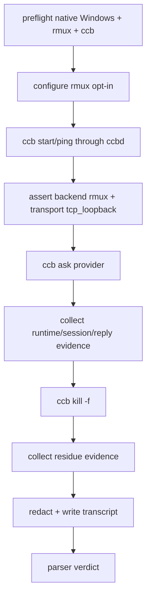

# ccbd-windows-full-chain-smoke feature design

## 0. 术语约定

| 术语 | 定义 | 防冲突结论 |
|---|---|---|
| full-chain smoke | 在 native Windows 上从用户 CLI 入口触发 `ccb`，经 ccbd 控制面、Rmux backend、provider runtime 完成 start/ask/kill 的最小验收。 | 不等同 `rmux-windows-validation-matrix` 的完整多场景矩阵。 |
| true-host transcript | 真机命令、环境、stdout/stderr、artifact、清理结果的可解析证据包。 | 必须声明 `host_kind=native_windows`、`control_plane=ccbd`、`backend_impl=rmux`、`probe_bypass=false`。 |
| probe bypass | 直接调用 `scripts/probe_rmux_*`、直接驱动 rmux CLI 或 fake backend，而不经 `ccb -> ccbd`。 | 本 feature 的核心证据中禁止；只能作为调试残留记录，不能计 pass。 |
| milestone pass | 本轮 owner 终点的最小通过条件。 | 范围不含 supervision recovery、多项目矩阵、packaging/docs 收口。 |

仓库事实：

- roadmap item 21 明确要求 native Windows 真机证明 `ccb→ccbd→rmux` 全链路跑通：启动项目 namespace、`ccb ask` 至少一个 provider、`ccb kill` 清理，不经 probe 旁路。
- 前置设计已通过：`ccbd-windows-tcp-loopback-transport`、`ccbd-rmux-namespace-lifecycle`、`accelerator-transport-windows-guard`、`ccbd-windows-process-liveness`。
- `rmux-windows-validation-matrix` 已定义 true-host 防伪字段、subset/full status、transcript sidecar、redaction 规则；本 feature 复用最小子集，不复制完整矩阵。
- `ccbd-rmux-namespace-lifecycle` 明确 full `ask` 留给本 smoke；`accelerator` 与 process liveness 是 full-chain blocker，不属于 namespace lifecycle child。

## 1. 决策与约束

### 需求摘要

本 feature 是 Windows Rmux epic 的本轮终点验收 item：在 native Windows 上，通过可重复 PowerShell runner 或手工 runbook 生成 command transcript，证明用户入口 `ccb` 能启动 ccbd/Rmux 项目 namespace，执行至少一次 `ccb ask`，并通过 `ccb kill -f` 清理项目资源。所有核心证据必须走 ccbd 控制面和 Rmux backend，禁止 probe 直驱 rmux 作为通过证据。

成功标准：

- preflight 证明当前 host 是 native Windows，而不是 WSL / MSYS / Linux / macOS。
- backend selection 证明实际选择 Rmux：CLI/project/env/user config 来源可追踪，diagnostics 中 `backend_impl=rmux`。
- `ccb ping ccbd` / `ccb doctor` / mounted 证据证明 ccbd 控制面可连接，端点 transport 是 Windows TCP loopback，不是 AF_UNIX。
- `ccb ask` 至少一个 provider 返回可观察 reply 或 valid provider-specific terminal state；provider auth/credential failure 必须分类为 provider failure，不得伪装 system pass。
- `ccb kill -f` 后项目 namespace、ccbd endpoint、TCP token ref、Rmux session/namespace、owned provider/job/process residue 有清理证据或 bounded retained reason。
- transcript sidecar 可被 parser 校验，缺核心字段时 smoke 不通过。

明确不做：

- 不实现 Rmux backend、ccbd transport、accelerator guard、process liveness 或 provider parser；只消费前序实现。
- 不覆盖 supervision recovery、multi-project、多 agent 矩阵、restart replay 或 packaging/docs supported 收口。
- 不发布 npm、不改 package `os`、不 push/tag/release。
- 不把 WSL、probe、fake adapter、direct rmux CLI 作为 full-chain pass。
- 不要求默认 CI 持有真实 provider secret；真实 provider 可作为 focused/manual lane。最小 smoke 的 ask case 必须显式声明 `ask_case_kind=fake_provider|local_provider|real_provider`，其中 fake provider 只允许在 `CCB_TEST_ENTRYPOINT=1` 等仓库认可测试入口下使用，且必须区别于 fake backend / probe bypass；provider failure 只能阻塞 full pass，不能伪装 system pass。

### 关键契约

1. **Transcript sidecar**

```python
class CcbdWindowsFullChainSmokeTranscript(TypedDict):
    schema_version: Literal[1]
    host_kind: Literal["native_windows"]
    control_plane: Literal["ccbd"]
    backend_impl: Literal["rmux"]
    probe_bypass: Literal[False]
    backend_selection_source: Literal["cli", "project_config", "user_config", "env"]
    ccbd_transport: Literal["tcp_loopback"]
    dependency_status: dict[str, Literal["ready", "pending", "blocked"]]
    ask_case_kind: Literal["fake_provider", "local_provider", "real_provider"]
    verdict: Literal["pass", "provider_failure", "system_failure", "test_design_failure", "blocked"]
    failure_class: Literal["none", "provider_failure", "system_failure", "test_design_failure", "dependency_pending", "environment_blocked"]
    commands: list[CommandRecord]
    artifacts: dict[str, str]
    redaction_summary: dict[str, object]
    cleanup: dict[str, object]
    final_status: Literal["pass", "failed", "blocked"]  # 人读汇总；机器判定以 verdict / failure_class 为准
```

2. **Core command sequence**

- environment preflight：PowerShell、Python、`ccb` entry、rmux CLI/version、native Windows marker、workspace path。
- configure opt-in：以 project-local 配置或 env 明确选择 Rmux，记录 source；不得靠隐式 default 猜测。
- dependency preflight：记录四个前置 item 的 acceptance/review/evidence 是否 ready；任一 pending/blocked 时 transcript verdict 为 `blocked` 且 `failure_class=dependency_pending`。
- start/ping：执行 `ccb` 启动入口、`ccb ping ccbd`、`ccb doctor`，必要时执行 `ccb ping <agent>`；证明 ccbd mounted、backend rmux、transport tcp_loopback。
- ask：执行 `ccb ask` 到至少一个 provider，记录 `ask_case_kind`、task id、provider、reply / terminal state、session/runtime evidence。`fake_provider` 必须声明测试入口和 owner 接受证据，不能等同 fake backend 或 probe。
- kill：执行 `ccb kill -f`，记录清理前后 ccbd/rmux/provider/job/process residue。
- parse：用 Python parser 校验 transcript，不合格 fail closed。

3. **Pass / failure 分类**

- `pass`：所有核心 command returncode 合格，sidecar 字段完整，ask 有可接受结果，kill cleanup 合格。
- `provider_failure`：provider auth/credential/quota/CLI failure；不能算 full-chain pass，除非另一个 `fake_provider` / `local_provider` / `real_provider` case 的 `verdict=pass` 且 owner 明确接受为最小 ask provider。
- `system_failure`：ccbd transport、backend selection、Rmux namespace、accelerator AttributeError、process liveness、kill cleanup 等系统层失败。
- `test_design_failure`：host/control_plane/backend/probe_bypass 字段缺失、命令没记录、artifact 缺失、redaction 未执行。
- `blocked`：依赖实现未完成、rmux 未安装、route approval rejected、真实 provider 未授权。

4. **Redaction**

- 不落 provider token、same-user TCP token、用户 home secret、完整 credential path。
- Windows 用户路径可保留项目相对路径；绝对 home 目录需替换为 stable placeholder。
- stdout/stderr 原文存 artifact 时必须有 redaction summary 和 raw retention policy。

### Top 3 风险与缓解

1. **风险：probe 或 fake 证据被误当真链路。**  
   缓解：sidecar 强制 `control_plane=ccbd`、`probe_bypass=false`、`backend_impl=rmux`，parser fail closed。
2. **风险：provider credential failure 让系统链路无法判断。**  
   缓解：至少分离 `fake_provider` / `local_provider` / `real_provider` ask case；真实 provider failure 单独分类，不掩盖 start/kill 系统证据。fake provider 只能在测试入口下使用，并且必须与 fake backend/probe 明确区分。
3. **风险：kill 清理只看命令成功码，漏掉残留。**  
   缓解：清理前后都记录 ccbd endpoint、TCP token、Rmux namespace/session、owned process/job residue。

### 非显然依赖与关键假设

- 依赖四个前置 blocker 的实现和通过：Windows ccbd transport、Rmux namespace lifecycle、accelerator fallback、process liveness。
- 假设实现阶段可提供一个可无外部 secret 的 ask case；若没有，full-chain pass 必须等待真实 provider 授权或 owner 明确接受 provider failure 不计 pass。
- 假设 Windows runner 可以执行 PowerShell runner；若没有真机，feature 只能产出 blocked transcript parser，不得标 pass。

## 2. 名词与编排

### 2.1 名词层

#### 现状

- 现有 scripts 有 fake/matrix/lifecycle smoke，但没有本轮最小 true-host full-chain transcript gate。
- validation matrix 设计提供完整矩阵语义，但本 item 是里程碑最小验收，不能等待多项目/packaging/recovery 全覆盖。
- ccbd lifecycle、accelerator、process liveness 的前置 child 都已形成 design 契约，本 item只消费其 observable evidence。

#### 变化

新增/收敛的交付候选：

```text
scripts/ccbd-windows-full-chain-smoke.ps1
scripts/ccbd_windows_full_chain_smoke.py
test/test_ccbd_windows_full_chain_smoke.py
artifacts/ccbd-windows-full-chain-smoke/transcript.json
```

Interface 设计检查：

- Module：full-chain smoke owns minimal transcript schema、runner command order、parser verdict。
- Interface：acceptance 只消费 transcript parser verdict，不人工猜测命令输出。
- Seam：runner 和 parser 分离；PowerShell 收集证据，Python parser 做可重复判定。
- Depth / locality：medium。它是验证资产，不改生产 runtime，但证据错误会直接影响 epic 是否可进入实现 goal。
- Dependency strategy：true external for Windows host + local-substitutable parser fixtures。

### 2.2 编排层



流程级约束：

- 每个 command record 包含 argv、cwd、env allowlist、started_at、duration_ms、returncode、stdout_path、stderr_path。
- runner 必须在 `finally` 中尝试 kill/cleanup，失败也要写 cleanup evidence。
- parser 不执行命令，只校验 sidecar 和 artifacts，方便非 Windows code review/QA 复核。
- ask case 的 provider、task id、reply artifact、runtime state 必须可追踪；不能只看 stdout 包含“ok”。
- full pass 要求 kill cleanup 通过；ask pass 但 cleanup failed 仍是 system_failure。

### 2.3 挂载点清单

- `scripts/ccbd-windows-full-chain-smoke.ps1`：Windows true-host command runner。
- `scripts/ccbd_windows_full_chain_smoke.py`：transcript parser / verdict builder。
- `test/test_ccbd_windows_full_chain_smoke.py`：sample transcript fixtures、redaction、classification、missing-field fail-closed。
- `artifacts/ccbd-windows-full-chain-smoke/`：实现/QA/acceptance 输出目录约定。
- scope guard：禁止改 production runtime、packaging/docs、provider parser。

### 2.4 推进策略

1. **transcript schema/parser**：定义 sidecar schema、command record、classification、redaction requirements。  
   退出信号：sample pass/failure/missing fixtures 生成稳定 verdict，缺 host/control/backend/probe 字段 fail closed。
2. **PowerShell runner skeleton**：实现 preflight、command capture、artifact paths、finally cleanup、redaction summary。  
   退出信号：dry-run 或 fixture mode 可在非真机测试 parser；runner 不含 provider secret allowlist 外输出。
3. **start/ping evidence**：记录 native host、rmux version、backend selection、ccbd transport、mounted/doctor output。  
   退出信号：parser 能证明 `host_kind=native_windows`、`backend_impl=rmux`、`control_plane=ccbd`、`ccbd_transport=tcp_loopback`。
4. **ask evidence**：运行至少一个 provider ask，记录 `ask_case_kind`、task id、provider、reply/terminal state、runtime/session evidence。  
   退出信号：ask pass 或 provider_failure 分类可复核；full pass 需要至少一个 accepted provider case。
5. **kill cleanup evidence**：执行 `ccb kill -f` 并扫描 ccbd endpoint、TCP token、Rmux namespace/session、owned process/job residue。  
   退出信号：cleanup pass 或 bounded retained reason；无证据不能 pass。
6. **true-host gate and scope guard**：禁止 probe/fake/WSL/pass-through；禁止越界生产实现和 packaging/docs。  
   退出信号：parser + deterministic scope guard 证明 smoke 只新增验证资产；forbidden path 命中必须 fail closed。

### 2.5 结构健康度与微重构

##### 评估

- 文件级：validation matrix 脚本后续会更广，不应把本轮最小终点硬塞到完整矩阵脚本里。
- 文件级：PowerShell runner 只做命令收集；判定逻辑放 Python parser，避免 PS 脚本变成大状态机。
- 目录级：`scripts/` 已有 smoke 脚本，新增 focused runner/parser 符合现有布局。

##### 结论：新增 focused smoke runner/parser，不做生产微重构

本 feature 只新增验证资产和测试夹具，不重构已有 smoke 脚本，不改生产 runtime。若实现发现缺少生产 observability 字段，应回到对应前置 feature，而不是在 smoke 中旁路补字段。

## 3. 验收契约

### 3.1 关键场景清单

| ID | 输入 / 触发 | 期望可观察结果 | 证据类型 |
|---|---|---|---|
| AC-001 | transcript 缺 host/control/backend/probe 字段 | parser verdict `test_design_failure`，不得 pass | unit |
| AC-002 | native Windows preflight | sidecar 记录 native Windows、PowerShell、Python、ccb、rmux version | transcript |
| AC-003 | backend selection | diagnostics 证明 backend rmux 且 source 可追踪 | transcript/parser |
| AC-004 | ccbd transport | ping/doctor 证明 control plane 走 ccbd + tcp_loopback | transcript/parser |
| AC-005 | `ccb ask` | 至少一个 provider ask 有 `ask_case_kind`、task id、runtime/session/reply 或 accepted terminal evidence | transcript/parser |
| AC-006 | provider failure | auth/credential/quota 被归为 provider_failure，不算 system pass | unit/transcript |
| AC-007 | `ccb kill -f` | cleanup 后 endpoint/token/rmux namespace/session/owned process residue 合格 | transcript/parser |
| AC-008 | probe bypass | probe/fake/WSL/direct rmux transcript 不得 pass | unit/parser |
| AC-009 | scope guard | deterministic guard 对 production runtime、packaging/docs、provider parser 越界 fail closed | guard/review |

### 3.2 明确不做的反向核对项

- 不应把 `scripts/probe_rmux_*` 输出计为 pass。
- 不应把 fake backend 或 WSL transcript 计为 native Windows true-host。
- 不应跳过 `ccb kill -f` cleanup evidence。
- 不应为了让 smoke 过而修改 provider parser、backend implementation 或 installer/package。
- 不应把 provider auth failure 归为 Rmux/ccbd system pass。

### 3.3 Acceptance Coverage Matrix

| Scenario | Covered By Step | Evidence Type | Command / Action | Core? |
|---|---|---|---|---|
| AC-001 schema fail closed | S1 | unit | parser fixture tests | yes |
| AC-002 native preflight | S2,S3 | transcript | PowerShell preflight | yes |
| AC-003 backend rmux | S3 | transcript/parser | `ccb ping ccbd` / `ccb doctor` diagnostics | yes |
| AC-004 ccbd transport | S3 | transcript/parser | `ccb ping ccbd` / doctor endpoint evidence | yes |
| AC-005 ask provider | S4 | transcript/parser | `ccb ask` | yes |
| AC-006 provider failure classification | S4 | unit/transcript | provider failure fixture | yes |
| AC-007 kill cleanup | S5 | transcript/parser | `ccb kill -f` + residue scan | yes |
| AC-008 no bypass | S6 | unit/parser | fake/probe/WSL negative fixtures | yes |
| AC-009 scope guard | S6 | guard | deterministic forbidden-path scope guard | yes |

### 3.4 DoD Contract

| ID | 要求 | 证据 | 阻塞级别 |
|---|---|---|---|
| DOD-DESIGN-001 | design/checklist/review 完整，且对齐 roadmap item `ccbd-windows-full-chain-smoke` | design review | blocking |
| DOD-IMPL-001 | transcript schema/parser fail closed，防伪字段、`verdict`、`failure_class`、`ask_case_kind` 完整 | unit tests | blocking |
| DOD-IMPL-002 | PowerShell runner 记录 start/ping/ask/kill 命令与 artifacts，并执行 finally cleanup | runner tests/review | blocking |
| DOD-IMPL-003 | start/ping 证明 native Windows + ccbd + rmux + tcp_loopback | transcript | blocking |
| DOD-IMPL-004 | ask 至少一个 provider 有可接受 evidence；provider failure 分类清楚；fake provider 仅在测试入口下可接受且不得混同 fake backend/probe | transcript/parser | blocking |
| DOD-IMPL-005 | kill cleanup residue evidence 完整 | transcript/parser | blocking |
| DOD-IMPL-006 | probe/fake/WSL/direct rmux negative fixtures 不得 pass | unit tests | blocking |
| DOD-IMPL-007 | deterministic scope guard 对 production runtime、packaging/docs、provider parser 越界 fail closed | guard | blocking |
| DOD-REVIEW-001 | code review passed 且无 unresolved blocking | review report | blocking |
| DOD-QA-001 | QA 附 native Windows true-host transcript 或明确 blocked reason | QA report | blocking |
| DOD-ACCEPT-001 | acceptance 根据 transcript verdict 回写 roadmap item | acceptance report | blocking |

Validation Commands:

| ID | 命令 | 目的 | 核心性 | 失败处理 |
|---|---|---|---|---|
| CMD-001 | `python ".codestable/tools/validate-yaml.py" --file ".codestable/features/2026-07-20-ccbd-windows-full-chain-smoke/ccbd-windows-full-chain-smoke-checklist.yaml" --yaml-only` | checklist YAML 合法性 | core | fix-or-block |
| CMD-002 | `python ".codestable/tools/validate-yaml.py" --file ".codestable/roadmap/windows-rmux-native-backend/windows-rmux-native-backend-items.yaml"` | roadmap items 回写合法性 | core | fix-or-block |
| CMD-003 | `python -m pytest -q test/test_ccbd_windows_full_chain_smoke.py` | transcript parser、classification、redaction、negative fixtures、scope guard | core | fix-or-block |
| CMD-004 | `powershell -NoProfile -ExecutionPolicy Bypass -File ".\\scripts\\ccbd-windows-full-chain-smoke.ps1" -ProjectRoot "$env:TEMP\\ccb-rmux-full-chain" -Backend rmux -Json` | native Windows true-host transcript | core-manual | attach-transcript-or-block-pass |
| CMD-005 | `python scripts/ccbd_windows_full_chain_smoke.py --transcript "artifacts/ccbd-windows-full-chain-smoke/transcript.json" --json` | parser verdict | core | fix-or-block |
| CMD-006 | `python scripts/ccbd_windows_full_chain_smoke.py --scope-guard --diff-base HEAD --json` | deterministic scope guard；forbidden path fail closed | core | fix-or-block |

Required Artifacts：design、checklist、design-review、PowerShell runner、Python parser、parser fixtures、negative probe/WSL/fake fixtures、failure-class fixtures、fake-provider 测试入口 fixture、redaction tests、native Windows transcript sidecar、stdout/stderr artifact refs、cleanup evidence、deterministic scope guard output、acceptance report、items.yaml 回写。

### 3.5 自我批判结论

- 可证伪性：pass 由 parser verdict 和 required fields 决定，不靠人工总结。
- 步骤原子性：schema/parser、runner、start/ping、ask、kill、guard 分离。
- 最弱依赖：真实 provider secret 可能缺失；设计要求 provider failure 不算 full pass，除非有 accepted provider case。
- 证据完整性：start/ask/kill 三段都有 artifacts 和 cleanup evidence。
- 交付物可核验性：acceptance 可用 transcript sidecar、parser output、deterministic scope guard output 反查。
- 清洁度规则：不新增临时 TODO/FIXME、调试输出、注释掉代码、死 import；transcript 不落 secret 原文。

## 4. 与项目级架构文档的关系

- 本 feature 实现 roadmap item 21，是本轮 milestone 的最小终点验收。
- 本 feature 消费 ccbd Windows transport、Rmux namespace lifecycle、accelerator guard、process liveness 四个前置设计。
- 本 feature 不替代完整 `rmux-windows-validation-matrix`、supervision recovery、多项目矩阵或 packaging/docs supported 收口。
