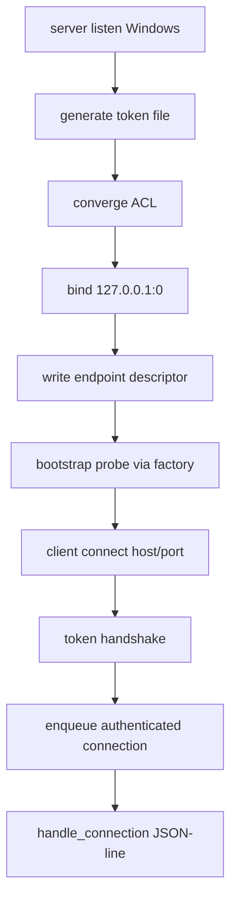

# ccbd-windows-tcp-loopback-transport feature design

## 0. 术语约定

| 术语 | 定义 | 防冲突结论 |
|---|---|---|
| Windows TCP loopback adapter | `ccbd/control_plane_transport` seam 下的 Windows production adapter。 | 只服务 `ccb↔ccbd` 控制面 RPC，不是 Rmux/named-pipe mux transport。 |
| endpoint descriptor | Windows 下持久化的 `kind=tcp_loopback`、`host=127.0.0.1`、OS 分配 `port`、`token_ref`。 | 旧 `socket_path` 只作兼容别名，Windows canonical authority 是 endpoint descriptor。 |
| same-user token | 存放在当前用户 runtime root 下的随机 token 文件，client connect 后必须完成 token handshake。 | token 文件 ACL 必须收敛到当前用户；无法收敛则 fail-fast，不允许无鉴权监听。 |
| bootstrap self-ping | ccbd mounted publish 前通过 transport seam 自连并执行 ping 的 readiness gate。 | Windows self-ping 必须走同一 token 鉴权路径，不能绕过为本地函数调用。 |
| stale cleanup | 清理上代 endpoint/token evidence 的过程。 | TCP 不使用 Unix inode；以 endpoint generation、host/port/token_ref 和 token 文件身份为 evidence。 |

代码事实：

- `ccbd-control-plane-transport-seam` 已设计 endpoint/factory/interface/unix/fake seam，要求 Windows adapter 只能通过该 seam 接入。
- roadmap §4.9 已明确 Windows adapter 使用 TCP loopback + same-user token，named pipe 仅为 documented fallback。
- 现有 JSON-line frame helpers 与 handler dispatch 应保持不变；本 feature 只替换 transport adapter。
- 现有 storage path 已有 `runtime_state_root` 与 `.ccb/ccbd` 目录，适合放 endpoint descriptor 和 token 文件；旧 `socket_path` 调用面较多，需要兼容投影。

## 1. 决策与约束

### 需求摘要

本 feature 在 control-plane transport seam 之上实现 Windows TCP loopback adapter，使 native Windows 下 `ccb` 能连接 `ccbd` 控制面。adapter 绑定 `127.0.0.1`、端口由 OS 分配，端点发现写入 store，client 读取 endpoint descriptor 后连接并完成 same-user token 握手。

成功标准：

- Windows 平台默认选择 `tcp_loopback` adapter，Unix 仍走 `unix_socket` adapter。
- server listen 绑定 `127.0.0.1:0`，读取 OS 分配端口，写 endpoint descriptor 和 token_ref。
- token 文件用 cryptographically strong random 生成；ACL 用 `icacls` 或等价标准库/系统能力收敛到当前用户，只要无法证明收敛就 fail-fast。
- client 从 transport store 读取 host/port/token_ref，加载 token，连接后完成 handshake；失败映射为 `RpcTransportAuthError`。
- bootstrap self-ping 使用同一 connect/handshake 路径，不旁路 same-user 鉴权。
- JSON-line frame、RPC handlers、ccbd business ops 不变。

明确不做：

- 不实现 named pipe adapter；仅保留 documented fallback 条件。
- 不改变 RPC schema、handler dispatch、project namespace lifecycle、Rmux backend 或 provider runtime。
- 不修 pid liveness；`ccbd-windows-process-liveness` 单独处理。
- 不把 token 写入日志、doctor 明文、异常字符串或 artifact。
- 不允许 token ACL 无法收敛时降级为无鉴权 TCP listener。

### 复杂度档位

- 行为兼容 = L3。Unix 行为不漂移，Windows 引入可诊断 control-plane transport。
- 安全性 = high。loopback 只能阻止远程网络，不阻止同机其他用户；same-user token 是硬边界。
- 可测试性 = verified。token ACL、handshake、store discovery、bootstrap 和 failure mapping 都可 fake/Windows-conditional tests。
- 外部依赖 = OS capability。使用 socket、secrets、subprocess `icacls` 或可注入 ACL checker；不新增 pywin32。

### 关键决策

1. Endpoint descriptor：

```python
class TcpLoopbackEndpoint(TypedDict):
    kind: Literal["tcp_loopback"]
    host: Literal["127.0.0.1"]
    port: int
    token_ref: str
    legacy_socket_path: None
    generation: int
```

2. Token 文件：
   - 路径在 `runtime_state_root/ccbd/control-plane-token-{generation}.json` 或等价 store-managed path。
   - 内容只保存随机 token 与 metadata；diagnostics 只输出 token_ref、acl_status、fingerprint，不输出 token。
   - ACL 收敛步骤必须可测试：当前用户 allow read，其他用户/world denied；无法证明即 `token-unprotectable`。
   - ACL 证明以当前用户 SID / owner 为准；无法可靠解析本地化 `icacls` 输出、继承 ACE 或等价 ACL evidence 时按 `token-unprotectable` 处理。
3. Handshake：
   - client connect 后第一帧发送 auth prelude 或 transport-owned auth message，server 验证 token 后才把 connection 交给 JSON-line `handle_connection()`。
   - 认证失败连接立即关闭，错误分类 `not-same-user|token-missing|token-unprotectable|handshake-failed`。
4. Bootstrap：
   - `create_bootstrap_probe()` 使用 endpoint store / connector 读取 token 并走完整 handshake。
   - nonce ping 仍通过 `RpcRequest(op="ping")`，不新增 RPC op。
5. Stale cleanup：
   - Windows adapter 不删除未知 token_ref，不复用 Unix socket inode。
   - shutdown 只清理本 generation token/endpoint；发现 live listener 与 endpoint token 匹配时拒绝替换。
6. Named pipe fallback：
   - 只作为 design residual / ADR 备选条件记录；实现不写 named-pipe production 分支。

### Top 3 风险与缓解

1. **风险：loopback 端口可被同机其他用户预认证连接。**  
   缓解：token handshake 在 JSON-line handler 前执行；失败连接不入队，token 不进日志。
2. **风险：ACL 收敛在非英文 Windows / 无 icacls 环境下误判。**  
   缓解：ACL helper 注入命令 runner / parser；无法证明收敛即 fail-fast，测试覆盖 stderr/locale-tolerant 状态。
3. **风险：端点 store 与旧 socket_path 兼容混乱。**  
   缓解：store/factory 是唯一读取入口；Windows endpoint canonical-first，旧 `socket_path` 只为兼容字段，client 不从 socket_path 推断 TCP。

### 非显然依赖与关键假设

- 依赖 `ccbd-control-plane-transport-seam` 的 endpoint/factory/listener/connection/bootstrap primitive。
- `ccbd-windows-process-liveness` 仍是 full-chain blocker；本 feature 只解决 endpoint connectability。
- 假设 Python 标准库 socket 在 Windows loopback 可支持现有 select/readiness 路径；这正是选择 TCP 而非 named pipe 的理由。
- 假设 token 文件位于用户可写 runtime root，且实现可用系统 ACL 工具证明当前用户独占读取。

## 2. 名词与编排

### 2.1 名词层

#### 现状

- native Windows 无 AF_UNIX，现有 ccbd client/server/bootstrap 在控制面无法起。
- seam design 已把 endpoint、listener、connection、bootstrap probe、fake transport 抽出，但尚无 Windows production adapter。
- roadmap 已批准 TCP loopback 作为 Option 1，named pipe 为 documented fallback。

#### 变化

新增候选模块：

```text
lib/ccbd/control_plane_transport/windows_tcp.py
lib/ccbd/control_plane_transport/token_auth.py
lib/ccbd/control_plane_transport/endpoint_store.py
```

Interface 设计检查：

- Module：`windows_tcp.py` 是 Windows production adapter；`token_auth.py` 是 same-user token 与 ACL helper。
- Interface：上层只见 `EndpointRef(kind="tcp_loopback")`、listener/connection、auth diagnostics。
- Seam：端口绑定、token file、handshake、ACL、stale cleanup、endpoint store 都在 adapter boundary。
- Depth / locality：deep adapter；不让 CLI/server loop 分叉 `if windows`。
- Dependency strategy：local-substitutable；token/ACL runner、socket factory、endpoint store 可注入测试。

### 2.2 编排层



流程级约束：

- listen 顺序：token 生成 + ACL 收敛成功后才 publish endpoint；bind/listen 失败必须删除本次 token。
- connect 顺序：读取 endpoint descriptor → 读取 token → TCP connect → auth prelude → 成功后才进入 frame helper。
- auth failure：server 关闭连接，不调用 handler，不记录 token 明文。
- endpoint publish：写 canonical descriptor；Windows `legacy_socket_path` / `socket_path` 投影必须为 `None` / null，不写 path-like placeholder，不作为 connect / liveness / stale cleanup authority。
- diagnostics：记录 `transport_kind=tcp_loopback`、host、port、token_ref、acl_status、handshake_status；diagnostics、log、snapshot、error detail、异常链和 artifact 全部 redacted，只允许出现 token_ref 或 fingerprint。

### 2.3 挂载点清单

- `lib/ccbd/control_plane_transport/windows_tcp.py`：Windows TCP loopback listener/connector。
- `lib/ccbd/control_plane_transport/token_auth.py`：token generation、ACL convergence、handshake。
- `lib/ccbd/control_plane_transport/endpoint_store.py`：endpoint descriptor publish/read/cleanup。
- `lib/ccbd/control_plane_transport/factory.py`：platform default Unix/Windows adapter selection。
- `lib/ccbd/socket_server_runtime/bootstrap_probe.py`：通过 seam probe 使用 Windows handshake。
- `lib/ccbd/handlers/ping_runtime/payloads.py`、doctor/start diagnostics：展示 endpoint descriptor，redact token。
- `test/test_ccbd_windows_tcp_loopback_transport.py`：Windows/fake token transport tests。
- `test/test_ccbd_windows_tcp_loopback_import_guard.py`：scope/secret guard。

### 2.4 推进策略

1. **endpoint store + platform selection**：实现 Windows platform default `tcp_loopback`，endpoint store read/write/legacy projection。  
   退出信号：factory tests 断言 Windows 选 TCP、Unix 选 Unix，CLI 不分叉平台读取。
2. **token auth + ACL convergence**：实现 token generation、ACL convergence、redacted diagnostics。  
   退出信号：tests 覆盖 success、icacls failure、unparseable ACL、token missing、no token logging。
3. **TCP listener/connector**：实现 bind `127.0.0.1:0`、OS port discovery、connect timeout、shutdown cleanup。  
   退出信号：unit/fake socket tests 断言 host/port/token_ref 和 cleanup ownership。
4. **handshake before handler**：auth prelude 在 JSON-line RPC 前完成，失败连接不入队。  
   退出信号：valid token 可 ping；bad/missing token 不触发 handler。
5. **bootstrap self-ping**：bootstrap probe 通过 factory/connector 走同一 token path。  
   退出信号：bootstrap nonce success、auth failure、endpoint stale 均可诊断。
6. **diagnostics and redaction**：ping/doctor/start payload 展示 endpoint kind/address/token_ref/acl status，不输出 token。  
   退出信号：snapshot tests 与 grep guard 证明 token redacted。
7. **regression and guard**：确认 frame/handler 不变，不新增 named pipe production 分支，不修 pid liveness。  
   退出信号：focused ccbd tests + import/secret guard 通过。

### 2.5 结构健康度与微重构

##### 评估

- 文件级 — `control_plane_transport/factory.py`：适合放 platform selection 与 endpoint store adapter，不应让 CLI/keeper 自己判断 Windows。
- 文件级 — `windows_tcp.py`：需要与 Unix adapter 并列，隔离 TCP bind/connect/handshake。
- 文件级 — `token_auth.py`：ACL 与 token redaction 是安全边界，独立文件便于审查和测试。
- 目录级 — `ccbd/control_plane_transport/` 已由前序 seam 建立；新增 Windows adapter 与 helper 符合目录归属。

##### 结论：不做行为微重构

本 feature 只新增 Windows adapter 并接入 seam，不重构 handler、daemon lifecycle、project namespace 或 provider runtime。

## 3. 验收契约

### 3.1 关键场景清单

| ID | 输入 / 触发 | 期望可观察结果 | 证据类型 |
|---|---|---|---|
| AC-001 | Windows platform factory | 选择 `tcp_loopback`，Unix 仍选 `unix_socket` | unit test |
| AC-002 | server listen | bind `127.0.0.1:0`，endpoint descriptor 含 host/port/token_ref | unit/integration |
| AC-003 | ACL 无法收敛 | fail-fast `RpcTransportAuthError(category="token-unprotectable")`，不 publish endpoint | unit test |
| AC-004 | client valid token | handshake 成功后 JSON-line ping 正常 | unit/integration |
| AC-005 | missing/bad token | 连接关闭，handler 不执行，错误分类可诊断 | unit test |
| AC-006 | bootstrap self-ping | 走同一 token handshake，nonce 校验保持 | regression |
| AC-007 | token redaction | diagnostics/log/snapshot/error/artifact 有 token_ref/acl_status/fingerprint，无 token 明文 | unit/grep guard |
| AC-008 | scope guard | 不改 RPC schema/handler，不实现 named pipe，不修 pid liveness | diff/import guard |

### 3.2 明确不做的反向核对项

- 不应出现无 token 的 Windows TCP listener。
- 不应在 token ACL 失败时 fallback 到无鉴权或 Unix socket。
- 不应把 token 明文写入 diagnostics、日志、doctor、异常字符串、异常链、snapshot、artifact 或 `.codestable`。
- 不应修改 `RpcRequest` / `RpcResponse` 或 handler dispatch。
- 不应实现 named pipe adapter。
- 不应修改 Rmux/backend/provider/session 或 pid liveness。

### 3.3 Acceptance Coverage Matrix

| Scenario | Covered By Step | Evidence Type | Command / Action | Core? |
|---|---|---|---|---|
| AC-001 platform selection | S1 | unit test | `test/test_ccbd_windows_tcp_loopback_transport.py` | yes |
| AC-002 listen/endpoint | S1,S3 | unit/integration | TCP adapter tests | yes |
| AC-003 ACL fail-fast | S2 | unit test | token auth tests | yes |
| AC-004 valid handshake | S4 | unit/integration | ping over TCP loopback | yes |
| AC-005 invalid token | S4 | unit test | no handler execution assertion | yes |
| AC-006 bootstrap | S5 | regression | bootstrap probe tests | yes |
| AC-007 redaction | S6 | unit/guard | diagnostics/log/snapshot/error/artifact guard + grep | yes |
| AC-008 scope guard | S7 | guard | import/diff guard | yes |

### 3.4 DoD Contract

| ID | 要求 | 证据 | 阻塞级别 |
|---|---|---|---|
| DOD-DESIGN-001 | design/checklist/review 完整，且对齐 roadmap item `ccbd-windows-tcp-loopback-transport` | design review | blocking |
| DOD-IMPL-001 | Windows platform default 使用 TCP loopback，Unix 不漂移 | unit tests | blocking |
| DOD-IMPL-002 | token ACL 可证明收敛；无法收敛 fail-fast 且不 publish endpoint | tests | blocking |
| DOD-IMPL-003 | client/server handshake 在 handler 前完成，失败不入队 | tests | blocking |
| DOD-IMPL-004 | bootstrap self-ping 走同一 auth path | regression | blocking |
| DOD-IMPL-005 | endpoint store canonical-first；Windows `socket_path` 投影为 null，旧 path 字段不得作为 TCP authority | tests | blocking |
| DOD-IMPL-006 | diagnostics/log/snapshot/error/artifact redacts token | tests/guard | blocking |
| DOD-IMPL-007 | 不改 frame/handler，不实现 named pipe，不修 pid liveness | guard | blocking |
| DOD-REVIEW-001 | code review passed 且无 unresolved blocking | review report | blocking |
| DOD-QA-001 | QA 覆盖 platform、token ACL、handshake、bootstrap、diagnostics、guard | QA report | blocking |
| DOD-ACCEPT-001 | acceptance 回写 roadmap item，并提示落地后补 ADR | acceptance report | blocking |

Validation Commands:

| ID | 命令 | 目的 | 核心性 | 失败处理 |
|---|---|---|---|---|
| CMD-001 | `python ".codestable/tools/validate-yaml.py" --file ".codestable/features/2026-07-20-ccbd-windows-tcp-loopback-transport/ccbd-windows-tcp-loopback-transport-checklist.yaml" --yaml-only` | checklist YAML 合法性 | core | fix-or-block |
| CMD-002 | `python ".codestable/tools/validate-yaml.py" --file ".codestable/roadmap/windows-rmux-native-backend/windows-rmux-native-backend-items.yaml"` | roadmap items 回写合法性 | core | fix-or-block |
| CMD-003 | `python -m pytest -q test/test_ccbd_windows_tcp_loopback_transport.py` | TCP adapter、token ACL、handshake、endpoint store | core | fix-or-block |
| CMD-004 | `python -m pytest -q test/test_ccbd_bootstrap_probe.py test/test_ccbd_control_plane_transport_fake.py` | bootstrap 与 seam 回归 | core | fix-or-block |
| CMD-005 | `python -m pytest -q test/test_v2_start_service.py test/test_v2_phase2_entrypoint.py -k "ccbd or endpoint or ping or socket"` | start/ping 控制面抽样 | core | document-baseline |
| CMD-006 | `python -m pytest -q test/test_ccbd_windows_tcp_loopback_import_guard.py` | no token leak in diagnostics/log/snapshot/error/artifact / no named pipe / no handler schema change guard | core | fix-or-block |

Required Artifacts：design、checklist、design-review、Windows TCP adapter、token auth helper、endpoint store update、handshake tests、bootstrap regression、diagnostics redaction tests、scope guard、items.yaml 回写。

### 3.5 自我批判结论

- 可证伪性：ACL、handshake、bad token、bootstrap 和 redaction 都有明确测试入口。
- 步骤原子性：platform/store、token auth、listener/connector、handshake、bootstrap、diagnostics、guard 分离。
- 最弱依赖：ACL 收敛最容易误判；无法证明即 fail-fast，不能静默放行。
- 证据完整性：成功、token missing、token unprotectable、bad token、stale endpoint、redaction 均覆盖。
- 交付物可核验性：acceptance 可从 endpoint descriptor、token ACL report、handshake tests 和 diagnostics redaction 反查。
- 清洁度规则：不新增临时 TODO/FIXME、调试输出、注释掉代码、死 import；不记录 token 明文；不写 named-pipe production 分支。

## 4. 与项目级架构文档的关系

- 本 feature 实现 roadmap §4.9 Windows TCP loopback adapter，并消费 `ccbd-control-plane-transport-seam`。
- 本 feature 是 `ccbd-windows-full-chain-smoke` 的控制面前置之一。
- Windows TCP vs named pipe 的决策落地后应由 `cs-domain` 记录 ADR；本 design 只保留 fallback 条件。
- 本 feature 不覆盖 mux/Rmux namespace lifecycle，也不覆盖 pid liveness。
