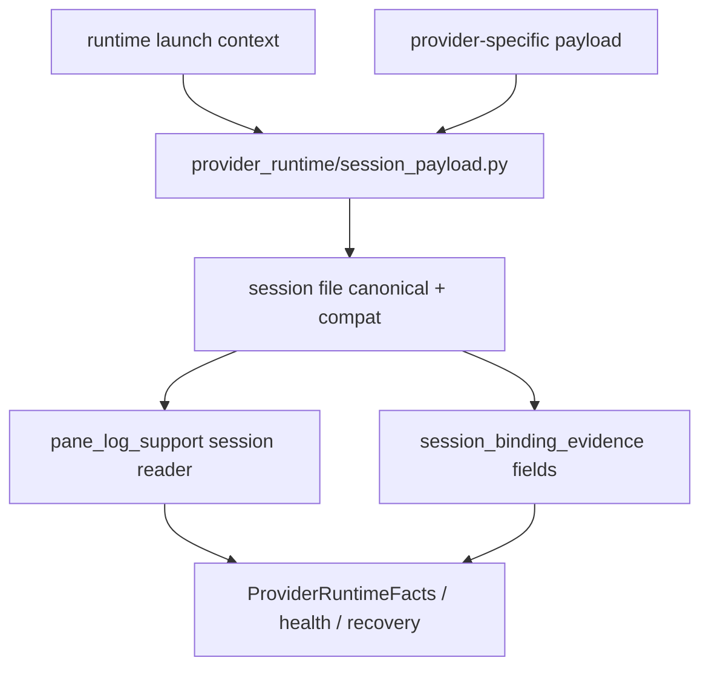

# provider-runtime-backend-session-contract feature design

## 0. 术语约定

| 术语 | 定义 | 防冲突结论 |
|---|---|---|
| provider session payload | `.ccb/.{provider}-{agent}-session` 及 provider-specific session 文件中保存的 runtime 绑定信息。 | canonical 字段必须是 mux-neutral；旧 tmux 字段只能是兼容别名。 |
| mux session payload | 新的共享 payload 片段：`terminal="mux"`、`backend_family`、`backend_impl`、`pane_ref`、`namespace_ref`、`compat`。 | 不让 Codex / Claude / Gemini / native CLI 等 provider 各自定义 backend 字段。 |
| compat alias | `terminal="tmux"`、`tmux_session`、`tmux_socket_name`、`tmux_socket_path` 等旧字段。 | 迁移期继续写/读，但不得成为 authority。 |
| runtime launch context | provider launch 阶段传递 backend、pane、namespace、session id、cwd 的共享上下文。 | `runtime_launch.py` 不应长期直接把 `TmuxBackend` 当唯一 production backend。 |
| provider env | provider 启动命令中注入的 `CCB_*`、provider-specific `*_TMUX_SESSION` / `*_TMUX_LOG`、provider home / user session 环境。 | 新读取路径必须 mux-neutral canonical-first；`CCB_TMUX_*`、`CODEX_TMUX_SESSION`、`GEMINI_TMUX_SESSION`、`OPENCODE_TMUX_SESSION`、`CODEX_TMUX_LOG` 只能作为 compatibility fallback。 |
| provider session reader | `pane_log_support/session.py`、`provider_core/session_binding_evidence_runtime/*` 和各 provider session loader。 | 读者必须 canonical-first、alias-fallback。 |

代码事实：

- `lib/cli/services/runtime_launch_runtime/session_files.py::write_session_file()` 当前固定写 `terminal: "tmux"`、`tmux_session`、`pane_id`、`tmux_socket_*`。
- `lib/cli/services/runtime_launch.py` 直接导入并注入 `TmuxBackend`。
- `lib/provider_backends/codex/launcher.py`、`lib/provider_backends/native_cli_support/launcher.py` 的 `build_session_payload()` 仍固定写 `terminal: "tmux"` 和 `tmux_session`。
- `lib/provider_backends/codex/launcher_runtime/bridge.py` 写 `CODEX_TMUX_SESSION` / `CODEX_TMUX_LOG`；`codex/comm_runtime/session_runtime_runtime/loading.py`、`codex/bridge_runtime/service.py`、`gemini/comm_runtime/session_runtime.py`、`opencode/runtime/session_runtime.py` 仍读取 provider-specific `*_TMUX_SESSION`。
- `lib/provider_backends/pane_log_support/session.py::PaneLogProjectSessionBase` 缺省 `terminal="tmux"`，`pane_id` 会从 `tmux_session` 回退。
- `lib/provider_core/session_binding_evidence_runtime/fields.py` 的 `session_runtime_ref()` 使用 `{terminal}:{pane_id}`，`session_tmux_socket_*()` 只在 `terminal == "tmux"` 时读旧字段。

## 1. 决策与约束

### 需求摘要

本 feature 定义 provider runtime session payload 的 backend-neutral contract，使 provider launch、health、recovery、diagnostics 和 session readers 都能基于 mux canonical 字段工作，同时保留旧 tmux alias。

成功标准：

- 共享 session writer 产生 `terminal="mux"`、`backend_family`、`backend_impl`、`pane_ref`、`namespace_ref`。
- provider-specific `build_session_payload()` 不再各自写死 canonical tmux 字段；共享 helper 负责 canonical + compat 合并。
- session readers canonical-first、alias-fallback，旧 session 文件仍可读。
- runtime health / provider facts 不再把 `pane_id` 当成 tmux-only identity。
- provider env 同时暴露 mux-neutral 字段，并让旧 `CCB_TMUX_*` 与 provider-specific `*_TMUX_SESSION` / `*_TMUX_LOG` 只作为 compatibility fallback。
- `TmuxBackend` 直接导入被限制在 adapter / compatibility 层，不继续作为 runtime launch 的唯一 production truth。

明确不做：

- 不实现 `RmuxBackend` core、send/capture/logging 或 daemon lifecycle。
- 不删除旧 `tmux_session`、`tmux_socket_path`、`tmux_socket_name` 字段。
- 不改 provider completion parser、provider session JSONL 格式或 provider 原生命令协议。
- 不把 foreground attach 改成 Rmux attach；该项属于 `ccbd-rmux-namespace-lifecycle`。
- 不把 provider auth / home / profile 隔离规则重写。

### 复杂度档位

- 兼容性 = L3。旧 session 文件与现有 tmux path 必须继续工作。
- 持久契约 = deep。session payload 是 launch、health、recovery、diagnostics 的共享协议。
- 可测试性 = verified。writer、reader、provider launcher、runtime facts 都能通过 fixture 断言。

### 关键决策

1. 新建共享 seam：`lib/provider_runtime/session_payload.py`，只负责构造 canonical mux payload、compat alias 和 reader projection。
2. canonical payload 固定为：

```python
class MuxSessionPayload(TypedDict):
    terminal: Literal["mux"]
    backend_family: Literal["tmux-family"]
    backend_impl: Literal["tmux", "rmux"]
    pane_ref: dict[str, str | None]
    namespace_ref: dict[str, str | None]
    compat: dict[str, object]
```

3. 旧字段仍可写在顶层供旧 reader 使用，但 authoritative source 是 canonical payload；`compat` 是可诊断的 alias 容器。
4. provider-specific launchers 只追加 provider 自己的字段，例如 `codex_home`、`bridge_log`、`claude_session_id`，不自己决定 terminal backend contract。
5. session reader canonical-first：优先读 `pane_ref` / `namespace_ref`，缺失时回退 `pane_id` / `tmux_session` / `tmux_socket_*`。
6. merge policy 固定为 canonical wins：`provider_payload` 中的 protected shared keys 不得覆盖 `terminal`、`backend_family`、`backend_impl`、`pane_ref`、`namespace_ref`、`compat`、`pane_id`；同值允许，冲突值记录 `payload_diagnostics.protected_key_conflicts`，tests 必须断言冲突不能改变 canonical。
7. `ProviderRuntimeFacts` 明确扩展 typed evidence 字段：`backend_family`、`backend_impl`、`pane_ref`、`namespace_ref`；既有 `terminal_backend` / `pane_id` / `tmux_socket_*` 保留为兼容投影。

### Top 3 风险与缓解

1. **风险：新旧字段双写后语义漂移。**  
   缓解：共享 helper 统一写 canonical + compat；tests 断言两套字段同源。
2. **风险：provider launcher 各自迁移，字段不一致。**  
   缓解：`provider_runtime/session_payload.py` 是唯一 seam；provider payload builder 只消费 helper。
3. **风险：health/recovery 继续只认 tmux。**  
   缓解：更新 `session_binding_evidence_runtime` 和 `ProviderRuntimeFacts`，并用 canonical fixture 覆盖 refresh / rebind。

### 非显然依赖

- 依赖 `mux-backend-contract` 和 `windows-namespace-ipc-schema` 的 design-review passed；implementation 前仍要求依赖 item done。
- `windows-shell-log-builder` 会后续收敛 shell/log command，本 feature 不再处理 shell quoting。
- `windows-job-object-runtime-evidence` 定义 process evidence，本 feature 只引用 session / pane / namespace evidence。

## 2. 名词与编排

### 2.1 名词层

#### 现状

- 共享 writer：`write_session_file()` 写基础 CCB / runtime 字段，再 `payload.update(provider_payload)`，因此 provider payload 可覆盖共享字段。
- provider launcher：Codex 和 native CLI launcher 也自己写 `terminal="tmux"` / `tmux_session`，产生重复 authority。
- session reader：`PaneLogProjectSessionBase.terminal` 默认 tmux，`pane_id` 回退 `tmux_session`。
- binding evidence：`session_runtime_ref()` 依赖 `terminal` + `pane_id`；`session_tmux_socket_*()` 只读 tmux 旧字段。
- runtime launch：`runtime_launch.py` 直接用 `TmuxBackend` 作为 backend factory。

#### 变化

新增共享 helper：

```python
def build_mux_session_payload(
    *,
    backend_family: str,
    backend_impl: str,
    pane_id: str,
    session_name: str | None,
    window_name: str | None,
    namespace_ipc_kind: str | None,
    namespace_ipc_ref: str | None,
    tmux_socket_name: str | None,
    tmux_socket_path: str | None,
) -> dict[str, object]: ...

def project_session_payload(data: dict) -> MuxSessionView: ...
```

canonical payload 示例：

```json
{
  "terminal": "mux",
  "backend_family": "tmux-family",
  "backend_impl": "rmux",
  "pane_ref": {"pane_id": "%1", "session_name": "ccb-proj", "window_name": "main"},
  "namespace_ref": {"ipc_kind": "named_pipe", "ipc_ref": "\\\\.\\pipe\\rmux-proj"},
  "compat": {"tmux_session": "%1", "tmux_socket_path": null}
}
```

兼容规则：

- `terminal="mux"` 是新 canonical；旧 session 若只有 `terminal="tmux"`，reader 仍恢复 `backend_impl="tmux"`。
- 顶层 `pane_id` 保留，值必须与 `pane_ref.pane_id` 一致。
- 顶层 `tmux_session` / `tmux_socket_*` 只作为 alias；新 rmux payload 可为 null。历史 `tmux_session` 在当前 session 文件里等价于 pane alias，不是 mux namespace / tmux session name。
- `terminal_backend` / `runtime_ref` 应从 canonical payload 派生，不从 provider-specific 字段猜。
- provider env 新增 `CCB_MUX_BACKEND_FAMILY`、`CCB_MUX_BACKEND_IMPL`、`CCB_MUX_PANE_ID`、`CCB_MUX_NAMESPACE_IPC_KIND`、`CCB_MUX_NAMESPACE_IPC_REF`；旧 `CCB_TMUX_*`、`CODEX_TMUX_SESSION`、`GEMINI_TMUX_SESSION`、`OPENCODE_TMUX_SESSION`、`CODEX_TMUX_LOG` 仅 compatibility。
- provider-specific runtime loaders 读取优先级为 `CCB_MUX_PANE_ID` canonical-first，缺失时才 fallback 到原 provider-specific `*_TMUX_SESSION`；日志路径优先使用 mux-neutral provider log projection，`CODEX_TMUX_LOG` 只保留 Codex bridge 兼容。

##### Interface 设计检查
- Module：`provider_runtime/session_payload.py` 是新增共享 module。
- Interface：caller 必须知道 canonical keys、compat alias、canonical-first reader、protected-key merge policy、provider-specific env fallback 规则。
- Seam：runtime launch writer、provider launcher payload builder、pane log session reader、binding evidence reader 都穿过该 helper。
- Depth / locality：字段合并和 alias 规则集中在 helper 内；provider-specific code 不重复写 tmux canonical。
- Dependency strategy：local-substitutable。tests 可用 fake tmux/rmux session payload。
- Adapter：兼容 reader adapter 支持旧 session；无第三方 adapter。
- Test surface：session writer fixture、provider launcher payload tests、pane_log_support session reader tests、ProviderRuntimeFacts tests。

### 2.2 编排层



#### 现状

runtime launch 分两层写 session：共享 writer 先写 tmux 字段，provider payload 再追加字段；provider launcher 也可能重复写 tmux 字段。reader 默认 tmux，所以缺字段时会把未知 backend 误解释成 tmux。

#### 变化

1. runtime launch context 先解析 backend selection / namespace / pane evidence，生成统一 mux session payload。
2. provider-specific payload 只追加 provider 专属字段；若仍传入 protected shared keys，shared canonical 保持不变，冲突写入 diagnostics，后续 cleanup 移除重复字段。
3. session 文件同时写 canonical 和 alias。
4. readers 统一使用 `project_session_payload(data)` 读取 canonical view。
5. `ProviderRuntimeFacts` 从 canonical view 生成 `runtime_ref/session_ref/backend_family/backend_impl/pane_ref/namespace_ref/terminal_backend/pane_id/tmux_socket_*`，旧字段 fallback 保持。
6. provider-specific session/runtime loaders 改为读取 mux-neutral env，再 fallback 到旧 `*_TMUX_SESSION`。

流程级约束：

- 合并顺序：shared canonical 先写，provider payload 后合并时 canonical wins；protected-key 同值可忽略，冲突值进入 `payload_diagnostics.protected_key_conflicts`。
- 兼容性：旧 session 文件缺 canonical 字段时，reader 推导 `backend_impl="tmux"`。
- 错误语义：canonical 与 alias 冲突时，canonical 优先，并在 diagnostics 标出 alias mismatch。
- 可观测点：session payload tests、runtime facts tests、project view diagnostics。
- 扩展点：RmuxBackend 后续只提供 namespace / pane evidence，不直接写 provider session JSON。

### 2.3 挂载点清单

- `lib/provider_runtime/session_payload.py`：新增 canonical writer / reader seam。
- `lib/cli/services/runtime_launch_runtime/session_files.py`：共享 writer 使用 session payload seam。
- `lib/provider_backends/*/launcher*.py` 与 `lib/provider_backends/*/launcher_runtime/*`：provider-specific payload 不再写 canonical tmux 字段。
- `lib/provider_backends/codex/launcher_runtime/bridge.py`、`codex/comm_runtime/session_runtime_runtime/loading.py`、`codex/bridge_runtime/service.py`、`gemini/comm_runtime/session_runtime.py`、`opencode/runtime/session_runtime.py`：provider-specific `*_TMUX_SESSION` / `*_TMUX_LOG` 迁移为 mux-neutral env canonical-first、旧 env fallback。
- `lib/provider_backends/native_cli_support/launcher.py`：native CLI provider payload 走同一 helper。
- `lib/provider_backends/pane_log_support/session.py`：canonical-first session reader。
- `lib/provider_core/session_binding_evidence_runtime/fields.py` / `backend.py`：从 canonical payload 派生 runtime facts。
- `lib/ccbd/services/provider_runtime_facts.py`：消费 backend-neutral payload。
- `lib/cli/services/runtime_launch.py` / `runtime_launch_runtime/tmux_backend.py`：把 `TmuxBackend` 收进 backend adapter / launch context，不作为唯一 production truth。

### 2.4 推进策略

1. **payload seam**：新增 `provider_runtime/session_payload.py`，定义 canonical + compat 写读规则。  
   退出信号：tmux / rmux payload fixtures 能生成同一 `MuxSessionView`。
2. **shared writer protected merge**：`write_session_file()` 通过 helper 写 canonical payload，并实现 protected-key canonical-wins merge。  
   退出信号：session file tests 断言 `terminal="mux"`、`pane_ref`、`namespace_ref`、compat alias 同源，且冲突的 `provider_payload` 不能覆盖 shared canonical。
3. **provider payload cleanup**：Codex、Claude、Gemini、native CLI、Kimi/MiMo/DeepSeek 等 launcher 只写 provider-specific 字段，重复 shared keys 被移除。  
   退出信号：allowlist guard 中 provider launchers 不再新增 `terminal="tmux"` / `tmux_session` canonical 写法。
4. **reader migration**：pane log session、session binding evidence、ProviderRuntimeFacts canonical-first、alias-fallback。  
   退出信号：旧 tmux session fixture 和新 mux session fixture 都可刷新 runtime authority。
5. **provider env projection**：新增 mux-neutral `CCB_MUX_*` env，Codex/Gemini/OpenCode loaders canonical-first 读取，并保留 `CCB_TMUX_*`、provider-specific `*_TMUX_SESSION` / `*_TMUX_LOG` compatibility。  
   退出信号：provider start command/env tests 可同时断言新 env 优先、旧 env fallback 和 compatibility log 行为。
6. **runtime launch backend context**：收束 `runtime_launch.py` 的 direct `TmuxBackend` 依赖到 adapter/context。  
   退出信号：existing tmux launch tests 继续通过，fake backend 可驱动 session payload。
7. **regression and guard**：补 session payload、runtime launch、reader、provider facts、env 和 allowlist guard。  
   退出信号：CMD-003 到 CMD-007 通过或记录既有基线红灯。

### 2.5 结构健康度与微重构

##### 评估

- 文件级 — `lib/cli/services/runtime_launch_runtime/session_files.py`：共享 writer 已承担基础 session payload，适合接入 helper，不适合继续扩张 backend 字段规则。
- 文件级 — `lib/provider_backends/codex/launcher.py` / `native_cli_support/launcher.py`：当前重复写 tmux 字段；本 feature 应删除重复 authority，而不是在每个 provider 内扩展 rmux 分支。
- 文件级 — `lib/provider_backends/pane_log_support/session.py`：职责是通用 pane-log session reader，适合 canonical-first reader。
- 文件级 — `lib/provider_core/session_binding_evidence_runtime/fields.py`：已经是 session evidence 字段聚合点，适合接入 canonical view。
- 目录级 — `lib/provider_runtime/`：已有 helper/health/store 等 provider runtime 边界，新增 `session_payload.py` 符合目录归属。

##### 结论：不做

本 feature 需要新增共享 seam，但不需要目录重排。重复 tmux 字段的清理属于本 feature 本体，不是独立微重构。

## 3. 验收契约

### 3.1 关键场景清单

| ID | 输入 / 触发 | 期望可观察结果 | 证据类型 |
|---|---|---|---|
| AC-001 | 写新 session file | payload 含 `terminal="mux"`、`backend_family`、`backend_impl`、`pane_ref`、`namespace_ref`、`compat` | unit test |
| AC-002 | 写 tmux backend session | 顶层 `pane_id/tmux_session/tmux_socket_*` alias 与 canonical 同源，旧 reader 可读 | unit test |
| AC-003 | 写 rmux backend session | canonical `namespace_ref.ipc_kind` / `ipc_ref` 可表达 named pipe，旧 tmux alias 不成为 authority | unit test |
| AC-004 | 读取旧 tmux session | reader fallback 推导 backend_impl=tmux，runtime facts 不回退 | regression |
| AC-005 | provider-specific payload | provider launcher 不覆盖 shared canonical keys；protected-key 冲突 canonical wins 并可诊断 | unit / guard |
| AC-006 | ProviderRuntimeFacts | `runtime_ref` / `terminal_backend` / `backend_family` / `backend_impl` / `pane_ref` / `namespace_ref` 从 canonical view 派生 | unit test |
| AC-007 | provider env | `CCB_MUX_*` canonical-first；旧 `CCB_TMUX_*`、`CODEX_TMUX_SESSION`、`GEMINI_TMUX_SESSION`、`OPENCODE_TMUX_SESSION`、`CODEX_TMUX_LOG` compatibility fallback 可见 | unit test |
| AC-008 | runtime launch backend | `runtime_launch.py` 不再把 `TmuxBackend` 当唯一 production truth；fake backend 可生成 payload | regression |

### 3.2 明确不做的反向核对项

- 不应删除旧 `tmux_session` / `tmux_socket_path` alias。
- 不应让 provider launcher 各自写 `terminal="tmux"` 作为 canonical。
- 不应让 `provider_payload` 覆盖 shared canonical keys。
- 不应让 provider-specific `*_TMUX_SESSION` 继续作为新 runtime loaders 的第一读取源。
- 不应让 reader 缺字段时把所有未知 backend 默认为 tmux。
- 不应修改 provider completion parser 或 provider JSONL session 内容。
- 不应新增 RmuxBackend production implementation。

### 3.3 Acceptance Coverage Matrix

| Scenario | Covered By Step | Evidence Type | Command / Action | Core? |
|---|---|---|---|---|
| AC-001 canonical writer | S1, S2 | unit test | `test/test_v2_runtime_launch_session_files.py` + new payload tests | yes |
| AC-002 tmux compatibility alias | S1, S2, S4 | unit/regression | session writer + pane log session tests | yes |
| AC-003 rmux named pipe payload | S1, S2 | unit test | new `provider_runtime_session_payload` fixture tests | yes |
| AC-004 old session fallback | S4 | regression | `test/test_ccbd_runtime_refresh.py` | yes |
| AC-005 provider-specific payload no override | S2, S3, S7 | unit / guard | `test/test_v2_runtime_launch.py` + CMD-007 | yes |
| AC-006 ProviderRuntimeFacts canonical | S4 | unit test | `test/test_ccbd_health_monitor_rebind.py` / provider facts tests | yes |
| AC-007 env projection | S5 | unit test | provider launcher + provider-specific runtime loader env tests | yes |
| AC-008 backend context | S6 | regression | `test/test_v2_runtime_launch.py` fake backend tests | yes |

### 3.4 DoD Contract

| ID | 要求 | 证据 | 阻塞级别 |
|---|---|---|---|
| DOD-DESIGN-001 | design/checklist/review 完整，且对齐 roadmap §4.7 | design review | blocking |
| DOD-IMPL-001 | session payload helper 统一生成 canonical + compat | unit tests | blocking |
| DOD-IMPL-002 | provider-specific launcher 不再写 canonical tmux 字段；protected merge 不允许 provider payload 覆盖 canonical | tests / allowlist guard | blocking |
| DOD-IMPL-003 | session readers canonical-first、alias-fallback，旧 session 可读 | regression tests | blocking |
| DOD-IMPL-004 | provider env 同时暴露 mux-neutral 与 compatibility 字段，Codex/Gemini/OpenCode runtime loaders canonical-first | unit tests | blocking |
| DOD-IMPL-005 | runtime launch backend context 不再以 direct `TmuxBackend` 作为唯一 truth | regression tests / diff review | blocking |
| DOD-REVIEW-001 | code review passed 且无 unresolved blocking | review report | blocking |
| DOD-QA-001 | QA 覆盖 writer、provider launchers、reader、runtime facts、env、allowlist guard | QA report | blocking |
| DOD-ACCEPT-001 | acceptance 回写 roadmap item，并记录 alias 迁移策略 | acceptance report | blocking |

Validation Commands:

| ID | 命令 | 目的 | 核心性 | 失败处理 |
|---|---|---|---|---|
| CMD-001 | `python ".codestable/tools/validate-yaml.py" --file ".codestable/features/2026-07-20-provider-runtime-backend-session-contract/provider-runtime-backend-session-contract-checklist.yaml" --yaml-only` | checklist YAML 合法性 | core | fix-or-block |
| CMD-002 | `python ".codestable/tools/validate-yaml.py" --file ".codestable/roadmap/windows-rmux-native-backend/windows-rmux-native-backend-items.yaml"` | roadmap items 回写合法性 | core | fix-or-block |
| CMD-003 | `python -m pytest -q test/test_v2_runtime_launch_session_files.py` | shared writer canonical + compat | core | fix-or-block |
| CMD-004 | `python -m pytest -q test/test_v2_runtime_launch.py -k "session or payload or backend or env or tmux"` | provider launcher / env / backend context 回归 | core | fix-or-block |
| CMD-005 | `python -m pytest -q test/test_ccbd_runtime_refresh.py test/test_ccbd_health_monitor_rebind.py` | reader / runtime facts canonical-first 回归 | core | fix-or-block |
| CMD-006 | `python -m pytest -q test/test_cli_runtime_launch_tmux_panes.py test/test_v2_runtime_launch.py -k "tmux or pane or detached"` | tmux compatibility 回归 | core | fix-or-block |
| CMD-007 | `python -m pytest -q test/test_provider_runtime_session_payload_guard.py` | allowlist guard：区分 canonical tmux 泄漏、compat alias helper/reader、provider-specific env fallback 和 adapter 层 `TmuxBackend` | core | fix-or-block |

Required Artifacts：design、checklist、design-review、session payload helper、writer tests、provider launcher tests、reader tests、provider facts tests、provider-specific env loader tests、allowlist guard output、items.yaml 回写。

### 3.5 自我批判结论

- 可证伪性：核心场景都能通过 session JSON fixture / reader projection / allowlist guard 验证。
- 步骤原子性：helper、writer、provider cleanup、reader、env、backend context、guard 七步可独立推进。
- 最弱依赖：provider-specific launcher 与 provider-specific env loader 数量多，最容易漏；设计用 CMD-007 和 focused tests 守住。
- 证据完整性：新旧字段都必须有同源断言，避免 alias 漂移。
- 交付物可核验性：acceptance 可从 session file、runtime facts、env、allowlist guard 输出反查。
- 清洁度规则：不新增调试输出、临时 TODO/FIXME、注释掉代码、死 import；不复制 payload 构造逻辑。

## 4. 与项目级架构文档的关系

- 本 feature 消费 roadmap §4.7 provider runtime session payload 契约。
- 本 feature 依赖 `windows-namespace-ipc-schema` 的 canonical namespace 字段，不重新定义 namespace schema。
- 本 feature 为 `ccbd-rmux-namespace-lifecycle` 和 `rmux-windows-validation-matrix` 提供 provider runtime 定位依据。
- 若 alias 迁移策略在实现后稳定，应由 `cs-keep` 沉淀为 provider session payload 规则。
