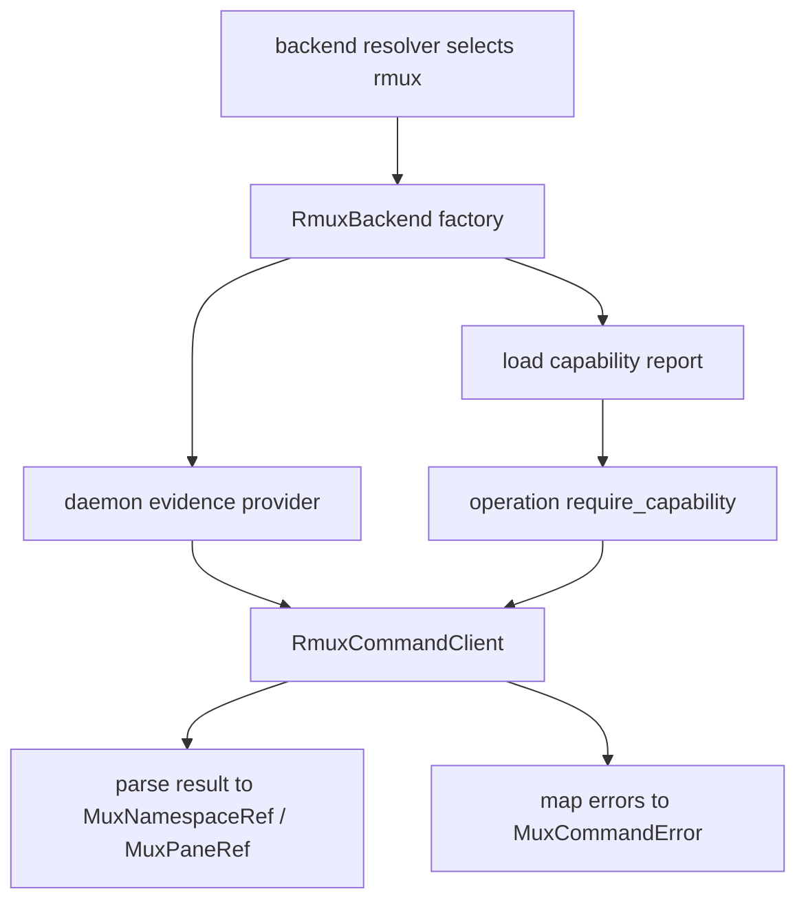

# rmux-backend-core feature design

## 0. 术语约定

| 术语 | 定义 | 防冲突结论 |
|---|---|---|
| RmuxBackend core | Rmux 对 `MuxBackend` / `ProjectNamespaceBackend` core 能力的 production adapter。 | 本 feature 只覆盖 namespace/session/window/pane/list/split/respawn/kill/title/user-option/style。 |
| core operation | 不含 provider input/output 的基础 pane/window/namespace 生命周期操作。 | `send-text`、`send-key`、`capture-pane`、`pipe-pane/logging` 留给 `rmux-send-capture-logging`。 |
| capability gate | 消费 route approval/capability report，required command unsupported 时 fail-fast。 | 不能静默 fallback 到 tmux，也不能把 required unsupported 当 partial success。 |
| Rmux command client | Rmux CLI/SDK 的薄封装，返回结构化 result / error evidence。 | 不向上暴露 tmux argv，也不让上层解析 Rmux stderr。 |
| backend evidence | namespace_ref、pane_ref、daemon evidence、command error evidence。 | ccbd authority 仍由前序契约维护。 |

代码事实：

- `lib/terminal_runtime/tmux_backend.py::TmuxBackend` 由 logs / pane query / pane mutation / control mixin 组成，仍通过 `_tmux_run()` 执行 tmux argv。
- `lib/terminal_runtime/tmux_backend_panes.py` 覆盖 `pane_exists()`、`list_panes_by_user_options()`、`describe_pane()`、`split_pane()`、`set_pane_title()`、`set_pane_user_option()`、`set_pane_style()`、`set_pane_identity()`。
- `lib/ccbd/services/project_namespace_runtime/backend.py` 仍直接做 session/window/list/split/kill-server 等 tmux helper。
- roadmap capability report 明确 `new-session`、`list-windows`、`new-window`、`rename-window`、`kill-window`、`move-pane`、`resize-pane`、`select-layout`、`swap-pane`、`split-window`、`list-panes`、`display-message`、`set-option`、`set-window-option`、`respawn-pane` 等 required commands 需要 supported。

## 1. 决策与约束

### 需求摘要

本 feature 设计 `RmuxBackend` core，使后续实现可以在 native Windows 上以 Rmux 完成 namespace、session、window、pane 和 presentation 基础操作，同时消费 capability report 并在 required command unsupported 时 fail-fast。

成功标准：

- 新增 `terminal_runtime/rmux_backend.py` 及分层模块，暴露 `RmuxBackend` production adapter。
- 实现 namespace/session/window/pane/list/split/respawn/kill/title/user-option/style core operations。
- 每个 operation 消费 `MuxNamespaceRef` / `MuxPaneRef`，返回 backend-neutral evidence，不要求 Rmux pane id 伪装成 tmux `%N`。
- capability gate 在 backend construction 或 operation 前校验 required commands；unsupported required 必须抛结构化 `MuxCommandError(category="unsupported")`。
- command error mapping 归一为 `MuxCommandError`，保留 Rmux command / endpoint / daemon evidence。
- 不触碰 send/capture/logging、foreground attach、ccbd lifecycle wiring、provider completion parser。

明确不做：

- 不实现 `send_text`、`send_key`、`capture_pane`、`pipe-pane`、logging 或大文本 paste。
- 不接入 `ccb start` / `ccbd` production namespace lifecycle；该项属于 `ccbd-rmux-namespace-lifecycle`。
- 不做 Rmux daemon discovery/start/cleanup 细节；只消费 `rmux-daemon-ownership-boundary` 的 evidence/client。
- 不修改 provider runtime session payload 或 provider env。
- 不把 unsupported required command fallback 到 tmux。

### 复杂度档位

- 行为兼容 = L3。core operation 必须和现有 tmux namespace/pane 语义对齐。
- 外部依赖 = true external。生产 adapter 调 Rmux CLI/SDK；测试使用 fake command client。
- 可测试性 = verified。每个 core operation 用 fake Rmux client / fixture 验证 command mapping、ref mapping 和 error mapping。

### 关键决策

1. 模块分层：

```text
lib/terminal_runtime/rmux_backend.py
lib/terminal_runtime/rmux_backend_runtime/client.py
lib/terminal_runtime/rmux_backend_runtime/capabilities.py
lib/terminal_runtime/rmux_backend_runtime/namespace.py
lib/terminal_runtime/rmux_backend_runtime/windows.py
lib/terminal_runtime/rmux_backend_runtime/panes.py
lib/terminal_runtime/rmux_backend_runtime/presentation.py
lib/terminal_runtime/rmux_backend_runtime/errors.py
```

2. `RmuxBackend` 只依赖 `RmuxCommandClient`、capability report 和 daemon evidence provider；上层不直接接触 Rmux command strings。
3. required capability 表固定从 route approval/capability report 投影；operation 级别再做 guard，避免 construction 通过但运行时调用 unsupported command。
4. `MuxPaneRef.pane_id` 保存 Rmux backend-local id；兼容 alias 由前序 session payload 负责，不在 core 里伪造 tmux pane id。
5. `set_pane_identity()` 是 title + user-options + style 的高阶 atomic helper；底层可分步执行，但失败要返回可诊断 partial evidence。

### Top 3 风险与缓解

1. **风险：capability report 与实现脱节。**  
   缓解：`capabilities.py` 提供 single source；每个 operation 入口调用 `require_capability("command")`。
2. **风险：把 Rmux command surface 设计成 tmux argv clone。**  
   缓解：public API 只接受 `MuxNamespaceRef` / `MuxPaneRef` 与 semantic args；command evidence 只在 errors/diagnostics 内。
3. **风险：core feature 偷做 send/capture/logging。**  
   缓解：明确不实现 IO；任何 `send-keys` / `capture-pane` / `pipe-pane` 只可出现在 capability report，不可作为本 feature operation。

### 非显然依赖

- `tmux-backend-contract-adapter` 提供同一 contract 下的 tmux adapter 对照。
- `windows-shell-log-builder` 后续服务 logging，不在本 feature 中消费。
- `provider-runtime-backend-session-contract` 已定义 canonical pane/namespace payload，本 feature 返回 refs 供后续 writer 消费。
- `rmux-daemon-ownership-boundary` 提供 daemon evidence；本 feature 不拥有 daemon authority。

## 2. 名词与编排

### 2.1 名词层

#### 现状

- `TmuxBackend` 和 ccbd namespace runtime 仍多处直接使用 tmux-specific method / `_tmux_run`。
- core layout/window/pane 能力和 command capability 没有 Rmux production adapter。
- route approval 已证明 required command 状态，但实现层还没有消费该报告。

#### 变化

新增 public adapter：

```python
class RmuxBackend:
    backend_impl = "rmux"

    def capabilities(self) -> MuxCapabilities: ...
    def prepare_server(self, namespace: MuxNamespaceRef | None = None, *, timeout_s: float | None = None) -> None: ...
    def create_session(self, *, session_name: str, project_root: str, window_name: str | None = None, terminal_size: tuple[int, int] | None = None) -> MuxNamespaceRef: ...
    def session_alive(self, namespace: MuxNamespaceRef, *, timeout_s: float | None = None) -> bool: ...
    def kill_namespace(self, namespace: MuxNamespaceRef) -> bool: ...
    def list_windows(self, namespace: MuxNamespaceRef) -> tuple[dict[str, object], ...]: ...
    def ensure_window(self, namespace: MuxNamespaceRef, *, window_name: str, project_root: str, select: bool = False) -> dict[str, object]: ...
    def kill_window(self, namespace: MuxNamespaceRef, *, target: str) -> None: ...
    def list_panes(self, namespace: MuxNamespaceRef, *, window_name: str | None = None) -> tuple[MuxPaneRef, ...]: ...
    def split_pane(self, parent: MuxPaneRef, *, direction: Literal["right", "bottom"], percent: int, cmd: str | None = None, cwd: str | None = None) -> MuxPaneRef: ...
    def respawn_pane(self, pane: MuxPaneRef, *, cmd: str, cwd: str | None = None, remain_on_exit: bool = True) -> None: ...
    def kill_pane(self, pane: MuxPaneRef) -> None: ...
    def set_pane_identity(self, pane: MuxPaneRef, *, title: str, user_options: dict[str, str], border_style: str | None = None, active_border_style: str | None = None) -> None: ...
```

Capability mapping：

| Operation | Required capabilities |
|---|---|
| `create_session` | `new-session`, `new-window` when window requested |
| `list_windows` | `list-windows` |
| `ensure_window` | `list-windows`, `new-window`, `rename-window` / `select-window` |
| `kill_window` | `kill-window` |
| `list_panes` | `list-panes` |
| `split_pane` | `split-window` |
| `respawn_pane` | `respawn-pane` |
| `kill_pane` | `kill-pane` or documented Rmux equivalent |
| `set_pane_identity` | `display-message`, `set-option`, `set-window-option`; style/title/user-options each guards its command |
| `reflow/select/move/swap` support used by later lifecycle | `resize-pane`, `select-layout`, `move-pane`, `swap-pane` |

Error mapping：

- unsupported required：`MuxCommandError(category="unsupported", backend_impl="rmux", operation=...)`
- missing pane/window/session：`category="not-found"`
- daemon/endpoint unreachable：`category="transient-unavailable"` with daemon evidence
- permission/ACL failure：`category="permission"`
- command nonzero / malformed output：`category="command-failed"` with raw evidence

##### Interface 设计检查

- Module：`terminal_runtime/rmux_backend.py` 是 production adapter entry。
- Interface：consumer 只看到 `MuxBackend` / `ProjectNamespaceBackend` methods 和 refs。
- Seam：capability gate、command mapping、ref mapping、error mapping 都在 Rmux backend boundary 内。
- Depth / locality：core operation 是必要深度；send/capture/logging 留给后续 item。
- Dependency strategy：true external + local-substitutable；fake command client 支持 unit tests。

### 2.2 编排层



流程级约束：

- construction：缺 capability report 或 required command unsupported 时 fail-fast，错误可诊断。
- operation：每个 operation 再做 command guard；动态 capability drift 不能静默通过。
- output parsing：Rmux command output 必须通过 parser 返回 refs / records；调用层不解析字符串。
- diagnostics：每个 error 包含 operation、capability、daemon evidence、endpoint、command evidence。
- compatibility：tmux path 不导入 Rmux module；Rmux path 不导入 `TmuxBackend`。

### 2.3 挂载点清单

- `lib/terminal_runtime/rmux_backend.py`：production backend entry。
- `lib/terminal_runtime/rmux_backend_runtime/client.py`：Rmux command client abstraction / fake injection seam。
- `lib/terminal_runtime/rmux_backend_runtime/capabilities.py`：capability report loader / guard。
- `lib/terminal_runtime/rmux_backend_runtime/namespace.py`：server/session/window operations。
- `lib/terminal_runtime/rmux_backend_runtime/panes.py`：pane list/split/respawn/kill operations。
- `lib/terminal_runtime/rmux_backend_runtime/presentation.py`：title/user-option/style operations。
- `lib/terminal_runtime/rmux_backend_runtime/errors.py`：`MuxCommandError` mapping。
- `test/test_rmux_backend_core.py`：fake client unit tests。

### 2.4 推进策略

1. **capability gate**：实现 capability report projection、required command guard 和 unsupported error mapping。  
   退出信号：unsupported required command 在 construction/operation 中都抛 `MuxCommandError(category="unsupported")`。
2. **command client seam**：实现 Rmux command client interface 和 fake client，所有 command evidence 只留在 diagnostics/error。  
   退出信号：unit tests 不需要真实 Rmux，也不 mock tmux argv。
3. **namespace/window core**：实现 prepare/create/session_alive/kill_namespace/list_windows/ensure_window/kill_window。  
   退出信号：fake client tests 验证 namespace/window refs、missing/unreachable errors。
4. **pane core**：实现 list_panes/split_pane/respawn_pane/kill_pane。  
   退出信号：fake client tests 验证 pane refs、direction/percent/cwd/cmd 映射和 errors。
5. **presentation core**：实现 set title、user options、style 和 `set_pane_identity()` orchestration。  
   退出信号：tests 断言 title/user-options/style 逐项 guarded，partial failure 有 diagnostics。
6. **compatibility guard**：确认 Rmux core 不导入 `TmuxBackend`，tmux path 不导入 Rmux module。  
   退出信号：import guard test + tmux regression 抽样通过。

### 2.5 结构健康度与微重构

##### 评估

- 文件级 — `terminal_runtime/tmux_backend.py`：不应塞 Rmux 分支；新增并行 adapter 更符合 SRP。
- 文件级 — `ccbd/services/project_namespace_runtime/backend.py`：当前 tmux policy 后续会接 `ProjectNamespaceBackend`，本 feature 不直接改 ccbd controller。
- 目录级 — `terminal_runtime/`：已有 tmux backend runtime 分层，新增 rmux_backend_runtime 目录可保持对称。

##### 结论：不做行为微重构

本 feature 是新增 adapter core；不搬迁现有 tmux helper，不接 ccbd production path。

## 3. 验收契约

### 3.1 关键场景清单

| ID | 输入 / 触发 | 期望可观察结果 | 证据类型 |
|---|---|---|---|
| AC-001 | capability report 缺失或 required unsupported | construction/operation fail-fast，抛 `MuxCommandError(category="unsupported")` | unit test |
| AC-002 | create/list/kill namespace/window | 返回 `MuxNamespaceRef` / window records，错误可诊断 | unit test |
| AC-003 | list/split/respawn/kill pane | 返回 `MuxPaneRef`，参数映射和 not-found/unreachable errors 可断言 | unit test |
| AC-004 | title/user-option/style/set_pane_identity | 每项 command guarded，partial failure 有 diagnostics | unit test |
| AC-005 | Rmux command nonzero / malformed output | 映射为 `MuxCommandError`，保留 daemon/endpoint/command evidence | unit test |
| AC-006 | unsupported IO operations | 本 feature 不提供 send/capture/logging production methods | import / diff guard |
| AC-007 | tmux compatibility | tmux backend tests 仍通过，tmux path 不导入 Rmux | regression / import guard |

### 3.2 明确不做的反向核对项

- 不应实现 send/capture/logging 或 provider completion parsing。
- 不应把 required unsupported command 静默降级或 fallback 到 tmux。
- 不应让 Rmux pane id 伪装成 tmux `%N`。
- 不应接入 `ccb start` / `ccbd` production lifecycle。
- 不应导入 `TmuxBackend` 到 Rmux backend core。
- 不应让上层解析 Rmux command output 或 stderr。

### 3.3 Acceptance Coverage Matrix

| Scenario | Covered By Step | Evidence Type | Command / Action | Core? |
|---|---|---|---|---|
| AC-001 capability fail-fast | S1 | unit test | `test/test_rmux_backend_core.py` | yes |
| AC-002 namespace/window | S3 | unit test | fake client namespace/window tests | yes |
| AC-003 pane core | S4 | unit test | fake client pane tests | yes |
| AC-004 presentation | S5 | unit test | fake client presentation tests | yes |
| AC-005 error mapping | S2-S5 | unit test | fake failure matrix | yes |
| AC-006 scope guard | S6 | import/diff guard | no send/capture/logging methods in core | yes |
| AC-007 tmux compatibility | S6 | regression | tmux backend tests | yes |

### 3.4 DoD Contract

| ID | 要求 | 证据 | 阻塞级别 |
|---|---|---|---|
| DOD-DESIGN-001 | design/checklist/review 完整，且对齐 roadmap item `rmux-backend-core` | design review | blocking |
| DOD-IMPL-001 | required unsupported capability fail-fast，不 fallback tmux | unit tests | blocking |
| DOD-IMPL-002 | namespace/window core 返回 backend-neutral refs / records | unit tests | blocking |
| DOD-IMPL-003 | pane core 返回 backend-neutral `MuxPaneRef`，不伪造 tmux pane id | unit tests | blocking |
| DOD-IMPL-004 | presentation core 覆盖 title/user-options/style，partial failure 可诊断 | unit tests | blocking |
| DOD-IMPL-005 | command errors 映射为 `MuxCommandError` 并保留 evidence | unit tests | blocking |
| DOD-IMPL-006 | 不实现 send/capture/logging，不接 ccbd production lifecycle | diff guard | blocking |
| DOD-IMPL-007 | tmux path 回归不漂移 | regression tests | blocking |
| DOD-REVIEW-001 | code review passed 且无 unresolved blocking | review report | blocking |
| DOD-QA-001 | QA 覆盖 capability、namespace/window、pane、presentation、errors、compat | QA report | blocking |
| DOD-ACCEPT-001 | acceptance 回写 roadmap item，并记录 unsupported required capability 策略 | acceptance report | blocking |

Validation Commands:

| ID | 命令 | 目的 | 核心性 | 失败处理 |
|---|---|---|---|---|
| CMD-001 | `python ".codestable/tools/validate-yaml.py" --file ".codestable/features/2026-07-20-rmux-backend-core/rmux-backend-core-checklist.yaml" --yaml-only` | checklist YAML 合法性 | core | fix-or-block |
| CMD-002 | `python ".codestable/tools/validate-yaml.py" --file ".codestable/roadmap/windows-rmux-native-backend/windows-rmux-native-backend-items.yaml"` | roadmap items 回写合法性 | core | fix-or-block |
| CMD-003 | `python -m pytest -q test/test_rmux_backend_core.py` | Rmux core capability / namespace / pane / presentation / error tests | core | fix-or-block |
| CMD-004 | `python -m pytest -q test/test_terminal_backend_selection.py test/test_v2_project_namespace_backend.py test/test_cli_runtime_launch_tmux_panes.py -k "tmux or backend or pane or namespace"` | tmux compatibility 抽样回归 | core | fix-or-block |
| CMD-005 | `python -m pytest -q test/test_rmux_backend_core_import_guard.py` | Rmux/tmux import boundary、scope guard | core | fix-or-block |

Required Artifacts：design、checklist、design-review、RmuxBackend core、fake command client tests、capability guard tests、namespace/window tests、pane tests、presentation tests、error mapping tests、import guard、items.yaml 回写。

### 3.5 自我批判结论

- 可证伪性：所有 core operation 都能通过 fake client 和 error fixtures 断言。
- 步骤原子性：capability、client、namespace/window、pane、presentation、compat guard 分离。
- 最弱依赖：capability gate 最容易漏；每个 operation 都必须 guard。
- 证据完整性：成功 / not-found / unsupported / unreachable / malformed output 都有测试入口。
- 交付物可核验性：acceptance 可从 module files、tests、import guard 和 capability failures 反查。
- 清洁度规则：不新增临时 TODO/FIXME、调试输出、注释掉代码、死 import；不复制 tmux argv parser。

## 4. 与项目级架构文档的关系

- 本 feature 消费 `mux-backend-contract` 的 `MuxBackend` / `ProjectNamespaceBackend` 语义。
- 本 feature 消费 route approval/capability report，落实 required unsupported fail-fast。
- 本 feature 为 `rmux-send-capture-logging` 提供 backend core 基础，但不实现 IO/logging。
- 本 feature 为 `ccbd-rmux-namespace-lifecycle` 提供 production backend adapter，但不接入 ccbd production path。
