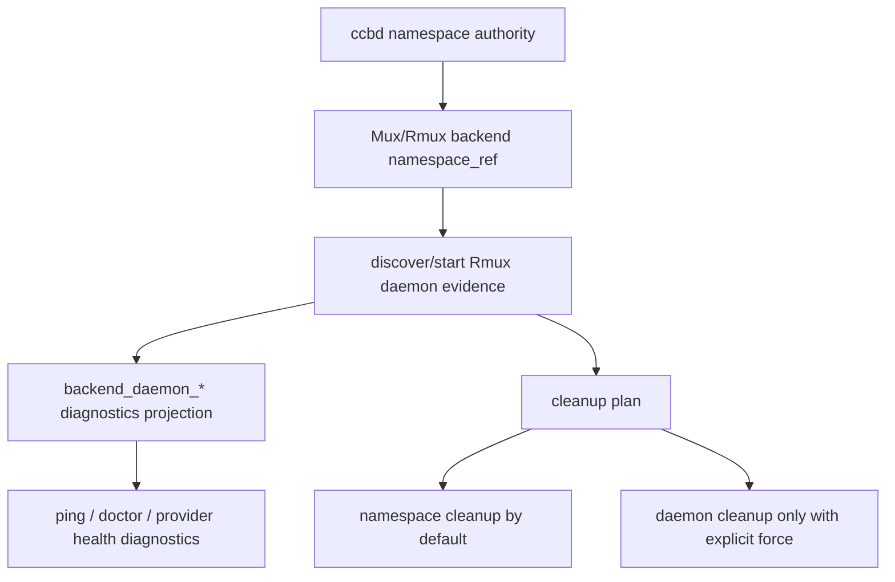

# rmux-daemon-ownership-boundary feature design

## 0. 术语约定

| 术语 | 定义 | 防冲突结论 |
|---|---|---|
| Rmux daemon | Rmux backend 所依赖的本机后台服务或共享 runtime 进程。 | 它只能是 backend evidence，不能成为 project authority。 |
| ccbd authority | 当前项目的 daemon lease、lifecycle、namespace state、runtime registry。 | authority 仍由 `ccbd` / `OwnershipGuard` / `ProjectNamespaceState` 维护。 |
| daemon evidence | discovery/start/health/crash/cleanup 产生的可诊断事实。 | 可写入 namespace / health / doctor payload，但不得决定项目归属。 |
| shared daemon | 一个 Rmux daemon 可能承载多个项目 namespace。 | 默认 cleanup 只能清理本项目 namespace，不杀共享 daemon。 |
| per-project cleanup | 基于 `namespace_ref` / `pane_ref` / backend tag 清理本项目资源。 | 与 daemon-wide shutdown 分离；只有 explicit force 才能触发 daemon-wide 动作。 |

代码事实：

- `lib/ccbd/services/ownership.py::OwnershipGuard` 基于 ccbd lease 的 pid、heartbeat、socket 判断 takeover；这是 project daemon authority。
- `lib/ccbd/keeper_runtime/loop.py` 负责 ccbd daemon restart / stale takeover；其 lifecycle 记录 `owner_daemon_instance_id`、`generation`、`namespace_epoch`。
- `lib/ccbd/start_flow.py` 仍直接注入 `TmuxBackend`、`cleanup_project_tmux_orphans_by_socket()` 和 tmux cleanup history。
- `lib/cli/services/tmux_project_cleanup.py` 通过 tmux socket 和 active panes 做 project orphan cleanup；没有 backend-neutral cleanup seam。
- `lib/provider_runtime/health.py::ProviderHealthSnapshot` 有 `diagnostics` dict，可承载 backend evidence，但没有 Rmux daemon typed contract。
- `lib/ccbd/services/health_assessment/provider_pane.py` 当前只在 `runtime_ref.startswith("tmux:")` 时做 tmux pane ownership 判定。

## 1. 决策与约束

### 需求摘要

本 feature 定义 Rmux daemon discovery、start、health、crash、cleanup 的边界和证据形状，使后续 `rmux-backend-core` 和 `ccbd-rmux-namespace-lifecycle` 可以诊断 shared daemon 与 per-project cleanup，同时不改变 `ccbd` 作为项目 authority 的事实。

成功标准：

- 新增 Rmux daemon evidence contract，字段覆盖 discovery source、daemon ref、endpoint、health、crash、cleanup scope。
- 明确 `ccbd` lease / lifecycle / namespace state 仍是 project authority，Rmux daemon pid / endpoint 不能替代它。
- shared daemon 与 per-project namespace cleanup 的边界可机械验证。
- start / discovery / health / crash / cleanup 的 diagnostics payload 有稳定字段。
- 后续 backend core 可消费 evidence，但本 feature 不实现 Rmux command / IPC。
- 现有 tmux cleanup / ccbd keeper / provider health 行为不漂移。

明确不做：

- 不实现 `RmuxBackend` core、send/capture/logging、layout 或 foreground attach。
- 不启动真实 Rmux daemon，不调用 Rmux CLI/SDK。
- 不改 ccbd control-plane transport，不引入 named pipe ACL。
- 不把 Rmux daemon 作为 ccbd lease holder、keeper 或 runtime registry owner。
- 不做 daemon-wide kill 的默认行为；只定义 explicit force 下的诊断边界。

### 复杂度档位

- ownership = deep。错误边界会导致跨项目误杀或错误 takeover。
- 兼容性 = L3。现有 tmux cleanup / ccbd keeper / health 路径必须保持。
- 可测试性 = verified。用 fake Rmux daemon evidence 和 fake cleanup adapter 验证，不依赖真实 Rmux。

### 关键决策

1. 新增 contract seam：`lib/terminal_runtime/rmux_daemon_contract.py`，定义 evidence datatypes，不实现 daemon 操作。
2. Rmux daemon evidence 示例：

```python
class RmuxDaemonRef(TypedDict):
    backend_impl: Literal["rmux"]
    daemon_id: str
    scope: Literal["shared", "project"]
    endpoint_kind: Literal["named_pipe", "tcp_loopback", "local_socket", "unknown"]
    endpoint_ref: str | None
    version: str | None

class RmuxDaemonEvidence(TypedDict):
    daemon_ref: RmuxDaemonRef
    discovery_source: Literal["namespace_state", "backend_probe", "start_result", "health_probe", "cleanup"]
    health: Literal["healthy", "starting", "missing", "unreachable", "crashed", "stale", "foreign", "unknown"]
    project_id: str | None
    namespace_id: str | None
    daemon_process_evidence: dict[str, object] | None
    capability_status: Literal["supported", "partial", "unsupported", "unknown"]
    crash_reason: str | None
    cleanup_scope: Literal["none", "namespace", "project", "daemon"]
    diagnostics: dict[str, object]

class RmuxCleanupPlan(TypedDict):
    cleanup_scope: Literal["namespace", "project", "daemon"]
    targets: list[dict[str, object]]
    daemon_action: Literal["leave_running", "shutdown"]
    force_daemon: bool
    force_reason: str | None
    ordered_steps: list[Literal["provider_job_evidence", "namespace_session", "daemon_cleanup", "diagnostics"]]
    status: Literal["planned", "completed", "partial", "failed", "skipped"]
    diagnostics: dict[str, object]
```

3. `authority` 不写进 Rmux daemon ref；authority 由 ccbd lifecycle / namespace state 外部提供，避免后续实现误把 daemon ref 当 lease。
4. `cleanup_scope="namespace"` 是默认安全路径；`cleanup_scope="daemon"` 只能由 explicit force 或上层 handoff 授权触发。
5. `ProjectNamespaceState` / ping / doctor 只投影 `backend_daemon_*` evidence 字段，不把它作为 lifecycle owner 字段。
6. `daemon_process_evidence` 只描述 Rmux daemon process observation；不得复用 `windows-job-object-runtime-evidence` 的 provider `ProcessRef`，也不得参与 provider kill eligibility。

### Top 3 风险与缓解

1. **风险：shared daemon 被当成本项目资源误杀。**  
   缓解：cleanup contract 强制区分 `namespace/project/daemon` scope；默认只清本项目 namespace。
2. **风险：Rmux daemon pid 变成 project authority。**  
   缓解：设计明确 ccbd lease / lifecycle 仍是 authority；daemon evidence 不参与 takeover。
3. **风险：health 和 crash 只表现为 pane dead，诊断缺失。**  
   缓解：backend health 输出拆分的 `backend_daemon_*` 字段、`backend_daemon_crash_reason`、`backend_daemon_version` 和 `backend_daemon_capability_status`，provider health diagnostics 可引用。

### 非显然依赖

- 依赖 `mux-backend-contract` 的 backend refs / diagnostics semantics。
- 依赖 `windows-namespace-ipc-schema` 的 `namespace_id` / `namespace_ipc_*` canonical 字段。
- 与 `windows-job-object-runtime-evidence` 区分：job evidence 是 provider process tree；本 feature 是 Rmux daemon evidence。
- 与 `ccbd-windows-process-liveness` 区分：后者修 ccbd pid liveness；本 feature 不改变 ccbd process liveness。

## 2. 名词与编排

### 2.1 名词层

#### 现状

- ccbd daemon ownership 已有 `OwnershipGuard`、keeper lifecycle、lease generation 和 `owner_daemon_instance_id`。
- tmux project cleanup 通过 tmux socket / active panes 做清理，没有表达 shared daemon。
- provider health snapshot 可放 diagnostics，但没有 daemon evidence typed schema。
- namespace state 目前只表达 project namespace，不表达 backend daemon evidence。

#### 变化

新增 Rmux daemon boundary contract：

```python
def discover_rmux_daemon(namespace_ref: dict[str, object]) -> RmuxDaemonEvidence: ...
def build_rmux_daemon_start_evidence(result: object) -> RmuxDaemonEvidence: ...
def assess_rmux_daemon(evidence: RmuxDaemonEvidence) -> RmuxDaemonEvidence: ...
def build_rmux_cleanup_plan(
    *, namespace_ref: dict[str, object], daemon: RmuxDaemonEvidence, force_daemon: bool = False
) -> RmuxCleanupPlan: ...
```

diagnostics projection 字段：

- `backend_daemon_impl="rmux"`
- `backend_daemon_id`
- `backend_daemon_scope`
- `backend_daemon_endpoint_kind`
- `backend_daemon_endpoint_ref`
- `backend_daemon_version`
- `backend_daemon_capability_status`
- `backend_daemon_health`
- `backend_daemon_discovery_source`
- `backend_daemon_crash_reason`
- `backend_daemon_cleanup_scope`
- `backend_daemon_action`

兼容规则：

- tmux backend 不需要 daemon evidence；现有 tmux cleanup history 保持。
- Rmux evidence 可进入 namespace state summary、ping payload、doctor payload、provider health diagnostics。
- evidence 缺失时 health 为 `unknown`，不能自动推导 ccbd unhealthy。
- `backend_daemon_endpoint_ref` 不进入 ccbd control-plane endpoint；它只描述 Rmux backend endpoint。
- version/capability 在 daemon evidence 中只作为 diagnostics；route approval / capability report 仍是 backend 是否可用的 gate，不由 daemon evidence 单独放行。
- cleanup plan 的 `ordered_steps` 固定表达 `provider_job_evidence -> namespace_session -> daemon_cleanup|leave_running -> diagnostics`；shared daemon 且 `force_daemon=False` 时 `daemon_action="leave_running"`，不得出现 daemon terminate target。

##### Interface 设计检查

- Module：`terminal_runtime/rmux_daemon_contract.py` 是 evidence contract；后续 Rmux implementation 另建 adapter。
- Interface：caller 只能消费 daemon evidence / cleanup plan，不能直接从 evidence 做 authority 决策。
- Seam：namespace lifecycle、backend health、doctor diagnostics、cleanup plan 都穿过同一 evidence contract。
- Depth / locality：只定义边界和证据，不提前实现 Rmux IPC。
- Dependency strategy：fake evidence + fake cleanup adapter 可测试。

### 2.2 编排层



流程级约束：

- discovery：发现 existing shared daemon 只生成 evidence，不创建 ccbd lease。
- start：启动结果写 `start_result` evidence；成功必须包含 daemon ref / endpoint / version / capability status，失败写 `health="unreachable"` 或 `health="crashed"` 并记录 diagnostics，不改 ccbd lifecycle owner。
- health：daemon unreachable 只降级 backend health / diagnostics；ccbd health 由 `OwnershipGuard` 继续判断。
- crash：crash evidence 可触发 namespace/runtime recovery 策略，但不能跳过 provider process/job evidence。
- cleanup：默认只针对 `namespace_id` / `pane_ref` / backend tag 清理；shared daemon 且无 force 时 cleanup plan 必须 `daemon_action="leave_running"`；daemon-wide cleanup 需要 explicit force 和 force reason。
- diagnostics：ping/doctor payload 使用 `backend_daemon_*` 前缀，避免和 ccbd `daemon_*` / `tmux_socket_path` 字段冲突。

### 2.3 挂载点清单

- `lib/terminal_runtime/rmux_daemon_contract.py`：删除后 Rmux daemon evidence 和 cleanup scope 无统一契约。
- `lib/ccbd/services/project_namespace_state_runtime/models.py` 或后续 namespace summary projection：删除后 diagnostics 无法从 namespace state 读取 backend daemon evidence。
- `lib/ccbd/handlers/ping_runtime/payloads.py` / doctor renderer：删除后用户无法区分 ccbd daemon 与 Rmux daemon。
- `lib/cli/services/tmux_project_cleanup.py` 的后续 backend-neutral replacement：删除后 per-project cleanup 仍绑定 tmux socket。
- `lib/provider_runtime/health.py` diagnostics：删除后 provider health 无法附带 backend daemon evidence。

### 2.4 推进策略

1. **daemon evidence contract**：定义 `RmuxDaemonRef`、`RmuxDaemonEvidence`、`RmuxCleanupPlan` 和 health/cleanup 枚举。  
   退出信号：contract tests 可构造 shared/project daemon、healthy/unreachable/crashed/stale evidence，并断言 `daemon_process_evidence` 不等同 provider `ProcessRef`。
2. **start result evidence**：定义 start 成功 / 失败 evidence，覆盖 daemon ref、endpoint、version、capability status、`unreachable|crashed` 映射和 diagnostics。  
   退出信号：start_result tests 证明启动成功和失败都不改变 `owner_daemon_instance_id` / lease generation。
3. **authority boundary projection**：在 design/implementation 中明确 evidence 到 namespace / ping / doctor 的 `backend_daemon_*` 投影，不写入 ccbd lease owner。  
   退出信号：tests 断言 Rmux daemon fields 不改变 `owner_daemon_instance_id` / lease generation。
4. **cleanup scope contract**：定义 namespace/project/daemon cleanup plan，默认 `namespace`，daemon-wide 必须 force。  
   退出信号：fake cleanup tests 证明 shared daemon 下只清本项目 namespace，`daemon_action="leave_running"` 且无 daemon terminate target。
5. **health/crash diagnostics**：backend health / provider health diagnostics 可携带 daemon health、crash reason、discovery source、version、capability status。  
   退出信号：doctor / health fixture 可区分 `ccbd healthy + rmux daemon crashed`。
6. **tmux compatibility guard**：现有 tmux cleanup、keeper、provider pane health tests 不因新增 contract 漂移。  
   退出信号：tmux cleanup / ccbd keeper / provider health 抽样回归通过。

### 2.5 结构健康度与微重构

##### 评估

- 文件级 — `ccbd/services/ownership.py`：职责是 ccbd lease authority，不应塞入 Rmux daemon evidence。
- 文件级 — `ccbd/keeper_runtime/loop.py`：职责是 ccbd daemon reconciliation，不应把 Rmux daemon crash 当 ccbd stale。
- 文件级 — `cli/services/tmux_project_cleanup.py`：当前 tmux-specific；后续需要 backend-neutral cleanup seam，但本 feature 只定义 contract。
- 目录级 — `terminal_runtime/`：已有 backend contract 语义，新增 `rmux_daemon_contract.py` 符合 backend evidence 归属。

##### 结论：不做行为微重构

本 feature 只新增 contract 与 diagnostics projection 设计；不搬迁 tmux cleanup 代码，不改 keeper 行为。

## 3. 验收契约

### 3.1 关键场景清单

| ID | 输入 / 触发 | 期望可观察结果 | 证据类型 |
|---|---|---|---|
| AC-001 | 构造 shared Rmux daemon evidence | 包含 daemon ref、endpoint、health、discovery_source，且不含 ccbd lease owner | unit test |
| AC-002 | start_result 成功 / 失败 | 成功包含 endpoint/version/capability status；失败映射 `unreachable|crashed`；均不改变 ccbd owner / lease generation | unit / regression |
| AC-003 | existing shared daemon 被 discovery 命中 | 只记录 evidence，不改变 `owner_daemon_instance_id` / lease generation | unit / regression |
| AC-004 | cleanup plan 默认执行 | scope 为 `namespace`，`daemon_action="leave_running"`，只清本项目 namespace / pane refs，不杀 daemon | unit test |
| AC-005 | cleanup plan explicit force | scope 才允许为 `daemon`，diagnostics 记录 force reason，ordered steps 包含 daemon cleanup | unit test |
| AC-006 | Rmux daemon crashed / unreachable | ping/doctor/provider health diagnostics 显示 `backend_daemon_health`、version/capability 和 crash reason，ccbd daemon health 不被误标 dead | unit / regression |
| AC-007 | tmux backend path | 现有 tmux cleanup / ccbd keeper / provider pane health 行为不变 | regression |
| AC-008 | diagnostics payload | `backend_daemon_*` 字段不覆盖 ccbd `daemon_*` / namespace `namespace_*` 字段 | unit test |

### 3.2 明确不做的反向核对项

- 不应让 Rmux daemon pid / endpoint 成为 ccbd lease holder。
- 不应把 shared daemon cleanup 作为默认 project cleanup。
- 不应在 discovery 失败时自动标记 ccbd unhealthy。
- 不应实现 Rmux backend command / IPC。
- 不应删除或改写现有 tmux cleanup history。
- 不应让 `backend_daemon_*` 字段覆盖 ccbd `daemon_*` 或 namespace canonical 字段。

### 3.3 Acceptance Coverage Matrix

| Scenario | Covered By Step | Evidence Type | Command / Action | Core? |
|---|---|---|---|---|
| AC-001 evidence contract | S1 | unit test | `test/test_rmux_daemon_ownership_boundary.py` | yes |
| AC-002 start_result evidence | S2 | unit/regression | start success/failure fixture tests | yes |
| AC-003 authority boundary | S2, S3 | unit/regression | namespace/lease fixture tests | yes |
| AC-004 namespace cleanup default | S4 | unit test | fake cleanup plan tests | yes |
| AC-005 force daemon cleanup | S4 | unit test | fake cleanup force tests | yes |
| AC-006 health/crash diagnostics | S5 | unit/regression | doctor / provider health diagnostics fixture | yes |
| AC-007 tmux compatibility | S6 | regression | tmux cleanup / keeper / provider health tests | yes |
| AC-008 diagnostics no-clobber | S3, S5 | unit test | payload no-clobber tests | yes |

### 3.4 DoD Contract

| ID | 要求 | 证据 | 阻塞级别 |
|---|---|---|---|
| DOD-DESIGN-001 | design/checklist/review 完整，且对齐 roadmap item `rmux-daemon-ownership-boundary` | design review | blocking |
| DOD-IMPL-001 | Rmux daemon evidence datatypes 覆盖 discovery/start/health/crash/cleanup | unit tests | blocking |
| DOD-IMPL-002 | start_result 成功/失败 evidence 覆盖 endpoint/version/capability/unreachable/crashed，且不改 ccbd owner | unit / regression tests | blocking |
| DOD-IMPL-003 | Rmux daemon evidence 不参与 ccbd lease / lifecycle owner 决策 | regression tests | blocking |
| DOD-IMPL-004 | cleanup plan 默认 namespace/project scope、`daemon_action=leave_running`，daemon-wide 仅 explicit force | unit tests | blocking |
| DOD-IMPL-005 | diagnostics 使用 `backend_daemon_*` 前缀且不覆盖 ccbd / namespace 字段 | unit tests | blocking |
| DOD-IMPL-006 | tmux cleanup / ccbd keeper / provider pane health 行为不漂移 | regression tests | blocking |
| DOD-REVIEW-001 | code review passed 且无 unresolved blocking | review report | blocking |
| DOD-QA-001 | QA 覆盖 evidence、authority boundary、cleanup scope、health/crash diagnostics、tmux compatibility | QA report | blocking |
| DOD-ACCEPT-001 | acceptance 回写 roadmap item，并记录 shared daemon cleanup 边界 | acceptance report | blocking |

Validation Commands:

| ID | 命令 | 目的 | 核心性 | 失败处理 |
|---|---|---|---|---|
| CMD-001 | `python ".codestable/tools/validate-yaml.py" --file ".codestable/features/2026-07-20-rmux-daemon-ownership-boundary/rmux-daemon-ownership-boundary-checklist.yaml" --yaml-only` | checklist YAML 合法性 | core | fix-or-block |
| CMD-002 | `python ".codestable/tools/validate-yaml.py" --file ".codestable/roadmap/windows-rmux-native-backend/windows-rmux-native-backend-items.yaml"` | roadmap items 回写合法性 | core | fix-or-block |
| CMD-003 | `python -m pytest -q test/test_rmux_daemon_ownership_boundary.py` | daemon evidence / cleanup scope / no-clobber contract | core | fix-or-block |
| CMD-004 | `python -m pytest -q test/test_v2_tmux_project_cleanup.py test/test_ccbd_startup_fence_app.py test/test_ccbd_service_graph.py -k "cleanup or keeper or daemon or ownership"` | tmux cleanup 与 ccbd daemon authority 回归 | core | fix-or-block |
| CMD-005 | `python -m pytest -q test/test_ccbd_health_monitor_rebind.py test/test_v2_ccbd_socket.py -k "health or doctor or namespace or daemon"` | health / doctor diagnostics 回归 | core | fix-or-block |

Required Artifacts：design、checklist、design-review、daemon evidence contract、cleanup scope tests、authority boundary tests、diagnostics no-clobber tests、tmux compatibility regression、items.yaml 回写。

### 3.5 自我批判结论

- 可证伪性：核心边界可用 fake evidence / fake cleanup / payload no-clobber tests 验证。
- 步骤原子性：evidence、authority projection、cleanup scope、health diagnostics、compat regression 分离。
- 最弱依赖：shared daemon cleanup 最容易误杀；设计把 daemon-wide cleanup 设为 explicit force。
- 证据完整性：start/discovery/health/crash/cleanup 都有 diagnostics 字段。
- 交付物可核验性：acceptance 可从 contract、payload、cleanup plan、regression test 反查。
- 清洁度规则：不新增临时 TODO/FIXME、调试输出、注释掉代码、死 import；不提前实现 Rmux IPC。

## 4. 与项目级架构文档的关系

- 本 feature 消费 `mux-backend-contract` 的 backend ref / diagnostics 语义。
- 本 feature 消费 `windows-namespace-ipc-schema` 的 namespace canonical 字段。
- 本 feature 为 `rmux-backend-core` 提供 daemon evidence / cleanup boundary 输入。
- 本 feature 为 `ccbd-rmux-namespace-lifecycle` 和 `rmux-supervision-recovery` 提供 shared daemon 与 per-project cleanup 的可诊断边界。
