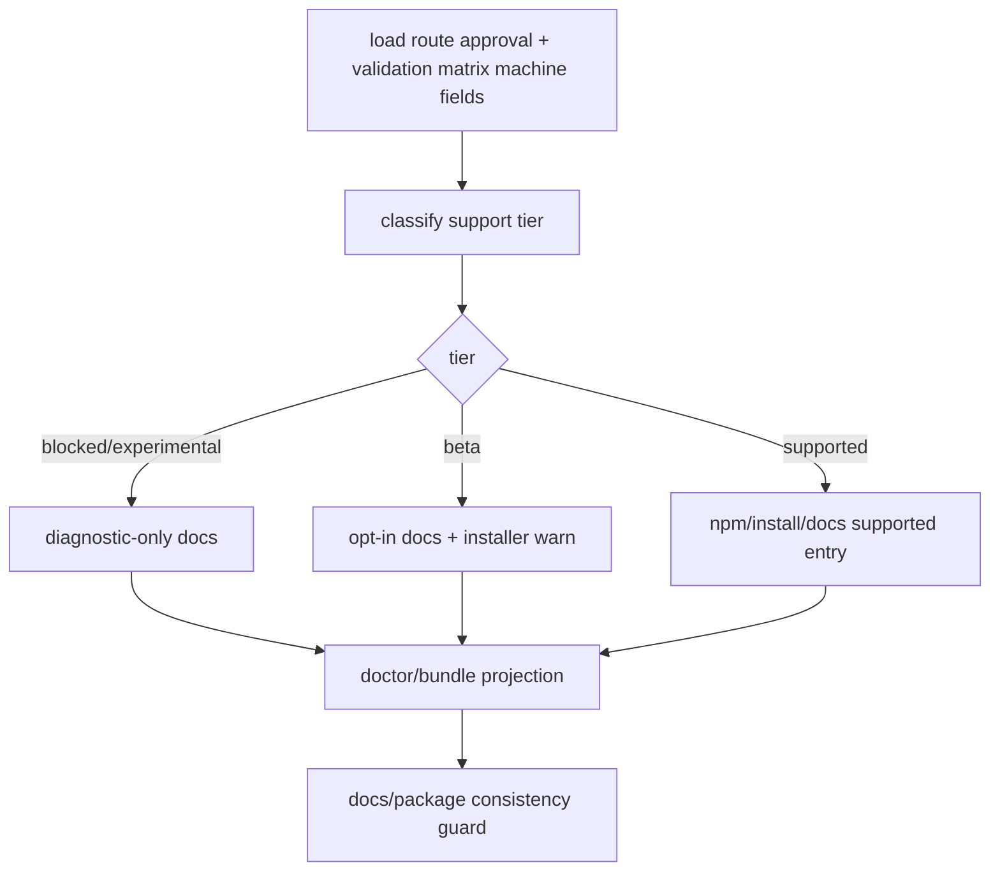

# rmux-packaging-docs-contracts feature design

## 0. 术语约定

| 术语 | 定义 | 防冲突结论 |
|---|---|---|
| support tier | Windows Rmux 对用户呈现的支持档：`blocked`、`experimental`、`beta`、`supported`。 | `blocked` 是正式枚举，表示 route/capability/validation 证据阻止启用；由 validation matrix / route approval / packaging gate 决定，不由 README 文案单独宣布。 |
| npm entry | `npm install -g @seemseam/ccb` 路线及 `package.json` metadata / postinstall。 | 当前 `package.json.os` 只有 linux/darwin，加入 `win32` 必须有验证证据。 |
| local install entry | `powershell -ExecutionPolicy Bypass -File .\install.ps1 install`。 | 当前可在 native Windows 安装 CCB，但不等于 Rmux backend 已受支持。 |
| Rmux prerequisite | 用户侧需要安装/发现的 rmux CLI/full helper/daemon 能力。 | 需要以 doctor/diagnostics 可验证方式表达，不在安装脚本里静默下载未知第三方。 |
| docs contract | README、install docs、diagnostics docs、developer contract 中对 backend、支持状态、故障处理的承诺。 | 必须和 package/install/doctor 输出一致。 |

仓库事实：

- `package.json` 包名为 `@seemseam/ccb`，`os` 当前为 `["linux", "darwin"]`，`scripts.pack:check` 为 `npm pack --dry-run`。
- `install.ps1` 支持 native Windows 安装，提示 `ccb/ask/ping/pend` 必须与 provider 在同一环境运行，但没有 rmux prerequisite / backend support tier。
- `install.sh` 是 Linux/macOS/WSL 路线，包含 tmux dependency hint 和 WSL/native environment confirmation。
- `README.md` npm-first，安装命令为 `npm install -g @seemseam/ccb`；release notes 当前声明 Linux、macOS、npm、Android artifact 同步。
- roadmap 要求本 item 区分 Windows npm 分发与 `install.ps1` 本地安装，包含用户安装说明、diagnostics bundle 字段、README/contract 同步。
- 前序 `rmux-windows-validation-matrix` 规定 full pass 依赖 native Windows true-host transcript；本 item 不得绕过该 gate 宣布 supported。

## 1. 决策与约束

### 需求摘要

本 feature 在 Rmux 后端实现和验证矩阵完成后，收口用户可见安装、打包、诊断和文档契约：明确 Windows Rmux 是 experimental、beta 还是 supported；决定 npm 是否加入 `win32`、`install.ps1` 是否提示/检测 rmux；同步 README、安装文档、doctor/diagnostics bundle 和 release contract。

成功标准：

- 支持档由 `rmux-route-approval`、`rmux-windows-validation-matrix` 的机器字段、local install smoke 和可选 npm smoke 共同决定，不能只靠文档宣布。
- Windows npm 分发与 `install.ps1` 本地安装分别有前置条件、失败语义、诊断输出和回退说明。
- `doctor` / diagnostics bundle 能展示 backend selection、rmux 可执行/版本/capability、support tier、安装入口、validation evidence ref。
- README / docs 明确说明 Rmux opt-in、beta/experimental/supported 状态、常见失败、如何回到 tmux/WSL 路线。
- package metadata、install scripts、docs、diagnostics contract 之间无互相矛盾的承诺。

明确不做：

- 不重新实现 Rmux backend、Windows validation matrix、ccbd transport、provider parser 或 supervision recovery。
- 不自动下载或安装 rmux，除非 owner 在实现阶段明确批准第三方安装策略；默认只检测并给出 actionable hint。
- 不发布 npm、push release、创建 tag、上传 artifact。
- 不把 Windows Rmux 设为全平台默认 backend。
- 不把未完成 full validation 的路线描述为 supported。

### 支持档决策表

| 输入证据 | package/install/docs 允许状态 | 不允许 |
|---|---|---|
| route approval 缺失或 rejected | `experimental` hidden/diagnostic-only；docs 只说明不可用原因 | 加入 npm `win32`、supported 文案 |
| capability gate 有 required blocking gap | `experimental` 或 `blocked` diagnostics | install.ps1 推荐启用 |
| full-chain smoke passed，但 validation matrix full incomplete | `beta` opt-in；install.ps1 可提示手工 rmux prerequisite；npm `win32` 需 owner 决策 | supported / default |
| validation matrix full pass + local install smoke pass + docs/diagnostics consistency pass | `supported` opt-in for install.ps1/source；可考虑 npm `win32` | 默认替代 tmux |
| validation matrix full pass + npm gate smoke pass + Windows artifact strategy approved | `supported` opt-in for npm | 默认替代 tmux |
| provider blackbox failure 仅为 auth/credential | support tier 不因 auth failure 降级，但 docs 必须说明 provider 登录前置 | 把 provider auth 归咎 rmux |

### 关键决策

1. Packaging support projection：

```python
class RmuxPackagingSupport(TypedDict):
    support_tier: Literal["experimental", "beta", "supported", "blocked"]
    install_entry: Literal["npm", "install_ps1", "source", "diagnostic_only"]
    windows_npm_enabled: bool
    install_ps1_rmux_check: Literal["detect_only", "warn", "fail_fast"]
    rmux_prerequisite_status: Literal["missing", "partial", "ok", "unknown"]
    selection_scope: Literal["subset", "full", "none"]
    selected_cases_status: Literal["pass", "incomplete", "failed", "missing"]
    full_matrix_status: Literal["pass", "incomplete", "failed", "missing"]
    true_host_core_rows_observed: bool
    validation_ref: str | None
    route_approval_ref: str | None
    package_gate_ref: str | None
    docs_consistency_ref: str | None
    fallback_guidance: str
```

2. Projection owner：
   - 生产 owner 必须是单一机器可读投影，不允许 README、installer、doctor、package 各自手写 tier 常量。候选落点为 `lib/terminal_runtime/rmux_packaging_support.py` 或 `lib/diagnostics/rmux_packaging_support.py`；实现阶段可按现有模块边界微调，但必须保持一个 owner。
   - 输入 refs：route approval artifact、capability report、validation matrix report (`selection_scope`、`selected_cases_status`、`full_matrix_status`、true-host/manual core row summary)、local install smoke result、npm gate result。
   - 输出 schema：`RmuxPackagingSupport`，由 installer message tests、doctor/bundle snapshots、docs consistency tests 和 package gate tests 消费。
   - 错误模式：缺输入 ref、字段未知、subset 冒充 full、true-host rows missing 时 fail-closed；最高只能 beta 或 experimental，不得 supported。
3. validation matrix gate：
   - `supported` 只能接受 `selection_scope=full`、`full_matrix_status=pass`、true-host/manual core rows observed、无 `missing_evidence` / `test_design_failure` / `upstream_pending` core row。
   - `selection_scope=subset` 或 `selected_cases_status=pass` 只能证明 CI subset；不能打开 supported 或 npm `win32`。
   - validation ref 必须指向 report JSON 或 acceptance evidence pack 中的机器字段，不接受人读摘要。
4. npm vs install.ps1：
   - npm `win32` 只能在 support tier 至少 beta 且 npm gate 通过后加入；硬条件包括 `bin/ccb-npm-install.js` 的 `artifactForHost()` 支持 win32、Windows artifact/checksum 策略、postinstall tests、package `files` 文档分发策略或版本化 GitHub docs 链接。
   - `install.ps1` 可在 beta 前增加 diagnostic-only rmux hint，但不得默认启用 rmux 或把缺 rmux 当 CCB 安装失败，除非 support tier=supported 且 owner 批准 `fail_fast`。
   - `install.sh` 保持 tmux/WSL 路线，不为 native Windows Rmux 增加行为。
   - `install_ps1_rmux_check=detect_only` 表示检测并报告但不影响安装；`warn` 表示提示用户但继续；`fail_fast` 表示阻止启用 Rmux backend 或阻止 supported install path。
5. Diagnostics contract：
   - `doctor` / bundle 输出固定字段：`mux_backend_impl`、`mux_backend_source`、`rmux_support_tier`、`rmux_version`、`rmux_capability_status`、`rmux_validation_ref`、`windows_install_entry`、`fallback_guidance`。
   - diagnostics 不输出 token、provider credential、TCP token、用户 home secret。
6. Docs consistency gate：
   - README、install docs、diagnostics docs、release notes 中 support tier 字样必须一致。
   - 若 support tier=beta，必须包含“opt-in”、“known limitations”、“validation evidence required”、“fallback”四类段落。
   - 若 npm 未启用 win32，README 不得把 npm 作为 native Windows Rmux 安装入口。
   - `rg` 只作为人工辅助；core gate 必须是 parser/snapshot test，检查允许词汇、入口映射、support tier 单一来源、release note 不写未来承诺。

### Top 3 风险与缓解

1. **风险：未验证完成却宣称 supported。**  
   缓解：支持档决策表绑定 validation matrix full pass；scope guard 检查 unsupported wording。
2. **风险：npm 与 install.ps1 承诺不一致。**  
   缓解：support projection 同时驱动 package metadata、installer messaging、doctor output、README 文案。
3. **风险：installer 擅自下载/启用 rmux 造成供应链和环境风险。**  
   缓解：默认只检测和提示；自动安装需要单独 owner 授权和 checksum/source 策略。

### 非显然依赖与关键假设

- 依赖 `rmux-windows-validation-matrix` 输出 full/subset status 和 true-host transcript ref。
- 依赖 backend resolver/diagnostics 已能报告 rmux selection reason。
- 依赖 Rmux capability gate 记录版本下限和 required/partial gaps。
- 假设 native Windows 用户可选择 `install.ps1` 源码/本地安装；npm win32 是独立发布决策，不自动成立。

## 2. 名词与编排

### 2.1 名词层

#### 现状

- package metadata 只发布 linux/darwin；README npm-first 会让 Windows npm 文案天然高风险。
- `install.ps1` 负责 CCB native Windows 安装和 provider 同环境提示，但未表达 mux backend prerequisite。
- diagnostics docs 已有 ccbd/diagnostics contract，但未包含 rmux support tier 和 validation evidence ref。
- roadmap 已把 packaging/docs 放在 validation matrix 之后，说明它是收口项。

#### 变化

新增或改造候选契约：

```text
docs/plantree/plans/windows-rmux-native-backend/topics/rmux-packaging-support-contract.md
docs/plantree/plans/windows-rmux-native-backend/topics/rmux-user-install-runbook.md
docs/ccbd-diagnostics-contract.md
README.md / README/*.md
package.json
install.ps1
test/test_rmux_packaging_docs_contracts.py
```

Interface 设计检查：

- Module：packaging support projection owned by one support module/artifact，是 install/docs/diagnostics/package 的共享输入。
- Interface：installer、doctor、README 都消费同一 support tier，不各自发明状态。
- Seam：npm entry 与 install.ps1 entry 分开建模。
- Depth / locality：medium/deep；改动多是文档和包装，但错误承诺会直接影响用户安装。
- Dependency strategy：evidence-backed；测试解析 package/docs/diagnostics snapshots。

### 2.2 编排层



流程级约束：

- support tier classifier fail-closed：缺 validation ref 时最高只能 beta，缺 route approval 时最高 experimental/blocked；subset/incomplete/missing/upstream_pending 不得 supported。
- package metadata 改动必须和 packaging smoke 同步；`package.json.os` 加 `win32` 不是文案改动。
- install.ps1 对 rmux 的默认行为必须可预测：`detect_only` / `warn` / `fail_fast` 三选一。
- docs 必须显示 fallback：Linux/macOS/WSL tmux 路线、显式关闭 rmux、诊断命令。
- release note 只记录已实现支持档，不写未来承诺。

### 2.3 挂载点清单

- `package.json`：`os`、keywords、files、pack check；只有达到 gate 才允许改 `win32`。
- `bin/ccb-npm-install.js` / npm runner tests：若启用 Windows npm，必须验证 postinstall 行为。
- `install.ps1`：native Windows rmux prerequisite detect/warn/fail-fast 文案。
- `README.md` / `README/*.md`：用户入口、support tier、opt-in、fallback。
- `docs/ccbd-diagnostics-contract.md`、developer/user guide diagnostics 章节：bundle/doctor 字段。
- Windows Rmux plan topics：support contract、install runbook。
- tests：package metadata guard、installer message snapshot、docs consistency, diagnostics field snapshot。
- support projection owner：新增 production module 或机器可读 artifact，统一产出 `RmuxPackagingSupport`。

### 2.4 推进策略

1. **support projection owner + classifier**：从 route approval、capability、validation matrix 机器字段、local install smoke、可选 npm gate 计算 support projection。  
   退出信号：缺证据 fail closed；只有 `selection_scope=full` + `full_matrix_status=pass` + true-host/manual core rows observed 才能输出 supported。
2. **diagnostics projection**：doctor/bundle 增加 rmux support/install/validation 字段。  
   退出信号：snapshot 覆盖 experimental/beta/supported/blocked。
3. **install.ps1 contract**：增加 rmux prerequisite detect/warn/fail-fast 行为和同环境说明。  
   退出信号：PowerShell installer tests 覆盖 missing/partial/ok，不自动下载 rmux。
4. **npm packaging gate**：决定是否加入 win32；若不加入，README 明确 native Windows 使用 install.ps1/source route。  
   退出信号：若启用 npm，`artifactForHost` win32、Windows artifact/checksum、postinstall tests、package files/docs strategy、`npm run pack:check` 全部通过；若不启用 npm，落 no-change rationale。
5. **README/docs sync**：同步 README、install runbook、diagnostics contract、support contract。  
   退出信号：parser/snapshot docs consistency test 不存在 beta/supported 冲突文案、入口映射冲突或 release note 未来承诺。
6. **fallback and troubleshooting**：写清 route approval failed、rmux missing、capability partial、provider auth failure、validation incomplete 的诊断和回退。  
   退出信号：docs grep/snapshot 覆盖每类 failure reason。
7. **release contract guard**：禁止发布、tag、push、release upload；只准备可审 diff。  
   退出信号：scope guard 证明没有 release artifact 或 remote operation。
8. **acceptance evidence pack**：汇总 package/install/docs/doctor/validation refs，作为 supported/beta 判定输入。  
   退出信号：机器可读索引含 `route_approval_ref`、`validation_report_ref`、`full_matrix_status`、`package_gate_ref`、`docs_consistency_ref`、`final_support_tier`。

### 2.5 结构健康度与微重构

##### 评估

- 文件级：`README.md` release notes 已长，Rmux 入口应短而指向 runbook，不塞长 troubleshooting。
- 文件级：`install.ps1` 已大，rmux detection 逻辑应保持小函数，避免和 provider install/bootstrap 混杂。
- 文件级：`package.json` 改动影响发布面，必须由 gate 控制。
- 目录级：Windows Rmux plan topics 可承载长文档；公开 docs 只放稳定承诺。

##### 结论：新增 support contract 文档，生产文件只做最小同步

实现时优先新增/更新专项 contract 和 tests，再把 README/install/diagnostics 同步为短入口。若发现 install.ps1 需要较多 rmux detection 逻辑，放入小 helper 函数，不重构整个 installer。

## 3. 验收契约

### 3.1 关键场景清单

| ID | 输入 / 触发 | 期望可观察结果 | 证据类型 |
|---|---|---|---|
| AC-001 | validation matrix 缺 `selection_scope=full` + `full_matrix_status=pass` + true-host/manual core rows | support tier 最高 beta，不能 supported | unit |
| AC-002 | route approval rejected / capability blocking gap | docs/doctor 显示 blocked/experimental，installer 不推荐启用 | unit/snapshot |
| AC-003 | beta opt-in | install.ps1 warn/detect rmux，README 明确 beta + fallback | snapshot |
| AC-004 | supported gate satisfied | support projection、package/install/docs/diagnostics 可一致声明 supported opt-in | unit/snapshot |
| AC-005 | npm win32 未启用 | README 不把 npm 当 native Windows Rmux 入口 | docs guard |
| AC-006 | npm win32 启用 | package metadata、artifactForHost win32、artifact/checksum strategy、postinstall、pack check、docs 同步 | pack/test |
| AC-007 | diagnostics bundle | 输出 rmux support/version/capability/validation/install_entry/fallback 字段 | snapshot |
| AC-008 | provider auth failure | docs/doctor 将其归为 provider 前置，不降级 rmux support tier | snapshot |
| AC-009 | release safety | 无 commit/push/tag/publish/release upload | guard |

### 3.2 明确不做的反向核对项

- 不应自动安装第三方 rmux。
- 不应在 validation matrix full pass 前写 supported。
- 不应在 npm 未启用 win32 时推荐 native Windows npm 安装 Rmux 路线。
- 不应修改 Linux/macOS tmux 默认路线。
- 不应执行或设计自动发布动作。

### 3.3 Acceptance Coverage Matrix

| Scenario | Covered By Step | Evidence Type | Command / Action | Core? |
|---|---|---|---|---|
| AC-001 validation gate | S1 | unit | support projection classifier tests | yes |
| AC-002 blocked/experimental | S1,S2,S6 | unit/snapshot | diagnostics/docs snapshots | yes |
| AC-003 beta opt-in | S3,S5,S6 | snapshot | install.ps1 + README snapshots | yes |
| AC-004 supported opt-in | S1,S4,S5 | unit/snapshot | support projection tests | yes |
| AC-005 npm win32 absent | S4,S5 | docs guard | README/package consistency | yes |
| AC-006 npm win32 present | S4 | pack/test | npm gate tests + `npm run pack:check` | conditional |
| AC-007 diagnostics fields | S2 | snapshot | doctor/bundle tests | yes |
| AC-008 provider auth classification | S6 | snapshot | troubleshooting docs/doctor | yes |
| AC-009 release safety | S7 | guard | no publish/tag/push artifact | yes |

### 3.4 DoD Contract

| ID | 要求 | 证据 | 阻塞级别 |
|---|---|---|---|
| DOD-DESIGN-001 | design/checklist/review 完整，且对齐 roadmap item `rmux-packaging-docs-contracts` | design review | blocking |
| DOD-IMPL-001 | support projection owner/classifier 绑定 route/capability/validation machine fields/local install/npm evidence | unit tests | blocking |
| DOD-IMPL-002 | install.ps1 rmux behavior 明确为 detect_only/warn/fail_fast，且默认不自动下载 | tests/snapshot | blocking |
| DOD-IMPL-003 | npm win32 gate 覆盖 package metadata、artifactForHost win32、artifact/checksum strategy、postinstall 和 docs 分发策略 | package/docs tests | blocking |
| DOD-IMPL-004 | diagnostics bundle/doctor 输出 rmux support/install/validation 字段 | snapshot | blocking |
| DOD-IMPL-005 | README/docs/support contract parser/snapshot gate 同步，无 beta/supported/entry/release-note 冲突 | docs guard | blocking |
| DOD-IMPL-006 | failure/troubleshooting 覆盖 route/capability/rmux missing/provider auth/validation incomplete | docs snapshot | blocking |
| DOD-IMPL-007 | 不执行发布、tag、push、npm publish、release upload | guard | blocking |
| DOD-REVIEW-001 | code review passed 且无 unresolved blocking | review report | blocking |
| DOD-QA-001 | QA 覆盖 package/install/docs/diagnostics consistency 与 pack check | QA report | blocking |
| DOD-ACCEPT-001 | acceptance 明确最终 support tier，并回写 roadmap item | acceptance report | blocking |

Validation Commands:

| ID | 命令 | 目的 | 核心性 | 失败处理 |
|---|---|---|---|---|
| CMD-001 | `python ".codestable/tools/validate-yaml.py" --file ".codestable/features/2026-07-20-rmux-packaging-docs-contracts/rmux-packaging-docs-contracts-checklist.yaml" --yaml-only` | checklist YAML 合法性 | core | fix-or-block |
| CMD-002 | `python ".codestable/tools/validate-yaml.py" --file ".codestable/roadmap/windows-rmux-native-backend/windows-rmux-native-backend-items.yaml"` | roadmap items 回写合法性 | core | fix-or-block |
| CMD-003 | `python -m pytest -q test/test_rmux_packaging_docs_contracts.py` | support projection、validation machine fields、docs/package consistency（新增测试） | core | fix-or-block |
| CMD-004 | `python -m pytest -q test/test_install_windows_rmux_contract.py test/test_windows_bootstrap_script.py` | install.ps1 rmux contract / existing bootstrap regression | core | fix-or-block |
| CMD-005 | `python -m pytest -q test/test_ccbd_diagnostics_bundle_rmux.py test/test_cli_doctor_rmux_packaging.py` | diagnostics fields（新增或扩展测试） | core | fix-or-block |
| CMD-006 | `npm run pack:check` | npm package manifest / files dry run；仅 npm entry/package touched 时为 core | conditional-core | fix-or-block-if-package-touched |
| CMD-007 | `python -m pytest -q test/test_rmux_packaging_release_guard.py` | no publish/tag/push/release upload guard（新增测试） | core | fix-or-block |
| CMD-008 | `python -m pytest -q test/test_rmux_docs_consistency_gate.py` | docs parser/snapshot consistency gate（新增测试） | core | fix-or-block |
| CMD-009 | `rg -n "Windows Rmux|rmux|supported|beta|experimental|npm install -g @seemseam/ccb" README.md README docs/ccbd-diagnostics-contract.md docs/plantree/plans/windows-rmux-native-backend` | docs wording 人工 review 辅助 | non-core | inspect-output |

Required Artifacts：design、checklist、design-review、support projection module/artifact、support contract doc、install runbook/update、README/docs diffs、diagnostics contract diff、package metadata diff or explicit no-change rationale、npm gate evidence when package touched、installer snapshot tests、docs consistency parser output、pack check output when package touched、release guard、acceptance evidence pack index、items.yaml 回写。

### 3.5 自我批判结论

- 可证伪性：support tier 决策表把每类证据映射到允许状态。
- 步骤原子性：classifier、diagnostics、install、npm、docs、troubleshooting、release guard 分离。
- 最弱依赖：validation matrix full pass 不一定存在；设计已规定 fail-closed。
- 证据完整性：package/docs/installer/doctor 必须互相一致，不靠单点文案。
- 交付物可核验性：acceptance 可用 git diff、package metadata、docs grep、doctor snapshots、pack check 反查。
- 清洁度规则：不新增临时 TODO/FIXME、调试输出、注释掉代码、死 import；不落 provider secret 或 token。

## 4. 与项目级架构文档的关系

- 本 feature 实现 roadmap item 16，是 Windows Rmux epic 的 packaging/docs 收口项。
- 本 feature 消费 `rmux-windows-validation-matrix`，并把其 full/subset evidence 转换成用户可见支持档。
- 本 feature 不替代 validation、backend implementation 或 release 授权；任何 publish/push/tag 仍需单独 owner 授权。
