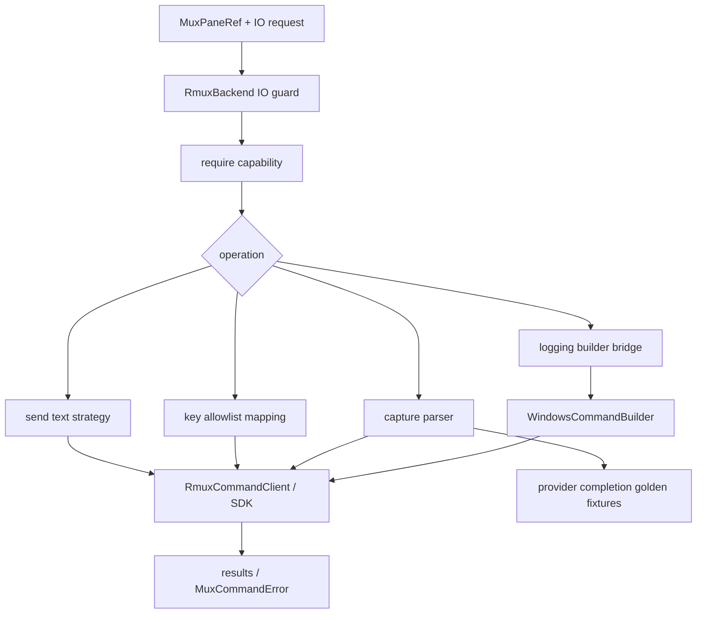

# rmux-send-capture-logging feature design

## 0. 术语约定

| 术语 | 定义 | 防冲突结论 |
|---|---|---|
| Rmux pane IO | `RmuxBackend` 对 provider pane 输入、按键、捕获和日志管道的能力层。 | 本 feature 只补 `send_text`、`send_key`、`capture_pane`、`pipe-pane/logging`，不创建 namespace/window/pane core。 |
| text send | 向 pane 发送普通文本并按契约决定是否附加 Enter。 | 不复用 tmux 的 `load-buffer` / `paste-buffer` 作为 Rmux 语义；大文本必须走 Rmux-safe path。 |
| key send | 发送控制键或特殊键，例如 Ctrl-C、Ctrl-D、Enter、Tab、Escape。 | 必须有显式 key mapping，不把控制字节当普通 text 注入。 |
| capture format | capture 输出的换行、ANSI、尾部空白、wrap、宽字符和历史范围语义。 | 必须保持 provider completion parser 可消费；不能只证明 Rmux command 成功。 |
| pane logging | 将 pane 输出持续追加到 provider log / pane log 文件。 | 必须消费 `windows-shell-log-builder` 的 pipe/log command builder，不在 Rmux backend 中拼 `tee -a` 或 PowerShell/cmd 字符串。 |
| completion golden fixtures | provider completion detectors 的固定输入/期望输出样例。 | capture 格式变化必须用 fixtures 证明不破坏 Codex/Claude/DeepSeek 等 session completion。 |

代码事实：

- `lib/terminal_runtime/tmux_send.py::TmuxTextSender` 当前用 `send-keys`、`load-buffer`、`paste-buffer` 和 `delete-buffer` 完成文本输入，大文本路径仍是 tmux buffer 语义。
- `lib/terminal_runtime/tmux_logs.py::TmuxPaneLogManager` 直接执行 `pipe-pane -o ... "tee -a {log_path}"`，Windows 原生不能依赖该 POSIX 工具。
- `lib/mobile_gateway/terminal.py` 直接用 tmux `capture-pane` 与 `send-keys` 支撑 terminal history / interactive write；本 feature 不接 mobile gateway production path，但 capture/send 语义必须为后续 mux-agnostic attach 留接口。
- provider completion 体系分布在 `lib/completion/*` 与各 `lib/provider_backends/*/execution*`，其中 session snapshot / event log detector 对 capture/log 输出格式敏感。
- roadmap 明确本 item 要替换 `load-buffer` / `paste-buffer` / `tee -a` 的 Windows 语义，并覆盖 Ctrl-C、Ctrl-D、大文本输入和 provider completion parser golden fixtures。

## 1. 决策与约束

### 需求摘要

本 feature 在已通过设计的 `RmuxBackend` core 之上补齐 pane IO：send text、send key、capture pane、pipe/logging。目标是在 native Windows Rmux 后端下可以可靠向 provider pane 输入内容、读取 pane 输出、持续写日志，并证明输出格式不会破坏 provider completion parser。

成功标准：

- `RmuxBackend` 暴露 backend-neutral pane IO methods：`send_text()`、`send_key()`、`capture_pane()`、`ensure_pane_log()` / `pipe_pane_output()` 或等价 logging seam。
- send text 支持小文本与大文本，不能依赖 tmux `load-buffer` / `paste-buffer`；失败必须返回结构化 `MuxCommandError`。
- send key 覆盖 Enter、Tab、Escape、Ctrl-C、Ctrl-D、Ctrl-U、Ctrl-L、Backspace、方向键等 CCB 常用键。
- capture pane 输出以稳定结构返回 text / bytes、line range、ANSI policy、trailing whitespace policy 和 diagnostics。
- pipe/logging 消费 `windows-shell-log-builder` 的 command builder；Windows path 不使用 `tee -a`。
- provider completion golden fixtures 覆盖 Codex protocol stream、Claude session event log、DeepSeek/AGY session snapshot 等对 capture/log 格式敏感的 families。

明确不做：

- 不实现 Rmux namespace/session/window/pane core；该项属于 `rmux-backend-core`。
- 不接入 `ccb start` / `ccbd` production lifecycle、foreground attach 或 mobile gateway production path；该项属于后续 `ccbd-rmux-namespace-lifecycle`。
- 不修改 provider completion parser 规则本身；本 feature 只证明 capture/log 输入格式保真，必要时补 fixtures。
- 不修改 provider session payload/env；该项属于 `provider-runtime-backend-session-contract`。
- 不拥有或清理 Rmux daemon；daemon evidence 只作为 command error diagnostics。
- 不为 unsupported Rmux IO command fallback 到 tmux。

### 复杂度档位

- 行为兼容 = L3。send/capture/logging 是 provider ask 成败关键路径，必须保持 tmux path 的可观察语义。
- 外部依赖 = true external。生产 adapter 调 Rmux CLI/SDK；测试通过 fake Rmux client、capture fixtures 和 completion golden fixtures。
- 可测试性 = verified。send/key/capture/logging/error mapping 都用 unit tests；completion 兼容用 golden tests。
- 数据完整性 = high。capture/log 输出是 completion evidence，尾部空白、ANSI、换行和 wrap 都必须可断言。

### 关键决策

1. 在 `rmux_backend_runtime/io.py` 中放 Rmux pane IO 编排，不把 IO 塞进 core namespace/window/pane 模块。
2. 新增 `RmuxCaptureResult` / 等价结构，明确 `text`、`raw_bytes`、`start_line`、`end_line`、`ansi_mode`、`trim_policy`、`diagnostics`。
3. send text 选择 Rmux-safe 大文本通道：优先使用 Rmux 原生 paste / stdin / SDK input API；若只有 CLI 文本 literal，必须按 size threshold fail-fast 或 chunk，并有测试证明不会截断。
4. send key 用 allowlist 映射，不接受任意控制字节透传；Ctrl-C / Ctrl-D 是 blocking acceptance 场景。
5. logging 只接收 command builder 输出的 pipe target 或 Rmux SDK logging config；backend IO 层不拼 shell-specific command。
6. capture fixtures 是 provider completion 的合同输入：实现不得用“strip 后差不多”掩盖 Rmux 输出差异。

### Top 3 风险与缓解

1. **风险：capture 格式细微漂移导致 provider completion 静默失败。**  
   缓解：建立 provider completion golden fixtures，覆盖 ANSI、尾部空白、宽字符、wrap 和多 turn 边界。
2. **风险：大文本 send 在 Windows ConPTY/Rmux 下截断或乱序。**  
   缓解：设计 send strategy threshold、chunk/ack 或 native paste path；fixtures 覆盖长文本、换行和 shell metachar。
3. **风险：logging 又把 shell 差异散落到 backend。**  
   缓解：强制消费 `windows-shell-log-builder`；grep guard 禁止 Rmux IO 模块出现 `tee -a`、`powershell`、`cmd /`、`sh -lc` 拼接。

### 非显然依赖与关键假设

- 依赖 `rmux-backend-core` 已提供 `RmuxCommandClient`、capability guard、pane refs 和 command error mapping。
- 依赖 `windows-shell-log-builder` 已提供 pipe/log command builder；若 implementation 顺序上 builder 尚未 done，本 feature implementation 必须阻塞而不是复制 builder。
- 依赖 `provider-runtime-backend-session-contract` 已定义 backend-neutral pane/session payload；本 feature 不再发明 provider session 字段。
- 假设 Rmux capability report 中 `send-keys`、`capture-pane`、`pipe-pane` 或等价 API 的 required status 已批准；unsupported required 必须 fail-fast。
- 假设 provider completion detectors 的 golden fixtures 可以在不启动真实 provider 的情况下运行。

## 2. 名词与编排

### 2.1 名词层

#### 现状

- tmux 文本发送封装在 `TmuxTextSender`，小文本可走 `send-keys -l`，常规路径走 `load-buffer` / `paste-buffer`，最后发送 Enter。
- tmux 日志封装在 `TmuxPaneLogManager`，但 pipe command 仍硬编码 `tee -a`。
- capture 仍分散在 project view、mobile gateway 和 runtime 相关代码里，调用面多为 tmux `capture-pane -p -t ... -S ...`。
- provider completion 通过 event log / snapshot / protocol stream 等来源判断完成状态；capture/log 输出格式不是可随意改动的内部细节。

#### 变化

新增 Rmux pane IO surface，作为 `RmuxBackend` 的能力组合：

```python
class RmuxCaptureResult(TypedDict):
    text: str
    raw_bytes: bytes | None
    start_line: int | None
    end_line: int | None
    ansi_mode: Literal["plain", "ansi"]
    trim_policy: Literal["preserve", "rstrip-final-newline"]
    diagnostics: dict[str, object]

class RmuxBackend:
    def send_text(self, pane: MuxPaneRef, text: str, *, submit: bool = True) -> None: ...
    def send_key(self, pane: MuxPaneRef, key: str) -> bool: ...
    def capture_pane(self, pane: MuxPaneRef, *, start: int | None = None, end: int | None = None, ansi: bool = False) -> RmuxCaptureResult: ...
    def ensure_pane_log(self, pane: MuxPaneRef, *, log_path: Path) -> Path | None: ...
```

Command / capability mapping：

| Operation | Required capabilities |
|---|---|
| `send_text` | `send-keys` and Rmux paste/stdin equivalent for large text |
| `send_key` | `send-keys` or SDK key injection equivalent |
| `capture_pane` | `capture-pane` with line range and ANSI/plain mode support |
| `ensure_pane_log` | `pipe-pane` or Rmux logging equivalent + Windows command builder |

Error mapping：

- unsupported required：`MuxCommandError(category="unsupported", backend_impl="rmux", operation=...)`
- missing pane：`category="not-found"`
- daemon/endpoint unreachable：`category="transient-unavailable"` with daemon evidence
- input rejected / invalid key：`category="command-failed"` or validation error before command dispatch
- malformed capture output：`category="command-failed"` with capture diagnostics

##### Interface 设计检查

- Module：`terminal_runtime/rmux_backend_runtime/io.py` 承载 Rmux pane IO。
- Interface：caller 只使用 `MuxPaneRef`、text/key/capture/log semantic args，不接触 Rmux command strings。
- Seam：send strategy、key mapping、capture parser、logging command builder bridge 都在 Rmux backend boundary 内。
- Depth / locality：IO 是 provider ask 的核心差异层，不能做成浅 tmux argv clone。
- Dependency strategy：true external + local-substitutable；fake Rmux client 和 golden fixtures 证明行为。

### 2.2 编排层



流程级约束：

- 每个 IO operation 先做 capability guard，再调用 Rmux client；unsupported required 不 fallback tmux。
- `send_text()` 对空文本 no-op；对大文本走明确策略，不能拆成未验证的任意 `send-keys -l`。
- `send_key()` 只接受 allowlist key names；Ctrl-C / Ctrl-D 必须作为明确 key，不走 text path。
- `capture_pane()` 必须声明 ANSI 和 trimming policy；completion fixtures 消费的是 capture/log 原始语义，不是人工清洗后的摘要。
- `ensure_pane_log()` 先准备 log path，再由 builder 生成 pipe/log target；Rmux IO 不拼平台 shell。
- diagnostics 包含 operation、pane_ref、capability、command evidence、daemon evidence、capture policy。

### 2.3 挂载点清单

- `lib/terminal_runtime/rmux_backend_runtime/io.py`：新增 Rmux pane IO 编排。
- `lib/terminal_runtime/rmux_backend.py`：暴露 IO methods 并接入 `RmuxCommandClient` / capability guard。
- `lib/terminal_runtime/rmux_backend_runtime/capabilities.py`：补 send/capture/logging required capability guard。
- `lib/terminal_runtime/rmux_backend_runtime/errors.py`：补 input/capture/logging error diagnostics。
- `lib/terminal_runtime/windows_shell_log_builder.py`：logging command builder consumption seam。
- `test/test_rmux_send_capture_logging.py`：send/key/capture/logging fake client tests。
- `test/test_rmux_completion_capture_fixtures.py`：provider completion golden fixture tests。
- `test/test_rmux_send_capture_logging_import_guard.py`：禁止 tmux buffer / shell leakage / parser 修改的 guard。

### 2.4 推进策略

1. **IO capability guard**：扩展 Rmux capability projection，覆盖 send-text/send-key/capture-pane/pipe-pane/logging required set。  
   退出信号：unsupported required 在每个 IO operation 前抛 `MuxCommandError(category="unsupported")`。
2. **send text strategy**：实现小文本、大文本、多行、submit Enter 的 Rmux-safe 发送策略。  
   退出信号：fake client tests 覆盖空文本 no-op、长文本、换行、shell metachar 和 command failure。
3. **send key mapping**：实现 key allowlist，覆盖 Ctrl-C、Ctrl-D、Enter、Tab、Escape、Backspace、方向键和清屏类键。  
   退出信号：tests 断言控制键不走普通 text path，未知 key fail-fast。
4. **capture parser**：实现 line range、ANSI/plain mode、trailing whitespace policy 和 malformed output diagnostics。  
   退出信号：capture fixtures 覆盖 ANSI、宽字符、wrap、多行边界、empty pane、range。
5. **logging bridge**：实现 Rmux pipe/logging 与 `WindowsCommandBuilder` 的桥接，替换 `tee -a` 风险。  
   退出信号：tests 断言 Rmux IO 不出现 shell literal，Windows path 用 builder 输出。
6. **provider completion golden fixtures**：把 Rmux capture/log 输出喂给 completion detectors，证明 parser 不被格式漂移破坏。  
   退出信号：Codex、Claude、DeepSeek/AGY 或对应 completion family 的 fixtures 均得到期望 `CompletionDecision` / items。
7. **compatibility and guard**：补 import/grep guard，确认不改 provider parser、不引入 tmux buffer fallback、不接 ccbd lifecycle。  
   退出信号：guard tests + focused tmux send/log/capture 回归通过。

### 2.5 结构健康度与微重构

##### 评估

- 文件级 — `lib/terminal_runtime/tmux_send.py`：tmux-specific sender 不应承载 Rmux 分支；新增 Rmux IO module 更符合 SRP。
- 文件级 — `lib/terminal_runtime/tmux_logs.py`：本 feature 不改 tmux logging 行为，只以 Rmux logging 消费 command builder；若实现发现 builder 未完成，应阻塞到前序 item。
- 文件级 — `lib/mobile_gateway/terminal.py`：仍是 tmux-specific attach path；本 feature 不接 production path，避免提前扩大到 foreground/mobile attach。
- 目录级 — `lib/terminal_runtime/rmux_backend_runtime/`：已由 `rmux-backend-core` 设计为 Rmux backend runtime 分层，新增 `io.py` 与 `panes.py` / `presentation.py` 对称。

##### 结论：不做行为微重构

本 feature 新增 Rmux IO 能力，不搬迁现有 tmux sender/capture/logging helper，也不把 mobile gateway 改成 mux-agnostic attach。tmux 与 mobile gateway 的后续收口留给 `ccbd-rmux-namespace-lifecycle` 或单独 feature。

## 3. 验收契约

### 3.1 关键场景清单

| ID | 输入 / 触发 | 期望可观察结果 | 证据类型 |
|---|---|---|---|
| AC-001 | required send/capture/logging capability unsupported | operation fail-fast，抛 `MuxCommandError(category="unsupported")`，不 fallback tmux | unit test |
| AC-002 | 小文本 / 多行 / 大文本 send | Rmux client 收到稳定 send strategy；文本不截断、不乱序，submit Enter 可控 | unit test |
| AC-003 | Ctrl-C / Ctrl-D / Enter / Tab / Escape / Backspace / arrows | key allowlist 映射正确，控制键不走 text path | unit test |
| AC-004 | capture line range + plain / ANSI mode | `RmuxCaptureResult` 保留约定的换行、ANSI、尾部空白和 diagnostics | unit test |
| AC-005 | malformed capture / missing pane / daemon unreachable | 映射为结构化 `MuxCommandError`，保留 command / daemon / pane evidence | unit test |
| AC-006 | pipe-pane/logging | Windows path 不使用 `tee -a`，通过 command builder 或 SDK logging append | unit test / guard |
| AC-007 | provider completion parser fixtures | Rmux capture/log fixture 通过 completion detector golden expectations | golden test |
| AC-008 | scope guard | 不修改 provider completion parser，不接 ccbd lifecycle，不导入 `TmuxBackend` 或 tmux buffer fallback | import / diff guard |

### 3.2 明确不做的反向核对项

- 不应实现 namespace/window/pane core 或 daemon lifecycle。
- 不应把 Rmux pane id 伪装成 tmux `%N`。
- 不应使用 tmux `load-buffer` / `paste-buffer` 作为 Rmux 大文本策略。
- 不应在 Rmux IO 模块中出现 `tee -a`、`sh -lc`、PowerShell/cmd 拼接。
- 不应修改 provider completion parser 逻辑来适配不稳定 capture。
- 不应接入 `ccb start`、foreground attach、mobile gateway production path 或 ccbd lifecycle。

### 3.3 Acceptance Coverage Matrix

| Scenario | Covered By Step | Evidence Type | Command / Action | Core? |
|---|---|---|---|---|
| AC-001 capability fail-fast | S1 | unit test | `test/test_rmux_send_capture_logging.py` | yes |
| AC-002 text send | S2 | unit test | fake client send strategy tests | yes |
| AC-003 key send | S3 | unit test | fake client key mapping tests | yes |
| AC-004 capture format | S4 | unit test | capture fixture tests | yes |
| AC-005 error mapping | S1-S5 | unit test | fake failure matrix | yes |
| AC-006 logging | S5 | unit / guard | builder bridge tests + no shell literal guard | yes |
| AC-007 completion fixtures | S6 | golden test | `test/test_rmux_completion_capture_fixtures.py` | yes |
| AC-008 scope guard | S7 | import/diff guard | `test/test_rmux_send_capture_logging_import_guard.py` | yes |

### 3.4 DoD Contract

| ID | 要求 | 证据 | 阻塞级别 |
|---|---|---|---|
| DOD-DESIGN-001 | design/checklist/review 完整，且对齐 roadmap item `rmux-send-capture-logging` | design review | blocking |
| DOD-IMPL-001 | send/capture/logging required unsupported fail-fast，不 fallback tmux | unit tests | blocking |
| DOD-IMPL-002 | `send_text` 覆盖小文本、大文本、多行和 submit Enter 语义 | unit tests | blocking |
| DOD-IMPL-003 | `send_key` 覆盖 Ctrl-C、Ctrl-D 和常用特殊键，未知 key fail-fast | unit tests | blocking |
| DOD-IMPL-004 | `capture_pane` 输出格式、ANSI、尾部空白、range 和 malformed output 可诊断 | unit/golden tests | blocking |
| DOD-IMPL-005 | logging 消费 command builder，不出现 `tee -a` / shell literal 泄漏 | guard / unit tests | blocking |
| DOD-IMPL-006 | provider completion golden fixtures 证明 capture/log 格式保真 | golden tests | blocking |
| DOD-IMPL-007 | 不修改 provider completion parser，不接 ccbd lifecycle | diff guard | blocking |
| DOD-REVIEW-001 | code review passed 且无 unresolved blocking | review report | blocking |
| DOD-QA-001 | QA 覆盖 capability、send、key、capture、logging、completion fixtures、scope guard | QA report | blocking |
| DOD-ACCEPT-001 | acceptance 回写 roadmap item，并记录 capture/log format policy | acceptance report | blocking |

Validation Commands:

| ID | 命令 | 目的 | 核心性 | 失败处理 |
|---|---|---|---|---|
| CMD-001 | `python ".codestable/tools/validate-yaml.py" --file ".codestable/features/2026-07-20-rmux-send-capture-logging/rmux-send-capture-logging-checklist.yaml" --yaml-only` | checklist YAML 合法性 | core | fix-or-block |
| CMD-002 | `python ".codestable/tools/validate-yaml.py" --file ".codestable/roadmap/windows-rmux-native-backend/windows-rmux-native-backend-items.yaml"` | roadmap items 回写合法性 | core | fix-or-block |
| CMD-003 | `python -m pytest -q test/test_rmux_send_capture_logging.py` | Rmux IO capability / send / key / capture / logging tests | core | fix-or-block |
| CMD-004 | `python -m pytest -q test/test_rmux_completion_capture_fixtures.py` | provider completion golden fixtures | core | fix-or-block |
| CMD-005 | `python -m pytest -q test/test_terminal_runtime_tmux_send.py test/test_terminal_runtime_tmux_logs.py test/test_ccbd_project_view.py -k "send or log or capture or pane"` | tmux send/log/capture compatibility 抽样 | core | document-baseline |
| CMD-006 | `python -m pytest -q test/test_rmux_send_capture_logging_import_guard.py` | scope guard：无 tmux buffer fallback、无 shell literal 泄漏、不改 completion parser | core | fix-or-block |

Required Artifacts：design、checklist、design-review、Rmux IO module、fake Rmux client tests、send/key/capture/logging tests、completion golden fixtures、scope guard、items.yaml 回写。

### 3.5 自我批判结论

- 可证伪性：所有 send/key/capture/logging 场景都能由 fake client、fixtures 或 guard 断言。
- 步骤原子性：capability、send、key、capture、logging、completion fixtures、guard 七步分离。
- 最弱依赖：completion 格式最容易漏；必须让 golden fixtures 消费 Rmux capture/log 原始输出。
- 证据完整性：成功、unsupported、not-found、daemon unreachable、malformed capture、invalid key 都有测试入口。
- 交付物可核验性：acceptance 可从 Rmux IO module、tests、fixtures、guard 和 capability failures 反查。
- 清洁度规则：不新增临时 TODO/FIXME、调试输出、注释掉代码、死 import；不复制 tmux buffer/paste 逻辑；不在 IO 层拼平台 shell。

## 4. 与项目级架构文档的关系

- 本 feature 消费 `rmux-backend-core` 的 Rmux command client、capability guard、pane refs 和 error mapping。
- 本 feature 消费 `windows-shell-log-builder` 的 command builder，不重新定义 shell/log quoting。
- 本 feature 为 `ccbd-rmux-namespace-lifecycle` 提供 provider ask 所需的 pane IO 能力，但不接入 ccbd production lifecycle。
- 本 feature 的 capture/log golden fixtures 是 `rmux-windows-validation-matrix` 的前置证据。
