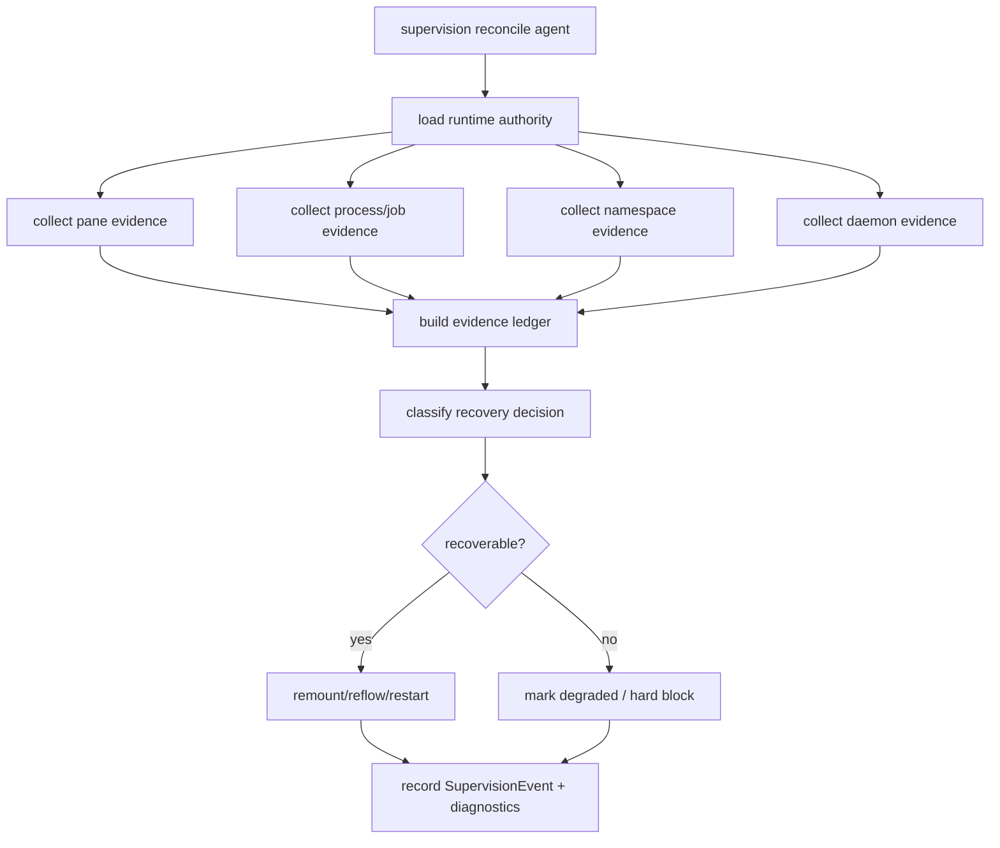

# rmux-supervision-recovery feature design

## 0. 术语约定

| 术语 | 定义 | 防冲突结论 |
|---|---|---|
| pane evidence | mux backend 看到的 pane/window/session 存活、身份 marker、capture/inspect 结果。 | 只能证明 mux 表面，不等价于 provider process healthy。 |
| process/job evidence | provider runtime 的 PID / Job Object / process tree evidence。 | Windows 下是第二生命信号；pane alive 不能覆盖 process dead。 |
| namespace crash | 项目 namespace/session/window 不可用、marker 丢失或 backend-local pane evidence 失效。 | 通过 ProjectNamespaceBackend / MuxBackend capability 判断，不读 tmux socket。 |
| daemon crash | Rmux daemon 不可达、generation 改变、health degraded 或 ownership evidence 不一致。 | 是 backend evidence failure，不是 provider completion failure。 |
| recovery action | remount agent、reflow namespace、restart provider、mark degraded、记录 blocked diagnostics。 | 只对 recoverable health 自动执行；hard block 必须可诊断。 |

代码事实：

- `RuntimeSupervisionLoop` 对每个 agent 调 `runtime_requires_mount()`、`runtime_requires_mount_from_foreign_pane()`、`runtime_requires_recovery()`。
- `loop_runtime.py` 仍用 `tmux_socket_path`、`same_socket_path`、`pane_id.startswith('%')`、`runtime_ref.startswith('tmux:%')` 判断 namespace 归属和 pane replacement。
- `runtime_recovery_policy.py` 当前 recoverable health 只有 `pane-dead` / `pane-missing`，hard block 包含 `session-missing`。
- `recover_runtime()` 已有 backoff、start_recovery、attempt_recovery_action、mark succeeded/failed/missing 机制，可复用事件模型。
- `SupervisionEvent` 可记录 `runtime_ref`、`session_ref` 和 `details`，但尚无 backend-neutral namespace/pane/process/daemon health ledger。
- 前序 child 已设计 provider session backend-neutral payload、Windows Job Object evidence、Rmux daemon ownership、RmuxBackend core/send/capture、ccbd namespace lifecycle。

## 1. 决策与约束

### 需求摘要

本 feature 将 Rmux 路径纳入 ccbd supervision/recovery：识别 pane death、provider process death、namespace crash、Rmux daemon crash，按风险选择 remount/reflow/restart/mark degraded，并输出 diagnostics。它位于 post-milestone，不阻塞本轮 full-chain minimum start/attach/kill，但仍是日常可用性的必要能力。

成功标准：

- runtime health 输入从 tmux-only socket/pane id 迁移到 backend-neutral `namespace_ref`、`pane_ref`、`process_ref`、`daemon_ref`。
- `pane-dead` / `pane-missing` / `pane-foreign` 判定支持 Rmux backend-local pane id，不要求 `%N`。
- provider process/job death 与 pane death 分开建模：process dead 可触发 provider restart/remount；pane alive + process dead 不得判 healthy。
- namespace crash 通过 ProjectNamespaceBackend / MuxBackend evidence 判断，可触发 namespace reflow/remount 或 hard degraded diagnostics。
- Rmux daemon crash 通过 daemon ownership/health evidence 判断；shared daemon crash 不误判为 project authority 丢失，per-project owned evidence 才参与 cleanup/restart。
- supervision event / project view / diagnostics bundle 展示 pane/process/job/namespace/daemon 四类 evidence 与 recovery action。

明确不做：

- 不实现 `ccbd-windows-process-liveness`；本 feature 只消费其 process alive / job evidence。
- 不重新定义 provider completion parser 或 provider-specific health parser。
- 不实现 Rmux backend primitive、namespace lifecycle、send/capture/logging。
- 不改变 route approval、backend resolver、foreground attach 或 `ccb kill` ordering。
- 不承诺多 agent / 多项目 validation matrix；该范围在 `rmux-windows-validation-matrix`。

### 复杂度档位

- 行为兼容 = L3。tmux supervision/recovery 不漂移；Rmux 增加 backend-neutral evidence。
- 架构风险 = high。错误合并 pane/process/daemon evidence 会导致误恢复、误杀或静默假健康。
- 可测试性 = verified。fake backend/fake process/fake daemon evidence 可覆盖所有 health transition。
- 安全性 = medium。recovery 不得越过 owner-approved backend route，不得终止非项目-owned daemon/process。

### 关键决策

1. Health ledger：

```python
class RuntimeEvidenceLedger(TypedDict):
    backend_impl: Literal["tmux", "rmux"]
    namespace_ref: dict[str, object] | None
    pane_ref: dict[str, object] | None
    process_ref: dict[str, object] | None
    daemon_ref: dict[str, object] | None
    pane_health: Literal["alive", "missing", "dead", "foreign", "unknown"]
    process_health: Literal["alive", "dead", "missing", "unknown"]
    namespace_health: Literal["alive", "missing", "crashed", "foreign", "unknown"]
    daemon_health: Literal["alive", "dead", "generation-mismatch", "unowned", "unknown"]
```

2. Recovery classification：
   - `pane-dead|pane-missing` + process alive：attempt pane remount / namespace reflow。
   - process dead / job exited：provider restart/remount，pane evidence 只作 cleanup hint。
   - namespace missing/crashed：namespace reflow/remount；若 backend capability missing 则 degraded diagnostics。
   - daemon dead/generation mismatch：use daemon ownership boundary；shared daemon 只能 mark degraded diagnostics 或观察外部重启后恢复，不自动 kill/restart unrelated daemon；只有 per-project owned / generation-approved daemon 才允许 cleanup/restart path。
3. Backend-neutral matching：
   - `runtime_belongs_to_project_socket()` 替换为 `runtime_belongs_to_namespace_ref()`。
   - `runtime_active_pane_id()` 支持 backend-local `pane_ref` / `active_pane_id`，不要求 `%` prefix。
   - foreign pane 判定使用 `backend_impl + namespace_ref + pane_ref + managed_by + namespace_epoch`。
4. Event / diagnostics：
   - `SupervisionEvent.details` 记录 ledger summary、decision reason、action、backoff、ownership evidence。
   - token/secret/path-sensitive evidence 只输出 refs/fingerprints，不输出 secrets。
   - projection keys 固定为 `pane_health`、`process_health`、`namespace_health`、`daemon_health`，project view / doctor / bundle 使用同名字段或同名子对象。

### Recovery decision table

| Ledger condition | runtime.health label | Class | Action | Event kind / details keys | Backoff |
|---|---|---|---|---|---|
| `pane_health=dead|missing` and `process_health=alive` | `pane-dead` / `pane-missing` | recoverable | existing `recover_runtime()` path: reflow namespace if safe, else `refresh_provider_binding(recover=True)` | `recover_started` then `recover_succeeded|recover_failed`; details include `pane_health`, `process_health`, `namespace_health`, `daemon_health`, `action=pane_recover`, `ledger_reason` | uses existing per-runtime backoff |
| `pane_health=foreign` and namespace matches project | `pane-foreign` | recoverable when reflow safe, otherwise degraded | namespace reflow/remount if safe; otherwise mark degraded | `recover_started|recover_failed`; details include `action=namespace_reflow|degraded`, `foreign_pane_ref`, `namespace_ref` | uses existing per-runtime backoff when recovery attempted |
| `process_health=dead|missing` or job evidence exited while pane is alive | `process-dead` / `process-missing` / `job-exited` | recoverable if provider supports restart/remount, otherwise degraded | provider restart/remount via runtime service; pane evidence only cleanup hint | `recover_started|recover_succeeded|recover_failed`; details include `action=provider_restart`, `process_ref`, `job_ref`, `pane_ref` | uses existing per-runtime backoff |
| `namespace_health=missing|crashed` | `namespace-missing` / `namespace-crashed` | recoverable if namespace reflow/remount safe, otherwise hard/degraded | ProjectNamespaceBackend reflow/remount or mark degraded/hard block | `recover_started|recover_failed`; details include `action=namespace_recover`, `namespace_ref`, `reflow_blocker` | uses existing per-runtime backoff when recovery attempted |
| `daemon_health=dead|generation-mismatch` and daemon ownership is shared/unowned | `daemon-unavailable` / `daemon-generation-mismatch` | degraded diagnostics | no automatic kill/restart; observe external recovery evidence only | `recover_failed` or `daemon_degraded`; details include `action=degraded_only`, `daemon_ref`, `ownership=shared|unowned` | no restart loop for unowned daemon; may suppress repeated events via existing backoff |
| `daemon_health=dead|generation-mismatch` and ownership is per-project owned / generation-approved | `daemon-unavailable` / `daemon-generation-mismatch` | recoverable | ownership-approved cleanup/restart path, then refresh namespace/runtime evidence | `recover_started|recover_succeeded|recover_failed`; details include `action=daemon_recover`, `daemon_ref`, `ownership=owned`, `generation` | uses existing per-runtime or daemon-specific backoff |
| provider auth/recovery blocker from provider layer | existing `provider-auth-revoked` / `provider-recovery-blocked` | hard block | do not auto recover; preserve provider failure reason | `recover_failed`; details include `action=blocked`, `provider_reason` | no auto retry beyond existing blocked semantics |

Rules:

- `runtime.health` labels are the durable bridge into `should_attempt_background_recovery()` and `SupervisionEvent.prior_health/result_health`; implementation must not invent labels outside this table without updating the design/checklist.
- `process_health=dead|missing` takes precedence over `pane_health=alive` for provider health.
- `daemon_health` never rewrites provider parser status; it is backend evidence attached to recovery diagnostics.

### Top 3 风险与缓解

1. **风险：pane alive 被误当成 provider healthy。**  
   缓解：ledger 分离 pane_health 与 process_health；process dead 必须触发 restart/remount 或 degraded。
2. **风险：Rmux daemon crash 被误判为 provider completion failure。**  
   缓解：daemon_health 单独分类，event_kind / details 显示 backend evidence failure。
3. **风险：旧 tmux `%N` / socket path guard 让 Rmux recovery 永远 skipped。**  
   缓解：backend-neutral ref matching；guard tests 禁止 Rmux path 依赖 `%` prefix 或 `tmux_socket_path`。

### 非显然依赖与关键假设

- 依赖 `windows-job-object-runtime-evidence` 提供 process/job evidence。
- 依赖 `provider-runtime-backend-session-contract` 提供 backend-neutral session/runtime fields。
- 依赖 `rmux-daemon-ownership-boundary` 提供 daemon generation、ownership 和 cleanup policy。
- 依赖 `ccbd-rmux-namespace-lifecycle` 提供 namespace_ref / ProjectNamespaceBackend 接入。
- `ccbd-windows-process-liveness` 是 full-chain blocker；本 feature 不实现基本 pid liveness。

## 2. 名词与编排

### 2.1 名词层

#### 现状

- `runtime_requires_recovery()` 只基于 normalized runtime health、tmux socket equality 和 `%` pane id。
- `should_reflow_project_namespace()` 只处理 `pane-foreign`，且要求 `tmux_socket_path` 等于 layout socket。
- `recovered_pane_replaced()` 比较 `%` pane id，无法表达 Rmux backend-local pane id。
- `SupervisionEvent.details` 可扩展，但没有统一 health ledger。

#### 变化

新增或改造候选模块：

```text
lib/ccbd/supervision/evidence.py
lib/ccbd/supervision/backend_namespace.py
lib/ccbd/supervision/daemon_health.py
lib/ccbd/supervision/process_health.py
lib/ccbd/supervision/recovery_decision.py
```

Interface 设计检查：

- Module：supervision owns evidence ledger 与 recovery decision；backend adapters 提供 inspect 能力。
- Interface：runtime loop 只看 normalized evidence，不解释 tmux socket / rmux daemon internals。
- Seam：pane/process/namespace/daemon evidence 分别采集，在 decision 层合并。
- Depth / locality：deep；防止每个 recovery branch 自己读 tmux/Rmux 细节。
- Dependency strategy：local-substitutable；fake evidence 可覆盖 crash matrix。

### 2.2 编排层



流程级约束：

- evidence collection must be best-effort；单个 backend inspect 失败不能隐藏 process/job evidence。
- recovery decision 必须可解释：trigger health、evidence class、chosen action、backoff / hard block。
- namespace reflow 只在 project namespace reflow safe 且 backend evidence matches namespace_ref 时执行。
- daemon crash recovery 只消费 ownership evidence；shared daemon 不默认 kill。
- tmux regression path 保持现有 health labels；新增 ledger 是 superset。

### 2.3 挂载点清单

- `lib/ccbd/supervision/loop_runtime.py`：替换 tmux socket / `%` pane assumptions。
- `lib/ccbd/services/runtime_recovery_policy.py`：扩展 recoverable / hard blocked health set。
- `lib/ccbd/supervision/recovery_transitions.py`、`recovery_events.py`：记录 ledger / action / daemon health。
- `lib/ccbd/supervision/cmd_slot.py`：cmd slot recovery 使用 backend-neutral namespace/pane evidence。
- `lib/ccbd/services/health_assessment/*`：pane/process/namespace health 归一。
- `lib/ccbd/project_view/service.py`、doctor/diagnostics bundle：展示 recovery evidence。
- tests：fake evidence matrix、tmux regression、Rmux pane/process/namespace/daemon crash smoke、scope guard。

### 2.4 推进策略

1. **evidence ledger**：定义 pane/process/namespace/daemon evidence model 和 redacted diagnostics projection。  
   退出信号：unit tests 可构造四类 evidence 并序列化到 SupervisionEvent.details。
2. **backend-neutral matching**：替换 `tmux_socket_path` / `%` id 归属判断为 namespace_ref / pane_ref matching。  
   退出信号：tmux regression 通过；Rmux pane id 不以 `%` 开头仍可判断 replacement。
3. **process/job recovery split**：把 process dead/job exited 与 pane dead/missing 分开分类。  
   退出信号：pane alive + process dead 不返回 healthy；process dead 触发 restart/remount 或 degraded。
4. **namespace crash recovery**：namespace missing/crashed/foreign 触发 reflow/remount 或 hard diagnostics。  
   退出信号：fake backend tests 覆盖 namespace missing、marker mismatch、reflow blocked。
5. **daemon crash diagnostics/recovery**：接入 Rmux daemon ownership evidence。  
   退出信号：shared daemon crash 只记录 degraded/外部恢复 evidence；owned generation mismatch 走 approved cleanup/restart path。
6. **event/project view/doctor projection**：SupervisionEvent、project view、doctor bundle 展示 ledger summary。  
   退出信号：snapshot tests 覆盖 pane/process/namespace/daemon 四类 evidence。
7. **Windows recovery smoke**：kill pane、kill provider process、观察 shared daemon crash degraded、owned daemon restart 的 focused smoke。  
   退出信号：transcript 展示 pane/process 恢复、shared daemon degraded-only、owned daemon approved restart 或明确 degraded diagnostics。
8. **scope guard**：不改 provider parser、backend resolver、namespace lifecycle、process liveness implementation。  
   退出信号：diff/import guard + focused review 通过。

### 2.5 结构健康度与微重构

##### 评估

- 文件级 — `loop_runtime.py`：tmux socket 和 `%` pane id 判断集中，应替换为 backend-neutral helper。
- 文件级 — `runtime_recovery_policy.py`：health set 太窄，需要扩展但保持分类简单。
- 文件级 — `recovery_transitions.py` / `recovery_events.py`：适合承载 ledger/action event。
- 目录级 — `ccbd/supervision/` 已是 recovery owner；不要把 decision 分散到 provider/backends。

##### 结论：做 evidence/decision 收束，不做 provider/parser 重构

本 feature 只让 supervision 能基于 Rmux evidence 恢复或降级，不改变 provider parser、namespace lifecycle、accelerator 或 pid liveness 实现。

## 3. 验收契约

### 3.1 关键场景清单

| ID | 输入 / 触发 | 期望可观察结果 | 证据类型 |
|---|---|---|---|
| AC-001 | tmux existing pane-dead recovery | 现有 tmux recovery health 不漂移 | regression |
| AC-002 | Rmux pane missing/dead | 根据 pane_ref 触发 remount/reflow，不要求 `%` pane id | unit/integration |
| AC-003 | provider process dead but pane alive | 不判 healthy，触发 provider restart/remount 或 degraded | unit |
| AC-004 | namespace missing/crashed | 触发 namespace reflow/remount 或 hard diagnostics | unit/fake backend |
| AC-005 | shared Rmux daemon crash | 记录 daemon degraded 或外部恢复 evidence，不自动 kill/restart unowned daemon | unit/smoke |
| AC-006 | owned daemon generation mismatch | 走 ownership-approved cleanup/restart path | unit |
| AC-007 | diagnostics ledger | event/project view/doctor 展示 pane/process/namespace/daemon evidence | snapshot |
| AC-008 | scope guard | 不改 provider parser、resolver、namespace lifecycle、process liveness | guard |

### 3.2 明确不做的反向核对项

- 不应把 pane alive 当作 provider process healthy。
- 不应要求 Rmux pane id 以 `%` 开头。
- 不应从 `tmux_socket_path` 判断 Rmux namespace 归属。
- 不应把 shared Rmux daemon 当作 project-owned 资源终止。
- 不应实现 pid liveness、accelerator guard、provider parser 或 validation matrix。

### 3.3 Acceptance Coverage Matrix

| Scenario | Covered By Step | Evidence Type | Command / Action | Core? |
|---|---|---|---|---|
| AC-001 tmux regression | S2,S3 | regression | supervision existing tests | yes |
| AC-002 Rmux pane recovery | S2,S7 | unit/integration | fake/Rmux pane crash tests | yes |
| AC-003 process dead | S3 | unit | process/job evidence tests | yes |
| AC-004 namespace crash | S4 | unit/fake | namespace crash/reflow tests | yes |
| AC-005 shared daemon crash | S5 | unit/smoke | daemon ownership tests | yes |
| AC-006 generation mismatch | S5 | unit | owned daemon generation tests | yes |
| AC-007 diagnostics | S6 | snapshot | event/project view/doctor snapshots | yes |
| AC-008 scope guard | S8 | guard | import/diff guard | yes |

### 3.4 DoD Contract

| ID | 要求 | 证据 | 阻塞级别 |
|---|---|---|---|
| DOD-DESIGN-001 | design/checklist/review 完整，且对齐 roadmap item `rmux-supervision-recovery` | design review | blocking |
| DOD-IMPL-001 | evidence ledger 分离 pane/process/namespace/daemon health | unit tests | blocking |
| DOD-IMPL-002 | Rmux pane id 不依赖 `%`，namespace 匹配不依赖 tmux socket | tests/guard | blocking |
| DOD-IMPL-003 | process/job death 与 pane death 分开恢复/降级 | tests | blocking |
| DOD-IMPL-004 | namespace crash 触发 reflow/remount 或 hard diagnostics | tests | blocking |
| DOD-IMPL-005 | daemon crash 使用 ownership evidence，不误杀 shared daemon | tests/smoke | blocking |
| DOD-IMPL-006 | SupervisionEvent/project view/doctor 输出 evidence ledger | snapshot | blocking |
| DOD-IMPL-007 | 不改 provider parser、resolver、namespace lifecycle、process liveness | guard | blocking |
| DOD-REVIEW-001 | code review passed 且无 unresolved blocking | review report | blocking |
| DOD-QA-001 | QA 覆盖 tmux regression、fake evidence matrix、Windows smoke、diagnostics、guard | QA report | blocking |
| DOD-ACCEPT-001 | acceptance 回写 roadmap item，并声明 validation matrix 仍是后续 item | acceptance report | blocking |

Validation Commands:

| ID | 命令 | 目的 | 核心性 | 失败处理 |
|---|---|---|---|---|
| CMD-001 | `python ".codestable/tools/validate-yaml.py" --file ".codestable/features/2026-07-20-rmux-supervision-recovery/rmux-supervision-recovery-checklist.yaml" --yaml-only` | checklist YAML 合法性 | core | fix-or-block |
| CMD-002 | `python ".codestable/tools/validate-yaml.py" --file ".codestable/roadmap/windows-rmux-native-backend/windows-rmux-native-backend-items.yaml"` | roadmap items 回写合法性 | core | fix-or-block |
| CMD-003 | `python -m pytest -q test/test_ccbd_supervision.py test/test_ccbd_supervision_recovery.py` | tmux regression / recovery transitions | core | fix-or-block |
| CMD-004 | `python -m pytest -q test/test_ccbd_rmux_supervision_evidence.py test/test_ccbd_rmux_supervision_recovery.py` | Rmux evidence ledger / pane/process/namespace recovery（新增测试） | core | fix-or-block |
| CMD-005 | `python -m pytest -q test/test_ccbd_rmux_daemon_supervision.py` | daemon crash / generation mismatch / shared daemon policy（新增测试） | core | fix-or-block |
| CMD-006 | `python -m pytest -q test/test_ccbd_supervision_diagnostics.py test/test_ccbd_project_view.py` | event/project view/doctor evidence projection | core | fix-or-block |
| CMD-007 | `python -m pytest -q test/test_ccbd_rmux_supervision_guard.py` | no tmux socket/% pane dependency / no scope creep guard（新增 guard） | core | fix-or-block |

Required Artifacts：design、checklist、design-review、evidence ledger、backend-neutral matching helpers、process/job split tests、namespace crash tests、daemon health tests、diagnostics snapshots、Windows recovery smoke transcript、scope guard、items.yaml 回写。

### 3.5 自我批判结论

- 可证伪性：pane/process/namespace/daemon 四类 evidence 都有独立测试场景。
- 步骤原子性：ledger、matching、process split、namespace crash、daemon crash、diagnostics、smoke、guard 分离。
- 最弱依赖：Windows process/job evidence 和 daemon ownership 必须先落地；否则只能做 degraded diagnostics。
- 证据完整性：必须同时覆盖恢复成功和明确 degraded，不能只测 happy path。
- 交付物可核验性：acceptance 可从 SupervisionEvent、project view、doctor bundle、smoke transcript 反查。
- 清洁度规则：不新增临时 TODO/FIXME、调试输出、注释掉代码、死 import；不在 provider parser 里写 recovery policy。

## 4. 与项目级架构文档的关系

- 本 feature 实现 roadmap item 14，是 post-milestone 日常可用性增强，不阻塞本轮 `windows-rmux-native-working` minimum。
- 本 feature 消费 `windows-job-object-runtime-evidence`、`provider-runtime-backend-session-contract`、`rmux-daemon-ownership-boundary`、`ccbd-rmux-namespace-lifecycle`。
- 本 feature 为 `rmux-windows-validation-matrix` 提供恢复场景输入，但不替代验证矩阵。
