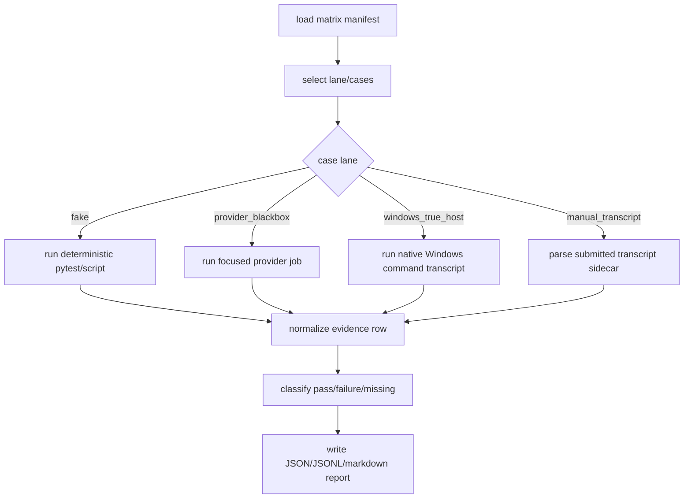

# rmux-windows-validation-matrix feature design

## 0. 术语约定

| 术语 | 定义 | 防冲突结论 |
|---|---|---|
| validation matrix | 机器可读的场景清单，声明 case、lane、provider、命令、证据路径、通过条件和失败分类。 | 不等同于 CI workflow；workflow 只消费矩阵子集。 |
| fake lane | 使用 fake provider、fake/controlled runtime 或单元替身的可重复验证层。 | 能覆盖控制面、矩阵聚合和报告逻辑，不能证明 native Windows Rmux 真链路。 |
| provider blackbox lane | 使用真实 provider CLI 或 pane-backed provider 的 focused 验证层。 | 已有 `provider_blackbox` 标记只在 focused job 运行；Windows Rmux 需要单独分层。 |
| Windows true-host lane | 在 native Windows 上实际走 `ccb -> ccbd -> rmux` 的命令 transcript。 | WSL、probe 直驱 rmux、只跑 fake adapter 都不能替代。 |
| manual transcript | 人或真机 runner 产出的命令、stdout/stderr、环境摘要、artifact 路径和清理结果。 | 必须可复跑、可脱敏、可按 case 回填矩阵。 |

代码与仓库事实：

- `.github/workflows/test.yml` 当前主测试矩阵为 Ubuntu/macOS 多 Python，`pytest test/ -m "not provider_blackbox"`；另有 focused `provider-blackbox` job。
- `.github/workflows/ccbd-real-platform.yml` 覆盖 macOS real ccbd/ask 与 Windows runner 上的 WSL mounted-drive smoke，但没有 native Windows Rmux true-host job。
- `pytest.ini` 定义 `ccb_lifecycle_smoke` 和 `provider_blackbox` 两个现有分层标记。
- `scripts/phase6_fake_matrix_smoke.py` 已有 case manifest、row classification、JSON/JSONL/markdown report 模型，可作为矩阵聚合结构参考。
- `scripts/single_lane_multi_workgroup_smoke.py` 已覆盖 fake runtime 的 1-4 workgroup、多 shape、restart replay、cleanup residue 证据，但其 `_post_cleanup_evidence()` 依赖 Linux `/proc` 与 AF_UNIX socket 观察，不能直接声明 Windows native 通过。
- `scripts/bootstrap-windows-test-env.ps1` 能准备 Windows test environment 和 smoke project，但当前只创建 `ccb` smoke，不安装或验证 rmux backend。
- `package.json` 当前 `os` 仍只含 `linux` / `darwin`；本 feature 不改打包策略，后续 `rmux-packaging-docs-contracts` 处理。

## 1. 决策与约束

### 需求摘要

本 feature 为 roadmap item 15 建立 Windows Rmux 验证矩阵和 runbook，使后续 owner、CI、QA、acceptance 能用同一套 case 定义判断 `ccb -> ccbd -> rmux` 是否在 native Windows 上真实可用。它消费 `rmux-supervision-recovery`，覆盖多 agent、ask、kill、restart、多项目并行与诊断证据。

成功标准：

- 建立一个机器可读矩阵 manifest，按 lane 区分 fake、provider blackbox、Windows true-host、manual transcript。
- 每个核心 case 都有明确命令、环境前置、证据路径、通过条件、失败分类和清理要求。
- Windows true-host case 必须证明 `ccb` 启动、`ccb ask`、`ccb kill`、restart/recover、多项目隔离均走 ccbd 控制面和 Rmux backend，不接受 probe 旁路。
- CI 可跑部分只包含 deterministic / fake / focused blackbox；真机证据通过 runbook transcript 回填，不伪装成默认 CI 绿灯。
- 报告聚合输出 JSON、JSONL 和人读摘要，能标出 missing evidence、provider failure、system failure、test design failure。

明确不做：

- 不更新 installer、npm `os`、README、用户手册或 release contract；这些属于 `rmux-packaging-docs-contracts`。
- 不实现 Rmux backend、supervision/recovery 或 Windows TCP transport；只消费前序能力。
- 不把 WSL、macOS tmux、capability probe 或 fake lane 作为 native Windows Rmux true-host 通过证据。
- 不要求真实 provider 凭证进入默认 CI；真实 provider 只在 focused/manual lane 明确声明。
- 不在本 feature 里修改 provider completion parser 或 provider-specific launcher 行为。

### 复杂度档位

- 行为兼容 = L2/L3。主要新增验证资产，但会影响 CI/runbook 的质量门槛。
- 架构风险 = medium。风险在于证据分层不清，导致 probe/fake/WSL 被误认为真链路。
- 可测试性 = verified。manifest parser、report builder、sample transcript parser 可以用纯单测覆盖。
- 安全性 = medium。transcript 必须脱敏 provider token、Windows user path 和 TCP token。

### 关键决策

1. Matrix schema：

```python
class RmuxWindowsValidationCase(TypedDict):
    case_id: str
    lane: Literal["fake", "provider_blackbox", "windows_true_host", "manual_transcript"]
    selection_scope: Literal["subset", "full"]
    provider: Literal["fake", "codex", "claude", "gemini", "opencode", "mixed", "none"]
    backend_impl: Literal["rmux"]
    host_kind: Literal["native_windows", "wsl", "linux", "macos", "unknown"]
    control_plane: Literal["ccbd", "probe", "none"]
    probe_bypass: bool
    backend_selection_source: Literal["cli", "project_config", "user_config", "env", "manual_transcript", "unknown"]
    upstream_gate: Literal["ready", "pending", "blocked"]
    scenario: Literal[
        "start_ping", "ask", "kill", "restart_replay",
        "multi_agent", "multi_project", "supervision_recovery", "diagnostics"
    ]
    command: list[str]
    required_artifacts: list[str]
    pass_checks: list[str]
    failure_classes: list[str]
```

2. True-host 防伪 gate：
   - `lane=windows_true_host` 必须同时满足 `host_kind=native_windows`、`control_plane=ccbd`、`probe_bypass=false`、`backend_impl=rmux`，否则 row classification 固定为 `test_design_failure` 或 `missing_evidence`，不得进入 pass。
   - `host_kind=wsl` 可作为 compatibility subset，但永远不能提升为 native Windows true-host evidence。
   - `backend_selection_source` 必须能追溯到 CLI/project/user/env/manual transcript 中至少一种；unknown 只允许出现在 missing evidence row。
3. 证据分层：
   - fake lane 验证矩阵聚合、backend-neutral projection、清理检查和多 agent 编排，不证明 Rmux 真链路。
   - provider blackbox lane 验证真实 provider CLI / pane-backed ask 行为，默认 focused，不进入全 OS/Python 矩阵。
   - Windows true-host lane 必须在 native Windows 上带 `runtime.mux.backend=rmux` 或等价 opt-in，记录 `ccb ping ccbd`、`doctor`、`ask`、`kill`、rmux health/artifacts。
   - manual transcript lane 用固定 schema 接收人跑结果，缺字段即 `missing_evidence`。
4. 通过判定：
   - 报告顶层同时输出 `selection_scope`、`selected_cases_status`、`full_matrix_status`。
   - `selection_scope=subset` 时，CI 只能断言 `selected_cases_status=pass`；`full_matrix_status` 在 true-host/manual 核心证据缺失时仍为 `incomplete`。
   - `selection_scope=full` 时，只有所有 full core cases 均 observed 且分类为 `pass` 或允许的 `valid_non_success`，`full_matrix_status` 才可 `pass`。
   - `provider_failure` 不等同 `system_failure`；真实 provider auth/配额失败不得掩盖 ccbd/Rmux 层证据是否通过。
   - `test_design_failure` 用于 case 未实现、缺命令、缺 artifact schema 或 transcript 缺字段。
   - `incomplete` 只作为 report summary/status，不作为 row classification；row 使用 `missing_evidence`、`test_design_failure`、`provider_failure`、`system_failure`、`valid_non_success`、`pass`。
5. Upstream recovery gate：
   - `supervision_recovery` / restart recovery case 消费 `rmux-supervision-recovery` 的 accepted design 与实现证据；上游未进入可执行状态时，对应 row 只能是 `missing_evidence` / `test_design_failure` 或 `upstream_pending` summary，不得计入 full pass。
   - 这不阻塞 manifest/report/schema 实现；只限制 full matrix status。
6. Artifact contract：
   - 新增或扩展脚本时输出 `rmux_windows_validation_report.json`、`rmux_windows_validation_rows.jsonl`、`rmux_windows_validation_summary.md`。
   - Windows true-host transcript 使用 UTF-8 文本和 JSON sidecar，记录环境、命令、returncode、stdout/stderr 路径、redaction summary。
   - 真机 runbook 交付两件资产：`scripts/rmux-windows-validation-runbook.ps1` 作为可执行收集器，`docs/plantree/plans/windows-rmux-native-backend/topics/rmux-windows-validation-runbook.md` 作为人工步骤说明；两者共享 transcript sidecar schema。

### Top 3 风险与缓解

1. **风险：把 WSL 或 probe 证据误记为 native Windows Rmux。**  
   缓解：case schema 强制 `host_kind=native_windows`、`backend_impl=rmux`、`control_plane=ccbd`、`probe_bypass=false`。
2. **风险：真实 provider failure 让 Rmux regression 被误判。**  
   缓解：failure classification 分离 `provider_failure` 与 `system_failure`；fake lane 先证明控制面和 mux evidence。
3. **风险：runbook 变成人工散文，无法复核。**  
   缓解：PowerShell 收集器和 markdown runbook 共享 JSON sidecar schema；report builder 可解析并给出 missing fields。

### 非显然依赖与关键假设

- 依赖前序 child 提供 backend resolver opt-in、ccbd Windows TCP loopback、Rmux namespace lifecycle、send/capture/logging、supervision recovery。
- 依赖 Windows 真机或 self-hosted runner；GitHub hosted Windows 可用于部分 native smoke，但真实 provider 凭证和 Rmux 安装可能仍需手工机。
- 假设 Rmux 已可通过 capability gate 和 route approval 进入实现路径；若 route 被暂停，本矩阵仍可保留为 pending/fail-fast 报告，不伪造通过。

## 2. 名词与编排

### 2.1 名词层

#### 现状

- 测试入口按 workflow、pytest marker 和脚本散落，没有针对 Rmux Windows 的统一 case manifest。
- `phase6_fake_matrix_smoke.py` 证明矩阵聚合模式可行，但字段是 agentic-loop phase6 专用。
- `single_lane_multi_workgroup_smoke.py` 提供多 workgroup/restart/cleanup 证据，但使用 fake runtime 和 Linux cleanup 观察。
- Windows bootstrap 脚本负责环境安装，不是可判定的验证报告。

#### 变化

新增验证资产候选：

```text
scripts/rmux_windows_validation_matrix.py
scripts/rmux-windows-validation-runbook.ps1
docs/plantree/plans/windows-rmux-native-backend/topics/rmux-windows-validation-runbook.md
test/test_rmux_windows_validation_matrix.py
.github/workflows/ccbd-rmux-windows-validation.yml
```

Interface 设计检查：

- Module：validation matrix owns case schema、evidence parsing、report classification。
- Interface：CI、manual runbook、acceptance 都只消费 matrix report，不各自定义通过标准。
- Seam：provider blackbox 与 Windows true-host 通过 lane 字段隔离。
- Depth / locality：deep。证据分层和失败分类集中，避免每个 workflow 自己解释。
- Dependency strategy：local-substitutable。report builder 可用 sample transcript fixtures 单测。

### 2.2 编排层



流程级约束：

- case selection 必须显式；默认 CI 不跑真实 provider / destructive manual case。
- Windows true-host case 运行前先记录 `ccb --version`、Python、PowerShell、rmux version、backend selection diagnostics。
- 每个 case 结束时必须尝试 `ccb kill -f`，并记录 namespace、provider process、job object、ccbd endpoint、rmux session/daemon residue。
- transcript redaction 在写 report 前执行，token、same-user TCP token、provider home secret、绝对用户目录可替换为 stable fingerprint。
- report builder 不依赖当前 OS；Windows transcript 可在任意平台解析复核。

### 2.3 挂载点清单

- `scripts/rmux_windows_validation_matrix.py`：矩阵 manifest、runner/collector、report builder。
- `scripts/rmux-windows-validation-runbook.ps1`：native Windows true-host 命令收集器，负责 start/ping/ask/kill/restart/multi-project transcript sidecar。
- `test/test_rmux_windows_validation_matrix.py`：schema、classification、sample transcript、selected-case 行为。
- `.github/workflows/ccbd-rmux-windows-validation.yml`：可自动跑的 Windows fake/limited true-host job，默认不含真实 provider secret。
- `docs/plantree/plans/windows-rmux-native-backend/topics/rmux-windows-validation-runbook.md`：真机手工 runbook 和 transcript sidecar 格式。
- `.codestable/features/...`：design/checklist/review 作为后续 implementation/QA/acceptance 契约。

### 2.4 推进策略

1. **matrix schema 与 manifest**：定义 lane、case、artifact、failure classification 和 selected-case 语义。  
   退出信号：单测证明 missing / unknown / duplicate case fail closed。
2. **report builder**：把 fake/provider/windows/manual evidence 归一为 rows、summary、JSONL、markdown。  
   退出信号：sample evidence 可生成 `selected_cases_status` 与 `full_matrix_status`，row classification 覆盖 pass、missing_evidence、system_failure、provider_failure、test_design_failure。
3. **fake lane runner**：复用或包裹现有 lifecycle/multi-workgroup fake smoke，输出 Rmux projection placeholders 并明确 `not_true_host`。  
   退出信号：fake lane 可在非 Windows 上跑 report，但不满足 true-host core case。
4. **Windows true-host runbook runner**：定义 PowerShell 命令序列、环境检查、rmux opt-in、start/ping/ask/kill/restart/multi-project transcript。  
   退出信号：`scripts/rmux-windows-validation-runbook.ps1` 与 markdown runbook 共享 sidecar schema；runner 或手工 transcript sidecar 包含所有 required artifacts，缺字段时 report 不通过。
5. **provider blackbox lane**：将至少一个真实 provider ask case 与 fake provider baseline 分离，支持 auth failure 分类。  
   退出信号：provider auth failure 分类为 provider_failure，不影响 fake/control-plane rows。
6. **CI integration**：新增或扩展 workflow，只跑 deterministic fake 与可无凭证的 Windows sanity；真实 provider/manual case 仍为 workflow_dispatch 或手工输入。  
   退出信号：CI 不要求 secrets 即可给出 `selection_scope=subset` report；CI 只断言 `selected_cases_status=pass`，不把 subset 当 full pass。
7. **cleanup/residue evidence**：补 Windows-native residue 检查，覆盖 ccbd endpoint、TCP token refs、rmux namespace/session、provider/job process。  
   退出信号：kill case 后 artifact 显示 no owned namespace/process residue 或 bounded retained reason。
8. **scope guard**：禁止 installer/package/docs contract 收口和 production behavior 变更混入本 feature。  
   退出信号：diff guard 使用 `git diff --name-only` 与结构解析证明未改 `package.json os`、README/install docs contract、provider parser、backend implementation。

Scope guard 数据源：

- `package.json`：解析 `os` 必须保持当前 `["linux", "darwin"]`，本 feature 不加入 `win32`。
- forbidden path set：`README.md`、`README/**`、`docs/manuals/**`、`install.ps1`、`install.sh`、`bin/ccb-npm-install.js`、`package.json` 的 packaging 字段、`lib/terminal_runtime/rmux*`、`lib/provider_backends/**/launcher*`、`lib/provider_backends/**/launcher_runtime/**`、provider completion parser 相关文件。
- allowed exception：`package.json` 只允许被 scope guard 测试读取，不允许修改；新增 docs 仅限 `docs/plantree/plans/windows-rmux-native-backend/topics/rmux-windows-validation-runbook.md`。

### 2.5 结构健康度与微重构

##### 评估

- 文件级：`scripts/phase6_fake_matrix_smoke.py` 是专用矩阵脚本，不宜直接扩成 Rmux 矩阵，避免 phase6 概念外泄。
- 文件级：`scripts/single_lane_multi_workgroup_smoke.py` 已较大，且 Linux cleanup 逻辑与 Windows native residue 不同，不宜继续塞入 Rmux 专项。
- 文件级：`.github/workflows/test.yml` 已承载主矩阵、provider blackbox、WSL，继续堆 Windows Rmux true-host 会降低可读性。
- 目录级：`docs/plantree/plans/windows-rmux-native-backend/topics/` 可承载 runbook；若目录不存在则在实现时创建。

##### 结论：新建专项 validation 脚本与 workflow，不做行为微重构

本 feature 应新建 Rmux Windows validation 专用脚本和 tests。现有 fake matrix / multi-workgroup smoke 只作为可调用输入或参考，不做搬移重构。workflow 也建议新建专项文件，避免把 true-host/manual 语义混进通用 test workflow。

## 3. 验收契约

### 3.1 关键场景清单

| ID | 输入 / 触发 | 期望可观察结果 | 证据类型 |
|---|---|---|---|
| AC-001 | manifest 定义 start/ping/ask/kill/restart/multi-agent/multi-project/recovery/diagnostics cases | 每个 case 有 lane、command、artifacts、pass_checks、failure_classes | unit |
| AC-002 | fake lane selected cases | 生成 report rows，但 summary 标明不能替代 true-host | unit/script |
| AC-003 | native Windows start + ping | `ccb` 启动 ccbd，`ping` 显示 rmux backend 和 healthy namespace | transcript |
| AC-004 | native Windows ask | 至少 fake provider ask 通过；真实 provider case 可 focused/manual | transcript/provider |
| AC-005 | native Windows kill | `ccb kill -f` 后 ccbd endpoint、Rmux namespace/session、owned provider/job residue 清理 | transcript |
| AC-006 | restart/recovery | 上游 recovery gate ready 后，daemon/ccbd restart replay 后 pending ask 或 runtime binding 可恢复或明确 degraded；上游 pending 时 row 不计 full pass | transcript |
| AC-007 | multi-agent / multi-project | 多 agent 同项目与两个项目并行不串 namespace、provider env 或 TCP endpoint | transcript/script |
| AC-008 | report classification | missing/provider/system/test-design failure 分类正确，`selection_scope=subset` 不冒充 full pass | unit |
| AC-009 | scope guard | 不改 packaging/docs contract、backend implementation、provider parser | guard |

### 3.2 明确不做的反向核对项

- 不应把 `ccbd-real-platform.yml` 的 WSL mounted-drive smoke 当作 native Windows Rmux 通过。
- 不应把 `scripts/probe_rmux_*` 或 capability report 当作 `ccb -> ccbd -> rmux` 真链路。
- 不应要求默认 CI 拥有真实 provider secret。
- 不应在本 feature 中修改 `package.json` 的 `os` 字段或安装文档。
- 不应把 provider auth failure 归为 Rmux system failure。

### 3.3 Acceptance Coverage Matrix

| Scenario | Covered By Step | Evidence Type | Command / Action | Core? |
|---|---|---|---|---|
| AC-001 manifest coverage | S1 | unit | schema/manifest tests | yes |
| AC-002 fake lane | S2,S3 | unit/script | `python scripts/rmux_windows_validation_matrix.py --lane fake --scope subset --json` | yes |
| AC-003 start/ping true-host | S4 | manual/runner transcript | PowerShell runbook `start_ping` | yes |
| AC-004 ask true-host | S4,S5 | transcript/provider | fake ask + focused provider ask | yes |
| AC-005 kill cleanup | S4,S7 | transcript | `ccb kill -f` + residue scan | yes |
| AC-006 restart/recovery | S4,S7 | transcript | restart replay / recovery scenario + upstream gate check | yes |
| AC-007 multi-agent/multi-project | S3,S4,S7 | script/transcript | multi-workgroup + two-project run | yes |
| AC-008 classification | S2 | unit | sample evidence fixtures | yes |
| AC-009 scope guard | S8 | guard | diff/import guard | yes |

### 3.4 DoD Contract

| ID | 要求 | 证据 | 阻塞级别 |
|---|---|---|---|
| DOD-DESIGN-001 | design/checklist/review 完整，且对齐 roadmap item `rmux-windows-validation-matrix` | design review | blocking |
| DOD-IMPL-001 | matrix manifest 覆盖核心 Windows Rmux cases、lane 分层、true-host 防伪字段和 upstream gate | unit tests | blocking |
| DOD-IMPL-002 | report builder 输出 JSON/JSONL/markdown，缺证据 fail closed | unit tests | blocking |
| DOD-IMPL-003 | fake/provider/Windows/manual evidence 分类不混淆 | unit/script tests | blocking |
| DOD-IMPL-004 | Windows PowerShell runbook 与 markdown runbook 共享 transcript schema，且 transcript 可解析、可脱敏、可回填 report | transcript parser tests | blocking |
| DOD-IMPL-005 | native Windows residue checks 覆盖 ccbd endpoint、TCP token ref、rmux namespace/session、owned process/job | script/transcript | blocking |
| DOD-IMPL-006 | CI 集成只跑可自动化 subset，full matrix 仍要求 true-host evidence | workflow diff + report | blocking |
| DOD-IMPL-007 | scope guard 阻止 packaging/docs/backend/provider parser 越界 | guard | blocking |
| DOD-REVIEW-001 | code review passed 且无 unresolved blocking | review report | blocking |
| DOD-QA-001 | QA 覆盖 schema/report/fake lane/Windows transcript parser/workflow dry validation | QA report | blocking |
| DOD-ACCEPT-001 | acceptance 明确 full matrix 是否 complete，并回写 roadmap item | acceptance report | blocking |

Validation Commands:

| ID | 命令 | 目的 | 核心性 | 失败处理 |
|---|---|---|---|---|
| CMD-001 | `python ".codestable/tools/validate-yaml.py" --file ".codestable/features/2026-07-20-rmux-windows-validation-matrix/rmux-windows-validation-matrix-checklist.yaml" --yaml-only` | checklist YAML 合法性 | core | fix-or-block |
| CMD-002 | `python ".codestable/tools/validate-yaml.py" --file ".codestable/roadmap/windows-rmux-native-backend/windows-rmux-native-backend-items.yaml"` | roadmap items 回写合法性 | core | fix-or-block |
| CMD-003 | `python -m pytest -q test/test_rmux_windows_validation_matrix.py` | manifest/report/transcript parser、redaction fixture、subset/full status（新增测试） | core | fix-or-block |
| CMD-004 | `python scripts/rmux_windows_validation_matrix.py --lane fake --scope subset --json` | fake lane subset report（新增脚本） | core | fix-or-block |
| CMD-005 | `python scripts/rmux_windows_validation_matrix.py --transcript "artifacts/rmux-windows/manual-transcript.json" --json` | manual transcript 回填（新增输入） | core | fix-or-block |
| CMD-006 | `python -m pytest -q -m ccb_lifecycle_smoke test/test_v2_phase2_entrypoint.py test/test_v2_ccbd_start_matrix.py` | existing lifecycle baseline / subset | core | fix-or-block |
| CMD-007 | `python -m pytest -q -m provider_blackbox test/test_v2_phase2_entrypoint.py` | focused provider blackbox baseline | optional-focused | record-provider-failure |
| CMD-008 | `powershell -NoProfile -ExecutionPolicy Bypass -File ".\\scripts\\rmux-windows-validation-runbook.ps1" -ProjectRoot "$env:TEMP\\ccb-rmux-validation" -Json` | native Windows true-host transcript（新增脚本或 runbook 命令） | core-manual | attach-transcript-or-block-full-pass |
| CMD-009 | `python -m pytest -q test/test_rmux_windows_validation_scope_guard.py` | packaging/docs/backend/provider parser 越界 guard（新增测试） | core | fix-or-block |

Required Artifacts：design、checklist、design-review、matrix manifest、PowerShell runbook、markdown runbook、report JSON、rows JSONL、summary markdown、sample transcript fixtures、dirty transcript redaction fixture、Windows true-host transcript sidecar、redaction summary、workflow subset report、scope guard、items.yaml 回写。

### 3.5 自我批判结论

- 可证伪性：每个核心 case 都能落到 row classification 和 required artifact。
- 步骤原子性：schema、report、fake lane、true-host runbook、provider lane、CI、residue、guard 分离。
- 最弱依赖：true-host 依赖前序 Rmux backend/supervision 全部可用；设计要求 missing evidence fail closed。
- 证据完整性：fake lane 与 true-host lane 明确隔离，避免“部分通过”误报 full pass。
- 交付物可核验性：acceptance 可从 manifest、reports、transcripts、workflow diff、guard tests 反查。
- 清洁度规则：不新增临时 TODO/FIXME、调试输出、注释掉代码、死 import；transcript 不落 secret 原文。

## 4. 与项目级架构文档的关系

- 本 feature 实现 roadmap item 15，属于 post-milestone 完整验证矩阵，不阻塞 minimum full-chain smoke，但用于交付可信度。
- 本 feature 消费 `rmux-supervision-recovery`，并为 `rmux-packaging-docs-contracts` 提供支持状态、beta/GA 判断和文档证据输入。
- 本 feature 不替代 `ccbd-windows-full-chain-smoke`：后者是本轮终点的最小真链路验收；本 feature 是更广覆盖矩阵。
