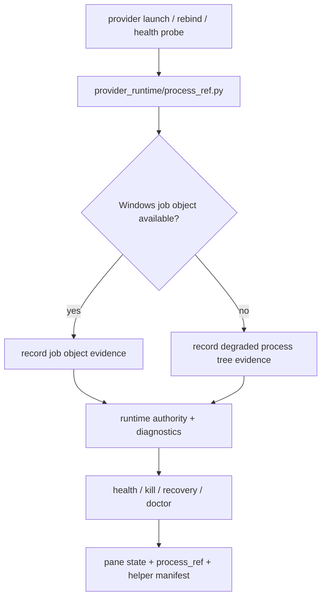

# windows-job-object-runtime-evidence feature design

## 0. 术语约定

| 术语 | 定义 | 防冲突结论 |
|---|---|---|
| runtime authority | `AgentRuntime`、`ProviderRuntimeFacts`、ccbd health / kill / recovery 读取的持久运行事实。 | `ccbd` 仍是 authority；Job Object、pid tree、pane 只提供 evidence。 |
| process_ref | 表示 provider runtime 进程树证据的 canonical 记录。 | 它不是 handle，也不是 authority；只记录可恢复、可诊断的证据。 |
| job object evidence | Windows Job Object 本身及其成员树的证据。 | 这是 Windows 下 kill/recovery 的第二生命信号，不是 pane 的同义词。 |
| process tree evidence | 无法或尚未获得 Job Object 时，围绕 root pid / helper pid / child tree 建立的降级证据。 | 只能作为 degraded evidence，不能放大为任意 pid 的杀伤授权。 |
| pane healthy | pane/session 仍可见。 | `pane alive != provider healthy`，pane 不得单独决定恢复或 kill。 |
| kill eligibility | 允许对 runtime 采取 destructive cleanup 的条件。 | Windows 下必须由 process_ref + runtime generation + project ownership 共同证明，不能走 `pid_matches_project(...)->True` 的无条件路径。 |

术语与代码事实对应：

- `lib/agents/models_runtime/runtime_runtime/agent.py` 的 `AgentRuntime` 目前没有 `process_ref`。
- `lib/ccbd/services/provider_runtime_facts.py` 的 `ProviderRuntimeFacts` 目前只有 `runtime_ref/session_ref/runtime_root/runtime_pid/pane_id/tmux_socket_*`。
- `lib/provider_runtime/helper_manifest.py` 只记录 `leader_pid/pgid`，没有 job object / process tree 证据字段。
- `lib/provider_runtime/helper_cleanup.py` 和 `lib/runtime_pid_cleanup/matching.py` 都还没有 Windows 证据化 ownership contract。
- `lib/ccbd/services/health.py` / `lib/ccbd/services/health_monitor_runtime/status.py` 仍然先看 pane，再看 `runtime.pid`。

## 1. 决策与约束

### 需求摘要

本 feature 为 Windows provider runtime 增加一条稳定的进程树证据链：

1. 在 runtime authority 中持久化 `process_ref`。
2. 在 runtime 启动、健康检查、重绑定、kill 收口和 diagnostics 中消费该证据。
3. 在 Windows 上把 Job Object 作为首选 evidence，process tree 作为降级 evidence。
4. 让 `pane alive` 和 `provider healthy` 分离，避免 pane 存活误判为 runtime 健康。

成功标准：

- `AgentRuntime` 和 `ProviderRuntimeFacts` 能承载 `process_ref`。
- Windows Job Object evidence 能被写入 runtime authority 或其派生 diagnostics。
- kill / recovery 只对有 ownership evidence 的 runtime 采取 destructive action。
- `ccbd` diagnostics 可以同时展示 pane / process / job 三类信号。
- 现有 tmux / 非 Windows 路径不被 job object 语义污染。

### 明确不做

- 不在本 feature 内把 `ccbd` runtime authority 改成 Job Object authority。
- 不把 `process_exists()` 改成 Windows 专用 pid probe 方案；那是 `ccbd-windows-process-liveness` 的边界。
- 不实现 Rmux daemon lifecycle 或 provider session contract 重写。
- 不把 pane/session 事实当成 kill authorization 的唯一依据。
- 不引入新的外部服务或持久守护进程。
- 不修改 `ccb kill` 的用户语义，只补强其 evidence 输入。

### 复杂度档位

- 平台差异 = deep（Windows 进程树与 Job Object 语义必须集中在运行时边界）。
- 持久契约 = deep（runtime authority / diagnostics 需要稳定可恢复字段）。
- 兼容性 = L3（旧 runtime 记录和现有 tmux 路径必须继续可读）。

### 关键决策

1. `process_ref` 进入 runtime authority，而不是只放在临时 diagnostics。
2. Windows Job Object 采用 evidence-first 设计：能创建/识别 job 就记录 job evidence，不能时降级到 process tree evidence，但不放开任意 pid 杀伤。
3. `ccbd` 继续是 authority，Job Object 只用于 kill/recovery/diagnostics 的证据输入。
4. `pane alive`、`runtime.pid`、`process_ref` 三者必须分开表达，不能互相替代。
5. `helper_manifest` 可以作为 cleanup 辅助输入，但不作为唯一 job evidence 载体。

### 非显然依赖

- Windows 下 Job Object handle 不能直接持久化，必须保存逻辑 job identity + owner pid + runtime generation。
- 现有 `taskkill /T /PID` 只能是降级 kill primitive，不等于 Job Object evidence。
- `pid_matches_project()` 在 Windows 上当前无条件 `True`，如果不收紧，就会把 evidence 缺失误放大成无条件 kill。

### Top 3 风险与缓解

1. **风险：把 Job Object 证据误做成 authority。**  
   缓解：在 design、checklist 和 diagnostics 都写死 `ccbd authority > process_ref > pane` 的顺序。
2. **风险：Windows 无 Job Object 时退化成任意 pid 清扫。**  
   缓解：kill eligibility 只接受 ownership evidence 明确的 runtime；否则保持 degraded/unknown。
3. **风险：健康模型继续把 pane 存活当成健康。**  
   缓解：新增 `process_ref` 读取面，并让 diagnostics 明确显示 `pane_state` 与 `process_ref.evidence_state` 的差异。

## 2. 名词与编排

### 2.1 名词层

#### 现状

- `AgentRuntime` 记录 `pid/runtime_pid/runtime_root/pane_id/runtime_ref/session_ref`，但没有 `process_ref`。
- `ProviderRuntimeFacts` 记录 `runtime_pid/runtime_root/pane_id/pane_state/tmux_socket_*`，但没有 job evidence。
- `ProviderHealthSnapshot` 的 `diagnostics` 只能容纳松散字典，没有 canonical process evidence 字段。
- `ProviderHelperManifest` 只有 `leader_pid/pgid`，只能表示 leader / group cleanup，不能表示 Windows Job Object identity。
- `runtime_pid_cleanup.collect_pid_candidates()` 依赖 `runtime.runtime_pid or runtime.pid`、`*.pid` 和 `helper.json`。
- `pid_matches_project()` 在 Windows 上直接 `return True`，现状下没有 ownership vetting。

#### 变化

新增 canonical `process_ref`：

```python
class ProcessRef(TypedDict):
    kind: Literal["windows_job_object", "process_tree", "legacy_pid"]
    evidence_state: Literal["attached", "observed", "degraded", "missing", "unsupported", "stale"]
    job_id: str | None
    owner_pid: int | None
    root_pid: int | None
    runtime_pid: int | None
    runtime_generation: int | None
    runtime_root: str | None
    source: Literal["launch", "health", "kill", "recovery", "diagnostic"]
    observed_at: str | None
```

契约约束：

- `job_id` 只表示逻辑 job identity，不表示 OS handle。
- `owner_pid` 表示创建 / 绑定 job 的主 pid。
- `root_pid` 表示当前 runtime 的树根 pid。
- `runtime_generation` 必须随 runtime authority epoch 走。
- `evidence_state` 用于区分 attached / degraded / missing / unsupported，不允许用 bool 吞掉边界。
- canonical authority 字段固定为 `process_ref.owner_pid`；旧 psmux 文档中的 `job_owner_pid` 只能作为 diagnostics / legacy alias 出现，不得作为新的 runtime authority 顶层字段。

新增本地 seam：`lib/provider_runtime/process_ref.py`。

```python
def build_process_ref(*, runtime, session=None, source: str, clock) -> ProcessRef | None: ...
def process_ref_from_record(value) -> ProcessRef | None: ...
def process_ref_allows_destructive_cleanup(process_ref, *, runtime, project_root) -> bool: ...
```

调用层只能消费这三个函数或等价 public helper，不得在 health / kill / helper cleanup 内各自解释 `kind/evidence_state/runtime_generation`。

`AgentRuntime` 变化：

- 新增 `process_ref: ProcessRef | None`。
- `to_record()` / store roundtrip 必须保留该字段。
- 旧记录缺失时，恢复结果应为 `None` 或等价 degraded evidence，而不是伪造 job 证据。

`ProviderRuntimeFacts` 变化：

- 新增 `process_ref: ProcessRef | None`。
- `build_provider_runtime_facts()` 在 session / binding 可解释时构造该字段。
- `pane_state` 保留，只作为 pane evidence，不覆盖 process evidence。

`ProviderHealthSnapshot` 变化：

- `diagnostics` 中增加 canonical `process_ref` 投影。
- health snapshot 本身不新增强制字段，以免把所有调用点都锁死；但 diagnostics 必须可读。

`ProviderHelperManifest` 变化：

- 继续保留 `leader_pid/pgid`，用于 current helper cleanup。
- 可附带派生 `process_ref` 摘要，但不保存 handle。
- Windows 上 helper manifest 只能作为 cleanup 辅助证据，不能替代 runtime authority。

接口示例：

```python
# 来源：lib/ccbd/services/provider_runtime_facts.py build_provider_runtime_facts
facts = build_provider_runtime_facts(session, binding=binding, provider='codex')
assert facts.process_ref is not None
assert facts.process_ref['kind'] in {'windows_job_object', 'process_tree'}
assert facts.pane_state == 'alive'  # pane 只表示 pane，不能表示健康
```

```python
# 来源：lib/agents/models_runtime/runtime_runtime/agent.py AgentRuntime.to_record
record = runtime.to_record()
assert record['process_ref']['evidence_state'] != 'missing'
assert record['pid'] is None or isinstance(record['pid'], int)
```

##### Interface 设计检查
- Module：`AgentRuntime` / `ProviderRuntimeFacts` / `ProviderHealthSnapshot` / `ProviderHelperManifest` 为现有 runtime evidence 模块；本 feature 在其上增加 canonical process evidence。
- Interface：caller 必须知道 `process_ref.kind`、`evidence_state`、`job_id`、`owner_pid`、`runtime_generation`、`observed_at`；还必须知道 job handle 不会被持久化。
- Seam：`provider_runtime/process_ref.py` 是 builder + eligibility evaluator 的唯一 seam；`build_provider_runtime_facts()`、runtime store serialize / deserialize、health diagnostics 和 kill selection 只能穿过它观察行为。
- Depth / locality：复杂度应集中在 runtime boundary 与 evidence probe 内，不能散落到 ccbd health / kill callers。
- Dependency strategy：local-substitutable + in-process。Windows Job Object probe 需要可注入替身，Linux / macOS 走降级 evidence。
- Adapter：生产 adapter 负责 Windows job object / process tree probe，测试 adapter 负责 fake process tree / fake job evidence。
- Test surface：runtime store roundtrip、health diagnostics、kill selection、cleanup retain / sweep、project view diagnostics。

### 2.2 编排层



#### 现状

- `health` 先看 pane，再看 `runtime.pid`。
- `kill` 先收集 `runtime_pid / pid / helper.json`，然后靠 `taskkill /T` 或 pid tree cleanup。
- `helper.json` 只表达 codex bridge leader 信息，不能表达 job object identity。
- `pid_matches_project()` 的 Windows 分支没有 ownership 约束。

#### 变化

1. **启动 / 重绑定**：provider runtime 生成或恢复 `process_ref`，并写入 runtime authority。
2. **健康检查**：`lib/ccbd/services/health_monitor_runtime/status.py::runtime_health` 必须在 pane 成功短路前读取 `process_ref`；当 `pane_state == alive` 但 `process_ref.evidence_state in {"missing", "stale", "degraded"}` 时，runtime 必须可被标记为 degraded / orphaned / missing evidence，而不能直接返回 healthy。
3. **kill 收口**：只有拥有 `process_ref` 的 runtime 才能进入 destructive cleanup；若 `process_ref` 缺失，只允许显式 degraded sweep，不允许任意 pid 扩散。
4. **恢复判定**：job object 退出、runtime generation 过代、helper manifest 失配，都要能把 runtime 标成 degraded / orphaned，而不是伪健康。

流程级约束：

- 顺序：`process_ref` 先于 pane/session 成为 diagnostics 输入。
- 幂等性：重复 probe / reload 只更新 evidence 时间戳，不应把旧 job evidence 伪装成新 evidence。
- 错误语义：缺 job evidence 不应 silent pass；至少标 degraded / missing。
- 可观测点：doctor / project view / kill summary 都必须展示 process_ref 摘要。
- 扩展点：后续 `ccbd-windows-process-liveness` 只负责 pid 基础存活，不负责 job evidence 解释。

### 2.3 挂载点清单

- `lib/provider_runtime/process_ref.py`：新增 process_ref builder、record normalizer 和 destructive cleanup eligibility evaluator。
- `lib/agents/models_runtime/runtime_runtime/agent.py`：新增 `process_ref` 持久字段。
- `lib/ccbd/services/provider_runtime_facts.py`：通过 `provider_runtime/process_ref.py` 派生 `process_ref` 与诊断投影。
- `lib/provider_runtime/helper_manifest.py`：扩展 helper 记录的 evidence 摘要；字段仍从 process_ref seam 来。
- `lib/provider_runtime/helper_cleanup.py`：Windows 上通过 process_ref eligibility 决定是否清理 helper。
- `lib/runtime_pid_cleanup/collection.py`：把 process / job evidence 纳入候选收集。
- `lib/runtime_pid_cleanup/matching.py`：通过 process_ref eligibility 收紧 Windows ownership 判定，不再无条件 `True`。
- `lib/runtime_pid_cleanup/termination.py`：按 process_ref evidence 选择终止策略。
- `lib/cli/kill_runtime/processes.py`：保留 taskkill 作为降级 primitive，但不当作 job evidence。
- `lib/ccbd/services/health.py` / `lib/ccbd/services/health_monitor_runtime/status.py`：`runtime_health()` 在 pane success 之前消费 process_ref，并在 diagnostics 展示 process_ref。

### 2.4 推进策略

1. **process_ref contract**：定义 `ProcessRef` 形状和序列化语义。  
   退出信号：runtime record / provider facts / diagnostics 都能承载该字段。
2. **evidence probe seam**：在 `provider_runtime/process_ref.py` 引入 Windows Job Object / process tree 的可注入 evidence builder 与 cleanup eligibility evaluator。  
   退出信号：可区分 job attached、tree degraded、unsupported。
3. **runtime wiring**：让 launch / rebind / helper manifest / health 统一消费 process_ref。  
   退出信号：`ProviderRuntimeFacts` 和 `AgentRuntime` roundtrip 通过。
4. **kill / recovery gating**：收紧 Windows ownership 判定，避免无条件清扫。  
   退出信号：Windows 下不会再有任意 pid 被当作项目内进程。
5. **diagnostics exposure**：doctor / project view / health snapshot 展示 pane / process / job。  
   退出信号：三类信号可在输出中并列观察。
6. **regression guards**：补齐 helper / cleanup / kill / health 回归。  
   退出信号：核心测试通过，且 Windows-only 宽松分支被替换为 evidence-first 逻辑。

### 2.5 结构健康度与微重构

##### 评估

- 文件级 — `lib/agents/models_runtime/runtime_runtime/agent.py`：已承担 canonical runtime authority schema，新增一个 optional evidence 字段符合现有职责。
- 文件级 — `lib/ccbd/services/provider_runtime_facts.py`：已承担 provider runtime facts 聚合，扩展 `process_ref` 不会把文件推成新职责筐。
- 文件级 — `lib/provider_runtime/helper_manifest.py`：已承担 helper manifest 序列化，扩展派生 evidence 合理，但不应再继续吸纳 kill policy。
- 文件级 — `lib/runtime_pid_cleanup/matching.py` / `termination.py`：两个文件已经分别承担 ownership 判定与终止 primitive，当前问题是 Windows 语义过宽，不是文件本身太胖。
- 目录级 — `lib/provider_runtime/`：已有 helper / health / manifest 的单一边界，本 feature 新增 evidence helper 仍落在同一目录语义内。
- 目录级 — `lib/runtime_pid_cleanup/`：现有目录聚合了候选收集、ownership 判定和终止 primitive，目录本身可继续容纳 evidence 收紧。

##### 结论：不做

本 feature 是 evidence contract 扩展，不是目录重排。只要把 `process_ref` 和 job evidence 收进现有 boundary 即可；把 helper cleanup、kill primitive 或 health 再拆文件属于后续 `cs-refactor` 候选。

##### 超出范围的观察

- `lib/ccbd/system.py` 的 `process_exists()` 仍是独立 Windows liveness blocker，应该由 `ccbd-windows-process-liveness` 处理。
- `lib/runtime_pid_cleanup/matching.py` 仍把 Windows ownership 判定过度放宽，后续若要统一 kill policy，可单独走重构。

## 3. 验收契约

### 3.1 关键场景清单

| ID | 输入 / 触发 | 期望可观察结果 | 证据类型 |
|---|---|---|---|
| AC-001 | 新 runtime 启动或重绑定 | `AgentRuntime` / `ProviderRuntimeFacts` 含 `process_ref`，且 Windows 上可区分 job object / process tree | unit test |
| AC-002 | Job Object 可用 | `process_ref.kind == "windows_job_object"`，`evidence_state` 不是 `missing`，owner pid / runtime generation 可追踪 | unit test |
| AC-003 | Job Object 不可用或未授权 | `process_ref.kind == "process_tree"` 或 `unsupported`，但不会退化成任意 pid 无条件 kill 权限 | unit test / regression |
| AC-004 | `pane_state == alive` 但 job evidence 缺失或过代 | `runtime_health()` 不被 pane success 短路，health / diagnostics 显示 pane 仍在，但 runtime 标为 degraded / orphaned / missing evidence | unit test |
| AC-005 | `ccb kill` / stop-flow 收口 | destructive cleanup 先看 `process_ref` 与 ownership，再看 pid / helper fallback；Windows 不再依赖无条件 `True` | regression |
| AC-006 | `doctor` / project view | 输出能同时看到 pane、process 和 job 证据，且诊断字段可区分 authority 与 evidence | unit test |
| AC-007 | 旧 runtime 记录 | 无 `process_ref` 的旧记录仍可加载，结果为 degraded-compatible，而不是直接崩溃 | regression |
| AC-008 | 非 Windows 平台 | 现有 tmux / POSIX cleanup 语义保持不变，process_ref 仅作为兼容字段存在 | regression |

### 3.2 明确不做的反向核对项

- 不应让 `process_ref` 反向定义 `.ccb/ccb.config` 或 project authority。
- 不应把 pane alive 当成 provider healthy。
- 不应把 `taskkill /T` 描述成 Job Object evidence。
- 不应在 Windows 上保留 `pid_matches_project(...)->True` 作为 destructive cleanup 的唯一门。
- 不应把 job handle、socket handle、进程句柄写进持久化 runtime record。
- 不应让 `diagnostics` 只有文案，没有可测试字段。

### 3.3 Acceptance Coverage Matrix

| Scenario | Covered By Step | Evidence Type | Command / Action | Core? |
|---|---|---|---|---|
| AC-001 runtime + facts carry process_ref | S1, S3 | unit test | `test/test_v2_provider_health_store.py`, `test/test_ccbd_health_monitor_rebind.py` | yes |
| AC-002 job object evidence recorded | S1, S2, S3 | unit test | new job-evidence tests + provider facts tests | yes |
| AC-003 degraded process tree does not widen kill | S2, S4, S6 | regression | `test/test_cli_kill_runtime_processes.py`, `test/test_provider_helper_cleanup.py` | yes |
| AC-004 pane alive not healthy | S3, S5 | unit test | `test/test_ccbd_health_monitor_rebind.py`, `test/test_ccbd_project_view.py` | yes |
| AC-005 kill/recovery evidence gating | S4, S6 | regression | `test/test_v2_kill_service.py`, `test/test_cli_kill_runtime_processes.py`, `test/test_ccbd_stop_flow_runtime.py` | yes |
| AC-006 diagnostics exposure | S5 | unit test | `test/test_ccbd_project_view.py`, `test/test_ccbd_health_assessment_provider_pane.py` | yes |
| AC-007 legacy record compatibility | S1, S3 | regression | runtime store / facts compatibility tests | yes |
| AC-008 non-Windows compatibility | S2, S4, S6 | regression | existing tmux / helper / cleanup suites | yes |

### 3.4 DoD Contract

| ID | 要求 | 证据 | 阻塞级别 |
|---|---|---|---|
| DOD-DESIGN-001 | design / checklist / review 完整，且 process_ref contract 明确 | design review | blocking |
| DOD-IMPL-001 | `AgentRuntime` / `ProviderRuntimeFacts` / diagnostics 能承载 `process_ref` | unit tests | blocking |
| DOD-IMPL-002 | Windows kill / recovery 不再把任意 pid 当作项目内 evidence | regression tests | blocking |
| DOD-IMPL-003 | `pane alive != provider healthy` 在 health / diagnostics 中可见 | unit tests | blocking |
| DOD-IMPL-004 | `taskkill /T` 只作为降级 primitive，不冒充 Job Object evidence | diff review / tests | blocking |
| DOD-REVIEW-001 | code review passed 且无 unresolved blocking | review report | blocking |
| DOD-QA-001 | QA 覆盖 runtime facts、health、kill、helper cleanup、legacy 兼容 | QA report | blocking |
| DOD-ACCEPT-001 | acceptance 回写 roadmap item，并记录是否需要后续 `cs-keep` 沉淀 | acceptance report | blocking |

Validation Commands:

| ID | 命令 | 目的 | 核心性 | 失败处理 |
|---|---|---|---|---|
| CMD-001 | `python ".codestable/tools/validate-yaml.py" --file ".codestable/features/2026-07-20-windows-job-object-runtime-evidence/windows-job-object-runtime-evidence-checklist.yaml" --yaml-only` | checklist YAML 合法性 | core | fix-or-block |
| CMD-002 | `python ".codestable/tools/validate-yaml.py" --file ".codestable/roadmap/windows-rmux-native-backend/windows-rmux-native-backend-items.yaml"` | roadmap items 回写合法性 | core | fix-or-block |
| CMD-003 | `python -m pytest -q test/test_v2_provider_health_store.py test/test_ccbd_health_monitor_rebind.py test/test_ccbd_health_assessment_provider_pane.py` | runtime facts / health diagnostics / pane vs process evidence | core | fix-or-block |
| CMD-004 | `python -m pytest -q test/test_provider_helper_cleanup.py test/test_cli_kill_runtime_processes.py test/test_v2_kill_service.py test/test_ccbd_stop_flow_runtime.py` | kill / cleanup / fallback gating | core | fix-or-block |
| CMD-005 | `python -m pytest -q test/test_ccbd_project_view.py test/test_ccbd_runtime_refresh.py test/test_ccbd_registry.py -k \"process_ref or runtime_authority or job or pane_state\"` | project view / runtime refresh / registry roundtrip | core | fix-or-block |
| CMD-006 | `rg -n -e \"os\\.kill\\(pid, 0\\)\" -e \"if os_name == 'nt':\" -e \"return True\" -e \"taskkill\" -e \"/T\" -e \"process_ref\" -e \"job_id\" -e \"owner_pid\" \"lib/ccbd/system.py\" \"lib/runtime_pid_cleanup\" \"lib/provider_runtime\" \"lib/ccbd/services/provider_runtime_facts.py\"` | Windows ownership / job evidence 漏洞守护 | core | fix-or-block |

Required Artifacts：design、checklist、design-review、runtime facts tests、health tests、kill / cleanup tests、legacy compatibility tests、items.yaml 回写。

### 3.5 自我批判结论

- 可证伪性：核心场景都能用字段断言或回归测试核对，不依赖口头解释。
- 步骤原子性：schema、probe seam、runtime wiring、kill gating、diagnostics、regression 六步彼此独立。
- 最弱依赖：Windows ownership gating 最脆弱，因此被放进 AC-003 / AC-005 / CMD-006 一起守。
- 证据完整性：process evidence、pane evidence、helper evidence 都有各自位置，不会混成单一布尔值。
- 交付物可核验性：acceptance 可以从 runtime record、diagnostics、kill summary 和 test diff 反查。
- 清洁度规则：不新增调试输出、临时 TODO/FIXME、注释掉代码、死 import；job handle 不入持久化记录。

## 4. 与项目级架构文档的关系

- 本 feature 消费 roadmap §4.3 runtime authority 扩展字段，落实 `process_ref.job_id` / `process_ref.owner_pid` / `process_ref` 作为 evidence 输入；旧 `job_owner_pid` 只允许作为 psmux diagnostics legacy alias，不作为 canonical authority。
- 本 feature 也消费 psmux 方案文档中的 Windows job object 约束，但不重新定义 authority 边界。
- 本 feature 为后续 `ccbd-windows-process-liveness`、`rmux-supervision-recovery` 和 diagnostics bundle 提供第二生命信号。
- 本 feature 的稳定结论若后续要固化为长期规则，可由 `cs-domain` 或 `cs-keep` 再沉淀。
