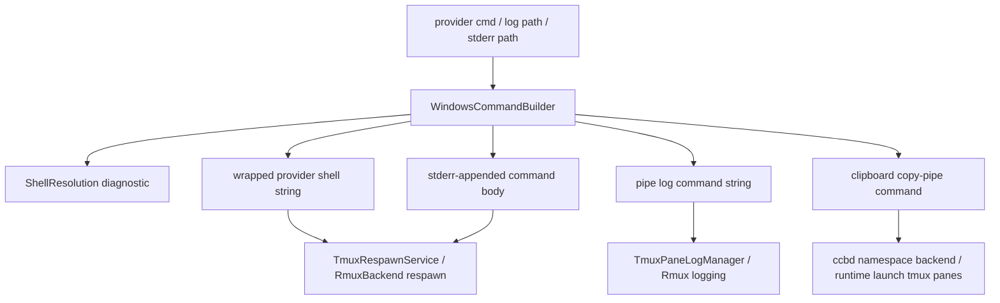

# windows-shell-log-builder feature design

## 0. 术语约定

| 术语 | 定义 | 防冲突结论 |
|---|---|---|
| Windows command builder | Windows Runtime Boundary 内负责 shell 包装、pipe/log 命令和 stderr redirection 的构造器。 | 不让 ccbd / CLI / provider runtime 继续拼 PowerShell、cmd、`sh -lc` 或 `tee -a` 字符串。 |
| shell resolution | 从用户 override、tmux default-shell、进程环境和平台 fallback 中选择实际 shell/flags 的过程。 | 现有 `CCB_TMUX_SHELL` / `CCB_TMUX_SHELL_FLAGS` 兼容保留，`resolve_shell()` 必须返回可持久化的 `ShellResolution`。 |
| provider command wrapper | 把 provider 启动命令包装成 backend 可执行 shell string 的边界。 | `wrap_provider_command(cmd, cwd)` 是 shell quoting 的唯一入口；调用方只传业务命令和 cwd。 |
| pipe log command | mux `pipe-pane` 消费 stdin 并追加到 pane log 文件的命令。 | Windows 下不能使用 Unix-only `tee -a`；Unix 兼容实现即使仍用 `tee`，也只能藏在 builder 内部。 |
| stderr redirection | provider command body 追加 stderr log 的命令片段。 | 复用同一 helper，按 shell 语义处理路径、父目录和 redirection，不在 respawn / backend / launcher 各自拼接。 |
| clipboard pipe command | tmux copy-mode `copy-pipe-and-cancel` 使用的剪贴板命令。 | 这是同一 shell 边界上的派生 cleanup，不是新 capability；当前在两个业务模块内联 `sh -lc`，本 feature 只把它收敛到统一 builder/helper。 |

术语 grep / CodeGraph 结果：

- `lib/terminal_runtime/tmux_respawn.py` 已有 `append_stderr_redirection()`、`resolve_shell()`、`resolve_shell_flags()`、`build_shell_command()`，但它们仍是 tmux 命名 helper，且 Windows 诊断不完整。
- `lib/terminal_runtime/tmux_respawn_service.py` 已把 shell 解析和 stderr redirection 注入为 dependency，适合作为 builder 接入点。
- `lib/terminal_runtime/tmux_logs.py` 的 `pipe_pane_output()` 仍直接拼 `tee -a {log_path}`。
- `lib/ccbd/services/project_namespace_runtime/backend.py` 与 `lib/cli/services/runtime_launch_runtime/tmux_panes.py` 各自内联 `_CLIPBOARD_PIPE_COMMAND = "sh -lc ..."`。
- `lib/terminal_runtime/env.py` 的 `default_shell()` Windows 路径优先 `pwsh` / `powershell`，但没有暴露 shell source、candidate list 或 fallback reason。

## 1. 决策与约束

### 需求摘要

本 feature 为 Windows Runtime Boundary 引入可测试的 shell/log command builder，集中承接 roadmap §4.4 的三类能力：

```python
class WindowsCommandBuilder(Protocol):
    def wrap_provider_command(self, cmd: str, *, cwd: str | None) -> str: ...
    def build_pipe_log_command(self, log_path: Path) -> str: ...
    def append_stderr_redirection(self, cmd: str, stderr_log_path: str | None) -> tuple[str, str | None]: ...
```

成功标准：

- `wrap_provider_command()` 统一处理 Windows shell string、cwd 和 quoting；调用层不拼 PowerShell/cmd 字符串。
- `build_pipe_log_command()` 替代 `tmux_logs.py` 里的直接 `tee -a`；Windows 分支使用 Windows-safe append primitive。
- `append_stderr_redirection()` 从 tmux-specific helper 升级为 command-builder 能力；父目录创建、路径归一化和 redirection syntax 可单测。
- 默认 shell 选择可诊断：至少能说明 chosen shell、source、flags、candidate availability，以及 user override / fallback reason。
- `backend.py` 和 `tmux_panes.py` 的 clipboard pipe command 不再各自内联 `sh -lc`；调用层只消费 builder/helper 生成的命令。该项是为满足“业务层不拼 shell 字符串”的派生 cleanup，不新增 clipboard capability。
- 当前 tmux 路径行为不漂移；非 Windows 上的现有 shell/log 语义由 builder 内部兼容。

明确不做：

- 不实现 `RmuxBackend`、Rmux CLI/SDK 调用或 rmux daemon lifecycle。
- 不改 provider session payload、namespace schema、ccbd control-plane transport、accelerator guard、job object 或 process liveness。
- 不把 foreground attach 改成 mux-agnostic attach；attach 行为留给后续 `ccbd-rmux-namespace-lifecycle`。
- 不删除 `pane_placeholder_argv()` / `pane_placeholder_cmd()`；本 feature 只接管 shell/log command construction。
- 不改变 provider completion parser 或 capture output 语义。
- 不引入全局依赖或外部 shell 包；只使用标准库、现有 runtime helper 和系统 shell。

### 复杂度档位

- 兼容性：L3。当前 Linux/macOS/WSL tmux 行为必须不漂移，同时 Windows 命令不能再依赖 Unix shell 工具。
- 可测试性：verified。shell choice、shell command 字符串、path quoting、stderr redirection 和 caller wiring 都能通过 unit tests 证伪。
- 健壮性：L2。只构造本地命令，不新增进程 supervision；但 quoting / path handling 错误会直接破坏 provider launch 和日志。
- 安全性：inherited。处理的是本地路径和本机 shell 命令；必须避免通过未转义 path/cwd 注入 shell。

### 方案深度 pre-pass

候选：

1. 在 `tmux_logs.py`、`tmux_respawn.py`、`backend.py`、`tmux_panes.py` 各自补 Windows 分支。
2. 把 shell wrapping、pipe log、stderr redirection 和 clipboard pipe command body 收敛到一个 runtime boundary builder，由现有 service 注入消费。

选择第二种。原因是 roadmap 已明确“Windows 平台差异必须集中在 runtime boundary”，而当前风险正是 `sh -lc` / `tee -a` / PowerShell/cmd quoting 散落在业务层。转正条件：实现阶段如果发现 clipboard copy-pipe 与 provider wrapper 的 shell 语义不同，可以在同一 builder 模块下增加 internal helper，但不得把平台命令拼接退回调用层。

### Top 3 风险与缓解

1. **Windows quoting 破坏 provider command / log path**：所有 path/cwd/command body 都由 builder 处理；测试覆盖空格、引号、反斜杠、Unicode-safe text 和 shell metachar。
2. **默认 shell 选择不可诊断**：引入 `ShellResolution` 记录 chosen shell、flags、source、candidate list 和 fallback reason；诊断输出不靠推测。
3. **迁移后 Unix tmux 行为漂移**：非 Windows 兼容分支和现有 `tmux_respawn` / `tmux_logs` tests 作为回归；builder 可在内部继续使用等价 Unix command，但调用层不再直接拼。

### 非显然依赖与关键假设

- 依赖 `mux-backend-contract` design-review 已通过；本 feature 只建立 Windows runtime command seam，不要求 contract implementation 已完成。
- 假设 `TmuxRespawnService` 的 dependency injection 形态保留，可把 builder 方法注入进去而不重写 respawn service。
- 假设 `tmux pipe-pane` / Rmux 等价 pipe API 都接受“单个 shell command string”作为 pipe target；若 Rmux API 需要 argv 形式，Rmux adapter 必须在本 builder 之上转换，不让调用层分叉。
- 假设 `pwsh`、`powershell.exe`、`powershell`、`cmd` 的发现可通过 `shutil.which` 或注入式 probe 单测，不依赖真实 Windows 环境。
- 假设 clipboard copy-pipe 在非 Windows 环境仍可保留 wl-copy/xclip/xsel/pbcopy 兼容逻辑，但逻辑归属从业务模块迁移到 builder。

## 2. 名词与编排

### 2.1 名词层

#### 现状

- `TmuxRespawnService.respawn_pane()` 调用注入的 `append_stderr_redirection_fn`、`resolve_shell_fn`、`resolve_shell_flags_fn`、`build_shell_command_fn`；默认注入来自 `tmux_respawn.py`。
- `tmux_respawn.py` 使用 `shlex.quote()` 构造单个 shell command；这适合 POSIX shell，不足以表达 PowerShell/cmd 的 quoting。
- `tmux_logs.py` 直接执行 `['pipe-pane', '-o', '-t', pane_id, f'tee -a {log_path}']`，Windows 原生没有可靠 `tee -a`。
- `backend.py` 和 `tmux_panes.py` 复制同一段 `_CLIPBOARD_PIPE_COMMAND`，命令开头固定 `sh -lc`。
- `env.default_shell()` 返回 `(shell, flags)`，但调用方无法知道是用户 override、tmux default-shell、process shell 还是 fallback。

#### 变化

新增候选模块：`lib/terminal_runtime/windows_shell_log_builder.py`。

核心接口：

```python
class ShellResolution(TypedDict):
    shell: str
    flags: list[str]
    source: Literal["env-override", "tmux-default-shell", "process-shell", "platform-default", "fallback"]
    candidates: dict[str, bool]
    diagnostic: str

class WindowsCommandBuilder(Protocol):
    def wrap_provider_command(self, cmd: str, *, cwd: str | None) -> str: ...
    def build_pipe_log_command(self, log_path: Path) -> str: ...
    def append_stderr_redirection(self, cmd: str, stderr_log_path: str | None) -> tuple[str, str | None]: ...
```

模块级诊断 helper：

```python
def resolve_shell(*, env_shell: str, tmux_default_shell: str, process_shell: str, fallback_shell: str) -> ShellResolution: ...
```

`WindowsCommandBuilder` 负责消费 `ShellResolution` 并渲染最终命令；`resolve_shell()` 是稳定的诊断读取面，供 builder、测试和后续 doctor/debug payload 复用。

实现规则：

- `wrap_provider_command(cmd, cwd)` 接收未包装的 provider command body，返回完整 shell command string；空 cmd fail-fast。
- tmux `respawn-pane` 的 `full_command: str` 直接消费 `wrap_provider_command()` 输出；实现不得先产出 argv 再在调用层临时 join。
- Windows shell 选择顺序保持现有兼容源：`CCB_TMUX_SHELL` / `CCB_TMUX_SHELL_FLAGS` > tmux default-shell > process `SHELL` / `ComSpec` > platform default。
- platform default Windows candidate 至少覆盖 `pwsh`、`powershell.exe` / `powershell`、`cmd`；选择结果必须携带 source 和 fallback reason。
- shell-specific flags 由 builder 表驱动：PowerShell family 使用 no-profile command mode，cmd 使用 command mode，POSIX shell 保持现有 `-c` / `-l -c` 语义。
- cwd 只能通过 shell-safe literal 或 backend-native cwd 参数表达；调用方不得把 `cd <cwd> &&` 拼进业务 command。
- `build_pipe_log_command(log_path)` 负责创建父目录所需前置条件或要求 caller 先 prepare path；返回 command string 时必须对 path 做 shell-specific quoting。
- Windows pipe log command 必须追加 stdin 到 `log_path`，不能依赖 `tee -a`、`cat`、`mktemp` 或 POSIX redirection。
- 非 Windows 兼容实现可以继续生成 `tee -a` 等价命令，但该字符串只能出现在 builder 模块和 builder tests 中。
- `append_stderr_redirection(cmd, stderr_log_path)` 返回 `(cmd, None)` 或 `(wrapped_cmd, resolved_path)`；非空路径必须 expanduser/resolve 并创建父目录。
- stderr redirection syntax 由 shell family 决定；实现不得假设 POSIX `2>>` 在 PowerShell/cmd 下等价。
- clipboard pipe command 的平台 body 迁入 builder 模块；`backend.py` / `tmux_panes.py` 只能调用 helper 或注入 builder，不再复制 `_CLIPBOARD_PIPE_COMMAND`。

Interface 设计检查：

- Module / interface：`terminal_runtime` 暴露 command builder；tmux/rmux backend、ccbd namespace runtime、runtime launch 只消费 builder。
- Seam placement：shell selection、PowerShell/cmd quoting、pipe log append、stderr redirection 和 clipboard copy-pipe 都集中在 runtime boundary。
- Depth / locality：这是 deep seam；它隔离平台 shell 语义，而不是给每个 caller 加 `if windows`。
- Dependency strategy：in-process + injectable probes；单测可注入 `is_windows_fn`、`which_fn`、env 和 default shell output。
- Adapter：无生产 adapter；builder 是被 tmux adapter / RmuxBackend 消费的本地 helper。

### 2.2 编排层



流程级约束：

- 顺序：provider command body 先做 stderr redirection，再由 shell wrapper 包装；cwd 不嵌入 command body。
- 幂等性：构造同一 command/path/env 时输出稳定；父目录创建可重复。
- 兼容性：现有 tmux respawn service 的 public 行为不变；只替换注入函数来源。
- 诊断：shell resolution diagnostic 至少包含 shell、flags、source、candidate list；doctor 或 debug payload 后续可直接消费。
- 可观测点：tests 断言调用层的 pipe-pane 不再硬编码 `tee -a`，clipboard policy 不再携带复制的 `sh -lc` 常量。
- 扩展点：RmuxBackend 后续只接入 builder，不重新实现 shell quoting。

### 2.3 挂载点清单

- `lib/terminal_runtime/windows_shell_log_builder.py`：新增 command builder；删除后 Windows shell/log 语义无集中归属。
- `lib/terminal_runtime/env.py`：补默认 shell candidate / diagnostic 所需的可注入选择逻辑；删除后 Windows default shell 仍不可诊断。
- `lib/terminal_runtime/tmux_respawn.py` / `tmux_respawn_service.py`：把现有 shell helper 迁入或委托给 builder，保持 service 注入形态。
- `lib/terminal_runtime/tmux_logs.py`：`pipe_pane_output()` 使用 builder 的 `build_pipe_log_command()`，不直接拼 `tee -a`。
- `lib/terminal_runtime/tmux_backend_runtime/services.py`：集中装配 builder 到 log manager / respawn service。
- `lib/ccbd/services/project_namespace_runtime/backend.py`：server policy 的 clipboard copy-pipe 命令从 builder 读取。
- `lib/cli/services/runtime_launch_runtime/tmux_panes.py`：detached server policy 的 clipboard copy-pipe 命令从 builder 读取。

### 2.4 推进策略

1. **builder contract**：新增 builder module、`ShellResolution`、Windows shell family/flags/candidate 规则和 unit tests。
   退出信号：`pwsh`、`powershell.exe` / `powershell`、`cmd`、user override、fallback 的选择与诊断可断言。
2. **stderr redirection extraction**：把 `append_stderr_redirection()` 从 tmux-specific helper 收敛到 builder，保留旧 import 兼容或薄 wrapper。
   退出信号：现有 `test_terminal_runtime_tmux_respawn.py` 继续通过，新增 Windows syntax/path tests 通过。
3. **provider wrapper wiring**：让 `TmuxRespawnService` 注入 builder 方法；`wrap_provider_command()` 生成的 shell string 取代 POSIX-only `build_shell_command()`。
   退出信号：respawn service tests 证明 shell/cwd/stderr 顺序稳定，默认 shell diagnostic 可读取。
4. **pipe log command wiring**：让 `TmuxPaneLogManager` 通过 builder 构造 pipe command；Windows tests 证明无 `tee -a`。
   退出信号：`test_terminal_runtime_tmux_logs.py` 更新为断言 builder command 注入，Windows builder unit test 覆盖 append path。
5. **clipboard command de-dup**：把两个 `_CLIPBOARD_PIPE_COMMAND` 常量替换为 builder/helper 输出。
   退出信号：`backend.py` 与 `tmux_panes.py` 不再复制 `sh -lc` 常量；相关 server policy tests 继续通过。
6. **regression and guard**：补 guard grep / unit tests，防止业务层新增 `sh -lc`、PowerShell/cmd 字符串或 `tee -a`。
   退出信号：focused pytest 和 YAML 校验通过；剩余 Unix-only 字符串仅允许出现在 builder module/tests 内。

### 2.5 结构健康度与微重构

##### 评估

- 文件级 — `lib/terminal_runtime/tmux_respawn.py`：当前 helper 体量小，适合作为兼容 wrapper 或迁移源；不应继续承载 Windows-specific policy。
- 文件级 — `lib/terminal_runtime/tmux_logs.py`：职责是 pane log manager，应该只调用 builder，不处理 shell family。
- 文件级 — `lib/ccbd/services/project_namespace_runtime/backend.py`：文件已承担 namespace/session/window/pane 操作；本 feature 只替换 clipboard command provider，不做拆分。
- 文件级 — `lib/cli/services/runtime_launch_runtime/tmux_panes.py`：同时处理 detached pane/server policy；本 feature 只去重 clipboard command，不重构 pane allocation。
- 目录级 — `lib/terminal_runtime/` 已有多个单职责 runtime helper；新增一个 command builder 文件比扩大 `env.py` 或 `tmux_respawn.py` 更符合单一职责。

##### 结论：做小型边界抽取，不做行为微重构

抽取 command builder 是本 feature 的必要实现，不属于额外重构；拆分 ccbd namespace backend、runtime launch pane allocation 或 provider session schema 均超出范围。

## 3. 验收契约

### 3.1 关键场景清单

| ID | 输入 / 触发 | 期望可观察结果 | 证据类型 |
|---|---|---|---|
| AC-001 | Windows shell candidate matrix | user override、tmux default-shell、process shell、platform default、fallback 都产出可诊断 `ShellResolution` | unit test |
| AC-002 | provider command body + cwd | `wrap_provider_command()` 返回 shell-safe shell string；cwd 不通过未转义 `cd &&` 拼接 | unit test |
| AC-003 | stderr log path 非空 | 父目录创建，返回 resolved path，redirection syntax 与 shell family 匹配 | unit test |
| AC-004 | `pipe-pane` 日志命令 | Windows 下不含 `tee -a` / POSIX-only 工具，path quoting 正确，日志追加语义可断言 | unit test |
| AC-005 | tmux pane log manager | `TmuxPaneLogManager` 使用 builder 注入的 pipe command，现有 refresh/trim/info 行为不变 | regression |
| AC-006 | respawn service | stderr redirection → shell wrap → `respawn-pane` 顺序不变，默认 shell diagnostic 可观测 | regression |
| AC-007 | clipboard copy-pipe | `backend.py` / `tmux_panes.py` 不再内联复制 `sh -lc` 常量，copy-mode binding 行为保持 best-effort | unit / diff review |
| AC-008 | platform leakage guard | 业务层不新增 `sh -lc`、`tee -a`、PowerShell/cmd 拼接；允许集中在 builder module/tests | grep guard / review |

### 3.2 明确不做的反向核对项

- 不应新增 `RmuxBackend`、`rmux_*` production module 或 Rmux daemon 调用。
- 不应把 `pipe-pane` 日志改成 provider completion capture 解析。
- 不应改变 `pane_placeholder_argv()` / `pane_placeholder_cmd()` 的语义。
- 不应修改 provider session payload、namespace schema、ccbd transport、job object 或 process liveness。
- 不应让 caller 通过 `if is_windows()` 自行选择 PowerShell/cmd。
- 不应把 shell diagnostic 只写成注释或文档，必须有可测试数据。

### 3.3 Acceptance Coverage Matrix

| Scenario | Covered By Step | Evidence Type | Command / Action | Core? |
|---|---|---|---|---|
| AC-001 shell diagnostic | S1 | unit test | `test/test_terminal_runtime_windows_shell_log_builder.py` | yes |
| AC-002 provider wrapper | S1, S3 | unit test | builder tests + respawn service tests | yes |
| AC-003 stderr redirection | S2 | unit test | builder tests + existing tmux_respawn tests | yes |
| AC-004 pipe log command | S4 | unit test | builder tests | yes |
| AC-005 pane log manager wiring | S4 | regression | `test/test_terminal_runtime_tmux_logs.py` | yes |
| AC-006 respawn service wiring | S3 | regression | `test/test_terminal_runtime_tmux_respawn_service.py` | yes |
| AC-007 clipboard command de-dup | S5 | unit/diff review | `test/test_v2_project_namespace_backend.py`、`test/test_v2_project_namespace_state.py`、`test/test_v2_runtime_launch.py` focused clipboard selectors | yes |
| AC-008 leakage guard | S6 | grep/review | focused `rg` guard + code review | yes |

### 3.4 DoD Contract

| ID | 要求 | 证据 | 阻塞级别 |
|---|---|---|---|
| DOD-DESIGN-001 | design/checklist/review 完整，且遵守 roadmap §4.4 `WindowsCommandBuilder` 契约 | design review | blocking |
| DOD-IMPL-001 | builder 提供 `wrap_provider_command`、`build_pipe_log_command`、`append_stderr_redirection`，并有 Windows shell diagnostic | unit tests | blocking |
| DOD-IMPL-002 | `TmuxRespawnService` 与 `TmuxPaneLogManager` 通过 builder/注入消费 command，不在业务层拼 shell/log 字符串 | diff review / tests | blocking |
| DOD-IMPL-003 | `backend.py` 与 `tmux_panes.py` 不再复制 `_CLIPBOARD_PIPE_COMMAND = "sh -lc ..."`；这作为派生 cleanup 通过 existing clipboard regression 收口 | diff review / grep guard | blocking |
| DOD-IMPL-004 | Windows `pipe-pane` log command 不使用 `tee -a`，stderr redirection 不假设 POSIX `2>>` | unit tests | blocking |
| DOD-IMPL-005 | 当前 tmux respawn/log/runtime launch 抽样回归通过或记录既有基线红灯 | pytest | blocking |
| DOD-REVIEW-001 | code review passed 且无 unresolved blocking | review report | blocking |
| DOD-QA-001 | QA 覆盖 shell matrix、stderr、pipe log、clipboard de-dup、tmux 回归和 leakage guard | QA report | blocking |
| DOD-ACCEPT-001 | acceptance 回写 roadmap item，并记录 shell/log quoting 规则是否需要 `cs-keep` 沉淀 | acceptance report | blocking |

Validation Commands:

| ID | 命令 | 目的 | 核心性 | 失败处理 |
|---|---|---|---|---|
| CMD-001 | `python ".codestable/tools/validate-yaml.py" --file ".codestable/features/2026-07-20-windows-shell-log-builder/windows-shell-log-builder-checklist.yaml" --yaml-only` | checklist YAML 合法性 | core | fix-or-block |
| CMD-002 | `python ".codestable/tools/validate-yaml.py" --file ".codestable/roadmap/windows-rmux-native-backend/windows-rmux-native-backend-items.yaml"` | roadmap items 回写合法性 | core | fix-or-block |
| CMD-003 | `python -m pytest -q test/test_terminal_runtime_windows_shell_log_builder.py` | builder shell matrix、pipe log、stderr redirection、diagnostic | core | fix-or-block |
| CMD-004 | `python -m pytest -q test/test_terminal_runtime_tmux_respawn.py test/test_terminal_runtime_tmux_respawn_service.py test/test_terminal_runtime_tmux_logs.py` | respawn/log helper 回归 | core | fix-or-block |
| CMD-005 | `python -m pytest -q test/test_v2_project_namespace_backend.py test/test_v2_project_namespace_state.py test/test_v2_runtime_launch.py -k "clipboard or copy-pipe or set-clipboard"` | clipboard / server policy 真实回归入口，覆盖 copy-pipe 去重与 set-clipboard policy | core | document-baseline |
| CMD-006 | `rg -n "sh -lc|tee -a|powershell\\.exe|pwsh|cmd /" "lib/ccbd/services/project_namespace_runtime/backend.py" "lib/cli/services/runtime_launch_runtime/tmux_panes.py" "lib/terminal_runtime/tmux_logs.py"` | 调用层 Unix/Windows shell 字符串泄漏 guard | core | fix-or-block |

Required Artifacts：design、checklist、design-review、builder module、builder tests、respawn/log manager wiring tests、clipboard de-dup tests、leakage guard output、items.yaml 回写。

### 3.5 自我批判结论

- 可证伪性：核心风险都可由 unit/guided grep 证明，不依赖真实 Rmux。
- 步骤原子性：builder、stderr、provider wrapper、pipe log、clipboard、guard 六步独立。
- 最弱依赖：Windows shell quoting 最容易过拟合；设计要求通过 shell family matrix 和注入式 probe 覆盖。
- 证据完整性：diagnostic 不是文档承诺，必须有可读数据结构或等价测试断言。
- 交付物可核验性：实现后可从新增 builder module、调用层 diff、grep guard 和 pytest 输出反查所有承诺。
- 清洁度规则：不新增临时 TODO/FIXME、调试输出、注释掉代码、死 import；不复制 capability artifact payload；不把 Windows 分支散落到调用层。

## 4. 与项目级架构文档的关系

- 本 feature 消费 roadmap §4.4 `WindowsCommandBuilder` 契约，为后续 `rmux-backend-core` 和 `rmux-send-capture-logging` 提供 shell/log 边界。
- 本 feature 与 `windows-namespace-ipc-schema` 平行：前者定义 namespace/IPc schema，本文定义 command construction；两者都属于 Windows Runtime Boundary。
- 后续 `rmux-backend-core` 不得重新实现 shell quoting / pipe log / stderr redirection；应消费本 builder。
- 若实现阶段验证出稳定的 Windows shell/log quoting 规则，acceptance 后建议用 `cs-keep` 沉淀。
