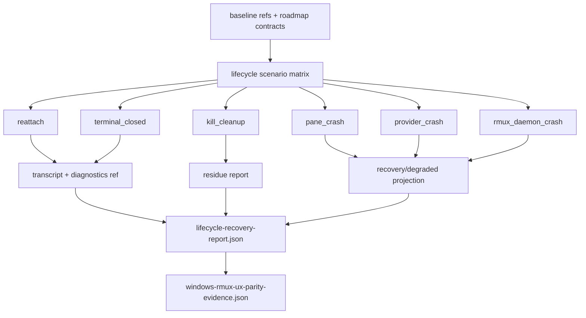

# windows-rmux-lifecycle-recovery-ux-parity feature design

## 0. 术语约定

| 术语 | 定义 | 防冲突结论 |
|---|---|---|
| lifecycle continuity | 用户关闭/重开 WezTerm、重新 attach、执行 kill 或遇到 runtime 异常时，project namespace、pane/provider/rmux daemon 状态能被观察、恢复或明确 degraded。 | 不是自动恢复能力的同义词；本 feature 首先要求 UX path 可证伪。 |
| terminal closed survival | 关闭 WezTerm GUI 宿主后，ccbd namespace/provider/rmux state 的预期存活或 degraded 状态。 | 不等同于 `ccb kill`，也不能把 GUI 关闭误算成 project cleanup。 |
| lifecycle transcript | 每个 lifecycle scenario 的机器或手工 transcript，记录 start state、action、expected observable、observed result、diagnostics ref 和 verdict。 | 不用自由 Markdown 替代细粒度 JSON report。 |
| residue report | `ccb kill` 或 crash/degraded 场景后的残留扫描记录，覆盖 ccbd endpoint、TCP token、rmux namespace/session、provider/job/process residue。 | 复用 full-chain smoke / validation matrix cleanup 口径，不重新发明 residue 字段。 |
| degraded diagnostics | 无法或不应自动恢复时，doctor/ping/project view/diagnostics bundle 中可见的 failure class、recovery action 和下一步建议。 | crash 可通过 degraded/partial，但必须可证伪，不能口头通过。 |
| lifecycle_recovery parity dimension | roadmap §4.1 `WindowsRmuxUxParityEvidence.parity_dimension` 的本 feature 固定值。 | 最终证据 JSON 必须写 `lifecycle_recovery`。 |

Brainstorm admission：`.codestable/features/2026-07-25-windows-rmux-lifecycle-recovery-ux-parity/windows-rmux-lifecycle-recovery-ux-parity-brainstorm.md` 已 `confirmed`，owner 已批准采用 **UX continuity first**，crash 第一版通过标准为“诊断可证伪即可通过”。

## 1. 决策与约束

### 需求摘要

本 feature 不默认重写 `rmux-supervision-recovery`、namespace lifecycle 或 validation matrix。它在这些 accepted baseline 之上，建立 Windows/rmux/WezTerm lifecycle recovery UX parity 的证据闭环：terminal closed、reattach、kill cleanup、pane/provider/rmux daemon crash 之后，用户能看到系统是恢复、仍存活、清理完成，还是明确 degraded，并能从 diagnostics 反查原因和下一步。

成功标准：

- 产出 `.codestable/features/2026-07-25-windows-rmux-lifecycle-recovery-ux-parity/evidence/lifecycle-recovery-report.json`，覆盖 `reattach`、`terminal_closed`、`kill_cleanup`、`pane_crash`、`provider_crash`、`rmux_daemon_crash`。
- 产出 `.codestable/features/2026-07-25-windows-rmux-lifecycle-recovery-ux-parity/evidence/windows-rmux-ux-parity-evidence.json`，符合 roadmap §4.1，且 `parity_dimension=lifecycle_recovery`。
- `terminal_closed` 能区分“关闭 GUI 宿主”与“kill project”；不得把 WezTerm 关闭等同 cleanup success。
- `reattach` 能证明重新 `ccb` attach 回到正确 namespace/pane，或记录 blocked/partial 与 diagnostics。
- `kill_cleanup` 覆盖 ccbd endpoint、TCP token、rmux namespace/session、provider/job/process residue。
- `pane_crash`、`provider_crash`、`rmux_daemon_crash` 至少有 transcript、diagnostics ref、failure class、recovery/degraded action 和 residual risk。
- shared rmux daemon 不自动 kill/restart/refresh；owned/project daemon 才允许消费既有 evidence 进入 recovery。

明确不做：

- 不默认重构 `lib/ccbd/supervision/*` 的 recovery policy 或 daemon ownership policy。
- 不重做 `ccbd-rmux-namespace-lifecycle`、`ccbd-windows-full-chain-smoke` 或 `rmux-windows-validation-matrix`。
- 不把真实 provider auth/quota/credential failure 归为 rmux/system failure。
- 不重新设计 pane identity/layout 或 output/capture contract；本 item 消费 parent design evidence。
- 不提升 support tier，不修改 install.ps1、npm gate、release guard 或 docs 承诺。
- 不把 skipped/headless transcript 伪装成 native Windows + WezTerm live pass。

### Baseline reuse / delta

复用 baseline：

- `rmux-supervision-recovery` accepted：namespace、pane、process/job、daemon evidence 已进入 supervision ledger；shared daemon degraded-only、owned/project daemon recovery 边界已审过。
- `ccbd-rmux-namespace-lifecycle` accepted：namespace state、foreground attach、kill、doctor、ping、project view 已读 canonical namespace projection。
- `ccbd-windows-full-chain-smoke` accepted：native Windows true-host start / ping / doctor / ask / kill 与 cleanup evidence 已通过。
- `rmux-windows-validation-matrix` accepted：true-host matrix、manual transcript parser、failure classification、cleanup/residue evidence 已存在。
- Parent design-review passed：`windows-rmux-pane-identity-layout-parity` 和 `windows-rmux-output-capture-parity` 的 design 已定义 identity/capture evidence 输入。

本 feature 增量：

- 将 lifecycle UX scenarios 投影为统一 report 和 UX evidence JSON。
- 对 terminal closed、reattach、kill cleanup 与 crash/degraded diagnostics 建立可证伪验收口径。
- 只在 evidence 证明日用路径缺口时，纳入最小 production 修复；否则保持 evidence-first。
- 为 supportability feature 提供 `evidence/windows-rmux-ux-parity-evidence.json` 这一唯一可消费机器接口；细粒度 lifecycle report 只作为该 JSON 的 artifact ref。

### 复杂度档位

- 行为兼容 = L3。lifecycle 状态错误会污染 attach、kill、diagnostics 和 support tier。
- 外部依赖 = mixed。核心 schema/fixture 可 headless 运行；terminal closed 和 WezTerm attach 需要 native Windows + WezTerm live 或手工 transcript。
- 可测试性 = verified。report schema、failure classification、residue fields、diagnostics refs 可测试；GUI survival lane 可 blocked/partial。
- 数据完整性 = high。residue 和 degraded diagnostics 不能由自由文本替代。

### Top 3 风险与缓解

1. **风险：把 UX evidence feature 扩成 recovery policy 重构。**
   缓解：design 先交付 report/schema/transcript；生产修复只在 evidence 证明具体缺口时最小纳入。
2. **风险：terminal closed 与 kill cleanup 混淆。**
   缓解：report scenario 枚举分离 `terminal_closed` 与 `kill_cleanup`；前者要求 survival/degraded，后者要求 residue clean。
3. **风险：crash 被“valid non-success”含糊通过。**
   缓解：每个 crash scenario 必须有 diagnostics ref、failure class、recovery/degraded action 和 residual risk。

### 非显然依赖与关键假设

- parent `windows-rmux-pane-identity-layout-parity` 与 `windows-rmux-output-capture-parity` 当前 design-review passed，但实现前仍需按 epic goal 的实际状态判断 implementation readiness。
- 如果 native Windows + WezTerm 环境不可用，`terminal_closed` 和 GUI reattach lane 不能写 full pass，只能 `partial` 或 `blocked`。
- 假设 existing doctor/ping/project view/diagnostics bundle 是 diagnostics ref 的候选 canonical surfaces；design 不预设只能用其中一个。
- 假设真实 provider auth/quota failure 只影响 provider lane；本 feature 记录为 `provider_failure`，不降低 rmux lifecycle 系统判断。
- 假设 shared daemon 的安全边界优先于“自动恢复体验”；shared daemon crash 的可接受结果是 degraded diagnostics，而不是自动 kill/restart。

## 2. 名词与编排

### 2.1 名词层

#### 现状

- `lib/ccbd/supervision/recovery.py`、`recovery_transitions.py`、`recovery_events.py` 和相关 tests 已表达 pane/process/job/namespace/daemon 的 recovery/degraded 语义。
- `lib/ccbd/services/runtime_runtime/attach.py`、`attach_values.py`、`attach_models.py` 提供 runtime attach 值和 attach path。
- `lib/ccbd/services/project_namespace_runtime/*` 与 `project_namespace_state_runtime/models.py` 保存 canonical namespace projection、namespace ref、layout state 和 lifecycle events。
- `lib/ccbd/handlers/ping_runtime/*`、`lib/ccbd/handlers/project_view.py`、`lib/cli/services/doctor_runtime/*`、diagnostics bundle tests 已提供用户可见 diagnostics surfaces。
- `scripts/rmux_windows_validation_matrix.py` 和 artifacts 中已有 true-host transcript/report 口径，覆盖 full-chain smoke 的 start/ping/doctor/ask/kill 和 residue evidence。
- 当前 roadmap §4.6 定义 `WindowsRmuxLifecycleUxReport`，但 feature 级还没有统一 report 和 `lifecycle_recovery` UX evidence JSON。

#### 变化

新增 feature evidence contract：

```python
class WindowsRmuxLifecycleUxCase(TypedDict):
    scenario: Literal[
        "reattach",
        "terminal_closed",
        "kill_cleanup",
        "pane_crash",
        "provider_crash",
        "rmux_daemon_crash",
    ]
    start_state: str
    action: str
    expected_observable: str
    observed_result: str
    verdict: Literal["pass", "partial", "failed", "blocked"]
    failure_class: Literal[
        "none",
        "rmux_unavailable",
        "wezterm_gui_unavailable",
        "provider_failure",
        "system_failure",
        "test_design_failure",
        "unsupported_capability",
    ]
    recovery_action: Literal[
        "none",
        "reattached",
        "cleanup_completed",
        "recovered",
        "degraded",
        "blocked",
    ]
    cleanup_residue: "LifecycleCleanupResidue"
    diagnostics_ref: str
    transcript_ref: str
    residual_risks: list[str]

class LifecycleRecoveryReport(TypedDict):
    schema_version: Literal[1]
    baseline_refs: dict[str, str]
    cases: list[WindowsRmuxLifecycleUxCase]
    lifecycle_notes: list[str]
    residual_risks: list[str]

class LifecycleCleanupResidue(TypedDict):
    endpoint_removed: bool | None
    token_removed: bool | None
    rmux_namespace_removed: bool | None
    rmux_session_removed: bool | None
    owned_process_residue: list[str]
    provider_process_residue: list[str]
    provider_job_residue: list[str]
    retained_reason: str | None
```

`LifecycleRecoveryReport.cases[]` 的每个元素都是 roadmap §4.6 `WindowsRmuxLifecycleUxReport` 单 case record 的 superset。validator 必须逐 case 校验 §4.6 required fields：`scenario`、`start_state`、`action`、`expected_observable`、`verdict`、`cleanup_residue`、`diagnostics_ref`；本 design 额外要求 `observed_result`、`failure_class`、`recovery_action`、`transcript_ref` 和 `residual_risks`，用于支持 degraded diagnostics 和 failure classification。

`LifecycleCleanupResidue` 复用 validation matrix cleanup 语义：`endpoint_removed`、`token_removed`、`rmux_namespace_removed` 对齐已有字段；`rmux_session_removed` 是 validation matrix `session_removed` 的本 dimension 显式命名；`owned_process_residue` 保留原义，并补充 provider process/job residue 和 retained reason。

示例：

```json
{
  "scenario": "rmux_daemon_crash",
  "start_state": "owned project daemon with active namespace and provider runtime",
  "action": "terminate owned rmux daemon",
  "expected_observable": "project diagnostics shows recovered or degraded with daemon ownership evidence",
  "observed_result": "degraded diagnostics recorded shared-daemon boundary",
  "verdict": "partial",
  "failure_class": "none",
  "recovery_action": "degraded",
  "cleanup_residue": {
    "endpoint_removed": false,
    "token_removed": false,
    "rmux_namespace_removed": null,
    "rmux_session_removed": null,
    "owned_process_residue": [],
    "provider_process_residue": ["provider-1234"],
    "provider_job_residue": [],
    "retained_reason": "degraded boundary retains provider process until owner action"
  },
  "diagnostics_ref": "artifacts/.../diagnostics-bundle.json",
  "transcript_ref": "artifacts/.../rmux-daemon-crash.json",
  "residual_risks": ["shared daemon is not automatically restarted"]
}
```

`verdict=partial` 且 `failure_class=none` 只允许用于设计允许的 degraded boundary，例如 shared daemon degraded-only 或 live GUI lane 缺少非系统失败的完整性证据；其他 partial/blocked 必须给出具体 `failure_class`。

UX evidence projection：

| Field | Contract |
|---|---|
| `schema_version` | 固定 `1` |
| `host_kind` | 固定 `native_windows`；headless/fake 只能作为 supporting artifact |
| `terminal_host` | 固定 `"wezterm"`；GUI 不可用不得改写本字段，只能通过 `failure_class="wezterm_gui_unavailable"`、`evidence_status=partial|blocked` 和非空 `residual_risks` 表达 |
| `backend_impl` | 固定 `rmux` |
| `control_plane` | 固定 `ccbd` |
| `parity_dimension` | 固定 `lifecycle_recovery` |
| `evidence_status` | `pass|partial|blocked|failed`；任一 core scenario failed 时不得 pass |
| `failure_class` | pass 为 `none`；环境、provider、system、test design failure 分类必须和 report case 对齐 |
| `artifacts` | 至少包含 `lifecycle_recovery_report`，建议包含 `manual_transcript`、`residue_report`、`diagnostics_bundle` |
| `residual_risks` | `partial|blocked|failed` 时必须非空 |

##### Interface 设计检查

- Module：feature evidence 放在 `.codestable/features/.../evidence/`；production recovery 只有 evidence 证明缺口时最小改动。
- Interface：supportability 只能消费 roadmap §4.1 UX evidence JSON，即 `evidence/windows-rmux-ux-parity-evidence.json`；`LifecycleRecoveryReport` 是私有细粒度证据，只能作为 `artifacts.lifecycle_recovery_report` 被引用，不作为下游公开消费接口。
- Seam：seam 位于 lifecycle transcript importer / report builder / diagnostics projection，不在 provider parser 或 backend resolver 中新增 policy。
- Depth / locality：lifecycle UX 是 deep contract，但第一版把恢复策略与可诊断 UX 分开，避免误杀 shared daemon。
- Dependency strategy：local-substitutable；headless fixtures 验 schema/classification/residue，native Windows + WezTerm transcript 验 GUI path。
- Adapter：可能新增测试/evidence adapter；不默认新增 production adapter。

### 2.2 编排层



流程级约束：

- `reattach` 先证明 namespace/pane identity 仍可定位，再证明 foreground attach path 可用；identity 不可定位时进入 diagnostics，不继续声称 attach pass。
- `terminal_closed` 必须记录关闭 GUI 前后 ccbd endpoint、namespace/rmux state、provider/job state；它不是 cleanup。
- `kill_cleanup` 必须走 cleanup/residue 口径，覆盖 ccbd endpoint、TCP token、rmux namespace/session、provider/job/process residue。
- `pane_crash` 和 `provider_crash` 消费 supervision ledger；恢复成功记录 `recovered`，不能恢复记录 `degraded` 或 `blocked`，但都必须有 diagnostics ref。
- `rmux_daemon_crash` 必须读取 daemon ownership evidence；shared daemon 只允许 degraded diagnostics 或外部恢复 evidence，owned/project daemon 才可记录 recovery。
- `provider_failure` 与 `system_failure` 分离；真实 provider auth/quota 不降低 rmux lifecycle 系统判断。
- UX evidence JSON 只汇总 report 结论；细粒度判断以 `lifecycle-recovery-report.json` 为权威。

### 2.3 挂载点清单

- `.codestable/features/2026-07-25-windows-rmux-lifecycle-recovery-ux-parity/evidence/lifecycle-recovery-report.json`：细粒度 lifecycle scenario report。
- `.codestable/features/2026-07-25-windows-rmux-lifecycle-recovery-ux-parity/evidence/windows-rmux-ux-parity-evidence.json`：roadmap §4.1 汇总 evidence record。
- `.codestable/features/2026-07-25-windows-rmux-lifecycle-recovery-ux-parity/evidence/manual-lifecycle-runbook.md`：native Windows + WezTerm GUI lane 的操作记录或 blocked 说明。
- `test/test_windows_rmux_lifecycle_recovery_parity.py`：report schema、scenario matrix、failure classification、residue field、UX evidence validator。
- 既有 tests：`test/test_ccbd_runtime_attach.py`、`test/test_ccbd_rmux_supervision_recovery.py`、`test/test_ccbd_diagnostics_bundle_rmux.py`、`test/test_rmux_windows_validation_matrix.py` 作为 baseline/guard。只有 evidence 证明缺口时才补 focused cases。

### 2.4 推进策略

1. **Baseline + schema**：引用 accepted recovery、namespace lifecycle、full-chain smoke、validation matrix、parent identity/capture design-review，并建立 lifecycle report schema。
   退出信号：baseline refs 指向存在的 acceptance/design-review artifact；validator 校验 roadmap §4.6 required fields、superset fields、`LifecycleCleanupResidue` 和 partial/blocked residual risk。
2. **Scenario reattach**：证明重新 `ccb` attach 回到正确 namespace/pane，或记录 identity/attach diagnostics 和 blocked/partial。
   退出信号：`scenario=reattach` case 有 transcript、diagnostics_ref、verdict、failure_class 和 residual_risks。
3. **Scenario terminal_closed**：证明关闭 WezTerm GUI 宿主后的 namespace/provider/rmux survival 或 degraded。
   退出信号：`scenario=terminal_closed` case 区分 GUI close 与 kill project；缺 native GUI 时只能 partial/blocked。
4. **Scenario kill_cleanup**：验证 `ccb kill` residue。
   退出信号：`LifecycleCleanupResidue` 覆盖 endpoint/token/rmux namespace/session/provider process/provider job/owned process residue 和 retained_reason。
5. **Scenario pane_crash**：消费 supervision ledger 验证 pane crash recovery/degraded diagnostics。
   退出信号：`scenario=pane_crash` case 有 recovery_action、diagnostics_ref、failure_class、residual_risks。
6. **Scenario provider_crash**：消费 provider/job/process evidence，分离 provider_failure 与 system_failure。
   退出信号：`scenario=provider_crash` case 不把 provider auth/quota/credential failure 写成 rmux system failure。
7. **Scenario rmux_daemon_crash**：消费 daemon ownership evidence，区分 shared degraded-only 与 owned/project recovery。
   退出信号：`scenario=rmux_daemon_crash` case 证明 shared daemon 不自动 kill/restart/refresh；owned/project daemon recovery 有 ownership evidence。
8. **UX evidence + scope guard**：生成 `windows-rmux-ux-parity-evidence.json` 并执行范围守护。
   退出信号：roadmap §4.1 required fields、enum、artifacts、residual_risks 校验通过；supportability 只消费 UX evidence JSON；未证实缺口时没有 production recovery 重构。

### 2.5 结构健康度与微重构

##### 评估

- 文件级 — `lib/ccbd/supervision/recovery.py` / `recovery_transitions.py` / `recovery_events.py`：职责是 production recovery policy 和 event evidence，已由 `rmux-supervision-recovery` accepted 覆盖；本 feature 不应预置搬动。
- 文件级 — `lib/ccbd/services/runtime_runtime/attach.py` / `attach_values.py`：职责是 attach runtime values；本 feature 只验证 continuity，不预置改 attach 编排。
- 文件级 — `lib/ccbd/services/project_namespace_runtime/*`：职责是 namespace projection/materialize/reflow；本 feature 消费 state，不重做 namespace lifecycle。
- 文件级 — diagnostics surfaces：doctor/ping/project view/diagnostics bundle 已分散在 CLI/handler/service 层；本 feature 只引用 canonical artifact ref，不预置跨层重构。
- 目录级 — feature `evidence/`：适合承载 report、UX evidence JSON、manual runbook 和 imported transcript。
- compound 检索：未命中与 evidence 目录组织或 lifecycle report 命名直接相关的稳定 convention。

##### 结论：不做预置行为微重构

本 feature 先交付 evidence/report/schema 和 focused guards。任何 production recovery/attach/diagnostics 改动都必须由 scenario evidence 证明具体缺口后最小纳入；不做“先整理 supervision/namespace/diagnostics 再设计”的前置重构。

##### 超出范围的观察

- diagnostics surfaces 分散在 doctor、ping、project view、diagnostics bundle 多处，长期可能需要统一 lifecycle diagnostics projection。该问题涉及跨 feature 支持性表达，建议由后续 supportability item 或独立 refactor 处理，本 feature 不阻塞。

## 3. 验收契约

### 3.1 关键场景清单

| ID | 输入 / 触发 | 期望可观察结果 | 证据类型 |
|---|---|---|---|
| AC-001 | 读取 accepted baseline | report baseline refs 指向 recovery、namespace lifecycle、full-chain smoke、validation matrix 和 parent design-review，不声明基础能力未完成 | JSON / diff review |
| AC-002 | 重新 `ccb` attach | transcript 证明 attach 回到正确 namespace/pane，或记录 identity/attach diagnostics 和 blocked/partial | transcript / JSON |
| AC-003 | 关闭 WezTerm GUI 宿主 | transcript 区分 GUI close 与 kill project，记录 ccbd/rmux/provider state survival 或 degraded | manual/live transcript / JSON |
| AC-004 | 执行 `ccb kill` | residue report 覆盖 ccbd endpoint、TCP token、rmux namespace/session、provider/job/process residue | command transcript / JSON |
| AC-005 | pane crash | recovery/degraded action、diagnostics ref、failure class、residual risk 完整；可恢复则记录 recovered | pytest / transcript / JSON |
| AC-006 | provider crash | provider failure 与 system failure 分离；diagnostics 指向 provider/job/process evidence | pytest / transcript / JSON |
| AC-007 | rmux daemon crash | shared daemon degraded-only，owned/project daemon 可按 evidence recovery；不得误杀 shared daemon | pytest / transcript / JSON |
| AC-008 | UX evidence JSON | roadmap §4.1 required fields、enum、artifact refs、partial/blocked residual risk 校验通过 | JSON validation |
| AC-009 | scope guard | 不默认重构 recovery policy、namespace lifecycle、validation matrix、support tier 或 provider parser | guard / diff review |

### 3.2 明确不做的反向核对项

- 不应默认修改 `lib/ccbd/supervision/*` recovery policy 来追求自动恢复。
- 不应把 `terminal_closed` 作为 `kill_cleanup` pass。
- 不应在 shared daemon crash 后自动 kill/restart/refresh shared daemon。
- 不应把 provider auth/quota/credential failure 写成 rmux lifecycle `system_failure`。
- 不应在缺 native Windows + WezTerm evidence 时把 GUI scenarios 标为 pass。
- 不应修改 support tier、install.ps1、npm gate、release guard 或 docs 支持承诺。

### 3.3 Acceptance Coverage Matrix

| Scenario | Covered By Step | Evidence Type | Command / Action | Core? |
|---|---|---|---|---|
| AC-001 baseline reuse | S1 | JSON / diff review | validate baseline refs | yes |
| AC-002 reattach | S2 | transcript / JSON | attach continuity fixture or live transcript | yes |
| AC-003 terminal closed survival | S3 | manual/live transcript / JSON | WezTerm close/reopen runbook or blocked record | yes |
| AC-004 kill cleanup residue | S4 | command transcript / JSON | cleanup residue parser | yes |
| AC-005 pane crash | S5 | pytest / JSON | supervision recovery/degraded fixture | yes |
| AC-006 provider crash | S6 | pytest / JSON | provider/job/process diagnostics fixture | yes |
| AC-007 rmux daemon crash | S7 | pytest / JSON | daemon ownership degraded/recovery fixture | yes |
| AC-008 UX evidence | S8 | JSON validation | roadmap §4.1 evidence validator | yes |
| AC-009 scope guard | S8 | guard / diff review | no broad recovery/supportability rewrite | yes |

### 3.4 DoD Contract

| ID | 要求 | 证据 | 阻塞级别 |
|---|---|---|---|
| DOD-DESIGN-001 | design/checklist/review 完整，引用 confirmed brainstorm 和 roadmap §4.1/§4.6 | design review | blocking |
| DOD-IMPL-001 | `lifecycle-recovery-report.json` 存在并通过 schema/scenario/failure/residue/diagnostics 校验；每个 case 是 roadmap §4.6 record 的 superset | pytest / JSON validate | blocking |
| DOD-IMPL-002 | `windows-rmux-ux-parity-evidence.json` 存在，`parity_dimension=lifecycle_recovery` | pytest / JSON validate | blocking |
| DOD-IMPL-003 | reattach、terminal_closed、kill_cleanup 三个 continuity scenarios 有 transcript 或 blocked/partial 归因 | transcript / JSON | blocking |
| DOD-IMPL-004 | pane/provider/rmux daemon crash scenarios 有 recovery/degraded action、diagnostics ref、failure_class、residual_risks | pytest / JSON | blocking |
| DOD-IMPL-005 | `kill_cleanup` residue 使用 `LifecycleCleanupResidue`，覆盖 endpoint_removed、token_removed、rmux_namespace_removed、rmux_session_removed、provider_process_residue、provider_job_residue、owned_process_residue、retained_reason | report / transcript | blocking |
| DOD-IMPL-006 | shared daemon crash 不自动 kill/restart/refresh；owned/project daemon recovery 有 ownership evidence | pytest / report | blocking |
| DOD-IMPL-007 | 未证实缺口时不做 production recovery 重构；证实时只做最小修复 | diff review / pytest | blocking |
| DOD-REVIEW-001 | code review passed 且无 unresolved blocking | review report | blocking |
| DOD-QA-001 | QA 覆盖 JSON evidence、continuity scenarios、crash/degraded diagnostics、residue、scope guard | QA report | blocking |
| DOD-ACCEPT-001 | acceptance 回写 roadmap item，并记录 supportability handoff 和 residual risks | acceptance report | blocking |

Validation Commands:

| ID | 命令 | 目的 | 核心性 | 失败处理 |
|---|---|---|---|---|
| CMD-001 | `python ".codestable/tools/validate-yaml.py" --file ".codestable/features/2026-07-25-windows-rmux-lifecycle-recovery-ux-parity/windows-rmux-lifecycle-recovery-ux-parity-checklist.yaml" --yaml-only` | checklist YAML 合法性 | core | fix-or-block |
| CMD-002 | `python ".codestable/tools/validate-yaml.py" --file ".codestable/roadmap/windows-rmux-ux-parity-hardening/windows-rmux-ux-parity-hardening-items.yaml"` | roadmap items 回写合法性 | core | fix-or-block |
| CMD-003 | `python -m pytest -q test/test_windows_rmux_lifecycle_recovery_parity.py` | lifecycle report、UX evidence JSON、scenario enum、residue、diagnostics ref、partial/blocked residual risk | core | fix-or-block |
| CMD-004 | `python -m pytest -q test/test_ccbd_runtime_attach.py` | attach baseline 防回退 | core | fix-or-block |
| CMD-005 | `python -m pytest -q test/test_ccbd_rmux_supervision_recovery.py test/test_ccbd_rmux_daemon_supervision.py` | supervision recovery/degraded baseline 防回退 | core | fix-or-block |
| CMD-006 | `python -m pytest -q test/test_ccbd_diagnostics_bundle_rmux.py test/test_cli_ping_supervision.py test/test_cli_doctor_supervision.py` | diagnostics surfaces 防回退 | core | fix-or-block |
| CMD-007 | `python -m pytest -q test/test_rmux_windows_validation_matrix.py` | validation matrix transcript/residue/failure classification baseline 防回退 | core | fix-or-block |
| CMD-008 | `python -m py_compile <本 feature 实际触碰的 Python modules>` | touched Python modules 语法检查；implementation 必须把新增 validator/importer/report builder 和任何 modified production modules 纳入命令记录 | core | fix-or-block |

Required Artifacts：design、checklist、design-review、`evidence/lifecycle-recovery-report.json`、`evidence/windows-rmux-ux-parity-evidence.json`、`evidence/manual-lifecycle-runbook.md` 或 QA 同名记录、scenario validator tests、diagnostics/residue tests、scope guard/diff review。

### 3.5 自我批判结论

- 可证伪性：每个 core scenario 都绑定 transcript、JSON 字段、pytest 或 diagnostics ref。
- 步骤原子性：baseline/schema、reattach、terminal_closed、kill_cleanup、pane_crash、provider_crash、rmux_daemon_crash、UX evidence/scope guard 八步分离。
- 最弱依赖：native WezTerm GUI lane 最容易不可用；设计明确 blocked/partial，不伪造 pass。
- 证据完整性：scenario、start/action/expected/observed、failure_class、recovery_action、residue、diagnostics_ref、transcript_ref、residual_risks 缺一不可。
- 基线可执行性：核心命令复用 accepted recovery、attach、diagnostics、validation matrix tests，并新增 focused lifecycle parity validator。
- 交付物可核验性：acceptance 可从 feature evidence 目录、tests、roadmap item 和 review 报告反查。
- 清洁度规则：不新增临时 TODO/FIXME、调试输出、注释掉代码、死 import；不把自由 Markdown 当机器证据；不做无证据 production 重构。

## 4. 与项目级架构文档的关系

- 严格遵守 roadmap §4.1 `WindowsRmuxUxParityEvidence`：本 feature 的 `parity_dimension` 固定为 `lifecycle_recovery`。
- 严格遵守 roadmap §4.6 `Lifecycle/recovery UX contract`：`LifecycleRecoveryReport.cases[]` 的每个元素是 §4.6 单 case record 的 superset，validator 必须逐 case 校验 §4.6 required fields。
- 复用 `rmux-supervision-recovery`、`ccbd-rmux-namespace-lifecycle`、`ccbd-windows-full-chain-smoke`、`rmux-windows-validation-matrix` accepted evidence；不推翻基础 backend/control-plane 结论。
- 为后续 `windows-rmux-supportability-parity-contract` 提供唯一公开机器接口 `evidence/windows-rmux-ux-parity-evidence.json`；细粒度 `lifecycle-recovery-report.json` 只作为该 JSON 的 artifact ref，partial/blocked/degraded 必须通过 UX evidence 的 residual risk 暴露。
- `terminal_closed` 和 shared daemon degraded 的边界符合 ADR 候选条件（难回退 + 非显然 + 真实权衡）；acceptance 后可考虑用 `cs-domain` 记录。
