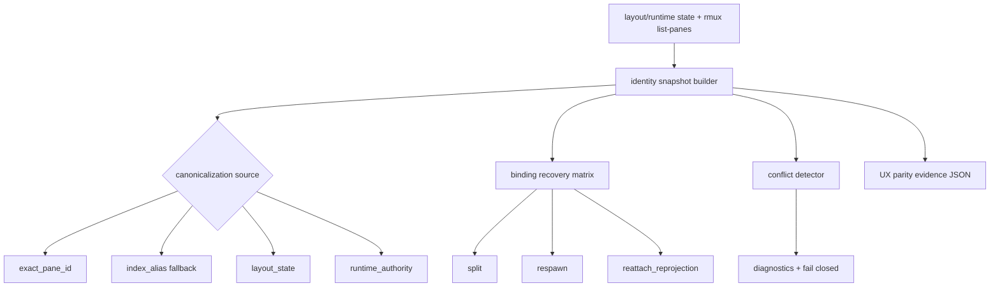

# windows-rmux-pane-identity-layout-parity feature design

## 0. 术语约定

| 术语 | 定义 | 防冲突结论 |
|---|---|---|
| pane identity snapshot | 一条可机器读取的 pane 身份记录，包含 session/window、pane id/index、CCB role、agent id 和 canonicalization 来源。 | 不是普通 `list-panes` 文本摘要；必须能被 supportability 和 lifecycle feature 消费。 |
| canonicalization source | 本次 pane id 来源：exact pane id、index alias fallback、layout state 或 runtime authority。 | index alias 只能作为 fallback，并且必须显式记录。 |
| agent-pane binding | CCB agent runtime 与 rmux pane 的绑定关系。 | split、respawn、reattach_reprojection 后必须能重新关联，不能只在创建时成立。 |
| identity conflict | 同一 agent 绑定到多个 active panes，或多个 active panes 被归到同一 canonical identity。 | 必须进入 diagnostics 并 fail closed。 |
| reattach binding reprojection | 在 namespace、layout state、agent runtime state 仍存在且非 crash 的情况下，重新读取 observed panes 并重投影 agent-pane binding。 | 不包含关闭终端后重新 attach、provider crash、rmux daemon crash 或 terminal closed recovery。 |
| pane_identity_layout parity dimension | roadmap §4.1 `WindowsRmuxUxParityEvidence.parity_dimension` 的本 feature 固定值。 | 最终证据 JSON 必须写 `pane_identity_layout`。 |

Brainstorm admission：`.codestable/features/2026-07-25-windows-rmux-pane-identity-layout-parity/windows-rmux-pane-identity-layout-parity-brainstorm.md` 已 `confirmed`，owner 已批准采用 **identity evidence + contract first** 进入 design。

## 1. 决策与约束

### 需求摘要

本 feature 不默认重写 layout authority 或 canonicalization，而是在既有 `rmux-backend-core`、`ccbd-rmux-namespace-lifecycle`、`targets.py` / `panes.py` 基础上，建立 Windows/rmux pane identity/layout parity 的证据契约。目标是证明 pane identity、layout snapshot、agent-pane binding 在 split、respawn、reattach_reprojection 后稳定；冲突时系统可诊断并 fail closed。

成功标准：

- 产出 `.codestable/features/2026-07-25-windows-rmux-pane-identity-layout-parity/evidence/pane-identity-layout-report.json`，记录 snapshot matrix、binding recovery、conflict diagnostics。
- 产出 `.codestable/features/2026-07-25-windows-rmux-pane-identity-layout-parity/evidence/windows-rmux-ux-parity-evidence.json`，符合 roadmap §4.1，且 `parity_dimension=pane_identity_layout`。
- 每条 core snapshot 至少包含 `backend_impl=rmux`、`session_name`、`window_name`、`pane_id`、`pane_index`、`ccb_role`、`ccb_agent_id`、`canonicalization_source`。
- 验证 exact pane id 优先，index alias 只作为 fallback；fallback 必须记录 source。
- 验证 split、respawn、reattach_reprojection 后 agent-pane binding 可恢复。
- 验证 identity conflict 进入 diagnostics，并且不会把同一 agent 绑定到多个 active panes。
- 本 feature 的 reattach 只指非 crash 场景下已有 namespace/layout/runtime state 的重新读取与 binding 重投影；terminal closed、provider crash、rmux daemon crash 和 reconnect UX 留给 lifecycle feature。

明确不做：

- 不默认重写 layout authority。
- 不默认合并 `targets.py` 与 `project_namespace_runtime/backend.py` 的 canonicalization；只有证据证明重复逻辑导致真实漂移时，才把收敛 helper 纳入实现步骤。
- 不把 lifecycle crash recovery 纳入本 item；crash 后恢复路径由 `windows-rmux-lifecycle-recovery-ux-parity` 覆盖。
- 不修改 foreground mouse/focus/scroll policy；普通 pane GUI-native 由 interaction feature 负责。
- 不把 provider completion/capture 问题归入 pane identity。

### Baseline reuse / delta

复用 baseline：

- `rmux-backend-core` 已 accepted：`RmuxBackend` core adapter、pane list/split/respawn/kill、presentation、capability gate、error mapping 均已通过 focused DoD。
- `ccbd-rmux-namespace-lifecycle` 已 accepted：namespace state、layout projection、foreground attach、kill/report/doctor/ping 已读 canonical namespace projection。
- `targets.py` 已实现 `canonical_pane_id()` / `canonical_pane_target()`；`panes.py::split_pane()` 已处理 split index alias；`test/test_v2_project_namespace_backend.py` 已覆盖 index alias、exact pane id 优先、无 window/session fallback、respawn replacement canonicalization。

本 feature 增量：

- 把现有 canonicalization 行为投影为机器可读 identity/layout parity evidence。
- 明确 `canonicalization_source`，防止 `%N` exact id 与 index alias 混淆。
- 增加 agent-pane binding recovery 与 identity conflict diagnostics 的验收契约。
- 为后续 lifecycle/recovery 提供可消费的 identity report，而不是重复实现 recovery。

### 复杂度档位

- 行为兼容 = L3。pane identity 漂移会污染 interaction、capture、layout、recovery 和 diagnostics。
- 外部依赖 = mixed。core snapshot/adapter fixtures 可 headless 运行；live rmux/WezTerm 证据可作为 supporting lane。
- 可测试性 = verified。snapshot schema、alias source、binding recovery、conflict diagnostics 都可用 fake backend / fixture 测试。
- 数据完整性 = high。agent-pane binding 错误必须 fail closed，不能用 best-effort 继续。

### Top 3 风险与缓解

1. **风险：重复 canonicalization helper 行为分叉。**  
   缓解：先用 snapshot/report 捕获 `targets.py` 与 project namespace adapter 行为；只有证据显示漂移才收敛 helper。
2. **风险：index alias 被误当 exact pane id。**  
   缓解：snapshot 必须记录 `canonicalization_source`；exact-first 和 alias fallback 都有测试。
3. **风险：identity conflict 静默污染后续 recovery。**  
   缓解：conflict diagnostics 作为 core AC；同一 agent 多 pane 或同一 pane 多 agent 必须 fail closed。

### 非显然依赖与关键假设

- 依赖 `windows-rmux-wezterm-native-interaction-parity` design-review passed 作为 epic child design admission；implementation 前仍需按 parent roadmap 确认依赖实际状态。
- 如果 parent interaction feature 尚未 accepted，本 feature implementation 可以推进 headless identity/layout lanes，但 live WezTerm GUI lane 必须 `partial` 或 `blocked`，不能作为 pass。
- 假设 existing agent identity 写入 user options / runtime state 的机制仍由 ccbd namespace lifecycle 管理；本 feature 只读取和验证绑定，不重新定义 agent registry。
- 假设 `WindowsRmuxPaneIdentitySnapshot` 是后续 lifecycle/recovery 的输入，不在本 feature 中实现 crash recovery。
- 假设 reattach fixture 可 headless 模拟“已有 namespace/layout/runtime state + observed panes 重新读取”；live transcript 只用于证明真实 rmux/WezTerm 环境下相同重投影，不覆盖 terminal closed 或 daemon crash。

## 2. 名词与编排

### 2.1 名词层

#### 现状

- `lib/terminal_runtime/rmux_backend_runtime/targets.py::canonical_pane_id()` 会根据 session/window/global scope 用 `list-panes` 或 `display-message` 解析 `%N`。
- `lib/terminal_runtime/rmux_backend_runtime/panes.py::split_pane()` 会在 split 返回已有 `%N` 时，通过 before snapshot 与 index alias resolver 再解析。
- `lib/ccbd/services/project_namespace_runtime/backend.py::_canonical_mux_pane_id()` 另有一套 adapter 侧 canonicalization，用于 `split_pane()`、`respawn_pane()`、`set_pane_user_option()`、`apply_pane_identity()` 等 ccbd runtime helper。
- `test/test_v2_project_namespace_backend.py` 已覆盖 `test_mux_percent_pane_adapter_canonicalizes_rmux_index_alias`、`test_mux_percent_pane_adapter_prefers_exact_pane_id_over_window_index`、`test_mux_respawn_adapter_canonicalizes_replacement_index_alias` 等行为。
- roadmap §4.4 已定义 `WindowsRmuxPaneIdentitySnapshot`，但当前没有 feature 级 evidence report 统一记录 snapshots、binding recovery 和 conflicts。

#### 变化

新增 evidence-only identity report；production code 只在证据显示缺口时做最小修正：

```python
class WindowsRmuxPaneIdentitySnapshot(TypedDict):
    backend_impl: Literal["rmux"]
    session_name: str
    window_name: str
    pane_id: str
    pane_index: int
    ccb_role: str
    ccb_agent_id: str | None
    canonicalization_source: Literal[
        "exact_pane_id",
        "index_alias",
        "layout_state",
        "runtime_authority",
    ]

class PaneIdentityConflict(TypedDict):
    conflict_id: str
    conflict_kind: Literal["agent_multi_pane", "pane_multi_agent", "duplicate_canonical_identity"]
    affected_agents: list[str]
    affected_panes: list[str]
    diagnostics_ref: str
    verdict: Literal["fail_closed", "failed"]

class BindingRecoveryCase(TypedDict):
    case_id: str
    scenario: Literal["split", "respawn", "reattach_reprojection"]
    expected_agent: str
    expected_pane: str
    observed_pane: str | None
    canonicalization_source: Literal[
        "exact_pane_id",
        "index_alias",
        "layout_state",
        "runtime_authority",
    ]
    verdict: Literal["pass", "partial", "failed", "blocked"]
    diagnostics_ref: str
    residual_risk_ref: str | None

class PaneIdentityLayoutReport(TypedDict):
    schema_version: Literal[1]
    baseline_refs: dict[str, str]
    snapshots: list[WindowsRmuxPaneIdentitySnapshot]
    binding_recovery: list[BindingRecoveryCase]
    conflicts: list[PaneIdentityConflict]
    residual_risks: list[str]
```

示例：

```json
{
  "backend_impl": "rmux",
  "session_name": "ccb-session",
  "window_name": "workspace",
  "pane_id": "%2",
  "pane_index": 1,
  "ccb_role": "agent",
  "ccb_agent_id": "agent1",
  "canonicalization_source": "index_alias"
}
```

UX evidence projection：

| Field | Contract |
|---|---|
| `schema_version` | 固定 `1` |
| `host_kind` | 固定 `native_windows`；headless fixture 只能作为 artifact，不得替代 native Windows evidence |
| `terminal_host` | 固定 `wezterm`；无 GUI/live 环境时不能写 pass |
| `backend_impl` | 固定 `rmux` |
| `control_plane` | 固定 `ccbd` |
| `parity_dimension` | 固定 `pane_identity_layout` |
| `evidence_status` | `pass|partial|blocked|failed`；任何 conflict failed 或 ambiguous alias 未 fail closed 时必须 `failed` |
| `failure_class` | `none|rmux_unavailable|wezterm_gui_unavailable|provider_failure|system_failure|test_design_failure|unsupported_capability`；`pass` 必须为 `none` |
| `artifacts` | 必须至少包含 `pane_identity_layout_report`，可包含 `live_snapshot`、`binding_recovery_transcript`、`conflict_diagnostics` |
| `residual_risks` | `partial|blocked|failed` 时必须非空；parent interaction 未 accepted 或 GUI 不可用时必须说明 |

`canonicalization_source` 分类规则：

- observed pane id 直接等于输入 pane id 时为 `exact_pane_id`。
- 通过 pane_index 唯一匹配 observed pane 时为 `index_alias`。
- 从 persisted layout state 投影而来且需要 observed pane 二次确认时为 `layout_state`。
- 从 agent/runtime authority 重投影而来且需要 observed pane 二次确认时为 `runtime_authority`。
- `display-message` 是解析机制，不单独作为 source；它解析出的结果按上述规则归类。

##### Interface 设计检查

- Module：feature evidence 放在 `.codestable/features/.../evidence/`；production helper 只有在证据发现 drift 时才改。
- Interface：supportability/lifecycle 消费 `PaneIdentityLayoutReport` 与 roadmap §4.1 UX evidence JSON，不消费自由 Markdown。
- Seam：seam 位于 identity snapshot builder / diagnostics projection；不把 WezTerm GUI 或 lifecycle crash recovery 拉进本 feature。
- Depth / locality：pane identity 是 deep contract；第一版 evidence-first 避免跨 `targets.py`、namespace adapter、layout state 做无证据大重构。
- Dependency strategy：local-substitutable；fake backend 覆盖 exact/id alias/binding/conflict，live rmux snapshot 作 supporting evidence。
- Adapter：可能新增测试/evidence adapter；production adapter 收敛只在 drift 被证实时纳入实现。

### 2.2 编排层



流程级约束：

- snapshot builder 先读取 runtime/layout 预期，再读取 backend observed panes；两者不一致时必须记录 source 和 diagnostics。
- exact pane id 优先；当 observed exact id 存在时，不得按 pane_index 改写。
- index alias fallback 必须只在唯一匹配时生效；多匹配或无匹配进入 conflict/blocked。
- binding recovery 覆盖 split、respawn、reattach_reprojection；每个场景必须说明 expected agent、expected pane、observed pane、canonicalization_source、diagnostics_ref 和 verdict。
- reattach_reprojection 只允许在 namespace/layout/runtime state 仍存在的非 crash 场景中运行；terminal closed、provider crash、rmux daemon crash 或 reconnect UX 必须标为超出本 item。
- conflict detector 发现同一 agent 多 active panes、同一 pane 多 agent、duplicate canonical identity 时，必须 fail closed。
- UX evidence JSON 只汇总 pass/partial/blocked/failed，不替代细粒度 report。

### 2.3 挂载点清单

- `.codestable/features/2026-07-25-windows-rmux-pane-identity-layout-parity/evidence/pane-identity-layout-report.json`：细粒度 identity/layout report。
- `.codestable/features/2026-07-25-windows-rmux-pane-identity-layout-parity/evidence/windows-rmux-ux-parity-evidence.json`：roadmap §4.1 汇总证据。
- `test/test_windows_rmux_pane_identity_layout_parity.py`：snapshot schema、binding recovery、conflict diagnostics 和 UX evidence validation。
- `test/test_v2_project_namespace_backend.py`：如需要只补 focused cases，验证 adapter canonicalization 未漂移。
- `lib/terminal_runtime/rmux_backend_runtime/targets.py` / `lib/ccbd/services/project_namespace_runtime/backend.py`：只有 evidence 证明 drift 时才做最小收敛。

### 2.4 推进策略

1. **Baseline inventory**：记录 rmux-backend-core、ccbd-rmux-namespace-lifecycle、targets/panes/project namespace adapter tests 的 accepted baseline。  
   退出信号：report baseline refs 指向存在的 acceptance、code 和 tests，不声明基础 split/list/canonicalization 未完成。
2. **Snapshot schema/report**：建立 `pane-identity-layout-report.json`，校验 snapshot required fields、enum、binding recovery、conflict diagnostics。  
   退出信号：JSON 可解析，`canonicalization_source` enum、agent/pane refs、conflict verdict、residual risk 规则通过。
3. **Canonicalization matrix**：覆盖 exact pane id、window index alias、session/global alias fallback、多匹配/无匹配 blocked。  
   退出信号：exact-first、unique index fallback、ambiguous alias fail-closed 均有 test/report case。
4. **Binding recovery matrix**：覆盖 split、respawn、reattach_reprojection 后 agent-pane binding 恢复。  
   退出信号：每个 `BindingRecoveryCase` 记录 scenario、expected_agent、expected_pane、observed_pane、canonicalization_source、diagnostics_ref、verdict；parent 未 accepted时 live GUI lane partial/blocked。
5. **Conflict diagnostics**：覆盖 agent_multi_pane、pane_multi_agent、duplicate_canonical_identity。  
   退出信号：conflict report 有 diagnostics_ref，系统不会继续写入错误 binding。
6. **UX evidence integration**：生成 `windows-rmux-ux-parity-evidence.json`，固定 `parity_dimension=pane_identity_layout`。  
   退出信号：roadmap §4.1 required fields、enum、artifacts、residual_risks 校验通过。
7. **Drift closure / minimal implementation**：如果 evidence 证明 canonicalization helper 分叉导致漂移，做最小收敛；否则保持 evidence-only。  
   退出信号：相关 pytest、py_compile、YAML/JSON validation 通过；未触发 drift 时没有生产代码改动。

### 2.5 结构健康度与微重构

##### 评估

- 文件级 — `targets.py`：职责集中在 Rmux pane target/canonicalization，适合保留为 backend runtime 侧 source of truth。
- 文件级 — `panes.py`：职责是 Rmux pane operations；split index alias fallback 已在这里存在，不应塞入 roadmap evidence/schema。
- 文件级 — `project_namespace_runtime/backend.py`：已有 tmux/rmux adapter 兼容逻辑，包含重复 canonicalization；这是结构风险，但直接重构会跨 ccbd lifecycle 调用面。
- 目录级 — feature `evidence/`：适合承载 report、UX evidence JSON 和 diagnostics refs。

##### 结论：不做预置行为微重构

第一版不在 design 阶段预置“只搬不改行为”的重构。implementation 先跑 snapshot/canonicalization matrix；只有 drift 被证实，才在同 feature 内做最小收敛，且必须保持行为测试全程绿灯。若发现需要跨模块统一 layout authority，记录为后续 `cs-refactor` 或 lifecycle feature 输入，不阻塞本 feature 的 evidence contract。

## 3. 验收契约

### 3.1 关键场景清单

| ID | 输入 / 触发 | 期望可观察结果 | 证据类型 |
|---|---|---|---|
| AC-001 | exact pane id 与 pane_index 同时存在 | snapshot 保留 exact pane id，`canonicalization_source=exact_pane_id` | pytest / JSON |
| AC-002 | `%N` index alias 唯一匹配 observed pane | snapshot 记录 resolved pane id，`canonicalization_source=index_alias` | pytest / JSON |
| AC-003 | index alias 多匹配或无匹配 | report 标 blocked/failed，diagnostics 说明 ambiguity，不继续绑定 | pytest / JSON |
| AC-004 | split 后新 pane 绑定 agent | `BindingRecoveryCase` 记录 expected_agent、expected_pane、observed_pane、canonicalization_source、diagnostics_ref、verdict | pytest / JSON |
| AC-005 | respawn replacement 返回 index alias | replacement 被 canonicalized，agent-pane binding 指向 observed active pane，且写入 `BindingRecoveryCase` | pytest / JSON |
| AC-006 | 非 crash reattach_reprojection 后 layout/runtime state 与 observed panes 对齐 | snapshots 可重新关联 agent 与 pane；不一致进入 residual risk/diagnostics；terminal closed/crash 不在本 item 验收 | pytest / live transcript |
| AC-007 | identity conflict | conflict diagnostics 记录 `agent_multi_pane|pane_multi_agent|duplicate_canonical_identity`，verdict 为 `fail_closed` | pytest / JSON |
| AC-008 | UX evidence JSON | required fields、enum、artifact refs、partial/blocked residual risk 校验通过 | JSON validation |
| AC-009 | scope guard | 不默认重写 layout authority，不把 lifecycle crash recovery 或 GUI mouse policy 纳入本 item | diff review / guard |

### 3.2 明确不做的反向核对项

- 不应默认合并 `targets.py` 和 project namespace adapter canonicalization。
- 不应把 ambiguous index alias 当作 pass。
- 不应在 identity conflict 后继续写入 agent-pane binding。
- 不应实现 lifecycle crash recovery。
- 不应修改 interaction mouse/focus policy。
- 不应用自由 Markdown 替代 machine-readable identity report。

### 3.3 Acceptance Coverage Matrix

| Scenario | Covered By Step | Evidence Type | Command / Action | Core? |
|---|---|---|---|---|
| AC-001 exact-first | S3 | pytest / JSON | identity parity matrix test | yes |
| AC-002 unique alias fallback | S3 | pytest / JSON | identity parity matrix test | yes |
| AC-003 ambiguous alias fail closed | S3/S5 | pytest / JSON | conflict diagnostics test | yes |
| AC-004 split binding recovery | S4 | pytest / JSON | binding recovery fixture | yes |
| AC-005 respawn binding recovery | S4 | pytest / JSON | replacement alias fixture | yes |
| AC-006 reattach_reprojection snapshot | S4/S6 | pytest / live transcript | layout/runtime snapshot fixture，非 crash only | yes |
| AC-007 conflict diagnostics | S5 | pytest / JSON | conflict report validation | yes |
| AC-008 UX evidence | S6 | JSON validation | roadmap §4.1 evidence validator | yes |
| AC-009 scope guard | S7 | diff review / guard | no layout authority rewrite unless drift evidence | yes |

### 3.4 DoD Contract

| ID | 要求 | 证据 | 阻塞级别 |
|---|---|---|---|
| DOD-DESIGN-001 | design/checklist/review 完整，引用 confirmed brainstorm 和 roadmap §4.1/§4.4 | design review | blocking |
| DOD-IMPL-001 | `pane-identity-layout-report.json` 存在并通过 schema/enum/artifact/diagnostics 校验 | pytest / JSON validate | blocking |
| DOD-IMPL-002 | `windows-rmux-ux-parity-evidence.json` 存在，`parity_dimension=pane_identity_layout` | pytest / JSON validate | blocking |
| DOD-IMPL-003 | exact-first、unique alias fallback、ambiguous alias fail-closed 均被覆盖 | pytest / report | blocking |
| DOD-IMPL-004 | split、respawn、reattach_reprojection 的 agent-pane binding recovery 有 `BindingRecoveryCase` 证据 | pytest / report | blocking |
| DOD-IMPL-005 | identity conflict diagnostics fail closed，不继续错误 binding | pytest / report | blocking |
| DOD-IMPL-006 | 未证实 drift 时不做 production canonicalization 重构；证实时只做最小收敛 | diff review / pytest | blocking |
| DOD-REVIEW-001 | code review passed 且无 unresolved blocking | review report | blocking |
| DOD-QA-001 | QA 覆盖 JSON evidence、canonicalization matrix、binding recovery、conflict diagnostics、scope guard | QA report | blocking |
| DOD-ACCEPT-001 | acceptance 回写 roadmap item，并记录 residual risks / lifecycle handoff | acceptance report | blocking |

Validation Commands:

| ID | 命令 | 目的 | 核心性 | 失败处理 |
|---|---|---|---|---|
| CMD-001 | `python ".codestable/tools/validate-yaml.py" --file ".codestable/features/2026-07-25-windows-rmux-pane-identity-layout-parity/windows-rmux-pane-identity-layout-parity-checklist.yaml" --yaml-only` | checklist YAML 合法性 | core | fix-or-block |
| CMD-002 | `python ".codestable/tools/validate-yaml.py" --file ".codestable/roadmap/windows-rmux-ux-parity-hardening/windows-rmux-ux-parity-hardening-items.yaml"` | roadmap items 回写合法性 | core | fix-or-block |
| CMD-003 | `python -m pytest -q test/test_windows_rmux_pane_identity_layout_parity.py` | identity report、完整 UX evidence projection、canonicalization matrix、BindingRecoveryCase、conflict diagnostics | core | fix-or-block |
| CMD-004 | `python -m pytest -q test/test_v2_project_namespace_backend.py -k "canonicalizes_rmux_index_alias or prefers_exact_pane_id or respawn_adapter_canonicalizes"` | 既有 project namespace adapter canonicalization baseline 防回退 | core | fix-or-block |
| CMD-005 | `python -m pytest -q test/test_rmux_backend_core.py` | rmux backend core pane/list/split baseline 防回退 | core | fix-or-block |
| CMD-006 | `python -m py_compile "lib/terminal_runtime/rmux_backend_runtime/targets.py" "lib/terminal_runtime/rmux_backend_runtime/panes.py" "lib/ccbd/services/project_namespace_runtime/backend.py"` | 相关 Python module 语法检查 | core | fix-or-block |

Required Artifacts：design、checklist、design-review、`evidence/pane-identity-layout-report.json`、`evidence/windows-rmux-ux-parity-evidence.json`、identity parity tests、binding recovery tests、conflict diagnostics tests、scope/diff review、items.yaml 回写。

### 3.5 自我批判结论

- 可证伪性：每个核心场景都绑定 JSON 字段、pytest 或 live transcript。
- 步骤原子性：baseline、schema、canonicalization matrix、binding recovery、conflict diagnostics、UX evidence、drift closure 七步分离。
- 最弱依赖：ambiguous alias 与 identity conflict 最容易被误判；设计要求 fail closed。
- 证据完整性：snapshot、source、`BindingRecoveryCase` 字段、conflict diagnostics、UX evidence projection、residual risk 缺一不可。
- 基线可执行性：核心命令复用 existing project namespace/rmux backend tests，并新增 focused identity parity test。
- 交付物可核验性：acceptance 可从 feature evidence 目录、tests、roadmap item 和 review 报告反查。
- 清洁度规则：不新增临时 TODO/FIXME、调试输出、注释掉代码、死 import；不做无证据 production 重构。

## 4. 与项目级架构文档的关系

- 严格遵守 roadmap §4.1 `WindowsRmuxUxParityEvidence`：本 feature 的 `parity_dimension` 固定为 `pane_identity_layout`。
- 严格遵守 roadmap §4.4 `Pane identity/layout parity contract`：exact pane id 优先，index alias fallback 必须记录 source，conflict 必须 fail closed。
- 复用 `rmux-backend-core` 和 `ccbd-rmux-namespace-lifecycle` accepted evidence；不推翻基础 backend/lifecycle 结论。
- 为后续 `windows-rmux-lifecycle-recovery-ux-parity` 提供 identity/layout evidence；crash recovery 不在本 feature 内实现。
