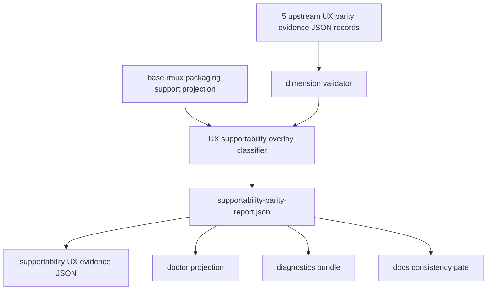

# windows-rmux-supportability-parity-contract feature design

## 0. 术语约定

| 术语 | 定义 | 防冲突结论 |
|---|---|---|
| base support projection | `rmux_packaging_support_summary()` 和 packaged projection 给出的 packaging/install/npm/docs 基础支持状态。 | 由 `rmux-packaging-docs-contracts` 拥有，本 feature 只能消费。 |
| UX parity evidence | 每个 child feature 目录下的 `evidence/windows-rmux-ux-parity-evidence.json`。 | 是 supportability 公开消费的唯一 child evidence 接口。 |
| upstream dimensions | 本 feature 读取的 5 个上游 UX parity dimensions：foreground_interaction、output_capture、pane_identity_layout、visual_no_popup、lifecycle_recovery。 | 不包含本 feature 自身的 supportability，避免自消费循环。 |
| epic dimensions | epic 最终消费的 6 个 UX parity evidence records，等于 5 个 upstream dimensions 加本 feature 输出的 supportability self evidence。 | epic final aggregation 才消费 6 个 records。 |
| UX parity overlay | 将 upstream dimensions 投影成 supportability 状态、风险和 fallback guidance 的聚合层。 | 不替代 base projection，也不能提升 base projection 不允许的 support tier。 |
| parity dimension status | `pass|partial|blocked|failed|missing`。 | `missing` 只来自缺失/不可解析/维度不匹配的 core evidence JSON。 |
| final supportability result | base support projection 与 UX parity overlay 合并后的用户可见承诺。 | 支持档 fail closed：取 base 和 overlay 中更保守的结果。 |

Brainstorm admission：`.codestable/features/2026-07-25-windows-rmux-supportability-parity-contract/windows-rmux-supportability-parity-contract-brainstorm.md` 已 `confirmed`，owner 已批准采用 **UX parity overlay first**，不重复定义 npm、`install.ps1`、release guard。

## 1. 决策与约束

### 需求摘要

本 feature 把 Windows/rmux UX parity hardening 的所有 child evidence 投影到 supportability contract：doctor、diagnostics bundle、docs/runbook 和 support tier 对外表达必须一致。它在 `rmux-packaging-docs-contracts` 的 base projection 之上增加 UX parity overlay，不重做 install/npm/release gate。

成功标准：

- 产出 `.codestable/features/2026-07-25-windows-rmux-supportability-parity-contract/evidence/supportability-parity-report.json`，汇总 5 个上游 UX parity dimensions，并生成本 item 的第 6 维 supportability evidence。
- 产出 `.codestable/features/2026-07-25-windows-rmux-supportability-parity-contract/evidence/windows-rmux-ux-parity-evidence.json`，符合 roadmap §4.1，且 `parity_dimension=supportability`。
- 任一 core dimension 缺失、不可解析或维度不匹配时投影为 `missing`，不得静默忽略。
- 任一 core dimension 为 `failed|blocked|missing` 时最终 support tier 不得为 `supported`。
- `partial` 可以进入 `beta`，但必须在 doctor/diagnostics/docs 中列 residual risks。
- final supportability result 不得高于 base support projection 允许的 tier。
- doctor、diagnostic bundle、docs consistency gate 读取同一 projection，不各自重算支持状态。

明确不做：

- 不重新定义 `rmux_packaging_support_summary()` 的 base rules、npm gate、`install.ps1` gate 或 release guard。
- 不修改 package publish/tag/release 流程，不授权 npm win32 发布。
- 不把 child 私有 report JSON 当作公开输入；只允许从 UX evidence `artifacts` 追溯。
- 不修复其他 child 的 UX parity 缺口；缺失或失败只投影状态和指导。
- 不把真实 provider auth/quota/credential failure 归为 rmux supportability failure。

### Baseline reuse / delta

复用 baseline：

- `lib/terminal_runtime/rmux_packaging_support.py`：`RmuxPackagingSupport`、`rmux_packaging_support_summary()`、support tier、install entry、npm enabled、fallback guidance。
- `lib/terminal_runtime/rmux_packaging_support_projection.json`：packaged fallback projection。
- `lib/cli/services/doctor.py`：doctor payload 已包含 `rmux_packaging_support`。
- `lib/cli/render_runtime/ops_views_doctor.py`：doctor 已展示 base rmux support fields。
- `test/test_rmux_packaging_docs_contracts.py`：base support projection fail-closed 行为。
- `test/test_cli_doctor_rmux_packaging.py`、`test/test_doctor_rmux_packaging_summary.py`、`test/test_ccbd_diagnostics_bundle_rmux.py`：doctor 和 diagnostics bundle projection surface。
- `test/test_rmux_docs_consistency_gate.py`、`test/test_install_windows_rmux_contract.py`：docs 与 install.ps1 base contract。

本 feature 增量：

- 增加 UX parity evidence aggregator / validator / overlay projection，输入为 5 个上游 UX dimensions，输出为本 item 的 supportability dimension。
- 将 overlay 结果接入 doctor/diagnostics/docs consistency，字段与 report 同源。
- 生成 supportability 自身的 UX parity evidence record，作为 epic final aggregation 的第六维。
- 增加 scope guard，确保本 item 不修改 npm/install/release owner 规则。

### 复杂度档位

- 行为兼容 = L3。错误提升 support tier 会造成用户安装/排障路径误导。
- 外部依赖 = mixed。overlay classifier 可用 fixtures 测；真实 pass 依赖其他 child evidence artifact。
- 可测试性 = verified。JSON schema、dimension missing、tier cap、doctor/docs fields 都可测试。
- 数据完整性 = high。support tier 必须从机器证据推导，不接受自由文本替代。

### Top 3 风险与缓解

1. **风险：overlay 绕过 base projection 把状态提升到 supported。**
   缓解：final tier 取 base projection 与 overlay candidate 的保守交集；tests 覆盖 base beta + UX pass 仍不得 supported。
2. **风险：缺失 child evidence 被当成 pass。**
   缓解：aggregator 对缺失、JSON parse error、dimension mismatch 一律投影为 `missing`，并写 residual risk。
3. **风险：doctor、diagnostics、docs 各自展示不同支持状态。**
   缓解：单一 `supportability-parity-report.json` / runtime projection 作为 source；docs consistency gate 校验 required fields。

### 非显然依赖与关键假设

- parent UX feature 当前均是 design-review passed；实现前仍需 goal 实际完成后才有真实 evidence JSON。
- 如果部分 child 尚未 accepted，本 feature implementation 必须 fail closed 为 `missing|partial|blocked`，不得用 design-review passed 替代 evidence。
- 假设 base projection 保留 owner：npm win32、`install.ps1` mode、release guard 不由 UX overlay 控制。
- 假设 supportability 自身 evidence record 可以引用 overlay report 和 doctor/docs/diagnostics consistency artifacts。

## 2. 名词与编排

### 2.1 名词层

#### 现状

- `RmuxPackagingSupport` 已包含 `support_tier`、`install_entry`、`windows_npm_enabled`、`install_ps1_rmux_check`、validation refs、package/docs refs 和 fallback guidance。
- `doctor_summary()` 使用 installation root 读取 rmux packaging support projection。
- `render_doctor()` 已渲染 base support fields。
- diagnostics bundle 已保存 doctor payload。
- docs consistency tests 已要求 README、support contract、install runbook、diagnostics contract 展示 base fields。
- roadmap §4.1 定义 `WindowsRmuxUxParityEvidence`，§4.7 定义 `WindowsRmuxUxSupportProjection`。

#### 变化

新增 supportability overlay contract：

```python
class WindowsRmuxUxUpstreamDimensionProjection(TypedDict):
    dimension: Literal[
        "foreground_interaction",
        "output_capture",
        "pane_identity_layout",
        "visual_no_popup",
        "lifecycle_recovery",
    ]
    status: Literal["pass", "partial", "blocked", "failed", "missing"]
    failure_class: Literal[
        "none",
        "rmux_unavailable",
        "wezterm_gui_unavailable",
        "provider_failure",
        "system_failure",
        "test_design_failure",
        "unsupported_capability",
        "missing_evidence",
    ]
    evidence_ref: str | None
    artifacts: dict[str, str]
    residual_risks: list[str]

class WindowsRmuxUxSupportabilityReport(TypedDict):
    schema_version: Literal[1]
    base_projection_ref: str
    base_support_tier: Literal["blocked", "experimental", "beta", "supported"]
    overlay_candidate_tier: Literal["blocked", "experimental", "beta", "supported"]
    final_support_tier: Literal["blocked", "experimental", "beta", "supported"]
    upstream_dimensions: dict[str, Literal["pass", "partial", "blocked", "failed", "missing"]]
    upstream_dimension_details: list[WindowsRmuxUxUpstreamDimensionProjection]
    self_evidence_status: Literal["pass", "partial", "blocked", "failed"]
    self_evidence_ref: str | None
    validation_ref: str
    install_entry: Literal["source", "install_ps1", "npm", "diagnostic_only"]
    fallback_guidance: str
    docs_consistency_ref: str | None
    doctor_projection_ref: str | None
    diagnostics_bundle_ref: str | None
    residual_risks: list[str]
```

Projection rules：

- 所有上游 child evidence 必须满足 roadmap §4.1：`schema_version=1`、`host_kind=native_windows`、`terminal_host=wezterm`、`backend_impl=rmux`、`control_plane=ccbd`、dimension enum、status enum、failure_class enum。
- 缺失文件、JSON parse error、required fields 缺失、dimension 与期望不匹配，均在私有 `supportability-parity-report.json` 中投影为 `status=missing` / `failure_class=missing_evidence`。
- `missing_evidence` 只允许出现在私有 report 的 upstream detail，不得泄漏到 roadmap §4.1 `windows-rmux-ux-parity-evidence.json`。最终 supportability evidence 遇到 missing/malformed/dimension mismatch 时必须映射为合法 `failure_class=test_design_failure`，并在 `residual_risks` 写明缺失维度。
- `supportability` dimension 不是 loader 输入；它是本 feature 自身输出，引用 `supportability-parity-report.json`、doctor projection、diagnostics bundle 和 docs consistency report。epic final aggregation 再消费包含本 item 在内的 6 个 child UX evidence records。
- overlay candidate tier：
  - 任一 dimension `failed|blocked|missing` → `experimental` 或 `blocked`；若 failure_class 是 capability/system/rmux unavailable 可为 `blocked`。
  - 所有 dimension `pass` → `supported` candidate。
  - 存在 `partial` 且无 failed/blocked/missing → `beta` candidate。
- final support tier 不得高于 base support tier；base `experimental|blocked` 时 final 不能被 overlay 提升。
- `install_entry`、`windows_npm_enabled`、`install_ps1_rmux_check` 从 base projection 读取；overlay 只补 UX residual risks 和 fallback text，不改 owner rules。

Tier merge table：

| Base tier | Overlay candidate | Final tier |
|---|---|---|
| `blocked` | any | `blocked` |
| `experimental` | any | `experimental` |
| `beta` | `supported` | `beta` |
| `beta` | `beta` | `beta` |
| `beta` | `experimental` | `experimental` |
| `beta` | `blocked` | `blocked` |
| `supported` | `supported` | `supported` |
| `supported` | `beta` | `beta` |
| `supported` | `experimental` | `experimental` |
| `supported` | `blocked` | `blocked` |

UX evidence projection：

| Field | Contract |
|---|---|
| `schema_version` | 固定 `1` |
| `host_kind` | 固定 `native_windows` |
| `terminal_host` | 固定 `wezterm` |
| `backend_impl` | 固定 `rmux` |
| `control_plane` | 固定 `ccbd` |
| `parity_dimension` | 固定 `supportability` |
| `evidence_status` | final report 没有 failed/blocked/missing 且 required surfaces 一致才 `pass`；否则 `partial|blocked|failed` |
| `failure_class` | 由最严重 dimension 或 base projection failure 映射 |
| `artifacts` | 至少包含 `supportability_parity_report`、`base_support_projection`、`doctor_projection`、`docs_consistency` |
| `residual_risks` | final 非 supported/pass 时必须非空 |

最终 evidence `failure_class` precedence：

| Source condition | Final §4.1 failure_class |
|---|---|
| 任一 upstream detail 为 `missing_evidence`，或 evidence 文件 malformed / dimension mismatch | `test_design_failure` |
| base projection `rmux_capability_status=blocking_gap` 或 upstream 为 `rmux_unavailable` | `rmux_unavailable` |
| upstream 为 `wezterm_gui_unavailable` | `wezterm_gui_unavailable` |
| upstream 为 `provider_failure` 且无更高优先级 system/rmux/test-design failure | `provider_failure` |
| upstream 为 `system_failure` | `system_failure` |
| upstream 为 `unsupported_capability` | `unsupported_capability` |
| 无 failure 且 final support tier 为 `supported|beta` | `none` |

##### Interface 设计检查

- Module：新增 overlay 聚合逻辑应靠近 `terminal_runtime.rmux_packaging_support`，但保持 base projection 和 UX overlay 分层。
- Interface：runtime/public projection 可扩展 `rmux_packaging_support` payload，字段名前缀建议为 `ux_parity_*`，避免破坏既有 base fields。
- Seam：seam 放在 evidence loader / overlay classifier / doctor projection；不放在 install.ps1 或 package metadata。
- Depth / locality：supportability 是 deep contract，必须集中计算；doctor/docs/diagnostics 只渲染或校验 projection。
- Dependency strategy：local-substitutable；fixtures 可模拟 5 个 upstream evidence records 和 self evidence 输出。
- Adapter：不新增 production adapter；若需要 docs report builder，应作为 test/guard 工具。

### 2.2 编排层



流程级约束：

- aggregator 只从 5 个上游 child 的 `evidence/windows-rmux-ux-parity-evidence.json` 读取公开字段；child 私有 report 只能通过 `artifacts` 追溯。
- dimension validator 先构造完整 upstream expected dimension set；缺文件也要有 projection row。本 feature 完成后再为 `supportability` 生成第 6 个 evidence record。
- final tier 先算 overlay candidate，再和 base tier 合并，禁止 doctor/docs 自行重新推导。
- doctor render 只展示 report/projection 字段，不读取 evidence 文件。
- diagnostics bundle 通过 doctor payload 或同一 supportability projection 保存，不单独重算。
- docs consistency gate 校验 docs 中的 tier、dimension statuses、fallback guidance 和 residual risks 与 projection 一致。
- scope guard 检查本 feature 不修改 package publish gate、`install.ps1` owner rules、release guard；如果确有 docs 或 doctor 字段变更，必须来自 overlay projection。最小机器边界：`package.json.os` 不新增 `win32`，`package.json.scripts` 不新增 `publish|release|tag` 且 `pack:check` 保持 `npm pack --dry-run`，`install.ps1` 保留 `RmuxCheck` validate set / default / no-auto-download 约束，`rmux-packaging-support-contract.md` 继续列出 forbidden release actions。

### 2.3 挂载点清单

- `.codestable/features/2026-07-25-windows-rmux-supportability-parity-contract/evidence/supportability-parity-report.json`：UX overlay 聚合 report。
- `.codestable/features/2026-07-25-windows-rmux-supportability-parity-contract/evidence/windows-rmux-ux-parity-evidence.json`：本 feature 的 roadmap §4.1 evidence record。
- `lib/terminal_runtime/rmux_packaging_support.py` 或相邻新模块：overlay loader/classifier/projection，具体落点由 implementation 按职责决定。
- `lib/cli/services/doctor.py` / `lib/cli/render_runtime/ops_views_doctor.py`：doctor payload/render 只接入 overlay projection 字段。
- diagnostics bundle 与 docs consistency tests：保存/校验同一 projection。
- `test/test_windows_rmux_supportability_parity.py`：dimension validator、tier cap、missing evidence、doctor/docs consistency、scope guard。

### 2.4 推进策略

1. **Baseline + projection boundary**：锁定 base support projection owner 与 UX overlay boundary。
   退出信号：tests/fixtures 证明 overlay 不改变 npm/install/release base rules；base fields 保持兼容。
2. **Dimension evidence loader**：读取 expected 5 upstream dimensions 的 UX evidence JSON，并对缺失/不可解析/维度不匹配投影为 `missing`。
   退出信号：fixture 覆盖 pass、partial、blocked、failed、missing 和 malformed JSON。
3. **Overlay tier classifier**：从 dimension statuses 计算 overlay candidate tier 和 residual risks。
   退出信号：任一 failed/blocked/missing 不得 candidate supported；partial-only candidate beta。
4. **Base cap merge**：按 Tier merge table 合并 base support tier 与 overlay candidate，生成 final support tier。
   退出信号：base beta + UX pass 仍 final beta；base experimental/blocked 不能被 UX overlay 提升；blocked 比 experimental 更保守。
5. **Doctor/diagnostics projection**：把 final projection 接入 doctor payload/render 与 diagnostic bundle。
   退出信号：doctor lines 和 bundle JSON 展示相同 `ux_parity` dimensions、tier、risks、fallback guidance。
6. **Docs consistency**：更新/校验 README、support contract、install runbook、diagnostics contract 对 UX overlay 字段的一致表达。
   退出信号：docs guard 从 projection 或 fixture 校验 required fields；docs 不单独写死更高 tier。
7. **Supportability evidence + scope guard**：生成 supportability 自身 UX evidence JSON，并证明没有重复定义 install/npm/release owner。
   退出信号：roadmap §4.1 校验通过，`missing_evidence` 未泄漏到最终 evidence；scope guard 无 forbidden owner changes；residual risks 完整。

### 2.5 结构健康度与微重构

##### 评估

- 文件级 — `lib/terminal_runtime/rmux_packaging_support.py`：已有 base projection 职责较集中；如果直接塞 overlay 可能让 packaging owner 与 UX overlay 混杂。
- 文件级 — `lib/cli/render_runtime/ops_views_doctor.py`：当前渲染字段较多，但职责是线性 projection render；新增字段应保持简单，不引入 evidence file IO。
- 文件级 — `lib/cli/services/doctor.py`：职责是组装 doctor payload；只应调用 projection provider，不应内联 tier 算法。
- 文件级 — docs consistency tests：已有 base docs gate；可增加 overlay fields guard，不需要重组目录。
- 目录级 — feature `evidence/`：适合承载 overlay report 和 supportability evidence JSON。
- compound 检索：未命中与 UX supportability overlay 命名或 evidence directory 组织直接相关的稳定 convention。

##### 结论：不做预置行为微重构

implementation 若发现 `rmux_packaging_support.py` 已不适合承载 overlay，可新增相邻模块（例如 `rmux_ux_supportability.py`）保持 base/overlay 分离；这属于 feature 主体的结构选择，不需要先做只搬不改行为的微重构。doctor 和 docs 侧只接 projection，不移动现有文件。

##### 超出范围的观察

长期可以考虑把 base packaging projection 与 UX overlay projection 写成统一 support diagnostics contract 文档；本 feature 只保证 runtime/docs 一致，不直接沉淀 ADR。

## 3. 验收契约

### 3.1 关键场景清单

| ID | 输入 / 触发 | 期望可观察结果 | 证据类型 |
|---|---|---|---|
| AC-001 | base support projection 为 beta，所有 UX dimensions pass | final tier 仍不高于 beta；fallback guidance 保留 base npm/install 约束 | pytest / JSON |
| AC-002 | 某个上游 child evidence JSON 缺失 | 对应 dimension 为 `missing`，final tier 不为 supported，residual risk 非空 | pytest / JSON |
| AC-003 | 某个 child evidence 为 `blocked|failed` | final tier 不为 supported；failure_class 和 fallback guidance 可见 | pytest / JSON |
| AC-004 | UX dimensions 存在 `partial` 且无 failed/blocked/missing | overlay candidate 为 beta，docs/doctor 列 residual risks | pytest / docs guard |
| AC-005 | base projection 为 experimental 或 blocked | final tier 不被 UX overlay 提升 | pytest |
| AC-006 | doctor 运行 | 输出包含 UX parity tier/dimensions/risks/ref，且 base rmux fields 保持兼容 | CLI render test |
| AC-007 | diagnostics bundle 导出 | bundle doctor JSON 包含同一 UX parity projection | bundle test |
| AC-008 | docs consistency gate | README/support contract/install runbook/diagnostics contract 与 projection required fields 一致 | docs guard |
| AC-009 | supportability UX evidence JSON | `parity_dimension=supportability` 且 artifacts 指向 overlay report、doctor/docs/diagnostics refs；私有 `missing_evidence` 映射为合法 `test_design_failure` | JSON validation |
| AC-010 | scope guard | `package.json.os` 不新增 `win32`；package scripts 不新增 `publish|release|tag`；`install.ps1` rmux owner rules 不变；release forbidden actions 文档仍存在 | guard / diff review |

### 3.2 明确不做的反向核对项

- 不应修改 `package.json.os` 来启用 win32 npm。
- 不应把 `install.ps1` 的 `RmuxCheck` owner rules 改为 UX overlay 决定。
- 不应新增 release/publish/tag 自动化。
- 不应从 child 私有 report 直接推导 support tier。
- 不应用 design-review passed 替代真实 `windows-rmux-ux-parity-evidence.json`。
- 不应在 base projection `experimental|blocked` 时由 UX overlay 提升到 `beta|supported`。

### 3.3 Acceptance Coverage Matrix

| Scenario | Covered By Step | Evidence Type | Command / Action | Core? |
|---|---|---|---|---|
| AC-001 base cap | S4 | pytest / JSON | base beta + UX pass fixture | yes |
| AC-002 missing evidence | S2, S3 | pytest / JSON | missing dimension fixture | yes |
| AC-003 blocked/failed evidence | S3 | pytest / JSON | blocked/failed fixtures | yes |
| AC-004 partial residual risks | S3, S5, S6 | pytest / docs guard | partial dimensions fixture | yes |
| AC-005 base experimental/blocked cap | S4 | pytest | base cap fixtures | yes |
| AC-006 doctor projection | S5 | CLI render test | render_doctor fixture | yes |
| AC-007 diagnostics bundle | S5 | bundle test | export diagnostic bundle fixture | yes |
| AC-008 docs consistency | S6 | docs guard | docs consistency test | yes |
| AC-009 supportability evidence | S7 | JSON validation | roadmap §4.1 validator + missing_evidence mapping check | yes |
| AC-010 scope guard | S7 | guard / diff review | package/install/release guard assertions | yes |

### 3.4 DoD Contract

| ID | 要求 | 证据 | 阻塞级别 |
|---|---|---|---|
| DOD-DESIGN-001 | design/checklist/review 完整，引用 confirmed brainstorm 和 roadmap §4.1/§4.7 | design review | blocking |
| DOD-IMPL-001 | `supportability-parity-report.json` 存在并覆盖 5 个上游 dimensions，且本 feature 生成第 6 维 supportability evidence | pytest / JSON | blocking |
| DOD-IMPL-002 | 缺失/不可解析/维度不匹配的 child evidence 投影为 `missing` | pytest | blocking |
| DOD-IMPL-003 | final support tier 不高于 base projection，也不在 failed/blocked/missing 时 supported | pytest | blocking |
| DOD-IMPL-004 | doctor 和 diagnostics bundle 展示同一 UX parity projection | CLI / bundle tests | blocking |
| DOD-IMPL-005 | docs consistency gate 覆盖 UX parity tier、dimension statuses、residual risks 和 fallback guidance | docs guard | blocking |
| DOD-IMPL-006 | supportability 自身 `windows-rmux-ux-parity-evidence.json` 符合 roadmap §4.1，且私有 `missing_evidence` 不出现在最终 evidence | JSON validation | blocking |
| DOD-IMPL-007 | 未重复定义 npm、install.ps1、release guard；未单独授权 npm 发布；package/install/release guard 有机器断言 | scope guard / diff review | blocking |
| DOD-REVIEW-001 | code review passed 且无 unresolved blocking | review report | blocking |
| DOD-QA-001 | QA 覆盖 aggregation、doctor、diagnostics、docs、scope guard | QA report | blocking |
| DOD-ACCEPT-001 | acceptance 回写 roadmap item，并记录 final projection 和 residual risks | acceptance report | blocking |

Validation Commands:

| ID | 命令 | 目的 | 核心性 | 失败处理 |
|---|---|---|---|---|
| CMD-001 | `python ".codestable/tools/validate-yaml.py" --file ".codestable/features/2026-07-25-windows-rmux-supportability-parity-contract/windows-rmux-supportability-parity-contract-checklist.yaml" --yaml-only` | checklist YAML 合法性 | core | fix-or-block |
| CMD-002 | `python ".codestable/tools/validate-yaml.py" --file ".codestable/roadmap/windows-rmux-ux-parity-hardening/windows-rmux-ux-parity-hardening-items.yaml" --yaml-only` | roadmap items 回写合法性 | core | fix-or-block |
| CMD-003 | `python -m pytest -q test/test_windows_rmux_supportability_parity.py` | overlay loader/classifier/tier cap/evidence JSON/missing_evidence mapping/scope guard | core | fix-or-block |
| CMD-004 | `python -m pytest -q test/test_rmux_packaging_docs_contracts.py test/test_cli_doctor_rmux_packaging.py test/test_doctor_rmux_packaging_summary.py` | base support projection 和 doctor compatibility 防回退 | core | fix-or-block |
| CMD-005 | `python -m pytest -q test/test_ccbd_diagnostics_bundle_rmux.py test/test_rmux_docs_consistency_gate.py test/test_install_windows_rmux_contract.py test/test_rmux_packaging_release_guard.py` | diagnostics/docs/install/release base contract 防回退 | core | fix-or-block |
| CMD-006 | `python -m py_compile <本 feature 实际触碰的 Python modules>` | touched Python modules 语法检查 | core | fix-or-block |

Required Artifacts：design、checklist、design-review、`evidence/supportability-parity-report.json`、`evidence/windows-rmux-ux-parity-evidence.json`、doctor projection test、diagnostics bundle test、docs consistency report、scope guard/diff review。

### 3.5 自我批判结论

- 可证伪性：每条 support tier 规则都有 fixture 和 expected projection。
- 步骤原子性：loader、classifier、base cap、doctor/diagnostics、docs、evidence/scope guard 分离。
- 最弱依赖：上游 child evidence 可能缺失；设计明确 `missing` 投影，不伪造 pass。
- 证据完整性：supportability report 记录 base ref、dimension refs、final tier、risks 和 fallback guidance。
- 基线可执行性：核心命令复用现有 packaging/doctor/docs/install tests，并新增 focused supportability parity test。
- 交付物可核验性：acceptance 可从 evidence 目录、doctor output、bundle JSON、docs tests 和 roadmap item 反查。
- 清洁度规则：不新增临时 TODO/FIXME、调试输出、注释掉代码、死 import；不把 Markdown 摘要当机器证据；不做无证据 install/npm/release 改动。

## 4. 与项目级架构文档的关系

- 严格遵守 roadmap §4.1 `WindowsRmuxUxParityEvidence`：本 feature 的 `parity_dimension` 固定为 `supportability`。
- 严格遵守 roadmap §4.7 `Supportability projection contract`：任一 core parity dimension 为 `failed|blocked` 时不得宣称 `supported`，缺失 core dimension 投影为 `missing`。
- 复用 `rmux-packaging-docs-contracts` base projection、npm gate、`install.ps1` gate 和 docs consistency owner；本 feature 只叠加 UX parity overlay。
- 为 epic final package 提供第六维 `evidence/windows-rmux-ux-parity-evidence.json`；supportability report 是本 feature 私有细粒度 artifact，只通过 `artifacts.supportability_parity_report` 引用。
