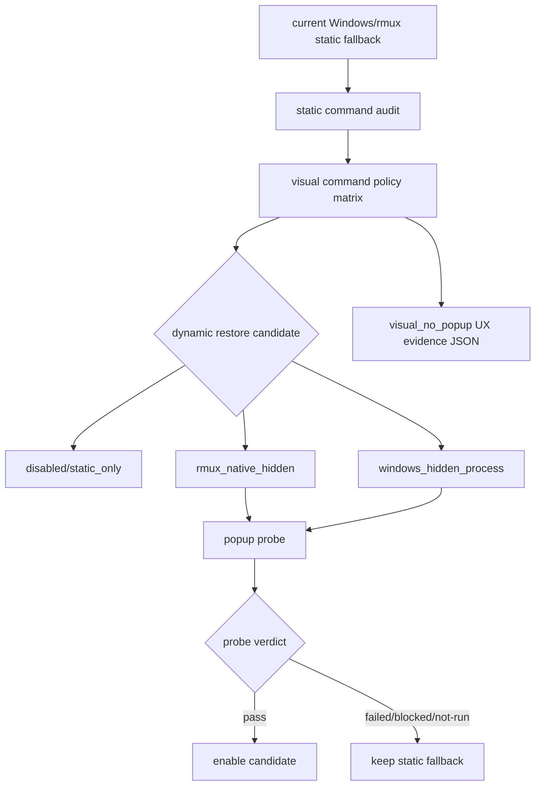

# windows-rmux-visual-no-popup-parity feature design

## 0. 术语约定

| 术语 | 定义 | 防冲突结论 |
|---|---|---|
| static fallback | Windows/rmux 下禁用 `ccb-git.sh`、`ccb-status.sh`、`ccb-border.sh`、`#()` 和 `run-shell` 后保留的静态主题/status/border。 | 这是安全 baseline，不是失败状态。 |
| no-popup evidence | 证明某条视觉动态执行路径不会产生可见 Git Bash、git-cmd、console 或 shell popup 的机器/手工证据。 | 不能只凭“代码看起来 hidden”通过；必须有 probe 或 transcript。 |
| dynamic restore | 在 no-popup evidence 通过后恢复 Git branch、ccbd health、title、border 或 status 等动态视觉信息。 | 不等于无条件恢复 shell hook。 |
| visual command policy | 一条机器可读记录，描述某个视觉动态路径是否启用、执行方式、popup probe 结果和 disabled reason。 | 供 supportability / diagnostics 消费，不靠自由 Markdown 推断。 |
| visual_no_popup parity dimension | roadmap §4.1 `WindowsRmuxUxParityEvidence.parity_dimension` 的本 feature 固定值。 | 最终证据 JSON 必须写 `visual_no_popup`。 |

Brainstorm admission：`.codestable/features/2026-07-25-windows-rmux-visual-no-popup-parity/windows-rmux-visual-no-popup-parity-brainstorm.md` 已 `confirmed`，owner 已批准采用 **evidence-gated dynamic restore** 进入 design。

## 1. 决策与约束

### 需求摘要

本 feature 不把已修复的 Git Bash popup 当作一次性 bug 处理，而是把 Windows/rmux 视觉动态状态恢复纳入可证伪的 no-popup gate。当前 static fallback 是安全 baseline；动态 Git branch、ccbd health、border/title/status 只有在 no-popup probe 通过后才能恢复。目标是证明或归因 Windows/rmux/WezTerm 下视觉状态不会产生可见 popup，并把结果投影为 roadmap §4.1 UX parity evidence。

成功标准：

- 产出 `.codestable/features/2026-07-25-windows-rmux-visual-no-popup-parity/evidence/visual-no-popup-report.json`，记录 visual command policy、static fallback baseline、dynamic restore candidates、popup probe 和 residual risks。
- 产出 `.codestable/features/2026-07-25-windows-rmux-visual-no-popup-parity/evidence/windows-rmux-ux-parity-evidence.json`，符合 roadmap §4.1，且 `parity_dimension=visual_no_popup`。
- 证明 Windows/rmux static fallback 不包含 `ccb-git.sh`、`ccb-status.sh`、`ccb-border.sh`、`#()`、`run-shell` 或可见 shell hook。
- 证明真实 UI activation 入口同样受 no-popup gate 约束：`set_tmux_ui_active()` / `config/ccb-tmux-on.sh` 在 Windows/rmux 下不得绕过 Python `apply_project_tmux_ui()` static fallback。
- 动态恢复路径必须逐项有 `popup_probe_status=pass` 才能启用；probe 缺失或失败时保持 `static_only` / `disabled` 并记录 `disabled_reason`。
- live/manual evidence 必须覆盖 native Windows + WezTerm + rmux；无法运行时只能写 `partial` 或 `blocked`，不能写 full pass。

明确不做：

- 不默认恢复 `#(ccb-git.sh)`、`#(ccb-status.sh)`、`run-shell ccb-border.sh`、resize shell hook 或任何可见 shell popup 路径。
- 不把 Windows hidden process renderer 作为无证据默认实现；只有 probe 证明 no-popup 才能作为 dynamic restore 执行方式。
- 不修改 foreground mouse/focus/scroll policy；普通 pane GUI-native 由 interaction feature 管理。
- 不修改 output/capture、pane identity/layout 或 lifecycle/recovery 契约。
- 不提升 support tier，不修改 `rmux-packaging-docs-contracts` 的 npm/install gate，不发布任何包。

### Baseline reuse / delta

复用 baseline：

- `.codestable/issues/2026-07-24-windows-rmux-git-bash-popup/windows-rmux-git-bash-popup-fix-note.md` 已记录根因和止血修复：Windows + rmux 禁用外部 shell 状态脚本、border hook 和 resize shell hook。
- `lib/cli/services/tmux_ui_runtime/service.py::_shell_commands_supported()` 当前在 Windows + `backend_impl=rmux` 时返回 false，导致 `status_script`、`border_script`、`git_script` 置空。
- `test/test_v2_tmux_ui.py::test_windows_rmux_project_ui_avoids_shell_status_commands` 已断言 Windows/rmux 渲染命令不包含 `ccb-git.sh`、`ccb-status.sh`、`ccb-border.sh`、`#()` 或 `run-shell`。
- `lib/ccbd/start_flow_runtime/service_tmux.py::tmux_layout_for_start()` 会调用 `set_tmux_ui_active_fn(True)`；`lib/cli/services/tmux_ui_runtime/activation.py::set_tmux_ui_active()` 会运行 `config/ccb-tmux-on.sh`。该 shell activation 入口当前仍可渲染 `#(${status_script} modern)` 并注册 `after-select-pane run-shell -b ... ccb-border.sh`，必须纳入本 feature 的 no-popup audit。
- `rmux-packaging-docs-contracts` 已 accepted，support projection 当前为 beta；canonical acceptance path 是 `.codestable/features/2026-07-20-rmux-packaging-docs-contracts/rmux-packaging-docs-contracts-acceptance.md`。本 feature 只提供 UX parity overlay evidence，不改 base support projection owner。

本 feature 增量：

- 把 static fallback 从“止血修复”升级为 machine-readable baseline evidence。
- 定义 `WindowsRmuxVisualCommandPolicy` 和 popup probe 报告，约束 dynamic restore 的启用条件。
- 为 Git branch、ccbd health、border/title/status 建立候选矩阵；允许通过 no-popup gate 后恢复，也允许 fail-closed 保持 static fallback。
- 生成 `visual_no_popup` UX parity evidence，供后续 supportability feature 消费。

### 复杂度档位

- 行为兼容 = L3。视觉状态是用户可见表面，popup 风险会直接破坏 Windows/rmux 日用体验。
- 外部依赖 = live/manual。核心静态断言可 headless 测试；no-popup probe 需要 native Windows + WezTerm 前台证据。
- 可测试性 = mixed。命令渲染和 JSON schema 可单测；可见 popup 需要 process sampling/transcript/manual record。
- 安全/支持 = high。不能因恢复动态 polish 提升 support tier 或改变 installer/npm owner。

### Top 3 风险与缓解

1. **风险：动态状态恢复重新引入可见 shell popup。**  
   缓解：dynamic restore 必须先通过 no-popup probe；未通过时保持 static fallback。
2. **风险：no-popup 证据过浅，只检查命令字符串不检查真实前台。**  
   缓解：report 区分 static command audit、process sampling、live rmux transcript、manual WezTerm observation；full pass 需要 live/manual 证据。
3. **风险：视觉 parity 结果被 supportability 误读为整体 supported。**  
   缓解：只产出 `visual_no_popup` UX evidence；support tier 仍由 supportability feature 汇总所有 dimensions，并受 packaging/docs contract 限制。

### 非显然依赖与关键假设

- 依赖 `windows-rmux-wezterm-native-interaction-parity` design-review passed 作为 epic child design admission；implementation 前仍需确认 parent 状态决定 live GUI lane 是否可写 pass。
- 假设 native Windows + WezTerm 前台环境可用于 manual observation；不可用时 evidence 必须 `partial` 或 `blocked`。
- 假设 current static fallback 是可接受 baseline；本 feature 不要求所有动态视觉字段第一版全部恢复。
- 假设 dynamic restore candidates 可以独立裁决：Git branch、ccbd health、title、border/status 可分别 pass/disabled，不互相替代。
- 假设 `display-message`、static tmux/rmux options 或未来 Windows hidden process 均可成为候选执行方式，但只有 no-popup evidence 通过后才能启用。

## 2. 名词与编排

### 2.1 名词层

#### 现状

- `lib/cli/services/tmux_ui_runtime/service.py::apply_project_tmux_ui()` 读取 `ccb-status.sh`、`ccb-border.sh`、`ccb-git.sh`，再交给 `render_tmux_session_theme()` 生成 status/theme。
- `service.py::_shell_commands_supported()` 在 Windows + `backend_impl=rmux` 时返回 false；随后 `status_script`、`border_script`、`git_script` 被置为 `None`。
- `service.py::_apply_sidebar_mouse_controls()` 只在 `shell_commands_supported` 为 true 时写入 resize `run-shell -b` hooks。
- `service.py::_apply_pane_theme()` 只在 `border_script is not None` 时注册 `after-select-pane` border hook；`_apply_active_pane_border()` 仍可读取 pane options 并同步当前 active border style。
- `test/test_v2_tmux_ui.py` 已有 Windows/rmux no-shell-status 断言，但没有统一的 visual command policy、popup probe report 或 roadmap §4.1 `visual_no_popup` evidence。

#### 变化

新增 evidence-first visual report；production dynamic restore 只在 no-popup evidence 通过时启用：

```python
class WindowsRmuxVisualCommandPolicy(TypedDict):
    command_id: str
    surface: Literal["status", "title", "border", "resize_hook", "health", "git"]
    dynamic_status_enabled: bool
    execution_kind: Literal[
        "disabled",
        "rmux_native_hidden",
        "windows_hidden_process",
        "static_only",
    ]
    popup_probe_status: Literal["pass", "failed", "not-run"]
    disabled_reason: str | None
    artifact_ref: str

class WindowsRmuxPopupProbeCase(TypedDict):
    case_id: str
    candidate_command: str
    host_kind: Literal["native_windows"]
    terminal_host: Literal["wezterm"]
    backend_impl: Literal["rmux"]
    observed_processes_ref: str
    visible_popup_observed: bool
    verdict: Literal["pass", "failed", "blocked"]
    diagnostics_ref: str

class VisualNoPopupReport(TypedDict):
    schema_version: Literal[1]
    baseline_refs: dict[str, str]
    policies: list[WindowsRmuxVisualCommandPolicy]
    popup_probes: list[WindowsRmuxPopupProbeCase]
    dynamic_restore_candidates: dict[str, str]
    residual_risks: list[str]
```

UX evidence projection：

| Field | Contract |
|---|---|
| `schema_version` | 固定 `1` |
| `host_kind` | 固定 `native_windows`；非 native Windows 只能作为 supporting artifact |
| `terminal_host` | 固定 `wezterm`；无 GUI/live 环境不能写 pass |
| `backend_impl` | 固定 `rmux` |
| `control_plane` | 固定 `ccbd` |
| `parity_dimension` | 固定 `visual_no_popup` |
| `evidence_status` | `pass|partial|blocked|failed`；任一 enabled dynamic policy 的 popup probe failed 必须 `failed` |
| `failure_class` | `none|rmux_unavailable|wezterm_gui_unavailable|provider_failure|system_failure|test_design_failure|unsupported_capability`；`pass` 必须为 `none` |
| `artifacts` | 必须至少包含 `visual_no_popup_report`，可包含 `static_command_audit`、`popup_probe_transcript`、`manual_wezterm_observation` |
| `residual_risks` | `partial|blocked|failed` 时必须非空；static-only pass 需说明动态字段未恢复的 UX limitation |

`popup_probe_status` 投影规则：

- 对外 `WindowsRmuxVisualCommandPolicy.popup_probe_status` 严格遵守 roadmap §4.5，只允许 `pass|failed|not-run`。
- native Windows + WezTerm / rmux 环境不可用时，policy 写 `popup_probe_status=not-run`，并通过 roadmap §4.1 的 `evidence_status=blocked|partial`、`failure_class=wezterm_gui_unavailable|rmux_unavailable|system_failure`、`residual_risks` 表达环境 blocked。
- 细粒度 `WindowsRmuxPopupProbeCase.verdict` 可以为 `blocked`，但不得把 `blocked` 写入对外 policy enum。

Per-surface candidate contract：

| Surface | Current owner/source | Existing execution path | Forbidden path | Candidate no-popup execution | Artifact / probe requirement |
|---|---|---|---|---|---|
| `git` | `terminal_runtime.tmux_theme.render_tmux_session_theme()` 通过 `ccb-git.sh "#{pane_current_path}"` 生成 Git branch。 | tmux status `#(ccb-git.sh ...)` 或 `config/ccb-tmux-on.sh` default status right。 | 可见 Git Bash / git-cmd / shell popup；无 probe 恢复 `#()`。 | `rmux_native_hidden` 或 `windows_hidden_process`，仅 probe pass 后启用。 | status option transcript、process sampling、manual no-popup observation。 |
| `health` | `config/ccb-status.sh` 从 `.ccb/ccbd/lease.json` 读取 `mount_state` 并格式化 ccbd 状态。 | tmux status `#(ccb-status.sh modern ...)` 或 shell activation default。 | 直接复活 `ccb-status.sh` visible shell hook；绕过 ccbd/support projection owner。 | 静态 `-`、rmux-native hidden read、或后续 diagnostics-projected artifact；需明确 source。 | lease/diagnostics source ref、status option transcript、popup probe。 |
| `pane_title_display` | pane title / pane border format：`select-pane -T`、`#{pane_title}`、`@ccb_agent`、`@ccb_label_style`。 | static pane-border-format 或 existing pane options；不是 status shell hook。 | 把 title 恢复误放到 shell status script；新建重复 title adapter。 | static pane options 或 rmux-native format，无 shell process。 | rmux show-options/display-message transcript；manual visual observation。 |
| `border` | `service.py::_apply_active_pane_border()` 读取 pane options；`ccb-border.sh` 是旧 dynamic hook。 | Python active pane sync 或 shell `after-select-pane run-shell ... ccb-border.sh`。 | `run-shell ccb-border.sh` / shell activation after-select-pane hook，无 probe 直接启用。 | Python/rmux native option sync 或 Windows hidden process，仅 probe pass 后动态启用。 | show-hooks transcript、process sampling、manual border observation。 |
| `resize_hook` | `service.py::_apply_sidebar_mouse_controls()` 和 `ccb-tmux-on.sh` 可注册 resize/border shell hooks。 | `run-shell -b ccb __sidebar-resize-sync` 或 shell activation hooks。 | Windows/rmux visible shell popup；activation 入口绕过 no-popup gate。 | disabled/static_only，或 future hidden execution with probe pass。 | show-hooks transcript、process sampling、manual no-popup observation。 |

##### Interface 设计检查

- Module：feature evidence 放在 `.codestable/features/.../evidence/`；production code 只在 no-popup evidence 通过时做最小 dynamic restore。
- Interface：supportability 消费 `VisualNoPopupReport` 与 roadmap §4.1 UX evidence JSON，不消费自由 Markdown。
- Seam：seam 位于 visual command policy / popup probe projection；不把 packaging support projection 或 foreground interaction policy 拉入本 feature。
- Depth / locality：visual command policy 是 deep evidence contract；第一版 evidence-gated 避免在 `service.py` 无证据恢复 shell hook。
- Dependency strategy：local-substitutable；static command audit 和 JSON schema 可 headless，popup probe/live observation 单独 partial/blocked。
- Adapter：无默认 production adapter；如果采用 `windows_hidden_process`，必须在 implementation 中保持 hidden execution owner 单一且有 no-popup evidence。

### 2.2 编排层



流程级约束：

- 先审计当前 static fallback 的命令输出；若仍包含 shell scripts、`#()` 或 `run-shell`，本 feature 必须 `failed`。
- static audit 必须同时覆盖 Python project UI 入口和 shell activation 入口：`apply_project_tmux_ui()`、`set_tmux_ui_active()`、`config/ccb-tmux-on.sh`。不能只审最后一次 Python 渲染结果。
- 每个 dynamic restore candidate 先进入 policy matrix，默认 `dynamic_status_enabled=false`。
- 只有 `popup_probe_status=pass` 的 candidate 才能启用；`failed|blocked|not-run` 必须保留 static fallback 或 disabled reason。
- `rmux_native_hidden` 和 `windows_hidden_process` 是候选执行方式，不是默认许可。
- UX evidence JSON 汇总 pass/partial/blocked/failed，不替代细粒度 report。
- supportability feature 只能消费本 feature 的 evidence；不得凭本 feature 单独把 overall support tier 推到 supported。

### 2.3 挂载点清单

- `.codestable/features/2026-07-25-windows-rmux-visual-no-popup-parity/evidence/visual-no-popup-report.json`：细粒度 visual policy / popup probe report。
- `.codestable/features/2026-07-25-windows-rmux-visual-no-popup-parity/evidence/windows-rmux-ux-parity-evidence.json`：roadmap §4.1 汇总证据。
- `.codestable/features/2026-07-25-windows-rmux-visual-no-popup-parity/evidence/manual-wezterm-no-popup-observation.md`：native Windows + WezTerm 前台观察记录。
- `config/ccb-tmux-on.sh` activation transcript / tests：真实 UI activation 入口必须和 Python project UI 一样遵守 no-popup gate。
- `test/test_windows_rmux_visual_no_popup_parity.py`：JSON schema、static command audit、policy gate 和 UX evidence validation。
- `lib/cli/services/tmux_ui_runtime/service.py`、`lib/cli/services/tmux_ui_runtime/activation.py`、`config/ccb-tmux-on.sh`、`test/test_v2_tmux_ui.py`：只有 no-popup evidence 证明 candidate 可恢复时，才做最小 production/test 改动。

### 2.4 推进策略

1. **Baseline inventory**：记录 Git Bash popup fix-note、current `_shell_commands_supported()` 行为、existing no-shell tests 和 packaging/docs support baseline。  
   退出信号：report baseline refs 指向存在的 fix-note、code、tests 和 acceptance，不声明 static fallback 未完成。
2. **Visual policy/report schema**：建立 `visual-no-popup-report.json`，校验 policies、popup probes、dynamic candidates 和 residual risks。  
   退出信号：JSON 可解析，required fields、enum、artifact refs、disabled reason 和 failure rules 通过。
3. **Static command audit**：覆盖 Windows/rmux `apply_project_tmux_ui()` 输出和真实 UI activation 入口 `set_tmux_ui_active()` / `config/ccb-tmux-on.sh`，确认不含 shell scripts、`#()`、`run-shell`、resize/border shell hook。  
   退出信号：test/report 同时证明 Python project UI 与 shell activation static fallback no-popup；发现 shell hook 即 failed。
4. **Dynamic restore gate**：为 Git branch、ccbd health、pane_title_display、border/status candidates 建立 policy gate。  
   退出信号：每个 candidate 都有 `execution_kind`、`popup_probe_status`、`dynamic_status_enabled`、`disabled_reason`；未 pass probe 不启用。
5. **Popup probe / live observation**：在 native Windows + WezTerm + rmux 上记录 process sampling、rmux options/hooks transcript 和 manual observation。  
   退出信号：probe case 有 observed processes artifact、visible popup verdict、diagnostics_ref；GUI 不可用时 evidence_status 不能为 pass。
6. **UX evidence integration**：生成 `windows-rmux-ux-parity-evidence.json`，固定 `parity_dimension=visual_no_popup`。  
   退出信号：roadmap §4.1 required fields、enum、artifacts、residual_risks 校验通过。
7. **Restore-if-probe-passed**：只对 probe passed 的 candidate 做最小 dynamic restore；其余保持 static fallback。  
   退出信号：相关 pytest、YAML/JSON 校验、py_compile 通过；enabled candidate 都有 no-popup evidence；未启用项有 disabled_reason。
8. **Final scope / validation guard**：确认 no-popup changes 未漂移到 support tier、npm/install gate、foreground interaction、capture、identity 或 lifecycle contract。  
   退出信号：scope guard / diff review 通过；static-only 结果不因没有 production dynamic restore 被误判为缺 step。

### 2.5 结构健康度与微重构

##### 评估

- 文件级 — `lib/cli/services/tmux_ui_runtime/service.py`：已有 theme、mouse binding、resize hook、border style 多项 UI 编排职责；本 feature 不应继续塞入大量 probe/report 逻辑。
- 文件级 — `test/test_v2_tmux_ui.py`：已有 Windows/rmux no-shell-status 断言，适合保留 production behavior regression，但不适合承载完整 JSON evidence schema。
- 目录级 — feature `evidence/`：适合承载 visual report、UX evidence JSON、popup probe transcript 和 manual observation。
- 目录级 — `test/`：如新增 schema/report validator，应单独放 `test/test_windows_rmux_visual_no_popup_parity.py`，避免把 roadmap evidence contract 混进既有 tmux UI behavior tests。

##### 结论：不做预置行为微重构

第一版不拆 `service.py`。implementation 先建立 evidence/report/test gate；只有 probe 通过且需要 production dynamic restore 时，才在既有 shell command support gate 附近做最小改动。若发现需要通用 Windows hidden execution runner，应作为后续 `cs-refactor` 或独立 feature 输入，不在本 item 里顺手建立大型 runner。

## 3. 验收契约

### 3.1 关键场景清单

| ID | 输入 / 触发 | 期望可观察结果 | 证据类型 |
|---|---|---|---|
| AC-001 | Windows/rmux static fallback apply project UI | 渲染命令不包含 `ccb-git.sh`、`ccb-status.sh`、`ccb-border.sh`、`#()`、`run-shell` | pytest / report |
| AC-002 | Windows/rmux shell activation entry | `set_tmux_ui_active()` / `ccb-tmux-on.sh` 不会绕过 no-popup gate 写入 shell status/border/resize hook | pytest / transcript |
| AC-003 | visual report schema | 每条 policy 有 surface、execution_kind、dynamic_status_enabled、popup_probe_status、disabled_reason、artifact_ref；`popup_probe_status` 只允许 `pass|failed|not-run` | JSON / pytest |
| AC-004 | dynamic candidate 未运行 probe | candidate 保持 disabled/static_only，不能启用 dynamic restore；环境 blocked 通过 UX evidence 表达，不扩展 policy enum | JSON / pytest |
| AC-005 | dynamic candidate probe failed | UX evidence 标 failed 或 partial/blocked，不得 pass；candidate 不启用 | JSON / transcript |
| AC-006 | dynamic candidate probe passed | candidate 可启用，且 artifacts 指向 process sampling、rmux transcript、manual observation | JSON / live |
| AC-007 | native Windows + WezTerm 不可用 | no-popup live lane 标 blocked/partial，不能写 full pass | JSON / manual |
| AC-008 | UX evidence JSON | required fields、enum、artifact refs、partial/blocked residual risk 校验通过，`parity_dimension=visual_no_popup` | JSON validation |
| AC-009 | per-surface owner/source | Git、health、pane_title_display、border、resize_hook 都有 current owner/source、forbidden path 和 candidate execution | design/report |
| AC-010 | scope guard | 不修改 support tier、npm/install gate、foreground interaction、capture、identity 或 lifecycle contract | diff review / guard |

### 3.2 明确不做的反向核对项

- 不应默认恢复 shell script status hook、border hook 或 resize `run-shell`。
- 不应把 `popup_probe_status=not-run|blocked|failed` 的 candidate 启用。
- 不应在对外 `WindowsRmuxVisualCommandPolicy.popup_probe_status` 写入 roadmap §4.5 未定义的 `blocked`。
- 不应把 static command audit 当作完整 live no-popup evidence。
- 不应在缺 native Windows + WezTerm evidence 时写 `evidence_status=pass`。
- 不应只审计 `apply_project_tmux_ui()`，漏掉 `set_tmux_ui_active()` / `ccb-tmux-on.sh` activation 入口。
- 不应修改 `rmux-packaging-docs-contracts` support projection、npm gate 或 `install.ps1` gate。

### 3.3 Acceptance Coverage Matrix

| Scenario | Covered By Step | Evidence Type | Command / Action | Core? |
|---|---|---|---|---|
| AC-001 static no-shell audit | S3 | pytest / report | Windows/rmux project UI no-shell test | yes |
| AC-002 activation no-shell audit | S3 | pytest / transcript | set_tmux_ui_active / ccb-tmux-on activation audit | yes |
| AC-003 policy schema | S2 | JSON / pytest | visual report schema validator | yes |
| AC-004 not-run probe disabled | S4 | JSON / pytest | policy gate validator | yes |
| AC-005 failed probe fail closed | S4/S5 | JSON / transcript | popup probe fixture/live transcript | yes |
| AC-006 passed probe enabled candidate | S5/S7 | JSON / live | native Windows + WezTerm popup probe | yes |
| AC-007 GUI unavailable blocked/partial | S5/S6 | JSON / manual | live lane blocked record | yes |
| AC-008 UX evidence | S6 | JSON validation | roadmap §4.1 evidence validator | yes |
| AC-009 per-surface source ownership | S4 | design/report | policy matrix owner/source validation | yes |
| AC-010 scope guard | S8 | diff review / guard | no support/install/interaction/capture/identity/lifecycle drift | yes |

### 3.4 DoD Contract

| ID | 要求 | 证据 | 阻塞级别 |
|---|---|---|---|
| DOD-DESIGN-001 | design/checklist/review 完整，引用 confirmed brainstorm 和 roadmap §4.1/§4.5 | design review | blocking |
| DOD-IMPL-001 | `visual-no-popup-report.json` 存在并通过 schema/enum/artifact/disabled reason 校验 | pytest / JSON validate | blocking |
| DOD-IMPL-002 | `windows-rmux-ux-parity-evidence.json` 存在，`parity_dimension=visual_no_popup` | pytest / JSON validate | blocking |
| DOD-IMPL-003 | static fallback command audit 证明 Python project UI 与 shell activation 入口均无 shell scripts、`#()`、`run-shell` | pytest / report | blocking |
| DOD-IMPL-004 | `popup_probe_status` 遵守 roadmap §4.5 `pass|failed|not-run`；环境 blocked 通过 UX evidence 表达 | pytest / JSON validate | blocking |
| DOD-IMPL-005 | dynamic restore candidate 未通过 probe 时 fail closed，不启用动态路径 | pytest / report | blocking |
| DOD-IMPL-006 | enabled dynamic candidate 必须有 no-popup probe pass artifact | JSON / live transcript | blocking |
| DOD-IMPL-007 | native Windows + WezTerm live/manual evidence 不可用时不能写 full pass | JSON / QA report | blocking |
| DOD-IMPL-008 | Git、health、pane_title_display、border、resize_hook owner/source 清晰，不复活错误 adapter | report / diff review | blocking |
| DOD-IMPL-009 | 不修改 packaging/support tier owner、npm/install gate 或其他 parity dimension contract | diff guard | blocking |
| DOD-REVIEW-001 | code review passed 且无 unresolved blocking | review report | blocking |
| DOD-QA-001 | QA 覆盖 JSON evidence、static audit、dynamic gate、popup probe/live blocked 归因、scope guard | QA report | blocking |
| DOD-ACCEPT-001 | acceptance 回写 roadmap item，并记录 residual risks / supportability handoff | acceptance report | blocking |

Validation Commands:

| ID | 命令 | 目的 | 核心性 | 失败处理 |
|---|---|---|---|---|
| CMD-001 | `python ".codestable/tools/validate-yaml.py" --file ".codestable/features/2026-07-25-windows-rmux-visual-no-popup-parity/windows-rmux-visual-no-popup-parity-checklist.yaml" --yaml-only` | checklist YAML 合法性 | core | fix-or-block |
| CMD-002 | `python ".codestable/tools/validate-yaml.py" --file ".codestable/roadmap/windows-rmux-ux-parity-hardening/windows-rmux-ux-parity-hardening-items.yaml"` | roadmap items 回写合法性 | core | fix-or-block |
| CMD-003 | `python -m pytest -q test/test_windows_rmux_visual_no_popup_parity.py` | visual report、UX evidence、policy gate、popup probe status、activation audit 和 scope guard | core | fix-or-block |
| CMD-004 | `python -m pytest -q test/test_v2_tmux_ui.py -k "windows_rmux_project_ui_avoids_shell_status_commands or set_tmux_ui_active or ccb_tmux_on or rmux_accepts_mouse_context_project_ui_bindings"` | 既有 Windows/rmux UI no-shell、activation 入口和 live binding baseline 防回退 | core | fix-or-block |
| CMD-005 | `python -m py_compile "lib/cli/services/tmux_ui_runtime/service.py" "lib/cli/services/tmux_ui_runtime/activation.py" "test/test_v2_tmux_ui.py"` | 相关 Python module 语法检查 | core | fix-or-block |
| CMD-006 | `python -m pytest -q test/test_rmux_packaging_docs_contracts.py test/test_cli_doctor_rmux_packaging.py` | support projection / doctor owner 不被误改 | supporting-guard | fix-or-block-if-touched |

Required Artifacts：design、checklist、design-review、`evidence/visual-no-popup-report.json`、`evidence/windows-rmux-ux-parity-evidence.json`、`evidence/manual-wezterm-no-popup-observation.md` 或 QA 同名记录、popup probe transcript/process sampling artifact、activation no-popup transcript/tests、schema/policy tests、scope/diff review、items.yaml 回写。

### 3.5 自我批判结论

- 可证伪性：每个核心场景都绑定 JSON 字段、pytest、transcript 或 manual observation。
- 步骤原子性：baseline、schema、static/activation audit、dynamic gate、popup probe、UX evidence、restore-if-passed、scope guard 八步分离。
- 最弱依赖：visible popup 只能由 live/manual evidence 强证明；设计要求缺 GUI 时 partial/blocked，不能伪造 pass。
- 证据完整性：policy、popup probe、artifact_ref、disabled_reason、UX evidence residual risk 缺一不可。
- 基线可执行性：当前 no-shell status test 可作为 static baseline；新增 visual evidence test 负责 schema/gate。
- 交付物可核验性：acceptance 可从 feature evidence 目录、tests、roadmap item 和 review 报告反查。
- 清洁度规则：不新增临时 TODO/FIXME、调试输出、注释掉代码、死 import；manual observation 不记录敏感本地路径、token 或 provider credential。

## 4. 与项目级架构文档的关系

- 严格遵守 roadmap §4.1 `WindowsRmuxUxParityEvidence`：本 feature 的 `parity_dimension` 固定为 `visual_no_popup`。
- 严格遵守 roadmap §4.5 `Visual/no-popup execution contract`：Windows/rmux 不允许通过 visible Git Bash / git-cmd / shell popup 执行 status/border hooks；动态状态恢复前必须有 popup probe evidence。
- 复用 Git Bash popup fix-note 和当前 static fallback；不推翻止血修复结论。
- 为后续 `windows-rmux-supportability-parity-contract` 提供 UX parity overlay evidence；不重复定义 base installer/package/release 规则。
