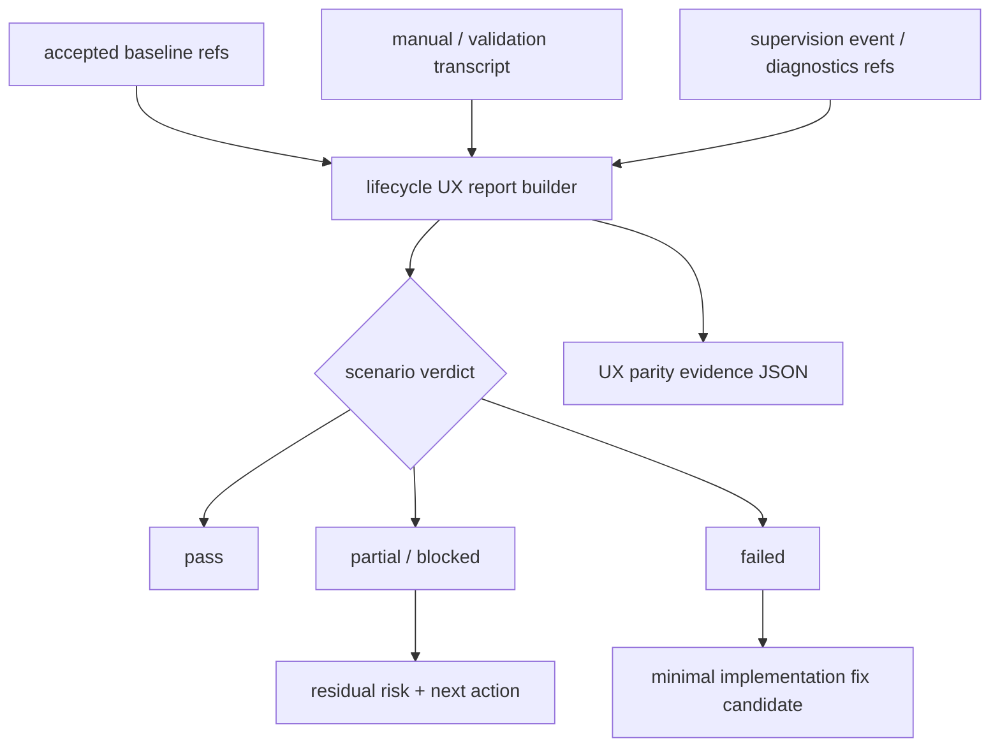

# windows-rmux-lifecycle-recovery-ux-parity feature design

## 0. 术语约定

| 术语 | 定义 | 防冲突结论 |
|---|---|---|
| lifecycle UX report | 一条可机器读取的 lifecycle 场景证据，描述场景、起始状态、用户动作、期望可见结果、verdict、residue 和 diagnostics 引用。 | 不等同于 `rmux_windows_validation_report.json` 的矩阵 row；本 feature 需要更细的用户可见恢复语义。 |
| reattach | 项目 namespace / runtime state 仍存在时，用户重新运行 `ccb` 并回到同一项目上下文。 | 不等同于 crash recovery，也不等同于 provider 重启。 |
| terminal_closed | 用户关闭 WezTerm GUI 宿主终端。 | 不能被解释为 `ccb kill`；关闭 GUI 不应自动清理项目 namespace。 |
| kill cleanup residue | 用户触发 `ccb kill` 后剩余的 endpoint、TCP token、rmux namespace/session、provider/job/process residue。 | 允许 bounded retained residue，但必须有原因和用户可理解诊断。 |
| degraded diagnostics | 自动恢复不可用或不应执行时，doctor / diagnostics / project view 给出的可见状态和下一步建议。 | 不是失败静默吞掉；必须有 `diagnostics_ref`。 |
| lifecycle_recovery parity dimension | roadmap §4.1 `WindowsRmuxUxParityEvidence.parity_dimension` 的本 feature 固定值。 | 最终证据 JSON 必须写 `lifecycle_recovery`。 |

Brainstorm admission：`.codestable/features/2026-07-26-windows-rmux-lifecycle-recovery-ux-parity/windows-rmux-lifecycle-recovery-ux-parity-brainstorm.md` 已 `confirmed`，owner 已批准采用 **UX lifecycle evidence first** 进入 design。

## 1. 决策与约束

### 需求摘要

本 feature 不默认重写 `rmux-supervision-recovery` 已 accepted 的 supervision / recovery ledger，也不重做 `ccbd-windows-full-chain-smoke` 的 start / ask / kill 基础链路证明。目标是在现有 baseline 之上建立 Windows/rmux/WezTerm lifecycle recovery UX parity 的证据契约，证明用户在 reattach、terminal close、kill cleanup、pane/provider/rmux daemon crash 场景下能继续工作，或看到明确 degraded diagnostics 与下一步建议。

成功标准：

- 产出 `.codestable/features/2026-07-26-windows-rmux-lifecycle-recovery-ux-parity/evidence/lifecycle-recovery-ux-report.json`，覆盖 `reattach`、`terminal_closed`、`kill_cleanup`、`pane_crash`、`provider_crash`、`rmux_daemon_crash` 六类场景。
- 产出 `.codestable/features/2026-07-26-windows-rmux-lifecycle-recovery-ux-parity/evidence/windows-rmux-ux-parity-evidence.json`，符合 roadmap §4.1，且 `parity_dimension=lifecycle_recovery`。
- 每条场景证据至少包含 `scenario`、`start_state`、`action`、`expected_observable`、`verdict`、`cleanup_residue`、`diagnostics_ref`、`next_action`、`evidence_source`、`failure_class`、`residual_risks`。
- `terminal_closed` 必须证明或明确标记：关闭 WezTerm 不等同于 `ccb kill`。
- `kill_cleanup` 必须复用或引用 full-chain smoke cleanup evidence，覆盖 ccbd endpoint、TCP token、rmux namespace/session、provider/job/process residue。
- crash/degraded 场景允许 `partial` 或 `blocked`，但必须有 diagnostics ref 和用户可理解 next action。

明确不做：

- 不默认重写 supervision / recovery 底层。
- 不重做 `ccbd-windows-full-chain-smoke` 的基础 start / ask / kill 证明。
- 不修改 provider completion parser 或 provider launcher。
- 不把真实 provider auth、quota、credential failure 归为 Windows/rmux lifecycle failure。
- 不扩大到 support tier、installer、npm、docs projection；这些由 `windows-rmux-supportability-parity-contract` 收口。
- 不发布 npm、不 push/tag/release、不做生产环境动作。

### Baseline reuse / delta

复用 baseline：

- `rmux-supervision-recovery` 已 accepted：`SupervisionEvent` / `SupervisionEventStore`、runtime authority evidence ledger、recovery action、project view、ping、doctor 和 diagnostics 投影。
- `ccbd-windows-full-chain-smoke` 已 accepted：native Windows true-host start / ping / doctor / ask / kill，且 cleanup evidence 覆盖 endpoint、token、rmux namespace/session 和 owned process residue。
- `rmux-windows-validation-matrix` 已 accepted：`scripts/rmux_windows_validation_matrix.py` 提供 `windows_true_host`、`manual_transcript`、`restart_replay`、`supervision_recovery`、`diagnostics`、`valid_non_success`、`provider_failure` / `system_failure` 分类和 redaction guard。
- `windows-rmux-pane-identity-layout-parity` 与 `windows-rmux-output-capture-parity` design-review 已 passed，分别提供 identity/binding 和 capture/provider evidence 的上游设计输入。

本 feature 增量：

- 把 full-chain / validation matrix 的系统证据转换为用户生命周期视角的 UX report。
- 明确 terminal close 与 kill project 的用户语义边界。
- 对 crash / degraded 场景记录 diagnostics ref 和 next action，而不是只记录底层 event kind。
- 为 supportability feature 提供 `lifecycle_recovery` parity JSON，缺失 GUI/live evidence 时 fail closed 为 partial/blocked。

### 复杂度档位

- 行为兼容 = L3。lifecycle 误判会直接影响用户是否误 kill 项目、误判 provider failure 或无法重新 attach。
- 外部依赖 = mixed。schema/report/fixture 可 headless 验证；native Windows + WezTerm foreground transcript 是 live/manual lane。
- 可测试性 = verified。report schema、verdict enum、residue fields、diagnostics refs、provider/system failure 分类均可测试。
- 数据完整性 = high。cleanup residue 和 diagnostics ref 不能由自由 Markdown 替代。

### Top 3 风险与缓解

1. **风险：重做已 accepted 的 supervision / full-chain 能力。**  
   缓解：第一步固定 baseline inventory；production rewrite 只能由 UX report 证明 broken path 后触发。
2. **风险：关闭 WezTerm 被误归因为 kill 或 crash。**  
   缓解：`terminal_closed` 单独建 scenario，要求 namespace / provider lifecycle 可解释；无法证明时不能 pass。
3. **风险：crash/degraded 场景只有底层 event，没有用户可理解 next action。**  
   缓解：每个非 pass 场景必须有 `diagnostics_ref` 和 `next_action`，否则归为 `test_design_failure` 或 `system_failure`。

### 非显然依赖与关键假设

- 依赖 `windows-rmux-pane-identity-layout-parity` 和 `windows-rmux-output-capture-parity` design-review passed 作为 epic child design admission；implementation 前仍需按 parent roadmap 重新检查实际 implementation readiness。
- Parent readiness 是 hard gate：implementation 必须读取 parent roadmap item 与对应 feature review/acceptance 状态，分别记录 `pane_identity_layout` 与 `output_capture` 的 readiness。两者尚未 accepted 时，本 feature 只能推进 schema/fixture/manual transcript parsing，依赖真实身份或 capture 的 live lane 必须 `partial` 或 `blocked`，不能写 full pass。
- 假设 validation matrix manual transcript schema 可作为输入材料，但不足以表达 lifecycle UX report 的全部字段。
- 假设真实 provider failure 应通过 provider lane 隔离；本 feature 的 fake provider path 可证明系统 lifecycle，不能声称真实 provider credentials 通过。
- 假设 `valid_non_success` 是可接受 degraded 分类，但必须升级为用户可见 diagnostics + next action 证据。

## 2. 名词与编排

### 2.1 名词层

#### 现状

- `lib/ccbd/supervision/store.py::SupervisionEvent` 记录 `event_kind`、`project_id`、`agent_name`、`desired_state`、`reconcile_state`、`prior_health`、`result_health`、`runtime_ref`、`session_ref` 和 `details`。
- `lib/ccbd/supervision/recovery_events.py::append_recovery_event()` 会把 evidence ledger 写入 supervision event details。
- `scripts/rmux_windows_validation_matrix.py` 已定义 validation matrix rows、`ROW_CLASSIFICATIONS`、`VALID_NON_SUCCESS_SCENARIOS`，并校验 true-host rows、cleanup evidence、provider/system/test-design failure。
- `artifacts/rmux-windows-validation/manual-transcript.json` 与 report rows 已包含 start/ping/ask/kill/restart/supervision/diagnostics 的 true-host evidence，但它们是 matrix 视角，不是 lifecycle UX report。

#### 变化

新增 feature-local evidence contract，不默认改变 production runtime：

```python
class WindowsRmuxLifecycleUxReportCase(TypedDict):
    scenario: Literal[
        "reattach",
        "terminal_closed",
        "kill_cleanup",
        "pane_crash",
        "provider_crash",
        "rmux_daemon_crash",
    ]
    start_state: str
    action: str
    expected_observable: str
    verdict: Literal["pass", "partial", "failed", "blocked"]
    cleanup_residue: dict[str, object]
    diagnostics_ref: str
    next_action: str
    evidence_source: str
    failure_class: Literal[
        "none",
        "rmux_unavailable",
        "wezterm_gui_unavailable",
        "provider_failure",
        "system_failure",
        "test_design_failure",
        "unsupported_capability",
    ]
    residual_risks: list[str]

class LifecycleRecoveryUxReport(TypedDict):
    schema_version: Literal[1]
    baseline_refs: dict[str, str]
    cases: list[WindowsRmuxLifecycleUxReportCase]
    summary: dict[str, object]
    residual_risks: list[str]
```

示例：

```json
{
  "scenario": "terminal_closed",
  "start_state": "native_windows/wezterm/rmux namespace running",
  "action": "close WezTerm window, then run ccb in the same project",
  "expected_observable": "ccb reattaches or reports recoverable degraded state; project is not killed",
  "verdict": "partial",
  "cleanup_residue": {},
  "diagnostics_ref": "evidence/diagnostics/terminal-closed-doctor.json",
  "next_action": "rerun ccb; if attach fails, collect diagnostics bundle",
  "evidence_source": "manual_transcript",
  "failure_class": "wezterm_gui_unavailable",
  "residual_risks": ["manual WezTerm foreground evidence must be refreshed on target host"]
}
```

字段语义：

| Field | Required | Contract |
|---|---:|---|
| `scenario` | yes | 只能取六个 lifecycle scenario enum；不得用自由字符串绕过覆盖矩阵。 |
| `start_state` | yes | 记录 native Windows / WezTerm / rmux / project namespace 的起始状态；缺 host 或 backend 状态时不能 pass。 |
| `action` | yes | 记录用户或测试执行的 lifecycle 动作；`terminal_closed` 与 `kill_cleanup` 必须不同动作。 |
| `expected_observable` | yes | 写用户能看到或机器能核验的结果，不写内部意图。 |
| `verdict` | yes | `pass|partial|failed|blocked`；`partial|failed|blocked` 必须带非 `none` failure class。 |
| `cleanup_residue` | yes | 对非 cleanup scenario 可为空对象；`kill_cleanup` 必须含 endpoint、token、rmux namespace/session、provider/job/process residue 字段。 |
| `diagnostics_ref` | yes | 指向存在或计划生成的 JSON / diagnostics artifact；non-pass 不允许为空。 |
| `next_action` | yes | 用户可执行的下一步；non-pass 不允许为空。 |
| `evidence_source` | yes | `fixture|manual_transcript|validation_matrix|diagnostics_bundle|supervision_event|mixed`；GUI full pass 不能只用 fixture/headless source。 |
| `failure_class` | yes | `pass` 必须为 `none`；`partial|failed|blocked` 必须为具体非 `none` 分类，并与 case/summary 对齐。 |
| `residual_risks` | yes | `partial|failed|blocked` 必须非空；pass 可为空。 |

UX evidence projection：

| Field | Contract |
|---|---|
| `schema_version` | 固定 `1` |
| `host_kind` | 固定 `native_windows`；非 Windows 证据不能替代 |
| `terminal_host` | 固定 `wezterm`；GUI 不可用时不能写 full pass |
| `backend_impl` | 固定 `rmux` |
| `control_plane` | 固定 `ccbd` |
| `parity_dimension` | 固定 `lifecycle_recovery` |
| `evidence_status` | `pass|partial|blocked|failed`；任一 core scenario failed 时不能 pass |
| `failure_class` | pass 时为 `none`；partial/blocked/failed 必须与 case failure class 对齐 |
| `artifacts` | 至少包含 `lifecycle_recovery_ux_report`，可包含 `manual_transcript`、`validation_matrix_report`、`diagnostics_bundle` |
| `residual_risks` | partial/blocked/failed 时必须非空 |

##### Interface 设计检查

- Module：feature evidence 放在 `.codestable/features/.../evidence/`；production runtime 仅在 evidence 证明 UX path broken 后最小修改。
- Interface：supportability 消费 `LifecycleRecoveryUxReport` 与 roadmap §4.1 UX evidence JSON，不消费自由 Markdown。
- Seam：seam 位于 lifecycle UX report builder / validation adapter；不把 provider parser、support tier 或 installer 绑定进本 feature。
- Depth / locality：lifecycle 是 deep UX contract；第一版 evidence-first 避免把 supervision、validation matrix、doctor/docs 一次性重写。
- Dependency strategy：local-substitutable；fixture/manual transcript parser 可 headless 验证，true-host WezTerm lane 单独标 partial/blocked。
- Adapter：可新增 report builder / tests；production adapter 只在 broken path 被证实时纳入实现。

### 2.2 编排层



流程级约束：

- report builder 先记录 baseline refs，再消费 manual transcript、validation matrix rows、supervision/diagnostics artifacts。
- `reattach` 与 `terminal_closed` 必须分开：前者证明重新进入同一上下文；后者证明关闭 GUI 不是 kill。
- `kill_cleanup` 必须检查 endpoint、token、rmux namespace/session、owned process/job residue；bounded residue 需要 reason。
- crash 场景允许 degraded，但每条 degraded 必须有 diagnostics ref 和 next action。
- `provider_failure` 不得污染 rmux/system failure；真实 provider 凭证失败只能影响 provider-specific lane。
- `valid_non_success` 不能直接等于 UX pass；必须转换成 partial/pass，并说明用户可见 next action。
- UX evidence JSON 只汇总 feature verdict，不替代细粒度 report。
- Parent readiness gate 先于 full pass 判定：`pane_identity_layout` 和 `output_capture` parent 未 accepted 时，依赖 parent 的 live reattach / terminal close / capture-backed cases 只能给 `partial` 或 `blocked`，并写入 `residual_risks`。

### 2.3 挂载点清单

- `.codestable/features/2026-07-26-windows-rmux-lifecycle-recovery-ux-parity/evidence/lifecycle-recovery-ux-report.json`：细粒度 lifecycle UX report。
- `.codestable/features/2026-07-26-windows-rmux-lifecycle-recovery-ux-parity/evidence/windows-rmux-ux-parity-evidence.json`：roadmap §4.1 汇总证据。
- `.codestable/features/2026-07-26-windows-rmux-lifecycle-recovery-ux-parity/evidence/lifecycle-recovery-runbook.md`：native Windows + WezTerm foreground / destructive scenarios 的手工证据入口。
- `test/test_windows_rmux_lifecycle_recovery_ux_parity.py`：report schema、case verdict、residue、diagnostics ref、parent readiness、UX evidence projection、scope guard。
- `scripts/windows_rmux_lifecycle_recovery_ux_report.py`：feature-local builder / validator 挂载点，负责从 fixture、manual transcript、validation matrix summary、diagnostics refs 生成两个 evidence JSON；删除该脚本和 feature evidence 后，本 feature 的新增行为应随之消失。
- `scripts/rmux_windows_validation_matrix.py`：只作为输入 source 或保持既有 smoke；除非已有 parser 无法导出必要 source，不新增 lifecycle UX schema，不改变 existing matrix pass semantics。
- `lib/ccbd/supervision/*`、`lib/cli/services/doctor_runtime/*`、diagnostics bundle：只有 UX report 证明 broken path 时才最小修改生产投影。

### 2.4 推进策略

1. **Baseline inventory**：记录 `rmux-supervision-recovery`、`ccbd-windows-full-chain-smoke`、`rmux-windows-validation-matrix` 的 accepted refs 和当前 artifacts。  
   退出信号：report baseline refs 指向存在的 acceptance、matrix report、manual transcript，不声明底层 recovery 未完成。
2. **Lifecycle report schema**：建立 `lifecycle-recovery-ux-report.json` schema 与 feature-local builder / validator。  
   退出信号：required fields、scenario/verdict/failure_class/evidence_source enum、diagnostics_ref、next_action、residual risk 规则可测试，且 validator 位于 `scripts/windows_rmux_lifecycle_recovery_ux_report.py` 或同名 feature-local module。
3. **Reattach / terminal closed lanes**：覆盖 reattach 和 terminal_closed，区分重新 attach、关闭 GUI、kill project。  
   退出信号：两类场景分别有 report case；GUI 不可用时 blocked/partial 且 residual risk 非空。
4. **Kill cleanup lane**：复用 full-chain cleanup evidence，补用户可读 residue summary。  
   退出信号：endpoint、token、rmux namespace/session、owned process/job residue 都有字段；bounded residue 有 reason。
5. **Crash / degraded lanes**：覆盖 pane_crash、provider_crash、rmux_daemon_crash 的 degraded diagnostics。  
   退出信号：每条 non-pass case 有 diagnostics_ref、next_action、failure_class；provider_failure 与 system_failure 分离。
6. **UX evidence integration**：生成 `windows-rmux-ux-parity-evidence.json`，固定 `parity_dimension=lifecycle_recovery`。  
   退出信号：roadmap §4.1 required fields、enum、artifact refs、parent readiness、partial/blocked/failed residual risk 校验通过。
7. **Broken path closure / minimal implementation**：如果 report 证明某条 UX path broken，做最小实现修复；否则保持 evidence-only。  
   退出信号：相关 pytest、YAML/JSON validation、matrix parser smoke 通过；无证据时不改 production recovery。

### 2.5 结构健康度与微重构

##### 评估

- 文件级 — `scripts/rmux_windows_validation_matrix.py`：文件较长，已承担 matrix manifest、parser、summary、scope guard；本 feature 不应继续把完整 UX lifecycle schema 塞进现有 matrix 脚本，最多补 projection helper 或复用 parser。
- 文件级 — `lib/ccbd/supervision/store.py` / `recovery_events.py`：职责集中，适合做 baseline input，不适合承载 UX evidence builder。
- 文件级 — `lib/cli/services/doctor_runtime/*`：doctor 是 diagnostics 投影 owner；本 feature 只有 broken path 被证实时才最小修改。
- 目录级 — feature `evidence/`：适合承载 lifecycle UX report、parity evidence 和 runbook。
- 目录级 — `test/`：已有大量 focused test 文件；新增一个 lifecycle parity evidence test 文件比塞进 validation matrix tests 更清晰。

##### 结论：不做预置行为微重构

第一版不预设生产微重构，也不把 `rmux_windows_validation_matrix.py` 拆分作为前置。implementation 应先放 feature-local report/schema/test；如果确需复用 manual transcript parser，只做最小 projection helper。若发现 validation matrix 脚本因本 feature 继续膨胀，应记录为后续 `cs-refactor`，不阻塞 lifecycle UX evidence contract。

##### 超出范围的观察

- `scripts/rmux_windows_validation_matrix.py` 已同时承担 manifest、parser、summary、scope guard。若后续 supportability 继续复用它，建议另起 `cs-refactor` 拆出 transcript parsing / report writing helpers。

## 3. 验收契约

### 3.1 关键场景清单

| ID | 输入 / 触发 | 期望可观察结果 | 证据类型 |
|---|---|---|---|
| AC-001 | 读取 accepted baseline refs 和 parent readiness | report 记录 supervision、full-chain smoke、validation matrix 的 accepted refs，并记录 pane_identity_layout / output_capture parent readiness；不声明底层 recovery 未完成 | JSON / roadmap check / diff review |
| AC-002 | `reattach` 场景 | 用户重新运行 `ccb` 能进入同一项目上下文，或明确 degraded diagnostics + next action | JSON / manual transcript |
| AC-003 | `terminal_closed` 场景 | 关闭 WezTerm 不等同于 `ccb kill`；namespace/provider lifecycle 可解释 | JSON / manual transcript |
| AC-004 | `kill_cleanup` 场景 | endpoint、token、rmux namespace/session、owned process/job residue 全部可解释；bounded residue 有 reason | JSON / parser |
| AC-005 | `pane_crash` 场景 | pane failure 与 process/provider/daemon failure 分开；恢复或 degraded diagnostics 可见 | JSON / fixture |
| AC-006 | `provider_crash` 场景 | provider failure 不归为 rmux/system failure；diagnostics 给出用户下一步 | JSON / fixture |
| AC-007 | `rmux_daemon_crash` 场景 | shared / owned daemon 按 ownership evidence 分类；允许 degraded 但必须有 next action | JSON / fixture |
| AC-008 | `valid_non_success` 输入 | 不直接升级为 pass；必须转换为 partial/pass 并说明 diagnostics_ref / residual risk | pytest / JSON |
| AC-009 | UX evidence JSON | required fields、enum、artifact refs、parent readiness、partial/blocked/failed residual risk 校验通过 | JSON validation |
| AC-010 | scope guard | 不默认重写 supervision/recovery、不改 provider parser、不修改 support tier/docs/install | diff review / guard |

### 3.2 明确不做的反向核对项

- 不应默认改写 `lib/ccbd/supervision/*` 的 recovery semantics。
- 不应把 `valid_non_success` 直接当作 UX pass。
- 不应把关闭 WezTerm 视作 kill project。
- 不应把真实 provider auth/quota/credential failure 归为 rmux lifecycle failure。
- 不应修改 provider completion parser、support tier、installer、npm 或 docs projection。
- 不应用自由 Markdown 替代 machine-readable lifecycle UX report。

### 3.3 Acceptance Coverage Matrix

| Scenario | Covered By Step | Evidence Type | Command / Action | Core? |
|---|---|---|---|---|
| AC-001 baseline reuse + parent readiness | S1 | JSON / roadmap check / diff review | validate baseline refs and parent item states | yes |
| AC-002 reattach | S3 | JSON / manual transcript | lifecycle report fixture / manual WezTerm runbook | yes |
| AC-003 terminal_closed | S3 | JSON / manual transcript | close WezTerm then rerun `ccb` evidence or blocked record | yes |
| AC-004 kill_cleanup | S4 | JSON / parser | reuse full-chain cleanup evidence | yes |
| AC-005 pane_crash | S5 | JSON / fixture | degraded diagnostics case | yes |
| AC-006 provider_crash | S5 | JSON / fixture | provider/system failure separation case | yes |
| AC-007 rmux_daemon_crash | S5 | JSON / fixture | ownership/degraded diagnostics case | yes |
| AC-008 valid_non_success conversion | S5/S6 | pytest / JSON | matrix row projection test | yes |
| AC-009 UX evidence | S6 | JSON validation | roadmap §4.1 evidence validator | yes |
| AC-010 scope guard | S7 | diff review / guard | no production rewrite unless broken path evidence | yes |

### 3.4 DoD Contract

| ID | 要求 | 证据 | 阻塞级别 |
|---|---|---|---|
| DOD-DESIGN-001 | design/checklist/review 完整，引用 confirmed brainstorm、roadmap §4.1/§4.6 和 baseline acceptance | design review | blocking |
| DOD-IMPL-001 | `lifecycle-recovery-ux-report.json` 存在并通过 schema/enum/diagnostics/residue 校验 | pytest / JSON validate | blocking |
| DOD-IMPL-002 | `windows-rmux-ux-parity-evidence.json` 存在，`parity_dimension=lifecycle_recovery` | pytest / JSON validate | blocking |
| DOD-IMPL-003 | reattach、terminal_closed、kill_cleanup、pane_crash、provider_crash、rmux_daemon_crash 均有 case | report / pytest | blocking |
| DOD-IMPL-004 | kill cleanup residue 覆盖 endpoint、token、rmux namespace/session、owned process/job residue | JSON / parser | blocking |
| DOD-IMPL-005 | non-pass / valid_non_success 均有 diagnostics_ref、next_action、residual_risks | pytest / JSON | blocking |
| DOD-IMPL-006 | provider_failure 与 system_failure 分离，不把 provider 凭证类异常归为 rmux failure | pytest / JSON | blocking |
| DOD-IMPL-007 | 未证实 broken path 时不做 production supervision/recovery 重构；证实时只做最小修复 | diff review / pytest | blocking |
| DOD-IMPL-008 | parent `pane_identity_layout` 与 `output_capture` readiness 已机器读取；未 accepted 时依赖 live GUI / capture 的 case 和 UX evidence 只能 partial/blocked | pytest / JSON / roadmap check | blocking |
| DOD-IMPL-009 | builder / validator 保持 feature-local，不能把 lifecycle schema 塞进 `scripts/rmux_windows_validation_matrix.py` 的 matrix pass 语义 | diff review / pytest | blocking |
| DOD-REVIEW-001 | code review passed 且无 unresolved blocking | review report | blocking |
| DOD-QA-001 | QA 覆盖 JSON evidence、manual transcript projection、residue、diagnostics、scope guard | QA report | blocking |
| DOD-ACCEPT-001 | acceptance 回写 roadmap item，并记录 residual risks / supportability handoff | acceptance report | blocking |

Validation Commands:

| ID | 命令 | 目的 | 核心性 | 失败处理 |
|---|---|---|---|---|
| CMD-001 | `python ".codestable/tools/validate-yaml.py" --file ".codestable/features/2026-07-26-windows-rmux-lifecycle-recovery-ux-parity/windows-rmux-lifecycle-recovery-ux-parity-checklist.yaml" --yaml-only` | checklist YAML 合法性 | core | fix-or-block |
| CMD-002 | `python ".codestable/tools/validate-yaml.py" --file ".codestable/roadmap/windows-rmux-ux-parity-hardening/windows-rmux-ux-parity-hardening-items.yaml"` | roadmap items 回写合法性 | core | fix-or-block |
| CMD-003 | `python -m pytest -q test/test_windows_rmux_lifecycle_recovery_ux_parity.py` | lifecycle report、UX evidence、residue、diagnostics、valid_non_success projection、parent readiness gate、builder/validator scope | core | fix-or-block |
| CMD-004 | `python -m pytest -q test/test_rmux_windows_validation_matrix.py` | validation matrix parser/manual transcript baseline 防回退 | core | fix-or-block |
| CMD-005 | `python -m pytest -q test/test_ccbd_rmux_supervision_recovery.py test/test_ccbd_rmux_supervision_evidence.py test/test_ccbd_diagnostics_bundle_supervision.py` | supervision/recovery evidence ledger 与 diagnostics baseline 防回退 | core | fix-or-block |
| CMD-006 | `python -m py_compile "scripts/rmux_windows_validation_matrix.py" "lib/ccbd/supervision/store.py" "lib/ccbd/supervision/recovery_events.py"` | 相关 Python module 语法检查 | core | fix-or-block |

Required Artifacts：design、checklist、design-review、`evidence/lifecycle-recovery-ux-report.json`、`evidence/windows-rmux-ux-parity-evidence.json`、`evidence/lifecycle-recovery-runbook.md` 或 QA 同名记录、feature-local builder/validator、schema/projection tests、parent readiness evidence、scope/diff review、roadmap items 回写。

### 3.5 自我批判结论

- 可证伪性：每个 core scenario 都绑定 JSON 字段、pytest、manual transcript 或 diff guard。
- 步骤原子性：baseline、schema、reattach/terminal close、kill cleanup、crash/degraded、UX evidence、broken path closure 七步分离。
- 最弱依赖：native WezTerm foreground evidence 最容易不可用；设计明确 blocked/partial，不允许 headless 伪造 GUI pass。
- 证据完整性：scenario、start_state、action、expected_observable、verdict、residue、diagnostics_ref、next_action、evidence_source、failure_class、residual_risks 缺一不可；`partial|failed|blocked` 不允许 `failure_class=none`。
- 基线可执行性：核心命令复用 validation matrix 和现有 supervision baseline tests；已核对 CMD-004 / CMD-005 指向当前 checkout 存在的测试文件。
- 交付物可核验性：acceptance 可从 feature evidence 目录、tests、roadmap item 和 review 报告反查。
- 清洁度规则：不新增临时 TODO/FIXME、调试输出、注释掉代码、死 import；不把自由 Markdown 当机器证据。

## 4. 与项目级架构文档的关系

- 严格遵守 roadmap §4.1 `WindowsRmuxUxParityEvidence`：本 feature 的 `parity_dimension` 固定为 `lifecycle_recovery`。
- 严格遵守 roadmap §4.6 `Lifecycle/recovery UX contract`：`ccb kill` 验收必须同时看 ccbd endpoint、rmux namespace/session、provider/job/process residue；crash 场景允许 degraded，但必须有用户可见 diagnostics 和下一步建议；关闭 WezTerm 不得等同 kill project。
- 复用 `rmux-supervision-recovery`、`ccbd-windows-full-chain-smoke`、`rmux-windows-validation-matrix` accepted evidence；不推翻底层 backend/control-plane 结论。
- 为后续 `windows-rmux-supportability-parity-contract` 提供机器可读 input；缺失或 partial/blocked 必须保留 residual risk，不能由 docs/support tier 自行猜测。
