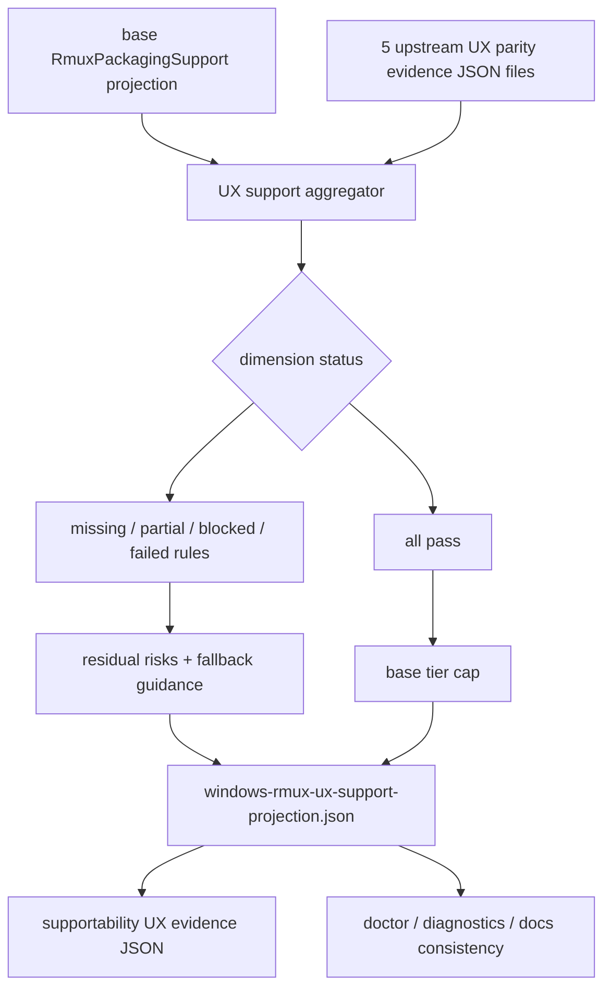

# windows-rmux-supportability-parity-contract feature design

## 0. 术语约定

| 术语 | 定义 | 防冲突结论 |
|---|---|---|
| UX support projection | 本 feature 生成的机器可读 supportability overlay，聚合 upstream UX parity evidence 与 base packaging projection，输出 support tier、dimension 状态和 fallback。 | 不替代 `RmuxPackagingSupport` 的 base packaging owner；只在其上叠加 UX parity。 |
| upstream UX dimension | supportability 之前的 5 个 UX parity 维度：foreground_interaction、output_capture、pane_identity_layout、visual_no_popup、lifecycle_recovery。 | supportability 自己不作为输入维度，避免循环依赖。 |
| supportability parity evidence | 本 feature 自己产出的 roadmap §4.1 evidence JSON，`parity_dimension=supportability`。 | 这是输出证据，不是聚合输入。 |
| base packaging projection | `rmux-packaging-docs-contracts` 已 accepted 的 `RmuxPackagingSupport` / `rmux_packaging_support_projection.json`。 | owner 仍是 `lib/terminal_runtime/rmux_packaging_support.py`，本 feature 不重写 npm/install/release gate。 |
| missing dimension | 某个 upstream UX evidence JSON 不存在、不可解析或 dimension 不匹配。 | 必须投影为 `missing`；不得用 Markdown、设计评审或口头结论替代。 |

Brainstorm admission：`.codestable/features/2026-07-26-windows-rmux-supportability-parity-contract/windows-rmux-supportability-parity-contract-brainstorm.md` 已 `confirmed`，owner 已批准采用 **Evidence aggregation first** 进入 design。

## 1. 决策与约束

### 需求摘要

本 feature 是 `windows-rmux-ux-parity-hardening` 的收口层：把前 5 个 UX parity dimensions 的机器 evidence 与 `rmux-packaging-docs-contracts` 的 base support projection 合并，生成 fail-closed 的 UX support projection，并让 doctor / diagnostics / docs consistency 可以消费同一个 supportability 结果。

成功标准：

- 产出 `.codestable/features/2026-07-26-windows-rmux-supportability-parity-contract/evidence/windows-rmux-ux-support-projection.json`，包含 base projection ref、upstream dimensions、canonical `support_tier`、install entry、fallback guidance、residual risks。
- 产出 `.codestable/features/2026-07-26-windows-rmux-supportability-parity-contract/evidence/windows-rmux-ux-parity-evidence.json`，符合 roadmap §4.1，且 `parity_dimension=supportability`。
- 聚合器读取 upstream 5 个 evidence JSON：缺失、schema 错误、dimension mismatch、host/backend/control plane mismatch 都 fail closed。
- 任一 upstream dimension 为 `failed|blocked|missing` 时，UX support projection 不得为 `supported`。
- 任一 upstream dimension 为 `partial` 时，最高为 `beta`，并在 doctor/docs projection 中列 residual risks。
- base packaging projection 当前为 `beta`、Windows npm 未启用、native Windows 入口为 `install.ps1` / source opt-in；本 feature 不能单独提高 base support tier 或启用 npm。
- 对外机器接口必须保留 roadmap §4.7 的 canonical `support_tier` 字段；`base_support_tier`、`ux_overlay_tier` 只能作为解释性 detail，不能替代 `support_tier`。

明确不做：

- 不发布 npm、不 push/tag/release、不做生产环境动作。
- 不修改 `package.json.os` 启用 `win32`，除非 base packaging owner 另有 accepted evidence 和授权；本 design 默认不做。
- 不重写 `lib/terminal_runtime/rmux_packaging_support.py` 的 base owner 规则。
- 不重做前 5 个 UX parity feature 的 evidence collection。
- 不把真实 provider auth/quota/credential failure 归为 Windows/rmux supportability failure。
- 不用自由 Markdown、design-review passed 或 QA 摘要替代 evidence JSON。

### Baseline reuse / delta

复用 baseline：

- `rmux-packaging-docs-contracts` 已 accepted：`lib/terminal_runtime/rmux_packaging_support.py` 是 base support projection owner，packaged projection 当前 `support_tier=beta`、`install_entry=install_ps1`、`windows_npm_enabled=false`、`install_ps1_rmux_check=warn`。
- 现有 doctor/diagnostics 已消费 `rmux_packaging_support_summary()`，并展示 rmux support、version、capability、validation、install entry、npm enabled、installer check 和 fallback 字段。
- 前 5 个 UX parity child feature 已有 draft design + passed design-review；implementation/acceptance 阶段会产出各自 `evidence/windows-rmux-ux-parity-evidence.json`。

本 feature 增量：

- 新增 UX supportability overlay projection，聚合 upstream UX parity evidence。
- 定义 `missing|partial|blocked|failed` 到 `experimental|beta|supported|blocked` 的 deterministic rule。
- 把 UX overlay 的结果投影给 doctor/diagnostics/docs consistency gate；缺失上游 evidence 时必须如实暴露。
- 产出 `parity_dimension=supportability` 的自身 evidence JSON，供 epic acceptance 与后续 supportability 审计消费。

### 复杂度档位

- 行为兼容 = L3。错误 support tier 会直接误导用户安装、诊断和问题归因。
- 外部依赖 = mixed。projection/schema 可 headless 验证；真实 support tier 取决于 upstream evidence 是否 accepted。
- 可测试性 = verified。JSON schema、dimension aggregation、tier rule、docs/doctor consistency 都可单测或 snapshot。
- 数据完整性 = high。不能把缺失证据解释为通过。

### Top 3 风险与缓解

1. **风险：supportability 形成循环依赖。**  
   缓解：输入只聚合前 5 个 upstream UX dimensions；supportability 自己的 evidence 是输出。
2. **风险：base packaging beta 被 UX overlay 错误推高为 supported。**  
   缓解：最终 tier 取 `base_tier` 与 `ux_overlay_tier` 的保守交集；base 未 supported 时 UX overlay 不得单独 supported。
3. **风险：docs/doctor 各自发明状态。**  
   缓解：doctor/docs consistency gate 必须读取同一 UX support projection 或其稳定摘要，不接受自由文案推导。

### 非显然依赖与关键假设

- 上游 5 个 parity evidence 可能尚未生成；本 feature implementation 可先交付 aggregator 和 missing projection，但不能通过 acceptance 声称全维度 pass。
- `rmux-packaging-docs-contracts` 当前 accepted 且 base tier 为 beta；若未来 base owner 改变 npm/install/release gate，本 feature 只消费其新 projection。
- 假设 supportability overlay 不需要新增生产 install 行为；第一版优先 feature-local projection + tests，只有 doctor/docs wiring 缺口被证实时做最小生产接入。
- 假设 roadmap §4.1 `WindowsRmuxUxParityEvidence` 是 upstream evidence 的稳定输入 schema。

## 2. 名词与编排

### 2.1 名词层

#### 现状

- `lib/terminal_runtime/rmux_packaging_support.py::RmuxPackagingSupport` 已定义 base support fields：`support_tier`、`install_entry`、`windows_npm_enabled`、`install_ps1_rmux_check`、validation refs、package/docs refs 和 `fallback_guidance`。
- `lib/terminal_runtime/rmux_packaging_support_projection.json` 是 packaged fallback projection，当前表达 beta / install_ps1 / Windows npm disabled。
- `lib/cli/services/doctor.py` 通过 `rmux_packaging_support_summary()` 把 base projection 写入 doctor payload；`lib/cli/render_runtime/ops_views_doctor.py` 渲染相关字段。
- `test/test_rmux_packaging_docs_contracts.py`、`test/test_cli_doctor_rmux_packaging.py`、`test/test_ccbd_diagnostics_bundle_rmux.py`、`test/test_rmux_docs_consistency_gate.py` 已覆盖 base packaging/docs contract。

#### 变化

新增 feature-local UX support projection contract，不默认改变 base packaging owner：

```python
class WindowsRmuxUxDimensionStatus(TypedDict):
    dimension: Literal[
        "foreground_interaction",
        "output_capture",
        "pane_identity_layout",
        "visual_no_popup",
        "lifecycle_recovery",
    ]
    evidence_status: Literal["pass", "partial", "blocked", "failed", "missing"]
    evidence_ref: str | None
    failure_class: Literal[
        "none",
        "missing_evidence",
        "rmux_unavailable",
        "wezterm_gui_unavailable",
        "provider_failure",
        "system_failure",
        "test_design_failure",
        "unsupported_capability",
    ]
    residual_risks: list[str]

class WindowsRmuxUxSupportProjection(TypedDict):
    schema_version: Literal[1]
    base_projection_ref: str
    support_tier: Literal["experimental", "beta", "supported", "blocked"]
    base_support_tier: Literal["experimental", "beta", "supported", "blocked"]
    ux_overlay_tier: Literal["experimental", "beta", "supported", "blocked"]
    install_entry: Literal["source", "install_ps1", "npm", "diagnostic_only"]
    windows_npm_enabled: bool
    parity_dimensions: dict[str, Literal["pass", "partial", "blocked", "failed", "missing"]]
    dimension_details: list[WindowsRmuxUxDimensionStatus]
    validation_ref: str
    fallback_guidance: str
    residual_risks: list[str]
```

Tier rule：

| 输入状态 | `ux_overlay_tier` | canonical `support_tier` 约束 |
|---|---|---|
| 任一 upstream dimension `failed|blocked` | `blocked` | `blocked` 或 base 更低等价；不得 supported/beta |
| 任一 upstream dimension `missing` | `experimental` | 最高 `experimental`，并列 missing refs |
| 任一 upstream dimension `partial` | `beta` | 最高 `beta`，并合并 residual risks |
| 全部 upstream dimension `pass` | `supported` | 仍受 base tier 限制；base beta 时 effective 仍 beta |
| base projection `windows_npm_enabled=false` | 不改变 UX tier | `install_entry` 不得为 `npm` |

对外字段规则：`support_tier` 是最终 effective tier，也是 roadmap §4.7、doctor、diagnostics、docs consistency 和 acceptance 唯一读取的支持档字段。`base_support_tier` 与 `ux_overlay_tier` 只用于解释 `support_tier` 的来源，不作为下游 contract。

Install entry rule：

| `support_tier` | base `install_entry` | `windows_npm_enabled` | overlay `install_entry` |
|---|---|---:|---|
| `blocked` | any | any | `diagnostic_only` |
| `experimental` | any | any | `diagnostic_only` |
| `beta` | `install_ps1` / `source` | false | base value，优先 `install_ps1` |
| `beta` | `npm` | true | `npm` |
| `supported` | any non-npm | false | base value，优先 `install_ps1` |
| `supported` | `npm` | true | `npm` |

Supportability evidence JSON：

| Field | Contract |
|---|---|
| `schema_version` | 固定 `1` |
| `host_kind` | 固定 `native_windows` |
| `terminal_host` | 固定 `wezterm` |
| `backend_impl` | 固定 `rmux` |
| `control_plane` | 固定 `ccbd` |
| `parity_dimension` | 固定 `supportability` |
| `evidence_status` | 由 canonical `support_tier` 和 projection consistency 推导；missing upstream 时不能 pass |
| `failure_class` | pass 时为 `none`；non-pass 必须具体 |
| `artifacts` | 至少包含 `ux_support_projection`、`base_packaging_projection`、`docs_or_diagnostics_consistency` |
| `residual_risks` | non-pass 必须非空 |

##### Interface 设计检查

- Module：第一版新增 feature-local builder/validator，例如 `scripts/windows_rmux_supportability_projection.py`；只有 doctor/docs 需要生产消费时才做最小接入。
- Interface：supportability 下游消费 `WindowsRmuxUxSupportProjection` 和 roadmap §4.1 supportability evidence JSON，不消费 Markdown。
- Seam：seam 位于 UX evidence aggregator；base packaging projection 仍由 `rmux_packaging_support.py` 提供。
- Depth / locality：supportability 是 deep projection contract；把 tier rule 集中在一个 aggregator，避免 README、doctor、docs 分散判断。
- Dependency strategy：local-substitutable；测试可用 feature evidence fixtures 和 packaged base projection。
- Adapter：可新增 projection builder / tests；production adapter 只在 docs/doctor consistency 需要时最小接入。

### 2.2 编排层



流程级约束：

- upstream evidence discovery 必须按 roadmap item -> feature dir -> `evidence/windows-rmux-ux-parity-evidence.json`，不得靠目录猜测成功。
- supportability 自己不读自己的 `windows-rmux-ux-parity-evidence.json` 作为输入，避免循环。
- `design-review passed` 只能证明 design readiness，不能替代 acceptance evidence；缺 evidence JSON 时投影为 `missing`。
- base tier 是上限：base 为 beta 时，即使 UX upstream 全 pass，canonical `support_tier` 仍不能高于 beta。
- provider auth/quota failure 只能保留为 provider-specific residual risk，不降级 rmux/system support tier。
- doctor production seam 固定为 `doctor_summary()` payload 的 `rmux_supportability` key；该 key 的值必须来自 UX support projection 或其稳定 packaged fallback。`render_doctor()` 必须渲染 `rmux_supportability.support_tier`、dimension summary、missing dimensions 和 fallback guidance。
- diagnostics bundle seam 固定为 raw doctor JSON 的 `rmux_supportability` 子对象；bundle 不能只保留 base `rmux_packaging_support`。
- docs/doctor 如果暂未接生产 projection，必须至少由 feature evidence 和 consistency test 证明不会宣称高于 canonical `support_tier`，但 acceptance full pass 需要真实 doctor/render path snapshot。

### 2.3 挂载点清单

- `.codestable/features/2026-07-26-windows-rmux-supportability-parity-contract/evidence/windows-rmux-ux-support-projection.json`：UX support projection。
- `.codestable/features/2026-07-26-windows-rmux-supportability-parity-contract/evidence/windows-rmux-ux-parity-evidence.json`：roadmap §4.1 supportability evidence。
- `.codestable/features/2026-07-26-windows-rmux-supportability-parity-contract/evidence/supportability-inputs.json`：upstream evidence refs 和 base projection refs 的机器索引。
- `scripts/windows_rmux_supportability_projection.py`：feature-local builder/validator，负责聚合和 fail-closed 校验。
- `test/test_windows_rmux_supportability_parity_contract.py`：projection schema、tier rule、missing/partial/failure、base tier cap、cycle guard、supportability evidence projection。
- `lib/cli/services/doctor.py`：新增或接入 `rmux_supportability` payload key，消费 UX support projection。
- `lib/cli/render_runtime/ops_views_doctor.py`：渲染 `rmux_supportability.support_tier`、dimension summary、missing dimensions 和 fallback guidance。
- diagnostics docs/tests：校验 raw bundle 包含 `rmux_supportability`，且用户可见状态不高于 projection。

### 2.4 推进策略

1. **Input inventory**：读取 base packaging projection 和 upstream 5 个 roadmap item / feature evidence refs。  
   退出信号：`supportability-inputs.json` 记录 base projection、5 个 upstream dimensions 的 expected/ref/status；缺失为 `missing`。
2. **Projection schema + tier rule**：建立 `WindowsRmuxUxSupportProjection` builder/validator。  
   退出信号：schema、dimension enum、base tier cap、missing/partial/blocked/failed/pass 规则可由 pytest 验证。
3. **Supportability evidence JSON**：生成 `parity_dimension=supportability` 的 roadmap §4.1 evidence。  
   退出信号：supportability evidence 引用 support projection 和 base projection；non-pass 有具体 failure_class / residual_risks。
4. **Doctor / diagnostics consistency**：接入或验证 `rmux_supportability` doctor/bundle seam，不让 doctor/diagnostics/docs 绕开 projection 宣称更高支持档。  
   退出信号：real-path snapshot / parser test 证明 `doctor_summary()`、`render_doctor()`、diagnostics bundle 和 docs 文案来自 projection 或与 projection 一致。
5. **Docs / support handoff**：生成或更新 runbook/contract 摘要，只说明 current effective tier、missing dimensions、fallback。  
   退出信号：README/docs 不推荐 Windows npm Rmux 入口，除非 base projection `windows_npm_enabled=true`。
6. **Scope guard**：检查不改 npm、release guard、installer owner、provider parser 和 upstream feature evidence。  
   退出信号：diff review / guard 测试证明无 `package.json.os win32`、publish/tag/release 相关变更，除非另有 owner 授权。
7. **Acceptance evidence pack**：汇总 support projection、supportability evidence、validator output、docs/doctor consistency 和 roadmap writeback。  
   退出信号：acceptance 可从机器 JSON 和测试输出反查最终 effective support tier。

### 2.5 结构健康度与微重构

##### 评估

- 文件级 — `lib/terminal_runtime/rmux_packaging_support.py`：已经是 base support projection owner；本 feature 不应把 UX dimension aggregation 直接塞进去，避免 base packaging 与 UX overlay 混合。
- 文件级 — `lib/cli/services/doctor.py` / `ops_views_doctor.py`：适合消费 projection 摘要，不适合作为 tier rule owner。
- 文件级 — docs/README：适合展示状态，不适合作为事实源。
- 目录级 — feature `evidence/`：适合承载 UX support projection、input index 和 supportability evidence。
- 目录级 — `scripts/`：已有 validation/evidence scripts；新增 feature-local projection builder 符合可卸载边界。

##### 结论：不做预置生产微重构

第一版先新增 feature-local builder/validator 和 evidence artifacts，不重构 `rmux_packaging_support.py`。如果实现证明 doctor/docs 需要生产接入，只做最小 adapter：读取或引用 UX support projection，不把 tier rule 复制到 doctor/render/docs。

##### 超出范围的观察

- 如果后续多个 roadmap 都需要叠加 support overlay，可另走 `cs-refactor` 抽通用 evidence aggregation helper；本 feature 不预置通用框架。

## 3. 验收契约

### 3.1 关键场景清单

| ID | 输入 / 触发 | 期望可观察结果 | 证据类型 |
|---|---|---|---|
| AC-001 | base packaging projection 存在 | support projection 记录 base ref 和 base tier，不重写 npm/install/release owner | JSON / pytest |
| AC-002 | upstream dimension evidence JSON 缺失 | 该 dimension 投影为 `missing`，effective tier 最高 `experimental`，residual risk 非空 | JSON / pytest |
| AC-003 | upstream dimension `partial` | canonical support_tier 最高 `beta`，合并 residual risks，doctor/docs 不宣称 supported | JSON / snapshot |
| AC-004 | upstream dimension `failed|blocked` | effective tier 为 `blocked` 或等价 fail-closed，fallback guidance 非空 | JSON / pytest |
| AC-005 | upstream 全 pass 但 base tier beta | ux_overlay_tier 可为 supported，但 canonical support_tier 仍为 beta | JSON / pytest |
| AC-006 | Windows npm disabled | install_entry 不得为 `npm`，docs 不推荐 native Windows npm Rmux 入口 | JSON / docs guard |
| AC-007 | supportability evidence JSON | `parity_dimension=supportability`，artifacts 引用 support projection/base projection/consistency evidence | JSON validation |
| AC-008 | doctor/diagnostics/docs consistency | `rmux_supportability` payload/render/bundle/docs 用户可见支持状态不高于 projection `support_tier` | snapshot / docs guard |
| AC-009 | scope guard | 不修改 npm/release/install owner/provider parser/upstream evidence | diff review / guard |

### 3.2 明确不做的反向核对项

- 不应把 supportability 自己的 evidence 当成输入。
- 不应把 design-review passed 当成 upstream pass。
- 不应在 base tier beta 时宣称 canonical `support_tier=supported`。
- 不应在 Windows npm disabled 时推荐 native Windows npm Rmux。
- 不应修改 release guard、npm publish、package win32、provider parser 或 upstream child evidence。

### 3.3 Acceptance Coverage Matrix

| Scenario | Covered By Step | Evidence Type | Command / Action | Core? |
|---|---|---|---|---|
| AC-001 base projection reuse | S1 | JSON / pytest | supportability input inventory | yes |
| AC-002 missing dimension | S1/S2 | JSON / pytest | missing fixture | yes |
| AC-003 partial dimension | S2/S4 | JSON / snapshot | partial fixture + docs/doctor guard | yes |
| AC-004 failed/blocked dimension | S2 | JSON / pytest | failed/blocked fixture | yes |
| AC-005 base tier cap | S2 | JSON / pytest | all-pass + base beta fixture | yes |
| AC-006 npm disabled | S4/S5 | JSON / docs guard | docs/package consistency | yes |
| AC-007 supportability evidence | S3 | JSON validation | roadmap §4.1 validator | yes |
| AC-008 visible consistency | S4/S5 | snapshot / docs guard | doctor/docs snapshots | yes |
| AC-009 scope guard | S6 | diff review / guard | no forbidden owner changes | yes |

### 3.4 DoD Contract

| ID | 要求 | 证据 | 阻塞级别 |
|---|---|---|---|
| DOD-DESIGN-001 | design/checklist/review 完整，引用 confirmed brainstorm、roadmap §4.1/§4.7 和 base packaging acceptance | design review | blocking |
| DOD-IMPL-001 | `windows-rmux-ux-support-projection.json` 存在并通过 schema/tier/base-cap 校验 | pytest / JSON | blocking |
| DOD-IMPL-002 | `windows-rmux-ux-parity-evidence.json` 存在，`parity_dimension=supportability` | pytest / JSON | blocking |
| DOD-IMPL-003 | upstream 5 个 dimensions 缺失时投影为 missing，不用 design-review/Markdown 替代 | pytest / JSON | blocking |
| DOD-IMPL-004 | partial/blocked/failed/missing 均有 residual risks 或 failure detail | pytest / JSON | blocking |
| DOD-IMPL-005 | base packaging tier 和 Windows npm disabled 是 canonical `support_tier` / `install_entry` 上限 | pytest / docs guard | blocking |
| DOD-IMPL-006 | doctor/diagnostics/docs 通过 `rmux_supportability` seam 展示状态，visible state 不高于 projection `support_tier` | real-path snapshot / docs guard | blocking |
| DOD-IMPL-007 | 未授权时不改 npm win32、release guard、installer owner、provider parser 或 upstream evidence | diff review / guard | blocking |
| DOD-REVIEW-001 | code review passed 且无 unresolved blocking | review report | blocking |
| DOD-QA-001 | QA 覆盖 projection JSON、supportability evidence、docs/doctor consistency 和 scope guard | QA report | blocking |
| DOD-ACCEPT-001 | acceptance 回写 roadmap item，并记录 final effective support tier / residual risks | acceptance report | blocking |

Validation Commands:

| ID | 命令 | 目的 | 核心性 | 失败处理 |
|---|---|---|---|---|
| CMD-001 | `python ".codestable/tools/validate-yaml.py" --file ".codestable/features/2026-07-26-windows-rmux-supportability-parity-contract/windows-rmux-supportability-parity-contract-checklist.yaml" --yaml-only` | checklist YAML 合法性 | core | fix-or-block |
| CMD-002 | `python ".codestable/tools/validate-yaml.py" --file ".codestable/roadmap/windows-rmux-ux-parity-hardening/windows-rmux-ux-parity-hardening-items.yaml"` | roadmap items 回写合法性 | core | fix-or-block |
| CMD-003 | `python -m pytest -q test/test_windows_rmux_supportability_parity_contract.py` | UX support projection、supportability evidence、missing/partial/failure/base-cap/cycle/scope rules、`rmux_supportability` doctor/render seam | core | fix-or-block |
| CMD-004 | `python -m pytest -q test/test_rmux_packaging_docs_contracts.py test/test_cli_doctor_rmux_packaging.py test/test_ccbd_diagnostics_bundle_rmux.py test/test_rmux_docs_consistency_gate.py` | base packaging/docs/doctor/diagnostics contract 防回退，兼容新增 supportability seam | core | fix-or-block |
| CMD-005 | `python -m py_compile "scripts/windows_rmux_supportability_projection.py" "lib/terminal_runtime/rmux_packaging_support.py" "lib/cli/services/doctor.py" "lib/cli/render_runtime/ops_views_doctor.py"` | projection script、base owner 和 doctor/render adapter 语法检查 | core | fix-or-block |
| CMD-006 | `npm run pack:check` | package manifest dry run；仅 package/docs touch 时运行 | conditional-core | fix-or-block-if-package-touched |

Required Artifacts：design、checklist、design-review、`evidence/supportability-inputs.json`、`evidence/windows-rmux-ux-support-projection.json`、`evidence/windows-rmux-ux-parity-evidence.json`、feature-local builder/validator、projection tests、doctor/docs consistency evidence、scope/diff review、roadmap items 回写。

### 3.5 自我批判结论

- 可证伪性：每个 tier rule 都有 JSON fixture / pytest 入口。
- 步骤原子性：input inventory、schema/tier、supportability evidence、visible consistency、docs handoff、scope guard、acceptance pack 分离。
- 最弱依赖：upstream evidence 尚未 accepted；设计明确 missing/partial，不允许提升支持档。
- 证据完整性：support projection 同时引用 base projection、upstream evidence 和 consistency evidence。
- 基线可执行性：复用 base packaging contract tests；新增 supportability projection test 作为核心命令。
- 交付物可核验性：acceptance 可从 feature evidence 目录、tests、`rmux_supportability` doctor/docs snapshots 和 roadmap item 反查。
- 清洁度规则：不新增临时 TODO/FIXME、调试输出、注释掉代码、死 import；不写 provider secret、TCP token、用户 home secret。

## 4. 与项目级架构文档的关系

- 严格遵守 roadmap §4.1 `WindowsRmuxUxParityEvidence`：本 feature 输出 `parity_dimension=supportability` 的 evidence JSON。
- 严格遵守 roadmap §4.7 `Supportability projection contract`：任一 core dimension failed/blocked 不得 supported；partial 只进入 beta；缺失维度投影为 missing。
- 消费 `rmux-packaging-docs-contracts` accepted base projection；不重复定义 npm、`install.ps1`、release guard 或 publish gate。
- 为 epic acceptance 提供最后的 supportability evidence，使 doctor/install/docs/support tier 能基于 parity evidence 一致声明状态。
