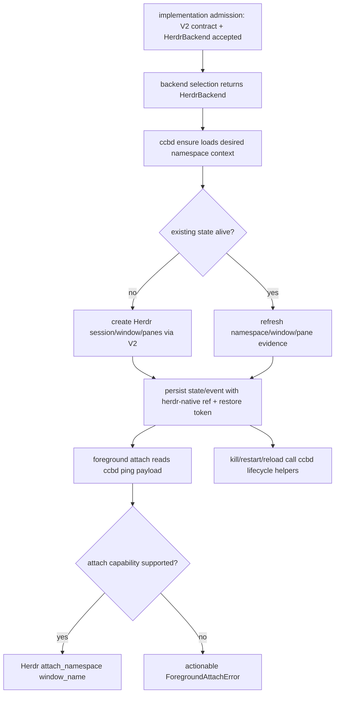

# ccbd-herdr-namespace-lifecycle feature design

## 0. 术语约定

| 术语 | 定义 | 防冲突结论 |
|---|---|---|
| Herdr project namespace | ccbd 管理的项目级 terminal namespace，backend evidence 来自 Herdr session。 | 不是 provider runtime session，也不是 Herdr recovery owner。 |
| ccbd project authority | ccbd 仍决定 namespace epoch、layout、pane role、kill/restart/reload 编排和 durable state。 | Herdr session/pane 只提供 terminal backend primitive/evidence。 |
| Herdr namespace durable state | project namespace state 中能持久表达 `herdr-native`、`herdr_socket`、`restore_token` 的字段集合。 | 旧 `tmux_*` 字段作为兼容 alias 保留，但 Herdr 不伪装为 `tmux-family`。 |
| internal namespace ref | ccbd 内部 backend 调用使用的 `MuxNamespaceRefV2`，允许包含 opaque `restore_token`。 | 只在 state store / runtime helper 内流转，不进入 ping、project view、foreground summary 或日志。 |
| public namespace payload | ccbd 对外 payload、event summary、project view、foreground summary 使用的 redacted namespace 投影。 | 只允许 `restore_token_present` 或等价布尔值，不输出 raw token。 |
| MuxBackend V2 runtime path | project namespace runtime 通过 V2 小协议调用 backend 的路径。 | 不再用 `backend_family == "tmux-family"` 判断是否能走 mux backend。 |
| foreground attach | `ccb` start 后前台进程连接到已创建的 project namespace。 | Herdr attach 必须使用 backend presentation capability；缺 capability 时返回 actionable blocked/degraded error，不走 tmux attach。 |

仓库事实：

- `lib/ccbd/services/project_namespace_state_runtime/models.py` 当前 `NAMESPACE_BACKEND_FAMILY = "tmux-family"`，`resolved_namespace_backend_family()` 永远返回该常量；`tmux_socket_path` 对非 `rmux|psmux` backend 必填。
- `lib/ccbd/services/project_namespace_runtime/models.py` 与 `namespace_projection.py` 默认 `ipc_kind` 对 `rmux|psmux` 为 `named_pipe`，否则为 `unix_socket`；尚不能投影 `herdr_socket` 或 `restore_token`。
- `lib/ccbd/services/project_namespace_runtime/backend.py` 的 `_is_mux_backend()` 只认 `backend_family == "tmux-family"`，这会让 `herdr-native` backend 错误落入 tmux `_tmux_run` fallback。
- `ProjectNamespaceController.default_project_namespace_backend()` 目前只通过 `TerminalBackendSelection` 创建 `TmuxMuxBackendAdapter`、`PsmuxBackend`、`RmuxBackend`。
- `lib/cli/services/start_foreground.py` 只对 `backend_impl == "rmux"` 特判；其它 backend 默认走 tmux binary attach。
- `lib/ccbd/project_view/service.py` 的 `_namespace_view()` 直接读取 namespace 字段输出 project view，且 `_refresh_sidebar_panes()` / `_collect_tmux_project_view_facts()` 仍以 `namespace.tmux_session_name` 驱动 tmux facts。
- `materialize_topology.py`、`reflow.py`、`destroy.py` 已经通过 `create_session`、`ensure_window`、`split_pane`、`kill_window`、`kill_server` 等 helper 编排 lifecycle，适合在 helper 层扩展 V2 backend，而不是在每个调用点散落 Herdr 分支。
- `additive_patch_apply.py`、`additive_patch_windows.py`、`additive_patch_agents.py`、`move_patch_agents.py`、`remove_patch_agents.py`、`agent_window_reflow.py` 是 reload patch 的真实执行路径；其中仍存在 `current.tmux_socket_path` 建 backend、`move-pane`、`select-layout`、`kill-pane` 等 tmux-only runner path。
- `lib/ccbd/handlers/project_restart.py::restart_project_agent_panes_in_place()` 当前只支持 `tmux` backend，非 tmux 会返回 `status="skipped", reason="unsupported_for_backend"`；`build_project_restart_agent_handler()` 同步返回每个 agent 的结果，但 `build_project_restart_panes_handler()` 先返回 `status="scheduled"` 再在 `_after_response` 中丢弃结果。Herdr provider pane restart 属于后续 `provider-runtime-on-herdr` 的范围。
- 前置 `mux-backend-contract-herdr-v2` 与 `herdr-backend-client` design-review 已 passed；实现阶段仍必须证明 V2 contract 与 `HerdrBackend` 真实落地，design-review passed 只允许继续本 child design。

## 1. 决策与约束

### 需求摘要

本 feature 把前置 Herdr backend 接入 ccbd project namespace 的生命周期：创建/恢复 namespace、materialize pane topology、workspace reflow、foreground attach、kill、restart 和 reload patch。目标是让 ccbd 在 Herdr backend 下仍保持 project authority，并把 Herdr session/pane 作为 backend evidence 写入 state、event、ping payload 和 foreground attach payload。

成功标准：

- project namespace durable state 能表达 `namespace_backend_family="herdr-native"`、`backend_impl="herdr"`、`namespace_ipc_kind="herdr_socket"`、`namespace_ipc_ref` 和 `namespace_restore_token`；旧 tmux/rmux records 可继续读取。
- raw `namespace_restore_token` 只允许写入 private durable state 和 internal backend call；ping payload、event summary、project view、foreground summary 和日志只能输出 `namespace_restore_token_present=true|false` 或 redacted namespace ref。
- project namespace runtime 通过 MuxBackend V2 capability 识别 Herdr backend；`herdr-native` 不再被 `_is_mux_backend()` 排除到 tmux fallback。
- `ensure()` / layout materialization / `reflow_workspace()` 对 Herdr 走 V2 namespace/window/pane capability；缺 layout/split/identity/attach capability 时 fail closed，并写可诊断错误。
- foreground attach 对 Herdr 走 backend `attach_namespace()` 或等价 presentation capability；缺 capability 或 `ui_attachable=false` 时返回含 backend selection、ipc、capability gap 的 `ForegroundAttachError`，不得调用 tmux binary。
- kill/reload 仍由 ccbd handler/supervisor 编排；Herdr 只执行 `destroy_namespace` / `kill_server(namespace)` / `kill_window` / `kill_pane` 等 backend primitive。`restart` 在本 feature 只保证 Herdr backend 下不会误报 provider pane restart 成功：`project_restart.py` 必须返回明确 unsupported/deferred evidence，并保留给 `provider-runtime-on-herdr` 实现 provider pane restart。
- 本 feature acceptance 必须产出最小 Native Windows x64 foreground/manual transcript，覆盖 `ccb` project namespace 创建、foreground attach、kill、reload，以及 restart unsupported/deferred evidence；缺 Native Windows x64/Herdr 真机时只能 blocked，不能把该证据后移到 validation matrix。
- project view / ping payload 只投影本 feature 必须的 namespace backend evidence；Mobile、Config UI、doctor/support tier 的完整用户可见面留给后续 child。

明确不做：

- 不实现或修改 production Herdr socket client 的 schema/capability 逻辑；只消费已验收的 `HerdrBackend` / MuxBackend V2 surface。
- 不改 provider runtime、ask/pend/completion/cancellation，不把 Herdr agent state 当作 CCB completion authority。
- 不实现 bounded recovery owner、90 秒 probation、backoff/circuit；Herdr restore 只保存 opaque `restore_token` 作为后续 recovery 输入。
- 不改 Mobile terminal、Config UI、doctor/support tier、package/release surface、public workflow validation matrix。
- 不发布、不 promotion、不执行 git commit/push/tag/merge/release/deploy。

### 方案深度 pre-pass

候选：

- 只在 `start_foreground.py` 增加 `backend_impl == "herdr"` 分支，不动 durable state。
- 复用 tmux-family state，把 Herdr `ipc_ref` 塞进 `tmux_socket_path`。
- 本 feature 方案：做 additive durable state migration + helper 层 V2 capability path + Herdr foreground attach path。

选择本 feature 方案。原因是 project namespace lifecycle 是长期维护的核心控制面，Herdr 不能伪装成 tmux-family；只改 foreground attach 会让 ensure/reflow/kill/reload 仍不可信。迁移采用 additive 字段和旧记录兼容，不重写 state store。

### Top 3 风险与缓解

1. **风险：Herdr 被误走 tmux fallback。**  
   缓解：把 mux backend 判定改成 capability/protocol 判定，并用 test 覆盖 `backend_family="herdr-native"` 时不会调用 `_tmux_run` / tmux binary。
2. **风险：durable state 破坏旧 tmux/rmux 项目。**  
   缓解：state migration additive；旧记录缺 family/restore token 时按现有 tmux/rmux 规则恢复，新增 tests 覆盖旧 payload。
3. **风险：namespace lifecycle 偷偷承担 provider/recovery/user-surface 范围。**  
   缓解：scope/content guard 禁止 provider runtime、recovery、doctor/support、Mobile/Config UI、package/release 相关 diff 或术语越界。

### 非显然依赖与关键假设

- 依赖前置 `mux-backend-contract-herdr-v2` 和 `herdr-backend-client` 的 implementation/acceptance，不只依赖 design-review。若 `HerdrBackend`、V2 refs/errors/capabilities、`herdr_socket`、`schema-mismatch`、`HerdrBackend.attach_namespace()` 或 foreground presentation/layout capability 未真实落地，本 feature implementation 必须 dependency-blocked。
- 假设 HerdrBackend 能提供 namespace lifecycle、window layout、pane IO、pane identity、foreground attach 的 V2 capability；任一 core capability 为 unsupported/blocking gap 时本 feature不能宣称 attachable。
- 假设 `tmux_session_name` 可作为 legacy alias 保留为 Herdr session title/name，但 authority 字段应是 `namespace_ref.session_name` 与 `namespace_id`。
- 完整 public workflow validation matrix 仍由后续 child 负责；本 feature 必须收集最小 Native Windows x64 foreground/manual transcript。本 feature 的自动化测试用 fake Herdr V2 backend 覆盖 ccbd 编排。

## 2. 名词与编排

### 2.1 名词层

#### 现状

- `ProjectNamespaceState` 是 ccbd project namespace 的 durable authority，负责 `namespace_epoch`、`layout_version/signature`、control/workspace window、`ui_attachable` 和 event summary。
- `ProjectNamespace` 是 runtime DTO，`namespace_ref()` 当前返回 legacy tmux-family shape。
- `backend.py` helper 把 tmux CLI 和 MuxBackend 小协议藏在统一函数后面，但 `_is_mux_backend()` 只接受 tmux-family。
- foreground attach 通过 ccbd `ping` payload 读取 namespace fields；rmux 有 `attach_namespace` path，tmux path 直接运行 `tmux attach-session`。

#### 变化

Additive 扩展 namespace state 和 projection：

```python
class ProjectNamespaceStateV2(TypedDict):
    namespace_backend_family: Literal["tmux-family", "herdr-native"]
    backend_impl: Literal["tmux", "psmux", "rmux", "herdr"]
    namespace_id: str
    namespace_session_name: str
    namespace_ipc_kind: Literal["unix_socket", "named_pipe", "socket_name", "socket_path", "herdr_socket", "tcp_loopback", "none"]
    namespace_ipc_ref: str
    namespace_restore_token: str | None
    namespace_ref: MuxNamespaceRefV2  # private/internal; may include restore_token
```

兼容规则：

- 旧 records 缺 `namespace_backend_family` 时，`backend_impl in {"tmux","psmux","rmux"}` 解析为 `tmux-family`。
- 新 records 若 `backend_impl == "herdr"`，必须持久化 `namespace_backend_family="herdr-native"`、`namespace_ipc_kind="herdr_socket"`；`tmux_socket_path` 允许为空，`tmux_session_name` 保留为 legacy alias。
- `ProjectNamespaceState.namespace_ref()` 或等价 internal ref builder 必须包含 `restore_token` key；tmux/rmux 可为 `None`。
- `summary_fields()`、`ProjectNamespaceEvent.summary_fields()`、ping payload、project view payload、foreground summary 和日志必须使用同一个 public/redacted namespace projection helper：保留 family、impl、namespace id、session、ipc kind/ref，删除 raw `restore_token`，新增 `namespace_restore_token_present`。`namespace_ref()` 或 internal ref builder 可以含 raw token，但 public helper 不得返回它。
- `lib/ccbd/project_view/service.py::_namespace_view()` 必须从 redacted namespace projection 构造 project view；`_refresh_sidebar_panes()` / `_collect_tmux_project_view_facts()` 只能在 backend capability 表示 tmux-compatible project-view facts 时读取 tmux facts，否则对 Herdr 返回 degraded/empty backend facts，不得通过 legacy `tmux_session_name` 间接绕过 redaction。
- `to_record()` 可在 private state store 中持久化 raw `namespace_restore_token`，event record 默认不写 raw token；若后续实现证明 event store 是 private 且需要 restore token，也必须新增 redaction helper 并用 tests 证明 public payload 不泄露。

Runtime backend capability 识别：

```python
def require_backend_operation(backend: object, operation: str) -> None:
    # behavior contract only: exact function name is implementation detail
    required = {
        "prepare_server": ("prepare_server",),
        "create_session": ("namespace_ref", "create_session"),
        "ensure_window": ("namespace_ref", "ensure_window"),
        "split_pane": ("pane_ref", "split_pane"),
        "kill_window": ("namespace_ref", "kill_window"),
        "kill_server": ("namespace_ref", "kill_server"),
        "reflow_window": ("namespace_ref", "reflow_window"),
        "attach_namespace": ("attach_namespace",),
    }[operation]
    if any(not callable(getattr(backend, name, None)) for name in required):
        raise MuxBackendCapabilityError(operation=operation, backend_impl=backend.backend_impl)
```

实现不必须使用该函数名，但行为必须等价：不能用单一 `namespace_ref + session_alive` 判定整个 backend 可执行。每个 helper 按自身 operation 检查必需方法和 `capabilities()` 状态，unsupported 映射为结构化 capability gap；tmux-specific fallback 仅给旧 tmux adapter 或 raw tmux backend，不给 `herdr-native` 补成功路径。

Foreground attach DTO：

```python
@dataclass(frozen=True)
class ForegroundAttachSummary:
    project_id: str
    tmux_socket_path: str | None
    tmux_session_name: str | None
    backend_impl: str
    namespace_id: str | None
    session_name: str | None
    ipc_kind: str | None
    ipc_ref: str | None
    namespace_restore_token_present: bool = False
```

`namespace_restore_token_present` 只表示 state 有 opaque restore token，不输出 token 值。

Foreground attach Herdr factory seam：

```python
def build_herdr_attach_backend(
    *,
    namespace_ref: dict[str, object],  # redacted public payload; no raw restore_token
    backend_selection: dict[str, object],
):
    ...
```

实现不必须使用该函数名，但必须提供可注入 builder/factory，类似现有 `_build_rmux_attach_backend()`。该 seam 只消费 redacted namespace payload 与 selection diagnostics，内部再通过前置 HerdrBackend resolver/factory 验证 capability；不得在 foreground CLI 内硬编码 socket schema、重复 platform gate 或读取 raw restore token。

##### Interface 设计检查

- Module：`ccbd.services.project_namespace_runtime` + `project_namespace_state_runtime`，改造为消费 MuxBackend V2 的 project namespace 编排层。
- Interface：caller 看到的是 `ProjectNamespace`、redacted state/event `summary_fields()`、ccbd ping payload、foreground attach summary/error；Herdr JSON 和 raw restore token 不外露。
- Seam：backend seam 放在 existing helper 层、`default_project_namespace_backend()` 与可注入 Herdr foreground attach builder；测试通过 fake Herdr V2 backend 穿过 controller/foreground public path。
- Depth / locality：deep。Herdr-specific IPC、restore token、pane id 格式、layout capability 集中在 projection/helper/adapter boundary，不散到 provider runtime。
- Dependency strategy：local-substitutable。unit tests 用 fake Herdr V2 backend；production Herdr 是前置 child 提供的 true external adapter。
- Adapter：本 feature 不写 production socket adapter；只接入已存在的 `HerdrBackend` factory 和 fake V2 backend。
- Test surface：project namespace state tests、public payload redaction tests、controller ensure/reflow/destroy tests、foreground attach builder seam tests、reload patch focused tests、scope guard。
- Project view test surface 必须覆盖 `lib/ccbd/project_view/service.py::_namespace_view()`、sidebar refresh facts 和 tmux facts collection：Herdr payload 只输出 redacted namespace fields，raw `restore_token` 不得出现在 project view record 或日志。

### 2.2 编排层



流程级约束：

- implementation admission 先跑：V2 contract、`HerdrBackend`、Herdr capability gate、`HerdrBackend.attach_namespace()`、foreground presentation/layout capability、platform gate reader 均已实现且验收；否则本 feature dependency-blocked。
- `ensure()` 创建/刷新 Herdr namespace 时，state 的 `namespace_epoch` 和 `workspace_epoch` 仍由 ccbd 递增；Herdr `restore_token` 不得反向决定 epoch。
- `materialize_topology()` 对 Herdr 使用 V2 `ensure_window`、`window_root_pane`、`split_pane`、`respawn_pane`、`set_pane_identity`、`select_window`；不要求 pane id 以 `%` 开头。
- `apply_project_tmux_ui()` 只可在 backend capability 表示 tmux-compatible presentation 时执行；Herdr 不支持 tmux option 时不得调用该 tmux UI path，要么跳过并记录 degraded evidence，要么在保存成功/attachable state 前 fail closed。
- `reflow_workspace()` 对 Herdr 只能在 layout/window/pane kill/rename/select capability supported 时执行；unsupported 必须 fail closed，不做半套 state save。
- `destroy()` / `kill` 使用 current namespace_ref 调用 `kill_server(namespace)` 或 `destroy_namespace(namespace)`；不得 kill 全局 Herdr server。
- foreground attach 读取 `namespace_backend_impl=="herdr"` 后只走可注入 Herdr attach backend builder + `attach_namespace()` path；缺 namespace id/session/ipc/ref、`ui_attachable=false` 或 attach capability unsupported 时保持 wait/error 语义，错误携带 selection/ipc/capability context。
- project view 读取 Herdr namespace 时只投影 public/redacted namespace payload；tmux sidebar/focus/window facts 必须经过 backend capability gate，Herdr 缺 project-view facts capability 时返回 degraded/empty facts，不得调用 tmux runner。
- reload patch 继续由 existing reload planner 决定 add/remove/move/kill window/pane；`additive_patch_apply.py` 必须以 `current.namespace_ref()` 或等价 V2 ref 构造 backend context，`additive_patch_windows.py`、`additive_patch_agents.py`、`move_patch_agents.py`、`remove_patch_agents.py`、`agent_window_reflow.py` 必须通过 V2 namespace/window/pane primitives 执行 create/respawn/move/reflow/kill。Herdr 缺 required primitive 时 patch result 必须进入 `blocked`/`failed`，不得静默 skip、不得 published/noop 成功；允许 degraded 的 reload path 必须在 design 或实现证据中逐项列明，否则按 fail closed。
- `project_restart.py` 在 Herdr backend 下不实现 provider pane restart，不调用 provider runtime，不修改 completion/recovery。`build_project_restart_agent_handler()` 与 `build_project_restart_panes_handler()` 两条 public surface 都必须返回明确 `unsupported_for_backend` 或 `deferred_to_provider_runtime_on_herdr` evidence；panes handler 不得先返回 `scheduled` 再静默吞掉 unsupported 结果，除非把结果写入可查询 evidence。该 evidence 必须出现在 focused test 与 Windows manual transcript 中；后续 `provider-runtime-on-herdr` 才能把该 surface 改成真实 provider pane restart。

### 2.3 挂载点清单

- `lib/ccbd/services/project_namespace_state_runtime/models.py`：additive durable fields、family resolver、Herdr validation、state/event `namespace_ref` 投影。
- `lib/ccbd/services/project_namespace_runtime/models.py` / `namespace_projection.py` / `records.py`：runtime DTO、namespace_ref、state/event builder 支持 `herdr-native`、`herdr_socket`、`restore_token`。
- `lib/ccbd/services/project_namespace_runtime/backend.py`、`ensure_context.py`、`ensure_state.py`、`materialize_topology.py`、`reflow.py`、`destroy.py`：V2 backend capability path、Herdr layout/reflow/destroy fail-closed。
- `lib/ccbd/services/project_namespace_runtime/additive_patch_apply.py`、`additive_patch_windows.py`、`additive_patch_agents.py`、`move_patch_agents.py`、`remove_patch_agents.py`、`agent_window_reflow.py`：reload patch 使用 current namespace V2 ref 与 Herdr primitive，消除 tmux-only reload 成功路径。
- `lib/ccbd/services/project_namespace_runtime/controller.py`：`default_project_namespace_backend()` 消费 HerdrBackend factory/selection，不重新实现 platform/capability gate。
- `lib/ccbd/project_view/service.py`：project view namespace projection redaction、Herdr backend facts capability gate、tmux facts fallback 隔离。
- `lib/cli/services/start_foreground.py`：Herdr foreground attach path、ready probe、summary/error payload。
- `lib/ccbd/handlers/project_reload.py`、`lib/ccbd/reload_apply_namespace.py`、`lib/cli/services/kill_runtime/lifecycle.py`、`lib/ccbd/handlers/project_restart.py`：command/handler surface 保持 ccbd authority；restart agent/panes handlers 在 Herdr 下只产出 unsupported/deferred evidence，不提前实现 provider restart，不允许 scheduled path 静默丢证据。
- Focused tests：`test/test_v2_project_namespace_state.py`、`test/test_v2_project_namespace_backend.py`、`test/test_v2_start_foreground.py`、`test/test_ccbd_project_view.py`、`test/test_ccbd_namespace_additive_patch.py`、reload/agent lifecycle focused tests。

### 2.4 推进策略

0. **implementation admission**：确认前置 V2 contract 与 HerdrBackend client 已 implementation/acceptance ready。  
   退出信号：import/focused tests 证明 V2 refs/errors/capabilities、`HerdrBackend`、`HerdrBackend.attach_namespace()`、`herdr-native`、`herdr_socket`、schema/capability gate、foreground presentation/layout capability 已落地；否则 dependency-blocked。
1. **durable state projection and public redaction**：additive 扩展 ProjectNamespaceState/Event/DTO/summary，支持 Herdr internal namespace_ref、restore token 与 public redacted payload。  
   退出信号：旧 tmux/rmux record 读取不变；Herdr record round-trip 得到 `herdr-native/herdr/herdr_socket`，`tmux_socket_path` 可为空；ping、event summary、`lib/ccbd/project_view/service.py` project view、foreground summary、日志只消费 redacted projection helper，只输出 `namespace_restore_token_present`，不输出 raw token。
2. **V2 backend helper path**：把 project namespace helper 的 mux 判断改为 per-operation V2 capability gate，消除 tmux-family-only 分支和浅层全局判定。  
   退出信号：fake Herdr V2 backend 通过 create/list/window/root/split/respawn/identity/kill helper tests；每个 helper 缺 required method/capability 时返回结构化 capability gap；没有 `_tmux_run` 依赖。
3. **ensure/layout/reflow lifecycle and presentation guard**：让 controller ensure、materialize topology、workspace reflow 在 Herdr backend 下按 V2 capability 执行，并隔离 tmux UI presentation path。  
   退出信号：fake Herdr namespace 创建/刷新/reflow tests 通过；unsupported layout 或 tmux-compatible presentation capability 不保存成功 state，或跳过 tmux UI 并记录 degraded evidence；错误含 backend/capability/evidence。
4. **foreground attach builder seam**：增加 Herdr attach ready check、可注入 attach backend builder 与 attach path。  
   退出信号：ccbd ping payload 为 Herdr 时不查 `tmux` binary、不跑 tmux subprocess；builder 收到 redacted namespace_ref + backend_selection；调用 `attach_namespace()`；unsupported/missing attachable 输出 actionable error。
5. **kill/restart/reload boundary**：确认 kill/restart/reload handlers 继续由 ccbd 编排，Herdr 只执行 namespace/window/pane primitive。  
   退出信号：destroy 只杀 current Herdr namespace；`additive_patch_apply.py` 从 current namespace V2 ref 建 backend context；add/remove/move/reflow patch modules 使用 V2 refs 调用 kill/ensure/reflow/patch primitive，缺 required capability 时 patch result blocked/failed 且不 published/noop 成功；`project_restart.py` agent/panes handlers 在 Herdr 下返回 unsupported/deferred evidence，不改 provider completion，不走静默 scheduled success。
6. **scope/content guard**：禁止 provider runtime、recovery owner、Mobile/Config UI、doctor/support/package/release/public validation matrix 越界。  
   退出信号：guard 覆盖 modified、staged、rename/copy、untracked path 和 staged/untracked content。
7. **regression guard + Windows foreground/manual evidence**：运行 Herdr focused tests、现有 tmux/rmux namespace/foreground regression，并收集 Native Windows x64 foreground/manual transcript。  
   退出信号：Herdr tests 通过；tmux/rmux project namespace、rmux attach、start foreground tests 不退化；Windows x64 transcript 记录 `ccb` namespace create、foreground attach、kill、reload 和 restart unsupported/deferred evidence。

### 2.5 结构健康度与微重构

##### 评估

- 文件级：`project_namespace_state_runtime/models.py` 当前把 family 固定为常量；本 feature 需要在原模型做 additive field/resolver 变更，这是核心行为，不是单独微重构。
- 文件级：`project_namespace_runtime/backend.py` 已是 backend helper 集中点，调整 mux 判定和 V2 ref path 是职责内变化；不新增平行 Herdr helper 文件，避免重复 create/split/kill 编排。
- 文件级：`materialize_topology.py` 较大，但 Herdr 改动应优先落在 helper/capability 分支；若必须新增大段 Herdr-specific layout 逻辑，应停止并拆后续 refactor。
- 目录级：`project_namespace_runtime` 已按 lifecycle 子流程拆分，新增小型 projection/capability helper 可接受；不重组目录。
- compound：当前 `.codestable/compound/` 无相关沉淀。

##### 结论：不做行为等价微重构

不先搬文件。实现只在现有 lifecycle/helper seam 上做最小充分变更；遇到 `materialize_topology.py` 继续膨胀时记录后续 `cs-refactor` 候选，不在本 feature 顺手拆。

## 3. 验收契约

### 3.1 关键场景清单

| ID | 输入 / 触发 | 期望可观察结果 | 证据类型 |
|---|---|---|---|
| AC-001 | 前置 V2/HerdrBackend/attach capability 未落地 | implementation admission dependency-blocked，不重复定义 V2 contract、Herdr socket client 或 foreground attach primitive | unit/import |
| AC-002 | 旧 tmux/rmux namespace state record | from_record/to_record/summary 与现有 tests 行为不退化 | unit |
| AC-003 | Herdr namespace state record | round-trip 保留 `herdr-native`、`herdr`、`herdr_socket`、ipc_ref、opaque restore token；`tmux_socket_path` 可为空 | unit |
| AC-004 | Herdr public payload projection | ping、event summary、project view、foreground summary、日志只包含 redacted namespace payload 和 `namespace_restore_token_present`，不包含 raw `restore_token` | unit/static |
| AC-005 | Herdr backend 进入 namespace helper | helper 按 operation 走 V2 capability gate，不调用 tmux `_tmux_run` fallback，不要求 pane id 以 `%` 开头；缺 required method/capability 时结构化 fail closed | unit |
| AC-006 | ensure/layout materialization on Herdr | create session/window/panes/identity 后 state/event/ping payload 含 redacted Herdr namespace_ref，ccbd epoch 为 authority | unit |
| AC-007 | Herdr layout/reflow/presentation capability unsupported | ensure/reflow fail closed或跳过 tmux UI 并记录 degraded evidence；不保存错误的 attachable success state，error 含 capability gap | unit |
| AC-008 | Herdr foreground attach ready | `start_foreground` 不要求 tmux binary，builder seam 收到 redacted namespace_ref + selection diagnostics，调用 Herdr `attach_namespace()`，summary 显示 backend/ipc 且不泄露 restore token | unit |
| AC-009 | Herdr foreground attach unsupported/missing payload | 返回 actionable `ForegroundAttachError`，包含 backend selection/ipc/capability context，不 fallback tmux | unit |
| AC-010 | kill/restart/reload on Herdr namespace | ccbd handler/supervisor 编排不变；kill/reload 用 current V2 namespace/window/pane primitive；reload 缺 required primitive 时 patch result blocked/failed；restart agent/panes handlers 在 Herdr 下返回 unsupported/deferred evidence，不静默 scheduled success，不卡 provider completion | unit/integration/manual |
| AC-011 | Windows foreground/manual evidence | Native Windows x64 transcript 覆盖 `ccb` namespace create、foreground attach、kill、reload、restart unsupported/deferred evidence；缺 host/Herdr 时 blocked | manual transcript |
| AC-012 | tmux/rmux regression | 现有 tmux/rmux namespace、rmux foreground attach、reload tests 不退化 | unit |
| AC-013 | scope boundary | 不改 provider runtime、recovery、Mobile/Config UI、doctor/support、package/release、public validation matrix | diff review |

### 3.2 明确不做的反向核对项

- 不应新增或修改 Herdr socket schema/client production 逻辑。
- 不应修改 provider launch、ask/pend/completion/cancellation 或 completion evidence。
- 不应实现 CCB bounded recovery / Herdr restore owner。
- 不应修改 Mobile terminal、Config UI、doctor/support tier、package/release surface、public workflow validation matrix。
- 不应让 Herdr state 使用 `namespace_backend_family="tmux-family"`。
- 不应在 ping、project view、event summary、foreground summary 或日志中输出 raw `restore_token`。
- 不应让 foreground attach 在 Herdr payload 下调用 `tmux` binary。

### 3.3 Acceptance Coverage Matrix

| Scenario | Covered By Step | Evidence Type | Command / Action | Core? |
|---|---|---|---|---|
| AC-001 dependency admission | S0 | unit/import | V2/HerdrBackend/attach capability focused admission command | yes |
| AC-002 legacy state compatibility | S1,S7 | unit | `test/test_v2_project_namespace_state.py` focused tests | yes |
| AC-003 Herdr state round-trip | S1 | unit | new Herdr state tests | yes |
| AC-004 public payload redaction | S1,S4,S7 | unit/static | state/event/project view/log redaction focused tests + content guard | yes |
| AC-005 V2 helper path | S2 | unit | fake Herdr V2 backend helper tests | yes |
| AC-006 ensure/layout materialization | S3 | unit | controller ensure/materialize tests | yes |
| AC-007 unsupported layout/presentation guard | S3 | unit | injected capability gap + tmux UI guard tests | yes |
| AC-008 foreground attach success | S4 | unit | start foreground fake Herdr attach builder test | yes |
| AC-009 foreground attach blocked | S4 | unit | start foreground error tests | yes |
| AC-010 kill/restart/reload boundary | S5 | unit/integration/manual | destroy/reload focused tests + additive patch module tests + restart unsupported/deferred evidence | yes |
| AC-011 Windows foreground/manual evidence | S7 | manual transcript | Native Windows x64 ccb namespace lifecycle transcript | yes |
| AC-012 tmux/rmux regression | S7 | unit | existing namespace/start foreground tests | yes |
| AC-013 scope boundary | S6,S7 | diff review | forbidden path/content guard | yes |

### 3.4 DoD Contract

| ID | 要求 | 证据 | 阻塞级别 |
|---|---|---|---|
| DOD-DESIGN-001 | design/checklist/review 完整，且对齐 roadmap item `ccbd-herdr-namespace-lifecycle` | design review | blocking |
| DOD-IMPL-000 | 前置 V2 contract、HerdrBackend 和 `HerdrBackend.attach_namespace()`/presentation capability 已真实落地；未满足时 dependency-blocked | unit/import | blocking |
| DOD-IMPL-001 | durable state/event/DTO 支持 Herdr internal namespace_ref/restore token，旧 tmux/rmux 兼容，public payload 统一走 redacted projection helper，state/event summary/log 不泄露 raw token | unit/static | blocking |
| DOD-IMPL-002 | namespace runtime helper 通过 per-operation V2 capability gate 识别 Herdr；缺 required method/capability 时结构化 fail closed，不走 tmux fallback | unit | blocking |
| DOD-IMPL-003 | ensure/layout/reflow/presentation 对 Herdr 成功、unsupported fail-closed 或 degraded skip 均可观测 | unit | blocking |
| DOD-IMPL-004 | foreground attach 对 Herdr 成功/blocked 均通过可注入 builder seam，不调用 tmux binary，错误可诊断且不泄露 restore token | unit | blocking |
| DOD-IMPL-005 | kill/restart/reload 保持 ccbd authority；reload patch 真实执行模块通过 V2 refs/primitives 工作，缺 Herdr required capability 时 patch result blocked/failed；Herdr restart 只返回 unsupported/deferred evidence，不进入 provider/recovery scope | unit/diff/manual | blocking |
| DOD-IMPL-006 | 无 provider runtime、recovery、doctor/support、Mobile/Config UI、package/release/public validation 越界 | diff review | blocking |
| DOD-REVIEW-001 | code review passed 且无 unresolved blocking | review report | blocking |
| DOD-QA-001 | QA 复核 state migration、foreground attach、lifecycle、scope guard | QA report | blocking |
| DOD-ACCEPT-001 | acceptance 回写 roadmap item，包含 Native Windows x64 foreground/manual transcript，并给 `provider-runtime-on-herdr` 输入 namespace backend evidence contract | acceptance report | blocking |

Validation Commands:

| ID | 命令 | 目的 | 核心性 | 失败处理 |
|---|---|---|---|---|
| CMD-001 | `python ".codestable/tools/validate-yaml.py" --file ".codestable/features/2026-07-31-ccbd-herdr-namespace-lifecycle/ccbd-herdr-namespace-lifecycle-checklist.yaml" --yaml-only` | checklist YAML 合法性 | core | fix-or-block |
| CMD-002 | `python ".codestable/tools/validate-yaml.py" --file ".codestable/roadmap/windows-native-herdr-ccb/windows-native-herdr-ccb-items.yaml"` | roadmap items 回写合法性 | core | fix-or-block |
| CMD-003 | `python -m pytest -q test/test_mux_backend_contract.py test/test_herdr_backend_client.py -k "V2 or HerdrBackend or attach_namespace or presentation or herdr"` | implementation admission：前置 V2 contract、HerdrBackend surface 与 attach/presentation capability 已落地 | core | dependency-blocked |
| CMD-004 | `python -m pytest -q test/test_v2_project_namespace_state.py test/test_v2_project_namespace_backend.py -k "namespace or mux or herdr or restore_token or redacted or presentation or capability"` | state migration、state/event public redaction、per-operation V2 helper path、Herdr ensure/layout/reflow/presentation focused tests | core | fix-or-block |
| CMD-005 | `python -m pytest -q test/test_v2_start_foreground.py -k "foreground or attach or herdr or rmux or restore_token or redacted"` | foreground attach Herdr builder path、redaction 与 tmux/rmux regression | core | fix-or-block |
| CMD-006 | `python -m pytest -q test/test_agent_lifecycle_cli.py -k "reload or restart or kill"` | reload/restart/kill 编排不退化；Herdr restart agent/panes handlers 的 unsupported/deferred evidence、no scheduled silent success 与 provider completion unchanged 可被 focused tests 扩展 | core | fix-or-block |
| CMD-007 | `python -c "import subprocess; run=lambda a: subprocess.run(a,capture_output=True,text=True,check=True).stdout; paths={p.replace(chr(92),'/') for a in (['git','diff','--name-only'],['git','diff','--cached','--name-only','--diff-filter=ACMR'],['git','ls-files','--others','--exclude-standard']) for p in run(a).splitlines() if p.strip()}; forbidden_prefix=('lib/provider_backends/','lib/provider_runtime/','lib/ccbd/services/dispatcher_runtime/lifecycle_start_runtime/recovery_runtime/','lib/cli/services/doctor_runtime/','lib/mobile/','mobile/','config-ui/','lib/config_ui/'); forbidden_files={'package.json','package-lock.json','lib/cli/services/doctor.py','lib/cli/render_runtime/ops_views_doctor.py','lib/terminal_runtime/rmux_packaging_support.py'}; bad=sorted(p for p in paths if p.startswith(forbidden_prefix) or p in forbidden_files); assert not bad, bad"` | provider/recovery/doctor/mobile/config/package/release path scope guard，覆盖 modified、staged rename/copy、untracked | core | fix-or-block |
| CMD-008 | `python -c "import pathlib, subprocess, re; run=lambda a: subprocess.run(a,capture_output=True,text=True,check=True).stdout; paths={p.replace(chr(92),'/') for a in (['git','diff','--name-only','--','lib','test'],['git','diff','--cached','--name-only','--diff-filter=ACMR','--','lib','test'],['git','ls-files','--others','--exclude-standard','--','lib','test']) for p in run(a).splitlines() if p.strip()}; text=run(['git','diff','--','lib','test'])+run(['git','diff','--cached','--','lib','test'])+''.join(pathlib.Path(p).read_text(encoding='utf-8',errors='ignore') for p in paths if pathlib.Path(p).is_file() and p.endswith(('.py','.md','.yaml','.yml','.json'))); forbidden=re.compile(r'(HerdrProviderCompletionEvidence|completion_source|probation_seconds|circuit_threshold|support_tier|npm publish|release surface|public workflow validation|Mobile terminal|Config UI)', re.I); assert not forbidden.search(text)"` | provider completion/recovery/support/release/user-surface content guard，覆盖 staged/untracked 内容 | core | fix-or-block |
| CMD-009 | `python -c "import pathlib, subprocess, re; run=lambda a: subprocess.run(a,capture_output=True,text=True,check=True).stdout; paths={p.replace(chr(92),'/') for a in (['git','diff','--name-only','--','lib/ccbd','lib/cli','test'],['git','diff','--cached','--name-only','--diff-filter=ACMR','--','lib/ccbd','lib/cli','test'],['git','ls-files','--others','--exclude-standard','--','lib/ccbd','lib/cli','test']) for p in run(a).splitlines() if p.strip()}; text=run(['git','diff','--','lib/ccbd','lib/cli','test'])+run(['git','diff','--cached','--','lib/ccbd','lib/cli','test'])+''.join(pathlib.Path(p).read_text(encoding='utf-8',errors='ignore') for p in paths if pathlib.Path(p).is_file() and p.endswith('.py')); assert 'namespace_restore_token_present' in text; assert not re.search(r\"(build_ccbd_payload|ForegroundAttachSummary|project_view|render_mapping)[\\s\\S]{0,500}restore_token['\\\"]\\s*:\", text)"` | public payload restore token redaction guard；必须有 presence 字段，不允许 public payload 附近输出 raw restore_token key | core | fix-or-block |
| CMD-010 | `python -m pytest -q test/test_ccbd_project_view.py -k "namespace or herdr or restore_token or redacted or project_view"` | project view 真实挂载点 redaction、Herdr degraded backend facts 与 tmux project view regression | core | fix-or-block |
| CMD-011 | `python -m pytest -q test/test_ccbd_namespace_additive_patch.py -k "herdr or mux or namespace_ref or reload or move or reflow"` | reload additive/remove/move/reflow patch 模块使用 V2 refs/primitives，缺 required primitive 时 patch result blocked/failed 且不进入 published/noop 成功态 | core | fix-or-block |
| CMD-012 | `python -m pytest -q test/test_v2_project_namespace_state.py -k "event or summary_fields or log or restore_token or redacted"` | state/event summary 与 log capture redaction；public surface 只能消费 redacted projection helper | core | fix-or-block |
| CMD-013 | `MANUAL Native Windows x64: capture transcript for ccb namespace create, foreground attach, kill, reload, and restart unsupported/deferred evidence on Herdr backend` | roadmap Goal Coverage 要求的 Windows foreground/manual evidence | core | blocked-if-no-host-or-herdr |

Required Artifacts：design、checklist、design-review、V2/HerdrBackend implementation admission evidence、state migration tests、state/event/log redaction tests、project view redaction tests、fake Herdr namespace backend tests、foreground attach tests、reload additive patch primitive tests、kill/restart/reload focused tests、Native Windows x64 foreground/manual transcript、scope/content guard、acceptance 阶段按 epic/roadmap owner 协议回写 items.yaml。

### 3.5 自我批判结论

- 可证伪性：每条核心行为都有 unit、focused regression 或 diff guard。
- 步骤原子性：admission、state、helper、ensure/reflow、foreground、lifecycle command、scope、regression 分离。
- 最弱依赖：前置 HerdrBackend surface 可能缺 foreground attach/layout/presentation capability；已设为 S0 dependency-blocked。
- 证据完整性：自动化覆盖 fake Herdr V2；本 feature acceptance 还必须按 roadmap Goal Coverage 收集最小 Native Windows x64 foreground/manual transcript。后续 validation matrix 可以扩展 public workflow parity，但不能替代本 feature 的最小 transcript。
- 基线可执行性：focused pytest 入口明确；若前置 tests 未存在或 V2 未实现，按 dependency-blocked 归因，不算本 feature implementation 红灯。
- 交付物可核验性：acceptance 可从 state schema、redacted ping/project view/event/log payload、foreground summary、reload patch fake Herdr primitive calls、restart unsupported/deferred evidence、Native Windows transcript、backend fake calls 和 forbidden diff guard 反查。
- 清洁度规则：不新增临时 TODO/FIXME、调试输出、注释掉代码、无用 import；不把 restore token 或 terminal buffer 全量写入日志。

## 4. 与项目级架构文档的关系

- 本 feature 是 `windows-native-herdr-ccb` 的第 5 个 child，消费 roadmap §4.2/§4.3/§4.4 和前置 `herdr-backend-client` 的 implementation-ready contract。
- 本 feature 落地 roadmap §3 “CCBD Namespace Integration”和 §5 第 5 项的 project namespace、layout、foreground attach、kill/restart/reload 边界。
- 后续 `provider-runtime-on-herdr` 才能基于本 feature 的 namespace/pane evidence 启动 provider；如果实现发现 provider completion 或 recovery owner 必须提前修改，应停止并回到 epic 更新拆分。
