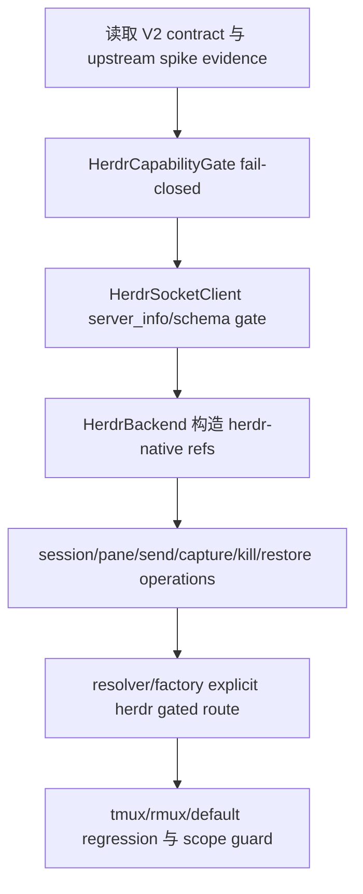

# herdr-backend-client feature design

## 0. 术语约定

| 术语 | 定义 | 防冲突结论 |
|---|---|---|
| `HerdrBackendClient` | CCB 内部封装 Herdr local socket API 的 production client / adapter。 | 只返回 CCB V2 refs/evidence，不把 raw Herdr JSON 暴露给 ccbd/provider runtime。 |
| Herdr schema gate | 在构造 production client 或首次 server_info 时验证 Herdr API schema/version 的门。 | schema 不匹配必须 `schema-mismatch`，不得猜字段或容错成功。 |
| Herdr capability gate | 从 upstream spike evidence 与 runtime server_info 投影出 command/semantic capabilities。 | 缺 evidence、stop recommendation、blocking gaps 或 unknown 未归类时 fail closed。 |
| Operation evidence | 每次 Herdr operation 的 request/server/session/pane/status/elapsed/detail 机器证据。 | 只是 terminal backend evidence；不能作为 CCB provider completion authority。 |
| Herdr backend route | `runtime.mux.backend=herdr` 或 resolver/factory 显式选择 Herdr 后创建 backend。 | 不表示 Herdr 成为默认 backend；`auto` 仍受 platform/capability gate 控制。 |

仓库事实：

- `lib/terminal_runtime/mux_backend_contract.py` 当前是 tmux/rmux 小协议来源；前置 `mux-backend-contract-herdr-v2` design-review 已 passed，要求 Herdr 使用 `herdr-native` family、V2 refs、`schema-mismatch` 和 fail-closed capability。
- `lib/terminal_runtime/rmux_backend.py` 与 `lib/terminal_runtime/rmux_backend_runtime/*` 已提供 production backend + capability gate + command client 的可复用结构样式。
- `lib/terminal_runtime/backend_resolver.py` / `backend_selection.py` 当前只支持 `tmux|rmux|auto`；前置 V2 child 设计了 Herdr selection/failure diagnostics，但未实现 production Herdr client。
- `lib/ccbd/services/project_namespace_state_runtime/models.py` 仍把 namespace backend family 固定为 `tmux-family`；本 feature 不迁移 durable state。
- 上游 `herdr-backend-contract-spike` design-review 已 passed，但当前工作区尚无 `evidence/herdr-contract-spike-evidence.json`；实现阶段必须把缺 evidence 视为 blocked，而不是构造成功 Herdr backend。

## 1. 决策与约束

### 需求摘要

本 feature 实现 terminal_runtime 层的 production Herdr socket client：封装 Herdr socket API、schema/version gate、capability gate、structured error、operation evidence，并实现符合 MuxBackend V2 的 Herdr backend。它可以把 explicit `herdr` request 接到 resolver/factory，但只有前置 V2 contract 已落地、platform gate、spike/capability evidence 和 schema gate 都通过时才创建 backend；否则返回结构化 failure。

成功标准：

- `HerdrBackendClient` 能读取 server_info/schema，schema 不匹配时抛 `MuxCommandErrorV2(category="schema-mismatch", backend_impl="herdr")` 并携带 operation/schema evidence。
- `HerdrCapabilityGate` 消费上游 spike evidence；缺 evidence、`adapter_recommendation=stop`、blocking gaps 或 `unknown` 未归类时 fail closed。
- `HerdrBackend` 实现 namespace/pane/send/capture/kill/restore 所需的 MuxBackend V2 surface，并返回 `backend_family="herdr-native"`、`backend_impl="herdr"`、`ipc_kind="herdr_socket"`。
- 实现开始前必须通过 V2 implementation admission：`MuxNamespaceRefV2`、`MuxPaneRefV2`、`MuxCommandErrorV2`、`MuxCapabilitiesV2`、`herdr-native`、`herdr_socket`、`schema-mismatch` 已在 contract 单一来源落地；未满足时本 feature dependency-blocked，不重复定义 V2 类型。
- explicit `herdr` route 只有在 Windows x64 platform gate + Herdr capability + socket/schema gate 通过时成功；失败 diagnostics 使用 V2 failure reason。
- `auto` 默认不变；只有 Herdr gate 全通过且 resolver policy 明确允许时才可选择 Herdr。
- tests 使用 fake Herdr socket client / schema fixture，不要求真实 Herdr host；真实 host evidence 继续来自 spike 或后续 validation matrix。

明确不做：

- 不接入 ccbd project namespace lifecycle、durable state migration、foreground attach、kill/restart/reload。
- 不改 provider runtime、provider completion authority、ask/pend/watch/cancellation。
- 不实现 recovery owner、Mobile terminal、Config UI、doctor/support tier、npm/package release surface。
- 不把 Herdr agent state 当作 completion verdict；只作为 diagnostics/evidence 字段。
- 不发布、不 promotion、不执行 git commit/push/tag/merge/release/deploy。

### 方案深度 pre-pass

候选：

- 只写一个薄 socket helper，让 ccbd/provider 直接解析 Herdr JSON。
- 一次性实现 Herdr client + ccbd lifecycle + provider runtime。
- 本 feature 方案：在 `terminal_runtime` 内实现 Herdr production adapter、schema/capability gate 和 resolver/factory gated route。

选择本 feature 方案。原因是 Herdr 是 true external/local service，schema drift、Windows beta gaps、restore identity 都需要 deep adapter 隔离；直接把 JSON 暴露给 ccbd/provider 会破坏 roadmap §4.3/§4.4 的小协议边界。一次性接入 ccbd/provider 会把 lifecycle、completion 和 recovery 风险混进 adapter，超出本 child。

### Top 3 风险与缓解

1. **风险：schema drift 被当作普通 command failed。**  
   缓解：schema gate 和 error mapping 单独 step；`schema-mismatch` 是 core AC。
2. **风险：缺 spike evidence 仍能创建 production Herdr backend。**  
   缓解：capability gate 默认 unsupported；缺 evidence/stop/blocking/unknown 必须 fail closed，并复用前置 blocked fixture/result 规则。
3. **风险：Herdr backend 接入过深，提前改 ccbd/provider/recovery。**  
   缓解：scope guard 禁止 ccbd、provider runtime、doctor/support、package/release surface diff；只允许 terminal_runtime Herdr adapter、resolver/factory 与 focused tests。

### 非显然依赖与关键假设

- 依赖 `mux-backend-contract-herdr-v2` 实现后的 V2 contract 类型；若实现时 V2 contract 尚未落地，本 feature 必须先停在 dependency blocked，并不得在 Herdr adapter 内重复定义 contract V2 类型。
- 依赖 `herdr-backend-contract-spike` evidence 或 blocked fixture；缺 evidence 时 Herdr route 只能 blocked。
- 假设 Herdr socket API 能提供 server_info/schema/session/pane/send/read/kill/restore 的稳定字段；字段不匹配时不猜测。
- 假设后续 ccbd lifecycle 会消费 `HerdrBackend`，但本 feature 不修改 durable state 或 project namespace controller。

## 2. 名词与编排

### 2.1 名词层

#### 现状

- `RmuxBackend` 已按 facade + runtime package 拆分：backend 类集中公开 MuxBackend 方法，runtime 子模块处理 capabilities、namespace、pane、io、presentation。
- `RmuxCapabilityGate` 从 machine evidence 投影 command/semantic status，unsupported command 抛 `MuxCommandError`。
- `backend_resolver.py` 负责 requested/effective/source/failure diagnostics，当前没有 Herdr route，也没有 Windows x64 platform gate provider。
- `terminal_runtime.api` 暴露 `get_backend`、`get_backend_selection_diagnostics`、`get_backend_for_session`，目前 factory 只接 tmux/psmux/rmux。

#### 变化

新增 Herdr production adapter，建议文件布局：

```text
lib/terminal_runtime/herdr_backend.py
lib/terminal_runtime/herdr_backend_runtime/client.py
lib/terminal_runtime/herdr_backend_runtime/capabilities.py
lib/terminal_runtime/herdr_backend_runtime/errors.py
lib/terminal_runtime/herdr_backend_runtime/schema.py
lib/terminal_runtime/herdr_backend_runtime/namespace.py
lib/terminal_runtime/herdr_backend_runtime/io.py
```

核心 contract：

```python
class HerdrServerInfo(TypedDict):
    version: str
    api_schema: str
    platform: Literal["windows"]
    arch: Literal["x64"]
    socket_ref: str

class HerdrOperationEvidence(TypedDict):
    operation: str
    request_id: str
    herdr_session_id: str | None
    herdr_pane_id: str | None
    status: Literal["ok", "failed", "unsupported", "schema-mismatch"]
    elapsed_ms: int
    detail: str | None

class HerdrBackendClient(Protocol):
    def server_info(self) -> HerdrServerInfo: ...
    def create_session(self, *, project_id: str, cwd: str, title: str) -> MuxNamespaceRefV2: ...
    def restore_session(self, *, restore_token: str) -> MuxNamespaceRefV2: ...
    def create_pane(self, namespace: MuxNamespaceRefV2, *, command: list[str], cwd: str, env: dict[str, str], title: str) -> MuxPaneRefV2: ...
    def send_text(self, pane: MuxPaneRefV2, text: str) -> HerdrOperationEvidence: ...
    def capture_pane(self, pane: MuxPaneRefV2, *, lines: int) -> tuple[str, HerdrOperationEvidence]: ...
    def kill_pane(self, pane: MuxPaneRefV2) -> HerdrOperationEvidence: ...
```

`HerdrBackendClient` 是内部 socket seam，不是 public MuxBackend facade。public `HerdrBackend` 到 internal client 的映射如下：

| Public HerdrBackend / MuxBackend V2 method | Internal HerdrBackendClient call | Mapping invariant |
|---|---|---|
| `prepare_server()` / `ensure_server_policy()` | `server_info()` + schema gate | 只验证 server/schema/capability，不创建 session。 |
| `create_session(session_name, project_root, window_name, terminal_size)` | `create_session(project_id=session_name, cwd=project_root, title=window_name or session_name)` | `terminal_size` 作为 optional evidence/ignored capability 处理，不阻塞 schema gate。 |
| `namespace_ref(session_name, namespace_id)` | local ref builder | 必须返回 `herdr-native/herdr/herdr_socket`；`restore_token` 仅来自 create/restore evidence。 |
| `session_root_pane(namespace)` / `list_panes(namespace, window_name)` | client read/list pane operation 或 cached create evidence | pane id 是 Herdr-local identity，不要求 `%N`。 |
| `split_pane(parent, direction, percent, cmd, cwd)` | `create_pane(namespace, command=cmd or shell placeholder, cwd=cwd, env={}, title=...)` | `direction/percent` 进入 layout/request evidence；若 Herdr 不支持 layout split，capability gate fail closed。 |
| `send_text(pane, text)` | `send_text(pane, text)` | 返回/记录 operation evidence；不记录 secret payload 全文。 |
| `capture_pane(pane, lines)` | `capture_pane(pane, lines=lines)` | 返回 text + evidence；raw Herdr JSON 不外露。 |
| `kill_pane(pane)` / `destroy_namespace(namespace)` | `kill_pane(pane)` / session destroy operation | 不影响 ccbd lifecycle ownership；只提供 backend primitive。 |

##### Interface 设计检查

- Module：`terminal_runtime` Herdr backend adapter，deep module。
- Interface：caller 只看 MuxBackend V2 refs/capabilities/errors/evidence；不依赖 Herdr JSON、socket frame 或 CLI schema。
- Seam：Herdr socket 是 true external boundary；fake socket client 用于 unit tests。
- Depth / locality：deep。schema/version/capability/error/evidence 在 adapter 内归一。
- Dependency strategy：true external + local fake。unit tests fake socket；真实 Windows evidence 由 spike/validation 消费。
- Adapter：production Herdr adapter 是真实 seam，不是临时 mock。
- Test surface：client schema tests、capability gate tests、backend lifecycle/io tests、resolver/factory diagnostics tests、scope guard。

### 2.2 编排层



流程级约束：

- schema gate 必须先于任何 session/pane mutation；schema 不匹配返回 `schema-mismatch`。
- capability gate 必须先于 backend construction 和每个能力操作；unsupported 或 blocking gap 返回 `unsupported-capability`。
- platform gate 通过注入的 `platform_gate_reader` / `WindowsX64PlatformGate` provider 消费前置 baseline gate contract；本 feature 不重写 doctor/install gate，只在 resolver diagnostics 中携带 gate payload。
- explicit `herdr` request 缺 platform/capability/schema/socket 任一 gate 时 fail fast；不得 fallback 成 tmux 后假装成功。
- `auto` 不得因存在 Herdr client 类而改变非 Windows、Linux/macOS/WSL 或缺 evidence 的默认行为。
- operation evidence 必须脱敏，不记录 token、完整 terminal history、provider credential 或用户 secret。
- Herdr agent state 只能进入 optional diagnostics/evidence，不得产生 CCB completion verdict。

### 2.3 挂载点清单

- `lib/terminal_runtime/herdr_backend.py` 与 `herdr_backend_runtime/*`：production Herdr adapter、schema/capability/error/evidence。
- `lib/terminal_runtime/backend_resolver.py` / `backend_selection.py` / `api.py`：显式 Herdr gated route、platform gate provider、factory 与 diagnostics。
- `test/test_herdr_backend_client.py`：fake socket client、schema gate、capability gate、operation evidence、backend refs。
- `test/test_terminal_runtime_backend_selection.py`：explicit Herdr failure/success diagnostics 与 auto/default unchanged。
- `.codestable/roadmap/windows-native-herdr-ccb/windows-native-herdr-ccb-items.yaml`：当前 child feature 指针。

### 2.4 推进策略

0. **V2 implementation admission**：检查前置 `mux-backend-contract-herdr-v2` 已实现并验收 V2 contract 单一来源。  
   退出信号：focused test/import 证明 `MuxNamespaceRefV2`、`MuxPaneRefV2`、`MuxCommandErrorV2`、`MuxCapabilitiesV2`、`herdr-native`、`herdr_socket`、`schema-mismatch` 已存在；否则本 feature dependency-blocked。
1. **dependency and evidence admission**：读取 upstream spike evidence / blocked fixture，建立 Herdr capability gate 的输入规则。  
   退出信号：缺 evidence、stop、blocking gaps、unknown 未归类时 unit test 断言 Herdr construction/selection blocked。
2. **schema/socket client**：实现最小 Herdr socket client interface、server_info/schema parser、schema mismatch error mapping。  
   退出信号：fake socket schema pass/mismatch tests 通过；mismatch 携带 schema/operation evidence。
3. **HerdrBackend facade**：实现 namespace/pane refs、create/restore session、create_pane、send_text、capture_pane、kill_pane 和 capabilities。  
   退出信号：fake socket lifecycle/io tests 返回 `herdr-native` refs、`herdr_socket` ipc、restore token 和 operation evidence。
4. **resolver/factory gated route**：将 explicit `herdr` 接入 backend resolver/factory，保留 auto/default 不变。  
   退出信号：explicit Herdr gate pass 时创建 HerdrBackend；not-windows/not-x64/platform-gate-blocked/capability/schema/socket gate fail 时返回 V2 failure diagnostics；auto 无 evidence 不选 Herdr。
5. **scope guard**：确认未改 ccbd durable state、provider runtime、doctor/support、package/release surface、recovery。  
   退出信号：diff guard 覆盖 forbidden path/content，只有 terminal_runtime adapter/resolver/api 和 focused tests 改动。
6. **regression guard**：运行 Herdr focused tests 与现有 tmux/rmux selection/contract tests。  
   退出信号：Herdr tests 通过；现有 tmux/rmux contract/backend selection tests 不退化。

### 2.5 结构健康度与微重构

##### 评估

- 文件级：直接把 Herdr socket/schema/capability 全塞进 `backend_resolver.py` 会让 policy 与 external adapter 混杂，必须新建 `herdr_backend_runtime/*`。
- 文件级：`terminal_runtime/api.py` 目前已有重复 `_extract_wsl_path_from_unc_like_path` 定义，但本 feature 不依赖它；不做无关重构。
- 目录级：`terminal_runtime` 已有 `rmux_backend_runtime` 模式；新增 `herdr_backend_runtime` 符合现有 convention。
- compound：当前未发现 Herdr backend client 相关沉淀；rmux backend features 是主要类比。

##### 结论：不做行为等价微重构

不先拆现有 resolver/API。Herdr adapter 新代码按 `rmux_backend_runtime` 类似布局放入新目录；若实现发现 `backend_resolver.py` 因多 backend policy 继续膨胀，记录后续 `cs-refactor` 候选，不在本 feature 中扩范围。

## 3. 验收契约

### 3.1 关键场景清单

| ID | 输入 / 触发 | 期望可观察结果 | 证据类型 |
|---|---|---|---|
| AC-001 | 缺 upstream spike evidence / blocked fixture | Herdr capability gate blocked，不构造 production Herdr backend | unit |
| AC-002 | `adapter_recommendation=stop`、blocking gaps 或 unknown 未归类 | Herdr selection/construction fail closed，failure reason 可诊断 | unit |
| AC-003 | Herdr server_info/schema 匹配 | client 通过 schema gate，并记录 server_info/socket ref | unit |
| AC-004 | Herdr schema/version 不匹配 | `schema-mismatch` structured error，带 schema/operation evidence | unit |
| AC-005 | create/restore session | 返回 `backend_family="herdr-native"`、`backend_impl="herdr"`、`ipc_kind="herdr_socket"`、restore token | unit |
| AC-006 | create pane / send / capture / kill | 返回 Herdr pane refs 与 operation evidence；不要求 tmux `%N` pane id | unit |
| AC-007 | explicit `herdr` route gates pass | resolver/factory 创建 HerdrBackend，diagnostics 带 capability_report_ref/platform_gate | unit |
| AC-008 | explicit `herdr` route gates fail | resolver/factory 返回 V2 failure，区分 not-windows/not-x64/platform-gate-blocked/capability/schema/socket failure，不 fallback 假成功 | unit |
| AC-009 | `auto` on non Windows / no Herdr evidence | 保持现有 tmux/rmux behavior，不产生 Herdr effective backend | unit |
| AC-010 | scope boundary | 不改 ccbd durable state、provider runtime、doctor/support、package/release/recovery | diff review |

### 3.2 明确不做的反向核对项

- 不应修改 `lib/ccbd/services/project_namespace_state_runtime/` 或 project namespace lifecycle。
- 不应修改 `lib/provider_runtime/`、`lib/provider_backends/` 或 provider completion 逻辑。
- 不应修改 doctor/support tier、package metadata、release/update surface。
- 不应把 Herdr agent state 写成 CCB completion pass。
- 不应让 `auto` 在缺 evidence 时选择 Herdr。

### 3.3 Acceptance Coverage Matrix

| Scenario | Covered By Step | Evidence Type | Command / Action | Core? |
|---|---|---|---|---|
| V2 contract admission | S0 | unit | V2 contract import/focused tests | yes |
| AC-001 missing evidence blocked | S1 | unit | HerdrCapabilityGate tests | yes |
| AC-002 stop/gaps/unknown blocked | S1 | unit | capability projection tests | yes |
| AC-003 schema pass | S2 | unit | fake socket schema tests | yes |
| AC-004 schema mismatch | S2 | unit | structured error tests | yes |
| AC-005 session refs | S3 | unit | HerdrBackend lifecycle tests | yes |
| AC-006 pane IO evidence | S3 | unit | fake socket operation tests | yes |
| AC-007 explicit route success | S4 | unit | backend selection/factory tests | yes |
| AC-008 explicit route failure | S4 | unit | resolver diagnostics tests including platform gate failures | yes |
| AC-009 auto unchanged | S4,S6 | unit | backend selection regression | yes |
| AC-010 scope guard | S5,S6 | diff review | forbidden path/content guard | yes |

### 3.4 DoD Contract

| ID | 要求 | 证据 | 阻塞级别 |
|---|---|---|---|
| DOD-DESIGN-001 | design/checklist/review 完整，且对齐 roadmap item `herdr-backend-client` | design review | blocking |
| DOD-IMPL-000 | 前置 V2 contract 已在单一来源落地；未满足时 dependency-blocked，不重复定义 V2 类型 | unit/import | blocking |
| DOD-IMPL-001 | Herdr socket/schema client 有 schema gate，mismatch 为 structured `schema-mismatch` | unit | blocking |
| DOD-IMPL-002 | Herdr capability gate 消费 spike evidence，缺 evidence/stop/gaps/unknown fail closed | unit | blocking |
| DOD-IMPL-003 | HerdrBackend 返回 V2 refs/capabilities/errors/evidence，不暴露 raw Herdr JSON 给 callers | unit | blocking |
| DOD-IMPL-004 | explicit `herdr` route gated success/failure 可诊断，`auto` default 不变 | unit | blocking |
| DOD-IMPL-005 | 无 ccbd durable state/provider runtime/doctor support/package/recovery 越界 | diff review | blocking |
| DOD-REVIEW-001 | code review passed 且无 unresolved blocking | review report | blocking |
| DOD-QA-001 | QA 复核 schema/capability/route/scope guard | QA report | blocking |
| DOD-ACCEPT-001 | acceptance 回写 roadmap item，并给 `ccbd-herdr-namespace-lifecycle` 输入 HerdrBackend contract | acceptance report | blocking |

Validation Commands:

| ID | 命令 | 目的 | 核心性 | 失败处理 |
|---|---|---|---|---|
| CMD-001 | `python ".codestable/tools/validate-yaml.py" --file ".codestable/features/2026-07-31-herdr-backend-client/herdr-backend-client-checklist.yaml" --yaml-only` | checklist YAML 合法性 | core | fix-or-block |
| CMD-002 | `python ".codestable/tools/validate-yaml.py" --file ".codestable/roadmap/windows-native-herdr-ccb/windows-native-herdr-ccb-items.yaml"` | roadmap items 回写合法性 | core | fix-or-block |
| CMD-003 | `python -m pytest -q test/test_mux_backend_contract.py -k "V2 or herdr"` | V2 implementation admission；contract 单一来源必须已落地 | core | dependency-blocked |
| CMD-004 | `python -m pytest -q test/test_herdr_backend_client.py test/test_terminal_runtime_backend_selection.py` | Herdr client/capability/resolver focused tests 与 selection regression | core | fix-or-block |
| CMD-005 | `python -m pytest -q test/test_mux_backend_contract.py test/test_rmux_backend_core.py` | Mux contract 与 rmux backend 类比回归 | core | fix-or-block |
| CMD-006 | `python -c "import subprocess; run=lambda a: subprocess.run(a,capture_output=True,text=True,check=True).stdout; paths={p.replace(chr(92),'/') for a in (['git','diff','--name-only'],['git','diff','--cached','--name-only','--diff-filter=ACMR'],['git','ls-files','--others','--exclude-standard']) for p in run(a).splitlines() if p.strip()}; forbidden_prefix=('lib/provider_backends/','lib/provider_runtime/','lib/ccbd/services/project_namespace_state_runtime/','lib/ccbd/services/project_namespace_runtime/','lib/cli/services/doctor_runtime/','lib/ccbd/services/dispatcher_runtime/lifecycle_start_runtime/recovery_runtime/'); forbidden_files={'package.json','package-lock.json','lib/cli/services/doctor.py','lib/cli/render_runtime/ops_views_doctor.py','lib/terminal_runtime/rmux_packaging_support.py'}; bad=sorted(p for p in paths if p.startswith(forbidden_prefix) or p in forbidden_files); assert not bad, bad"` | ccbd/provider/doctor/package/recovery scope guard | core | fix-or-block |
| CMD-007 | `python -c "import pathlib, subprocess; run=lambda a: subprocess.run(a,capture_output=True,text=True,check=True).stdout; paths={p.replace(chr(92),'/') for a in (['git','diff','--name-only','--','lib','test'],['git','diff','--cached','--name-only','--diff-filter=ACMR','--','lib','test'],['git','ls-files','--others','--exclude-standard','--','lib','test']) for p in run(a).splitlines() if p.strip()}; text=run(['git','diff','--','lib','test'])+run(['git','diff','--cached','--','lib','test'])+''.join(pathlib.Path(p).read_text(encoding='utf-8',errors='ignore') for p in paths if pathlib.Path(p).is_file() and p.endswith(('.py','.md','.yaml','.yml','.json'))); forbidden=('completion_source','HerdrProviderCompletionEvidence','support_tier','npm publish','release surface'); assert not any(term in text for term in forbidden)"` | provider completion/support/release content guard，覆盖 modified/staged/untracked lib/test 文件内容 | core | fix-or-block |

Required Artifacts：design、checklist、design-review、V2 implementation admission evidence、Herdr backend/client diff、capability gate tests、schema mismatch tests、operation evidence tests、resolver/factory tests、scope guard、acceptance 阶段按 epic/roadmap owner 协议回写 items.yaml。

### 3.5 自我批判结论

- 可证伪性：每个 gate 都有 pass/fail unit 或 diff guard。
- 步骤原子性：evidence admission、schema client、backend facade、resolver route、scope、regression 分离。
- 最弱依赖：上游 evidence 缺失时最容易误放行；已设为 S1 core fail-closed。
- 证据完整性：unit tests 覆盖 fake socket；真实 host evidence 留给 spike/validation，不混用。
- 交付物可核验性：acceptance 可从 Herdr adapter files、tests、resolver diagnostics 和 forbidden diff guard 反查。
- 清洁度规则：不新增临时 TODO/FIXME、调试输出、注释掉代码、无用 import；operation evidence 必须脱敏。

## 4. 与项目级架构文档的关系

- 本 feature 是 `windows-native-herdr-ccb` 的第 4 个 child，依赖 `mux-backend-contract-herdr-v2` 的 design-ready V2 contract。
- 本 feature实现 roadmap §4.4，并消费 §4.2/§4.3 的 selection/contract 约束。
- 后续 `ccbd-herdr-namespace-lifecycle` 才能把 HerdrBackend 接入 project namespace；若本 feature 发现必须同步改 ccbd durable state，应停止并回到 `cs-epic` 更新拆分。
