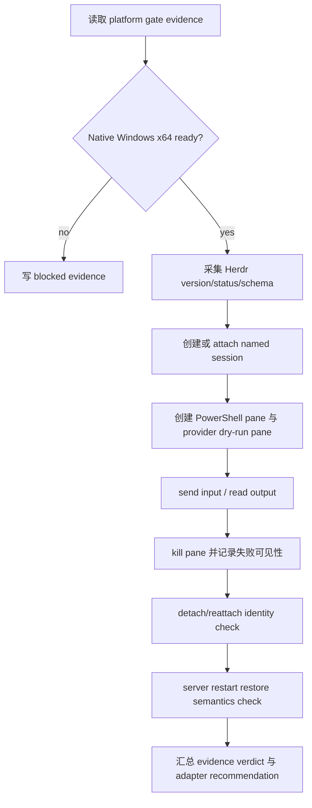

# herdr-backend-contract-spike feature design

## 0. 术语约定

| 术语 | 定义 | 防冲突结论 |
|---|---|---|
| Herdr contract spike | 在真实 Native Windows x64 + Herdr beta 上执行的事实验证，不是生产 adapter。 | 只回答“Herdr 当前能力是否足够继续投入正式 CCB adapter”，不写入 CCB backend resolver。 |
| Socket/CLI control surface | Herdr 官方 CLI wrappers 和 raw local socket API 共享的控制面。 | spike 优先用 CLI JSON / schema 导出建立稳定证据；只有 CLI 不足时才降到 raw socket request。 |
| CCB minimal mux semantics | CCB 后续 Herdr backend 最少需要的 session、pane、send input、read/capture output、kill pane、restore identity 和 provider dry-run 语义。 | 不是完整 provider runtime、completion、queue、Mobile、Config UI 或 support tier。 |
| Provider CLI dry run pane | 在 Herdr pane 里启动一个无敏感凭证、可短时间完成或输出可识别文本的 provider/agent CLI smoke。 | 只验证 pane spawn、input/output 和 basic lifecycle；不能作为 CCB completion authority。 |
| Restore identity | Herdr detach/reattach 或 server restart 后，CCB 能观察到的 session/pane/workspace identity 和输出恢复事实。 | Herdr server restart 不保证任意进程存活；design 必须区分 live detach 与 cold restart。 |

仓库事实：

- `windows-x64-v852-baseline-gate` design-review 已通过，第二个 child 可在 epic batch 中按 design-ready 依赖继续，但实现前仍需真实 x64/v8.5.2 gate evidence。
- `lib/terminal_runtime/mux_backend_contract.py` 已存在 `NamespaceLifecycle`、`WindowLayout`、`PaneIO`、`PanePresentation`、`PaneLogging`、`DiagnosticsCapability` 等小协议；`test/test_mux_backend_contract.py` 覆盖 fake backend 与 backend-neutral refs。
- `lib/terminal_runtime/backend_resolver.py` 当前只支持 `tmux|rmux|auto`，Herdr 选择策略属于后续 `mux-backend-contract-herdr-v2`，本 feature 不修改。
- `test/test_v2_project_namespace_backend.py`、`test/test_terminal_runtime_backend_selection.py`、`test/test_v2_runtime_launch.py` 已覆盖 namespace/backend 现状，可作为后续 adapter 的对照测试面。
- Herdr 官方文档当前说明 CLI 与 socket API 可控制 workspace/tab/pane、发送输入、读取 pane、订阅事件和导出 schema；Windows beta 不支持 direct terminal attach、Windows binary `--remote`、live handoff、Unix fd handoff、Unix foreground process groups 等能力。
- Herdr session-state 文档说明：detach/reattach 时进程继续运行；server restart 只恢复 session shape / pane history / eligible agent session，不保留任意旧进程。

## 1. 决策与约束

### 需求摘要

本 feature 要写清并执行一个最小 Herdr contract spike：在 Native Windows x64 上通过 Herdr CLI/socket 控制面创建 project-scoped session，创建普通 PowerShell pane 与 provider CLI dry-run pane，发送输入，读取输出，kill 一个 pane，并验证 detach/reattach 与 server restart 后可观察的 identity/restore 行为。输出必须是机器可读 evidence，供后续 `mux-backend-contract-herdr-v2` 判断是否继续正式 adapter。

成功标准：

- spike 能导出 Herdr 版本、API schema ref、Windows/arch、socket/session ref、被测命令和每个 operation 的 structured evidence。
- 至少覆盖：server/status/schema、session/workspace create or attach、pane spawn、send input、read/capture output、kill pane、detach/reattach identity、server restart restore semantics、provider dry-run pane。
- evidence 能把结果分为 `pass|partial|blocked|failed`，并能区分 `schema-mismatch`、`unsupported-capability`、`windows-beta-gap`、`provider-dry-run-unavailable`、`manual-host-missing`、`test-design-failure`。
- 如果 Herdr API 或 Windows beta 无法覆盖最小语义，spike 必须 fail closed，并给出后续路线：调整 CCB contract、补 Herdr upstream issue，或停止正式 Herdr adapter 投入。
- 不把 Herdr agent state 当成 CCB provider completion 证据；最多作为 diagnostics/observation。

明确不做：

- 不修改生产代码：不改 `backend_resolver.py`、`mux_backend_contract.py`、ccbd namespace、provider runtime、doctor、package metadata。
- 不实现 `HerdrBackendClient`、fake Herdr backend、backend resolver V2 或 provider runtime on Herdr。
- 不要求完整 provider parity，不处理真实 provider auth、quota、credential、long-running completion。
- 不承诺 Windows support tier、npm release surface、installer/update 行为。
- 不执行 git commit、push、tag、merge、release、publish、deploy 或 promotion。

### 方案深度 pre-pass

候选：

- 直接实现 Herdr adapter，再用实现结果反推是否可行。
- 只读官方文档，假定 Herdr socket API 足够。
- 本 feature 方案：先做真实 Native Windows x64 spike，用小脚本和 evidence 证明最小语义。

选择本 feature 方案。原因是 Herdr Windows beta 与 socket schema 都属于外部变化面，直接实现 adapter 会把未知 API 和 restore 语义扩散进生产代码；只读文档又不能证明 ConPTY、pane output、kill、restore 和 provider dry-run 在本机可用。spike 是事实型路由 gate，符合 KISS/YAGNI：只为后续正式设计收集必要证据，不提前抽象。

### Top 3 风险与缓解

1. **风险：把 Herdr detach persistence 与 server restart restore 混为一谈。**  
   缓解：验收场景分离 live detach/reattach 与 cold restart；evidence 单独记录 `process_continues`、`layout_restored`、`output_restored`、`agent_session_resumed`。
2. **风险：Herdr agent state 被误用为 CCB completion authority。**  
   缓解：provider dry-run 只记录 terminal I/O 和 optional Herdr agent observation；completion authority 保留给后续 provider runtime feature。
3. **风险：spike 只能在当前机器手工跑，结果不可复核。**  
   缓解：脚本输出 schema refs、raw commands、stdout/stderr 摘要、timestamps、host labels、artifacts 和 blocked reason；没有 Native Windows x64 host 时明确 `manual-host-missing`，不得伪造 pass。

### 非显然依赖与关键假设

- 依赖前置 platform gate 能证明 Windows x64、Python 64-bit、Herdr x64 和 CCB baseline 状态；若 gate blocked，本 feature 只能产出 blocked evidence。
- 依赖 Herdr CLI 可用且能输出 JSON/schema；如果 CLI wrappers 不足，才使用 raw socket API。
- 依赖一个无敏感凭证的 provider/agent dry-run 命令。默认候选是可本地退出的 provider CLI help/version/dry-run；真实 provider ask/completion 不在本 feature 范围。
- 假设 Herdr 的官方 schema 是本次 spike 的真相源，脚本不硬编码未验证字段；字段缺失时记录 `schema-mismatch`。

## 2. 名词与编排

### 2.1 名词层

#### 现状

- CCB 已有 tmux/rmux backend-neutral contract 和 fake backend 测试，但 Herdr 还没有任何生产类型、resolver route 或 adapter。
- roadmap §4.3/§4.4 已提出后续 `MuxNamespaceRefV2`、`MuxPaneRefV2`、`MuxCapabilitiesV2` 和 `HerdrBackendClient`，但这些只是正式 adapter 目标，不应在 spike 阶段落入生产代码。
- Herdr 官方 CLI/socket API 能导出 schema 并控制 pane，但 Windows beta 明确存在不支持项；server restart restore 也不等于任意进程持续运行。

#### 变化

新增 spike evidence contract，不新增生产 runtime contract。建议产物：

```python
class HerdrContractSpikeEvidence(TypedDict):
    schema_version: Literal[1]
    feature: Literal["2026-07-31-herdr-backend-contract-spike"]
    generated_at: str
    host: dict[str, object]
    platform_gate_ref: str | None
    herdr: HerdrProbeSummary
    operations: list[HerdrSpikeOperation]
    provider_dry_run: ProviderDryRunEvidence
    restore: HerdrRestoreEvidence
    capability_projection: HerdrCapabilityProjection
    verdict: Literal["pass", "partial", "blocked", "failed"]
    failure_class: Literal[
        "none",
        "manual-host-missing",
        "platform-gate-blocked",
        "herdr-missing",
        "schema-mismatch",
        "unsupported-capability",
        "windows-beta-gap",
        "provider-dry-run-unavailable",
        "test-design-failure",
        "unknown",
    ]
    adapter_recommendation: Literal["continue", "continue-with-gaps", "stop", "needs-upstream-issue"]
    residual_risks: list[str]
    artifact_refs: dict[str, str]
```

```python
class HerdrProbeSummary(TypedDict):
    executable: str | None
    version: str | None
    api_schema_ref: str | None
    socket_ref: str | None
    server_identity: str | None
    status: Literal["available", "missing", "schema-mismatch", "unknown"]

class HerdrSpikeOperation(TypedDict):
    operation: Literal[
        "schema",
        "server_status",
        "session_attach",
        "pane_spawn",
        "send_input",
        "read_output",
        "kill_pane",
        "detach_reattach",
        "server_restart_restore",
    ]
    status: Literal["pass", "partial", "blocked", "failed"]
    command_ref: str
    elapsed_ms: int | None
    evidence_ref: str | None
    failure_class: str | None
    diagnostic: str

class ProviderDryRunEvidence(TypedDict):
    command: list[str]
    pane_ref: dict[str, object] | None
    output_match: bool
    exit_observed: bool
    killed_by_spike: bool
    treated_as_completion_authority: Literal[False]
    failure_class: str | None

class HerdrRestoreEvidence(TypedDict):
    detach_reattach_checked: bool
    detach_process_continues: bool | None
    server_restart_checked: bool
    restart_scope: Literal["dedicated-disposable-server", "isolated-socket", "blocked-not-isolated"]
    server_identity: str | None
    preexisting_sessions_checked: bool
    restart_authorized: bool
    layout_restored: bool | None
    output_history_restored: bool | None
    agent_session_restored: bool | None
    old_process_expected_to_survive: Literal[False]
    diagnostic: str

class HerdrCapabilityProjection(TypedDict):
    command_status: dict[str, Literal["supported", "partial", "unsupported", "unknown"]]
    semantic_status: dict[str, Literal["supported", "partial", "unsupported", "unknown"]]
    windows_beta_gaps: list[str]
    blocking_gaps: list[str]
```

`capability_projection` 面向后续 `MuxCapabilitiesV2`，但 `unknown` 只表示 spike 未证实状态；后续 V2 design 不能把 `unknown` 直接视作 `supported` 或 `workaround`，必须基于新证据归类为 `partial|unsupported|workaround` 或保持 blocking gap。

##### Interface 设计检查

- Module：spike artifact，不是生产 module。实现阶段可新增 `.codestable/roadmap/windows-native-herdr-ccb/drafts/herdr-backend-contract-spike/` 下的脚本和 runbook。
- Interface：下游只消费 `HerdrContractSpikeEvidence`，不消费自由 Markdown 摘要。
- Seam：Herdr CLI/socket 字段只在 spike 脚本里解析；正式 adapter 需等后续 feature 用 schema evidence 设计。
- Depth / locality：deep but temporary。spike 集中外部 API 事实和 Windows beta gaps，防止这些不确定性进入生产 resolver。
- Dependency strategy：true external。必须在 Native Windows x64 + Herdr 上跑；非 Windows 只能产出 blocked/manual-host-missing evidence。
- Adapter：不做生产 adapter。脚本可有最小 command wrapper，禁止对外暴露为 `HerdrBackendClient`。
- Test surface：schema validator / evidence validator 可以在任意平台跑；真实 Herdr operations 是 manual/native-host evidence。

### 2.2 编排层



流程级约束：

- spike 必须 fail closed：任何核心 operation 缺证据时不得输出 `verdict=pass`。
- CLI JSON wrapper 优先于 raw socket。只有 CLI 不能覆盖特定 operation 时，才用 raw socket，并把 schema request/response 存成 artifact。
- 所有命令 stdout/stderr 需要脱敏摘要；不得把 provider token、用户 home secret、完整 terminal history 或 credential 写入 evidence。
- provider dry-run 必须可无交互、短时结束或可被 kill；如果 provider 命令不可用，记录 `provider-dry-run-unavailable`，不把它归咎为 Herdr failure。
- server restart restore 检查必须区分：layout/session ref 是否恢复、pane output 是否通过 history 恢复、原进程是否不应存活、官方 agent session restore 是否适用。
- server restart restore 只能在 dedicated/disposable Herdr server 或 isolated socket/config 下执行；若无法证明隔离，必须写 `restart_scope="blocked-not-isolated"`、`restart_authorized=false` 的 blocked evidence，不得重启全局 Herdr server。
- 本 feature 不自动 stop 用户已有 Herdr session；只能使用独立 named `HERDR_SESSION` / workspace，并在 cleanup 中只清理自己创建的资源。运行前必须记录 `server_identity` 与 `preexisting_sessions_checked`。

### 2.3 挂载点清单

- `.codestable/roadmap/windows-native-herdr-ccb/drafts/herdr-backend-contract-spike/`：spike 脚本、runbook、schema snapshot、raw command logs 的临时事实区。
- `.codestable/features/2026-07-31-herdr-backend-contract-spike/evidence/herdr-contract-spike-evidence.json`：下游正式 design 唯一消费的机器 evidence。
- `.codestable/features/2026-07-31-herdr-backend-contract-spike/evidence/manual-native-windows-runbook.md`：Native Windows 手工/半自动执行记录，包含 blocked 时的真实原因。
- `test/test_herdr_contract_spike_evidence.py`：验证 evidence schema、failure_class、artifact refs、adapter recommendation 和 blocked/pass 规则。
- `.codestable/roadmap/windows-native-herdr-ccb/windows-native-herdr-ccb-items.yaml`：本 child feature 指针与后续 child 的 design-ready 依赖。

### 2.4 推进策略

1. **spike scope guard 与 host admission**：建立 runbook / script 参数，要求独立 named session、Windows x64 platform gate ref、Herdr binary/schema ref，以及 dedicated/disposable Herdr server 或 isolated socket/config。  
   退出信号：非 Native Windows x64、Herdr 缺失或 restart 无法隔离时写 blocked evidence；不会修改生产代码、用户默认 Herdr session 或全局 Herdr server。
2. **Herdr schema/status probe**：采集 `herdr --version`、server/status、`herdr api schema --json` 或等价 schema artifact。  
   退出信号：schema artifact 存在且 evidence 记录 schema version/ref；schema 不可读时 failure_class 为 `schema-mismatch|herdr-missing`。
3. **session/pane I/O probe**：创建/attach project-scoped named session，spawn PowerShell pane，发送 sentinel input，读取/capture sentinel output。  
   退出信号：operation evidence 同时记录 pane ref、send status、read output match；失败时保留 command refs 和 diagnostic。
4. **provider dry-run pane probe**：在独立 pane 启动一个无凭证 provider/agent dry-run 或 fallback command，验证 spawn/output/kill 可观察。  
   退出信号：provider pane 有 start/output/exit 或 killed evidence；命令不可用时标 `provider-dry-run-unavailable`，不伪造 provider parity。
5. **kill 与 restore semantics probe**：kill 一个 pane，验证 Herdr/CCB 可观察到 pane 关闭；在已隔离/已授权的 dedicated server 或 isolated socket 上执行 detach/reattach 和 server restart restore 检查。  
   退出信号：evidence 明确区分 live detach 进程持续、server restart layout 恢复、输出/history/agent restore 是否可用；未隔离时写 blocked evidence 而不是重启全局 server。
6. **evidence verdict 与 route recommendation**：汇总 `herdr-contract-spike-evidence.json`，给出 continue / continue-with-gaps / stop / needs-upstream-issue。  
   退出信号：JSON 通过 validator；`adapter_recommendation=continue` 只在核心 operation 全 pass 且 `capability_projection.blocking_gaps` 为空时出现。

### 2.5 结构健康度与微重构

##### 评估

- 文件级：`lib/terminal_runtime/backend_resolver.py` 和 `lib/terminal_runtime/mux_backend_contract.py` 是后续正式 adapter 的目标，但本 feature 不应提前修改，避免把 spike 事实与生产 contract 混在一起。
- 文件级：`test/test_mux_backend_contract.py` 已证明 fake backend 与小协议边界；本 feature 可新增 evidence validator test，但不扩展 production fake backend。
- 目录级：`.codestable/roadmap/windows-native-herdr-ccb/drafts/` 适合放临时 spike 脚本和 raw logs；`.codestable/features/.../evidence/` 适合放被下游消费的稳定 evidence。
- compound：当前 `.codestable/compound/` 无相关沉淀。

##### 结论：不做行为等价微重构

本 feature 不做生产代码微重构。若 spike 证明 Herdr 可行，结构性改动应放到 `mux-backend-contract-herdr-v2` 和 `herdr-backend-client`。当前只新增临时 spike 工具、evidence 和 validator。

## 3. 验收契约

### 3.1 关键场景清单

| ID | 输入 / 触发 | 期望可观察结果 | 证据类型 |
|---|---|---|---|
| AC-001 | 非 Native Windows x64、platform gate blocked 或 Herdr 缺失 | 输出 blocked evidence，failure_class 为 `manual-host-missing|platform-gate-blocked|herdr-missing`，不运行 destructive 操作 | validator/manual |
| AC-002 | Herdr CLI 可用 | 采集 Herdr version/status/schema，schema artifact 可追溯 | command/artifact |
| AC-003 | 创建或 attach 独立 named session | evidence 记录 session/workspace/socket ref，且不污染用户默认 session | command/manual |
| AC-004 | 创建 PowerShell pane 并发送 sentinel | read/capture 输出包含 sentinel，operation 状态为 pass | command/artifact |
| AC-005 | provider CLI dry-run pane | pane spawn/output/exit 或 kill 可观察；provider unavailable 时记录独立 failure_class | command/artifact |
| AC-006 | kill pane | killed pane 关闭可观察，未误删 session 或其他 pane | command/manual |
| AC-007 | detach/reattach | session/pane identity 与 live process continuity 记录为单独 evidence | manual/artifact |
| AC-008 | server restart restore | 仅在 dedicated/disposable server 或 isolated socket/config 下执行；layout/session shape 恢复事实与进程不存活/历史/agent restore限制分开记录 | manual/artifact |
| AC-009 | evidence verdict | `herdr-contract-spike-evidence.json` 通过 schema validator，recommendation 与 operation 状态一致 | unit |

### 3.2 明确不做的反向核对项

- 不应修改 production `lib/terminal_runtime/*`、`lib/ccbd/*`、`lib/provider_backends/*`。
- 不应把 Herdr agent state 写成 CCB completion pass。
- 不应在非 Native Windows x64 或无 Herdr 时输出 `pass`。
- 不应清理用户已有 Herdr session 或默认 session。
- 不应把 provider auth/quota/credential failure 当作 Herdr backend failure。

### 3.3 Acceptance Coverage Matrix

| Scenario | Covered By Step | Evidence Type | Command / Action | Core? |
|---|---|---|---|---|
| AC-001 host admission blocked | S1 | validator/manual | platform gate + host admission | yes |
| AC-002 schema/status | S2 | command/artifact | Herdr CLI schema/status probe | yes |
| AC-003 named session | S3 | command/manual | session attach/create | yes |
| AC-004 pane I/O | S3 | command/artifact | spawn/send/read sentinel | yes |
| AC-005 provider dry-run | S4 | command/artifact | provider dry-run pane | yes |
| AC-006 kill pane | S5 | command/manual | kill selected pane | yes |
| AC-007 detach/reattach | S5 | manual/artifact | detach and reattach named session | yes |
| AC-008 server restart restore | S5 | manual/artifact | stop/restart isolated session/server | yes |
| AC-009 evidence validator | S6 | unit | JSON schema/semantic validator | yes |

### 3.4 DoD Contract

| ID | 要求 | 证据 | 阻塞级别 |
|---|---|---|---|
| DOD-DESIGN-001 | design/checklist/review 完整，且对齐 roadmap item `herdr-backend-contract-spike` | design review | blocking |
| DOD-IMPL-001 | spike 工具只写 `.codestable/.../drafts` 与 feature evidence，不改生产 runtime | diff review | blocking |
| DOD-IMPL-002 | Herdr schema/status/session/pane/send/read/kill/restore/provider dry-run 均有 operation evidence 或 blocked reason | evidence JSON | blocking |
| DOD-IMPL-003 | restore evidence 区分 detach persistence 与 server restart restore，不夸大进程存活；restart 必须证明 dedicated/disposable server 或 isolated socket/config，否则 blocked | manual transcript / JSON | blocking |
| DOD-IMPL-004 | provider dry-run 不使用敏感凭证，不作为 CCB completion authority | transcript / diff review | blocking |
| DOD-IMPL-005 | evidence validator 能拒绝缺核心 operation、artifact ref 缺失、blocked 却 recommendation continue、restart 未隔离却执行、blocking gap 为空不一致的 JSON | unit | blocking |
| DOD-REVIEW-001 | code review passed 且无 unresolved blocking | review report | blocking |
| DOD-QA-001 | QA 复核 evidence、blocked/pass 规则、生产代码 no-change guard | QA report | blocking |
| DOD-ACCEPT-001 | acceptance 回写 roadmap item，并给后续 contract V2 明确 continue/stop recommendation | acceptance report | blocking |

Validation Commands:

| ID | 命令 | 目的 | 核心性 | 失败处理 |
|---|---|---|---|---|
| CMD-001 | `python ".codestable/tools/validate-yaml.py" --file ".codestable/features/2026-07-31-herdr-backend-contract-spike/herdr-backend-contract-spike-checklist.yaml" --yaml-only` | checklist YAML 合法性 | core | fix-or-block |
| CMD-002 | `python ".codestable/tools/validate-yaml.py" --file ".codestable/roadmap/windows-native-herdr-ccb/windows-native-herdr-ccb-items.yaml"` | roadmap items 回写合法性 | core | fix-or-block |
| CMD-003 | `python -m pytest -q test/test_herdr_contract_spike_evidence.py` | evidence schema、failure_class、artifact refs、recommendation 语义 | core | fix-or-block |
| CMD-004 | `python -m pytest -q test/test_mux_backend_contract.py test/test_terminal_runtime_backend_selection.py` | 生产 mux contract / resolver no-change guard | core | fix-or-block |
| CMD-005 | `python ".codestable/roadmap/windows-native-herdr-ccb/drafts/herdr-backend-contract-spike/run_spike.py" --session ccb-herdr-spike --isolated-server --out ".codestable/features/2026-07-31-herdr-backend-contract-spike/evidence/herdr-contract-spike-evidence.json"` | Native Windows x64 Herdr spike 真实运行；缺 host、缺 Herdr 或无法隔离 restart 时必须产出 blocked evidence | core | blocked-evidence-if-host-missing-or-restart-not-isolated |
| CMD-006 | `python -c "import json, pathlib; p=pathlib.Path('.codestable/features/2026-07-31-herdr-backend-contract-spike/evidence/herdr-contract-spike-evidence.json'); d=json.loads(p.read_text(encoding='utf-8')); req={'schema_version','feature','generated_at','host','herdr','operations','provider_dry_run','restore','capability_projection','verdict','failure_class','adapter_recommendation','residual_risks','artifact_refs'}; assert req <= d.keys(); assert d['schema_version']==1; assert d['feature']=='2026-07-31-herdr-backend-contract-spike'; assert d['verdict'] in {'pass','partial','blocked','failed'}; assert d['adapter_recommendation'] in {'continue','continue-with-gaps','stop','needs-upstream-issue'}; r=d['restore']; assert r.get('restart_scope') in {'dedicated-disposable-server','isolated-socket','blocked-not-isolated'}; assert r.get('restart_scope')!='blocked-not-isolated' or d['verdict']=='blocked'"` | evidence 最小机器检查 | core | fix-or-block |

Required Artifacts：design、checklist、design-review、spike runbook、spike script、Herdr schema snapshot、raw command refs、manual Native Windows transcript、`herdr-contract-spike-evidence.json`、evidence validator test、items.yaml 回写。

### 3.5 自我批判结论

- 可证伪性：每个核心 operation 都有 pass/blocked/failed 结果，不允许口头“看起来可行”。
- 步骤原子性：host admission、schema/status、pane I/O、provider dry-run、kill/restore、verdict 汇总分离。
- 最弱依赖：Native Windows x64 + Herdr host 不可替代；缺 host 时只能 blocked，不继续 adapter。
- 证据完整性：command artifact、manual transcript、JSON validator 和 no-change guard 覆盖不同风险。
- 交付物可核验性：下游只消费 `herdr-contract-spike-evidence.json`；raw logs 只作为 artifact refs。
- 清洁度规则：不记录 token、完整 terminal history、用户 home secret；不新增临时 TODO/FIXME、调试输出或注释掉代码；不修改生产 runtime。

## 4. 与项目级架构文档的关系

- 本 feature 是 `windows-native-herdr-ccb` 的第 2 个 child，依赖 `windows-x64-v852-baseline-gate` 的 design-ready 结果，但实现阶段仍必须读取真实 platform gate evidence。
- 本 feature 直接服务 roadmap §4.3/§4.4：只有 spike evidence 证明 Herdr 最小语义可行，后续才进入 `mux-backend-contract-herdr-v2` 与 `herdr-backend-client`。
- 若 `adapter_recommendation=stop`，后续 Herdr adapter 相关 child 应停下，回 `cs-epic` planning/update 重新拆路线。
- 若 spike 形成稳定 unsupported boundary，后续 supportability projection 应沉淀到 docs/doctor/support；本 feature 只记录 evidence，不发布支持承诺。
