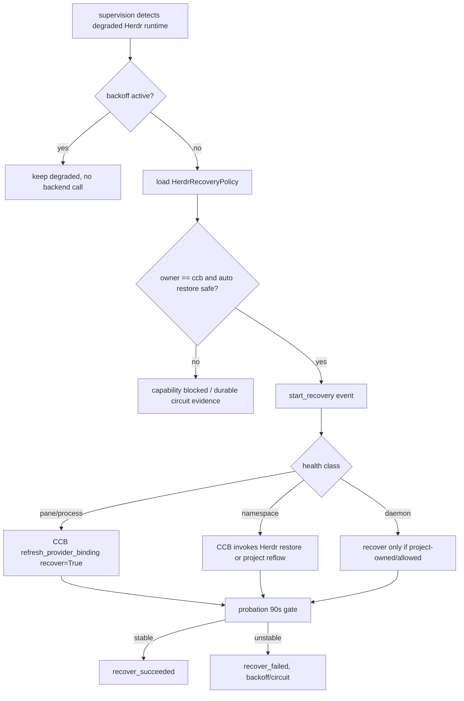

# herdr-bounded-recovery-boundary feature design

## 0. 术语约定

| 术语 | 定义 | 防冲突结论 |
|---|---|---|
| CCB recovery owner | CCB supervision / runtime_service / dispatcher lifecycle start 对 provider runtime 的恢复决策权。 | Herdr 不决定是否 respawn、reattach、terminal complete 或 circuit_open。 |
| Herdr restore evidence | Herdr session restore token presence、agent state ref、session/pane health、operation evidence。 | raw restore token 只能进入 private backend call；public CCB recovery evidence ledger 必须先 sanitize，不能独立触发恢复成功。 |
| bounded recovery | 有 probation、backoff、restart_count、crash log bound、blocked health 和 circuit 的恢复流程。 | 不是无限后台重启，也不是 Herdr 自动恢复成功即 CCB 成功。 |
| recovery probation | 恢复后必须经历的稳定窗口；roadmap 要求保留 90 秒 probation 语义。 | Herdr pane 短暂 alive 不等于恢复完成。 |
| Herdr auto restore mode | Herdr 自身恢复能力对 CCB 的暴露模式：disabled、observe-only 或 unsupported。 | 若不能关闭，必须证明不会与 CCB respawn 冲突，否则 capability blocked。 |

仓库事实：

- `lib/ccbd/services/runtime_recovery_policy.py` 已集中定义 recoverable / hard-blocked health：`pane-dead`、`process-dead`、`namespace-crashed`、`daemon-unavailable`、`provider-auth-revoked` 等。
- `lib/ccbd/supervision/recovery.py` 与 `recovery_transitions.py` 是 background recovery 的核心编排：检查 backoff、写 `recover_started`、调用 `refresh_provider_binding(recover=True)` 或 project namespace reflow、再写 succeeded/failed。
- `lib/ccbd/supervision/backoff.py` 当前用 `restart_count` 做指数 backoff，最大 30 秒；roadmap 要求 Herdr 路线保留 v8.5.2 的 90 秒 probation、backoff、bounded crash logs 和 durable circuit。
- `lib/ccbd/supervision/evidence.py` 已可构造 runtime evidence ledger，包含 `backend_impl`、`namespace_ref`、`pane_ref`、`process_ref`、`daemon_ref`、pane/process/namespace/daemon health；当前 `runtime_namespace_ref()` 原样复制 dict，Herdr implementation 必须在 public ledger 前移除 `namespace_ref.restore_token`。
- `lib/ccbd/services/dispatcher_runtime/lifecycle_start_runtime/recovery_runtime/slots.py` 的 start-time slot refresh 会直接调用 `refresh_provider_binding(recover=True)`；Herdr 路线必须把该入口纳入同一个 owner/backoff/probation/circuit gate。
- `lib/provider_backends/pane_log_support/lifecycle_recovery.py` 当前 tmux respawn 要求 pane id 以 `%` 开头；Herdr pane id 不应被该格式限制。
- `lib/provider_backends/pane_log_support/lifecycle_recovery.py` 还调用 tmux ownership，`lifecycle_common.activate_rebound_pane()` 调用 `apply_session_tmux_identity()`；Herdr recovery 不能只移除 `%pane` 检查，必须隔离 tmux-family ownership/identity 分支。
- `lib/provider_backends/pane_log_support/lifecycle_common.py` 已有 crash log capture、`provider_auth_revoked` sidecar 和 recovery block；`test/test_pane_crash_reason.py` 覆盖 provider auth revoked 分类。
- `test/test_ccbd_rmux_supervision_recovery.py` 覆盖 rmux pane/process/namespace/daemon recovery evidence；这些是 Herdr recovery tests 的结构参考。
- 前置 `provider-runtime-on-herdr` design-review 已 passed；implementation 阶段仍必须等 provider runtime acceptance，design-review 只授权本 child design。

## 1. 决策与约束

### 需求摘要

本 feature 定义并实现 Herdr backend 下 CCB bounded recovery 的单一 owner 边界：CCB 继续根据 runtime health、provider resume capability、namespace/pane/process/daemon evidence、backoff/probation/circuit 决定是否 respawn、reattach、reflow 或 block；Herdr restore token 和 agent state 只作为 CCB 调用 backend operation 时的输入或 evidence。

成功标准：

- recovery admission 必须确认前置 `provider-runtime-on-herdr` implementation/acceptance ready；只看到 design-review passed 时 dependency-blocked。
- `HerdrRecoveryPolicy.owner` 固定为 `"ccb"`；`herdr_auto_restore_mode` 只能是 `disabled`、`observe-only` 或 `unsupported`，不能是 co-owner。
- CCB recovery evidence ledger 能表达 `backend_impl="herdr"`、sanitized `namespace_ref`、`pane_ref`、`restore_token_present`、Herdr agent state ref、process/namespace/daemon health、action 和 reason。
- Herdr path 保留 90 秒 probation、restart_count/backoff、bounded crash logs、provider recovery block 和 durable circuit；短暂 pane alive 或 Herdr agent restored 不能直接清除 degraded/circuit。
- Herdr session restore 若可用，只能由 CCB recovery action 调用；若 Herdr 自动恢复无法关闭，必须以 evidence 证明 observe-only 且不 respawn，否则该 recovery capability blocked。
- pane/process/namespace/daemon recovery 在 Herdr 下有结构化 action：`observe`、`reattach`、`respawn`、`pane_recover`、`provider_restart`、`namespace_recover`、`daemon_recover`、`circuit_open`、`blocked`；失败写 `recover_failed` 和 actionable reason。legacy event detail 若仍输出 `namespace_recover` / `provider_restart`，必须映射到同一 canonical enum，不新增第二套同义 action。

明确不做：

- 不修改 provider launch、ask/pend/completion/cancellation 权威；这是前置 `provider-runtime-on-herdr` 范围。
- 不扩展 Mobile terminal、Config UI、doctor/support tier、package/release 或 public validation matrix。
- 不实现 Herdr socket schema/client；只消费前置 Herdr backend capability/evidence。
- 不把 Herdr agent state 当作 completion 或 recovery success authority。
- 不发布、不 promotion、不执行 git commit/push/tag/merge/release/deploy。

### 方案深度 pre-pass

候选：

- 仅把 `runtime_recovery_policy.RECOVERABLE_RUNTIME_HEALTHS` 加上 Herdr health 字符串。
- 让 Herdr 自己恢复 session，CCB 只更新 registry。
- 本 feature 方案：在 CCB supervision/recovery policy 中显式建 Herdr recovery policy/evidence gate，Herdr restore 只作为 CCB recovery action。

选择本 feature 方案。原因是恢复路径是高风险状态机；只加 health 字符串会绕过 probation/circuit，Herdr 自恢复 co-owner 会造成双 respawn。CCB 已有 recovery_transitions、backoff、evidence ledger 和 provider recovery block，应该在这些 seam 上扩展 Herdr。

### Top 3 风险与缓解

1. **风险：CCB 与 Herdr 双重 respawn。**  
   缓解：`owner="ccb"` 是 hard contract；Herdr auto restore 不能 disabled 时必须 observe-only evidence，否则 recovery capability blocked。
2. **风险：短暂 restored/pane alive 清掉故障状态。**  
   缓解：90 秒 probation 和 circuit evidence 是 core check；恢复成功必须等 CCB health/probation gate，不以 Herdr agent state 为准。
3. **风险：Herdr 恢复改动越界到 provider completion 或 user surface。**  
   缓解：scope guard 禁止 provider completion、Mobile/Config UI、doctor/support、release/public matrix diff。

### 非显然依赖与关键假设

- 依赖 `provider-runtime-on-herdr` 的 implementation/acceptance：Herdr provider session payload、backend resolver、PaneIO/log/capture 和 restart surface 已真实落地。
- 假设 Herdr backend capability 可报告 auto restore 是否 disabled / observe-only；无法报告时 fail closed。
- 假设 raw restore token 仍只在 private state/backend call 内流转；recovery events、project view、logs 只能输出 presence/ref。
- Native Windows x64 manual recovery transcript 需要真实 Herdr backend；缺 host/Herdr 时 acceptance blocked，不能用 WSL/Linux 替代。

### Roadmap contract delta

父 roadmap §4.6 的 `HerdrRecoveryEvidence` 已由本 child 收紧为 redacted public evidence：`restore_token: str | None` 不再允许出现在 event、diagnostics、project view、logs、support bundle 或 acceptance artifact 中；public 字段统一为 `restore_token_present: bool`。父 roadmap §4.3 的 `MuxNamespaceRefV2.restore_token` 仍可作为 private namespace identity 字段存在，但凡进入 public evidence ledger 的 `namespace_ref` 必须先 sanitize：删除 `restore_token` 字段，并把 presence 投影为 top-level `restore_token_present`。raw restore token 只能进入 CCB 发起的 private backend operation，例如 runtime/namespace service 的 restore call。该修订不改变 roadmap 的 owner 结论，只消除 secret boundary 冲突。

## 2. 名词与编排

### 2.1 名词层

#### 现状

- `runtime_recovery_policy.py` 已按 health 分类恢复，但没有 Herdr-specific auto restore owner 字段。
- `recovery_transitions.attempt_recovery_action()` 对 namespace health 优先 project reflow，对 process/pane 调 `refresh_provider_binding(recover=True)`。
- `backoff_delay_seconds()` 已有 restart_count backoff，但 design 没有显式 90 秒 probation 状态。
- `build_runtime_evidence_ledger()` 已能记录 namespace/pane/process/daemon evidence，但未显式投影 Herdr restore token presence / auto restore mode / agent state ref。
- `pane_log_support.lifecycle_recovery` 仍有 tmux `%pane` 限制；Herdr respawn/reattach 需要 backend-neutral pane_ref。

#### 变化

新增或等价实现 Herdr recovery policy/evidence 投影：

```python
class HerdrRecoveryPolicy(TypedDict):
    owner: Literal["ccb"]
    herdr_auto_restore_mode: Literal["observe-only", "disabled", "unsupported"]
    probation_seconds: int  # must be 90
    backoff_schedule_seconds: list[int]
    circuit_threshold: int
    restore_token_required: bool

class HerdrRecoveryEvidence(TypedDict):
    agent_slug: str
    pane_ref_before: MuxPaneRefV2 | None
    pane_ref_after: MuxPaneRefV2 | None
    restore_token_present: bool
    herdr_agent_state_ref: str | None
    action: Literal[
        "observe",
        "respawn",
        "reattach",
        "pane_recover",
        "provider_restart",
        "namespace_recover",
        "daemon_recover",
        "circuit_open",
        "blocked",
    ]
    reason: str
```

兼容规则：

- tmux/rmux recovery health 和 tests 不退化；Herdr health 是 additive。
- `restore_token_present` 是 public/event field；raw restore token 只允许 private backend call。
- `namespace_ref` 进入 `evidence_ledger`、recovery event、project view、diagnostics、logs、support bundle 或 acceptance artifact 前必须 sanitize；若原始 `namespace_ref` 含 `restore_token`，public ledger 删除该键并设置 `restore_token_present=True`。redaction test 必须用含 raw token 的 `runtime.namespace_ref` fixture 证明 public payload 只出现 presence，不出现 token 值。
- `herdr_agent_state_ref` 只用于 diagnostics；不能让 `recover_succeeded` 或 runtime `health="restored"` 只依赖它。
- `probation_seconds` 必须为 90，且恢复后的 steady/healthy 需要可审计 probation evidence；如果现有代码没有 probation 字段，implementation 要加最小 durable projection。
- `circuit_threshold` 到达后 runtime 进入 blocked/degraded durable state，后续 background recovery 不再自动 respawn，直到 owner action / remount / repair。
- `health="restored"` 在现有 CCB 中是通用成功 health，不做全局重定义；Herdr recovery 只在 Herdr-owned recovery projection 上增加 probation gate，避免影响非 Herdr rebind/attach 语义。

##### Probation / circuit transition contract

Herdr recovery 的最小状态机必须满足：

- `recover_started` 后先进入 durable probation projection，例如 `lifecycle_state="restored-probation"` 或等价字段组合：`recovery_phase="probation"`、`recovery_probation_started_at`、`recovery_probation_until`、`recovery_attempt_id`。
- probation 窗口固定 90 秒。窗口内即使 pane alive、process alive 或 Herdr agent state restored，也只能保留 recovering/probation 状态，不能写 `recover_succeeded` 或把 `reconcile_state` 清为 `steady`。
- probation 窗口内再次出现 pane/process/namespace/daemon degradation 时写 `recover_failed`，保留 `restart_count`，进入 backoff；达到 `circuit_threshold=3` 个连续 Herdr recovery failures 后写 durable `circuit_open` / `blocked` evidence，后续 background recovery 与 lifecycle start refresh 都不得自动 respawn。
- probation 窗口到期且 CCB health monitor 仍能证明 pane/process/namespace/daemon healthy，才允许写 `recover_succeeded`、清理 probation marker，并把 `reconcile_state` 转为 `steady`。
- circuit reset 只允许 owner remount/repair/restart 这类显式 CCB action 清理；Herdr auto restore 或 agent state restored 不能重置 circuit。

##### Interface 设计检查

- Module：`ccbd.services.runtime_recovery_policy`、`ccbd.supervision.recovery*`、`ccbd.supervision.evidence`、`provider_backends.pane_log_support.lifecycle_recovery`。
- Interface：调用方看到 runtime health、recovery event、evidence ledger、provider recovery block；不接触 Herdr JSON。
- Seam：Herdr backend capability/restore operation 是 terminal backend seam；CCB supervision 是 owner seam。
- Depth / locality：deep。恢复 owner、probation、backoff、circuit 必须集中，不能散落到 provider launcher 或 Herdr client。
- Dependency strategy：local-substitutable。unit tests 用 fake Herdr runtime/backend evidence；manual transcript 用真实 Windows x64 Herdr。
- Adapter：不写 Herdr socket adapter；只消费前置 backend capability。

### 2.2 编排层



流程级约束：

- implementation admission 必须验证 `provider-runtime-on-herdr` 已 accepted；缺 acceptance artifact/evidence 时写 dependency-blocked report。
- background recovery 每次先查 backoff；backoff 命中不调用 Herdr restore/respawn。
- dispatcher lifecycle start 的 queued-slot refresh 入口必须复用同一 Herdr recovery admission/policy，或在 Herdr degraded/probation/circuit 状态下直接 keep/drop，不得绕过 `recover_started`、backoff、probation 和 circuit 去调用 `refresh_provider_binding(recover=True)`。
- recovery start 必须写 `recover_started`，ledger 包含 Herdr sanitized namespace/pane/process/daemon evidence 和 auto restore mode。
- Herdr auto restore mode 为 `unsupported` 或无法证明 observe-only 时，action 为 `blocked` 或 `circuit_open`，不得继续 respawn。
- pane/process recovery 调用 CCB runtime_service / provider session recovery；Herdr `respawn_pane` / `reattach` 是该动作内部 primitive，不是独立 owner。
- namespace recovery 可用 Herdr restore token 作为 private backend operation 输入；restore token 缺失且 required 时 fail closed。调用 seam 必须挂在 CCB-owned runtime/namespace service，例如 `runtime_service.recover_provider_namespace(..., restore_token=...)` 或等价 project namespace runtime 方法；`recovery_transitions.py` 不得直接解析 Herdr JSON 或直接调用 Herdr socket client。
- recovery succeeded 必须通过 90 秒 probation 或等价 durable evidence 后清理 degraded/circuit；短暂 alive 只能进入 `recovering`/`restored-probation` 状态。
- provider auth revoked / provider recovery blocked 继续 hard-block；Herdr restore 不应反复重启已判定 auth revoked 的 pane。
- crash logs 和 reason sidecar 保持 bounded retention；新增 Herdr recovery evidence 不得写 terminal buffer 全量或 secret。

### 2.3 挂载点

- `lib/ccbd/services/runtime_recovery_policy.py`：Herdr recovery health/policy、hard block 与 recoverable 分类。
- `lib/ccbd/supervision/recovery.py`、`recovery_transitions.py`、`backoff.py`、`evidence.py`：owner gate、probation/backoff/circuit、event/evidence ledger。
- `lib/ccbd/services/dispatcher_runtime/lifecycle_start_runtime/recovery_runtime/slots.py`、`support.py`：start-time recovery refresh 复用 Herdr owner/backoff/probation/circuit admission，不得形成第二个恢复 owner。
- `lib/provider_backends/pane_log_support/lifecycle_recovery.py`：backend-neutral Herdr pane respawn/reattach recovery primitive；tmux-family 分支继续使用 `%pane`、tmux ownership 和 `apply_session_tmux_identity()`，Herdr 分支走 backend capability/evidence，不进入 tmux-specific ownership/identity。
- `lib/ccbd/services/runtime_runtime/refresh.py` 与 dispatcher lifecycle recovery slots：recover=True path 与 provider resume capability gate。
- tests：rmux supervision recovery、restore helpers、pane crash reason、provider runtime Herdr recovery focused tests。

### 2.4 推进策略

1. **Admission and policy contract**：确认 upstream provider runtime accepted，新增 Herdr recovery policy/evidence contract。
2. **Evidence ledger and redaction**：扩展 Herdr recovery ledger，sanitize `namespace_ref.restore_token`，输出 restore token presence / agent state ref，不泄露 raw token。
3. **Probation/circuit state machine**：保留 restart_count backoff，新增或补齐 90 秒 probation projection、success gate、failure backoff 和 durable circuit。
4. **Recovery action routing**：对 pane/process/namespace/daemon Herdr health 路由到 CCB-owned action，Herdr auto restore unsafe 时 blocked，并让 lifecycle start refresh 复用同一 admission。
5. **Provider pane primitive**：在 pane lifecycle recovery 中支持 Herdr pane_ref respawn/reattach，不要求 `%pane`，且不进入 tmux ownership/identity 分支，但仍受 CCB gate 控制。
6. **Crash log retention and regression guard**：保留 bounded crash logs/reason sidecar，跑 tmux/rmux recovery regression、Herdr fake recovery tests、scope/content guard。
7. **Native Windows recovery evidence**：收集 Herdr pane/process/namespace recovery transcript 或 blocked evidence。

### 2.5 结构健康度与微重构

##### 评估

- 文件级：`runtime_recovery_policy.py` 是 health/policy 集中点，适合 additive Herdr policy，不另建平行 policy。
- 文件级：`supervision/recovery_transitions.py` 已集中 action routing，适合加入 Herdr owner gate；避免把恢复判断写进 Herdr client。
- 文件级：`supervision/evidence.py` 是 ledger 聚合点，适合 redacted Herdr evidence。
- 文件级：`pane_log_support/lifecycle_recovery.py` tmux `%pane` 分支较具体，Herdr 支持应通过小 helper 分离 backend-neutral pane ref，而不是复制整份 recovery flow。
- 目录级：`ccbd/supervision/` 已按 recovery/backoff/evidence 拆分，不重组目录。

##### 结论：不做行为等价微重构

不先搬文件。实现阶段允许新增小型 helper，例如 `herdr_recovery_policy.py` 或 `backend_pane_recovery.py`，但不重排 supervision 目录；若发现需要统一重构 recovery state machine，停止并另开 refactor。

## 3. 验收契约

### 3.1 关键场景清单

| ID | 输入 / 触发 | 期望可观察结果 | 证据类型 |
|---|---|---|---|
| AC-001 | `provider-runtime-on-herdr` 未 implementation/acceptance ready | dependency-blocked admission report，不进入 recovery 实现 | artifact/unit |
| AC-002 | Herdr runtime health `pane-dead/process-dead/namespace-crashed/daemon-unavailable` | evidence ledger 含 sanitized Herdr refs、health、auto restore mode、action/reason | unit |
| AC-003 | Herdr auto restore unsupported 或不能证明 observe-only | CCB 标记 recovery capability blocked/circuit_open，不调用 respawn | unit |
| AC-004 | backoff window active | 不调用 Herdr restore/respawn，保持 degraded 与上次 failure evidence | unit |
| AC-005 | Herdr pane/process recoverable | CCB 调 runtime_service/provider session recovery；Herdr primitive 只作为 respawn/reattach evidence | unit |
| AC-006 | Herdr namespace recoverable 且 restore token present | CCB 调 private backend restore/reflow；raw token 不进入 public namespace_ref/event/log/diagnostics | unit/static |
| AC-007 | 恢复后 90 秒内再次不稳定 | 不写 recover_succeeded、不清 steady；写 probation failure、restart_count/backoff/circuit evidence | unit |
| AC-008 | provider auth revoked / recovery blocked | hard-block，不反复 Herdr restore/respawn；保留 crash reason sidecar | unit |
| AC-009 | tmux/rmux recovery regression | 现有 rmux supervision recovery、restore helper、pane crash tests 不退化 | unit |
| AC-010 | Native Windows x64 Herdr recovery | transcript 覆盖 pane/process/namespace recovery 或 auto restore blocked evidence | manual transcript |
| AC-011 | scope boundary | 不改 provider completion、Mobile/Config UI、doctor/support、package/release/public matrix | diff review |

### 3.2 明确不做的反向核对项

- 不应新增 provider completion verdict 或改变 ask/pend/cancel job terminal semantics。
- 不应把 Herdr agent state、pane alive、session restored 单独写成 `recover_succeeded`。
- 不应让 Herdr 自动恢复与 CCB recovery 同时 respawn。
- 不应在 recovery events/logs 中输出 raw restore token、provider secret 或 terminal buffer 全量。
- 不应修改 Mobile/Config UI/doctor/support/package/release/public validation matrix。

### 3.3 Acceptance Coverage Matrix

| Scenario | Covered By Step | Evidence Type | Command / Action | Core? |
|---|---|---|---|---|
| AC-001 admission | S1 | artifact/unit | upstream acceptance gate | yes |
| AC-002 ledger | S2 | unit | Herdr fake runtime ledger tests | yes |
| AC-003 auto restore blocked | S1,S4 | unit | policy/capability gate tests | yes |
| AC-004 backoff | S3 | unit | supervision backoff tests | yes |
| AC-005 pane/process recovery | S4,S5 | unit | runtime refresh / pane lifecycle tests | yes |
| AC-006 namespace restore | S2,S4 | unit/static | namespace_ref sanitizer / restore token redaction tests | yes |
| AC-007 probation/circuit | S3 | unit | probation + circuit tests | yes |
| AC-008 auth blocked | S5,S6 | unit | pane crash reason / recovery block tests | yes |
| AC-009 tmux/rmux regression | S6 | unit | existing recovery tests | yes |
| AC-010 manual Herdr recovery | S7 | manual transcript | Native Windows x64 recovery transcript | yes |
| AC-011 scope boundary | S6 | diff review | forbidden path/content guard | yes |

### 3.4 DoD Contract

| ID | 要求 | 证据 | 阻塞级别 |
|---|---|---|---|
| DOD-DESIGN-001 | design/checklist/review 完整，且对齐 roadmap item `herdr-bounded-recovery-boundary` | design review | blocking |
| DOD-IMPL-000 | 前置 provider runtime acceptance passed 且 artifact/evidence refs 可验证；缺失时 dependency-blocked | artifact/unit | blocking |
| DOD-IMPL-001 | `HerdrRecoveryPolicy.owner="ccb"`，Herdr auto restore 只能 disabled/observe-only/unsupported；unsafe fail closed | unit | blocking |
| DOD-IMPL-002 | Herdr recovery evidence ledger redacted，含 sanitized refs、health、restore_token_present、agent_state_ref、action/reason；`namespace_ref.restore_token` 不进入 public payload | unit/static | blocking |
| DOD-IMPL-003 | 90 秒 probation、restart_count/backoff、durable circuit 保留，probation 未到期不能写 recover_succeeded / steady | unit | blocking |
| DOD-IMPL-004 | pane/process/namespace/daemon Herdr recovery 路由由 CCB supervision 决定，lifecycle start refresh 不绕过同一 gate；Herdr primitive 不成为 owner | unit/integration | blocking |
| DOD-IMPL-005 | provider auth revoked / recovery blocked hard-block，不循环 Herdr respawn | unit | blocking |
| DOD-IMPL-006 | bounded crash logs/reason sidecar 保留，且无 provider completion、user surface、doctor/support、package/release/public matrix 越界 | unit/diff review | blocking |
| DOD-REVIEW-001 | code review passed 且无 unresolved blocking | review report | blocking |
| DOD-QA-001 | QA 复核 owner boundary、probation/circuit、redaction、tmux/rmux regression | QA report | blocking |
| DOD-ACCEPT-001 | acceptance 回写 roadmap item，并包含 Native Windows x64 Herdr recovery transcript 或 blocked evidence | acceptance report | blocking |

Validation Commands:

| ID | 命令 | 目的 | 核心性 | 失败处理 |
|---|---|---|---|---|
| CMD-001 | `python ".codestable/tools/validate-yaml.py" --file ".codestable/features/2026-07-31-herdr-bounded-recovery-boundary/herdr-bounded-recovery-boundary-checklist.yaml" --yaml-only` | checklist YAML 合法性 | core | fix-or-block |
| CMD-002 | `python ".codestable/tools/validate-yaml.py" --file ".codestable/roadmap/windows-native-herdr-ccb/windows-native-herdr-ccb-items.yaml"` | roadmap items 回写合法性 | core | fix-or-block |
| CMD-003 | `python -c "import pathlib, re; root=pathlib.Path('.codestable/features'); items=pathlib.Path('.codestable/roadmap/windows-native-herdr-ccb/windows-native-herdr-ccb-items.yaml').read_text(encoding='utf-8'); slug='provider-runtime-on-herdr'; feature='2026-07-31-provider-runtime-on-herdr'; artifact_marker=re.compile(r'(Required Artifacts|required artifacts|evidence_required|证据|交付物|artifact)', re.I); ref_marker=re.compile(r'(CMD-\\d+|pytest|transcript|\\.json|\\.md|evidence|artifact|test)', re.I); missing=[]; missing += [] if re.search(r'- slug: '+re.escape(slug)+r'[\\s\\S]*?status: done[\\s\\S]*?feature: '+re.escape(feature), items) else [f'{slug}: roadmap not done']; read=lambda p: p.read_text(encoding='utf-8',errors='ignore'); ok=any(('doc_type: feature-acceptance' in (text:=read(p)) and 'status: passed' in text and artifact_marker.search(text) and ref_marker.search(text)) for p in (root/feature).glob('*-acceptance.md')); missing += [] if ok else [f'{feature}: acceptance missing/passed/artifact-evidence-refs']; assert not missing, missing"` | implementation admission：前置 provider runtime accepted | core | dependency-blocked |
| CMD-004 | `python -m pytest -q test/test_ccbd_rmux_supervision_recovery.py test/test_ccbd_restore_helpers.py test/test_pane_crash_reason.py -k "recovery or recover or crash or backoff or blocked"` | existing recovery regression 与 crash reason baseline | core | fix-or-block |
| CMD-005 | `python -m pytest -q test/test_ccbd_herdr_recovery_boundary.py -k "herdr or recovery or probation or circuit or restore or owner"` | Herdr recovery owner、policy、probation/circuit、restore redaction focused tests | core | fix-or-block |
| CMD-006 | `python -m pytest -q test/test_ccbd_runtime_refresh.py test/test_ccbd_health_monitor_rebind.py -k "recovery or recover or herdr or restored or blocked"` | runtime refresh/rebind recovery integration | core | fix-or-block |
| CMD-007 | `python -c "import pathlib, subprocess, re; run=lambda a: subprocess.run(a,capture_output=True,text=True,check=True).stdout; paths={p.replace(chr(92),'/') for a in (['git','diff','--name-only'],['git','diff','--cached','--name-only','--diff-filter=ACMR'],['git','ls-files','--others','--exclude-standard']) for p in run(a).splitlines() if p.strip()}; implementation_roots=('lib/','test/','bin/','scripts/'); scoped=sorted(p for p in paths if p.startswith(implementation_roots)); forbidden_prefix=('lib/mobile/','mobile/','config-ui/','lib/config_ui/','lib/cli/services/doctor_runtime/'); forbidden_files={'package.json','package-lock.json','lib/cli/services/doctor.py','lib/cli/render_runtime/ops_views_doctor.py'}; bad=sorted(p for p in scoped if p.startswith(forbidden_prefix) or p in forbidden_files); assert not bad, bad; text=run(['git','diff','--','lib','test','bin','scripts'])+run(['git','diff','--cached','--','lib','test','bin','scripts']); forbidden=re.compile(r'(CompletionStatus\\.COMPLETED|support_tier|npm publish|release surface|public workflow validation|Mobile terminal|Config UI)', re.I); assert not forbidden.search(text)"` | provider completion/user-surface/release scope guard；排除 .codestable design 文档自身 | core | fix-or-block |
| CMD-008 | `python -c "import subprocess, re; run=lambda a: subprocess.run(a,capture_output=True,text=True,check=True).stdout; text=run(['git','diff','--','lib','test'])+run(['git','diff','--cached','--','lib','test']); assert re.search(r'probation_seconds|probation|restored-probation|recovery_probation', text, re.I); assert re.search(r'circuit_threshold|circuit_open|recovery_circuit', text, re.I); public=re.compile(r'(evidence_ledger|append_recovery_event|details=|diagnostics|project_view|support|logger|print).*restore_token|restore_token.*(evidence_ledger|append_recovery_event|details=|diagnostics|project_view|support|logger|print)', re.I|re.S); assert not public.search(text)"` | probation/circuit presence 与 public raw restore token leakage guard；允许 private backend call/test fixture | core | fix-or-block |
| CMD-009 | `MANUAL Native Windows x64: capture Herdr recovery transcript for pane/process/namespace recovery or auto-restore blocked evidence, including 90s probation/circuit evidence` | roadmap recovery evidence | core | blocked-if-no-host-or-herdr |

Required Artifacts：design、checklist、design-review、upstream admission evidence、Herdr recovery policy tests、namespace_ref sanitizer tests、evidence ledger redaction tests、probation/backoff/circuit tests、pane/process/namespace/daemon recovery tests、auth revoked/recovery blocked tests、tmux/rmux regression tests、scope/content guards、Native Windows x64 Herdr recovery transcript、acceptance 阶段按 epic/roadmap owner 协议回写 items.yaml。

### 3.5 自我批判结论

- 可证伪性：每个核心恢复状态都有 unit/manual 或 guard。
- 步骤原子性：admission、policy/evidence、probation/circuit、routing、pane primitive、regression/scope、manual evidence 分离。
- 最弱依赖：provider-runtime-on-herdr 必须先 acceptance；CMD-003 明确 dependency-blocked。
- 证据完整性：自动化用 fake Herdr runtime/backend；Native Windows x64 manual transcript 证明真实 Herdr 行为或 blocked evidence。
- 基线可执行性：现有 rmux recovery tests 作为 regression baseline；新增 Herdr test 文件在实现阶段创建。
- 交付物可核验性：acceptance 可从 recovery events、runtime registry fields、crash logs/sidecars、scope guard、manual transcript 反查。
- 清洁度规则：不新增临时 TODO/FIXME、调试输出、注释掉代码、无用 import；不输出 raw restore token、provider secret 或 terminal buffer 全量。

## 4. 与项目级架构文档的关系

- 本 feature 是 `windows-native-herdr-ccb` 的第 7 个 child，落实 roadmap §4.6 Recovery Owner Contract。
- 本 feature 消费 `provider-runtime-on-herdr` 的 provider runtime refs 和 Herdr pane/session evidence，但不改变 provider completion/cancellation contract。
- 后续 `herdr-user-surfaces-parity` 和 validation matrix 才把 recovery evidence 投影到 Mobile/Config UI/doctor/support/public workflow。
