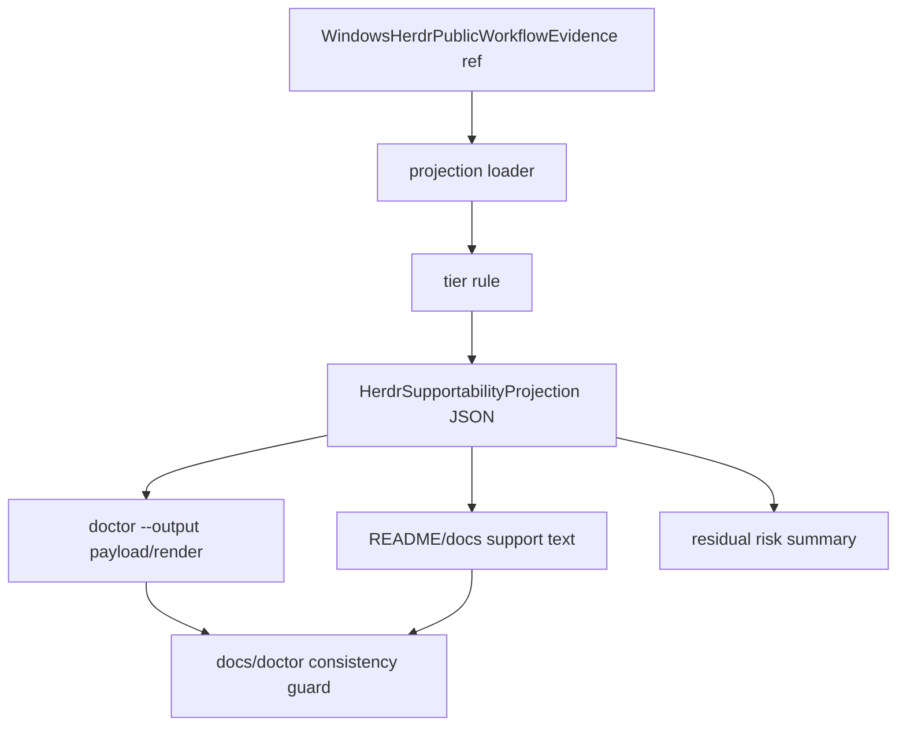

# herdr-supportability-projection feature design

## 0. 术语约定

| 术语 | 定义 | 防冲突结论 |
|---|---|---|
| supportability projection | 从 `WindowsHerdrPublicWorkflowEvidence` 计算出的支持等级、安装入口、doctor 字段、docs 文案和 residual risk 摘要。 | 不是手写 README claim，也不是发布授权。 |
| support tier | `unsupported | experimental | beta | supported`。roadmap 4.7 的 evidence 字段是输入；本 feature 负责把它投影到用户可见面。 | `supported` 只能由 evidence 规则产生，不能由文案或单个 transcript 决定。 |
| residual risk | 来自 matrix `beta_gaps` / `residual_risks` / non-pass workflow 的用户可见限制说明。 | 不能隐藏 blocked/partial/not-run 工作流。 |

仓库事实：

- 现有 Rmux support projection 已有单一 owner：`lib/terminal_runtime/rmux_packaging_support.py`，doctor 渲染消费 `rmux_packaging_support`。
- `docs/plantree/plans/windows-rmux-native-backend/topics/rmux-packaging-support-contract.md` 已定义“support tier 不由 README 文案决定”的模式。
- `lib/cli/render_runtime/ops_views_doctor.py` 已展示 rmux support tier、validation ref、install entry 和 fallback guidance。
- `docs/ccbd-diagnostics-contract.md` 仍有旧 `doctor --bundle` 当前命令口径；parser 已拒绝并提示 `doctor --output`。
- 上游 `native-windows-public-workflow-validation-matrix` design-review 已 passed，但 implementation/acceptance 尚未完成；缺 matrix acceptance 时本 feature implementation 必须 fail closed。

## 1. 决策与约束

### 需求摘要

本 feature 将 Native Windows Herdr public workflow validation evidence 汇总为一个可机器消费的 supportability projection，并把同一 projection 同步到 README/docs、`ccb doctor --output` 和 residual risk 文案。目标是让支持等级由证据驱动，避免 docs/doctor/installer 各自解释 Windows Herdr 是否可用。

成功标准：

- 新增 Herdr support projection 单一 owner，消费 `WindowsHerdrPublicWorkflowEvidence`，不从 README/doctor 文案反推状态。
- `supported` 只在 strict `v8.5.2` 源头/新分支、required workflows 全 pass、所有公开 provider 的 `ask/pend/completion/cancel` 全 pass、Mobile terminal 与 Config UI pass、Herdr auto restore disabled、Windows npm install dry-run pass、release surface artifact 证明 install/update/package gate 可用、docs consistency 和 doctor render guard 通过时出现。
- matrix 缺失、parent acceptance 缺失、版本不是 strict `8.5.2`、任一 core workflow / provider row / Mobile / Config / npm dry-run `blocked/failed/not-run/partial`、Herdr auto restore 非 disabled 时投影 fail closed 到 `unsupported/experimental/beta`。
- `ccb doctor --output` 和 docs/README 展示同一 projection 与 residual risk，不出现互相矛盾的支持 claim。
- 不发布 npm、不打 tag、不 push、不 promotion，不改变 provider completion owner 或 recovery owner。

明确不做：

- 不实现 validation matrix runner；只消费上一 child 产物。
- 不改 Herdr backend/provider/recovery 行为。
- 不扩大 Windows package release surface；发布与 promotion 仍需独立授权。
- 不把 partial/blocked evidence 写成 full support。
- 不保留 `doctor --bundle` 作为当前公开命令。

### 方案深度 pre-pass

候选方案：

1. README/docs 手写 support tier。
2. 仿照 Rmux，新增 Herdr projection owner 和 focused docs/doctor render tests。
3. 直接复用 `rmux_packaging_support.py`，在里面分支支持 Herdr。

选择第 2 个方案。理由：supportability 是跨 docs/doctor/install 的深接口，必须有单一机器 owner；但 Herdr 的输入是 roadmap 4.7 workflow matrix，不应塞进 Rmux projection 造成双后端职责混杂。

### Top 3 风险与缓解

1. **风险：缺 matrix 或 partial evidence 时 docs 提前宣称 supported。**
   缓解：projection 纯函数 fail closed，docs/doctor guard 禁止 final supported claim 越界。
2. **风险：doctor、README、docs 各自展示不同 support tier。**
   缓解：所有用户可见面只消费同一 projection JSON/API；测试比较 stable fields。
3. **风险：把 Rmux support projection 逻辑复制成长期重复代码。**
   缓解：只复用模式，不共享状态 owner；必要的 tier helper 保持本 feature 内局部，后续有第三个 backend 再抽象。

### 非显然依赖与关键假设

- 依赖 `native-windows-public-workflow-validation-matrix` acceptance 产出 matrix JSON；缺失时本 feature 只能生成 blocked/default projection。
- 假设 `doctor --output` payload 可以新增 `herdr_supportability_projection` 字段，不破坏现有 rmux 字段。
- 假设 README/docs 允许描述 beta/experimental support，但不允许 unsupported gaps 被写成 supported。

## 2. 名词与编排

### 2.1 名词层

#### 现状

- Rmux 已有 `RmuxPackagingSupport` TypedDict、packaged JSON fallback、doctor render 字段和 docs contract。
- Herdr roadmap 只定义了输入 evidence：`WindowsHerdrPublicWorkflowEvidence`；仓库尚无 Herdr support projection owner。
- `README.md` 当前只提 Rmux support projection 字段，没有 Herdr supportability projection。

#### 变化

新增 Herdr support projection owner，建议落在 `lib/terminal_runtime/herdr_supportability_projection.py`。

```python
HerdrSupportTier = Literal["unsupported", "experimental", "beta", "supported"]
HerdrInstallEntry = Literal["npm", "install_ps1", "source", "diagnostic_only"]

class HerdrSupportabilityProjection(TypedDict):
    support_tier: HerdrSupportTier
    support_tier_source: Literal["accepted_matrix", "blocked_skeleton", "missing"]
    projection_hash: str | None
    backend_impl: Literal["herdr"]
    os_platform: Literal["win32"]
    cpu_arch: Literal["x64"]
    ccb_version: Literal["8.5.2"] | None
    ccb_source_status: Literal["strict-v8.5.2", "blocked", "unknown"]
    herdr_version: str | None
    herdr_auto_restore_mode: Literal["disabled", "observe-only", "unsupported", "unknown"]
    validation_ref: str | None
    provider_catalog_ref: str | None
    provider_catalog_status: Literal["fresh", "stale", "missing"]
    release_surface_ref: str | None
    release_surface_status: Literal["pass", "blocked", "missing"]
    docs_consistency_ref: str | None
    doctor_render_ref: str | None
    install_entry: HerdrInstallEntry
    windows_npm_enabled: bool
    windows_npm_install_dry_run_status: Literal["pass", "partial", "blocked", "failed", "not-run"]
    required_workflows_status: Literal["pass", "partial", "blocked", "missing"]
    provider_workflows_status: Literal["pass", "partial", "blocked", "missing"]
    mobile_terminal_status: Literal["pass", "partial", "blocked", "failed", "not-run"]
    config_ui_status: Literal["pass", "partial", "blocked", "failed", "not-run"]
    beta_gaps: list[str]
    residual_risks: list[str]
    non_pass_workflows: dict[str, str]
    fallback_guidance: str
```

约束：

- 输入必须来自上一 child 的 `WindowsHerdrPublicWorkflowEvidence` artifact 或其 blocked skeleton；缺失时 `support_tier="experimental"` 或 `unsupported`，`support_tier_source` 由 parent acceptance 状态和 artifact kind 显式决定：accepted parent matrix 为 `accepted_matrix`，accepted blocked skeleton 为 `blocked_skeleton`，缺 parent acceptance 或缺 artifact 为 `missing`；不得从 matrix 内的 `support_tier_is_candidate` 反推来源。
- `supported` 要求 parent matrix `support_projection_allowed=true`、`ccb_source_status="strict-v8.5.2"`、`herdr_auto_restore_mode="disabled"`、required workflows 全 `pass`、provider workflows 全 `pass`、current provider catalog / parent provider freeze freshness 为 `fresh`、`mobile_terminal_status="pass"`、`config_ui_status="pass"`、`windows_npm_install_dry_run_status="pass"`、`beta_gaps=[]`、parent release surface artifact 可加载且满足下表字段条件、当前 projection `install_entry!="diagnostic_only"`、`windows_npm_enabled=true`、当前 feature 生成的 docs consistency 和 doctor render evidence 均存在且 `ok=true`。
- `beta` 可表示 full matrix pass 但 release/docs/install gate 尚未全满足；`experimental` 表示 evidence 不完整但无明确 blocker；`unsupported` 表示 platform/version/matrix blocker 明确存在。
- `non_pass_workflows` 必须记录所有 `partial/blocked/failed/not-run` workflow 的 reason，docs/doctor 不得只显示折叠后的 tier。key namespace 固定为 `workflow:<workflow>` 与 `provider:<provider>:<workflow>`，provider 使用 current provider catalog / parent freeze 中的 provider id；不得混用裸 `ask`、点号 key 或上游 detail row key。doctor/docs render 必须按 key 字典序输出，避免 snapshot/hash 因 dict 构造顺序漂移。
- matrix → projection 映射必须固定：

| Source field / artifact | Projection field | Rule |
|---|---|---|
| `backend_impl/os_platform/cpu_arch/ccb_version/herdr_version/ccb_source_status/herdr_auto_restore_mode` | 同名字段 | 逐项复制；缺失、非 `herdr`、非 `win32/x64`、版本非 strict `8.5.2`、`ccb_source_status!="strict-v8.5.2"` 或 `herdr_auto_restore_mode!="disabled"` 时 fail closed。 |
| `support_tier` | `support_tier` input signal | 只作为 candidate 输入，不直接成为最终 projection tier。 |
| parent acceptance state + matrix artifact kind | `support_tier_source` | 不使用 `support_tier_is_candidate` 推断来源；parent acceptance passed 且 artifact 是 full matrix 时为 `accepted_matrix`，parent acceptance passed 且 artifact 是 blocked skeleton 时为 `blocked_skeleton`，缺 parent acceptance 或缺 artifact 时为 `missing`。 |
| `support_projection_allowed` | supported gate | 只有 `true` 才允许最终 `supported`；`false` 必须降级。 |
| `required_workflows/workflows/workflow_rows` | `required_workflows_status` / `non_pass_workflows` | 先验证 key set 完整且相等，再按 `missing > blocked/failed/not-run > partial > pass` 折叠；所有非 pass workflow 的 reason 都进入 `non_pass_workflows["workflow:<workflow>"]`。 |
| `public_providers/provider_workflows/provider_workflow_rows` + current provider catalog / parent freeze artifact | `provider_catalog_ref` / `provider_catalog_status` / `provider_workflows_status` / `non_pass_workflows` | current catalog 默认由 `build_default_provider_manifests(include_optional=True, include_test_doubles=False)` 恢复；parent freeze artifact 必须与 current catalog provider set 一致。缺 freeze、freeze 与 current catalog 不一致、任一 current provider 缺 `ask/pend/completion/cancel` summary row 或 detail/evidence reason 时，`provider_catalog_status!="fresh"` 或 `provider_workflows_status="missing|blocked"`，final tier 不得 `supported`；完整矩阵再按 `missing > blocked/failed/not-run > partial > pass` 折叠；所有非 pass provider row 的 reason 进入 `non_pass_workflows["provider:<provider>:<workflow>"]`。 |
| `mobile_terminal_status/config_ui_status/windows_npm_install_dry_run_status` | 同名字段 / supported gate | 三者都必须为 `pass` 才允许最终 `supported`；partial/degraded/blocked/failed/not-run 均最高为 `beta` 或更低。 |
| `beta_gaps` | `beta_gaps` | 逐项复制；非空禁止最终 `supported`，最高为 `beta`。 |
| `residual_risks` | `residual_risks` | 逐项复制；非空不单独禁止 `supported`，但必须与 `beta_gaps`、`non_pass_workflows` 一起用户可见。 |
| parent acceptance-bound matrix artifact path loaded by this feature | `validation_ref` | 必需；必须绑定到 parent acceptance `doc_type=feature-acceptance,status=passed` 指向的 `WindowsHerdrPublicWorkflowEvidence` JSON。caller 显式传入 repo-relative matrix path 只能作为已验收 artifact 的定位 override 或 unit fixture，不得绕过 parent acceptance gate；缺失时 matrix 不可核验，fail closed 到 `experimental` 或 `unsupported`。 |
| parent matrix top-level `release_surface_ref` | `release_surface_ref` / `release_surface_status` | primary source；若为空，可使用 parent generic `artifacts["release_surface"]` 作为兼容 fallback；必须加载 `WindowsX64ReleaseSurfaceProjection` artifact 并验证字段：`schema_version==1`、`implementation_admission=="admitted"`、`baseline_version_status=="v8.5.2"`、`surface_state=="available"`、`artifact_status=="ready"`、`package_metadata_policy=="win32-enabled-postinstall-gated"`、`release_install_entry!="diagnostic_only"`、`update_entry!="diagnostic_only"`、`windows_npm_enabled==true`。满足时 `release_surface_status="pass"`；缺失、stale、malformed、字段不满足或任一 gate 不满足时 `release_surface_status="blocked|missing"`，最终最高为 `beta`。 |
| current feature artifact `artifacts/herdr-supportability-projection/docs-consistency.json` | `docs_consistency_ref` | 由本 feature docs guard 生成，JSON 必须至少包含 `schema_version: 1`、`ok: true`、`projection_hash`、`support_tier`、`required_lines`、`refs`；`projection_hash` 必须绑定当前 projection identity，且 `support_tier == final projection.support_tier`。`supported` 必需，缺失、stale、`ok!=true` 或 tier/hash 不一致时最高为 `beta`。 |
| current feature artifact `artifacts/herdr-supportability-projection/doctor-render.json` | `doctor_render_ref` | 由本 feature doctor render guard 生成，JSON 必须至少包含 `schema_version: 1`、`ok: true`、`projection_hash`、`payload_key: "herdr_supportability_projection"`、`render_keys`、`rendered_support_tier`、`refs`；`projection_hash` 必须绑定当前 projection identity，且 `rendered_support_tier == final projection.support_tier`。`supported` 必需，缺失、stale、`ok!=true`、payload key 错误或 tier/hash 不一致时最高为 `beta`。 |

- projection owner 必须重新校验 `support_projection_allowed`、required key set、current provider catalog / parent provider freeze freshness、所有 workflow status 和 reason；不得把 matrix candidate `support_tier` 直接发布为 final tier。
- projection identity 规则固定：`projection_hash` 使用 UTF-8 canonical JSON（sorted keys、紧凑分隔符）计算 SHA-256；输入是当前 `HerdrSupportabilityProjection` 的稳定字段，排除 `projection_hash`、`docs_consistency_ref`、`doctor_render_ref` 这三个自引用 / volatile 字段。列表按原顺序保留，dict 按 key 排序。
- docs/doctor guard 采用两阶段固定点：先用 parent matrix + release surface 计算 candidate projection；如果 candidate 不满足非 docs/doctor 的 `supported` 条件，final projection 直接降级且不允许 docs/doctor artifact 升级。只有 candidate tier 已是 `supported` 时，才用该 candidate 的 `projection_hash` 生成 / 验证 docs-consistency 与 doctor-render artifacts；final projection 仅在两份 artifact 的 `ok=true`、`schema_version=1`、`projection_hash` 和 tier 全部匹配时保持 `supported`，否则降级到最高 `beta`。docs/doctor artifact 不得改变除 `docs_consistency_ref`、`doctor_render_ref` 和最终降级外的 projection 字段。若 final 因 docs/doctor artifact 缺失、stale、`ok!=true` 或 tier/hash 不一致而降级，final `projection_hash` 必须基于降级后的 final projection 重新计算；candidate hash 只用于 supported gate 验证，不得沿用到 downgraded final projection。

##### Interface 设计检查

- Module：Herdr supportability projection owner。
- Interface：caller 提供 matrix ref / repo root，projection owner 返回稳定 projection dict。
- Seam：doctor/docs/install 不直接解析 matrix；只消费 projection。
- Depth / locality：深。支持等级跨 README/docs/doctor/install，必须集中。
- Dependency strategy：local-substitutable。unit 用 fixture matrix 覆盖 pass/partial/blocked/missing。

### 2.2 编排层



流程级约束：

- 先读取 matrix acceptance ref；缺失或不是 `doc_type=feature-acceptance,status=passed` 时生成 default/blocked projection，不写 supported。
- projection 计算是纯函数；docs/doctor 渲染不能修改 tier。
- README/docs 只能展示 projection 的 tier、refs、fallback guidance、`required_workflows_status`、`provider_workflows_status`、`beta_gaps`、`non_pass_workflows` 和 residual risk，不得增加更强 claim。
- docs consistency guard 负责写 `artifacts/herdr-supportability-projection/docs-consistency.json`；doctor render guard 负责写 `artifacts/herdr-supportability-projection/doctor-render.json`。projection owner 只把这两份 current feature artifact 的 `ok=true` 当作 `supported` gate，不从 parent matrix artifacts 猜测 docs/doctor refs。
- `doctor --bundle` 清理和 `doctor --output` 投影必须同测，避免 docs contract 和 parser 冲突。
- 相同 input matrix 产生 deterministic projection JSON。

### 2.3 挂载点

- `lib/terminal_runtime/herdr_supportability_projection.py`：projection schema、loader、tier rule owner。
- `lib/terminal_runtime/herdr_supportability_projection.json`：packaged/default projection。
- `lib/cli/services/doctor.py`：payload object 使用 `herdr_supportability_projection`，由 `herdr_supportability_projection_summary(...)` 填充。
- `lib/cli/render_runtime/ops_views_doctor.py`：render line key 使用 `herdr_support_tier`、`herdr_required_workflows_status`、`herdr_provider_workflows_status`、`herdr_validation_ref`、`herdr_release_surface_ref`、`herdr_release_surface_status`、`herdr_docs_consistency_ref`、`herdr_doctor_render_ref`、`herdr_install_entry`、`herdr_windows_npm_enabled`、`herdr_beta_gaps`、`herdr_fallback_guidance`、`herdr_non_pass_workflows`、`herdr_residual_risks`。
- `README.md` 与 `docs/ccbd-diagnostics-contract.md`：说明 Herdr supportability projection 和 `doctor --output`，不宣称 unsupported gap 为 supported。
- `test/test_herdr_supportability_projection.py` 与 focused doctor/docs tests：验证 tier rule、fail-closed、render/docs consistency。

### 2.4 推进策略

1. **projection schema and fail-closed loader**：新增 projection owner、default packaged projection 和 matrix loader。
   退出信号：缺 matrix、缺 parent acceptance、版本不匹配、provider freeze 缺失或与 current catalog 不一致时不会 supported，输出 deterministic default/blocked projection。
2. **tier rule**：实现 unsupported/experimental/beta/supported 纯规则。
   退出信号：required workflows + all-provider rows + provider catalog freshness + Mobile terminal + Config UI + Windows npm install dry-run 全 pass/fresh，且 strict v8.5.2、Herdr auto restore disabled、无 beta gaps、release surface pass、install/update/package gate pass、docs/doctor evidence 全满足才能 supported；status 聚合按 `missing > blocked/failed/not-run > partial > pass` 折叠，所有 partial/blocked/failed/not-run 均降级并进入 `non_pass_workflows`。
3. **doctor projection**：把 projection 接入 `doctor --output` payload/render。
   退出信号：doctor render test 能看到 Herdr tier、required workflows status、provider workflows status、validation/release/docs/doctor refs、release surface status、install entry、Windows npm enabled、beta gaps、non-pass workflows、fallback guidance、residual risks；不影响 rmux 字段。
4. **docs and README projection**：同步 README/docs contract。
   退出信号：docs 只引用 projection，不保留当前公开 `doctor --bundle`；不出现 final supported claim 越界；生成 `artifacts/herdr-supportability-projection/docs-consistency.json`。
5. **consistency and scope guards**：补 docs/doctor/support consistency、publish/push/owner scope guard。
   退出信号：projection tests、doctor render tests、docs guard、scope guard 均通过，并生成 `doctor-render.json` / `docs-consistency.json`。

### 2.5 结构健康度与微重构

##### 评估

- 文件级：`ops_views_doctor.py` 已承接 doctor 文本渲染，新增少量 Herdr support fields 可以局部扩展；tier 规则不应放进 render 文件。
- 目录级：`terminal_runtime` 已有 `rmux_packaging_support.py`，新增 Herdr projection owner 与现有模式一致。
- 测试级：需要 focused projection tests，避免把 support tier 规则散进 docs tests。

##### 结论：不做行为等价微重构

本 feature 新增独立 Herdr projection owner和 focused tests，不先抽象 Rmux/Herdr 共用 support framework；第三个 backend 出现前抽象属于 YAGNI。

## 3. 验收契约

### 3.1 关键场景清单

| ID | 输入 / 触发 | 期望可观察结果 | 证据类型 |
|---|---|---|---|
| AC-001 | matrix acceptance ref 缺失、provider freeze 缺失或 provider freeze 与 current catalog 不一致 | projection fail closed，`support_tier` 不为 supported | unit |
| AC-002 | matrix 中任一 required workflow partial/blocked/failed/not-run | projection 不为 supported，`non_pass_workflows` 含 reason | unit |
| AC-003 | required workflows 全 pass 但 docs/doctor evidence 缺失 | projection 最高为 beta | unit |
| AC-004 | required workflows、所有公开 provider ask/pend/completion/cancel、provider catalog freshness、Mobile terminal、Config UI、Windows npm install dry-run 全 pass/fresh，无 beta gaps，strict v8.5.2，Herdr auto restore disabled，release surface pass，docs/doctor evidence 存在 | projection 可为 supported | unit |
| AC-005 | `ccb_version` 非 strict `8.5.2`、`ccb_source_status` 非 strict、Herdr auto restore 非 disabled 或 platform 非 win32/x64 | projection fail closed | unit |
| AC-006 | `ccb doctor --output` | doctor payload/render 展示 Herdr support tier、required workflows status、provider workflows status、validation/release/docs/doctor refs、release surface status、install entry、Windows npm enabled、beta gaps、non-pass workflows、fallback guidance、residual risks | CLI render |
| AC-007 | docs/README | 文案引用 projection，不宣称 blocked/partial 为 supported | docs guard |
| AC-008 | `doctor --bundle` 文案 | docs contract 不把 `doctor --bundle` 作为当前公开命令 | docs guard |
| AC-009 | scope | 不发布、不 push、不 tag、不改 provider completion/recovery owner | diff guard |
| AC-010 | all-provider / Mobile / Config / npm dry-run gate | 任一 provider workflow、Mobile terminal、Config UI 或 Windows npm install dry-run 非 pass 时 projection 不为 supported | unit |
| AC-011 | workflow status mixed severity | 同一集合同时有 partial 与 blocked/failed/not-run 时按 `missing > blocked/failed/not-run > partial > pass` 折叠，不把 blocked 降成 partial | unit |
| AC-012 | support_tier_source | `support_tier_source` 由 parent acceptance 状态和 artifact kind 决定，accepted full matrix 为 `accepted_matrix`、accepted blocked skeleton 为 `blocked_skeleton`、缺失为 `missing`，不由 `support_tier_is_candidate` 反推 | unit |
| AC-013 | non-pass key namespace | `non_pass_workflows` 使用 `workflow:<workflow>` 与 `provider:<provider>:<workflow>` key，doctor/docs render 按 key 字典序输出 | unit/snapshot |

### 3.2 明确不做的反向核对项

- 不从 README/docs 手写支持等级反推 projection。
- 不让 blocked/partial/not-run workflow 通过 supported。
- 不修改 Herdr backend/provider/recovery 行为。
- 不执行 npm publish、git push、git tag、promotion。

### 3.3 Acceptance Coverage Matrix

| Scenario | Covered By Step | Evidence Type | Command / Action | Core? |
|---|---|---|---|---|
| AC-001 missing matrix/provider freeze | S1 | unit | projection tests | yes |
| AC-002 partial/blocked workflow | S2 | unit | tier rule tests | yes |
| AC-003 beta without docs/doctor | S2 | unit | tier rule tests | yes |
| AC-004 supported allowed only with all gates | S2,S5 | unit/docs | projection + release surface + docs consistency tests | yes |
| AC-005 version/platform fail closed | S1,S2 | unit | schema negative tests | yes |
| AC-006 doctor render | S3 | CLI render | doctor render tests | yes |
| AC-007 docs projection | S4,S5 | docs | docs guard | yes |
| AC-008 doctor bundle cleanup | S4 | docs | docs guard | yes |
| AC-009 scope | S5 | diff | scope guard | yes |
| AC-010 hard gates | S2,S5 | unit | all-provider/Mobile/Config/npm dry-run gate tests | yes |
| AC-011 mixed severity fold | S2 | unit | status folding priority tests | yes |
| AC-012 support source semantics | S1,S2 | unit | support_tier_source tests | yes |
| AC-013 non-pass key namespace | S2,S3,S5 | unit/snapshot | non_pass_workflows key namespace + sorted render tests | yes |

### 3.4 DoD Contract

| ID | 要求 | 证据 | 阻塞级别 |
|---|---|---|---|
| DOD-DESIGN-001 | design/checklist/review 完整且对齐 roadmap item | design review | blocking |
| DOD-IMPL-001 | projection owner 只消费 matrix/default refs，缺输入、provider freeze 缺失或 freeze 与 current catalog 不一致时 fail closed | unit | blocking |
| DOD-IMPL-002 | support tier 规则不夸大 blocked/partial/not-run，并按 `missing > blocked/failed/not-run > partial > pass` 折叠 workflow/provider aggregate | unit | blocking |
| DOD-IMPL-003 | doctor payload/render 与 projection 一致 | CLI render | blocking |
| DOD-IMPL-004 | README/docs 只引用 projection，不发布 unsupported gap 为 supported | docs guard | blocking |
| DOD-IMPL-005 | `doctor --bundle` 旧口径清理，当前公开命令为 `doctor --output` | docs guard | blocking |
| DOD-IMPL-006 | 不修改 provider completion、recovery owner、publish/promotion | diff guard | blocking |
| DOD-IMPL-007 | supported gate 覆盖 all-provider、current provider catalog / parent freeze freshness、Mobile terminal、Config UI、Herdr auto restore disabled、strict v8.5.2 和 Windows npm install dry-run | unit | blocking |
| DOD-REVIEW-001 | code review passed 且无 unresolved blocking | review report | blocking |
| DOD-QA-001 | QA 覆盖 projection、doctor、docs、scope guard | QA report | blocking |
| DOD-ACCEPT-001 | acceptance 回写 roadmap item，并记录 projection/release-surface/docs/doctor evidence refs | acceptance report | blocking |

Validation Commands:

| ID | 命令 | 目的 | 核心性 | 失败处理 |
|---|---|---|---|---|
| CMD-001 | `python ".codestable/tools/validate-yaml.py" --file ".codestable/features/2026-07-31-herdr-supportability-projection/herdr-supportability-projection-checklist.yaml" --yaml-only` | checklist YAML 合法性 | core | fix-or-block |
| CMD-002 | `python ".codestable/tools/validate-yaml.py" --file ".codestable/roadmap/windows-native-herdr-ccb/windows-native-herdr-ccb-items.yaml"` | roadmap items 回写合法性 | core | fix-or-block |
| CMD-003 | `python -m pytest -q test/test_herdr_supportability_projection.py test/test_cli_doctor_herdr_supportability.py` | projection tier rule、release surface gate 与 doctor render | core | fix-or-block |
| CMD-004 | `python -c "import pathlib,re; p=pathlib.Path('docs/ccbd-diagnostics-contract.md'); bad=[(i+1,line.rstrip()) for i,line in enumerate(p.read_text(encoding='utf-8').splitlines()) if 'doctor --bundle' in line.lower() and not re.search(r'deprecated|unsupported|no longer supported|not supported|rejected|intentionally rejected', line, re.I)]; assert not bad,bad"` | docs contract 旧 `doctor --bundle` 口径清理 | core | fix-or-block |
| CMD-005 | `python -m pytest -q test/test_herdr_supportability_scope_guard.py` | scope guard：扫描产品 diff、当前 feature/roadmap CodeStable 产物和未跟踪文件；fixture 必须覆盖空白和 code-tokenized 的 publish/push/tag、provider completion/recovery owner，以及 `not-run workflows are supported` 反例；只允许明确否定结构如 `not supported when not-run`、`不得宣称 supported`、`不执行 npm publish` | core | fix-or-block |

Required Artifacts：

- design、checklist、design-review
- Herdr supportability projection owner + packaged/default projection
- projection tier rule tests
- doctor render tests
- README/docs contract delta
- `artifacts/herdr-supportability-projection/docs-consistency.json`
- `artifacts/herdr-supportability-projection/doctor-render.json`
- docs guard / scope guard evidence
- roadmap items.yaml 回写

### 3.5 自我批判结论

- 可证伪性：每个 tier 都由 matrix/docs/doctor evidence 决定，不靠描述性文案。
- 步骤原子性：loader、tier rule、doctor、docs、guard 分离。
- 最弱依赖：上一 child acceptance matrix；已写缺失 fail-closed。
- 证据完整性：unit 证明规则，CLI render 证明 doctor，docs guard 证明文案。
- 基线可执行性：design 阶段只跑 YAML；CMD-004 预计会在当前 docs baseline 红，implementation 需清理。
- 交付物可核验性：projection JSON/API、doctor lines、docs diff、roadmap acceptance refs 都可从仓库事实反查。
- 清洁度覆盖：禁止临时 TODO/FIXME、调试输出、注释掉代码、无用 import、发布命令和 owner 越界。

## 4. 与项目级架构文档的关系

- 本 feature 是 `windows-native-herdr-ccb` 的第 11 个 child，承接 roadmap 4.7 Public Workflow Evidence 和 Validation & Support 模块。
- 本 feature 只做 supportability projection 和用户可见文案/doctor 投影，不做 release/promotion。
