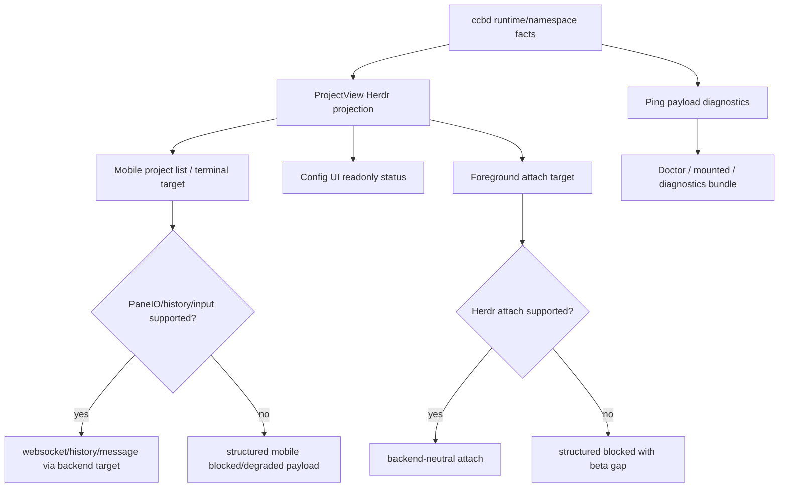

# herdr-user-surfaces-parity feature design

## 0. 术语约定

| 术语 | 定义 | 防冲突结论 |
|---|---|---|
| public surface | 用户或支持人员直接看到的 CCB 输出：foreground attach、Mobile terminal、Config UI、doctor、ping、mounted、project view、diagnostics bundle。 | 不是 backend adapter 实现，也不是 release/support tier 最终宣称。 |
| Herdr evidence projection | 把 `backend_impl="herdr"`、namespace/pane refs、capabilities、beta gaps、degraded next action 投影到 public surface。 | 只投影 redacted evidence；不泄露 raw restore token、provider secret 或 terminal buffer 全量。 |
| degraded next action | surface 上可行动的诊断：blocked/partial 原因、用户下一步、缺失 capability。 | 不能只显示 backend available。 |
| terminal target abstraction | Mobile / foreground attach 用来打开或操作 pane 的 backend-neutral target。 | Herdr 不得被强制转换成 tmux socket/session/pane `%N`。 |

仓库事实：

- `lib/cli/services/start_foreground.py` 当前 foreground attach 分支只支持 tmux 与 rmux；rmux 分支通过 `RmuxBackend.attach_namespace()`，tmux 分支直接 `tmux attach-session`。
- `lib/mobile_gateway/terminal.py` 的 `TerminalAttachTarget`、`TerminalHistoryTarget`、`PaneMessageTarget` 均要求 tmux socket/session/pane，并用 tmux `capture-pane` / `send-keys`。
- `lib/mobile_gateway/service.py` 从 ProjectView 的 `namespace.socket_path` / `session_name` / `pane_id` 构造 Mobile terminal target；缺 tmux evidence 会返回 `ProjectView tmux evidence is not attachable`。
- `lib/ccbd/project_view/service.py` 已把 runtime `evidence_ledger` 投影到 agent/project view，并用 tmux pane text 做 provider activity hint；Herdr 需要避免 tmux capture 假设。
- `lib/ccbd/handlers/ping_runtime/payloads.py` 的 `build_agent_payload()` / `build_ccbd_payload()` 已投影 backend selection、namespace payload 和 runtime evidence ledger。
- `lib/cli/services/doctor.py` 聚合 `backend_selection_summary()`、`rmux_packaging_support_summary()`、ccbd remote ping、agents；`lib/cli/render_runtime/ops_views_doctor.py` 已渲染 backend selection、rmux support 和 namespace 字段。
- `lib/cli/services/config_ui.py` 当前 Config UI 主要暴露 config/session/provider capabilities，不暴露 backend project health；本 feature 只允许增加只读 Herdr status/capability endpoint 或 session payload，不改配置编辑语义。
- 前置 `provider-runtime-on-herdr` 与 `herdr-bounded-recovery-boundary` 均 design-review passed；implementation 阶段仍必须等待两者 acceptance evidence，缺失时 dependency-blocked。

## 1. 决策与约束

### 需求摘要

本 feature 定义 Herdr backend evidence 在 public surfaces 中的投影契约。用户在 Native Windows x64 Herdr backend 下，应能从 foreground attach、Mobile terminal、Config UI、doctor、ping、mounted、project view 和 diagnostics bundle 看到一致的 backend identity、capability/beta gaps、degraded reason、recovery/action next step；同时 Herdr pane/session primitive 不能越界成为 provider completion 或 recovery owner。

成功标准：

- implementation admission 必须验证 `provider-runtime-on-herdr` 与 `herdr-bounded-recovery-boundary` 已 accepted；只有 design-review passed 时 dependency-blocked。
- ProjectView / ping / doctor / diagnostics bundle 都能展示 `backend_impl="herdr"`、Herdr namespace/pane refs、capability status、support tier projection/source、beta gaps、degraded next action，且 raw restore token 不进入 public payload。
- foreground attach 支持 Herdr attach capability：支持则调用 backend-neutral attach；不支持则 fail closed 并显示 beta gap / next action。
- Mobile terminal 支持 Herdr terminal target abstraction：支持 websocket/history/message 则走 Herdr PaneIO/PanePresentation primitive；不支持则返回 structured blocked/degraded payload，不伪装成 tmux。
- Config UI 只增加只读 backend/status/capability 投影，不改变 provider config validation、profile save、reload/apply contract。
- mounted/project view 不只显示 backend available，还要显示 partial/blocked reason、support tier projection source 和下一步。

明确不做：

- 不新增 release/publish/npm metadata/support tier 最终宣称；这些属于后续 `windows-x64-release-surface` / validation / support projection。
- 不改变 provider completion、ask/pend/cancellation 权威；Herdr agent state diagnostics-only。
- 不实现 Herdr socket client schema；只消费前置 Herdr backend/client capability。
- 不把 Mobile/Config UI 做视觉大改版；本 feature 只补 data contract、render rows、blocked/degraded states 和 focused tests。
- 不发布、不 promotion、不执行 git commit/push/tag/merge/release/deploy。

### 方案深度 pre-pass

候选：

- 只在 doctor 里加一行 `backend=herdr`。
- 让 Herdr surfaces 复用 tmux socket/session/pane 字段。
- 本 feature 方案：建立 public surface projection contract + backend-neutral terminal target，所有 surfaces 只读消费 redacted Herdr evidence。

选择本 feature 方案。原因是 roadmap 要的是 public workflow parity，单行 doctor 输出无法覆盖 Mobile terminal、foreground attach 和 project view；把 Herdr 伪装成 tmux 会复发 `%pane` / socket path 依赖，也会误导 support tier。

### Top 3 风险与缓解

1. **风险：surface 显示 backend 可用但真实操作 blocked。**  
   缓解：所有 surfaces 必须带 `capability_status`、`blocking_gaps`、`degraded_next_action`；acceptance 用 blocked/partial 样例核对。
2. **风险：Mobile terminal 继续依赖 tmux evidence。**  
   缓解：S3 建 backend-neutral terminal target；tmux-only target 缺失时不再报 “tmux evidence missing” 给 Herdr，而返回 Herdr-specific blocked/degraded code。
3. **风险：支持等级被提前夸大。**  
   缓解：本 feature 只输出 projection source 和 beta gaps，不改 README/support tier final claim，不碰 package/release。

### 非显然依赖与关键假设

- 依赖 `provider-runtime-on-herdr` acceptance 提供 Herdr provider runtime refs、pane/session evidence 与 completion source contract。
- 依赖 `herdr-bounded-recovery-boundary` acceptance 提供 recovery owner/circuit/degraded next action evidence。
- 假设 ProjectView 是 Mobile/Config UI/doctor/ping/mounted 的公共事实源；若 implementation 发现某 surface 直接读 runtime store，必须保持字段语义一致。
- 假设 Herdr attach / PaneIO / history/message capability 可通过前置 backend client/fake backend 表达；不支持时必须 structured blocked。

## 2. 名词与编排

### 2.1 名词层

#### 现状

- ProjectView 已有 namespace、agents、windows、recent jobs、runtime evidence ledger，但 tmux-focused helper 仍会通过 `backend_for_namespace()` 和 tmux capture 构造 pane hints。
- Ping payload 已包含 backend selection、namespace payload、runtime evidence ledger；doctor render 已输出 namespace/backend_selection/rmux support，但没有 Herdr support projection。
- Mobile terminal target 类型只包含 tmux socket/session/pane；terminal history/message 都调用 tmux CLI。
- foreground attach summary 只有 tmux/rmux 分支；Herdr `backend_impl` 会落入 tmux 路径并要求 tmux。
- Config UI session/capabilities endpoint 不包含 project backend health。

#### 变化

新增或等价实现 public projection 类型：

```python
class HerdrSurfaceProjection(TypedDict):
    backend_impl: Literal["herdr"]
    capability_status: Literal["supported", "partial", "blocked", "unsupported"]
    support_tier_projection: Literal["unsupported", "experimental", "beta"]
    support_tier_projection_source: Literal["backend_capability", "validation_pending", "supportability_deferred"]
    beta_gaps: list[str]
    blocking_gaps: list[str]
    degraded_next_action: str | None
    evidence_refs: dict[str, object]

class TerminalTargetV2(TypedDict):
    backend_impl: Literal["tmux", "rmux", "herdr"]
    namespace_ref: MuxNamespaceRefV2
    pane_ref: MuxPaneRefV2 | None
    attach_supported: bool
    history_supported: bool
    input_supported: bool
    blocked_reason: str | None

class TerminalBlockedPayload(TypedDict):
    code: Literal["target_not_attachable", "history_unsupported", "input_unsupported", "attach_unsupported"]
    backend_impl: Literal["tmux", "rmux", "herdr"]
    capability_status: Literal["partial", "blocked", "unsupported"]
    degraded_next_action: str | None
    message: str

class TerminalOperationAdapter(Protocol):
    def open_session(self, target: TerminalTargetV2, geometry: TerminalGeometry): ...
    def history(self, target: TerminalTargetV2, *, max_lines: int) -> dict[str, object] | TerminalBlockedPayload: ...
    def send_message(self, target: TerminalTargetV2, text: str) -> dict[str, object] | TerminalBlockedPayload: ...
```

兼容规则：

- tmux/rmux public payload 不退化；Herdr fields additive。
- ProjectView / ping / doctor / diagnostics 中的 namespace/pane refs 必须 redacted；不得输出 raw restore token。
- `support_tier_projection` 是当前 evidence 投影，只允许 `unsupported` / `experimental` / `beta`；不得在本 feature 输出 `supported`。最终 `support_tier="supported"` 只能由后续 validation / supportability projection 依据完整矩阵产生。
- `support_tier_projection_source` 必须说明来源：backend capability、validation pending，或 supportability deferred；doctor/mounted/project view 必须显示该来源，避免把当前状态误读成最终支持承诺。
- `degraded_next_action` 必须可行动，例如 `install-herdr-x64`、`enable-herdr-backend`、`collect-validation-transcript`、`repair-provider-auth`、`wait-probation`。
- Mobile terminal 的 websocket attach、history、message 三条路径都必须通过 `TerminalOperationAdapter` 或等价 seam；tmux 现有实现只是一个 adapter，Herdr 不得在 `MobileGatewayService` 内复制 tmux socket/session/pane 分支。

##### Interface 设计检查

- Module：`ccbd.project_view`、`ccbd.handlers.ping_runtime`、`cli.services.doctor`、`cli.render_runtime.ops_views_doctor`、`mobile_gateway.terminal/service`、`cli.services.start_foreground`、`cli.services.config_ui`。
- Interface：ProjectView / ping 是事实源；Mobile/foreground 是 terminal operation surface；doctor/diagnostics 是 support surface；Config UI 是只读 status consumer。
- Seam：terminal operation seam 走 `MuxBackend` / Herdr backend capability，不直接拼 Herdr socket JSON。
- Depth / locality：deep。public surfaces 共享同一 projection，避免每个 renderer 自己解释 Herdr beta gap。
- Dependency strategy：local-substitutable。unit tests 用 fake Herdr project view/backend；manual transcript 用 Native Windows x64 Herdr。

### 2.2 编排层



流程级约束：

- implementation admission 先跑 upstream acceptance gate；缺 provider runtime 或 recovery boundary acceptance artifact/evidence 时 dependency-blocked。
- ProjectView 是优先事实源；ping/doctor/diagnostics 可透传或补齐同名 projection，不得产生相互矛盾的 capability status 或 support tier projection。
- foreground attach 对 `backend_impl="herdr"` 必须走 Herdr attach capability；不支持时返回 `herdr foreground attach blocked: <reason>`，不要求 tmux binary。
- Mobile terminal target 对 Herdr 不得要求 `namespace.socket_path/session_name`；目标构造从 backend-neutral namespace/pane refs 和 capability 决定。
- Config UI 只读 endpoint/session payload 可显示 backend status/beta gaps；保存/预览/应用 config 的 contract 不变。
- doctor/ping/mounted/project view 必须显示 support tier projection、projection source 和 degraded next action；backend available 不能覆盖 blocked/partial recovery/user-surface gaps。
- diagnostics bundle 不重新解释 Herdr raw refs；只归档已经 redacted 的 ccbd runtime/report/evidence JSON 和 generated doctor/storage summary，并在 manifest 中可追踪 `HerdrSurfaceProjection` 来源。
- public payload redaction 继承前置 recovery boundary：raw restore token、provider secret、terminal buffer 全量不得进入 logs/support bundle。

### 2.3 挂载点

- `lib/ccbd/project_view/service.py` 与相关 tests：Herdr projection 和 backend-neutral terminal target facts。
- `lib/ccbd/handlers/ping_runtime/payloads.py`、`lib/cli/services/ping.py`、`lib/cli/services/ps.py`、`lib/cli/services/layout_status.py`、`lib/cli/render_runtime/common.py`、`lib/cli/render_runtime/ops_views_basic.py`：mounted state projection 复用 ping / ps / layout status 的 ccbd mount payload 和 Herdr projection，不虚构独立 mounted daemon 入口。
- `lib/cli/services/start_foreground.py`：Herdr attach capability 分支或 structured blocked。
- `lib/mobile_gateway/terminal.py`、`lib/mobile_gateway/service.py`：TerminalTargetV2、TerminalOperationAdapter、history/input/websocket blocked/degraded handling。
- `lib/cli/services/doctor.py`、`lib/cli/render_runtime/ops_views_doctor.py`、`lib/cli/services/diagnostics_runtime/bundle.py`、`lib/cli/services/diagnostics_runtime/sources.py`：doctor/support bundle projection；bundle 只归档 redacted ccbd runtime/report/evidence JSON 与 generated summaries。
- `lib/cli/services/config_ui.py` 与 `test/test_config_ui.py`：只读 backend status/capability endpoint 或 session payload。

### 2.4 推进策略

1. **Admission and projection contract**：确认 provider runtime + recovery boundary accepted，定义 shared Herdr surface projection、support tier current projection 和 source。
2. **ProjectView / ping source of truth**：在 ProjectView/ping 中投影 Herdr backend identity、capability、support tier projection、beta gaps、degraded next action 和 redacted refs。
3. **Foreground attach**：Herdr attach supported 时走 backend-neutral attach；unsupported/partial 时 structured blocked，不落 tmux。
4. **Mobile terminal target v2**：Mobile history/websocket/message 经 backend-neutral operation adapter；Herdr unsupported 时返回 structured blocked/degraded response。
5. **Doctor / mounted / diagnostics support surfaces**：doctor render、mounted state projection、project view、diagnostics bundle 对齐同一 projection 和 redacted evidence source。
6. **Config UI readonly status**：Config UI readonly status/session payload 对齐同一 projection，不改变 config edit/apply。
7. **Regression and scope guard**：跑 existing tmux/rmux/Mobile/doctor/config UI tests、Herdr fake surface tests、scope/redaction guard。
8. **Native Windows surface transcript**：收集 foreground attach、Mobile terminal 或 blocked evidence、doctor/ping/mounted/project view transcript。

### 2.5 结构健康度与微重构

##### 评估

- 文件级：`mobile_gateway/service.py` 较大，Herdr terminal target 若直接塞入会继续膨胀；实现阶段应优先在 `mobile_gateway/terminal.py` 或小 helper 中承载 target abstraction，再由 service 调用。
- 文件级：`start_foreground.py` 已有 tmux/rmux 分支，适合最小增加 Herdr attach分支；不重写 attach loop。
- 文件级：`project_view/service.py` 是 public facts 聚合点，适合补 projection，但 Herdr-specific formatting 不应散进 provider activity parser。
- 文件级：`ops_views_doctor.py` 是纯 render，适合追加 rows；support tier policy 不应写在 render 层。
- 目录级：现有 `cli/services/diagnostics_runtime`、`mobile_gateway`、`ccbd/project_view` 目录已按职责分层，不重组目录。

##### 结论：有限小 helper，不做行为等价微重构

不先搬目录或拆大文件。实现阶段允许新增小 helper，如 `ccbd/project_view/herdr_projection.py` 或 `mobile_gateway/terminal_target.py`，但不做宽重构；若需要重写 MobileGatewayService 路由结构，停止并另开 refactor。

## 3. 验收契约

### 3.1 关键场景清单

| ID | 输入 / 触发 | 期望可观察结果 | 证据类型 |
|---|---|---|---|
| AC-001 | upstream provider runtime / recovery boundary 未 accepted | dependency-blocked admission report，不进入实现 | artifact/unit |
| AC-002 | ProjectView 读取 Herdr runtime/namespace facts | payload 含 `backend_impl="herdr"`、redacted refs、capability/beta gaps、support tier projection/source、degraded next action | unit |
| AC-003 | `ccb ping ccbd` / agent ping on Herdr | ping payload 与 ProjectView projection 一致，不泄露 raw token，support tier source 一致 | unit/CLI |
| AC-004 | foreground attach on Herdr attach supported | 调 backend-neutral attach，summary 显示 Herdr namespace/session refs | unit/manual |
| AC-005 | foreground attach on Herdr attach unsupported | fail closed，错误含 beta gap / next action，不要求 tmux | unit |
| AC-006 | Mobile terminal target on Herdr supported | websocket/history/message 使用 backend-neutral operation adapter，不要求 tmux socket/session | unit/integration |
| AC-007 | Mobile terminal target on Herdr unsupported/partial | 返回 `TerminalBlockedPayload`，UI 可显示 code、reason、next action | unit |
| AC-008 | doctor/mounted/project view/diagnostics bundle | 输出 Herdr support tier projection/source、capability status、blocked reason、degraded next action；bundle 中来源为 redacted ccbd/generated artifact | CLI/unit |
| AC-009 | Config UI readonly status | `/api/session` 或 dedicated readonly endpoint 显示 backend status/beta gaps，不改变 config edit/apply | unit/browser-light |
| AC-010 | tmux/rmux regression | existing attach/Mobile/project view/doctor tests 不退化 | unit |
| AC-011 | scope boundary | 不改 provider completion、release/package/support final claim、provider auth/session authority | diff review |
| AC-012 | Native Windows x64 surface evidence | transcript 覆盖 foreground attach/Mobile/doctor/ping/mounted/project view 或 blocked evidence | manual transcript |

### 3.2 明确不做的反向核对项

- 不应新增 `CompletionStatus.COMPLETED` 判定或改变 job terminal verdict。
- 不应把 Herdr agent state 显示为 completion authority。
- 不应输出 raw restore token、provider secret 或 terminal buffer 全量。
- 不应修改 package/release/npm publish/support final claim。
- 不应让 Herdr 走 tmux socket/session/pane `%N` 伪装路径。

### 3.3 Acceptance Coverage Matrix

| Scenario | Covered By Step | Evidence Type | Command / Action | Core? |
|---|---|---|---|---|
| AC-001 admission | S1 | artifact/unit | upstream acceptance gate | yes |
| AC-002 ProjectView | S2 | unit | fake Herdr ProjectView tests | yes |
| AC-003 ping | S2,S5 | unit/CLI | ping payload/render tests | yes |
| AC-004 foreground supported | S3 | unit/manual | fake Herdr attach + Windows transcript | yes |
| AC-005 foreground blocked | S3 | unit | unsupported attach tests | yes |
| AC-006 Mobile supported | S4 | unit/integration | Mobile terminal target v2 tests | yes |
| AC-007 Mobile blocked | S4 | unit | Mobile blocked/degraded payload tests | yes |
| AC-008 doctor/mounted/diagnostics | S5 | CLI/unit | doctor/ping/ps/layout status/project view/diagnostics tests | yes |
| AC-009 Config UI | S6 | unit/browser-light | config UI endpoint tests | yes |
| AC-010 regression | S7 | unit | existing tmux/rmux/Mobile tests | yes |
| AC-011 scope | S7 | diff review | forbidden path/content guard | yes |
| AC-012 manual | S8 | manual transcript | Native Windows x64 transcript | yes |

### 3.4 DoD Contract

| ID | 要求 | 证据 | 阻塞级别 |
|---|---|---|---|
| DOD-DESIGN-001 | design/checklist/review 完整，且对齐 roadmap item `herdr-user-surfaces-parity` | design review | blocking |
| DOD-IMPL-000 | 前置 provider runtime 与 recovery boundary acceptance passed 且 artifact/evidence refs 可验证；缺失时 dependency-blocked | artifact/unit | blocking |
| DOD-IMPL-001 | shared Herdr surface projection 字段一致，含 support tier projection/source，redacted refs 不泄露 raw token | unit/static | blocking |
| DOD-IMPL-002 | ProjectView/ping/doctor/mounted/diagnostics 显示 capability/beta gaps/support tier projection/source/degraded next action | unit/CLI | blocking |
| DOD-IMPL-003 | foreground attach Herdr supported/blocked 两条路径都可观察，不落 tmux fallback | unit/manual | blocking |
| DOD-IMPL-004 | Mobile terminal target v2 经 backend-neutral operation adapter 支持 Herdr supported/blocked，tmux/rmux regression 不退化 | unit/integration | blocking |
| DOD-IMPL-005 | Config UI 只读 status 投影不改变 config edit/apply contract | unit | blocking |
| DOD-IMPL-006 | 无 provider completion、release/package/support final claim 越界 | diff review | blocking |
| DOD-REVIEW-001 | code review passed 且无 unresolved blocking | review report | blocking |
| DOD-QA-001 | QA 复核 public surface consistency、redaction、blocked states、tmux/rmux regression | QA report | blocking |
| DOD-ACCEPT-001 | acceptance 回写 roadmap item，并包含 Native Windows x64 surface transcript 或 blocked evidence | acceptance report | blocking |

Validation Commands:

| ID | 命令 | 目的 | 核心性 | 失败处理 |
|---|---|---|---|---|
| CMD-001 | `python ".codestable/tools/validate-yaml.py" --file ".codestable/features/2026-07-31-herdr-user-surfaces-parity/herdr-user-surfaces-parity-checklist.yaml" --yaml-only` | checklist YAML 合法性 | core | fix-or-block |
| CMD-002 | `python ".codestable/tools/validate-yaml.py" --file ".codestable/roadmap/windows-native-herdr-ccb/windows-native-herdr-ccb-items.yaml"` | roadmap items 回写合法性 | core | fix-or-block |
| CMD-003 | `python -c "import pathlib, re; root=pathlib.Path('.codestable/features'); items=pathlib.Path('.codestable/roadmap/windows-native-herdr-ccb/windows-native-herdr-ccb-items.yaml').read_text(encoding='utf-8'); deps=[('provider-runtime-on-herdr','2026-07-31-provider-runtime-on-herdr'),('herdr-bounded-recovery-boundary','2026-07-31-herdr-bounded-recovery-boundary')]; artifact_marker=re.compile(r'(Required Artifacts|required artifacts|evidence_required|证据|交付物|artifact)', re.I); ref_marker=re.compile(r'(CMD-\\d+|pytest|transcript|\\.json|\\.md|evidence|artifact|test)', re.I); missing=[]; read=lambda p: p.read_text(encoding='utf-8',errors='ignore');\nfor slug,feature in deps:\n    missing += [] if re.search(r'- slug: '+re.escape(slug)+r'[\\s\\S]*?status: done[\\s\\S]*?feature: '+re.escape(feature), items) else [f'{slug}: roadmap not done']; ok=any(('doc_type: feature-acceptance' in (text:=read(p)) and 'status: passed' in text and artifact_marker.search(text) and ref_marker.search(text)) for p in (root/feature).glob('*-acceptance.md')); missing += [] if ok else [f'{feature}: acceptance missing/passed/artifact-evidence-refs'];\nassert not missing, missing"` | implementation admission：前置 accepted | core | dependency-blocked |
| CMD-004 | `python -m pytest -q test/test_ccbd_project_view.py test/test_v2_ccbd_ping_runtime.py test/test_cli_doctor_supervision.py test/test_v2_cli_render.py test/test_v2_diagnostics_bundle.py -k "herdr or backend or evidence or diagnostics or project_view or ping or doctor or mounted or ps or layout"` | ProjectView/ping/doctor/mounted/diagnostics projection | core | fix-or-block |
| CMD-005 | `python -m pytest -q test/test_v2_start_foreground.py test/test_mobile_gateway_terminal.py test/test_mobile_gateway_service.py test/test_config_ui.py -k "herdr or backend or terminal or attach or blocked or config or readonly"` | foreground/Mobile/Config UI Herdr surfaces | core | fix-or-block |
| CMD-006 | `python -m pytest -q test/test_terminal_runtime_tmux_attach.py test/test_mobile_gateway_terminal.py test/test_mobile_gateway_service.py test/test_ccbd_project_view.py test/test_cli_doctor_supervision.py` | tmux/rmux public surface regression | core | fix-or-block |
| CMD-007 | `python -c 'import subprocess, re; run=lambda a: subprocess.run(a,capture_output=True,text=True,check=True).stdout; text=run(["git","diff","--","lib","test"])+run(["git","diff","--cached","--","lib","test"]); forbidden=re.compile(r"(CompletionStatus\\.COMPLETED|npm publish|release surface|support_tier\\s*=\\s*[''""]supported|restore_token.*(doctor|project_view|diagnostics|mobile|ping|logger|print))", re.I|re.S); assert not forbidden.search(text)'` | provider completion/release/support/redaction scope guard | core | fix-or-block |
| CMD-008 | `MANUAL Native Windows x64: capture foreground attach, Mobile terminal or blocked payload, doctor, ping, mounted, project view Herdr evidence transcript` | public workflow evidence | core | blocked-if-no-host-or-herdr |

Required Artifacts：design、checklist、design-review、upstream admission evidence、Herdr surface projection tests、ProjectView/ping/doctor/mounted/diagnostics tests、diagnostics bundle redacted source evidence、foreground attach supported/blocked tests、Mobile terminal target v2 adapter tests、Config UI readonly status tests、tmux/rmux regression tests、redaction/scope guards、Native Windows x64 surface transcript、acceptance 阶段按 epic/roadmap owner 协议回写 items.yaml。

### 3.5 自我批判结论

- 可证伪性：每个 surface 都有 supported/blocked 或 projection 证据。
- 步骤原子性：facts source、foreground、Mobile、support surfaces、Config UI、regression、manual evidence 分离。
- 最弱依赖：upstream acceptance 是实现 gate；CMD-003 明确 dependency-blocked。
- 证据完整性：自动化用 fake Herdr backend/project view；真实 Native Windows transcript 证明 surface parity 或 blocked evidence。
- 基线可执行性：existing Mobile/project view/doctor tests 是 regression baseline；新增 Herdr focused tests 在实现阶段创建。
- 交付物可核验性：acceptance 可从 payload fields、CLI output、Config UI endpoint、manual transcript 和 diff guard 反查。
- 清洁度规则：不新增临时 TODO/FIXME、调试输出、注释掉代码、无用 import；不输出 raw restore token、provider secret 或 terminal buffer 全量。

## 4. 与项目级架构文档的关系

- 本 feature 是 `windows-native-herdr-ccb` 的第 8 个 child，落实 roadmap §4.7 Public Workflow Evidence 的部分可见面投影。
- 本 feature 消费 provider runtime 与 recovery boundary evidence，不改变其 authority。
- 后续 release surface、validation matrix 和 supportability projection 才负责 npm/package/docs/support tier 的最终承诺。
