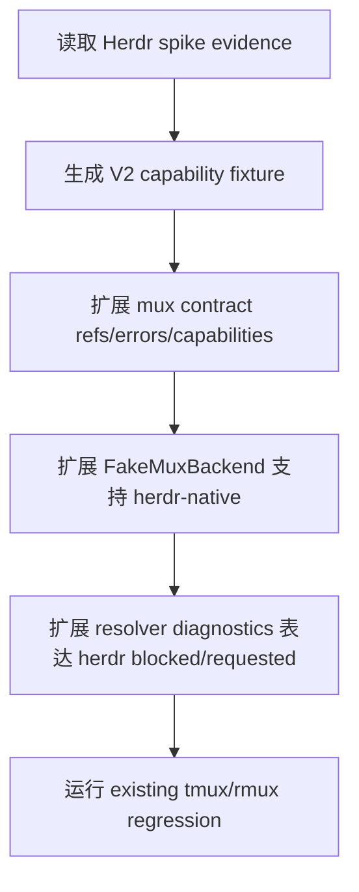

# mux-backend-contract-herdr-v2 feature design

## 0. 术语约定

| 术语 | 定义 | 防冲突结论 |
|---|---|---|
| Mux backend contract V2 | CCB caller 依赖的 backend-neutral namespace/pane/capability/error 小协议。 | 不是 Herdr socket client，也不是 ccbd namespace lifecycle 实现。 |
| `herdr-native` backend family | Herdr 在 CCB 内的独立 terminal backend family。 | Herdr 不得伪装为 `tmux-family`；需要 legacy 字段时只在 adapter boundary 投影。 |
| V2 refs | `MuxNamespaceRefV2` / `MuxPaneRefV2`，携带 backend family、impl、IPC ref、restore token 和 pane identity。 | 不要求 Herdr pane id 复刻 tmux `%N`。 |
| capability projection | backend 能力、Windows beta gaps、blocking gaps 的机器读结果。 | 不把 spike 的 `unknown` 自动当作 supported/workaround。 |
| schema-mismatch | Herdr API/schema 与 adapter 期望不一致的结构化错误。 | 属于 contract error category，不是普通 command failed。 |

仓库事实：

- `lib/terminal_runtime/mux_backend_contract.py` 当前 `BackendFamily = Literal["tmux-family"]`，`BackendImpl = Literal["tmux","psmux","rmux"]`，`MuxErrorCategory` 不含 `schema-mismatch`，`MuxCapabilities` 不含 `windows_beta_gaps`。
- `lib/terminal_runtime/fake_mux_backend.py` 已实现 backend-neutral fake，但默认 family 仍是 `tmux-family`，适合扩展成 V2 fake 覆盖 Herdr refs。
- `lib/terminal_runtime/backend_resolver.py` 当前 selection 只支持 `tmux|rmux|auto`，且 diagnostics family 固定 `tmux-family`。
- `lib/ccbd/services/project_namespace_state_runtime/models.py` 当前强制 namespace backend family 为 `tmux-family`，这说明本 feature 若改生产 state schema 会扩大范围；V2 contract 应先在 terminal_runtime 层和 fake tests 中站稳。
- `herdr-backend-contract-spike` design-review 已 passed；正式实现阶段必须消费其 evidence，但本 design 只定义 V2 contract 如何接收 spike 结论。

## 1. 决策与约束

### 需求摘要

本 feature 建立 CCB terminal runtime 的 mux backend contract V2，使调用层能以统一小协议表达 `tmux`、`rmux` 与未来 `herdr`。它要扩展 backend family/impl、namespace/pane refs、capabilities、structured errors 和 resolver diagnostics，使 Herdr 不再需要伪装成 tmux-family。实现阶段可以更新 contract 类型、fake backend、resolver diagnostics 与 focused tests，但不实现 production Herdr socket client，也不接入 ccbd namespace 或 provider runtime。

成功标准：

- `MuxNamespaceRefV2` 能表达 `backend_family="tmux-family"|"herdr-native"`、`backend_impl="tmux"|"psmux"|"rmux"|"herdr"`、`ipc_kind` 含 `herdr_socket`，并包含 optional `restore_token`。
- `MuxPaneRefV2` 能表达 Herdr pane refs，不要求 tmux `%N` 格式。
- `MuxCapabilitiesV2` 包含 `command_status`、`semantic_status`、`windows_beta_gaps`、`blocking_gaps`，并能 fail closed。
- `MuxCommandErrorV2` 包含 `schema-mismatch`，且 `backend_impl="herdr"` 时能携带 schema/operation evidence。
- fake backend 可用 `backend_impl="herdr"`、`backend_family="herdr-native"` 驱动 contract/state tests，不 mock Herdr JSON。
- resolver/diagnostics 能表示 Herdr requested/effective/failure，但默认 Linux/macOS/WSL 与现有 tmux/rmux 行为不变；真正 auto-select Herdr 仍依赖后续 capability feature。
- resolver failure diagnostics 必须携带 `platform_gate` / `capability_report_ref` / `failure_reason`，不能复用 rmux-only `invalid-request` 或 `capability-gap` 掩盖 Herdr blocked 事实。

明确不做：

- 不实现 `HerdrBackendClient`、socket API wrapper、schema parser 或 production Herdr adapter。
- 不改 provider runtime、ccbd namespace lifecycle、project namespace state 持久 schema 的生产语义。
- 不把 Herdr 设为默认 backend，不启用 `runtime.mux.backend=herdr` 的生产成功路线。
- 不发布 Windows support，不修改 package metadata、installer、doctor support tier。
- 不执行 git commit、push、tag、merge、release、publish、deploy 或 promotion。

### 方案深度 pre-pass

候选：

- 一次性实现 contract V2 + Herdr client + ccbd 接入。
- 只把 `BackendImpl` 加上 `herdr`，其它字段沿用 tmux-family。
- 本 feature 方案：先升级 backend-neutral V2 contract、fake/test 和 resolver diagnostics，生产 Herdr client 后续实现。

选择本 feature 方案。原因是 contract 是深模块边界，应先让 refs/capabilities/errors 可被调用层测试和讨论；直接实现 Herdr client 会把外部 schema 风险与 CCB 内部 contract 纠缠。只加 `herdr` enum 又会让 Herdr 伪装为 tmux-family，违反 roadmap §4.2/§4.3。

### Top 3 风险与缓解

1. **风险：Herdr 被 legacy `tmux-family` 路径吞掉。**  
   缓解：V2 明确 `herdr-native` family，legacy alias 只允许在 adapter boundary 测试中出现。
2. **风险：contract V2 改动过大，打破现有 tmux/rmux。**  
   缓解：保持 V1 兼容字段，新增 V2 字段 optional/parallel；CMD 覆盖现有 mux/backend selection tests。
3. **风险：capability unknown 被误判为可用。**  
   缓解：`unknown` 不进入 V2 supported；需要归类为 partial/unsupported/workaround 或 blocking gap。

### 非显然依赖与关键假设

- 依赖 `herdr-backend-contract-spike` 的 evidence 决定哪些 command/semantic status 可进入 V2 fixture；没有 pass/partial evidence 时 Herdr capability 必须 blocked。
- 假设后续 ccbd namespace lifecycle 会消费 V2 refs；本 feature只提供 contract/fake，不迁移 durable state。
- 假设 provider session payload 仍可保留 legacy `backend_family` 字段；Herdr-specific payload 兼容由后续 integration 处理。

## 2. 名词与编排

### 2.1 名词层

#### 现状

- 现有 `MuxBackend` 已按能力拆成 `NamespaceLifecycle`、`WindowLayout`、`PaneIO`、`PanePresentation`、`PaneLogging`、`DiagnosticsCapability`，这是正确的 deep-module 边界。
- 现有 refs/error/capabilities 以 tmux/rmux 为中心：family 单值、IPC kind 无 `herdr_socket`、error 无 `schema-mismatch`、capability 无 Windows beta gaps。
- resolver 当前把 `rmux` route approval、availability、capability 作为 policy；没有 Herdr requested/effective diagnostics。

#### 变化

新增或兼容扩展 V2 类型；实现可用同文件扩展或新 `mux_backend_contract_v2.py`，但 caller contract 必须单一来源。

```python
BackendFamilyV2 = Literal["tmux-family", "herdr-native"]
BackendImplV2 = Literal["tmux", "psmux", "rmux", "herdr"]
IpcKindV2 = Literal["unix_socket", "named_pipe", "socket_name", "socket_path", "herdr_socket", "tcp_loopback", "none"]
MuxErrorCategoryV2 = Literal["transient-unavailable", "unsupported", "not-found", "permission", "command-failed", "schema-mismatch"]

class MuxNamespaceRefV2(TypedDict):
    backend_family: BackendFamilyV2
    backend_impl: BackendImplV2
    namespace_id: str
    session_name: str
    ipc_kind: IpcKindV2
    ipc_ref: str
    restore_token: str | None

class MuxPaneRefV2(TypedDict):
    backend_impl: BackendImplV2
    pane_id: str
    session_name: str
    window_name: str | None
    agent_slug: str | None

class MuxCapabilitiesV2(TypedDict):
    backend_impl: BackendImplV2
    command_status: dict[str, Literal["supported", "partial", "unsupported", "workaround"]]
    semantic_status: dict[str, Literal["supported", "partial", "unsupported", "workaround"]]
    windows_beta_gaps: list[str]
    blocking_gaps: list[str]
    source_ref: str | None

HerdrFailureReasonV2 = Literal[
    "platform-gate-blocked",
    "herdr-capability-missing",
    "herdr-unavailable",
    "schema-mismatch",
    "unsupported-capability",
    "invalid-request",
]

class MuxBackendSelectionV2(TypedDict):
    backend_family: BackendFamilyV2
    backend_impl: BackendImplV2
    requested_backend: Literal["tmux", "rmux", "herdr", "auto"]
    effective_backend: BackendImplV2
    source: Literal["cli", "project_config", "user_config", "env", "platform_default", "auto_probe"]
    platform_gate: dict[str, object] | None
    fallback_used: bool
    fallback_reason: str | None
    capability_report_ref: str | None
    diagnostic: str

class MuxBackendSelectionFailureV2(TypedDict):
    backend_family: BackendFamilyV2
    requested_backend: Literal["tmux", "rmux", "herdr", "auto"]
    source: Literal["cli", "project_config", "user_config", "env", "platform_default", "auto_probe"]
    platform_gate: dict[str, object] | None
    failure_reason: HerdrFailureReasonV2
    capability_report_ref: str | None
    diagnostic: str
```

`socket_path` / `none` 只为现有 tmux/fake compatibility 保留；Herdr native success refs 必须使用 `ipc_kind="herdr_socket"` 或后续明确设计的 loopback IPC，不得用 `none` 表示成功连接。

##### Interface 设计检查

- Module：`terminal_runtime` mux backend contract，深模块边界。
- Interface：caller 只依赖 namespace/pane refs、capabilities 和 structured errors；不依赖 Herdr JSON、tmux argv 或 rmux CLI。
- Seam：Herdr JSON 与 schema drift 留在后续 adapter；V2 只定义 CCB 内部 contract。
- Depth / locality：deep。一次性封装 backend identity、capability、restore token 和 schema error。
- Dependency strategy：local-substitutable。fake backend 用 V2 refs 覆盖 caller 状态机；production Herdr 是后续 true external。
- Adapter：本 feature 不写 production adapter；fake/test adapter 是 contract fixture。
- Test surface：contract unit、fake backend state tests、resolver diagnostics tests、existing tmux/rmux regression tests。

### 2.2 编排层



流程级约束：

- Herdr capability 只能由 spike evidence 驱动；没有 evidence 时 `requested_backend="herdr"` 必须返回 `failure_reason="herdr-capability-missing"`，不得成功构造 production backend。
- `platform_gate.supported=false` 时 Herdr request 必须返回 `failure_reason="platform-gate-blocked"` 并携带 platform gate 摘要。
- Herdr unavailable 或 schema 不匹配必须分别返回 `herdr-unavailable` / `schema-mismatch`，不能复用 rmux-only `route-not-approved` 或泛化 `invalid-request`。
- Linux/macOS/WSL 默认路径不变；`auto` 没有 platform gate + capability evidence 时仍 fallback 现有 tmux/rmux 逻辑，不得产生 `effective_backend="herdr"`。
- V2 类型必须允许 legacy tmux/rmux refs 继续通过；迁移 ccbd durable state 属后续 child。
- `schema-mismatch` 只能用于外部 API/schema 不满足 adapter contract；不能滥用于普通命令失败。

### 2.3 挂载点清单

- `lib/terminal_runtime/mux_backend_contract.py` 或同层 V2 contract module：V2 refs、capability、error 类型。
- `lib/terminal_runtime/fake_mux_backend.py`：支持 `backend_family="herdr-native"` 与 `backend_impl="herdr"` 的 fake contract fixture。
- `lib/terminal_runtime/backend_resolver.py` / diagnostics：能表达 Herdr requested/blocked/failure，不改变默认 selection。
- `test/test_mux_backend_contract.py`：V2 contract、fake Herdr refs、schema-mismatch、capabilities coverage。
- `test/test_terminal_runtime_backend_selection.py`：Herdr route blocked/default unchanged regression。

### 2.4 推进策略

1. **V2 contract types**：扩展 backend family/impl/ipc/error/capability 类型，保持 V1 tmux/rmux 兼容。  
   退出信号：contract tests 断言 `tmux|psmux|rmux` 仍可用，`herdr-native/herdr/herdr_socket/schema-mismatch` 可表达。
2. **fake backend V2 fixture**：让 `FakeMuxBackend` 可构造 Herdr refs/capabilities/errors，不 mock Herdr JSON。  
   退出信号：fake Herdr backend 可 create session、split pane、send/capture/kill，并返回 Herdr-shaped refs。
3. **resolver diagnostics V2**：扩展 requested/failure diagnostics 表达 `herdr`、`auto_probe`、`platform_gate`、`capability_report_ref` 和 Herdr failure reason。  
   退出信号：显式 Herdr request 返回 structured blocked/failure；`auto` 和非 Windows默认仍走 tmux/rmux 现有逻辑，不产生 Herdr effective backend。
4. **capability projection from spike**：定义从上游 `herdr-contract-spike-evidence.json` 到 V2 capability fixture 的最小转换规则。  
   退出信号：缺 evidence、`adapter_recommendation=stop`、`blocking_gaps` 非空或 unknown 未归类时，Herdr selection/capability 必须 fail closed。
5. **scope and upstream evidence guard**：增加 core guard 检查 production Herdr client、provider runtime、ccbd durable state、package/doctor/support 越界，并检查上游 spike evidence 或 blocked fixture。  
   退出信号：guard 能检测禁止路径/内容，包括 staged rename/copy 到 `lib/terminal_runtime/herdr*` 的 production client/adapter/schema parser 形态，以及 doctor/support tier 投影文件；缺上游 evidence、`adapter_recommendation=stop`、`blocking_gaps` 非空或 `unknown` 未归类时，必须有 Herdr blocked fixture/result，不能出现 production success route。
6. **regression guard**：运行现有 tmux/rmux contract、backend selection、project namespace backend focused tests。  
   退出信号：现有 tests 通过；没有 provider runtime、ccbd state schema、package metadata 越界 diff。

### 2.5 结构健康度与微重构

##### 评估

- 文件级：`mux_backend_contract.py` 目前职责集中且不大，直接扩展 V2 类型可接受；如果类型膨胀明显，可新建 `mux_backend_contract_v2.py` 并从旧模块 re-export，保持调用方来源清晰。
- 文件级：`backend_resolver.py` 已有 rmux policy 细节，直接塞完整 Herdr policy 会变胖；本 feature 只加 blocked diagnostics / 类型表达，正式 policy 留给后续 backend client/capability gate。
- 目录级：`terminal_runtime` 已是 backend contract 和 adapters 所在目录，放置 V2 contract 合理。
- compound：当前无相关沉淀。

##### 结论：不做行为等价微重构

不先拆文件。实现中若 `backend_resolver.py` 因 Herdr policy 开始膨胀，应只记录后续 `cs-refactor` 候选，不在本 feature 扩范围。

## 3. 验收契约

### 3.1 关键场景清单

| ID | 输入 / 触发 | 期望可观察结果 | 证据类型 |
|---|---|---|---|
| AC-001 | 现有 tmux/rmux refs/tests | V1/V2 兼容，现有 tmux/rmux tests 不退化 | unit |
| AC-002 | Herdr namespace/pane refs | 可表达 `herdr-native`、`herdr`、`herdr_socket`、`restore_token`、非 tmux pane id | unit |
| AC-003 | Herdr capability with gaps | `windows_beta_gaps` / `blocking_gaps` 可表达，blocking gaps fail closed | unit |
| AC-004 | schema mismatch | `MuxCommandErrorV2` 支持 `schema-mismatch` 与 evidence | unit |
| AC-005 | Fake Herdr backend | fake 可驱动 create/split/send/capture/kill，不依赖 Herdr JSON | unit |
| AC-006 | explicit Herdr request without capability evidence | resolver diagnostics fail closed，failure_reason 为 `herdr-capability-missing`，不构造 production backend | unit |
| AC-007 | platform gate blocked / Herdr unavailable / schema mismatch | failure diagnostics 分别携带 `platform-gate-blocked`、`herdr-unavailable`、`schema-mismatch` 与 refs | unit |
| AC-008 | auto backend on non Windows / no Herdr evidence | 默认仍保持现有 tmux/rmux behavior，不产生 Herdr effective backend | unit |
| AC-009 | upstream spike evidence missing/stop/blocking gaps | capability projection fail closed，只允许 fake contract fixture，不允许 production success route | unit |
| AC-010 | production scope guard | 不改 provider runtime、ccbd durable state、package metadata、doctor support tier，不新增 production Herdr client | diff review |

### 3.2 明确不做的反向核对项

- 不应新增 production Herdr socket client。
- 不应让 `herdr` 成为 `tmux-family`。
- 不应让 `auto` 在无 spike/capability evidence 时选择 Herdr。
- 不应迁移 ccbd project namespace durable schema。
- 不应修改 provider completion 或 launch behavior。

### 3.3 Acceptance Coverage Matrix

| Scenario | Covered By Step | Evidence Type | Command / Action | Core? |
|---|---|---|---|---|
| AC-001 tmux/rmux compatibility | S1,S6 | unit | existing contract/backend tests | yes |
| AC-002 Herdr refs | S1,S2 | unit | new V2 contract tests | yes |
| AC-003 capabilities gaps | S1,S4 | unit | capability projection tests | yes |
| AC-004 schema mismatch | S1,S2 | unit | structured error tests | yes |
| AC-005 fake Herdr backend | S2 | unit | fake backend tests | yes |
| AC-006 explicit Herdr blocked | S3,S4 | unit | resolver diagnostics tests | yes |
| AC-007 platform/schema failures | S3,S4 | unit | failure diagnostics tests | yes |
| AC-008 auto unchanged | S3,S6 | unit | backend selection regression | yes |
| AC-009 upstream evidence guard | S4,S5 | unit | spike evidence guard tests | yes |
| AC-010 scope guard | S5,S6 | diff review | no production Herdr client/state/package diff | yes |

### 3.4 DoD Contract

| ID | 要求 | 证据 | 阻塞级别 |
|---|---|---|---|
| DOD-DESIGN-001 | design/checklist/review 完整，且对齐 roadmap item `mux-backend-contract-herdr-v2` | design review | blocking |
| DOD-IMPL-001 | V2 refs/capabilities/errors 能表达 Herdr native family，不破坏 tmux/rmux | unit | blocking |
| DOD-IMPL-002 | fake Herdr backend 支持 V2 refs 和 structured errors，不 mock Herdr JSON | unit | blocking |
| DOD-IMPL-003 | resolver diagnostics 对 Herdr request fail closed，auto/default 不变 | unit | blocking |
| DOD-IMPL-004 | `unknown` capability 不可进入 supported/workaround，blocking gaps 或缺上游 evidence 阻止 selection | unit | blocking |
| DOD-IMPL-005 | 无 production Herdr client、ccbd state migration、provider runtime、package/support 越界，且 guard 能检查路径和内容 | diff review | blocking |
| DOD-REVIEW-001 | code review passed 且无 unresolved blocking | review report | blocking |
| DOD-QA-001 | QA 复核 contract、fake、resolver、scope guard | QA report | blocking |
| DOD-ACCEPT-001 | acceptance 回写 roadmap item，并记录后续 `herdr-backend-client` 输入 | acceptance report | blocking |

Validation Commands:

| ID | 命令 | 目的 | 核心性 | 失败处理 |
|---|---|---|---|---|
| CMD-001 | `python ".codestable/tools/validate-yaml.py" --file ".codestable/features/2026-07-31-mux-backend-contract-herdr-v2/mux-backend-contract-herdr-v2-checklist.yaml" --yaml-only` | checklist YAML 合法性 | core | fix-or-block |
| CMD-002 | `python ".codestable/tools/validate-yaml.py" --file ".codestable/roadmap/windows-native-herdr-ccb/windows-native-herdr-ccb-items.yaml"` | roadmap items 回写合法性 | core | fix-or-block |
| CMD-003 | `python -m pytest -q test/test_mux_backend_contract.py test/test_terminal_runtime_backend_selection.py` | contract/resolver regression 与 V2 focused tests | core | fix-or-block |
| CMD-004 | `python -m pytest -q test/test_v2_project_namespace_backend.py` | existing namespace backend compatibility guard | core | fix-or-block |
| CMD-005 | `python -c "import re, subprocess; run=lambda a: subprocess.run(a,capture_output=True,text=True,check=True).stdout; collect=lambda a: run(a).splitlines(); paths={p.replace(chr(92),'/') for a in (['git','diff','--name-only'],['git','diff','--cached','--name-only','--diff-filter=ACMR'],['git','ls-files','--others','--exclude-standard']) for p in collect(a) if p.strip()}; forbidden_prefix=('lib/provider_backends/','lib/provider_runtime/','lib/ccbd/services/project_namespace_state_runtime/','lib/cli/services/doctor_runtime/'); forbidden_files={'package.json','package-lock.json','lib/cli/services/doctor.py','lib/cli/render_runtime/ops_views_doctor.py','lib/terminal_runtime/rmux_packaging_support.py'}; allowed_terminal={'lib/terminal_runtime/mux_backend_contract.py','lib/terminal_runtime/fake_mux_backend.py','lib/terminal_runtime/backend_resolver.py','lib/terminal_runtime/backend_selection.py'}; bad=sorted(p for p in paths if p.startswith(forbidden_prefix) or p in forbidden_files or (p.startswith('lib/terminal_runtime/herdr') and p not in allowed_terminal)); assert not bad, bad; text=run(['git','diff','--','lib','package.json'])+run(['git','diff','--cached','--','lib','package.json']); forbidden=re.compile(r'(class\s+Herdr.*(Client|Adapter|Schema)|def\s+.*herdr.*socket|socket[_-]?api|schema[_-]?parser|HerdrSocket|production Herdr adapter)', re.I); assert not forbidden.search(text)"` | production Herdr client / Herdr socket adapter/schema parser / provider / ccbd durable state / package / doctor support tier scope guard，覆盖 modified、staged rename/copy、staged content 与 untracked 路径 | core | fix-or-block |
| CMD-006 | `python -c "import json, pathlib; src=pathlib.Path('.codestable/features/2026-07-31-herdr-backend-contract-spike/evidence/herdr-contract-spike-evidence.json'); fixture=pathlib.Path('.codestable/features/2026-07-31-mux-backend-contract-herdr-v2/evidence/herdr-capability-blocked-fixture.json'); reasons={'herdr-capability-missing','platform-gate-blocked','unsupported-capability','schema-mismatch','herdr-unavailable'}; load=lambda p: json.loads(p.read_text(encoding='utf-8')); has_unknown=lambda m: any(v=='unknown' for v in (m or {}).values()); blocked_ok=lambda d: d.get('backend_impl')=='herdr' and (d.get('blocked') is True or d.get('effective_backend')!='herdr') and d.get('failure_reason') in reasons; d=load(src) if src.exists() else None; p=(d or {}).get('capability_projection') or {}; must_block=(not src.exists()) or (d or {}).get('adapter_recommendation')=='stop' or bool(p.get('blocking_gaps')) or has_unknown(p.get('command_status')) or has_unknown(p.get('semantic_status')); assert not must_block or blocked_ok(load(fixture))"` | upstream spike evidence guard；缺 evidence、stop、blocking gaps 或 unknown 未归类时 Herdr selection/capability 必须有 blocked fixture/result | core | fix-or-block |

Required Artifacts：design、checklist、design-review、V2 contract diff、fake backend tests、resolver diagnostics tests、upstream spike evidence guard、Herdr blocked fixture/result、scope guard、items.yaml 回写。

### 3.5 自我批判结论

- 可证伪性：每个 contract change 都有 unit/diff evidence。
- 步骤原子性：types、fake、resolver、capability projection、regression 分离。
- 最弱依赖：Herdr capability evidence 未通过时 resolver 必须 blocked；已写成 core scenario。
- 证据完整性：unit regression 和 diff guard 覆盖 compatibility 与 scope。
- 交付物可核验性：acceptance 可从 contract/fake/resolver tests 和 diff guard 反查。
- 清洁度规则：不新增临时 TODO/FIXME、调试输出、注释掉代码、无用 import；不记录外部 Herdr raw JSON 作为 production fixture。

## 4. 与项目级架构文档的关系

- 本 feature 是 `windows-native-herdr-ccb` 的第 3 个 child，消费 `herdr-backend-contract-spike` 的 design-ready 结果；实现阶段仍必须读取真实 spike evidence。
- 本 feature实现 roadmap §4.2/§4.3 的 contract 层，为后续 `herdr-backend-client` 提供内部 CCB contract。
- 若实现发现 ccbd durable state 必须同步迁移，应停止并回到 `cs-epic` 或新 child design，不在本 feature 中顺手改。
