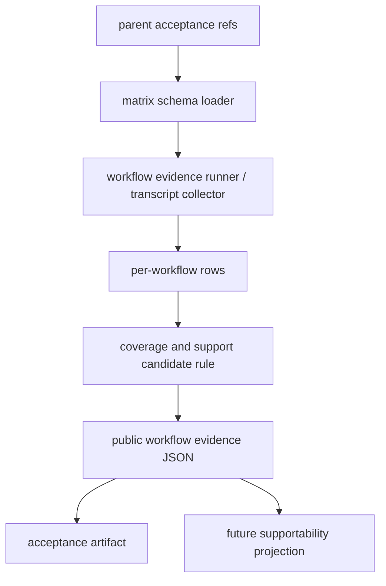

# native-windows-public-workflow-validation-matrix feature design

## 0. 术语约定

| 术语 | 定义 | 防冲突结论 |
|---|---|---|
| public workflow | roadmap 4.7 里要求验收的 CCB 用户可见工作流 key：`ccb`、`ask`、`pend`、`watch`、`ping`、`mounted`、`kill`、`restart`、`reload`、`foreground_attach`、`mobile_terminal`、`config_ui`、`doctor_update`、`support_projection`。 | 不是 provider completion 私有实现，也不是 support tier 发布授权。 |
| public provider workflow | 每个公开 provider 在 Herdr pane 下的 `ask`、`pend`、completion、cancel 四项证据。 | 不能用一个 provider 的成功代表所有 provider。 |
| validation matrix | 针对每个 workflow 记录 `pass | partial | blocked | failed | not-run`、证据路径、阻塞原因和复跑命令的机器可读矩阵。 | 不是 README/doctor 的最终 support projection；后续 `herdr-supportability-projection` 消费它。 |
| Native Windows x64 evidence | 来自专用真实 Windows x64 主机或明确标注 Windows runner 的 transcript / JSON / log；本项目当前所在机器就是目标验证主机。 | WSL/Linux 只能作为回归或 blocked evidence，不能替代真机证据。 |

仓库事实：

- `package.json` 的 `bin` 字段暴露 `ccb`、`ask`、`autonew`、`ctx-transfer`；public CLI 主入口在 `bin/ccb.js` / `bin/ccb-npm-runner.js`。
- `lib/cli/router.py` 公开 `kill`、`ping`、`pend --watch`、`update`、`doctor`、`restart`、`reload` 等命令口径。
- `lib/cli/phase2.py` 把 `kill`、`reload`、`restart`、`doctor`、`ping`、`watch` 等命令分发到 service 层。
- `lib/provider_core/registry.py::build_default_provider_manifests()` 是当前公开 provider catalog 的可执行入口；`include_optional=True, include_test_doubles=False` 才能覆盖公开 provider 并排除 test double。
- `README.md` 已包含 Mobile、Config UI、update、doctor 等用户可见入口，但当前没有 Native Windows public workflow matrix 的机器证据。
- parent item `windows-x64-release-surface` 与 `herdr-user-surfaces-parity` design-review 已 passed，但 items 仍是 `in-progress`；实现阶段仍要求依赖 done / acceptance evidence。

## 1. 决策与约束

### 需求摘要

本 feature 建立 Native Windows x64 public workflow validation matrix：用统一 schema 收集 CCB public workflows 在 Herdr backend + Windows x64 发布面上的 `pass | partial | blocked | failed | not-run` 证据，保证后续 supportability projection 可以从仓库事实判断 beta gaps、residual risks 和 support tier 候选。

成功标准：

- `WindowsHerdrPublicWorkflowEvidence` schema 固定 required workflow key set，不得少于 roadmap 4.7，并额外固定 all-provider workflow rows。
- 每个 workflow 都有独立 evidence row，能追踪到命令、transcript/log、host identity、backend identity、结果和失败原因。
- Codex/Claude/Gemini/Opencode 等当前公开 provider set 必须各自有 `ask`、`pend`、completion、cancel 行；任一 provider/workflow 非 pass 时 `support_projection_allowed=false`。
- Mobile terminal 与 Config UI 是 supported hard gate，degraded/partial 只能作为 blocked evidence。
- 当前 upstream / Windows host 不满足时允许 `blocked` 或 `not-run`，但不能把 WSL/Linux 或模拟 evidence 伪装成 Native Windows x64 pass。
- `support_tier="supported"` 只能作为 candidate evidence，且要求 required workflows 全 pass、无 blocking beta gaps；本 feature 不更新 README/doctor 为 supported。
- 不修改 provider completion owner、recovery owner、release publish/promotion、Mobile gateway 权限模型或 Config UI 功能语义。

明确不做：

- 不实现 Herdr backend 新能力，不修 provider runtime 行为。
- 不发布 npm、不打 tag、不 push、不 promotion。
- 不把 partial/blocked 工作流描述为 full support。
- 不用 WSL/Linux 替代 Native Windows x64 验收。
- 不把 supportability projection 写进 README/doctor；那是后续 child。

### 方案深度 pre-pass

候选方案：

1. 只写手工测试清单。
2. 写一份机器可读 evidence JSON + 手工 transcript 索引。
3. 在本 feature 中顺带更新 support tier projection。

选择第 2 个方案。理由：roadmap 需要 public workflow evidence 作为后续 supportability projection 的输入；只写清单不可被 acceptance 稳定复核，顺带更新 support tier 又会越过下一条 child 的边界。

### Top 3 风险与缓解

1. **风险：把模拟或 WSL evidence 当成 Native Windows x64 pass。**
   缓解：schema 强制记录 `os_platform`、`cpu_arch`、`host_evidence_ref` 和 `evidence_class`，acceptance 禁止替代。
2. **风险：workflow key 漏项或名字漂移。**
   缓解：required_workflows 固定为 roadmap 4.7 最低 key set，并用 schema/unit test 对照。
3. **风险：support tier 被提前宣称。**
   缓解：matrix 只产出 candidate evidence；README/doctor supported claim 由后续 `herdr-supportability-projection` 处理。

### 非显然依赖与关键假设

- 依赖 `windows-x64-release-surface` 的 release/source/update diagnostic 契约；缺 acceptance evidence 时本 feature 只能设计 blocked/default evidence。
- 依赖 `herdr-user-surfaces-parity` 的 foreground attach、Mobile terminal、Config UI、doctor/ping/mounted/project view 口径；缺 acceptance evidence 时相关 workflows 只能 `blocked` 或 `not-run`。
- 假设现有 CLI service 层可以通过测试 harness 或 transcript 捕获每个 workflow 的 JSON/文本证据，不需要改业务命令语义。

## 2. 名词与编排

### 2.1 名词层

#### 现状

- roadmap 4.7 已定义 `WindowsHerdrPublicWorkflowEvidence`，但仓库中没有落地的 matrix schema 或 evidence artifact。
- CLI public workflow 分散在 `lib/cli/router.py`、`lib/cli/phase2.py`、`lib/cli/services/*`、README 和 docs 中。
- 既有测试通常按命令或 service 粒度验证，缺少一份跨 workflow 的 Windows Herdr evidence index。

#### 变化

新增 public workflow evidence owner，建议落在 `lib/terminal_runtime/windows_herdr_public_workflow_matrix.py` 或同等 validation/runtime 层。放在 `terminal_runtime` 只用于承接 Windows/Herdr terminal evidence，不表示 CLI service ownership 迁移。

```python
RequiredWorkflow = Literal[
    "ccb", "ask", "pend", "watch", "ping", "mounted", "kill",
    "restart", "reload", "foreground_attach", "mobile_terminal",
    "config_ui", "doctor_update", "support_projection",
]
ProviderWorkflow = Literal["ask", "pend", "completion", "cancel"]
WorkflowStatus = Literal["pass", "partial", "blocked", "failed", "not-run"]

class WindowsHerdrWorkflowRow(TypedDict):
    workflow: RequiredWorkflow
    status: WorkflowStatus
    evidence_class: Literal["native-windows", "windows-runner", "blocked-evidence", "unit", "regression"]
    command: str | None
    artifact_ref: str | None
    host_evidence_ref: str | None
    backend_impl: Literal["herdr"]
    os_platform: Literal["win32"]
    cpu_arch: Literal["x64"]
    reason: str | None
    beta_gap: str | None
    residual_risk: str | None

class WindowsHerdrProviderWorkflowRow(TypedDict):
    provider: str
    workflow: ProviderWorkflow
    status: WorkflowStatus
    evidence_class: Literal["native-windows", "windows-runner", "blocked-evidence"]
    command: str | None
    artifact_ref: str | None
    host_evidence_ref: str | None
    backend_impl: Literal["herdr"]
    pane_ref: str | None
    reason: str | None
    beta_gap: str | None
    residual_risk: str | None

class WindowsHerdrPublicWorkflowEvidence(TypedDict):
    schema_version: Literal[1]
    backend_impl: Literal["herdr"]
    os_platform: Literal["win32"]
    cpu_arch: Literal["x64"]
    ccb_version: Literal["8.5.2"]
    ccb_source_status: Literal["strict-v8.5.2", "blocked", "unknown"]
    herdr_version: str
    herdr_auto_restore_mode: Literal["disabled", "observe-only", "unsupported", "unknown"]
    baseline_ref: str | None
    release_surface_ref: str | None
    user_surfaces_ref: str | None
    public_providers: list[str]
    required_workflows: list[RequiredWorkflow]
    workflows: dict[str, WorkflowStatus]
    workflow_rows: dict[str, WindowsHerdrWorkflowRow]
    provider_workflows: list[ProviderWorkflow]
    provider_workflow_rows: dict[str, dict[ProviderWorkflow, WorkflowStatus]]
    provider_workflow_detail_rows: dict[str, WindowsHerdrProviderWorkflowRow]
    mobile_terminal_status: WorkflowStatus
    config_ui_status: WorkflowStatus
    windows_npm_install_dry_run_status: WorkflowStatus
    beta_gaps: tuple[str, ...]
    residual_risks: tuple[str, ...]
    artifacts: dict[str, str]
    support_tier: Literal["unsupported", "experimental", "beta", "supported"]
    support_tier_is_candidate: bool
    support_projection_allowed: bool
```

约束：

- `required_workflows` 必须按 roadmap 4.7 使用 `list[RequiredWorkflow]`；`RequiredWorkflow` 是 roadmap key set 的 `Literal[...]`，允许通过更新 alias 追加 key，但不得弱化为任意 `str` 或删减既有 key。
- `public_providers` 必须来自当前公开 provider catalog：默认调用 `lib/provider_core/registry.py::build_default_provider_manifests(include_optional=True, include_test_doubles=False)`，并在 acceptance artifact 中归档当次冻结清单；如实现选择直接消费 `CORE_PROVIDER_NAMES + OPTIONAL_PROVIDER_NAMES`，也必须证明排除了 `TEST_DOUBLE_PROVIDER_NAMES`。
- `provider_workflows` 固定为 `ask|pend|completion|cancel`。
- `provider_workflow_rows` 必须保留 roadmap 4.7 的 summary 形状：`provider_workflow_rows[provider][workflow] = status`。`provider_workflow_detail_rows` 的 key 为 `{provider}:{workflow}`，承载 command、artifact、pane、reason、beta gap 等详细证据；必须满足每个 `public_providers` × `provider_workflows` 组合在 summary 与 detail 中同时存在，detail row 的 provider/workflow 与 key 一致，且 summary status 等于 detail row status。
- `backend_impl`、`os_platform`、`cpu_arch`、`ccb_version`、`ccb_source_status`、`herdr_version`、`herdr_auto_restore_mode`、`workflows`、`artifacts` 和 `support_tier` 是 roadmap 4.7 顶层契约字段，必须保留；`workflow_rows` 和 `provider_workflow_detail_rows` 只作为详细证据扩展字段，不替代顶层 `workflows` 与 `provider_workflow_rows` 状态摘要。
- `set(required_workflows) == set(workflows) == set(workflow_rows)`；每个 `workflow_rows[k]["workflow"] == k`，避免顶层状态摘要与详细证据 row 漂移。
- `ccb_version` 按 roadmap 目标固定为 `Literal["8.5.2"]`；当前 package/version 不匹配时生成 blocked/not-run skeleton，不放宽该顶层契约。
- `ccb_source_status` 只能在 strict `v8.5.2` 源头/新分支 admission evidence 存在时为 `strict-v8.5.2`；否则必须为 `blocked` 或 `unknown`，并阻塞 supported candidate。
- `herdr_auto_restore_mode` 只能在 Herdr auto restore 可证明 disabled 时为 `disabled`；`observe-only`、`unsupported` 或 `unknown` 均阻塞 supported candidate。
- `support_tier` 是 roadmap 4.7 的硬契约字段，不得重命名；本 feature 产出的值仍是 candidate evidence，必须用 `support_tier_is_candidate=true` 标明不是最终 README/doctor support claim。
- `support_projection_allowed=true` 与 candidate `support_tier="supported"` 只在全部 required workflow `pass`、全部 provider workflow rows `pass`、`mobile_terminal_status="pass"`、`config_ui_status="pass"`、`windows_npm_install_dry_run_status="pass"`、`ccb_source_status="strict-v8.5.2"`、`herdr_auto_restore_mode="disabled"` 且 `beta_gaps` 为空时允许。
- `partial` / `blocked` / `failed` / `not-run` 必须携带 `reason`，不能只靠 transcript 人读判断；`not-run` 至少要说明是缺 host、parent 未 accepted、依赖未过、用户未执行还是证据漏填。
- `artifact_ref` 指向仓库内 transcript、JSON、snapshot 或 blocked evidence；外部路径必须复制/归档到 acceptance artifact。
- 稳定 artifact 路径建议使用 `.codestable/features/2026-07-31-native-windows-public-workflow-validation-matrix/evidence/windows-herdr-public-workflow-matrix.json`、`.../evidence/native-windows-transcript.md`、`.../evidence/provider-workflows-transcript.md`、`.../evidence/blocked-evidence.md` 和 `.../evidence/public-providers-freeze.json`；acceptance 只能引用这些仓库内归档路径或同目录明确命名的补充 artifact。
- `support_projection` workflow 只证明“后续 projection 可消费 matrix”，不在本 feature 写 README/doctor supported 文案。
- `mounted` 不是独立 CLI subcommand；其 public workflow row 的 canonical command 是 `ccb ping all`，artifact 可以补充 project view / `doctor --output` 里的 mounted-state projection。实现不得新增 `ccb mounted` 来满足 matrix，除非 roadmap 另行变更。

##### Interface 设计检查

- Module：Windows Herdr public workflow evidence matrix owner。
- Interface：caller 只提交 workflow row / transcript refs，matrix owner 负责 schema 校验、required key coverage 和 support candidate rule。
- Seam：CLI/service/README/docs 不各自判断 support tier；后续 supportability projection 消费同一 matrix。
- Depth / locality：深。否则 support evidence 会散在手工记录、doctor、README 和各测试里。
- Dependency strategy：local-substitutable。unit 可用 fake rows 覆盖 pass/partial/blocked/failed/not-run，manual transcript 只作为 evidence artifact。

### 2.2 编排层



流程级约束：

- 实现前先检查 parent acceptance refs；缺失时只能生成 blocked matrix，不执行或宣称 pass。
- parent acceptance refs 的机器判定固定为：从 roadmap items 的当前 item `depends_on` 解析每个 parent slug，再读取 parent item 的 `feature` 指针；每个 parent feature 目录必须存在 `{parent-slug}-acceptance.md`，frontmatter 为 `doc_type: feature-acceptance` 且 `status: passed`，正文或 frontmatter 必须记录可引用 artifact refs。任一 parent 缺失、仍 `in-progress`、无 acceptance 或 artifact refs 缺失时，本 feature 只能生成 blocked/not-run skeleton。
- workflow row 先按 required key 建空 skeleton，再逐项填 evidence，避免漏 key。
- matrix 生成必须 deterministic；相同 rows 产生相同 JSON。
- support tier candidate rule 是纯函数；不得读取 README/doctor 文案反推结果。
- 真机 transcript 与 unit/regression evidence 必须分层：unit 证明 schema/rule，transcript 证明 Native Windows runtime；专用 Native Windows x64 主机是当前项目机器。

### 2.3 挂载点

- `lib/terminal_runtime/windows_herdr_public_workflow_matrix.py`：matrix schema、coverage、candidate rule owner。
- `test/test_windows_herdr_public_workflow_matrix.py`：schema、required key、candidate rule、blocked evidence 单测。
- `docs/ccbd-diagnostics-contract.md` 或 acceptance artifact：matrix JSON 字段说明与 transcript 索引。
- `.codestable/features/.../{slug}-acceptance.md`：最终 evidence refs、manual transcript refs 和 roadmap 回写。

### 2.4 推进策略

1. **schema and required keys**：落地 matrix schema、required workflow key set、roadmap 顶层 support gate 字段、provider summary/detail rows 和 deterministic JSON writer。
   退出信号：unit test 证明 required key 全覆盖，缺 key / 未知状态 / 缺 reason 的 partial/blocked/failed/not-run 均 fail closed；`required_workflows`、`workflows`、`workflow_rows` key set 等价且 row 自身 workflow 与 dict key 一致；roadmap 顶层 `ccb_source_status`、`herdr_auto_restore_mode`、`provider_workflow_rows` summary shape 保留；`provider_workflow_detail_rows` 与 summary key/status 一致。
2. **parent admission and blocked skeleton**：读取 parent item/acceptance refs，缺失时生成 blocked/not-run skeleton。
   退出信号：当前 parent 仍 in-progress 时不会执行 pass claim，只输出 blocked evidence。
3. **workflow row adapters**：为 `ccb`、`watch`、`ping`、`mounted`、`kill`、`restart`、`reload`、foreground attach、Mobile terminal、Config UI、doctor/update、support projection candidate 建 row 填充边界，并为所有公开 provider × `ask/pend/completion/cancel` 建 provider summary/detail row。
   退出信号：每个 key 都能从命令/transcript/ref 或 blocked reason 生成一行；公开 provider set 从 `build_default_provider_manifests(include_optional=True, include_test_doubles=False)` 或 `CORE_PROVIDER_NAMES + OPTIONAL_PROVIDER_NAMES` 恢复并归档 freeze artifact；`mounted` 使用 `ccb ping all` 为 canonical command，project view / `doctor --output` mounted-state projection 可作为补充 artifact；`watch` 使用 `ccb pend --watch <target>` 为 canonical transcript，`ccb watch <target>` 作为 compatibility evidence。
4. **support tier candidate rule**：保留 roadmap 字段 `support_tier`，并实现 `support_tier_is_candidate` / `support_projection_allowed` 纯规则。
   退出信号：required workflows、所有 provider workflow rows、Mobile terminal、Config UI、Windows npm install dry-run、`ccb_source_status="strict-v8.5.2"`、`herdr_auto_restore_mode="disabled"` 全部 pass/满足且无 beta gap 才能 candidate `support_tier="supported"`；partial/blocked/failed/not-run、source blocked/unknown 或 auto restore 非 disabled 不会被升级；matrix 明确 `support_tier_is_candidate=true`，不产生 README/doctor final support claim。
5. **Native Windows transcript plan**：定义真机 transcript 捕获格式和 artifact refs。
   退出信号：manual command list、必填字段、pass/blocked 编码与 evidence copy path 固定；matrix JSON、provider freeze、native transcript、provider transcript 与 blocked evidence 归档到本 feature `evidence/` 目录；缺 host、Herdr 或任一公开 provider 时 acceptance 只能写 blocked evidence。
6. **docs/diagnostics contract delta**：只记录 matrix 字段与 artifact 读取方式，不发布 supported 文案。
   退出信号：docs contract 能解释 matrix JSON 和 `doctor --output` 如何展示 blocked/beta evidence，但不宣称 full support。
7. **regression and scope guard**：确认非 Windows/WSL、release surface、user surfaces、provider completion/recovery owner 不被改写。
   退出信号：scope guard 与相关 regression 通过。

### 2.5 结构健康度与微重构

##### 评估

- 文件级：CLI service 文件已多，matrix 逻辑若塞进 `doctor.py` 或 `router.py` 会扩大职责。
- 目录级：`terminal_runtime` 已承接 Windows/Rmux projection 类 evidence；新增独立 matrix owner 比散入 service 层更清晰。
- 测试级：需要一个 focused matrix test，避免把真机 transcript 测试和 schema rule 混在一起。

##### 结论：不做行为等价微重构

本 feature 新增独立 matrix owner 和 focused test，不先重组 CLI/service 目录；如果实现发现 doctor projection 层需要长期消费该 matrix，留给后续 supportability projection 或 refactor 处理。

## 3. 验收契约

### 3.1 关键场景清单

| ID | 输入 / 触发 | 期望可观察结果 | 证据类型 |
|---|---|---|---|
| AC-001 | required workflow key set | 包含 roadmap 4.7 全部 key，缺 key fail closed | unit |
| AC-002 | partial/blocked/failed/not-run row 缺 reason | schema 校验失败 | unit |
| AC-003 | parent acceptance refs 缺失或未 passed | 生成 blocked/not-run skeleton，不执行 pass claim | unit |
| AC-004 | 全部 workflow、所有公开 provider ask/pend/completion/cancel、Mobile terminal、Config UI、Windows npm install dry-run pass、`ccb_source_status="strict-v8.5.2"`、`herdr_auto_restore_mode="disabled"` 且无 beta gap | `support_projection_allowed=true`，`support_tier` candidate 可为 `supported`，且 `support_tier_is_candidate=true` | unit |
| AC-005 | 任一 workflow partial/blocked/failed/not-run | `support_tier` candidate 不能是 `supported`，且 beta/residual risk 可追踪 | unit |
| AC-006 | Native Windows transcript | matrix row 引用真实 Windows x64 artifact refs | manual transcript |
| AC-007 | WSL/Linux evidence | 不能替代 Native Windows pass，只能作为 regression 或 blocked evidence | unit/diff review |
| AC-008 | docs/doctor contract | 只说明 matrix/artifact，不宣称 full support | docs/scope guard |
| AC-009 | cleanup/scope | 不修改 provider completion、recovery owner、publish/promotion | diff review |
| AC-010 | `mounted` workflow | row.command 使用 `ccb ping all`，project view / doctor mounted-state 只能作为补充 artifact，不新增 `ccb mounted` | unit/CLI |
| AC-011 | docs contract 旧命令 | `docs/ccbd-diagnostics-contract.md` 不再把 `doctor --bundle` 作为当前公开命令，只允许 deprecated/unsupported 语境 | docs guard |
| AC-012 | all-provider matrix | 每个公开 provider × `ask/pend/completion/cancel` 都有 row；任一缺失或非 pass 时 `support_projection_allowed=false` | unit/manual |
| AC-013 | Mobile/Config hard gate | `mobile_terminal_status` 与 `config_ui_status` 均需 pass；partial/degraded/blocked 不允许 candidate supported | unit/manual |
| AC-014 | source/recovery hard gate | `ccb_source_status!="strict-v8.5.2"` 或 `herdr_auto_restore_mode!="disabled"` 时 `support_projection_allowed=false`，candidate `support_tier` 不能是 `supported` | unit |
| AC-015 | provider summary/detail shape | `provider_workflow_rows` 保持 roadmap summary 形状，`provider_workflow_detail_rows` 提供详细 evidence，二者 provider/workflow/status 一致 | unit |

### 3.2 明确不做的反向核对项

- 不把 matrix 中的 `support_tier` candidate evidence 写成 README/doctor final support claim。
- 不删除 roadmap 4.7 required workflow key。
- 不用 WSL/Linux evidence 冒充 Native Windows pass。
- 不修改 provider completion 或 recovery owner。

### 3.3 Acceptance Coverage Matrix

| Scenario | Covered By Step | Evidence Type | Command / Action | Core? |
|---|---|---|---|---|
| AC-001 required keys | S1 | unit | matrix schema tests | yes |
| AC-002 row reason | S1 | unit | schema negative tests | yes |
| AC-003 blocked skeleton | S2 | unit | parent admission tests | yes |
| AC-004 all pass candidate | S4 | unit | candidate rule tests | yes |
| AC-005 partial/blocked/failed/not-run candidate | S4 | unit | candidate rule negative tests | yes |
| AC-006 native transcript | S5 | manual | Native Windows x64 transcript | yes |
| AC-007 WSL/Linux separation | S5,S7 | unit/diff | evidence_class tests + scope guard | yes |
| AC-008 docs/doctor contract | S6 | docs | docs guard | yes |
| AC-009 scope | S7 | diff | scope guard | yes |
| AC-010 mounted workflow mapping | S3 | unit/CLI | row adapter tests | yes |
| AC-011 doctor bundle cleanup | S6 | docs | docs guard | yes |
| AC-012 all-provider matrix | S3,S4,S5 | unit/manual | provider row coverage tests + Native Windows provider transcripts | yes |
| AC-013 Mobile/Config hard gate | S3,S4,S5 | unit/manual | matrix hard gate tests + UI transcript | yes |
| AC-014 source/recovery hard gate | S1,S4 | unit | source status + auto restore candidate rule tests | yes |
| AC-015 provider summary/detail shape | S1,S3 | unit | provider summary/detail shape consistency tests | yes |

### 3.4 DoD Contract

| ID | 要求 | 证据 | 阻塞级别 |
|---|---|---|---|
| DOD-DESIGN-001 | design/checklist/review 完整，且对齐 roadmap item | design review | blocking |
| DOD-IMPL-001 | matrix schema 与 required workflow key set 固定，缺 key fail closed | unit | blocking |
| DOD-IMPL-002 | partial/blocked/failed/not-run 语义可证伪，失败原因可追踪 | unit | blocking |
| DOD-IMPL-003 | parent admission 缺失时只生成 blocked evidence，不宣称 pass | unit | blocking |
| DOD-IMPL-004 | 保留 roadmap 字段 `support_tier`、`ccb_source_status`、`herdr_auto_restore_mode`，candidate rule 不把 partial/blocked/failed/not-run、source blocked/unknown 或 auto restore 非 disabled 升级为 supported，且用 `support_tier_is_candidate` 标明非最终宣称 | unit | blocking |
| DOD-IMPL-005 | Native Windows transcript refs 与 WSL/Linux regression evidence 分离 | manual/unit | blocking |
| DOD-IMPL-006 | 不修改 provider completion、recovery owner、publish/promotion、final support claim | diff review | blocking |
| DOD-IMPL-007 | `mounted` workflow 不新增伪命令；canonical command 为 `ccb ping all`，project view / doctor mounted-state projection 只作补充 artifact | unit/CLI | blocking |
| DOD-IMPL-008 | parent admission 从 roadmap `depends_on -> feature -> {slug}-acceptance.md` passed frontmatter 与 artifact refs 恢复，不把 design-review passed 当 implementation-ready | unit | blocking |
| DOD-IMPL-009 | all-provider `ask/pend/completion/cancel` rows 完整；`provider_workflow_rows` 保持 roadmap summary 形状，`provider_workflow_detail_rows` 保存详细 evidence；任一 provider/workflow 非 pass 阻塞 supported candidate | unit/manual | blocking |
| DOD-IMPL-010 | Mobile terminal、Config UI 与 Windows npm install dry-run 均为 supported hard gate | unit/manual | blocking |
| DOD-IMPL-011 | 公开 provider set 从 `build_default_provider_manifests(include_optional=True, include_test_doubles=False)` 或 `CORE_PROVIDER_NAMES + OPTIONAL_PROVIDER_NAMES` 恢复，并归档冻结清单 | unit/acceptance artifact | blocking |
| DOD-REVIEW-001 | code review passed 且无 unresolved blocking | review report | blocking |
| DOD-QA-001 | QA 覆盖 schema、candidate rule、blocked skeleton、docs/scope guard | QA report | blocking |
| DOD-ACCEPT-001 | acceptance 回写 roadmap item，并保留 matrix JSON 与 transcript refs | acceptance report | blocking |

Validation Commands:

| ID | 命令 | 目的 | 核心性 | 失败处理 |
|---|---|---|---|---|
| CMD-001 | `python ".codestable/tools/validate-yaml.py" --file ".codestable/features/2026-07-31-native-windows-public-workflow-validation-matrix/native-windows-public-workflow-validation-matrix-checklist.yaml" --yaml-only` | checklist YAML 合法性 | core | fix-or-block |
| CMD-002 | `python ".codestable/tools/validate-yaml.py" --file ".codestable/roadmap/windows-native-herdr-ccb/windows-native-herdr-ccb-items.yaml"` | roadmap items 回写合法性 | core | fix-or-block |
| CMD-003 | `python -m pytest -q test/test_windows_herdr_public_workflow_matrix.py` | matrix schema、required key、key-set equality、row-key consistency、provider summary/detail shape consistency、public provider catalog freeze、candidate rule、source/auto-restore hard gate、blocked skeleton 单测 | core | fix-or-block |
| CMD-004 | `python -m pytest -q test/test_windows_herdr_public_workflow_matrix.py -k "parent_admission or blocked_skeleton"` | 可执行 parent admission verifier：缺 parent acceptance refs 时断言 blocked skeleton；有 refs 时只读取 parent acceptance 中记录的 artifact/command refs，不把 parent-owned release-surface/user-surface 测试变成本 feature owned tests | core | fix-or-block |
| CMD-005 | `python -c 'import pathlib,re,subprocess; roots=("lib","test","docs","README.md"); run=lambda a: subprocess.run(a,capture_output=True,text=True,check=True).stdout; text=run(["git","diff","--",*roots])+run(["git","diff","--cached","--",*roots]); untracked=run(["git","ls-files","--others","--exclude-standard","--",*roots]).splitlines(); text+="".join(pathlib.Path(p).read_text(encoding="utf-8",errors="ignore") for p in untracked if pathlib.Path(p).is_file()); lower=text.lower(); forbidden=(r"npm\s+publish",r"git\s+push",r"git\s+tag",r"windows\s+x64\s+(is\s+)?(fully\s+|stable\s+)?supported",r"provider[\s_-]+completion",r"recovery[\s_-]+owner"); hits=[p for p in forbidden if re.search(p,lower)]; docs_claim=[line for line in lower.splitlines() if re.search(r"support_tier\s*[:=].*supported",line) and "support_tier_is_candidate" not in line and "candidate" not in line]; assert not hits and not docs_claim, {"forbidden": hits, "docs_claim": docs_claim[:5], "untracked": untracked[:10]}'` | scope guard：扫描 tracked diff、staged diff 和未跟踪 `lib/test/docs/README.md` 内容；禁止发布、push、README/docs/doctor final supported claim、provider completion/recovery owner 越界；允许 matrix/fixture/acceptance 里带 `support_tier_is_candidate=true` 的合法 candidate evidence | core | fix-or-block |
| CMD-006 | `MANUAL-ACTION .codestable/features/2026-07-31-native-windows-public-workflow-validation-matrix/evidence/native-windows-transcript.md and provider-workflows-transcript.md: capture ccb/watch/ping/mounted/kill/restart/reload/foreground attach/Mobile terminal/Config UI/doctor/update transcript, code-level npm install dry-run evidence, and per-public-provider ask/pend/completion/cancel transcripts; archive matrix refs in evidence/windows-herdr-public-workflow-matrix.json` | 真实 workflow evidence；这是人工验收动作，必须记录 artifact path、host identity、Herdr version、public provider freeze、pass/blocked 编码和失败原因 | core | blocked-if-no-host-or-herdr-or-any-provider-missing |
| CMD-007 | `python -c "import pathlib,re; p=pathlib.Path('docs/ccbd-diagnostics-contract.md'); bad=[(i+1,line.rstrip()) for i,line in enumerate(p.read_text(encoding='utf-8').splitlines()) if 'doctor --bundle' in line.lower() and not re.search(r'deprecated|unsupported|no longer supported|not supported', line, re.I)]; assert not bad,bad"` | docs contract 旧 `doctor --bundle` 口径清理；当前公开命令必须是 `doctor --output` | core | fix-or-block |

Required Artifacts：

- design、checklist、design-review
- `WindowsHerdrPublicWorkflowEvidence` schema owner
- required workflow key tests
- candidate support rule tests
- all-provider workflow row coverage tests
- Mobile/Config hard gate tests
- source status / Herdr auto restore hard gate tests
- provider workflow summary/detail shape consistency tests
- public provider catalog freeze artifact
- Windows npm install dry-run evidence row
- blocked skeleton tests
- mounted workflow row adapter tests
- `.codestable/features/2026-07-31-native-windows-public-workflow-validation-matrix/evidence/windows-herdr-public-workflow-matrix.json`
- `.codestable/features/2026-07-31-native-windows-public-workflow-validation-matrix/evidence/native-windows-transcript.md` 或 `blocked-evidence.md`
- `.codestable/features/2026-07-31-native-windows-public-workflow-validation-matrix/evidence/provider-workflows-transcript.md`
- docs/diagnostics contract delta
- roadmap items.yaml 回写

### 3.5 自我批判结论

- 可证伪性：每个 workflow row 都有 status、reason、artifact_ref 和 evidence_class。
- 步骤原子性：schema、admission、row adapter、candidate rule、transcript、docs、scope guard 分开。
- 最弱依赖：Native Windows host 与 parent acceptance refs；已单独写 blocked path。
- 证据完整性：unit 证明规则，manual transcript 证明真机，diff guard 防止越界。
- 基线可执行性：新增 tests 是 future implementation 交付物；design 阶段只跑 YAML。
- 交付物可核验性：acceptance 可从 matrix JSON、transcript refs、docs delta 和 roadmap items 反查。
- 清洁度覆盖：禁止临时 TODO/FIXME、调试输出、注释掉代码、无用 import；scope guard 禁止 supported claim。

## 4. 与项目级架构文档的关系

- 本 feature 是 `windows-native-herdr-ccb` 的第 10 个 child，承接 roadmap 4.7 Public Workflow Evidence。
- 本 feature 只产出 validation matrix，不做最终 supportability projection。
- 后续 `herdr-supportability-projection` 才能把 matrix 投影到 README/docs/doctor/support tier。
