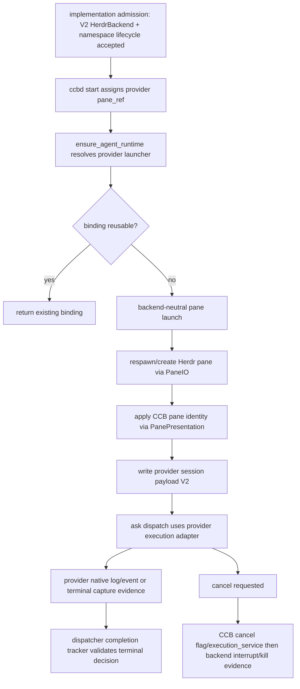

# provider-runtime-on-herdr feature design

## 0. 术语约定

| 术语 | 定义 | 防冲突结论 |
|---|---|---|
| Provider runtime on Herdr | CCB 托管的 Codex/Claude/Gemini/Opencode 等 provider 进程运行在 Herdr pane 中。 | 不是 Herdr agent 自己接管 provider state，也不是把 CCB 改成 Herdr 插件。 |
| ProviderRuntimeBackendRef | provider launch/session 文件中记录的 backend-neutral runtime ref，包含 provider、agent、namespace_ref、pane_ref、managed_home 和 completion_source。 | 继承 roadmap §4.5；不能退回只保存 `%pane` / `tmux_session`。 |
| CCB provider authority | provider 私有 HOME、auth、session binding、managed memory、completion/cancellation/job terminal verdict 仍由 CCB 现有 provider backend 与 dispatcher runtime 决定。 | Herdr 只提供 terminal primitive/evidence。 |
| completion_source | CCB 选择完成判定输入的来源：provider native log/event、provider event stream 或 terminal capture fallback。 | Herdr agent state 不在枚举内；只能进入 diagnostics evidence。 |
| terminal capture fallback | Provider native completion 不可用时，使用 PaneIO capture / pane log 辅助观察。 | 只能按 provider manifest / execution design 降级，不能单独给出高置信 `completed`。 |
| Herdr agent state evidence | Herdr 暴露的 agent/pane 状态观察。 | 只能写入 `herdr_agent_state_ref` 或 diagnostics；不得单独产生 `completed` verdict。 |

仓库事实：

- `lib/cli/services/runtime_launch_runtime/ensure.py` 仍以 `_require_runtime_launch_tools()` 检查 `tmux`，错误文本为 `tmux is required for pane-backed {provider} launch`；这会阻塞 Herdr pane-backed provider launch。
- `lib/cli/services/runtime_launch_runtime/tmux_runtime.py` / `tmux_panes.py` 的入口名和行为仍假设 tmux：`launch_tmux_runtime()`、`launch_pane()`、`prepare_detached_tmux_server()`、`pane_meets_minimum_size()`、`best_effort_kill_tmux_pane()`、`apply_ccb_pane_identity()` 均以 string pane id 或 tmux runner 为中心。
- `lib/cli/services/runtime_launch_runtime/session_files.py` 已通过 `build_mux_session_payload()` 写 `terminal="mux"`、`backend_family`、`backend_impl`、`pane_ref`、`namespace_ref`，但默认值仍是 `tmux-family/tmux`，且没有 managed_home / completion_source 的统一 provider runtime ref。
- `lib/provider_runtime/session_payload.py` 已有 `MuxSessionView`、`mux_session_env()`、`project_session_payload()`、`session_uses_tmux_compatible_pane()`；这是 Herdr session payload 兼容的主要入口。
- `lib/terminal_runtime/backend_selection.py::get_backend_for_session()` 只识别 `tmux/psmux/rmux`，未知 backend 默认构造 tmux backend；Herdr session 文件若走这里会误回 tmux。
- `lib/provider_backends/pane_log_support/lifecycle.py` 和 `lifecycle_common.py` 仍用 tmux ownership/rebound/pane log helpers；`session_uses_tmux_compatible_pane()` 才阻止部分 tmux rebound，但 `backend.is_alive(pane_id)` / `inspect_tmux_pane_ownership()` 仍是 tmux-oriented。
- Claude/Gemini/Opencode/pane-log provider session model 已从 `project_session_payload()` 读取 `backend_family/backend_impl/pane_ref/namespace_ref`，适合扩展 backend-neutral lifecycle。
- `lib/ccbd/services/dispatcher_runtime/polling_service.py` 通过 provider execution service update、completion tracker 和 provider-specific decision 形成 terminal verdict；`cancellation.py` 通过 cancel flag、execution_service.cancel 和 `CompletionStatus.CANCELLED` 写回 job terminal。
- Provider catalog / manifest 已区分 `PROTOCOL_EVENT_STREAM`、`SESSION_EVENT_LOG`、`SESSION_SNAPSHOT`、`TERMINAL_TEXT`、`STRUCTURED_RESULT_STREAM` 等 completion source kind；本 feature 应复用该层，不新增 Herdr-specific completion authority。
- 前置 `ccbd-herdr-namespace-lifecycle` design 要求 implementation/acceptance 给出 namespace/pane evidence contract；本 feature implementation 依赖它真实完成，而不是只依赖 design-review passed。

## 1. 决策与约束

### 需求摘要

本 feature 让 CCB 托管的所有公开 provider 在 Herdr project namespace 的 pane 中启动、收发 ask、通过 pend/watch 观察进度、按 provider-native completion contract 完成或失败，并支持 cancel 与 provider pane restart surface 的 Herdr evidence。目标是把 Herdr 接入 provider runtime 的 terminal primitive 层，而不改变 CCB 对 provider state、auth、completion 和 queue 的权威。

成功标准：

- implementation admission 先确认前置 `mux-backend-contract-herdr-v2`、`herdr-backend-client`、`ccbd-herdr-namespace-lifecycle` 已 implementation/acceptance ready；缺 `HerdrBackend` PaneIO、namespace/pane refs、pane log/capture 或 attach evidence 时本 feature dependency-blocked。
- runtime launch 不再要求 `tmux` binary；Herdr backend 下通过 V2 `PaneIO.respawn_pane/create_pane/send_text/capture_pane/ensure_pane_log` 和 `PanePresentation.set_pane_identity` 启动 provider。
- provider session 文件写入 backend-neutral `ProviderRuntimeBackendRef` 投影：`backend_impl="herdr"`、`namespace_ref`、`pane_ref`、`managed_home`、`completion_source`、`completion_artifact_dir`、provider native refs；legacy tmux/rmux session 兼容。
- provider 私有 HOME/auth/session binding/managed memory 仍由现有 provider launcher 与 session binding 维护；Herdr 不能覆盖 provider payload 的 protected shared keys。
- `ask`/`pend`/completion 仍走 dispatcher runtime、provider execution adapter、completion tracker 与 provider manifest；Herdr terminal capture 只能作为 provider-declared fallback 或 diagnostics。
- Herdr agent state 可作为 `herdr_agent_state_ref` 写入 diagnostics/evidence；不得单独把 job 判定为 `completed`，也不得绕过 Codex reply delivery acceptance gate。
- cancellation 仍由 CCB job/cancel flag/execution service 主导；Herdr backend 只提供 send interrupt / kill pane / capture evidence，不直接决定 job terminal 状态。
- 必须有 provider-specific focused tests，并为当前 provider catalog 暴露的全部公开 provider 分别提供 Native Windows x64 Herdr pane 下的 `ask`、`pend`、completion、cancel transcript 或明确 blocked evidence；只通过一个或少数代表 provider 不能代表 supported。
- acceptance 必须先冻结 `public_providers` snapshot，来源为 `lib/provider_core/registry_runtime/builtin_backends.py` 的 `CORE_PROVIDER_NAMES + OPTIONAL_PROVIDER_NAMES` 或等价 provider registry 输出；当前基线至少包含 `codex`、`claude`、`gemini`、`opencode`、`droid`、`agy`、`kimi`、`deepseek`、`mimo`、`qwen`、`cursor`、`copilot`、`crush`、`grok`、`kiro`、`pi`、`omp`、`zai`。

明确不做：

- 不实现 bounded recovery owner、90 秒 probation、backoff/circuit；`herdr-bounded-recovery-boundary` 才处理 crash recovery policy。
- 不扩展 Mobile terminal、Config UI、doctor/support tier、package/release/update/installer/public validation matrix；这些属于后续 child。
- 不修改 Herdr socket schema/client 本身；只消费前置 HerdrBackend / PaneIO / capability surface。
- 不把 Herdr agent state、terminal text quiet 或 pane liveness 单独升级为高置信 completion。
- 不重写 provider-specific execution adapters；只补足它们消费 backend-neutral session payload 所需的边界。
- 不发布、不 promotion、不执行 git commit/push/tag/merge/release/deploy。

### 方案深度 pre-pass

候选：

- 只在 `_require_runtime_launch_tools()` 对 `namespace_backend_impl=="herdr"` 跳过 tmux 检查。
- 在每个 provider backend 内单独写 Herdr launch / completion 分支。
- 本 feature 方案：把 runtime launch path 升级为 backend-neutral pane runtime，provider backend 继续只声明 launcher/session/completion contract。

选择本 feature 方案。原因是 provider runtime 是长期核心路径；只跳过 tmux 检查会让 session binding、pane log、backend_for_session、completion diagnostics 继续误走 tmux。按 provider 分散 Herdr 分支会违反 DRY，也会把 Herdr terminal primitive 泄漏到 provider authority 层。

### Top 3 风险与缓解

1. **风险：Herdr pane 启动成功但 CCB completion authority 被绕开。**  
   缓解：completion evidence guard 禁止 Herdr agent state 直接产出 `completed`；provider-specific tests 覆盖 native log/event 优先、terminal capture degraded fallback、Codex acceptance gate。
2. **风险：session payload 兼容性破坏 tmux/rmux provider。**  
   缓解：所有新增字段 additive；`project_session_payload()` 保持旧 alias；focused regression 覆盖 assigned tmux/rmux pane、runtime launch session file、provider session models。
3. **风险：本 feature 偷偷进入 recovery/user-surface/package/release/update/installer 范围。**
   缓解：scope/content guard 禁止 recovery owner、support tier、Mobile/Config UI、package/release/update/installer/public validation matrix 越界。

### 非显然依赖与关键假设

- 依赖前置 child 的实现而非 design-review：`HerdrBackend`、MuxBackend V2 refs/errors/capabilities、Herdr namespace lifecycle、PaneIO send/capture/respawn/log、project namespace assigned pane evidence 必须可导入并通过 focused tests。
- 假设 `ccbd-herdr-namespace-lifecycle` 能给 provider runtime 一个已分配的 Herdr `MuxPaneRefV2` 与 redacted/public namespace evidence；raw restore token 不进入 provider public logs。
- 假设 provider launcher 的 managed HOME 和 native completion artifacts 不依赖 tmux，仅依赖 runtime_dir、run_cwd、session payload 与 provider CLI。
- Native Windows x64 all-provider validation 需要本机 Herdr 与每个公开 provider CLI/credential；缺 host/credential 时对应 provider row 只能 blocked 或记录 explicit blocked evidence，不能用 WSL/Linux 替代，也不能用一个 provider 成功替代其它 provider。公开 provider 集合必须来自 acceptance 当时的 provider catalog snapshot，不能手工只列 Codex/Claude/Gemini/Opencode。

## 2. 名词与编排

### 2.1 名词层

#### 现状

- `ProviderRuntimeLauncher` 声明 build_start_cmd / build_session_payload / prepare_runtime / post_launch，但 launch mode 值仍是 `simple_tmux` / `codex_tmux`。
- `ensure_agent_runtime()` 接收 `assigned_pane_id`、`tmux_socket_path`、`namespace_backend_impl`、`namespace_session_name`、`namespace_window_name`，但实际调用 `launch_tmux_runtime_fn()`。
- `build_mux_session_payload()` 已可写 `pane_ref` / `namespace_ref`，但缺 `restore_token_present`、`managed_home`、roadmap 粗粒度 `completion_source` 与 CCB manifest 精确 `completion_source_kind` 这类 provider runtime evidence。
- Provider session classes 已暴露 `pane_ref` / `namespace_ref`，但 `backend()` 最终仍可能通过 `get_backend_for_session()` 对 Herdr 回退 tmux。
- Completion decision 由 provider execution update / tracker / `dispatcher.complete()` 写入；cancel 由 `cancel_job()` 与 `cancel_with_decision()` 写入。

#### 变化

引入 backend-neutral runtime ref。实现不必须使用这些 exact 类型名，但行为和字段必须等价：

```python
class ProviderRuntimeBackendRef(TypedDict):
    provider: str
    agent_slug: str
    backend_impl: Literal["tmux", "rmux", "herdr"]
    namespace_ref: MuxNamespaceRefV2
    pane_ref: MuxPaneRefV2
    managed_home: str
    # Roadmap §4.5 coarse projection for support/evidence reporting.
    completion_source: Literal[
        "provider_native_log",
        "terminal_capture",
        "provider_event_stream",
    ]
    # Exact CCB provider manifest source kind; preserves existing semantics.
    completion_source_kind: Literal[
        "protocol_event_stream",
        "session_event_log",
        "session_snapshot",
        "terminal_text",
        "structured_result_stream",
    ]
```

Provider runtime session payload additive 字段：

```python
class ProviderRuntimeSessionPayloadV2(TypedDict, total=False):
    provider_runtime_backend_ref: ProviderRuntimeBackendRef
    terminal_capture_ref: str
    provider_native_ref: str
    provider_native_ref_kind: str
    herdr_agent_state_ref: str
    namespace_restore_token_present: bool
```

兼容规则：

- `terminal="mux"` 继续表示 CCB mux abstraction，不是 tmux。旧 `terminal="tmux"` payload 仍可读。
- `backend_impl=="herdr"` 时必须有 `pane_ref.backend_impl=="herdr"`、`namespace_ref.backend_family=="herdr-native"`、`namespace_ref.ipc_kind=="herdr_socket"`；`tmux_socket_path` 可为空。
- provider payload 不能覆盖 `terminal/backend_family/backend_impl/pane_ref/namespace_ref/compat/pane_id/tmux_session/tmux_socket_*` protected shared keys；冲突继续进入 diagnostics。
- `managed_home` 由 provider-specific launcher/session payload 决定，如 `codex_home`、`claude_home`、Gemini state root；Herdr 不生成或迁移 provider auth。
- `completion_source` 保持 roadmap §4.5 的粗粒度三值投影，用于 user/support evidence；`completion_source_kind` 必须原样保存 CCB 现有 `CompletionSourceKind` 的精确语义。
- 映射规则：`PROTOCOL_EVENT_STREAM` → `completion_source="provider_event_stream"`；`SESSION_EVENT_LOG`、`SESSION_SNAPSHOT`、`STRUCTURED_RESULT_STREAM` → `completion_source="provider_native_log"` 且 `completion_source_kind` 保留原值；`TERMINAL_TEXT` 或 provider 明确声明的 degraded fallback → `completion_source="terminal_capture"`。实现不得把 `SESSION_SNAPSHOT` / `STRUCTURED_RESULT_STREAM` 混同成没有来源细节的普通 log。
- `HerdrProviderCompletionEvidence.verdict=="completed"` 只能来自 CCB provider decision；若只有 Herdr agent state，verdict 必须是 `working`、`unknown` 或 diagnostics-only。

##### Interface 设计检查

- Module：`runtime_launch_runtime` 成为 backend-neutral provider pane launch 编排层；`provider_runtime.session_payload` 是 session payload canonical parser；provider backends 只维护 provider-native state/completion。
- Interface：调用方通过 `ProviderRuntimeBackendRef`、`MuxSessionView`、provider execution update 和 dispatcher decision 观察，不接触 Herdr JSON。
- Seam：backend seam 放在 terminal runtime V2 PaneIO/Panes/Logging/P — presentation capability；provider seam 仍是 `ProviderRuntimeLauncher` / `ProviderExecutionAdapter`。
- Depth / locality：deep。Herdr pane id、socket ipc、capture/log 语义集中在 terminal backend；provider completion source 和 auth 集中在 provider backend。
- Dependency strategy：local-substitutable。unit tests 用 fake Herdr V2 backend；real Herdr/provider dry run 是 acceptance evidence。
- Adapter：不新建 provider-specific Herdr adapter；只补 backend-neutral runtime launch adapter。

### 2.2 编排层



流程级约束：

- launch admission 先验证前置 features 已完成 implementation/acceptance；只看到 design-review passed 时不得开始实现。
- admission 的稳定核验入口必须同时检查：`mux-backend-contract-herdr-v2`、`herdr-backend-client`、`ccbd-herdr-namespace-lifecycle` 三个 roadmap item 为 `done`，各自 `{slug}-acceptance.md` 存在且 `doc_type=feature-acceptance/status=passed`，并且 acceptance 报告中有 required artifacts/evidence ref。任一缺失时写 `provider-runtime-on-herdr-admission-blocked.md` 或等价 dependency-blocked evidence，不继续实现。
- backend-neutral launch 函数应替代 `launch_tmux_runtime()` 的行为层，或将旧函数降为 tmux adapter。Herdr path 不检查 `shutil.which("tmux")`，不调用 detached tmux fallback。
- assigned pane 在 Herdr 下是 `MuxPaneRefV2` 或可还原为 `MuxPaneRefV2` 的 payload；实现阶段可兼容 string pane id，但不得要求 `%N` 格式。
- `prepare_detached_tmux_server()`、tmux clipboard policy、tmux size probing 只适用于 `tmux-family`。Herdr 缺 detached fallback 时在 project namespace launch 中 fail closed，不后台创建孤立 tmux pane。
- session write 必须在 shared payload 中保存 backend-neutral refs，再合并 provider payload；provider native session binding 仍按原 provider 逻辑保留。
- `get_backend_for_session()` 或等价 resolver 必须能用 `backend_impl=="herdr"` + `namespace_ref` 构造 Herdr backend；不能默认回 tmux。
- pane log / ensure_pane lifecycle 对 Herdr 使用 `PaneIO.capture_pane`、`PaneLogging.ensure_pane_log`、backend liveness/capability gate；tmux ownership/rebound 只在 `session_uses_tmux_compatible_pane()` 为真时执行。
- ask submission、reply delivery、polling、completion tracker 不因 Herdr 改变 job state machine；`pend` 只是观察，继续不是 authoritative completion path。
- cancellation 保持 CCB job authority：先写 cancel request/cancel flag/execution service，再把 Herdr interrupt/kill/capture 作为 evidence；backend failure 不能直接把 job 标成 completed。
- project restart panes surface 在 Herdr 下可从前置 unsupported/deferred 变成 provider-runtime-managed restart，但必须只处理 provider pane respawn/session binding，不接管 bounded recovery owner。

### 2.3 挂载点

- `lib/cli/services/runtime_launch_runtime/*`：provider pane launch、session payload 写入和 backend-neutral launch helper。
- `lib/provider_runtime/session_payload.py`：ProviderRuntimeBackendRef / completion source / Herdr-safe session parsing。
- `terminal_runtime` backend selection/session resolver：Herdr session payload 到 backend object 的工厂入口。
- `lib/provider_backends/pane_log_support/*` 与 provider session models：backend-neutral ensure_pane/log/capture lifecycle。
- `lib/ccbd/services/dispatcher_runtime/*` 与 provider execution service tests：ask/pend/completion/cancellation gate 证据，不改变 dispatcher public contract。

不列 provider-specific command builder 的内部文件作为挂载点；它们只作为现有 provider authority 的实现细节被 focused tests 复核。

### 2.4 推进策略

1. **Implementation admission**：确认前置 Herdr contract/client/namespace lifecycle 的实现和 acceptance evidence 存在，不满足则 dependency-blocked。
2. **Backend-neutral runtime launch**：把 tmux-specific launch orchestration 抽到 backend adapter，Herdr path 通过 PaneIO/PanePresentation 启动 assigned provider pane。
3. **Session payload and backend resolver**：扩展 session payload/ref parser、writer 和 backend_for_session，保持 tmux/rmux legacy alias。
4. **Provider session lifecycle**：让 pane log support / Claude/Gemini/Opencode/Codex 等 session ensure_pane 走 backend-neutral liveness/log/capture，tmux rebound 仅限 tmux-compatible。
5. **Ask/pend/completion authority**：provider execution adapter 继续按 manifest/native evidence 产出 completion；Herdr terminal capture 为 fallback/diagnostics；Herdr agent state 不可 terminal complete。
6. **Cancellation and provider pane restart surface**：cancel/restart 只通过 CCB authority 写 job/session 状态，Herdr backend 提供 interrupt/respawn/kill evidence。
7. **Scope/regression/manual evidence**：运行 focused provider/runtime tests、scope guard，并收集所有公开 provider 的 Native Windows x64 Herdr pane `ask/pend/completion/cancel` transcript 或 blocked evidence。

### 2.5 结构健康度与微重构

##### 评估

- 文件级：`runtime_launch_runtime/tmux_runtime.py` 与 `tmux_panes.py` 名称和职责已偏 tmux，但现有 tests 深度依赖。实现可先新增 backend-neutral wrapper/adapter，再逐步让 tmux path 复用，避免大规模搬文件。
- 文件级：`provider_runtime/session_payload.py` 已是 canonical session payload parser，适合 additive 字段；不另建平行 parser。
- 文件级：`pane_log_support/lifecycle.py` 是跨 provider 复用点，适合集中做 Herdr capability gate；不在每个 provider session class copy-paste。
- 目录级：`runtime_launch_runtime` 已按 ensure/session/tmux 拆分。新增 `pane_runtime.py` 或等价小模块可接受；不重组目录。
- compound：当前 `.codestable/compound/` 未发现专门约束 provider runtime on Herdr 的沉淀。

##### 结论：不做行为等价微重构

不先搬文件。实现阶段允许新增小型 backend-neutral module 承载 `launch_pane_runtime` / `ProviderRuntimeBackendRef` 辅助，但不重命名旧 tmux 文件、不大规模移动 provider backend 目录。若实现发现必须统一重命名 `launch_tmux_runtime()` 公共 API，先停止并回设计或另开 refactor。

## 3. 验收契约

### 3.1 关键场景清单

| ID | 输入 / 触发 | 期望可观察结果 | 证据类型 |
|---|---|---|---|
| AC-001 | 前置 V2/HerdrBackend/namespace lifecycle 未 implementation-ready | implementation admission 检查 upstream roadmap done + acceptance passed + required artifacts；缺任一项时写 dependency-blocked evidence，不重复实现 Herdr socket/schema/namespace | unit/import/artifact |
| AC-002 | tmux/rmux pane-backed provider launch | 旧 tests 与 session payload 行为不退化 | unit |
| AC-003 | Herdr assigned provider pane launch | 不要求 tmux binary；通过 PaneIO respawn/create 启动；pane identity/log/capture evidence 可见 | unit |
| AC-004 | Herdr provider session payload | `backend_impl=herdr`、`namespace_ref`、`pane_ref`、`managed_home`、`completion_source`、`completion_source_kind`、`namespace_restore_token_present` 写入；raw restore token 不进 public payload/log | unit/static |
| AC-005 | Herdr session reload / backend_for_session | provider session 能解析 Herdr refs 并构造 Herdr backend；未知 backend 不默认回 tmux | unit |
| AC-006 | Provider session ensure_pane on Herdr | 使用 backend-neutral liveness/log/capture；不执行 tmux ownership/rebound；unsupported capability 返回 actionable error | unit |
| AC-007 | ask/pend on Herdr provider pane | dispatch job、reply delivery、pend observation 和 provider execution update 路径不变；pend 不成为 authoritative completion | integration |
| AC-008 | provider-native completion 可用 | Claude/Gemini/Codex/Opencode 等按 manifest/native log/event/hook artifact 产出 completion decision；Herdr state 只进 diagnostics | unit/integration |
| AC-009 | terminal capture fallback | provider 声明 terminal capture fallback 时可用 Herdr capture/pane log 辅助，置信度和 reason 明确 degraded/observed；不能只因 Herdr agent state `done` 完成 | unit |
| AC-010 | cancellation on Herdr | cancel request 写入 CCB state/cancel flag/execution_service；Herdr interrupt/kill/capture 仅作 evidence；job terminal 为 `cancelled` | unit/integration |
| AC-011 | provider pane restart surface | Herdr 下 provider pane restart 不再静默 scheduled；若实现 respawn，则更新 session binding/evidence；若 capability 不足则明确 unsupported/deferred | unit |
| AC-012 | Native Windows x64 all-provider workflow | acceptance 先冻结来自当前 provider catalog 的 `public_providers` snapshot；每个公开 provider 均在 Herdr pane 中完成 launch、ask、pend/completion、cancel，或逐 provider 记录明确 blocked evidence；任一 provider 缺失不得宣称 supported | manual transcript |
| AC-013 | scope boundary | 不实现 recovery owner、Mobile/Config UI、doctor/support、package/release/update/installer/public matrix、Herdr socket schema client | diff review |

### 3.2 明确不做的反向核对项

- 不应修改 bounded recovery policy、probation、backoff、circuit threshold。
- 不应新增 doctor/support tier、Mobile terminal、Config UI、npm/package/release/update/installer surface。
- 不应新增 Herdr socket schema/client parser。
- 不应把 Herdr agent state、pane liveness 或 terminal text quiet 单独转成 `CompletionStatus.COMPLETED`。
- 不应让 Herdr provider session 通过 `tmux` backend factory 运行。
- 不应泄露 raw namespace restore token 到 provider session public payload、logs、pend/watch output。

### 3.3 Acceptance Coverage Matrix

| Scenario | Covered By Step | Evidence Type | Command / Action | Core? |
|---|---|---|---|---|
| AC-001 dependency admission | S1 | unit/import/artifact | upstream acceptance artifact + roadmap done gate + precondition focused pytest / import check | yes |
| AC-002 tmux/rmux regression | S2,S7 | unit | runtime launch + session payload existing tests | yes |
| AC-003 Herdr launch | S2 | unit | fake Herdr PaneIO launch tests | yes |
| AC-004 session payload | S3 | unit/static | session payload Herdr ref/redaction tests | yes |
| AC-005 backend resolver | S3 | unit | backend_for_session Herdr tests | yes |
| AC-006 ensure_pane lifecycle | S4 | unit | pane_log_support / provider session ensure tests | yes |
| AC-007 ask/pend | S5 | integration | ask/pend provider focused tests | yes |
| AC-008 native completion | S5 | unit/integration | provider-specific completion tests | yes |
| AC-009 terminal fallback | S5 | unit | terminal capture fallback degraded tests + guard | yes |
| AC-010 cancellation | S6 | unit/integration | cancel flags / execution service tests | yes |
| AC-011 restart surface | S6 | unit | project restart Herdr evidence tests | yes |
| AC-012 all-provider dry run | S7 | manual transcript | Native Windows x64 Herdr all-provider ask/pend/completion/cancel matrix | yes |
| AC-013 scope boundary | S7 | diff review | forbidden path/content guard | yes |

### 3.4 DoD Contract

| ID | 要求 | 证据 | 阻塞级别 |
|---|---|---|---|
| DOD-DESIGN-001 | design/checklist/review 完整，且对齐 roadmap item `provider-runtime-on-herdr` | design review | blocking |
| DOD-IMPL-000 | 前置 V2/HerdrBackend/namespace lifecycle implementation + acceptance evidence 可验证：roadmap item `done`、acceptance report `passed`、required artifacts/evidence ref 存在；缺失时写 dependency-blocked admission report | unit/import/artifact | blocking |
| DOD-IMPL-001 | runtime launch 支持 Herdr assigned pane，不要求 tmux binary，不走 detached tmux fallback | unit | blocking |
| DOD-IMPL-002 | session payload 和 backend resolver 支持 Herdr refs、managed_home、roadmap 粗粒度 completion_source、精确 completion_source_kind，且 legacy tmux/rmux 兼容 | unit/static | blocking |
| DOD-IMPL-003 | provider session lifecycle 使用 backend-neutral liveness/log/capture，tmux ownership/rebound 只限 tmux-compatible | unit | blocking |
| DOD-IMPL-004 | ask/pend/completion 保持 CCB provider authority；Herdr agent state 只作 diagnostics，terminal capture fallback 降级可见 | unit/integration | blocking |
| DOD-IMPL-005 | cancellation 和 provider pane restart surface 有 Herdr evidence，不接管 bounded recovery owner | unit/integration | blocking |
| DOD-IMPL-006 | 无 recovery、doctor/support、Mobile/Config UI、package/release/update/installer/public matrix、Herdr socket schema client 越界 | diff review | blocking |
| DOD-REVIEW-001 | code review passed 且无 unresolved blocking | review report | blocking |
| DOD-QA-001 | QA 复核 provider authority、Herdr fallback、scope guard 与 regression | QA report | blocking |
| DOD-ACCEPT-001 | acceptance 回写 roadmap item，并包含 provider catalog `public_providers` snapshot，以及 Native Windows x64 all-provider ask/pend/completion/cancel transcript 或逐 provider blocked evidence | acceptance report | blocking |

Validation Commands:

| ID | 命令 | 目的 | 核心性 | 失败处理 |
|---|---|---|---|---|
| CMD-001 | `python ".codestable/tools/validate-yaml.py" --file ".codestable/features/2026-07-31-provider-runtime-on-herdr/provider-runtime-on-herdr-checklist.yaml" --yaml-only` | checklist YAML 合法性 | core | fix-or-block |
| CMD-002 | `python ".codestable/tools/validate-yaml.py" --file ".codestable/roadmap/windows-native-herdr-ccb/windows-native-herdr-ccb-items.yaml"` | roadmap items 回写合法性 | core | fix-or-block |
| CMD-003 | `python -c "import pathlib, re; root=pathlib.Path('.codestable/features'); items=pathlib.Path('.codestable/roadmap/windows-native-herdr-ccb/windows-native-herdr-ccb-items.yaml').read_text(encoding='utf-8'); deps={'mux-backend-contract-herdr-v2':'2026-07-31-mux-backend-contract-herdr-v2','herdr-backend-client':'2026-07-31-herdr-backend-client','ccbd-herdr-namespace-lifecycle':'2026-07-31-ccbd-herdr-namespace-lifecycle'}; artifact_marker=re.compile(r'(Required Artifacts|required artifacts|evidence_required|证据|交付物|artifact)', re.I); ref_marker=re.compile(r'(CMD-\\d+|pytest|transcript|\\.json|\\.md|evidence|artifact|test)', re.I); missing=[]; [missing.append(f'{slug}: roadmap not done') for slug,feature in deps.items() if not re.search(r'- slug: '+re.escape(slug)+r'[\\s\\S]*?status: done[\\s\\S]*?feature: '+re.escape(feature), items)]; read=lambda p: p.read_text(encoding='utf-8',errors='ignore'); ok=lambda feature: any(('doc_type: feature-acceptance' in (text:=read(p)) and 'status: passed' in text and artifact_marker.search(text) and ref_marker.search(text)) for p in (root/feature).glob('*-acceptance.md')); [missing.append(f'{feature}: acceptance missing/passed/artifact-evidence-refs') for feature in deps.values() if not ok(feature)]; assert not missing, missing" && python -m pytest -q test/test_mux_backend_contract.py test/test_herdr_backend_client.py test/test_v2_project_namespace_backend.py test/test_v2_start_foreground.py -k "herdr or mux or namespace or foreground or attach"` | implementation admission：前置 roadmap done、acceptance passed、acceptance artifact/evidence refs、Herdr V2/client/namespace surface 已落地；缺失时写 dependency-blocked admission report | core | dependency-blocked |
| CMD-004 | `python -m pytest -q test/test_v2_runtime_launch.py test/test_runtime_launch_timings.py test/test_v2_runtime_launch_session_files.py -k "runtime or launch or session or pane or mux or herdr or rmux"` | runtime launch、session write、tmux/rmux regression 与 Herdr fake launch | core | fix-or-block |
| CMD-005 | `python -m pytest -q test/test_provider_runtime_session_payload_guard.py test/test_pane_log_support_session.py test/test_claude_session_ensure_pane.py test/test_gemini_session_ensure_pane.py test/test_opencode_session_ensure_pane.py -k "session or pane or backend or herdr or mux or restore_token"` | provider session payload、backend resolver、ensure_pane/log/capture lifecycle | core | fix-or-block |
| CMD-006 | `python -m pytest -q test/test_v2_phase2_ask.py test/test_v2_ask_service.py test/test_reply_delivery_start_completion.py test/test_v2_completion_orchestration.py test/test_cancel_flags.py -k "ask or pend or completion or reply_delivery or cancel or provider"` | ask/pend/completion/cancellation dispatcher contract 不退化 | core | fix-or-block |
| CMD-007 | `python -m pytest -q test/test_claude_execution_polling.py test/test_gemini_execution_hook.py test/test_opencode_execution_polling.py test/test_native_cli_completion.py test/test_codex_reply_delivery.py -k "completion or hook_artifact or reply_delivery or terminal_capture or herdr"` | provider-native completion 优先、terminal capture fallback 和 Codex acceptance gate | core | fix-or-block |
| CMD-008 | `python -m pytest -q test/test_ccbd_start_agent_runtime.py test/test_ccbd_health_assessment_provider_pane.py -k "runtime or pane or restart or herdr or unsupported or deferred"` | ccbd start/runtime binding 与 provider pane restart surface evidence | core | fix-or-block |
| CMD-009 | `python -c "import pathlib, subprocess, re; run=lambda a: subprocess.run(a,capture_output=True,text=True,check=True).stdout; paths={p.replace(chr(92),'/') for a in (['git','diff','--name-only'],['git','diff','--cached','--name-only','--diff-filter=ACMR'],['git','ls-files','--others','--exclude-standard']) for p in run(a).splitlines() if p.strip()}; code_paths={p for p in paths if p.startswith(('lib/','test/'))}; forbidden_prefix=('lib/ccbd/services/dispatcher_runtime/lifecycle_start_runtime/recovery_runtime/','lib/cli/services/doctor_runtime/','lib/mobile/','mobile/','config-ui/','lib/config_ui/'); forbidden_files={'package.json','package-lock.json','install.ps1','install.sh','install.cmd','README.md','docs/ccbd-diagnostics-contract.md','bin/ccb-npm-install.js','lib/cli/management_runtime/install.py','lib/cli/management_runtime/commands_runtime/install.py','lib/cli/services/doctor.py','lib/cli/render_runtime/ops_views_doctor.py','lib/terminal_runtime/rmux_packaging_support.py','lib/terminal_runtime/rmux_packaging_support_projection.json'}; herdr_owner=re.compile(r'(^|/)(lib|test)/.*herdr.*(socket|schema|client)|(^|/)(lib|test)/.*(socket|schema|client).*herdr', re.I); bad=sorted(p for p in paths if p.startswith(forbidden_prefix) or p in forbidden_files or herdr_owner.search(p)); assert not bad, bad; text=run(['git','diff','--','lib','test'])+run(['git','diff','--cached','--','lib','test'])+''.join(pathlib.Path(p).read_text(encoding='utf-8',errors='ignore') for p in code_paths if pathlib.Path(p).is_file() and p.endswith(('.py','.md','.yaml','.yml','.json'))); forbidden=re.compile(r'(probation_seconds|circuit_threshold|support_tier|npm publish|release surface|update surface|installer|public workflow validation|Mobile terminal|Config UI|HerdrSocket|herdr socket (client|schema)|schema[_-]?parser)', re.I); assert not forbidden.search(text)"` | recovery/support/package/release/update/installer/user-surface/Herdr socket schema/client scope guard | core | fix-or-block |
| CMD-010 | `python -c "import pathlib, subprocess, re; run=lambda a: subprocess.run(a,capture_output=True,text=True,check=True).stdout; paths={p.replace(chr(92),'/') for a in (['git','diff','--name-only','--','lib','test'],['git','diff','--cached','--name-only','--diff-filter=ACMR','--','lib','test'],['git','ls-files','--others','--exclude-standard','--','lib','test']) for p in run(a).splitlines() if p.strip()}; text=run(['git','diff','--','lib','test'])+run(['git','diff','--cached','--','lib','test'])+''.join(pathlib.Path(p).read_text(encoding='utf-8',errors='ignore') for p in paths if pathlib.Path(p).is_file() and p.endswith(('.py','.md','.yaml','.yml','.json'))); q=re.escape(chr(34)+chr(39)); pattern=r'herdr_agent_state[^\\n]{0,200}(CompletionStatus\\.COMPLETED|status\\s*=\\s*['+q+r']completed|verdict\\s*=\\s*['+q+r']completed)'; assert not re.search(pattern, text, re.I)"` | Herdr agent state 不得直接产生 completed verdict，包含 untracked 新文件 | core | fix-or-block |
| CMD-011 | `MANUAL Native Windows x64: first freeze public_providers from provider catalog (CORE_PROVIDER_NAMES + OPTIONAL_PROVIDER_NAMES or equivalent registry output), then for each listed provider run on Herdr backend and capture launch session payload, ask, pend/completion, and cancel; if unavailable, record per-provider blocked evidence` | roadmap Goal Coverage 的 all-provider Herdr workflow evidence | core | blocked-if-any-provider-missing-or-no-host-herdr |

Required Artifacts：design、checklist、design-review、implementation admission evidence（含 upstream acceptance artifacts / roadmap done refs，或 dependency-blocked admission report）、fake Herdr runtime launch tests、ProviderRuntimeBackendRef/session payload tests、backend_for_session Herdr tests、provider session ensure_pane tests、provider-native completion/fallback tests、cancel/restart evidence tests、scope/content guards、provider catalog `public_providers` snapshot、Native Windows x64 all-provider ask/pend/completion/cancel transcript 或逐 provider blocked evidence、acceptance 阶段按 epic/roadmap owner 协议回写 items.yaml。

### 3.5 自我批判结论

- 可证伪性：每个核心场景都有 unit/integration/manual 或 diff guard。
- 步骤原子性：admission、launch、session payload、provider lifecycle、completion、cancellation/restart、guard/manual evidence 分离。
- 最弱依赖：前置 Herdr namespace lifecycle 必须真实实现并验收；已设置 DOD-IMPL-000 和 CMD-003 dependency-blocked。
- 证据完整性：自动化覆盖 fake Herdr backend；acceptance 必须收集 Native Windows x64 all-provider ask/pend/completion/cancel transcript 或逐 provider blocked evidence，不能由 Linux/WSL 或单 provider 成功替代。
- 基线可执行性：focused pytest 入口明确；若前置 tests 未存在或 Herdr surface 未落地，按 dependency-blocked 归因。
- 交付物可核验性：acceptance 可从 session payload、backend fake calls、dispatcher job events、completion diagnostics、cancel evidence、scope guard和 manual transcript 反查。
- 清洁度规则：不新增临时 TODO/FIXME、调试输出、注释掉代码、无用 import；不把 raw restore token、provider secret、terminal buffer 全量写入日志。

## 4. 与项目级架构文档的关系

- 本 feature 是 `windows-native-herdr-ccb` 的第 6 个 child，消费 roadmap §4.3 Backend Contract V2、§4.4 Herdr Socket Client、§4.5 Provider Runtime On Herdr 与前置 namespace lifecycle evidence。
- 本 feature 只覆盖 Provider Runtime Integration：provider launch、ask、pend、completion、cancellation 和 provider pane restart surface 的 runtime contract。
- 后续 `herdr-bounded-recovery-boundary` 才定义 single recovery owner；`herdr-user-surfaces-parity` / validation matrix 才扩展 watch/Mobile/Config UI/doctor/support/public matrix。
