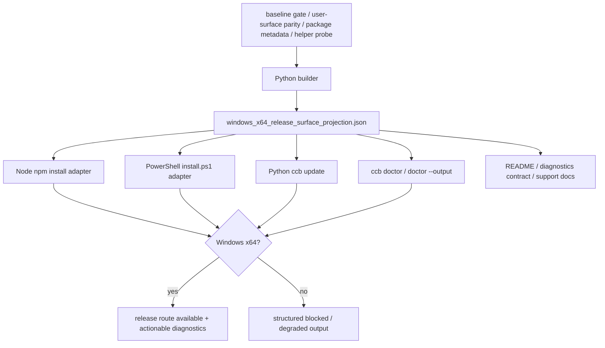

# windows-x64-release-surface feature design

## 0. 术语约定

| 术语 | 定义 | 防冲突结论 |
|---|---|---|
| 发布面投影 | 给 `npm install`、`install.ps1`、`ccb update`、`ccb doctor`、README/docs 提供的同一组机器字段与诊断文案。 | 不是最终 support tier，也不是 publish/promotion 授权。 |
| Windows x64 发布面门 | 把 baseline gate、package metadata、安装/更新路由、managed Python、native helper 和 doctor 输出收束成一个 fail-closed 结果。 | 不是后端能力门，也不是 Herdr socket API gate。 |
| managed Python | Windows 安装/更新链路中可发现、可验证的 Python 运行时。 | 这里只投影其可用性、位宽和诊断，不重新定义 Python 安装策略。 |
| native helper packaging | `ccb-rs-helper`、`ccb-agent-sidebar` 等本机 helper 随 Windows x64 发布面一起被发现、校验和描述的方式。 | 不是重新做 helper 功能，只是让发布面能说明 helper 是否到位。 |

仓库事实：

- `package.json` 仍只声明 `os: ["linux", "darwin"]`，`cpu: ["x64", "arm64"]`，没有 Windows npm 发布面。
- `bin/ccb-npm-install.js` 目前只支持 macOS universal 和 Linux x64；Windows 会直接抛 unsupported。
- `lib/cli/management_runtime/commands_runtime/update.py::cmd_update()` 当前把 Windows 直接判为不支持。
- `install.ps1` 已经是 native Windows source/install 入口，包含 Python 发现、Windows Store alias 拒绝和 `RmuxCheck` 投影。
- `lib/cli/services/doctor.py` 与 `lib/cli/render_runtime/ops_views_doctor.py` 目前只投影 `rmux_packaging_support_summary()`，没有 Windows release-surface rows。
- `docs/ccbd-diagnostics-contract.md` 只定义了 Rmux 的 Windows npm disabled 口径，没有 Windows x64 release-surface 口径。

## 1. 决策与约束

### 需求摘要

本 feature 定义 Native Windows x64 的发布面契约：`npm install`、`install.ps1`、`ccb update`、`ccb doctor` 和相关 docs 都要消费同一份 Windows x64 release-surface JSON 投影；该投影必须 fail closed 地描述 Windows x64 是否可进入、安装/更新入口怎么选、managed Python 和 native helper 是否到位，以及失败时下一步该做什么。

成功标准：

- Windows x64 发布面由单一 projection owner 产出稳定 JSON 投影，Python、Node、PowerShell 调用方不分别解释 `win32`、`x64`、managed Python 或 helper 位宽。
- `npm install` 在 native Windows x64 上有明确的 release route；`package.json.os` 必须显式放开 `win32`，但 `bin/ccb-npm-install.js` 必须继续在 Windows ia32、Windows arm64、WOW64 和缺 artifact 时 fail closed。
- `ccb update` 与 `install.ps1` 读取同一投影，给出一致的安装/更新入口和错误语义，不再各自发明平台判断。
- `ccb doctor`、`ccb doctor --output` 和相关 docs 能看到 Windows x64 发布面状态、managed Python、native helper、install/update 入口与下一步。
- 本 feature 不授权 `npm publish`、`git push`、`git tag`、release promotion 或 support tier 最终宣称。

明确不做：

- 不做后端能力改造，不碰 provider completion、recovery owner 或 Mobile/Config UI 语义。
- 不新增 32-bit Windows、arm64 Windows 或 WOW64 支持。
- 不在本 feature 里把 Windows x64 发布面直接宣称为 `supported`。
- 不自动下载 Herdr、不自动 promotion、不把发布面投影写成 publish 授权。
- 不做大范围重构；只做必要的 wiring 和单一 projection owner。

### 方案深度 pre-pass

候选方案：

1. 只改 docs/doctor，让用户看见 Windows x64 说明。
2. 只改 `package.json` / `bin/ccb-npm-install.js`，不统一 install/update/doctor。
3. 建一个单一发布面 projection owner，再由 npm/install/update/doctor/docs 共同消费。

选择第 3 个方案。理由不是为了“更完整”，而是因为 npm 安装、Windows source 安装、`ccb update`、doctor 和 docs 会同时消费同一条平台判断；如果不集中，`win32`、x64、managed Python 和 helper 状态会在不同入口里分叉，后续 support projection 也没法收口。

### Top 3 风险与缓解

1. **风险：npm、install.ps1、update、doctor 分别解释 Windows x64。**  
   缓解：单一 projection owner + 统一测试入口，任何入口都只读 projection。
2. **风险：把 `win32` 误读成 32-bit Windows。**  
   缓解：文档、doctor 和测试都显式写明 `win32` 是 Windows OS 名称，32-bit 由 projection 的 fail-closed 结果判断。
3. **风险：把发布面门偷偷升级成支持宣称。**  
   缓解：design、checklist、scope guard 一律禁止 `supported`、publish、promotion 和 release 授权。

### 非显然依赖与关键假设

- 依赖 `windows-x64-v852-baseline-gate` 的可验证输出；本 feature 不重新实现 baseline 位宽探测，只消费其结果。
- 依赖 `herdr-user-surfaces-parity` 的用户可见面投影结果；如果该 upstream 没有可引用的 beta gaps、degraded next action 或 support tier 语义，本 feature 必须保持 `surface_state="blocked"`，不得私自补定义用户可见面语义。
- 假设 Windows x64 的 npm/install/update 路由可以从同一份 projection 推导，不需要 caller 自己拼 host 逻辑。
- 假设 native helper 的位宽/可用性可以通过 release metadata、文件名约定或本机探针描述；无法证明时必须 fail closed。
- 假设 managed Python 的可用性可以在 install/update/doctor 中被投影为可行动诊断，而不是静默吞掉。

## 2. 名词与编排

### 2.1 名词层

#### 现状

- `package.json` 仍是 Linux/macOS only 的 npm envelope。
- `bin/ccb-npm-install.js` 只认识 macOS universal 与 Linux x64。
- `cmd_update()` 直接拒绝 Windows。
- `install.ps1` 已经能在 native Windows 上做 Python 发现、rmux 提示和 source/install。
- doctor 里已有 Rmux packaging projection owner，但没有 Windows x64 release-surface projection owner。

#### 变化

新增一个单一发布面投影 owner，建议由三层组成：

- `lib/terminal_runtime/windows_x64_release_surface.py`：Python builder，负责 schema defaults、repo evidence 读取、baseline gate 与 user-surface 输入合并。
- `lib/terminal_runtime/windows_x64_release_surface_projection.json`：随包发布的稳定 JSON payload，作为 Node 与 PowerShell 可消费的跨语言载体；缺仓库 evidence 时也必须能给出保守默认值。
- 唯一 public loader：`load_windows_x64_release_surface_projection(root, host_evidence)`。Python builder、packaged JSON fallback 和 default blocked 都只能通过这个 loader 返回同一 record；Node/PowerShell adapter 读取同一个 packaged JSON record 并叠加 host evidence。
- 轻量 adapter：`bin/ccb-npm-install.js` 和 `install.ps1` 只读取 JSON payload、校验 `schema_version` 与必要字段，并在未知字段或缺字段时 fail closed；Python doctor/update 调用同一个 public loader，不能各自选择 builder 或 fallback。

这个 owner 只做发布面判断，不做后端能力判断。

```python
class WindowsX64ReleaseSurfaceProjection(TypedDict):
    schema_version: Literal[1]
    projection_source: Literal["repo_evidence", "packaged_json", "default_blocked"]
    baseline_gate_ref: str | None
    user_surfaces_parity_ref: str | None
    packaged_projection_ref: str | None
    implementation_admission: Literal["admitted", "blocked_upstream_pending", "blocked_baseline_mismatch"]
    baseline_version_ref: str | None
    baseline_version_status: Literal["v8.5.2", "release-equivalent", "mismatch", "unknown"]
    package_os: tuple[str, ...]
    package_cpu: tuple[str, ...]
    package_metadata_policy: Literal["win32-enabled-postinstall-gated", "win32-disabled", "blocked"]
    windows_npm_enabled: bool
    artifact_status: Literal["ready", "missing", "mismatch", "unknown"]
    artifact_basename: str | None
    archive_name: str | None
    extract_dir: str | None
    checksum_entry: str | None
    release_artifact_ref: str | None
    windows_installer_entry: str | None
    install_entry: Literal["npm", "install_ps1", "source", "diagnostic_only"]
    update_entry: Literal["npm", "install_ps1", "source", "diagnostic_only"]
    managed_python_status: Literal["ready", "missing", "degraded", "unknown"]
    native_helper_status: Literal["ready", "partial", "missing", "unknown"]
    upstream_gate_status: Literal["ready", "blocked", "pending", "unknown"]
    upstream_failure_ref: str | None
    upstream_detail_reason: str | None
    beta_gaps: tuple[str, ...]
    surface_state: Literal["blocked", "degraded", "available"]
    failure_reason: Literal[
        "not-windows",
        "not-x64",
        "python-not-x64",
        "helper-not-x64",
        "release-artifact-missing",
        "baseline-gate-missing",
        "unknown",
    ] | None
    release_gate_detail: str
    diagnostic: str
    next_action: str | None
```

JSON 兼容规则：

- `package.json` 是 npm envelope，只负责声明允许 npm 进入 postinstall；Windows x64 是否真的可走必须由 projection + postinstall 决定。
- `package.json.os` 在实现时必须加入 `win32`，否则 `npm install` 无法到达 Windows release route；`package.json.cpu` 不能单独表达“只允许 Windows x64”，因为 macOS arm64 仍是既有支持路径，所以 Windows arm64 必须由 postinstall adapter fail closed。
- `package.json.files` 必须包含 npm postinstall 读取的 projection JSON；默认选择加入 `lib/terminal_runtime/windows_x64_release_surface_projection.json`，并用 `npm pack --dry-run` 或 pack manifest 断言该文件实际进入包。
- `bin/ccb-npm-install.js`、`install.ps1`、`cmd_update()` 和 doctor 只能消费这份投影，不各自推导 Windows x64 是否可用。
- Node / PowerShell adapter 只能做 schema 校验、host evidence 采集和结果展示，不能复制 Python builder 里的路由矩阵或 artifact 命名矩阵。
- Windows release artifact 名称、archive 名称、extract dir、checksum key 和 release evidence ref 都属于 projection interface；Node postinstall、`ccb update` 和 `install.ps1` 只能读这些字段。
- `windows_installer_entry` 是 staged artifact 内的相对路径；`update_entry="install_ps1"` 时必须为 `install.ps1` 或 fail closed，且解压根目录必须存在该文件。若未来改名，必须先改 projection schema 和测试。
- 合法组合 invariant：`package_metadata_policy="blocked"` 时 `windows_npm_enabled` 必须为 `false`；`package_metadata_policy="win32-disabled"` 时 `package_os` 不含 `win32` 且 `windows_npm_enabled=false`；`package_metadata_policy="win32-enabled-postinstall-gated"` 只表示 npm 可进入 postinstall，`windows_npm_enabled=true` 还要求 `artifact_status="ready"`、native Windows x64 host evidence、baseline/user-surface upstream ready。
- `windows_npm_enabled` 只表示 Windows npm 发布面门是否打开，不表示最终支持。
- `surface_state="available"` 也不等于 `supported`；最终 support projection 属后续 feature。
- `upstream_detail_reason` 与 `beta_gaps` 只能透传或 redacted 映射 upstream evidence，不能在本 feature 中重新定义 support tier。
- `implementation_admission!="admitted"` 时，projection 只能是 `surface_state="blocked"`、`windows_npm_enabled=false`、`install_entry/update_entry="diagnostic_only"`；实现不能消费草稿 upstream 语义进入 available/degraded route。
- `baseline_version_status` 必须来自 `windows-x64-v852-baseline-gate` 的 accepted evidence、`VERSION`/`package.json`/build info 或明确的 release-equivalent ref；当前工作区仍为 `8.2.1` 时只能 blocked。
- `next_action` 必须是可行动的，不能是空洞描述。

##### Interface 设计检查

- Module：`lib/terminal_runtime/windows_x64_release_surface.py` + `lib/terminal_runtime/windows_x64_release_surface_projection.json`，新 owner 与跨语言 payload。
- Interface：caller 必须知道这是 fail-closed 的发布面投影，能给出 install/update/doctor 的入口与失败理由，但不能当成 support tier。
- Seam：npm 安装、Windows install/update、doctor 和 docs 都走同一个 JSON projection seam。
- Depth / locality：深。否则同样的 Windows x64 判断会散到 package、npm installer、update、install.ps1 和 doctor render。
- Dependency strategy：local-substitutable。测试用 fake baseline gate、fake artifact map、fake helper/python probes。
- Adapter：production builder、packaged JSON fallback、Node reader、PowerShell reader 与 test fixtures；不是假 seam，因为不同语言入口都要消费同一门。
- Test surface：package metadata、pack payload、artifact route、npm install route、Windows update route、doctor render、README/docs contract。

### 2.2 编排层



流程级约束：

- 所有入口必须先消费同一 JSON projection，再决定自己显示什么。
- 非 Windows、Windows ia32、Windows arm64、WOW64、缺 baseline gate、缺 helper 或缺 managed Python 时都要 fail closed。
- 缺 `herdr-user-surfaces-parity` upstream evidence 时必须 fail closed，不能由本 feature 自行生成 beta gaps、degraded next action 或 support tier 口径。
- `ccb update` 不再用自己的平台分支单独判断 Windows；它只问 release-surface projection。
- doctor 与 docs 展示的字段必须能回到同一 projection，不允许 README、doctor 和安装脚本各写各的事实。

### 2.3 挂载点

- `lib/terminal_runtime/windows_x64_release_surface.py`：发布面 Python builder。
- `lib/terminal_runtime/windows_x64_release_surface_projection.json`：跨语言稳定 payload，模式参考 `rmux_packaging_support_projection.json`。
- `bin/ccb-npm-install.js`：Windows x64 artifact mapping、JSON reader 与 postinstall gate。
- `lib/cli/management_runtime/commands_runtime/update.py`：Windows update 路由和 blocked/degraded 语义。
- `install.ps1`：Windows source/install 入口要消费同一 JSON 投影，展示 managed Python 与 native helper 状态。
- `lib/cli/services/doctor.py`、`lib/cli/render_runtime/ops_views_doctor.py`：doctor payload/render 的发布面 rows。
- `docs/ccbd-diagnostics-contract.md`、`README.md`：对外口径、诊断字段与安装/更新说明。

### 2.4 推进策略

1. **发布面投影 owner**：先把 Windows x64 release-surface projection 定义成 Python builder + packaged JSON payload + schema defaults。  
   退出信号：fake baseline gate / user-surface parity / artifact / helper / python probe 下，`load_windows_x64_release_surface_projection(root, host_evidence)` 能稳定给出 `available | degraded | blocked`，Node 与 PowerShell fixture 能读取同一 JSON。
2. **dependency and baseline admission**：验证 `windows-x64-v852-baseline-gate` 与 `herdr-user-surfaces-parity` 两个 roadmap item 已 `done`，且各自有 passed acceptance/evidence refs；同时证明当前实现线是 `v8.5.2` 或 release-equivalent。  
   退出信号：依赖未满足时只能生成 blocked/default projection；依赖与基线满足后才允许 available/degraded release route。

Dependency admission 的机器谓词必须固定为：

- parent `items.yaml` 中 `windows-x64-v852-baseline-gate` 与 `herdr-user-surfaces-parity` 均为 `status: done`。
- 两个 parent feature 均存在 `{slug}-acceptance.md`，frontmatter 为 `doc_type: feature-acceptance` 且 `status: passed`。
- baseline parent acceptance/evidence refs 能证明 `v8.5.2` 或 release-equivalent、native Windows x64-only gate 和 bitness failure reasons。
- user-surfaces parent acceptance/evidence refs 能证明 beta gaps、degraded next action 与 support tier projection 已验收。
- 任一条件缺失时，本 feature implementation 只能测试和产出 blocked/default projection，不能进入 available/degraded release route。
3. **npm postinstall/package gate**：把 `package.json.os += win32`、Windows x64 artifact mapping、postinstall gate 和 Windows arm64/ia32/WOW64 fail-closed 接到同一 projection。  
   退出信号：npm 能进入 Windows postinstall；native Windows x64 可走 release route，ia32/arm64/WOW64 会拿到明确 blocked diagnostic。
4. **install.ps1/update wiring**：让 `install.ps1` 与 `ccb update` 读取同一 JSON projection，而不是各写各的判断。  
   退出信号：Windows x64 update/install 路由一致，失败时 next_action 一致。
5. **doctor/docs projection**：把 release surface rows 输出到 doctor、`--output` 和 docs contract。  
   退出信号：doctor/README/docs 都能看到 install_entry、update_entry、managed_python_status、native_helper_status 和 next_action。
6. **cleanup, rollback and scope guard**：保持 Linux/macOS/WSL 现有安装更新路径稳定，证明 Windows uninstall/update rollback evidence，并禁止 publish/promotion/support claim 越界。  
   退出信号：`npm pack --dry-run`、相关 pytest、scope guard 全过。

#### Windows update 子流程

`cmd_update()` 的 Windows 分支不能只删除 `_supported_update_platform()` 的拒绝逻辑。Windows host 必须先读取 release-surface projection，再按 `update_entry` 分流：

- `update_entry="diagnostic_only"`：不下载、不写 install prefix；打印 projection 的 `diagnostic` 与 `next_action` 后返回非零。
- `update_entry="install_ps1"`：使用 projection 的 `archive_name`、`checksum_entry`、`extract_dir` 和 `release_artifact_ref` 下载并校验 staged artifact；校验失败 fail closed；校验成功后要求 `windows_installer_entry="install.ps1"` 且 staged root 存在该文件，再调用 staged `install.ps1`，并沿用现有 update identity / rollback / entrypoint smoke check 语义的 Windows 等价实现。
- `update_entry="npm"`：只在 projection 声明 `windows_npm_enabled=true` 且 artifact ready 时提示/执行 npm release route；不能落到 Unix `run_staged_unix_installer()`。
- `update_entry="source"`：只允许 source/dev checkout 语义，输出 source 路径下一步；不把它当 release tarball update。

实现边界：

- `release_artifacts.py` 可以作为 artifact 名称生成器，但 release-surface projection 必须把 Windows artifact 字段序列化出来；caller 不直接调用自己的平台矩阵。
- Linux/macOS 继续走既有 tarball + `run_staged_unix_installer()` 路径；Windows 分支必须有单独测试，防止误用 Unix installer。
- Windows rollback、identity smoke check 和 failure output 要能从 projection 字段与 staged installer 结果复原为 acceptance 证据。
- Windows update rollback 必须有 focused unit test：用 fake staged root、fake `install.ps1` failure 和 fake install prefix 验证 Windows 分支会 restore 或 retain backup、输出 failure reason，并且不会落到 Unix installer。
- `install.ps1` 的 uninstall 路径、PATH 清理、skills 清理和 update failure rollback 必须作为 release-surface 安装面证据；这里不扩展到 Herdr backend workflow 验收。

### 2.5 结构健康度与微重构

##### 评估

- 文件级：`bin/ccb-npm-install.js`、`update.py` 和 `install.ps1` 都是入口级文件，继续塞分支会变胖。
- 文件级：`ops_views_doctor.py` 仍适合集中渲染，但本 feature 只追加少量 rows，不拆渲染层。
- 目录级：`terminal_runtime` 适合做投影 owner，`cli` 只做 wiring，`docs` 只做口径收口。

##### 结论：不做行为等价微重构

本 feature 不先拆文件或重组目录。只新增一个投影 owner 和必要 wiring；如果 `update.py` 或 `install.ps1` 再度膨胀，留给后续 refactor，不阻塞本次发布面收口。

## 3. 验收契约

### 3.1 关键场景清单

| ID | 输入 / 触发 | 期望可观察结果 | 证据类型 |
|---|---|---|---|
| AC-001 | native Windows x64 + baseline gate ready + user-surface parity evidence ready | 发布面投影为 `available`，npm/install/update/doctor 看到一致的 Windows x64 门状态 | unit |
| AC-002 | Windows ia32 / arm64 / WOW64 | 发布面 fail closed，`surface_state` 不是 `available`，且有明确 `failure_reason` 与 `next_action` | unit |
| AC-003 | `npm install -g @seemseam/ccb` on Windows x64 | `package.json.os` 允许 Windows 进入 postinstall，postinstall 只让 native Windows x64 进入 release route；32-bit/arm64 不能误装 | unit/CLI |
| AC-004 | `ccb update` on Windows x64 | update 路由按 projection 的 `update_entry` 分流；Windows 不落到 Unix installer，blocked/degraded/available 输出与 install 投影一致 | unit/CLI |
| AC-005 | managed Python 或 native helper 缺失 | doctor/install/update 都能看见可行动诊断，不静默吞掉 | unit |
| AC-006 | `ccb doctor` / `ccb doctor --output` | 输出 Windows x64 release-surface rows，与 README/docs 口径一致 | snapshot |
| AC-007 | Linux/macOS/WSL 现有路径 | 不退化，仍保留现有安装、更新和 Rmux 诊断面 | regression |
| AC-008 | scope guard | 不修改 provider completion、recovery owner、support tier 最终宣称、publish/promotion | diff review |
| AC-009 | Native Windows x64 transcript | 能从真实机器证据看到 install/update/doctor 的同一投影或 blocked 结果 | manual transcript |
| AC-010 | upstream dependency 或 v8.5.2 baseline 未满足 | 只能生成 `implementation_admission!="admitted"` 的 blocked/default projection，不能进入 available/degraded release route | unit |
| AC-011 | Windows install cleanup / update failure rollback | `install.ps1 uninstall`、PATH/skills 清理和 update failure rollback 有 transcript 或 blocked evidence | manual/unit |

### 3.2 明确不做的反向核对项

- 不把 `win32` 写成 32-bit Windows 支持。
- 不把本 feature 当成最终 `supported` 宣称。
- 不授权 `npm publish`、`git push`、`git tag`、release promotion。
- 不改 provider completion、recovery owner、Mobile/Config UI 语义。
- 不删 Linux/macOS/WSL 的现有安装更新路径。

### 3.3 Acceptance Coverage Matrix

| Scenario | Covered By Step | Evidence Type | Command / Action | Core? |
|---|---|---|---|---|
| AC-001 发布面可用 | S1,S2,S3 | unit | projection tests | yes |
| AC-002 32-bit/arm64/WOW64 fail closed | S1,S3,S4 | unit | projection + installer/update tests | yes |
| AC-003 npm install Windows route | S3 | unit/CLI | npm install focused tests | yes |
| AC-004 update 路由一致 | S4 | unit/CLI | update tests | yes |
| AC-005 managed Python / helper 诊断 | S1,S4,S5 | unit | projection + doctor tests | yes |
| AC-006 doctor/render/docs 一致 | S5 | snapshot/docs | doctor render tests | yes |
| AC-007 非 Windows 回归 | S6 | regression | Linux/macOS/WSL tests | yes |
| AC-008 scope guard | S6 | diff review | forbidden change guard | yes |
| AC-009 Windows 真机 transcript | S5,S6 | manual | Native Windows x64 transcript | yes |
| AC-010 dependency/baseline admission | S2 | unit | dependency admission + baseline version check | yes |
| AC-011 cleanup/rollback evidence | S6 | manual/unit | uninstall transcript + rollback tests | yes |

### 3.4 DoD Contract

| ID | 要求 | 证据 | 阻塞级别 |
|---|---|---|---|
| DOD-DESIGN-001 | design/checklist/review 完整，且对齐 roadmap item `windows-x64-release-surface` | design review | blocking |
| DOD-IMPL-001 | 单一 release-surface owner 产出 Python builder 与 JSON projection，caller 不各自解释 Windows x64、artifact route 或 upstream failure detail | unit/diff review | blocking |
| DOD-IMPL-002 | npm/install/update/doctor 都消费同一 JSON projection，Windows ia32/arm64/WOW64 fail closed | unit tests | blocking |
| DOD-IMPL-003 | managed Python 与 native helper 状态被投影到 doctor/docs，并给出 next_action | snapshot | blocking |
| DOD-IMPL-004 | `ccb update` 不再单独用 Linux/macOS/WSL 拒绝 Windows x64；按 `update_entry` 执行 Windows 专用分支，不复用 Unix installer | unit/CLI | blocking |
| DOD-IMPL-005 | 不修改 provider completion、recovery owner、publish/promotion、final support claim | diff review | blocking |
| DOD-IMPL-006 | implementation admission 要求两个 upstream roadmap item done 且有 passed acceptance/evidence refs；否则只能产出 blocked/default projection | unit | blocking |
| DOD-IMPL-007 | 当前实现线必须是 `v8.5.2` 或 release-equivalent evidence；当前 `8.2.1` 工作区不能进入 available/degraded release route | unit/diff review | blocking |
| DOD-REVIEW-001 | code review passed 且无 unresolved blocking | review report | blocking |
| DOD-QA-001 | QA 覆盖 Windows x64 发布面、一致性、回归和 scope guard | QA report | blocking |
| DOD-ACCEPT-001 | acceptance 回写 roadmap item，并保留 Windows x64 evidence refs | acceptance report | blocking |

Validation Commands:

| ID | 命令 | 目的 | 核心性 | 失败处理 |
|---|---|---|---|---|
| CMD-001 | `python ".codestable/tools/validate-yaml.py" --file ".codestable/features/2026-07-31-windows-x64-release-surface/windows-x64-release-surface-checklist.yaml" --yaml-only` | checklist YAML 合法性 | core | fix-or-block |
| CMD-002 | `python ".codestable/tools/validate-yaml.py" --file ".codestable/roadmap/windows-native-herdr-ccb/windows-native-herdr-ccb-items.yaml"` | roadmap items 回写合法性 | core | fix-or-block |
| CMD-003 | `python -m pytest -q test/test_windows_x64_release_surface.py` | 发布面 projection / package payload / artifact route / install / update 核心单测 | core | fix-or-block |
| CMD-004 | `python -m pytest -q test/test_cli_doctor_windows_x64_release_surface.py test/test_windows_bootstrap_script.py test/test_cli_management_update.py -k "windows or release_surface or install or update or doctor"` | doctor/install/update/wiring 回归 | core | fix-or-block |
| CMD-005 | `python -m pytest -q test/test_cli_doctor_rmux_packaging.py test/test_install_windows_rmux_contract.py test/test_rmux_packaging_docs_contracts.py` | 既有 Windows Rmux/诊断回归 | core | fix-or-block |
| CMD-006 | `node -e "const cp=require('child_process'); const out=cp.execFileSync('npm',['pack','--dry-run','--json'],{encoding:'utf8'}); const files=JSON.parse(out)[0].files.map(f=>f.path); if(!files.includes('lib/terminal_runtime/windows_x64_release_surface_projection.json')) throw new Error('projection JSON missing from npm pack payload')"` | package 产物与 metadata dry-run，机器断言 projection JSON 进入 npm 包 | core | fix-or-block |
| CMD-007 | `python -c "import pathlib,re,subprocess; roots=('lib','test','docs','README.md','package.json','bin','install.ps1'); run=lambda a: subprocess.run(a,capture_output=True,text=True,check=True).stdout; tracked=run(['git','diff','--',*roots])+run(['git','diff','--cached','--',*roots]); others=[p for p in run(['git','ls-files','--others','--exclude-standard','--',*roots]).splitlines() if p]; extra=''.join(pathlib.Path(p).read_text(encoding='utf-8',errors='ignore') for p in others if pathlib.Path(p).is_file()); lower=(tracked+extra).lower(); patterns=('npm\\s+publish','git\\s+push','git\\s+tag','support_tier\\s*[:=]\\s*'+chr(34)+'?supported'+chr(34)+'?','release[_ -]?promotion\\s*[:=]\\s*(true|enabled)','provider_completion','recovery_owner'); hits=[p for p in patterns if re.search(p,lower)]; assert not hits,hits"` | publish/promotion/support/completion scope guard，含未跟踪新文件，PowerShell-safe | core | fix-or-block |
| CMD-008 | `MANUAL Native Windows x64: capture npm install / install.ps1 / ccb update / ccb doctor transcript` | 真实机器发布面证据 | core | blocked-if-no-host-or-herdr |
| CMD-009 | `python -m pytest -q test/test_windows_x64_release_surface_dependency_admission.py` | 断言两个 upstream roadmap item `done`、parent acceptance `doc_type=feature-acceptance status=passed`、baseline/user-surface evidence refs 存在；缺任一项时只能产出 blocked/default projection | core | fix-or-block |
| CMD-010 | `python -m pytest -q test/test_windows_x64_release_surface_baseline_version.py` | v8.5.2 或 release-equivalent 基线准入；当前 8.2.1 工作区只能 blocked | core | fix-or-block |
| CMD-011 | `MANUAL Native Windows x64: capture install.ps1 uninstall cleanup and ccb update failure rollback transcript` | Windows 安装面可卸载、PATH/skills 清理和 update rollback 证据 | core | blocked-if-no-host-or-herdr |
| CMD-012 | `python -m pytest -q test/test_windows_x64_release_surface_update_rollback.py` | fake staged root / fake install.ps1 failure 下验证 Windows update branch restore-or-retain backup、identity smoke/failure output，且不调用 Unix installer | core | fix-or-block |

Required Artifacts：

- design、checklist、design-review
- `WindowsX64ReleaseSurfaceProjection` owner 模块与 packaged JSON projection
- Node / PowerShell JSON adapter 测试 fixture
- package payload 断言，证明 projection JSON 位于 npm 包内
- artifact route 字段与 checksum key 的 projection 测试
- upstream dependency admission 与 v8.5.2 baseline admission 测试
- `bin/ccb-npm-install.js` / `package.json` / `update.py` 的发布面 wiring
- doctor payload/render 更新
- `docs/ccbd-diagnostics-contract.md` 与 README 口径更新
- Windows x64 真实 transcript 或 blocked evidence
- install.ps1 uninstall cleanup transcript 或 blocked evidence
- ccb update failure rollback evidence
- roadmap items.yaml 回写

### 3.5 自我批判结论

- 可证伪性：每个核心场景都能被 yes/no 地证明，不靠“更好看”这类弱词。
- 步骤原子性：projection、dependency/baseline admission、npm postinstall/package gate、install.ps1/update、doctor/docs、cleanup/rollback 与 scope guard 已分开。
- 最弱依赖：upstream dependency admission、v8.5.2 baseline gate 和 Windows 真机 transcript 是最弱依赖，已单独写进步骤与验收。
- 证据完整性：unit、snapshot、CLI、manual transcript 都有对应位置，不只靠文案。
- 基线可执行性：`npm pack --dry-run --json` 断言、baseline admission 和 pytest 命令明确，既有回归与新增测试分开。
- 交付物可核验性：acceptance 能从 diff、文件、doctor 输出和 transcript 反查。
- 清洁度覆盖：禁止调试输出、临时 TODO/FIXME、注释掉代码和无用 import；若有例外，必须在实现前另写说明。

## 4. 与项目级架构文档的关系

- 本 feature 是 `windows-native-herdr-ccb` 的第 9 个 child，负责把 Windows x64 发布面做成可消费的单一契约。
- 本 feature 只消费 `windows-x64-v852-baseline-gate` 的 platform gate，不重新实现位宽探测。
- 后续 `native-windows-public-workflow-validation-matrix` 和 `herdr-supportability-projection` 才负责最终 support tier 与更完整的发布说明。
- 如果实现确认 `WindowsX64ReleaseSurfaceProjection` 会长期存在，建议后续用 `cs-note` 或 `cs-domain` 记录 `os=win32,cpu=x64` 的长期口径。
