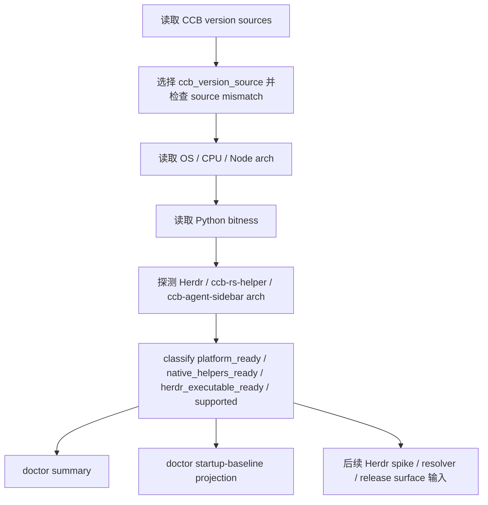

# windows-x64-v852-baseline-gate feature design

## 0. 术语约定

| 术语 | 定义 | 防冲突结论 |
|---|---|---|
| Windows x64 platform gate | 判断当前运行链路是否满足 Native Windows x64-only 的机器可读准入结果。 | 不是 Herdr backend capability gate，也不是 npm release surface；它只回答平台、版本、位宽和基础工具链是否可进入后续 Herdr work。 |
| `win32` | Node/npm 对 Windows OS 的平台名。 | 不表示 32-bit Windows；必须和 `cpu=x64`、Node x64、Python 64-bit、helper x64 分开判断。 |
| CCB `v8.5.2` baseline | 本 epic 的实现起点。 | 当前仓库 `package.json` 显示 `8.2.1`，本 feature 必须先把真实基线状态投影出来，不能假装已在 `v8.5.2`。 |
| helper arch | CCB native helper 的可执行文件位宽状态。 | 初始必需 helper 集合固定为 `ccb-rs-helper` 与 `ccb-agent-sidebar`；缺失或未知不得让 full gate `supported=true`。 |
| doctor startup-baseline projection | 用户和后续 feature 能看见的平台准入原因。 | 本 feature 只在 doctor payload/render 中展示 actionable diagnostic，不写新的 startup report 字段、不启用 Herdr backend、不改发布承诺。 |

仓库事实：

- `package.json` 当前版本为 `8.2.1`，`os` 为 `["linux", "darwin"]`，`cpu` 为 `["x64", "arm64"]`。
- `bin/ccb-npm-install.js` 的 postinstall artifact route 当前只支持 macOS universal 与 Linux x64，其他 `process.platform/process.arch` fail closed。
- `lib/cli/services/doctor.py::doctor_summary()` 已聚合 installation、runtime、requirements、backend selection 与 `rmux_packaging_support_summary()`。
- `lib/cli/render_runtime/ops_views_doctor.py::render_doctor()` 已渲染 install platform/arch、Python 版本、backend selection 与 rmux support 字段。
- `lib/cli/services/doctor_runtime/system.py` 已有 installation / runtime / requirements summary，可作为新增 platform gate probe 的相邻模块。
- `lib/terminal_runtime/rmux_packaging_support.py` 提供 support projection 的既有模式：纯函数、机器字段、packaged fallback、doctor 消费、测试覆盖。
- `lib/terminal_runtime/backend_resolver.py` 当前只支持 `tmux|rmux|auto`，Herdr backend selection 属后续 roadmap item，不在本 feature 修改。

## 1. 决策与约束

### 需求摘要

本 feature 建立一个可复用的 Native Windows x64-only platform gate。它要把 CCB 版本基线、Node 平台与位宽、Python 位宽、可选 native helper 位宽、Herdr 可执行文件位宽探测状态汇总成单一机器结果，并把该结果接入 doctor startup-baseline projection。后续 Herdr spike、backend resolver、release surface 和 support projection 都消费同一 gate，不各自解释 `win32` 或位宽。

成功标准：

- `WindowsX64PlatformGate` 能表达 `os_platform`、`cpu_arch`、`node_arch`、`python_bitness`、`ccb_version_source`、`detected_ccb_version`、`herdr_arch`、`helper_arch`、`platform_ready`、`native_helpers_ready`、`herdr_executable_ready`、`supported`、`failure_reason`、`detail_reason`、`diagnostic`。
- implementation admission 必须证明实现线来自 CCB `v8.5.2` 源头并已新建分支；当前仓库不是严格 `v8.5.2` 源头时，gate 输出可见基线风险，只能产出 blocked/default，不允许把后续 Herdr route 标记为 available 或 supported。
- `os_platform="win32"` 不能单独通过 gate；必须同时满足 x64、Python 64-bit、必要 helper/Herdr 位宽证据。
- doctor 能展示 gate summary、parent-compatible failure reason 和 detail reason，便于用户知道应切到 v8.5.2、换 64-bit runtime、安装 x64 Herdr 或修 helper。
- 非 Windows、Windows 32-bit、arm64 Windows、WOW64/混合链路均 fail closed。

明确不做：

- 不把 npm `os` 改为包含 `win32`，不修改 `cpu` 发布策略，不发布 npm，不上传 release artifact。
- 不实现 Herdr backend client、socket API、capability gate、namespace lifecycle 或 provider runtime。
- 不自动下载、安装或启动 Herdr；只探测已存在可执行文件或显式配置路径。
- 不改变 Linux/macOS/WSL 默认 tmux 路线，也不改变 rmux route approval 语义。
- 不执行 git commit、push、tag、merge、release、publish、deploy 或 promotion。

### 方案深度 pre-pass

候选：

- 完整版：一次性改 package metadata、npm install、backend resolver、Herdr adapter、doctor 和 support tier。
- 本 feature 方案：只建立长期 platform gate contract 和基础诊断，后续 release surface / backend adapter 分别消费它。

选择本 feature 方案。原因不是为了省事，而是 roadmap 已把平台准入、Herdr spike、backend contract、release surface 拆成不同风险层。平台位宽判断是长期公共契约，应做实并可测试；npm release 和 Herdr adapter 依赖后续真实能力证据，提前做会把未验证承诺写进用户入口。

### Top 3 风险与缓解

1. **风险：把 Node 的 `win32` 误解成 32-bit 支持。**  
   缓解：gate contract 同时记录 `os_platform` 与 `cpu_arch/node_arch`，doctor 文案明确 `win32` 是 OS 名称。
2. **风险：当前仓库版本不是严格 CCB `v8.5.2` 源头，后续 feature 在错误基线上实现。**
   缓解：gate summary 必须读取 CCB source/version/branch evidence；非 `v8.5.2` 源头或未新建实现分支时输出 blocked diagnostic，当前工作区不得作为 implementation-ready 基线。
3. **风险：install、doctor、backend resolver 各自实现位宽判断，未来不一致。**  
   缓解：新增单一 platform gate module，doctor 和后续 resolver 只消费该 summary。

### 非显然依赖与关键假设

- 依赖 Node runtime 能通过小型 probe 或 install script 输入暴露 `process.platform/process.arch`。
- 依赖 Python 能通过 `platform.architecture()`、`sys.maxsize` 或等价方式判断 64-bit runtime。
- 依赖 Herdr 可执行文件路径来自 PATH 或显式配置；若找不到，第一版返回 `missing`，不自动安装。
- 假设 helper 位宽可以通过可信 release metadata、PE header probe 或 explicit artifact ref 得到；wrapper / 文件名约定只能辅助定位，不能单独作为 x64 证据。helper 位宽判定使用 fail-closed 冲突规则：可信来源全部一致为 `x64` 时才可接受；任一可信来源明确为 `arm64|ia32` 时返回对应非 x64 arch 并阻塞；可信来源之间不一致或只有部分来源 `unknown` 时返回 `unknown` 并设置 `detail_reason="helper-unknown"`；缺少 artifact 时返回 `missing`。无法证明时返回 `unknown` 或 `missing` 并 fail closed。初始 helper keys 只包含 `ccb-rs-helper` 与 `ccb-agent-sidebar`，不把未设计的 Herdr socket helper 塞进本 gate。

## 2. 名词与编排

### 2.1 名词层

#### 现状

- `package.json` 已有 `os` / `cpu` metadata，但当前没有 Windows npm entry。
- `bin/ccb-npm-install.js` 在 postinstall 阶段用 Node `process.platform/process.arch` 选择 release artifact，当前非 macOS 或 Linux x64 会抛 unsupported。
- Python doctor 已知道 install platform/arch 和 Python 版本，但没有一个 dedicated Windows x64 baseline gate。
- `rmux_packaging_support_summary()` 证明项目已有机器 projection 模式，可用于 doctor 和测试，不需要让 README/doctor 各自推导支持状态。

#### 变化

新增一个 platform gate contract，生产 owner 固定为低层、无 CLI/context 依赖的 `lib/terminal_runtime/windows_x64_platform_gate.py`。`doctor` 和后续 backend resolver / release surface 只做 wiring，不各自实现位宽或版本判断。

```python
class WindowsX64PlatformGate(TypedDict):
    os_platform: Literal["win32", "linux", "darwin", "unknown"]
    cpu_arch: Literal["x64", "arm64", "ia32", "unknown"]
    node_arch: Literal["x64", "arm64", "ia32", "missing", "unknown"]
    python_bitness: Literal["64bit", "32bit", "unknown"]
    ccb_version_source: Literal["installation", "package_json", "version_file", "unknown"]
    ccb_source_ref: str | None
    ccb_branch_ref: str | None
    ccb_source_status: Literal["strict-v8.5.2", "not-v8.5.2", "unknown"]
    detected_ccb_version: str | None
    package_json_version: str | None
    version_file_version: str | None
    installation_version: str | None
    expected_ccb_version: Literal["8.5.2"]
    herdr_arch: Literal["x64", "arm64", "ia32", "missing", "unknown"]
    helper_arch: dict[Literal["ccb-rs-helper", "ccb-agent-sidebar"], Literal["x64", "arm64", "ia32", "missing", "unknown"]]
    platform_ready: bool
    native_helpers_ready: bool
    herdr_executable_ready: bool
    supported: bool
    failure_reason: Literal[
        "not-windows",
        "not-x64",
        "python-not-x64",
        "herdr-not-x64",
        "helper-not-x64",
        "unknown",
    ] | None
    detail_reason: Literal[
        "none",
        "node-not-x64",
        "ccb-version-mismatch",
        "ccb-version-source-mismatch",
        "source-branch-blocked",
        "python-bitness-unknown",
        "herdr-missing",
        "helper-missing",
        "helper-unknown",
        "unknown",
    ]
    diagnostic: str
```

字段语义：

- `platform_ready=true` 只表示 Windows OS + x64 CPU/Node + Python 64-bit + CCB baseline version 通过。
- `ccb_source_status="strict-v8.5.2"` 需要 implementation admission 提供 CCB `v8.5.2` 源头 ref 和新分支 ref；缺任一项时不得进入 implementation-ready。
- `native_helpers_ready=true` 要求 `helper_arch["ccb-rs-helper"] == "x64"` 且 `helper_arch["ccb-agent-sidebar"] == "x64"`；任一 `missing|unknown|arm64|ia32` 都为 false。
- helper arch evidence 的接受顺序不是“择优覆盖”，而是“可信来源交叉核验”：release metadata、PE header probe、explicit artifact ref 任一来源给出非 x64 或互相冲突时都不得用另一个 x64 来源覆盖；结果必须 fail closed，并在 raw probes 中保留各来源原值。
- `herdr_executable_ready=true` 只要求 Herdr 可执行文件位宽为 x64，不证明 socket API 或 session/pane 语义；socket capability 属 `herdr-backend-contract-spike`。
- `supported=true` 是 full gate：`platform_ready && native_helpers_ready && herdr_executable_ready`。后续 consumer 若只需要平台基线，应读取 `platform_ready`，不要把 `supported` 当成 Herdr API capability。
- `ccb_version_source` 优先级为 `installation` > `package_json` > `version_file` > `unknown`。当多个可读版本源不一致时，`failure_reason="unknown"` 且 `detail_reason="ccb-version-source-mismatch"`；当检测版本与 `expected_ccb_version` 不等时，`failure_reason="unknown"` 且 `detail_reason="ccb-version-mismatch"`；当版本满足但缺少 CCB `v8.5.2` 源头 ref 或新建实现分支 ref 时，`failure_reason="unknown"` 且 `detail_reason="source-branch-blocked"`。当前仓库 `package.json` 与 `VERSION` 均为 `8.2.1`，因此预期输出应 fail closed。
- `failure_reason` 严格保持 roadmap §4.1 枚举：`not-windows|not-x64|python-not-x64|herdr-not-x64|helper-not-x64|unknown|null`。Node 架构、版本源和 source/branch admission 等更细原因只能进入 `detail_reason` 与 `diagnostic`，不得扩展 parent contract。
- `WindowsX64PlatformGate` 是 roadmap §4.1 的向后兼容扩展：新增的 `linux|darwin|arm64|ia32|missing|unknown` raw states 只用于本 feature 的 fail-closed 检测和 doctor 诊断。后续 consumer 的稳定依赖面是 `platform_ready`、`native_helpers_ready`、`herdr_executable_ready`、`supported`、parent-compatible `failure_reason`、`detail_reason`、`diagnostic`、`ccb_source_status`、`ccb_source_ref`、`ccb_branch_ref`；如果需要完整原始探针，只能读取 evidence JSON 的 `raw_probes`。

##### Interface 设计检查

- Module：`WindowsX64PlatformGate` projection，新增。它是 Herdr Native Windows epic 的平台准入 owner。
- Interface：caller 必须知道 gate 是 fail-closed、只表达平台/版本/位宽，不表达 Herdr socket capability 或 release support tier。
- Seam：doctor/backend resolver 后续都穿过该 projection；测试用注入 probe 输入覆盖 Windows x64、Windows 32-bit、arm64、非 Windows、版本不匹配和 helper unknown。
- Depth / locality：deep。位宽、版本、helper 探测和诊断集中在一个 module；删除它会让相同判断散到 install、doctor、resolver 和 support projection。
- Dependency strategy：local-substitutable。生产 probe 读取本地 runtime/可执行文件；测试用纯数据 probe，不依赖真实 Herdr。
- Adapter：不需要 third-party adapter。Herdr executable probe 只是本地可执行文件探测；socket API adapter 属后续 `herdr-backend-client`。
- Test surface：unit tests 直接断言 summary；doctor render tests 断言 doctor startup-baseline projection 不吞掉 blocked diagnostic。

### 2.2 编排层



流程级约束：

- 判定顺序 fail closed：非 Windows、非 x64、Node 非 x64、Python 非 64-bit、CCB 版本源不一致、CCB 非严格 `v8.5.2` 源头、新分支证据缺失、Herdr/helper 位宽不可证明时均不得 `supported=true`。
- `herdr_arch="missing"` 可以作为后续 spike 前的 actionable missing，不等于 platform unsupported；但如果用户请求 Herdr route，则后续 consumer 必须把 missing 当 blocked。
- doctor 输出必须包含 raw fields 与 human diagnostic，不能只给布尔值。
- doctor startup-baseline projection 的稳定输出面是 top-level `doctor_summary()["windows_x64_platform_gate"]` 与 `render_doctor()` 的 top-level `windows_x64_*` / `startup_baseline_*` 行。`startup_baseline_failure_reason` 与 `startup_baseline_detail_reason` 只从 `windows_x64_platform_gate.failure_reason/detail_reason` 派生，不进入 `ccbd` payload。本 feature 不扩展 `CcbdStartupReport` schema，不写 `readiness_timeline`，不新增 startup report 字段。若未来 ccbd startup 需要持久化该 gate，必须另起设计把同一 summary 放入 `CcbdStartupReport.readiness_timeline["windows_x64_platform_gate"]` 并补 render 规则。
- package metadata 仍归 `windows-x64-release-surface`；本 feature 不改变 npm install 支持范围。

### 2.3 挂载点清单

- `lib/terminal_runtime/windows_x64_platform_gate.py`：新增 platform gate owner。
- `lib/cli/services/doctor.py`：把 gate summary 注入 `doctor_summary()` payload。
- `lib/cli/render_runtime/ops_views_doctor.py`：渲染 Windows x64 gate raw fields、supported、failure reason 和 diagnostic。
- `lib/cli/services/doctor.py` / `lib/cli/render_runtime/ops_views_doctor.py`：只消费 top-level gate summary 展示 `windows_x64_supported`、`windows_x64_failure_reason`、`windows_x64_detail_reason`、`windows_x64_diagnostic`、`ccb_expected_version`、`ccb_detected_version`、`startup_baseline_failure_reason` 与 `startup_baseline_detail_reason`；本 feature 不改 `CcbdStartupReport` schema、不改变 backend selection。
- `bin/ccb-npm-install.js` 或 Node-side probe tests：只在需要证明 Node `process.platform/process.arch` 字段时增加可测试 probe，不启用 win32 artifact。
- tests：新增 platform gate unit、doctor startup-baseline render、package metadata no-change guard。

### 2.4 推进策略

1. **platform gate owner**：新增 `lib/terminal_runtime/windows_x64_platform_gate.py` 纯函数 projection，输入为 CCB version sources、OS/CPU、Node arch、Python bitness、Herdr/helper arch probe。  
   退出信号：unit tests 覆盖 pass、not-windows、not-x64、python-not-x64、helper-not-x64、unknown + `detail_reason=node-not-x64|ccb-version-mismatch|ccb-version-source-mismatch|source-branch-blocked|helper-unknown`。
2. **probe integration**：实现生产 probe，复用现有 installation summary / Python runtime 信息，Node arch 通过受控 Node probe 或 package/install context 获取。  
   退出信号：缺 Node/Herdr/helper 时返回 `missing|unknown`，不抛未处理异常。
3. **doctor projection**：把 `windows_x64_platform_gate` 加入 doctor payload 和 text render。  
   退出信号：doctor render snapshot 包含 `windows_x64_supported`、`windows_x64_failure_reason`、`windows_x64_detail_reason`、`windows_x64_diagnostic`、`ccb_expected_version`、`ccb_detected_version`。
4. **doctor startup-baseline projection**：通过 doctor render 展示 gate failure，避免后续 Herdr route 在错误基线下继续；本 feature不写 `CcbdStartupReport` 新字段、不写 `readiness_timeline`。  
   退出信号：doctor 测试证明 top-level `startup_baseline_failure_reason` 与 `startup_baseline_detail_reason` 从 `windows_x64_platform_gate` 派生且可见，且没有自动改 backend 或 config。
5. **package metadata no-change guard**：锁定本 feature 不修改 npm `os/cpu` 支持范围，不增加 win32 artifact route。  
   退出信号：测试或 diff guard 证明 `package.json.os` 未添加 `win32`，postinstall artifact route 未宣称 win32 supported。
6. **evidence handoff**：产出 `.codestable/features/2026-07-31-windows-x64-v852-baseline-gate/evidence/platform-gate-summary.json`，供 `herdr-backend-contract-spike` 和后续 release surface 消费。  
   退出信号：机器可读 evidence 包含 `schema_version=1`、`feature`、`generated_at`、`host_label`、parent-compatible `gate`、`raw_probes`、`version_sources`、`artifact_refs`；`gate.ccb_source_ref`、`gate.ccb_branch_ref`、`gate.ccb_source_status` 明确来自 implementation admission evidence。

### 2.5 结构健康度与微重构

##### 评估

- 文件级：`lib/cli/render_runtime/ops_views_doctor.py` 已很长，但当前渲染策略是集中列出 doctor fields；本 feature 只增加少量行，不做渲染拆分。
- 文件级：`lib/cli/services/doctor_runtime/system.py` 已承担 installation/runtime/requirements，多加完整 platform gate 会让职责继续膨胀；新增 owner 固定在 `lib/terminal_runtime/windows_x64_platform_gate.py`，doctor_runtime 只提供已有 installation/runtime 输入。
- 文件级：`bin/ccb-npm-install.js` 是发布安装逻辑，本 feature 不应把 Windows release route 塞进去。
- 目录级：`lib/terminal_runtime` 已有 backend/support projection，`lib/cli/services/doctor_runtime` 已有诊断 probe；platform gate 固定放 `lib/terminal_runtime/windows_x64_platform_gate.py`。doctor_runtime 只提供输入或 wiring，不拥有 gate policy。

##### 结论：不做行为等价微重构

本 feature 不先拆现有 doctor 渲染或 install script。需要新增的判断放在 `lib/terminal_runtime/windows_x64_platform_gate.py`；只做最小 wiring。若实现阶段发现 doctor render 继续膨胀，应记录后续 `cs-refactor` 候选，不阻塞本 feature。

## 3. 验收契约

### 3.1 关键场景清单

| ID | 输入 / 触发 | 期望可观察结果 | 证据类型 |
|---|---|---|---|
| AC-001 | Windows x64、Node x64、Python 64-bit、CCB `8.5.2`、Herdr x64、`ccb-rs-helper` x64、`ccb-agent-sidebar` x64 | gate `platform_ready=true`、`native_helpers_ready=true`、`herdr_executable_ready=true`、`supported=true`，failure_reason 为 null | unit |
| AC-002 | `os_platform=win32` 但 `cpu_arch=ia32` 或 `node_arch=ia32` | gate `supported=false`；CPU 32-bit 使用 `failure_reason="not-x64"`，Node 32-bit 使用 `failure_reason="not-x64"` + `detail_reason="node-not-x64"` | unit |
| AC-003 | Python 为 32-bit 或 unknown | gate fail closed，`failure_reason="python-not-x64"` 或 `unknown`，doctor 显示 Python 位宽诊断 | unit/render |
| AC-004 | CCB source/version/branch 不是严格 `v8.5.2` 源头新分支，或 version sources 不一致 | gate fail closed，`failure_reason="unknown"`，detail reason 为 `ccb-version-mismatch`、`ccb-version-source-mismatch` 或 source/branch blocked 诊断，doctor 显示 expected/detected/source versions | unit/render |
| AC-005 | 非 Windows 或 arm64 Windows | gate fail closed，不建议 Herdr Native Windows route | unit |
| AC-006 | Herdr、`ccb-rs-helper` 或 `ccb-agent-sidebar` missing/unknown，或 helper 可信 arch 来源冲突 | summary 保留 raw state，diagnostic 可操作，`supported=false`，不把未知或冲突当 x64 supported | unit |
| AC-007 | `ccb doctor` payload/render | 输出 platform gate raw fields、supported、failure reason、diagnostic | snapshot |
| AC-008 | doctor startup-baseline projection | `startup_baseline_failure_reason` 与 `startup_baseline_detail_reason` 取自 gate summary，且不写新 `CcbdStartupReport` 字段、不写 `readiness_timeline`、不自动修改 backend/config | test |
| AC-009 | package metadata | 本 feature 不新增 `package.json.os=win32`，不新增 Windows npm artifact 支持 | guard |
| AC-010 | 当前工作区未证明来自 CCB `v8.5.2` 源头新分支 | 只能输出 blocked/default admission evidence，不允许 implementation-ready 或 available | unit/diff |

### 3.2 明确不做的反向核对项

- 不应在 package metadata 中启用 Windows npm entry。
- 不应把 `win32` 文案写成 32-bit Windows 支持。
- 不应自动安装、下载或启动 Herdr。
- 不应把 Herdr agent/socket capability 写进 platform gate。
- 不应修改 backend resolver 以选择 Herdr。

### 3.3 Acceptance Coverage Matrix

| Scenario | Covered By Step | Evidence Type | Command / Action | Core? |
|---|---|---|---|---|
| AC-001 x64 pass | S1,S2 | unit | platform gate tests | yes |
| AC-002 Windows 32-bit blocked | S1 | unit | platform gate tests | yes |
| AC-003 Python bitness | S1,S3 | unit/render | platform gate + doctor tests | yes |
| AC-004 version mismatch | S1,S3 | unit/render | version fixture + doctor tests | yes |
| AC-005 non-Windows/arm64 | S1 | unit | platform gate tests | yes |
| AC-006 missing/unknown/conflicting tools | S1,S2 | unit | probe tests including helper metadata/PE/artifact conflict fixture | yes |
| AC-007 doctor render | S3 | snapshot | doctor render tests | yes |
| AC-008 doctor startup-baseline projection | S4 | test | doctor startup-baseline projection tests | yes |
| AC-009 package no-change | S5 | guard | package/install artifact tests | yes |
| AC-010 strict source/branch admission | S1,S6 | unit/diff/evidence | platform gate tests + platform-gate-summary.json source/ref/branch fields | yes |

### 3.4 DoD Contract

| ID | 要求 | 证据 | 阻塞级别 |
|---|---|---|---|
| DOD-DESIGN-001 | design/checklist/review 完整，且对齐 roadmap item `windows-x64-v852-baseline-gate` | design review | blocking |
| DOD-IMPL-001 | platform gate owner 是 `lib/terminal_runtime/windows_x64_platform_gate.py` 单一 module，caller 不各自解释位宽 | unit/diff review | blocking |
| DOD-IMPL-002 | gate fail-closed 覆盖 Windows x64 pass、非 Windows、32-bit、arm64、Python 32-bit、版本不匹配、helper unknown 和 helper trusted-source conflict | unit tests | blocking |
| DOD-IMPL-003 | doctor payload/render 展示 raw fields、supported、failure reason、diagnostic | snapshot | blocking |
| DOD-IMPL-004 | doctor startup-baseline projection 通过同一 gate summary 可见，且不写新 `CcbdStartupReport` 字段、不写 `readiness_timeline`、不自动改 backend/config | test | blocking |
| DOD-IMPL-005 | package metadata 与 npm install artifact route 没有被本 feature 启用 win32 | guard | blocking |
| DOD-IMPL-006 | implementation admission 严格要求 CCB `v8.5.2` 源头和新分支 ref；当前工作区状态不能作为实现基线 | unit/diff review | blocking |
| DOD-REVIEW-001 | code review passed 且无 unresolved blocking | review report | blocking |
| DOD-QA-001 | QA 覆盖 gate、doctor startup-baseline projection、package no-change guard | QA report | blocking |
| DOD-ACCEPT-001 | acceptance 回写 roadmap item 并记录 gate evidence refs | acceptance report | blocking |

Validation Commands:

| ID | 命令 | 目的 | 核心性 | 失败处理 |
|---|---|---|---|---|
| CMD-001 | `python ".codestable/tools/validate-yaml.py" --file ".codestable/features/2026-07-31-windows-x64-v852-baseline-gate/windows-x64-v852-baseline-gate-checklist.yaml" --yaml-only` | checklist YAML 合法性 | core | fix-or-block |
| CMD-002 | `python ".codestable/tools/validate-yaml.py" --file ".codestable/roadmap/windows-native-herdr-ccb/windows-native-herdr-ccb-items.yaml"` | roadmap items 回写合法性 | core | fix-or-block |
| CMD-003 | `python -m pytest -q test/test_windows_x64_platform_gate.py` | platform gate classifier/probe/version source 单测 | core | fix-or-block |
| CMD-004 | `python -m pytest -q test/test_cli_doctor_windows_x64_platform_gate.py` | doctor payload/render 字段 | core | fix-or-block |
| CMD-005 | `python -m pytest -q test/test_doctor_startup_baseline_windows_x64_platform_gate.py` | doctor startup-baseline projection 不吞失败，且不扩展 startup report schema / readiness_timeline | core | fix-or-block |
| CMD-006 | `python -m pytest -q test/test_windows_x64_package_no_change_guard.py` | package metadata / npm artifact 不被本 feature启用 win32 | core | fix-or-block |
| CMD-007 | `npm run pack:check` | package dry run；仅 package metadata 或 files 被改动时为 core | conditional-core | fix-or-block-if-package-touched |

Required Artifacts：design、checklist、design-review、platform gate module、doctor payload/render diff、doctor startup-baseline projection diff、unit/snapshot tests、package no-change guard、`.codestable/features/2026-07-31-windows-x64-v852-baseline-gate/evidence/platform-gate-summary.json`、items.yaml 回写。

### 3.5 自我批判结论

- 可证伪性：每个失败模式都有明确 raw input、`supported=false` 和 reason。
- 步骤原子性：gate owner、probe integration、doctor、doctor startup-baseline projection、package guard、evidence handoff 分离。
- 最弱依赖：CCB `v8.5.2` baseline 不满足会阻塞后续 Herdr route；已作为 gate failure 写入。
- 证据完整性：unit、doctor render、doctor startup-baseline projection、package guard 分别覆盖不同消费面。
- 交付物可核验性：acceptance 可从 gate module、tests、doctor输出、package diff 和 items.yaml 反查。
- 清洁度规则：不新增临时 TODO/FIXME、调试输出、注释掉代码、无用 import；不记录用户 home secret、provider token 或 release credential。

## 4. 与项目级架构文档的关系

- 本 feature 实现 `windows-native-herdr-ccb` 的第 1 个 child，是后续 Herdr spike 和 release surface 的平台前置 gate。
- 本 feature 复用 `windows-rmux-native-backend` 线的 support projection 思路，但不复用 rmux route approval 作为 Herdr 准入。
- 若实现确认 `WindowsX64PlatformGate` 将成为长期 public support policy，acceptance 后建议用 `cs-domain` 记录 ADR，并用 `cs-note` 沉淀 `os=win32,cpu=x64` 语义。
