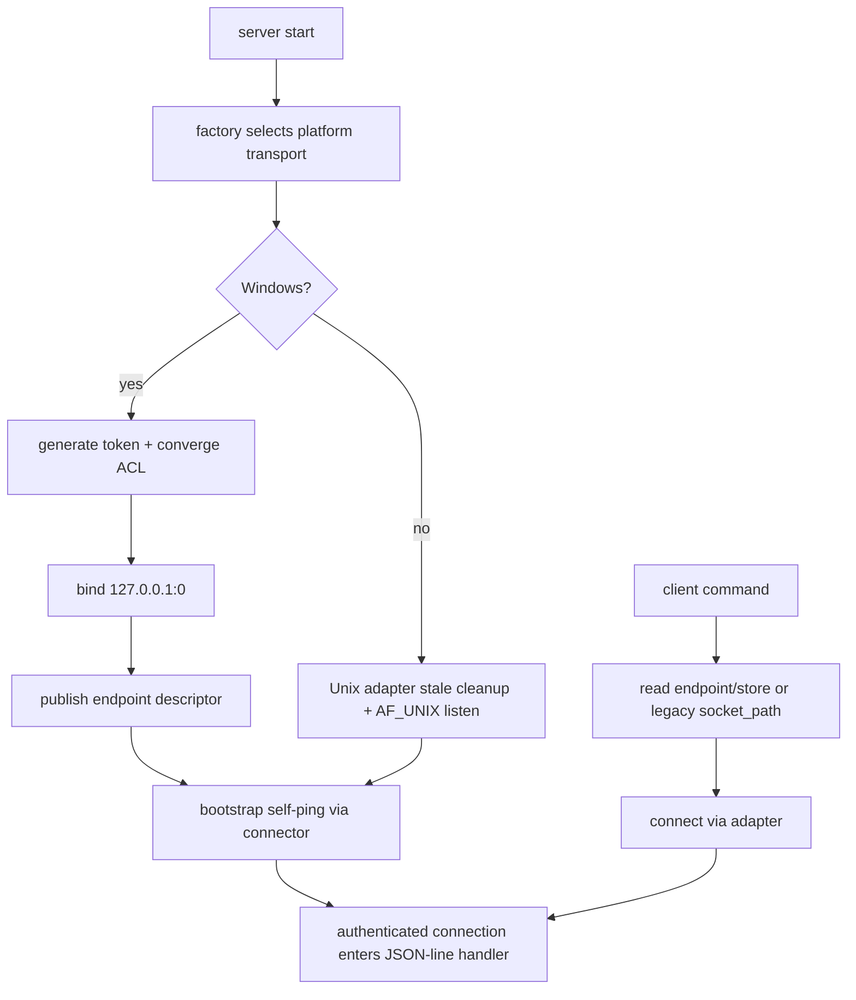

# ccbd-windows-control-plane-transport feature design

## 0. 术语约定

| 术语 | 定义 | 防冲突结论 |
|---|---|---|
| control-plane transport | `ccb`、keeper、sidebar 等客户端连接 `ccbd` RPC server 的传输层。 | 只承载 `ccb<->ccbd` JSON-line RPC bytes，不是 Herdr mux transport，也不是 provider runtime transport。 |
| transport seam | 将 endpoint、connect、listen、accept、bootstrap probe、stale cleanup 和 diagnostics 投影抽象成可替换边界。 | Unix AF_UNIX 与 Windows TCP loopback 必须通过同一 seam 接入，调用层不散落平台分支。 |
| Windows TCP loopback adapter | Native Windows 下的 production control-plane adapter。 | 绑定 `127.0.0.1` + OS 分配端口，只解决控制面可连接性，不创建 Herdr namespace。 |
| same-user token | 当前用户 runtime root 下的随机 token 文件，client 连接后必须先完成 token handshake。 | loopback 不能替代同用户认证；token 明文不得进入日志、doctor、异常、artifact 或 `.codestable` 证据。 |
| endpoint descriptor | 持久化的 control-plane endpoint record。 | Windows canonical authority 是 `kind=tcp_loopback`、host、port、token_ref；旧 `socket_path` 仅为 Unix/legacy 兼容投影。 |

仓库事实：

- 当前 Herdr 分支中 `lib/ccbd/socket_server_runtime/lifecycle.py::listen_server()` 直接使用 `socket.AF_UNIX`，Windows 下抛出 `RuntimeError('unix domain sockets are not supported on this platform')`。
- `lib/ccbd/socket_client_runtime/transport.py` 与 bootstrap probe 仍以 Unix socket path 为控制面入口；`lib/ccbd/control_plane_transport/` 当前只有 stale `__pycache__`，无可用生产 seam/adapter 文件。
- CMD-013 Native Windows transcript 已证明失败发生在 Herdr namespace 创建前，根因是 `ccbd` 控制面无法在 Windows 上启动，不是 Herdr backend client 缺 capability。
- 旧 `windows-rmux-native-backend` 路线已有两个 accepted feature 可参考：`2026-07-20-ccbd-control-plane-transport-seam` 与 `2026-07-20-ccbd-windows-tcp-loopback-transport`；本 feature 参考其已验收边界，但必须在当前 Herdr 分支上 fresh 实现与验证。

## 1. 决策与约束

### 需求摘要

本 feature 在当前 Herdr roadmap 中补回 Native Windows public workflow 的硬前置：为 `ccbd` 控制面恢复 transport seam，并实现 Windows TCP loopback + same-user token adapter。完成后，`ccb` 在 Native Windows x64 上应能启动并连接 `ccbd`，使后续 `ccbd-herdr-namespace-lifecycle` 的 CMD-013 能进入 Herdr namespace 创建、foreground attach、kill/reload 等行为验证。

成功标准：

- Unix/macOS/Linux 继续走 AF_UNIX adapter，既有 Unix socket path、stale cleanup、bootstrap self-ping 语义不漂移。
- Windows 默认选择 `tcp_loopback` adapter，server 绑定 `127.0.0.1:0`，publish endpoint descriptor，client 读取 endpoint + token 后连接。
- token 文件使用强随机值，ACL/权限无法证明收敛时 fail-fast，不发布 endpoint，不降级为无鉴权 listener。可验收的“已证明收敛”定义为：token 文件位于当前用户 runtime root；当前进程用户可读；文件 owner 或 explicit allow identity 与当前用户 SID/用户名匹配；world/Everyone/Users/Authenticated Users 等非当前用户主体没有 read 权限；权限检查结果有结构化 evidence。无法读取 token、无法读取 ACL、ACL runner 不存在/失败、主体解析不可靠或存在非当前用户 read ACE，都归类为 `token-unprotectable` 或 `token-unreadable`，不得视为成功。
- token handshake 在 JSON-line RPC handler 前完成；坏 token、缺 token、token 文件不可读时 handler 不执行，错误可诊断且脱敏。
- bootstrap self-ping 使用同一 endpoint discovery、connect 和 token handshake 路径，不旁路为本地函数调用。
- ping/doctor/startup/mounted payload 可展示 endpoint kind、host/port、token_ref/acl_status 等脱敏 evidence，并保留旧 `socket_path` 兼容字段；Unix payload 的 `socket_path` 保持原值，Windows payload 的 `socket_path` 兼容字段必须存在且为 null/empty，不得用伪 path 表达 TCP endpoint。
- 完成后重跑 focused transport tests，并重跑当前 Herdr CMD-013 transcript，确认 blocker 从 `ccbd exited before ready` 推进到 namespace lifecycle 真实结果。

明确不做：

- 不实现 named pipe adapter；仅保留为后续 documented fallback 条件。
- 不修改 ccbd RPC schema、JSON-line frame、handler dispatch 或业务 op。
- 不修改 Herdr socket client、Herdr namespace lifecycle、provider runtime、completion、recovery、Mobile/Config UI、doctor support tier、package/release/update。
- 不修 Windows pid liveness 或 provider pane restart；若实现暴露这些问题，另行 issue/feature 处理。
- 不执行 git commit、push、release、publish、deploy 或任何生产状态变更。

### 方案深度 pre-pass

候选：

- 只在 `listen_server()` 里加 Windows TCP 分支：改动少，但会把平台、auth、endpoint store、bootstrap 和 diagnostics 分散到调用层，后续很难审计。
- 直接整块套用旧 rmux 提交：省力但当前 Herdr 分支与旧代码形态已不同，`git apply --check` 已在 server runtime 附近冲突。
- 本 feature 方案：按旧 accepted design 的职责边界，手工恢复 seam + Windows TCP adapter，并在当前代码事实上 fresh 验证。

选择本 feature 方案。原因是 control-plane transport 是长期跨平台边界，KISS 不等于把 Windows 特例塞进现有 lifecycle；最小充分改动是恢复 seam 后让 Unix/Windows 各自 adapter 承担平台细节。

### Top 3 风险与缓解

1. **风险：loopback listener 无同用户认证。**  
   缓解：token handshake 在 handler 前完成；token ACL 只在当前用户可读且非当前用户 read 权限被证明不存在时通过，无法证明即 fail-fast；redaction guard 覆盖日志/diagnostics/artifact。
2. **风险：抽 seam 时破坏 Unix AF_UNIX 行为。**  
   缓解：Unix adapter regression 覆盖 stale cleanup、bootstrap self-ping、legacy socket path connect 和 shutdown unlink identity。
3. **风险：把 control-plane 前置混入 Herdr namespace/provider 范围。**  
   缓解：scope guard 只允许 `ccbd/control_plane_transport`、socket client/server runtime seam、control-plane diagnostics 与 focused tests；Herdr/provider/recovery/user-surface 改动视为越界。

### 非显然依赖与关键假设

- 旧 accepted feature 是参考输入，不是 pass 证据；当前分支必须 fresh test。
- 假设 Python 标准库 socket 在目标 Windows x64 上支持 TCP loopback listener/connect；不新增 pywin32。
- 假设 token 文件位于当前用户 runtime root，可通过标准库权限或 `icacls` 等可注入 runner 收敛；无法可靠证明时按 `token-unprotectable`，token 文件存在但当前进程不可读时按 `token-unreadable`，两者都不发布 endpoint。
- 该 feature 是 `ccbd-herdr-namespace-lifecycle` 的实现前置；后者在本 feature accepted 前不得继续 CMD-013 成功路径。

## 2. 名词与编排

### 2.1 名词层

#### 现状

- 控制面 endpoint 由 `PathLayout.ccbd_socket_path` 和旧 `socket_path` 字段表达，无法描述 Windows host/port/token。
- server lifecycle 自己持有 AF_UNIX socket、bound inode、stale cleanup；bootstrap probe 自己创建 AF_UNIX client。
- frame/protocol 层已经接近 transport-neutral：`handle_connection()` 只需要 connection 支持 `settimeout/sendall/recv/close`。

#### 变化

新增或恢复 `lib/ccbd/control_plane_transport/`：

```text
endpoint.py      # endpoint descriptor、legacy socket_path projection、diagnostics redaction
interface.py     # connection/listener/transport/bootstrap probe protocol
unix.py          # 现有 AF_UNIX 行为迁入 adapter
windows_tcp.py   # Windows TCP loopback listener/connector
token_auth.py    # same-user token、ACL convergence、handshake、redaction
endpoint_store.py
factory.py       # platform default selection 与 legacy/store discovery
fake.py          # tests 使用的 in-process transport
```

Endpoint 行为示例：

```python
{
    "kind": "tcp_loopback",
    "host": "127.0.0.1",
    "port": 52341,
    "token_ref": "control-plane-token-7.json",
    "legacy_socket_path": None,
    "generation": 7,
}
```

##### Interface 设计检查

- Module：`ccbd.control_plane_transport` 是新增/恢复的 ccbd 控制面 transport module。
- Interface：caller 只知道 endpoint kind、connect/listen、connection 最小方法、bootstrap probe、diagnostics；ordering 是 listen 前完成 token ACL，handler 前完成 handshake。
- Seam：seam 放在 socket client transport、server lifecycle、bootstrap probe 和 endpoint diagnostics 的共同边界；测试也穿过同一 interface。
- Depth / locality：平台 socket、token、ACL、stale cleanup、endpoint store 复杂度集中在 adapter；删除该 module 会使 Windows/Unix 分支重新散回多个 callers，module 有价值。
- Dependency strategy：Unix 为 in-process OS socket；Windows TCP 为 local-substitutable OS capability；测试用 fake transport 与 fake ACL runner。
- Adapter：production Unix adapter + production Windows adapter + fake/test adapter；不是单 adapter 假 seam。
- Test surface：platform selection、Unix regression、Windows listen/connect/handshake、bootstrap self-ping、diagnostics redaction 和 scope guard。

### 2.2 编排层



流程级约束：

- server publish endpoint 前必须完成 listen readiness；失败时清理本 generation token/endpoint。
- Windows client 顺序固定为 read endpoint -> read token -> TCP connect -> auth prelude -> JSON-line request。
- bad/missing/unreadable token、token ACL failure、endpoint stale 和 port unreachable 都要映射为 control-plane transport error，并保留脱敏 diagnostics。
- shutdown 只清理本次绑定的 endpoint/token/socket identity，不删除未知 generation。
- Unix legacy path 继续可读；Windows 不用 path-like placeholder 伪装 `socket_path`。

### 2.3 挂载点清单

- `lib/ccbd/control_plane_transport/*`：transport seam、Unix adapter、Windows TCP adapter、token auth、endpoint store、fake transport。
- `lib/ccbd/socket_client_runtime/transport.py`：保留 frame helpers，connect 改为 endpoint/transport factory。
- `lib/ccbd/socket_server_runtime/lifecycle.py`、`bootstrap_probe.py`、`loop.py`：listen/accept/bootstrap 通过 transport interface。
- ccbd start/ping/mounted/diagnostics payload：投影 endpoint descriptor，token 全程 redacted。
- `test/test_ccbd_*control_plane*`、`test/test_ccbd_windows_tcp_loopback_transport.py`、import/redaction guards：验证 seam、Windows adapter、Unix regression 和 scope。

### 2.4 推进策略

1. **endpoint contract + factory selection**：定义 endpoint descriptor、legacy projection、platform default selection。退出信号：Windows 选 `tcp_loopback`，Unix 选 `unix_socket`，旧 `socket_path` 兼容。
2. **Unix adapter extraction**：把现有 AF_UNIX connect/listen/stale/bootstrap 行为迁入 Unix adapter。退出信号：Unix socket client/server/bootstrap focused tests 不退化。
3. **token auth + ACL convergence**：实现 token 生成、权限收敛、fingerprint/redaction 和 auth error。退出信号：ACL success/failure、bad/missing/unreadable token、no token leak tests 通过；ACL pass 必须证明当前用户可读且非当前用户 read 权限不存在。
4. **Windows TCP listener/connector**：实现 bind `127.0.0.1:0`、endpoint publish、client connect、shutdown cleanup。退出信号：valid token ping 成功，stale endpoint/port failure 可诊断。
5. **bootstrap self-ping through seam**：bootstrap readiness 走同一 endpoint discovery 和 handshake。退出信号：nonce ping、auth failure、deferred external connection 语义可验证。
6. **diagnostics and scope guard**：start/ping/mounted/doctor 只输出 endpoint/token_ref/acl_status，禁止 handler/schema/Herdr/provider 越界。退出信号：redaction/import/scope guard 通过。
7. **Native Windows CMD-013 retry**：在目标 Windows x64 + Herdr host 上复跑 CMD-013。退出信号：不再因 `unix domain sockets are not supported` 退出，结果推进到 Herdr namespace lifecycle 层。

### 2.5 结构健康度与微重构

评估：

- 文件级：`socket_server_runtime/lifecycle.py` 当前同时负责 AF_UNIX stale cleanup、bind/listen、unlink；迁入 Unix adapter 是本 feature 的边界抽取，不是额外重构。
- 文件级：`socket_client_runtime/transport.py` 混合 connect 与 frame helpers；connect 进 adapter，frame helper 保持稳定。
- 目录级：`ccbd/control_plane_transport/` 是合理归属；不要把 Windows TCP/token helper 放到 `socket_server_runtime` 或 Herdr runtime。
- compound：当前未发现需要覆盖本 feature 的新沉淀；旧 rmux feature design/acceptance 是主要参考。

结论：做 feature 必需的 seam 抽取，不做额外行为等价微重构；若实现发现 pid liveness、doctor support tier 或 namespace lifecycle 必须同步改动，停止并回到 roadmap/issue 拆分。

## 3. 验收契约

### 3.1 关键场景清单

| ID | 输入 / 触发 | 期望可观察结果 | 证据类型 |
|---|---|---|---|
| AC-001 | Unix 平台 client/server/bootstrap | AF_UNIX path、stale cleanup、bootstrap self-ping、shutdown unlink identity 不退化 | unit/regression |
| AC-002 | Windows server listen | 绑定 `127.0.0.1:0`，endpoint descriptor 含 host/port/token_ref/generation | unit/integration |
| AC-003 | ACL 无法证明收敛 | fail-fast，不 publish endpoint，不 fallback 无鉴权 TCP；只有 token 在当前用户 runtime root、当前用户可读、非当前用户 read 权限不存在且 evidence 可解析时才算 ACL pass | unit |
| AC-004 | Windows client valid token | handshake 成功后 JSON-line ping 正常 | unit/integration |
| AC-005 | missing/bad/unreadable token | handler 不执行，连接关闭，错误脱敏可诊断 | unit |
| AC-006 | bootstrap self-ping | 使用同一 transport connect + token handshake + nonce ping | regression |
| AC-007 | diagnostics redaction and legacy projection | log/doctor/ping/mounted/error/artifact 不含 token 明文；ping/doctor/startup/mounted payload 保留 legacy `socket_path` 兼容字段，Unix 为原 path，Windows 为 null/empty | guard/static |
| AC-008 | scope boundary | 不改 RPC schema/handler、Herdr namespace/provider/recovery/user-surface/release | diff review |
| AC-009 | CMD-013 retry | Native Windows 不再失败于 AF_UNIX unsupported，进入 Herdr namespace lifecycle 真实验证 | manual transcript |

### 3.2 明确不做的反向核对项

- 不应出现无 token 的 Windows TCP listener。
- 不应在 token ACL 失败时 fallback 到无鉴权 listener。
- 不应把 token 明文写入 diagnostics、日志、doctor、异常、snapshot、artifact 或 `.codestable`。
- 不应修改 `RpcRequest` / `RpcResponse` schema 或 handler dispatch。
- 不应实现 named pipe production adapter。
- 不应修改 Herdr backend client、namespace lifecycle、provider runtime、recovery、Mobile/Config UI、package/release/update。

### 3.3 Acceptance Coverage Matrix

| Scenario | Covered By Step | Evidence Type | Command / Action | Core? |
|---|---|---|---|---|
| AC-001 Unix regression | S1,S2,S5 | unit/regression | `test/test_ccbd_control_plane_transport_unix.py`, bootstrap/client/server tests | yes |
| AC-002 endpoint publish | S1,S4 | unit/integration | Windows TCP transport tests | yes |
| AC-003 ACL fail-fast | S3 | unit | token auth tests with current-user-only and non-current-user read ACE fixtures | yes |
| AC-004 valid handshake | S4 | unit/integration | TCP ping test | yes |
| AC-005 invalid/unreadable token | S3,S4 | unit | no handler execution assertion | yes |
| AC-006 bootstrap path | S5 | regression | bootstrap probe tests | yes |
| AC-007 redaction and legacy socket_path projection | S1,S3,S6 | guard/static | redaction/import guard + payload compatibility tests | yes |
| AC-008 scope boundary | S6 | diff review | forbidden path/content guard | yes |
| AC-009 CMD-013 retry | S7 | manual transcript | Native Windows x64 CMD-013 | yes |

### 3.4 DoD Contract

| ID | 要求 | 证据 | 阻塞级别 |
|---|---|---|---|
| DOD-DESIGN-001 | design/checklist/review 完整，且对齐 roadmap item `ccbd-windows-control-plane-transport` | design review | blocking |
| DOD-IMPL-001 | endpoint descriptor canonical-first，legacy socket path 兼容 | tests | blocking |
| DOD-IMPL-002 | Unix AF_UNIX 行为不漂移 | regression | blocking |
| DOD-IMPL-003 | Windows TCP loopback + same-user token handshake 在 handler 前完成 | tests | blocking |
| DOD-IMPL-004 | ACL 无法证明收敛或 token 不可读时 fail-fast 且不 publish endpoint；ACL pass evidence 必须证明当前用户可读且非当前用户 read 权限不存在 | tests | blocking |
| DOD-IMPL-005 | bootstrap self-ping 走同一 auth path | regression | blocking |
| DOD-IMPL-006 | diagnostics/log/error/artifact redacts token，ping/doctor/startup/mounted payload 保留 legacy socket_path 兼容字段 | guard/tests | blocking |
| DOD-IMPL-007 | 不改 RPC schema/handler，不实现 named pipe，不改 Herdr/provider/recovery/user-surface/release | guard/review | blocking |
| DOD-QA-001 | QA 覆盖 Unix regression、Windows transport、bootstrap、redaction、CMD-013 retry | QA report | blocking |
| DOD-ACCEPT-001 | acceptance 回写 roadmap item，并解除 `ccbd-herdr-namespace-lifecycle` 的 control-plane 前置阻断 | acceptance report | blocking |

Validation Commands:

| ID | 命令 | 目的 | 核心性 | 失败处理 |
|---|---|---|---|---|
| CMD-001 | `python ".codestable/tools/validate-yaml.py" --file ".codestable/features/2026-08-02-ccbd-windows-control-plane-transport/ccbd-windows-control-plane-transport-checklist.yaml" --yaml-only` | checklist YAML 合法性 | core | fix-or-block |
| CMD-002 | `python ".codestable/tools/validate-yaml.py" --file ".codestable/roadmap/windows-native-herdr-ccb/windows-native-herdr-ccb-items.yaml"` | roadmap items 合法性 | core | fix-or-block |
| CMD-003 | `python -m pytest -q test/test_ccbd_control_plane_transport_unix.py test/test_ccbd_control_plane_transport_fake.py` | seam + Unix/fake regression | core | fix-or-block |
| CMD-004 | `python -m pytest -q test/test_ccbd_windows_tcp_loopback_transport.py` | Windows TCP loopback、token ACL、handshake、endpoint store | core | fix-or-block |
| CMD-005 | `python -m pytest -q test/test_ccbd_bootstrap_probe.py test/test_ccbd_socket_server_loop.py test/test_ccbd_socket_client.py` | bootstrap/server/client regression | core | fix-or-block |
| CMD-006 | `python -m pytest -q test/test_v2_start_service.py -k "ccbd or endpoint or ping or socket"` | start/ping/endpoint diagnostics 抽样 | core | document-baseline |
| CMD-007 | `python -m pytest -q test/test_ccbd_windows_tcp_loopback_import_guard.py` | no token leak / no named pipe / no handler schema change / scope guard | core | fix-or-block |
| CMD-008 | `MANUAL Native Windows x64: rerun CMD-013 ccb namespace create, foreground attach, kill, reload, restart unsupported/deferred evidence on Herdr backend` | 证明控制面 blocker 已解除并推进到 Herdr lifecycle | core | blocked-if-no-host-or-herdr |

Required Artifacts：design、checklist、design-review、transport seam/adapter diff、Unix/fake/Windows tests、bootstrap regression、diagnostics redaction guard、scope guard、CMD-013 transcript、QA、acceptance、items.yaml 回写。

### 3.5 自我批判结论

- 可证伪性：每条核心成功标准都有 unit、guard 或 CMD-013 transcript。
- 步骤原子性：endpoint/factory、Unix extraction、token auth、Windows listener、bootstrap、diagnostics、manual retry 分离。
- 最弱依赖：token ACL 收敛最容易误判；已前置为独立 step 和 fail-fast AC。
- 证据完整性：覆盖 Unix 不退化、Windows success/failure、bootstrap、redaction 和 scope。
- 基线可执行性：部分 focused tests 可能需随实现新增；实现前先跑对应预检并区分 missing-test、既有红灯和本次引入红灯。
- 交付物可核验性：acceptance 可从 transport package、socket runtime seam、tests、guard、CMD-013 transcript 和 roadmap 回写反查。
- 清洁度规则：不新增调试输出、临时 TODO/FIXME、注释掉代码、死 import；不记录 token 明文。

## 4. 与项目级架构文档的关系

- 本 feature 插入 `windows-native-herdr-ccb` 的 `herdr-backend-client` 与 `ccbd-herdr-namespace-lifecycle` 之间，专门承接 Native Windows `ccb->ccbd` control-plane hard gate。
- 它参考旧 `windows-rmux-native-backend` 中已 accepted 的 seam/TCP transport 设计与验收，但当前 Herdr roadmap 必须重新 design-review、QA、acceptance。
- 后续 `ccbd-herdr-namespace-lifecycle` 只消费可用 control-plane endpoint；若还需要修改 transport，应回到本 feature 或另开 issue，不在 namespace feature 中混入。
