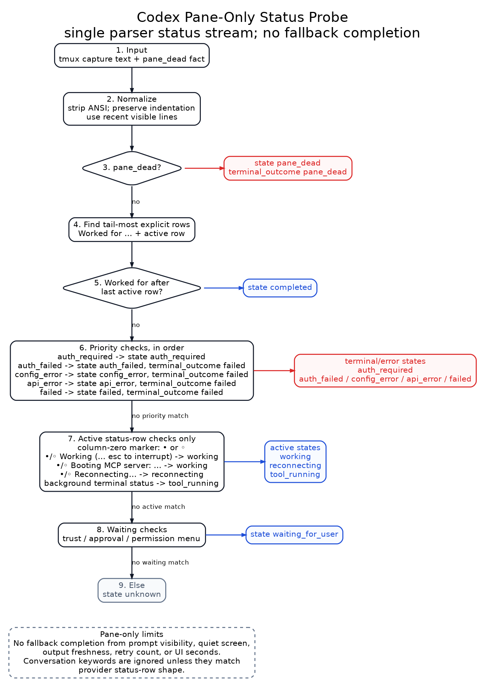

# Codex Pane Status Probe Spike

Date: 2026-06-29
Role: Readiness spike / implementation plan
Status: Proposed
Read when: Building or validating tmux pane-based Codex status observation
for `AgentRuntimeStatus`, sidebar, or CCB Mobile.

## Initial Demo Implementation

Date: 2026-06-29

The first pane-only probe demo exists at:

```text
scripts/probe_codex_pane_status.py
```

Focused unit tests cover Codex working/status-line parsing, keyword
interference avoidance for conversation-body text, background-terminal
classification, provider error text, trust/waiting prompts, auth-required login
menus, auth/API/config failures, pane death, reconnecting text, `Worked for`
terminal summaries, no-quiet-completion behavior, adaptive active/base
sampling, and prompt-send blocking while waiting for user input:

```text
test/test_codex_pane_status_probe.py
```

Initial real runs under `/home/bfly/yunwei/test_ccb2` used a dedicated tmux
socket/session and isolated or test Codex homes. Observed result:

- `startup-idle` with isolated Codex home produced stable
  `waiting_for_user` from the Codex sign-in screen.
- `quick-turn` with test home also stopped at `waiting_for_user`; the probe now
  blocks prompt injection while Codex is waiting for login/trust input instead
  of corrupting the menu and causing pane death.
- A trust-menu false idle was corrected: `Do you trust the contents of this
  directory?` with `Press enter to continue` must be `waiting_for_user`, not
  input-ready idle.
- A no-login false generic waiting state was corrected: the Codex login menu
  (`Sign in with ChatGPT`, `Provide your own API key`) is now
  `auth_required`, not generic `waiting_for_user`.
- The probe now supports `--codex-work-dir` so artifacts stay disposable while
  Codex can run from an already trusted test directory.
- Direct pane stimulus sends at most one prompt and one submit key. It does not
  perform post-send self-healing or retry Enter; status authority remains pane
  observation.
- Current state catalog can be printed with:

```bash
python scripts/probe_codex_pane_status.py --print-status-catalog
```

Current minimal parser revision, 2026-06-29:



- Removed visible input prompts as a state signal. Prompt/input-ready copy is
  not `idle`; prompt-only panes classify as `unknown`.
- Removed `DynamicStatusResolver` fallback inference. Fresh `pipe-pane` output
  or changing screen content no longer becomes `streaming_answer`, and quiet
  active history no longer becomes `stalled`.
- Removed Codex UI timers from status. `Working (28s ...)`,
  `Running (1m 3s ...)`, and `Reconnecting... 2/5 (16s ...)` are recognized
  only as status text. The numbers do not enter `PaneStatus`.
- Active `working`, `tool_running`, and `reconnecting` states are recognized
  from Codex status-line shaped rows only, for example a column-zero
  `• Working (... esc to interrupt)` or
  `•/◦ Booting MCP server: ... (... esc to interrupt)` line. Conversation
  text, explanatory bullets, or indented blocks containing the same keywords
  stay `unknown`.
- `Reconnecting...` is the state signal. Retry count (`2/5`) and the visible
  `(16s ... esc to interrupt)` text are not lifecycle timing signals.
- `Worked for ...` is a sufficient terminal signal, but its duration is not
  used as the probe's turn timer. The probe timer is always
  `prompt_sent_at_s -> terminal_at_s` or `now`.
- Without `Worked for ...`, pane-only status does not infer completion. A turn
  may remain `unknown` after active output stops; that is recorded as an
  algorithm limit rather than promoted to completed.
- Removed built-in `scenario`, fault injection, ESC injection, and pane-death
  action branches from the main probe. The probe may launch/observe a pane and
  optionally send one prompt; fault/interrupt scenarios must be driven by an
  external harness or manual tmux action.
- Removed `confidence`, `last_output_age_s`, prompt-derived `idle`,
  `streaming_answer`, `stalled`, queued hard-state parsing,
  `Conversation interrupted` as a state, Codex UI timer fields, reconnect retry
  fields, `pane_quiet_after_active` completion, and post-send Enter retry.
- Removed the historical `raw_status`/published-status dual track. The demo now
  emits one parser status stream; transition metrics are derived from that
  stream only.
- Removed duplicated active-line regex bookkeeping after the status-row shape
  matcher became the single working-line authority.
- The explicit current state set is `completed`, `working`, `tool_running`,
  `waiting_for_user`, `auth_required`, `auth_failed`, `api_error`,
  `config_error`, `reconnecting`, `failed`, `pane_dead`, and `unknown`.

Latest verification after this revision:

- Unit test: `python -m pytest -q test/test_codex_pane_status_probe.py`
  returned `28 passed`.
- Syntax check: `python -m py_compile scripts/probe_codex_pane_status.py`
  passed.
- Real quick-turn artifact after status-line hardening and single-status-stream
  cleanup:
  `/home/bfly/yunwei/test_ccb2/codex-pane-status-probe/run-20260629T080801Z-3478011/artifacts/run.json`.
  Observed `unknown -> working -> unknown`, where `working` came from the
  current Codex status-line shape, including `◦/• Booting MCP server...`, and
  conversation-body bullets stayed non-authoritative. Because the pane did not
  show `Worked for ...`, `terminal_state`, `terminal_outcome`, and
  `terminal_reason` remained `null`. Capture average was 1.4 ms, p95 1.6 ms,
  max 1.8 ms, and the 1 s flicker count was 0.
- Coworker review `job_b10ad02f41f4` scored the current worktree at
  simplicity `9.5/10` and accuracy `9/10`, found no required branch/fallback
  deletions, and approved marking the pane-only Codex status demo v1 as
  converged. Remaining suggestions are non-blocking cleanup candidates:
  combine the two tail scans, further tighten waiting marker shape after more
  fixtures, and split driver/metrics only if the demo grows beyond Codex.

Authenticated direct-pane runs before the minimal parser revision:

- Work dir: `/home/bfly/yunwei/test_ccb2`
- Provider home: `/home/bfly/yunwei/test_ccb2/source_home/.codex`
- Probe method: dedicated tmux socket/session, `pipe-pane` attached,
  `capture-pane -p -J -S -80`, screen-tail hash change detection, adaptive
  sampling.

| Scenario | Artifact | Observed states | Final | Capture cost |
| :--- | :--- | :--- | :--- | :--- |
| startup-idle | `/home/bfly/yunwei/test_ccb2/codex-pane-status-probe/run-20260629T033408Z-903072/artifacts/run.json` | `unknown -> streaming_answer -> working -> idle` while Codex booted MCP server | `idle` | avg 1.9 ms, max 5.8 ms |
| quick-turn | `/home/bfly/yunwei/test_ccb2/codex-pane-status-probe/run-20260629T033617Z-994573/artifacts/run.json` | `idle -> working -> idle` | `idle` | avg 1.4 ms, max 1.9 ms |
| streaming-answer | `/home/bfly/yunwei/test_ccb2/codex-pane-status-probe/run-20260629T033646Z-1009755/artifacts/run.json` | `idle -> working -> idle`; current Codex exposed a working status line through the long text response | `idle` | avg 1.5 ms, max 2.8 ms |
| long-tool | `/home/bfly/yunwei/test_ccb2/codex-pane-status-probe/run-20260629T033731Z-1045544/artifacts/run.json` | `idle -> working -> tool_running -> working -> idle` | `idle` | avg 1.5 ms, max 2.3 ms |
| interrupt | `/home/bfly/yunwei/test_ccb2/codex-pane-status-probe/run-20260629T033822Z-1071968/artifacts/run.json` | `idle -> working -> idle`; screen showed `Conversation interrupted` before returning to input-ready prompt | `idle` | avg 1.5 ms, max 2.3 ms |
| pane-death | `/home/bfly/yunwei/test_ccb2/codex-pane-status-probe/run-20260629T033925Z-1113826/artifacts/run.json` | startup active states followed by `pane_dead` after killing the pane | `pane_dead` | avg 2.6 ms, max 12.5 ms |
| api-failure | `/home/bfly/yunwei/test_ccb2/codex-pane-status-probe/run-20260629T033946Z-1125388/artifacts/run.json` | earlier local network-proxy lane produced generic `failed`; equivalent request-route text is now classified as `api_error` | `failed` in old artifact | avg 2.2 ms, max 5.7 ms |
| auth-required | `/home/bfly/yunwei/test_ccb2/codex-pane-status-probe/run-20260629T050952Z-473721/artifacts/run.json` | isolated home without `auth.json` showed the Codex login menu | `auth_required` | avg 1.5 ms, max 1.9 ms |
| api-config-failure | `/home/bfly/yunwei/test_ccb2/codex-pane-status-probe/run-20260629T051127Z-539962/artifacts/run.json` | run-local bad custom provider route produced `api_error` from `error sending request for url` | `api_error` | avg 1.5 ms, max 2.6 ms |

Current evidence supports the user's observation that this Codex version
usually shows an explicit active line such as
`Working/Running (... esc to interrupt)`, `background terminal running`, or
`Reconnecting...` while active. The current parser does not promote
screen/pipe freshness or pane quiet to an active or terminal state.

Stress and stability pass before the minimal parser revision, 2026-06-29:

- Added `--event-mode transitions` so the probe can write only status changes
  to `events.jsonl` while retaining every capture in `snapshots.jsonl`.
- Added metrics for capture p95, samples per second, state dwell time,
  transition counts, and short-window flicker transitions.
- Found a real long-stream edge case: Codex can display a bottom input prompt
  while the previous answer is still updating above it. The minimal parser
  treats prompt visibility as no state signal; this edge becomes either an
  explicit active marker if Codex shows one, or `unknown` if no marker is
  visible.
- Removed burst sampling tied to fallback inference. Continuous explicit active
  states use the active interval, and all other states use the base interval.
- Added parsing for Codex terminal summaries shaped like `Worked for 4s`.
  This is a sufficient terminal signal: when it appears, the turn is treated as
  completed even if no active sample was observed or stale `Working (...)` text
  is still visible above it. The published state is `completed` with
  `terminal_outcome=completed`. The visible `4s` is not used for lifecycle
  timing.
- Removed input-prompt visibility as a completion signal. Codex may accept or
  queue input while `Working`, `Reconnecting`, or background tools are still
  active. Without `Worked for ...`, pane-only observation now leaves the turn
  non-terminal instead of inferring completion from quiet output.
- Reconnect lines such as `Reconnecting... 2/5 (16s • esc to interrupt)` are
  active/recoverable even when the next line says
  `Stream disconnected before completion`. They classify as `reconnecting`.
  Retry count and visible seconds are ignored by lifecycle timing.

| Scenario | Artifact | Observed sequence | Final | Samples/s | Capture p95 | Flicker |
| :--- | :--- | :--- | :--- | ---: | ---: | ---: |
| startup-idle | `/home/bfly/yunwei/test_ccb2/codex-pane-status-probe/run-20260629T051816Z-818296/artifacts/run.json` | `unknown -> idle -> working -> idle` during Codex startup/loading | `idle` | 5.185 | 2.0 ms | 0 |
| quick-turn | `/home/bfly/yunwei/test_ccb2/codex-pane-status-probe/run-20260629T053003Z-1299201/artifacts/run.json` | `working -> idle` | `idle` | 1.965 | 1.8 ms | 0 |
| long streaming text | `/home/bfly/yunwei/test_ccb2/codex-pane-status-probe/run-20260629T052118Z-939375/artifacts/run.json` | held `working` for the full 35 s observation window while output continued | `working` | 3.321 | 2.1 ms | 0 |
| long tool, incomplete window | `/home/bfly/yunwei/test_ccb2/codex-pane-status-probe/run-20260629T052205Z-963950/artifacts/run.json` | `working -> tool_running -> working` | `working` | 3.315 | 3.1 ms | 0 |
| long tool, complete window | `/home/bfly/yunwei/test_ccb2/codex-pane-status-probe/run-20260629T052248Z-1002620/artifacts/run.json` | `working -> tool_running -> working -> idle` | `idle` | 3.139 | 1.8 ms | 0 |
| bad provider route | `/home/bfly/yunwei/test_ccb2/codex-pane-status-probe/run-20260629T052413Z-1060281/artifacts/run.json` | `working -> api_error` | `api_error` | 1.807 | 1.8 ms | 0 |
| no-login isolated home | `/home/bfly/yunwei/test_ccb2/codex-pane-status-probe/run-20260629T052438Z-1073192/artifacts/run.json` | `unknown -> auth_required` | `auth_required` | 1.429 | 1.8 ms | 0 |
| ESC during tool | `/home/bfly/yunwei/test_ccb2/codex-pane-status-probe/run-20260629T052456Z-1082370/artifacts/run.json` | `working -> tool_running`; ESC effect `background_tool_still_running_after_escape` | `tool_running` | 3.329 | 1.9 ms | 0 |
| pane death | `/home/bfly/yunwei/test_ccb2/codex-pane-status-probe/run-20260629T052538Z-1119625/artifacts/run.json` | `unknown -> idle -> working -> pane_dead` | `pane_dead` | 1.909 | 2.0 ms | 0 |

Additional quick-turn check:

- `/home/bfly/yunwei/test_ccb2/codex-pane-status-probe/run-20260629T063903Z-4042373/artifacts/run.json`
  completed as `working -> idle`, but the captured pane did not contain
  `Worked for ...`. The parser and unit fixtures cover that terminal summary;
  a live artifact remains a follow-up capture target for the Codex rendering
  mode that shows it.

The most important accuracy change from this pass is that a visible input
prompt is not a completion signal. Completion is now only Codex self-report
(`Worked for ...`) or explicit terminal/failure pane evidence. Quiet output is
not a completion signal. Historical stress artifacts remain useful for capture
cost and active-marker behavior, but their old `idle` terminalization is
superseded.

Status list after auth/API refinement:

| State | Meaning |
| :--- | :--- |
| `completed` | Codex shows a sufficient terminal summary such as `Worked for ...`. |
| `working` | Codex reports model/runtime work, usually with a visible elapsed timer. |
| `tool_running` | A foreground or background tool/terminal is visibly running. |
| `waiting_for_user` | Trust, approval, permission, or menu confirmation is required. |
| `auth_required` | Codex is not logged in or is waiting for sign-in/API-key setup. |
| `auth_failed` | Authentication or API-key rejection is visible. |
| `api_error` | Provider/API/model/rate-limit/server/route failure is visible. |
| `config_error` | Provider configuration is visibly invalid. |
| `reconnecting` | Codex reports stream retry/reconnect; short-term recoverable active state. |
| `failed` | Generic visible failure not classified above. |
| `pane_dead` | tmux pane/server is gone. |
| `unknown` | Evidence is empty, contradictory, or not classified. |

Follow-up timing and ESC evidence:

- Each snapshot and status event now includes `turn_timing`, which separates
  the probe's submit-clock timer from raw pane state:
  `display_elapsed_s`, `display_elapsed_source=probe_submit_clock`,
  `turn_elapsed_s`,
  `first_active_latency_s`, `last_active_elapsed_s`, `terminal_elapsed_s`,
  `terminal_state`, and `terminal_outcome`.
- Summary output includes the same turn timing so a UI can render a dynamic
  "submitted -> active -> terminal" elapsed clock without re-reading all
  snapshots.
- ESC injection is no longer part of the minimal probe. Interruption lanes
  should send ESC from an external harness or manual tmux action while this
  probe continues observing the pane.
- `Conversation interrupted` is no longer treated as a current state. It is
  historical pane text unless a current hard marker also appears.
- Historical ESC test artifacts before UI-timer removal:
  - `/home/bfly/yunwei/test_ccb2/codex-pane-status-probe/run-20260629T040035Z-1977171/artifacts/run.json`
    sent ESC at 2.002 s during a text turn and observed
    `interrupt_effect=continued_to_completion_after_escape`,
    `terminal_elapsed_s=4.18`.
  - `/home/bfly/yunwei/test_ccb2/codex-pane-status-probe/run-20260629T040108Z-1996210/artifacts/run.json`
    sent ESC at 4.074 s during a short tool-oriented prompt and observed
    `interrupt_effect=continued_to_completion_after_escape`,
    `terminal_elapsed_s=6.248`.
  - `/home/bfly/yunwei/test_ccb2/codex-pane-status-probe/run-20260629T035713Z-1842265/artifacts/run.json`
    sent ESC while a long command showed `1 background terminal running`; after
    ESC, the pane displayed `/ps to view · /stop to close` and the turn
    continued to completion. This is a distinct ESC effect from text
    interruption and should remain `tool_running`, not idle.
  - `/home/bfly/yunwei/test_ccb2/codex-pane-status-probe/run-20260629T044450Z-3669607/artifacts/run.json`
    used the now-removed status-elapsed trigger. The turn continued as a
    background tool to completion with
    `interrupt_effect=background_tool_continued_to_completion`. The artifact is
    historical evidence only; visible Codex UI seconds are not current probe
    timing authority.
  - `/home/bfly/yunwei/test_ccb2/codex-pane-status-probe/run-20260629T044341Z-3621256/artifacts/run.json`
    attempted `interrupt-after-active` for a long text turn, but the model
    completed before the old status-elapsed trigger fired. This is also
    historical evidence only.

Current ESC conclusion:

- A sent ESC is not itself a terminal state. The pane must still be observed
  until Codex shows a current hard marker such as `failed`, `pane_dead`, or
  `Worked for ...`.
- Fixed-delay ESC is too weak for this lane. Real interruption testing should
  prefer probe-observed active duration such as `active-elapsed >= Ns`.
- For tool-running turns, ESC can expose a foreground prompt while a background
  terminal remains active. The status should stay `tool_running` until the
  background terminal evidence clears.
- The latest runs did not reliably reproduce a current hard interruption
  marker. Visible `Conversation interrupted` copy alone is not a current state.

Follow-up CCB-managed pane run:

- Project:
  `/home/bfly/yunwei/test_ccb2/codex-pane-status-ccb`
- Config: one managed `agent1:codex` pane started through
  `/home/bfly/yunwei/ccb_source/ccb_test`.
- Probe mode: existing pane observation against
  `/home/bfly/yunwei/test_ccb2/codex-pane-status-ccb/.ccb/ccbd/tmux.sock`,
  pane `%1`, 100 ms capture interval, no `pipe-pane` freshness.
- Artifact summary:
  `/home/bfly/yunwei/test_ccb2/codex-pane-status-probe/run-20260629T031029Z-4165916/artifacts/run.json`.
- Observed sequence for a managed pane running a visible shell loop:
  `idle -> working -> tool_running -> working -> idle`.
- Counts: `idle=362`, `working=73`, `tool_running=96`; capture average
  duration was about 1.5 ms and max was about 2.9 ms on the test host.
- ProjectView ended at `agent1 idle codex_hook provider_stop`.

The first CCB-managed observation exposed two parser issues that were corrected
before the successful run:

- `permissions: YOLO mode` in the Codex banner must not be parsed as
  `waiting_for_user` when a current idle prompt is visible.
- A current `• Working (... esc to interrupt)` status line immediately before
  the bottom input prompt must win over the bottom prompt; older working text
  farther above the latest prompt remains stale.

## Purpose

Before wiring more status parsing into `project_view`, build an independent
probe that runs Codex in a disposable tmux pane and measures what status can be
recovered from pane facts, pane output, snapshots, and process facts.

The spike should answer three practical questions:

- which Codex states can be inferred accurately from tmux pane observation;
- which pane acquisition method is fastest and least noisy for each state;
- what structured evidence should flow into `AgentRuntimeStatus` without
  making provider pane text the control-plane authority.

## Boundary

This is an observation spike, not a new execution authority.

- Runtime work happens in `/home/bfly/yunwei/test_ccb2` or a child directory
  under it, never inside the source checkout.
- The source checkout may own the probe script later, but the script must
  create disposable work roots, tmux sockets, sessions, logs, and provider homes
  outside `/home/bfly/yunwei/ccb_source`.
- The probe must not scan global tmux sessions, global provider homes, or
  unrelated CCB projects.
- The probe must not mutate the user's global Codex config unless an explicit
  real-account lane opts into inherited credentials.
- Probe output is evidence for display status only. It must not complete,
  fail, cancel, retry, or dead-letter CCB jobs.
- Demo scenario prompts are direct tmux pane stimulus only. They exist to make
  Codex CLI change state under observation and must not be interpreted as CCB
  ask/job state.

This keeps the work aligned with the existing project rule: provider session
files, tmux pane facts, pid files, and pane output are evidence or residue, not
project/runtime authority.

## Candidate Program Surface

Candidate source-owned entrypoint:

```text
scripts/probe_codex_pane_status.py
```

Candidate runtime layout:

```text
/home/bfly/yunwei/test_ccb2/codex-pane-status-probe-<timestamp>/
  work/
  codex-home/
  tmux.sock
  artifacts/
    run.json
    events.jsonl
    snapshots.jsonl
    pane-output.raw.log
    pane-output.normalized.log
    captures/
    metrics.json
```

Candidate CLI:

```bash
python scripts/probe_codex_pane_status.py \
  --work-root /home/bfly/yunwei/test_ccb2/codex-pane-status-probe \
  --provider-home-mode test-home \
  --codex-work-dir /home/bfly/yunwei/test_ccb2 \
  --prompt 'Reply with exactly: done.'

python scripts/probe_codex_pane_status.py \
  --work-root /home/bfly/yunwei/test_ccb2/codex-pane-status-probe \
  --tmux-socket /path/to/tmux.sock \
  --pane-id %1 \
  --sample-interval-ms 750 \
  --active-sample-interval-ms 300
```

The program should be useful before any `project_view` integration exists. It
should print a final redacted JSON summary to stdout and write fuller artifacts
under the disposable work root.

## Runtime Setup

For each run:

1. Create a fresh work directory under `/home/bfly/yunwei/test_ccb2`.
2. Start a dedicated tmux server with `tmux -S <work>/tmux.sock`.
3. Start one session and one pane running Codex.
4. Record pane identity with `list-panes` format fields.
5. Attach `pipe-pane` before sending prompts where possible.
6. Drive scenarios with `tmux send-keys` or paste plus Enter.
7. Capture periodic snapshots and final scrollback.
8. Kill only the dedicated tmux session/server during cleanup.

Recommended `list-panes` fields:

```text
#{pane_id}
#{pane_pid}
#{pane_dead}
#{pane_active}
#{pane_current_command}
#{pane_current_path}
#{pane_width}
#{pane_height}
#{window_id}
#{session_id}
```

Provider credential modes:

| Mode | Use |
| :--- | :--- |
| `isolated` | Default. Uses an isolated provider home and skips real-provider scenarios if credentials are absent. |
| `test-home` | Uses `/home/bfly/yunwei/test_ccb2/source_home` or another explicit test home. |
| `inherit` | Opt-in real-account lane for manual validation; artifacts must be treated as private and redacted before committing fixtures. |

## Observation Channels

Use multiple channels because no single tmux primitive is sufficient.

| Channel | Role | Notes |
| :--- | :--- | :--- |
| `pipe-pane` output | Low-latency output stream | Primary signal for "new output arrived"; contains control sequences and may need normalization. |
| `capture-pane` current screen | Current status and visible provider text | Best for TUI state after repaint; prompt visibility is not a state signal. |
| `capture-pane` scrollback | Resync and stale-scrollback tests | Used to measure stale active text; stale suppression must not rely on prompt visibility. |
| `list-panes` facts | Pane liveness and foreground command | Cheap liveness evidence; not execution-state proof by itself. |
| Process tree from `pane_pid` | Diagnostic fallback | Bounded to the test pane; never global. |
| Optional Codex JSONL oracle lane | Event-shape comparison | `codex exec --json` can validate event semantics for similar prompts, but it is not the pane source. |

Capture variants to compare:

```bash
tmux -S "$SOCKET" capture-pane -t "$PANE" -p -J -S -200
tmux -S "$SOCKET" capture-pane -t "$PANE" -p -e -S -80
tmux -S "$SOCKET" capture-pane -t "$PANE" -p -S -20 -E -
```

The spike should record which variant best preserves Codex status lines, which
variant is easiest to normalize, and which is cheapest enough for repeated
ProjectView refreshes.

## Status Model Under Test

The probe should emit status snapshots that can map into
`AgentRuntimeStatus`, but with explicit evidence:

```json
{
  "state": "working",
  "source": ["tmux_pipe", "capture_current_screen"],
  "provider": "codex",
  "pane_id": "%12",
  "pane_dead": false,
  "foreground_command": "codex",
  "last_output_at": "2026-06-29T00:00:00Z",
  "stable_since": "2026-06-29T00:00:00Z",
  "matched_patterns": ["codex_working_line"],
  "notes": ["prompt_visibility_not_a_state_signal"]
}
```

Current states to test:

| State | Meaning |
| :--- | :--- |
| `completed` | Codex shows an explicit terminal summary such as `Worked for ...`. |
| `working` | Model/tool work appears active. |
| `tool_running` | A command/tool/background terminal is visibly running. |
| `waiting_for_user` | Approval, trust, permission, or user input is required. |
| `reconnecting` | Stream/network recovery is visible. |
| `auth_required` | Login/API-key setup is required. |
| `auth_failed` | Authentication or API-key rejection is visible. |
| `api_error` | Provider/API/model/rate-limit/server/route failure is visible. |
| `config_error` | Provider configuration is visibly invalid. |
| `failed` | Provider/API/auth/model/runtime failure is visible. |
| `pane_dead` | The observed pane died or changed ownership. |
| `unknown` | Evidence is insufficient or contradictory. |

Uncertain text must remain `unknown`; the parser no longer emits a separate
confidence field.

## Scenario Matrix

Start with Codex only. Add Claude later after Codex observation is understood.

| Scenario | Target State | Probe Action | Acceptance |
| :--- | :--- | :--- | :--- |
| preflight | `unknown` or skip | Check `codex --version`, tmux, credentials mode | Clear skip reason without side effects. |
| startup-baseline | `unknown`, `auth_required`, or `working` | Launch Codex and wait for prompt/status baseline | Snapshot identifies pane alive and current screen without using prompt as idle. |
| quick-turn | `working -> unknown` or `working -> completed` | Send a short prompt | First output latency, working evidence, and explicit terminal reason when present are recorded. |
| long-tool | `tool_running` / `working` | Ask Codex to run a visible multi-second shell loop | Output stream and status snapshots agree that work is active. |
| approval-wait | `waiting_for_user` | Run with approval/trust mode that requires confirmation | Probe detects waiting state without treating it as idle. |
| queued-after-tool | `unknown` with queued text evidence | Trigger "messages after next tool call" style text when reproducible | Probe records exact evidence without promoting it to a hard state. |
| interrupt | `working -> unknown`, `working -> completed`, or hard failure | Send Escape/Ctrl-C during active work from an external harness | Probe records visible current evidence without promoting `Conversation interrupted` copy to state. |
| api-failure | `failed` or `reconnecting` | Use invalid auth/model or a local fault proxy | Failure remains visible until next turn/runtime reset. |
| pane-death | `pane_dead` | Kill only the dedicated pane/session during observation | Probe reports pane death and stops parsing stale output. |
| stale-scrollback | `working` or `unknown` | Leave old `Working (...)` text in captured tail after completion | Probe records this as a pane-only limitation unless `Worked for ...` appears after active text. |
| resize-repaint | unchanged | Resize pane during working/unknown states | Repaint/control sequences do not cause false transitions. |

Each scenario should produce a machine-readable summary with:

- expected state sequence;
- observed state sequence;
- first-output latency;
- capture cost and count;
- mismatches and raw evidence pointers;
- redaction status.

## Parsing Policy

Codex pane parsing should be conservative:

- Prefer current-screen/status-line evidence over retained scrollback.
- Active status markers must match provider-status-line shape. Keywords in
  normal conversation text are not status.
- Do not treat visible prompts as idle, completion, or stale-scrollback
  suppressors.
- Treat `pipe-pane` as output freshness metadata, not by itself as semantic
  state or completion evidence.
- Recognize only provider-specific patterns that are observed in the spike
  artifacts and are stable enough for a source-side adapter.
- Store matched pattern names and compact details, not prompt or reply bodies.
- Put uncertain provider copy into `notes` or `detail`, not into hard state
  transitions.

## Pane-Only Limits

The demo intentionally leaves these cases as limits instead of hiding them
behind fallback states:

- If model output prints an exact Codex status-line-shaped row at column zero,
  pane-only capture cannot prove whether it is UI chrome or conversation body.
- If an old active status line remains visible and no later `Worked for ...`
  summary appears, pane-only capture cannot prove completion.
- A quiet pane, unchanged screen, or stopped `pipe-pane` output is not a
  completion signal.
- A visible input prompt is not an idle or completed signal because Codex may
  accept or queue input while work continues.
- `Conversation interrupted` copy is historical text unless a current hard
  marker such as `failed`, `pane_dead`, or `Worked for ...` is also visible.
- `Reconnecting...` is only the current recoverable active state; pane text
  alone cannot predict whether it will recover or fail later.
- The probe's elapsed turn display uses its submit clock. Codex UI seconds are
  parsed only as part of a visible status-line shape, not as timing authority.

Candidate Codex patterns to validate:

- `Working (...)`
- `Booting MCP server: ... (... esc to interrupt)`
- `esc to interrupt`
- background terminal count and `/ps to view`
- stream disconnected / reconnecting copy
- auth, model, rate-limit, or provider API failure text
- `Worked for ...` terminal summary

## Optimization Questions

The spike should produce enough metrics to choose a fast production path:

- Can `pipe-pane` be the primary low-latency source for output freshness?
- How often does `capture-pane` need to run to recover current status lines?
- Which capture mode gives useful status while minimizing bytes and parsing
  cost?
- Can a per-pane tail hash avoid repeated parsing when the screen is unchanged?
- What minimum capture interval keeps ProjectView cheap enough with many
  agents?
- Does process-tree sampling add value beyond pane liveness and output
  freshness?
- What is the minimum state needed by CCB Mobile to show a good header without
  parsing provider text locally?

Initial performance targets for the spike, to revise after measurement:

- `pipe-pane` output visible in artifacts within 500 ms of terminal output;
- current-screen capture p95 under 100 ms on the test host;
- no more than one status capture per active pane per 1-2 seconds in steady
  state;
- zero capture calls while fresh hook/app-server evidence is already
  authoritative;
- no global tmux or provider-home scan.

## Promotion Path

Do not jump straight from the probe to production parsing. Use this sequence:

1. Land the independent probe and scenario artifacts in the test workspace.
2. Review which states are reliably observable from pane evidence.
3. Commit only sanitized fixtures needed for unit tests.
4. Add provider-specific parser tests for those fixtures.
5. Feed parsed evidence into the generic `AgentRuntimeStatus` resolver.
6. Publish stabilized status through `project_view`.
7. Update sidebar and mobile gateway clients to consume the structured status.

The probe can remain as a diagnostics tool after production integration, but
production `project_view` should use bounded, cached pane observation rather
than running scenario probes.

## Acceptance Criteria

The spike is complete when:

- a disposable test run can launch Codex in a dedicated tmux pane outside the
  source checkout;
- `pipe-pane`, `capture-pane`, `list-panes`, and optional process-tree evidence
  are all recorded with timestamps;
- at least startup-baseline, quick-turn, long-tool, interrupt, pane-death, and
  stale-active-tail scenarios have redacted artifacts or recorded limitations;
- approval-wait and API-failure either pass or have explicit skip reasons tied
  to missing credentials/configuration;
- the summary identifies which states are directly visible from pane
  observation alone;
- the next `AgentRuntimeStatus` parser/test slice has concrete fixtures and
  no longer depends on guessing Codex pane copy.

## Open Questions

- Which `capture-pane` flags best preserve Codex's current status line without
  making parser input too noisy?
- How often does stale active text remain in the captured tail after a turn
  completes without `Worked for ...`, and what non-pane authority is required
  before production display may call it completed?
- Can approval-wait be forced safely in an isolated Codex home without touching
  global trust or approval settings?
- Should queued-after-tool text remain `unknown` detail in production, or does
  it need a UI-specific non-lifecycle label?
- Which probe artifacts are safe and useful enough to commit as sanitized test
  fixtures?
